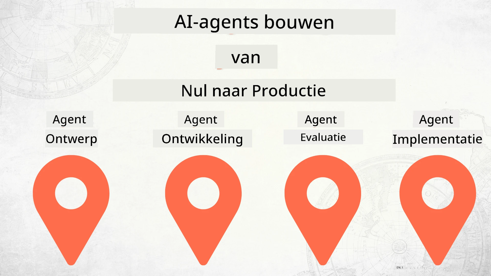

# AI-agents bouwen van nul tot productie



### 🌐 Meertalige ondersteuning

#### Ondersteund via GitHub Action (geautomatiseerd & altijd up-to-date)

<!-- CO-OP TRANSLATOR LANGUAGES TABLE START -->
[Arabisch](../ar/README.md) | [Bengaals](../bn/README.md) | [Bulgaars](../bg/README.md) | [Birmaans (Myanmar)](../my/README.md) | [Chinees (vereenvoudigd)](../zh-CN/README.md) | [Chinees (traditioneel, Hong Kong)](../zh-HK/README.md) | [Chinees (traditioneel, Macau)](../zh-MO/README.md) | [Chinees (traditioneel, Taiwan)](../zh-TW/README.md) | [Kroatisch](../hr/README.md) | [Tsjechisch](../cs/README.md) | [Deens](../da/README.md) | [Nederlands](./README.md) | [Ests](../et/README.md) | [Fins](../fi/README.md) | [Frans](../fr/README.md) | [Duits](../de/README.md) | [Grieks](../el/README.md) | [Hebreeuws](../he/README.md) | [Hindoestaans](../hi/README.md) | [Hongaars](../hu/README.md) | [Indonesisch](../id/README.md) | [Italiaans](../it/README.md) | [Japans](../ja/README.md) | [Kannada](../kn/README.md) | [Khmer](../km/README.md) | [Koreaans](../ko/README.md) | [Litouws](../lt/README.md) | [Maleis](../ms/README.md) | [Malayalam](../ml/README.md) | [Marathi](../mr/README.md) | [Nepalees](../ne/README.md) | [Nigeriaans Pidgin](../pcm/README.md) | [Noors](../no/README.md) | [Perzisch (Farsi)](../fa/README.md) | [Pools](../pl/README.md) | [Portugees (Brazilië)](../pt-BR/README.md) | [Portugees (Portugal)](../pt-PT/README.md) | [Punjabi (Gurmukhi)](../pa/README.md) | [Roemeens](../ro/README.md) | [Russisch](../ru/README.md) | [Servisch (Cyrillisch)](../sr/README.md) | [Slowaaks](../sk/README.md) | [Sloveens](../sl/README.md) | [Spaans](../es/README.md) | [Swahili](../sw/README.md) | [Zweeds](../sv/README.md) | [Tagalog (Filipijns)](../tl/README.md) | [Tamil](../ta/README.md) | [Telugu](../te/README.md) | [Thais](../th/README.md) | [Turks](../tr/README.md) | [Oekraïens](../uk/README.md) | [Urdu](../ur/README.md) | [Vietnamees](../vi/README.md)

> **Voorkeur om lokaal te clonen?**
>
> Deze repository bevat meer dan 50 taalvertalingen, wat de downloadgrootte aanzienlijk vergroot. Om te clonen zonder vertalingen, gebruik sparse checkout:
>
> **Bash / macOS / Linux:**
> ```bash
> git clone --filter=blob:none --sparse https://github.com/microsoft/Building-AI-Agents-From-Zero-To-Production.git
> cd Building-AI-Agents-From-Zero-To-Production
> git sparse-checkout set --no-cone '/*' '!translations' '!translated_images'
> ```
>
> **CMD (Windows):**
> ```cmd
> git clone --filter=blob:none --sparse https://github.com/microsoft/Building-AI-Agents-From-Zero-To-Production.git
> cd Building-AI-Agents-From-Zero-To-Production
> git sparse-checkout set --no-cone "/*" "!translations" "!translated_images"
> ```
>
> Dit geeft je alles wat je nodig hebt om de cursus te voltooien met een veel snellere download.
<!-- CO-OP TRANSLATOR LANGUAGES TABLE END -->

## Een cursus waarin je de basisprincipes van de levenscyclus van AI-agentontwikkeling leert

[](https://github.com/microsoft/Building-AI-Agents-From-Zero-To-Production/blob/master/LICENSE?WT.mc_id=academic-105485-koreyst)
[](https://GitHub.com/microsoft/Building-AI-Agents-From-Zero-To-Production/graphs/contributors/?WT.mc_id=academic-105485-koreyst)
[](https://GitHub.com/microsoft/Building-AI-Agents-From-Zero-To-Production/issues/?WT.mc_id=academic-105485-koreyst)
[](https://GitHub.com/microsoft/Building-AI-Agents-From-Zero-To-Production/pulls/?WT.mc_id=academic-105485-koreyst)
[](http://makeapullrequest.com?WT.mc_id=academic-105485-koreyst)

[](https://discord.gg/Kuaw3ktsu6)

## 🌱 Aan de slag

Deze cursus bevat lessen over de basisprincipes van het bouwen en implementeren van AI-agents.

Elke les bouwt voort op de vorige, dus we raden aan om bij het begin te starten en zo door te werken tot het einde.

Als je meer wilt verkennen over AI-agent onderwerpen, kun je de [AI Agents For Beginners Cursus](https://aka.ms/ai-agents-beginners) bekijken.

### Ontmoet andere lerenden, krijg antwoord op je vragen

Als je vastloopt of vragen hebt over het bouwen van AI-agents, sluit je dan aan bij ons speciale Discord-kanaal in de [Microsoft Foundry Discord](https://discord.gg/Kuaw3ktsu6).

### Wat je nodig hebt

Elke les heeft zijn eigen codevoorbeeld dat je lokaal kunt uitvoeren. Je kunt deze repo [forken](https://github.com/microsoft/Building-AI-Agents-From-Zero-To-Production/fork) om je eigen kopie te maken.

Deze cursus gebruikt momenteel het volgende:

- [Microsoft Agent Framework (MAF)](https://aka.ms/ai-agents-beginners/agent-framework)
- [Microsoft Foundry](https://azure.microsoft.com/products/ai-foundry) — een project met een geïmplementeerd **GPT-5 serie** model (bijvoorbeeld `gpt-5.1`). Gebruik **niet** de gepensioneerde GPT-4o / GPT-4.1 modellen.
- [Azure OpenAI Service](https://azure.microsoft.com/products/ai-foundry/models/openai)
- [Azure CLI](https://learn.microsoft.com/cli/azure/authenticate-azure-cli?view=azure-cli-latest) — log in met `az login` voordat je een voorbeeld uitvoert
- **Python 3.12 of hoger**

Zorg ervoor dat je toegang hebt tot deze diensten voordat je begint.

> **💰 Kosten & opruimen.** De hands-on lessen creëren echte Azure-resources — een Microsoft Foundry
> project, een model-implementatie, een vectoropslag, en (in lessen 4–6) gehoste agents en toolboxen.
> Deze kunnen kosten veroorzaken zolang ze bestaan. Als je een les — of de cursus — hebt voltooid, verwijder dan de
> resources die je niet meer nodig hebt. De eenvoudigste aanpak is om alles in een speciale resource
> groep te plaatsen en het hele groep te verwijderen als je klaar bent:
>
> ```bash
> az group delete --name <your-resource-group> --yes --no-wait
> ```
>
> Je kunt ook individuele agents, vectoropslagen en toolboxen verwijderen vanuit het Foundry-portaal.

> **Opmerking over modellen.** Deze cursus levert alle modellen via **Microsoft Foundry**. Het gebruikt **niet**
> *GitHub Modellen*, die worden uitgefaseerd op **30 juli 2026** — Microsoft Foundry is de
> officiële migratieroute. Als je oudere code hebt die GitHub Modellen aanroept, richt deze dan in op een Foundry
> model-implementatie in plaats daarvan.

Meer opties rond modelhosting en -diensten komen binnenkort.

## 🗃️ Lessen

| **Les**         | **Beschrijving**                                                                                  |
|--------------------|--------------------------------------------------------------------------------------------------|
| [Agentontwerp](./lesson-1-agent-design/README.md)       | Een introductie tot onze "Developer Onboarding" Agent Use Case en hoe je effectieve agents ontwerpt  |
| [Agentontwikkeling](./lesson-2-agent-development/README.md)  | Gebruikmakend van het Microsoft Agent Framework (MAF), bouw een set gespecialiseerde agents om nieuwe ontwikkelaars te helpen onboarding.       |
| [Agentevaluaties](./lesson-3-agent-evals/README.md)  | Gebruikmakend van Microsoft Foundry, ontdek hoe goed onze AI-agents presteren en hoe ze te verbeteren. |
| [Agentimplementatie](./lesson-4-agentdeployment/README.md)   | Gebruikmakend van Microsoft Foundry gehoste agents en OpenAI ChatKit, zie hoe je een AI-agent in productie kunt implementeren.       |
| [Productie gehoste agents](./lesson-5-hosted-agents-production/README.md)   | Breng een gehoste agent naar enterprise productie: Gehoste Agents vs Capability Hosts, breng-je-eigen opslag, geheugen en governance.       |
| [Microsoft Toolbox](./lesson-6-toolbox/README.md)   | Definieer tools één keer en beheer ze centraal: bouw een toolbox, gebruik deze vanuit een agent via één MCP-eindpunt en versieer tools veilig.       |
| [Multi-Agent & A2A](./lesson-7-multi-agent-a2a/README.md)   | Composeer agents als netwerkdiensten: exposeer een agent via het open Agent-to-Agent (A2A) protocol en consumeer een externe agent als gelijke.       |


## 🎒 Andere cursussen

Ons team maakt ook andere cursussen! Bekijk:

<!-- CO-OP TRANSLATOR OTHER COURSES START -->
### LangChain
[](https://aka.ms/langchain4j-for-beginners)
[](https://aka.ms/langchainjs-for-beginners?WT.mc_id=m365-94501-dwahlin)
[](https://github.com/microsoft/langchain-for-beginners?WT.mc_id=m365-94501-dwahlin)
---

### Azure / Edge / MCP / Agents
[](https://github.com/microsoft/AZD-for-beginners?WT.mc_id=academic-105485-koreyst)
[](https://github.com/microsoft/edgeai-for-beginners?WT.mc_id=academic-105485-koreyst)
[](https://github.com/microsoft/mcp-for-beginners?WT.mc_id=academic-105485-koreyst)
[](https://github.com/microsoft/ai-agents-for-beginners?WT.mc_id=academic-105485-koreyst)

---
 
### Generatieve AI-serie

[](https://github.com/microsoft/generative-ai-for-beginners?WT.mc_id=academic-105485-koreyst)
[-9333EA?style=for-the-badge&labelColor=E5E7EB&color=9333EA)](https://github.com/microsoft/Generative-AI-for-beginners-dotnet?WT.mc_id=academic-105485-koreyst)
[-C084FC?style=for-the-badge&labelColor=E5E7EB&color=C084FC)](https://github.com/microsoft/generative-ai-for-beginners-java?WT.mc_id=academic-105485-koreyst)
[-E879F9?style=for-the-badge&labelColor=E5E7EB&color=E879F9)](https://github.com/microsoft/generative-ai-with-javascript?WT.mc_id=academic-105485-koreyst)

---
 
### Kernleren
[](https://aka.ms/ml-beginners?WT.mc_id=academic-105485-koreyst)
[](https://aka.ms/datascience-beginners?WT.mc_id=academic-105485-koreyst)
[](https://aka.ms/ai-beginners?WT.mc_id=academic-105485-koreyst)
[](https://github.com/microsoft/Security-101?WT.mc_id=academic-96948-sayoung)
[](https://aka.ms/webdev-beginners?WT.mc_id=academic-105485-koreyst)
[](https://aka.ms/iot-beginners?WT.mc_id=academic-105485-koreyst)
[](https://github.com/microsoft/xr-development-for-beginners?WT.mc_id=academic-105485-koreyst)

---
 
### Copilot-serie
[](https://aka.ms/GitHubCopilotAI?WT.mc_id=academic-105485-koreyst)
[](https://github.com/microsoft/mastering-github-copilot-for-dotnet-csharp-developers?WT.mc_id=academic-105485-koreyst)
[](https://github.com/microsoft/CopilotAdventures?WT.mc_id=academic-105485-koreyst)
<!-- CO-OP TRANSLATOR OTHER COURSES END -->

## Bijdragen

Dit project verwelkomt bijdragen en suggesties. De meeste bijdragen vereisen dat je akkoord gaat met een
Contributor License Agreement (CLA) waarin je verklaart dat je het recht hebt om ons de rechten te verlenen
om je bijdrage te gebruiken. Voor meer informatie, bezoek <https://cla.opensource.microsoft.com>.

Wanneer je een pull request indient, bepaalt een CLA-bot automatisch of je een CLA moet verstrekken
en markeert de PR dienovereenkomstig (bijv. statuscontrole, opmerking). Volg gewoon de instructies
die door de bot worden gegeven. Dit hoef je maar één keer te doen voor alle repositories die onze CLA gebruiken.

Dit project heeft de [Microsoft Open Source Code of Conduct](https://opensource.microsoft.com/codeofconduct/) aangenomen.
Voor meer informatie, zie de [Code of Conduct FAQ](https://opensource.microsoft.com/codeofconduct/faq/) of
neem contact op met [opencode@microsoft.com](mailto:opencode@microsoft.com) voor aanvullende vragen of opmerkingen.

## Handelsmerken

Dit project kan handelsmerken of logo's bevatten van projecten, producten of diensten. Toegewezen gebruik van Microsoft
handelsmerken of logo's is onderhevig aan en moet voldoen aan
[Microsoft's Trademark & Brand Guidelines](https://www.microsoft.com/legal/intellectualproperty/trademarks/usage/general).
Het gebruik van Microsoft handelsmerken of logo's in gewijzigde versies van dit project mag geen verwarring veroorzaken of Microsoft-sponsoring impliceren.
Elk gebruik van merken of logo's van derden is onderhevig aan de beleidsregels van die derden.

## Hulp krijgen

Als je vastloopt of vragen hebt over het bouwen van AI-apps, sluit je aan bij:

[](https://discord.gg/Kuaw3ktsu6)

Als je productfeedback hebt of fouten tijdens het bouwen, bezoek:

[](https://aka.ms/foundry/forum)

---

<!-- CO-OP TRANSLATOR DISCLAIMER START -->
**Disclaimer**:
Dit document is vertaald met behulp van de AI vertaaldienst [Co-op Translator](https://github.com/Azure/co-op-translator). Hoewel we streven naar nauwkeurigheid, dient u er rekening mee te houden dat geautomatiseerde vertalingen fouten of onnauwkeurigheden kunnen bevatten. Het originele document in de oorspronkelijke taal moet worden beschouwd als de gezaghebbende bron. Voor kritieke informatie wordt professionele menselijke vertaling aanbevolen. Wij zijn niet aansprakelijk voor eventuele misverstanden of verkeerde interpretaties die voortvloeien uit het gebruik van deze vertaling.
<!-- CO-OP TRANSLATOR DISCLAIMER END -->