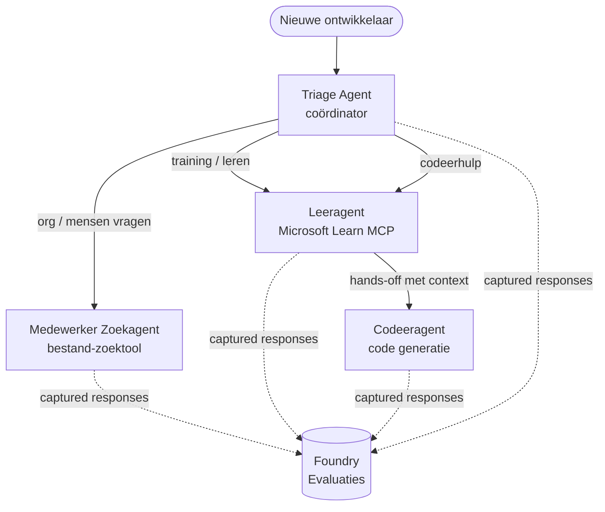

# Les 3: Agent Evaluaties met Microsoft Foundry

Welkom bij de derde les van de **"AI-agenten bouwen van nul tot productie"** cursus!

In [Les 2](../lesson-2-agent-development/README.md) heb je agenten gebouwd. In deze les leer je
hoe je een veel moeilijkere vraag beantwoordt: **zijn ze wel goed?** Een agent die
draait afleveren is makkelijk; weten of hij correct routeert, gegrond blijft in je data, en zijn
tools goed gebruikt, is wat een demo van een productiesysteem onderscheidt.

In deze les behandelen we:

- Waarom agent evaluatie belangrijk is en hoe het verschilt van traditionele testen
- Het verschil tussen **observeerbaarheid**, **smoketests**, en **evaluaties**
- De multi-agent workflow die we gaan meten
- De ingebouwde **Microsoft Foundry evaluatoren** (relevantie, gegrondheid, nauwkeurigheid tool-aanroepen, gebruik tool-output)
- Een stapsgewijze doorloop van de evaluatiepijplijn in [`agent-evals.py`](../../../lesson-3-agent-evals/agent-evals.py)
- Hoe je het uitvoert en de resultaten leest

---

## Waarom agenten evalueren?

Een traditionele unittests stelt dat `add(2, 2) == 4`. Agenten werken niet zo — dezelfde
prompt kan elke run anders geformuleerd zijn, tools kunnen in verschillende volgorden worden aangeroepen, en
"correct" is vaak een mate van juistheid in plaats van een boolean. Je kunt niet exact op strings testen.

In plaats daarvan evalueer je agenten langs **kwaliteitsdimensies** met model-gebaseerde *evaluatoren* (ook
wel "LLM-als-rechter" genoemd) plus deterministische controles op toolgebruik. Dit vertelt je bijvoorbeeld:

- Heeft het antwoord de vraag daadwerkelijk beantwoord? (**relevantie**)
- Wordt het antwoord ondersteund door de opgehaalde data, of heeft de agent iets verzonnen? (**gegrondheid**)
- Heeft de agent de juiste tool met de juiste argumenten aangeroepen? (**nauwkeurigheid tool-aanroepen**)
- Heeft de agent daadwerkelijk gebruik gemaakt van wat de tool teruggaf? (**gebruik tool-output**)

### Drie complementaire kwaliteitslagen

Dit zijn geen concurrerende technieken — een productie-agent gebruikt alle drie:

| Laag | Vraag die het beantwoordt | Kosten | Wanneer het draait | Behandeld in |
|-------|--------------------|------|--------------|------------|
| **Observeerbaarheid / tracing** | *Wat deed de agent, stap voor stap?* | Gratis (altijd aan) | Continu in productie | Deze les |
| **Smoketests** | *Is de agent bereikbaar en volgt hij zijn basis prompt?* | Goedkoop, seconden | Elke implementatie | [Les 4](../lesson-4-agentdeployment/README.md#smoke-testing-the-hosted-agent-ci-gate) |
| **Evaluaties** | *Hoe **goed** zijn de reacties?* | Langzamer, gemeten per modelgebruik | Op aanvraag / ’s nachts / pre-release | Deze les |

Smoketests beantwoorden "is het kapot gegaan?"; evaluaties beantwoorden "is het goed?". Je wil beide.

---

## Vereisten

1. Voltooide [Les 2](../lesson-2-agent-development/README.md) (agenten + vector store).
2. Een **Microsoft Foundry** project.
3. **Azure CLI** geverifieerd: `az login`.
4. **Python 3.12+** en de cursus afhankelijkheden geïnstalleerd:

   ```bash
   pip install -r ../requirements.txt
   ```


5. Omgevingsvariabelen (maak een `.env`-bestand in deze map of exporteer ze):

   | Variabele | Doel |
   |----------|---------|
   | `FOUNDRY_PROJECT_ENDPOINT` | Je Foundry project endpoint (`https://<account>.services.ai.azure.com/api/projects/<project>`). Wordt gelezen door de agents' `FoundryChatClient` **en** de evaluatiehulp. |
   | `FOUNDRY_MODEL` | Modeldeployment waarop de **agents** draaien (bijvoorbeeld `gpt-5.1`). |
   | `VECTOR_STORE_ID` | De vector store van de werknemersdirectory gemaakt in Les 2 |
   | `AZURE_AI_MODEL_DEPLOYMENT_NAME` | Modeldeployment gebruikt **door de evaluators** (standaard `FOUNDRY_MODEL`, dan `gpt-5.1`) |

> De agents gebruiken `FoundryChatClient`, die config leest van de `FOUNDRY_`-gepreficeerde
> variabelen (`FOUNDRY_PROJECT_ENDPOINT`, `FOUNDRY_MODEL`). De cloud evaluatiehulp
> gebruikt de `azure-ai-projects` SDK en valt terug op `FOUNDRY_PROJECT_ENDPOINT` als
> `AZURE_AI_PROJECT_ENDPOINT` niet is ingesteld — dus de twee `FOUNDRY_` variabelen zijn genoeg om
> de hele les uit te voeren.
>
> De evaluators zelf worden aangedreven door een model, dus `AZURE_AI_MODEL_DEPLOYMENT_NAME`
> bepaalt welke deployment het oordeel velt — dit hoeft niet hetzelfde model te zijn als dat jouw
> agents gebruiken.

---

## De workflow die we evalueren

Om iets te evalueren, moet je het eerst draaien. Deze les hergebruikt de **Developer Onboarding**
multi-agent workflow: een **triage** coördinator draagt over aan drie specialisten.



De workflow is gebouwd met de Microsoft Agent Framework's **handoff** orkestratie. Het kernidee
voor evaluatie is dat **elke beurt van een agent server-side wordt opgeslagen** en geïdentificeerd door een
`response_id`. Die IDs zijn wat we aan de evaluatieservice doorgeven.

---

## De evaluatie-pijplijn, stap voor stap

[`agent-evals.py`](../../../lesson-3-agent-evals/agent-evals.py) implementeert een zes-stappen pijplijn. Dit is wat elke stap doet
en waarom.

### Stap 1 — Draai de workflow en volg de response-ID's

De workflow wordt uitgevoerd met `run_stream(...)`, en terwijl events terugstromen registreert de code de
`response_id` en `conversation_id` die door elke agent zijn geproduceerd. Opgeslagen responses zijn het ruwe
materiaal voor evaluatie — je beoordeelt *echte* productie-achtige antwoorden, niet hergegenereerde
versies.

### Stap 2 — Vat samen wat opgenomen is

Een korte samenvatting print hoeveel responses elke agent geproduceerd heeft, zodat je kunt bevestigen dat de workflow
daadwerkelijk de agents heeft gebruikt die je wilt beoordelen.

### Stap 3 — Haal de laatste responses op

Voor elke agent wordt de laatste `response_id` opgehaald via de OpenAI-compatibele client van het project
(`project_client.get_openai_client().responses.retrieve(...)`) zodat je de
tekst kunt bekijken die beoordeeld gaat worden.

### Stap 4 — Maak de evaluatie aan

Er wordt een evaluatie aangemaakt met vier **ingebouwde Foundry evaluators**:

| Evaluator | `evaluator_name` | Wat het meet |
|-----------|------------------|------------------|

| Relevantie | `builtin.relevance` | Beantwoordt de reactie aan het verzoek van de gebruiker? |

| Gegrondheid | `builtin.groundedness` | Wordt de reactie ondersteund door opgehaalde/toolgegevens (niet gefantaseerd)? |
| Nauwkeurigheid van tool-aanroep | `builtin.tool_call_accuracy` | Werden de juiste tools aangeroepen met de juiste argumenten? |
| Gebruik van tool-uitvoer | `builtin.tool_output_utilization` | Heeft de agent daadwerkelijk de toolresultaten gebruikt in zijn antwoord? |

Elke evaluator wordt geïnitialiseerd met de implementatie genoemd in `AZURE_AI_MODEL_DEPLOYMENT_NAME`.

> **Waarom deze vier?** Relevantie en gegrondheid meten de *antwoordkwaliteit*; de twee tool
> evaluators meten *agentgedrag* — het deel dat traditionele NLP-metrieken volledig missen. Voor een
> tool-gebruikend, multi-agent systeem zijn tool-metrieken vaak waar de echte regressies verbergen.

### Stap 5 — Voer de evaluatie uit

De vastgelegde `response_id`s worden doorgegeven aan `evals.runs.create(...)` als gegevensbron. De
service speelt elke opgeslagen reactie opnieuw af via elke evaluator.

### Stap 6 — Monitor en lees resultaten

De code vraagt de run op totdat deze `completed` of `failed` is, en print vervolgens de resultaat-aantallen en een
**`report_url`** — een diepgaande link naar het Foundry-portaal waar je per-metriek scores,
slagen/falen tellingen en individuele beoordeelde reacties kunt inspecteren.

---

## Voer het uit

```bash
cd lesson-3-agent-evals
python agent-evals.py
```

Standaard evalueert het de eerste voorbeeldvraag
(`"Ik ben nieuw hier! Heeft hier iemand bij Microsoft gewerkt?"`). Twee extra multi-intent voorbeeldvragen
zijn opgenomen in `run_evaluation_workflow()` — wissel de `query` variabele om routing-scenario's te proberen
die meer agenten in één run betrekken.

Verwachte console-uitvoer:

```
Step 1: Running Developer Onboarding Workflow
Step 2: Response Data Summary
Step 3: Fetching Agent Responses
Step 4: Creating Evaluation
Step 5: Running Evaluation
Step 6: Monitoring Evaluation
  Status: running ...
  Evaluation completed successfully
  Report URL: https://...   <-- open this in the Foundry portal
```

---

## Observeerbaarheid en tracing

Evaluaties vertellen je *hoe goed* de reacties waren; **observeerbaarheid** vertelt je *wat er gebeurde*
om ze te produceren — elke agent-sprong, tool-aanroep, token-telling en vertraging. In Microsoft Foundry,
sturen agent-runs OpenTelemetry-traces uit die je in het portaal kunt bekijken, en het Agent Framework kan
ze exporteren naar Azure Monitor / Application Insights met één enkele aanroep:

```python
from agent_framework.foundry import FoundryChatClient

client = FoundryChatClient()
client.configure_azure_monitor()   # exporteer sporen + statistieken naar Application Insights
```

Gebruik tracing om een slechte evaluatiescore te **debuggen**: wanneer gegrondheid daalt, toont de trace
of de bestand-zoektool niks teruggaf, of data teruggaf die de agent vervolgens negeerde (wat precies is
wat het gebruik van tool-uitvoer beoordeelt).

---

## Van "runs" naar "goed": hoe je dit in de praktijk gebruikt

- **Pre-release poort.** Voer evaluaties uit op een vaste set representatieve vragen voordat je
  een nieuwe prompt of model promoot. Vergelijk scores met de vorige versie — behandel een daling als een
  regressie.
- **Nachtelijke kwaliteitsindicator.** Plan de evaluatie om afwijkingen door data- of afhankelijkheids-
  wijzigingen te detecteren.
- **Combineer met smoke tests.** De [Les 4 smoke test](../lesson-4-agentdeployment/README.md#smoke-testing-the-hosted-agent-ci-gate)
  is jouw snelle poort per implementatie; evaluaties zijn de tragere, diepere kwaliteitscontrole. Voer de goedkope
  uit bij elke merge en de duurdere volgens schema of vóór release.

---

## Modernisatie-opmerking

Dit voorbeeld wordt gemigreerd naar de huidige Microsoft Agent Framework Foundry API 
(`agent_framework.foundry`). Als je de code bijwerkt, zie dan de repository-root
[`MIGRATION-GUIDE.md`](../MIGRATION-GUIDE.md) voor de geverifieerde voor/na import- en client-
mappings (bijvoorbeeld `AzureAIClient` -> `FoundryChatClient`, en constructie van hosted-tool via
`client.get_file_search_tool(...)` / `client.get_mcp_tool(...)`). De evaluatieconcepten en
de zesstappenpipeline hierboven blijven ongewijzigd door die migratie.

---

## Bronnen

- [Generatieve AI-modellen en -toepassingen evalueren (Microsoft Learn)](https://learn.microsoft.com/en-us/azure/ai-foundry/concepts/evaluation-approach-gen-ai)
- [Ingebouwde evaluators voor generatieve AI](https://learn.microsoft.com/en-us/azure/ai-foundry/concepts/evaluation-evaluators/agent-evaluators)
- [Observeerbaarheid in Microsoft Foundry](https://learn.microsoft.com/en-us/azure/ai-foundry/concepts/observability)
- [Microsoft Agent Framework](https://github.com/microsoft/agent-framework)
- [Agent overdracht orchestratie](https://learn.microsoft.com/en-us/agent-framework/workflows/orchestrations/handoff)

---

<!-- CO-OP TRANSLATOR DISCLAIMER START -->
**Disclaimer**:
Dit document is vertaald met behulp van de AI vertaaldienst [Co-op Translator](https://github.com/Azure/co-op-translator). Hoewel we streven naar nauwkeurigheid, dient u er rekening mee te houden dat geautomatiseerde vertalingen fouten of onnauwkeurigheden kunnen bevatten. Het originele document in de oorspronkelijke taal moet worden beschouwd als de gezaghebbende bron. Voor kritieke informatie wordt professionele menselijke vertaling aanbevolen. Wij zijn niet aansprakelijk voor eventuele misverstanden of verkeerde interpretaties die voortvloeien uit het gebruik van deze vertaling.
<!-- CO-OP TRANSLATOR DISCLAIMER END -->