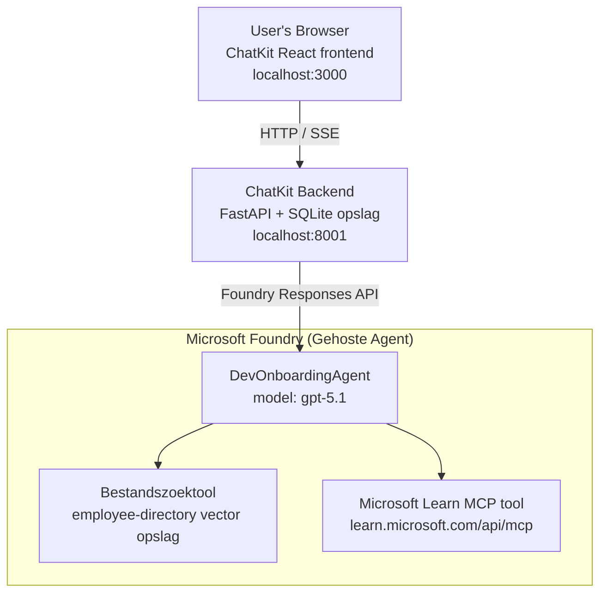

# Les 4: Agent Implementatie met Microsoft Foundry Gehoste Agenten + ChatKit

Deze les laat zien hoe je een tool-gebruikende agent kunt implementeren naar Microsoft Foundry als een gehoste agent en een ChatKit-gebaseerde frontend maakt om ermee te communiceren.

## Architectuur

De gehoste agent is een **enkele `DevOnboardingAgent`** (draait op `gpt-5.1`) die vragen over ontwikkelaar-onboarding beantwoordt met behulp van twee gehoste tools: een **Bestand Zoeken** tool over de employee-directory vector store, en de **Microsoft Learn MCP** tool. Een ChatKit React frontend communiceert met een FastAPI backend, die de agent aanroept via de Foundry **Responses API**.



## Voorwaarden

1. **Microsoft Foundry Project** in de regio Noord-Centraal VS
2. **Azure CLI** geauthenticeerd (`az login`)
3. **Azure Developer CLI** (`azd`) geïnstalleerd
4. **Python 3.12+** en **Node.js 18+**
5. **Vector Store** gemaakt met medewerkersdata

## Snelstart

### 1. Stel Omgevingsvariabelen in

```bash
cd lesson-4-agentdeployment
cp .env.example .env
# Bewerk .env met uw Microsoft Foundry projectgegevens
```

### 2. Implementeer de Gehoste Agent

**Optie A: Met Azure Developer CLI (Aanbevolen)**

```bash
cd hosted-agent
azd auth login
azd agent deploy
```

**Optie B: Met Docker + Azure Container Registry**

```bash
cd hosted-agent

# Bouw de container
docker build -t developer-onboarding-agent:latest .

# Label voor ACR
docker tag developer-onboarding-agent:latest <your-acr>.azurecr.io/developer-onboarding-agent:latest

# Push naar ACR
az acr login --name <your-acr>
docker push <your-acr>.azurecr.io/developer-onboarding-agent:latest

# Implementeer via Microsoft Foundry-portaal of SDK
```

### 3. Start de ChatKit Backend

```bash
cd chatkit-server
python -m venv .venv
source .venv/bin/activate  # Op Windows: .venv\Scripts\activate
pip install -r requirements.txt
python app.py
```

De server start op `http://localhost:8001`

### 4. Start de ChatKit Frontend

```bash
cd chatkit-server/frontend
npm install
npm run dev
```

De frontend start op `http://localhost:3000`

### 5. Test de Applicatie

Open `http://localhost:3000` in je browser en probeer deze vragen:

**Medewerker Zoeken:**
- "Ik ben nieuw hier! Heeft iemand bij Microsoft gewerkt?"
- "Wie heeft ervaring met Azure Functions?"

**Leermaterialen:**
- "Maak een leertraject voor Kubernetes"
- "Welke certificeringen moet ik behalen voor cloudarchitectuur?"

**Codeerhulp:**
- "Help me met het schrijven van Python-code voor verbinding maken met CosmosDB"
- "Laat me zien hoe ik een Azure Function maak"

**Multi-Agent Vragen:**
- "Ik begin als cloud engineer. Met wie moet ik contact maken en wat moet ik leren?"

## Projectstructuur

```
lesson-4-agentdeployment/
├── .env.example                 # Environment variables template
├── implementation-plan.md       # Detailed implementation guide
├── README.md                    # This file
├── hosted-agent/               # Microsoft Foundry hosted agent
│   ├── main.py                 # Multi-agent workflow implementation
│   ├── requirements.txt        # Python dependencies
│   ├── Dockerfile              # Container definition
│   └── agent.yaml              # Agent deployment configuration
└── chatkit-server/             # ChatKit server application
    ├── app.py                  # FastAPI backend
    ├── store.py                # SQLite persistence layer
    ├── requirements.txt        # Python dependencies
    └── frontend/               # React frontend
        ├── package.json
        ├── vite.config.ts
        ├── tsconfig.json
        ├── index.html
        └── src/
            ├── main.tsx
            ├── App.tsx
            ├── App.css
            └── index.css
```

## De Agent en Zijn Tools

De gehoste agent is een **enkele agent** (`DevOnboardingAgent`, gedefinieerd in `hosted-agent/main.py`) die drie onboarding-domeinen afhandelt. In plaats van aparte sub-agents te orkestreren, biedt hij elke functionaliteit als een tool aan (of vertrouwt rechtstreeks op het model):

| Functionaliteit | Hoe het wordt afgehandeld | Tool |
|-----------|------------------|------|
| **Medewerker zoeken & connecties** | Foundry gehost Bestand Zoeken over de employee-directory vector store | `client.get_file_search_tool(vector_store_ids=[...])` |
| **Leren & training** | Microsoft Learn MCP server (gehoste MCP tool) | `client.get_mcp_tool(url="https://learn.microsoft.com/api/mcp")` |
| **Codeerhulp** | Afgehandeld door het `gpt-5.1` model direct — geen externe tool | — |

De agent wordt gecreëerd met `client.as_agent(name="DevOnboardingAgent", instructions=..., tools=[file_search_tool, learn_mcp_tool])` en gehost met `from_agent_framework(agent).run()`.

> **Ontwerpopmerking.** Eerdere versies van deze les gebruikten een `HandoffBuilder` multi-agent workflow (Triage → specialisten). De geleverde agent is een enkele tool-gebruikende agent, wat eenvoudiger is om te implementeren en te begrijpen voor onboarding-achtige Q&A. Voor een voorbeeld van multi-agent orkestratie en overdrachten, zie Les 2 en Les 3.

## Smoke Testing van de Gehoste Agent (CI Poort)

Het succesvol implementeren van een gehoste agent bewijst alleen dat het controlevlak de
definitie accepteerde — het bewijst **niet** dat de agent daadwerkelijk antwoordt. Een ontbrekende afhankelijkheid,
verkeerde modelroutering, of een verlopen verbinding kan een groene-maar-stille agent achterlaten.

Deze les levert een lichte **smoke test** die fungeert als een snelle, goedkope post-implementatie
poort. Het gebruikt de [AI Smoke Test](https://github.com/marketplace/actions/ai-smoke-test)
GitHub Action om prompts te POSTen naar het Foundry **Responses** eindpunt van de agent
(`POST {project_endpoint}/agents/{agent_name}/endpoint/protocols/openai/responses`)
en controleert de teruggegeven tekst. Het detecteert mislukte implementaties, authenticatie-regressies,
drift in systeem-prompt, en threading-breuken binnen seconden.

> Smoke tests zijn **niet** een vervanging voor de volledige evaluaties in
> [Les 3](../lesson-3-agent-evals/README.md) — ze zijn aanvullend. Smoke tests
> beantwoorden *"is de agent bereikbaar, reageert hij, en volgt hij basis prompt verwachtingen?"*;
> evaluaties beantwoorden *"hoe goed is het antwoord?"*. Voer de goedkope poort uit bij elke implementatie.

### Wat er getest wordt

De catalogus staat in [`hosted-agent/tests/smoke-tests.json`](../../../lesson-4-agentdeployment/hosted-agent/tests/smoke-tests.json)
en test de drie domeinen van de agent plus prompt-naleving en multi-turn threading:

| Test | Wat het verifieert |
|------|------------------|
| `reachability` | Agent reageert met niet-lege, relevante tekst |
| `employee-search` | Bestand-zoek domein retourneert een geldige `200` (antwoord is data-afhankelijk) |
| `learning-path` | Leer-domein echoot het onderwerp en levert een traject-achtig antwoord |
| `coding-assistance` | Codeer-domein levert een code-vormig Python antwoord |
| `prompt-adherence-offtopic` | Off-topic verzoek wordt omgeleid, niet gedetailleerd beantwoord |
| `threading-turn-1/2` | Gespreksstatus wordt bewaard over beurten via `previous_response_id` |

### Uitvoeren in CI

De workflow in [`.github/workflows/smoke-test-hosted-agent.yml`](../../../.github/workflows/smoke-test-hosted-agent.yml)
bevat twee jobs:

- **`static`** — een snelle, niet-Azure poort die draait bij elke pull request en push:
  het compileert alle Python-bronnen (`py_compile`) en controleert Markdown links. Geen geheimen
  nodig, dus het werkt op fork PR's.
- **`smoke`** — de Azure-verbonden smoke test hieronder. Het draait op verzoek
  (Actions → **Agent CI (static + smoke)** → Run workflow) en kan na je
  implementatieworkflow worden gekoppeld.

Configureer deze repository **variabelen** en **geheimen** voor de smoke job:

| Soort | Naam | Waarde |
|------|------|-------|
| Variabele | `FOUNDRY_PROJECT_ENDPOINT` | `https://<account>.services.ai.azure.com/api/projects/<project>` |
| Variabele | `HOSTED_AGENT_NAME` | Naam van de gedeployde agent (bijv. `dev-onboarding` — moet overeenkomen met je implementatie) |
| Geheim | `AZURE_CLIENT_ID` / `AZURE_TENANT_ID` / `AZURE_SUBSCRIPTION_ID` | OIDC federated identity voor `azure/login` |

De runner-identiteit heeft de **`Azure AI User`** rol nodig op **Foundry project scope** zodat het
de Responses (en conversations) data-vlak eindpunten kan aanroepen. Ken deze toe met:

```bash
az role assignment create \
  --assignee <object-id-or-appId-of-runner-identity> \
  --role "Azure AI User" \
  --scope "/subscriptions/<sub>/resourceGroups/<rg>/providers/Microsoft.CognitiveServices/accounts/<account>/projects/<project>"
```

### Voer het lokaal uit

Je kunt dezelfde catalogus draaien voor het pushen. Verkrijg een data-vlak token gescopeerd op
`https://ai.azure.com/` en wijs de runner naar je implementatie:

```bash
# Audience MOET https://ai.azure.com/ zijn (tokens van cognitiveservices.azure.com worden geweigerd)
export FOUNDRY_TOKEN=$(az account get-access-token --resource https://ai.azure.com/ --query accessToken -o tsv)

git clone https://github.com/JFolberth/ai-smoketest && cd ai-smoketest
python runner.py \
  --project-endpoint "https://<account>.services.ai.azure.com/api/projects/<project>" \
  --agent-name dev-onboarding \
  --tests-file ../lesson-4-agentdeployment/hosted-agent/tests/smoke-tests.json
```

Exit-codes: `0` alles geslaagd, `1` een assertie faalde, `2` runner-fout (foute catalogus / token).

## Problemen oplossen

### Agent reageert niet
- Controleer of de gehoste agent is geïmplementeerd en draait in Microsoft Foundry
- Controleer dat `HOSTED_AGENT_NAME` en `HOSTED_AGENT_VERSION` overeenkomen met je implementatie

### Vector store fouten
- Zorg dat `VECTOR_STORE_ID` correct is ingesteld
- Controleer of de vector store de medewerkersdata bevat

### Authenticatiefouten
- Voer `az login` uit om de inloggegevens te verversen
- Zorg dat je toegang hebt tot het Microsoft Foundry project

## Bronnen

- [Microsoft Foundry Hosted Agents Documentatie](https://learn.microsoft.com/en-us/azure/ai-foundry/agents/concepts/hosted-agents)
- [Microsoft Agent Framework](https://github.com/microsoft/agent-framework)
- [ChatKit Integratie Voorbeeld](https://github.com/microsoft/agent-framework/tree/main/python/samples/demos/chatkit-integration)
- [Azure Developer CLI](https://learn.microsoft.com/en-us/azure/developer/azure-developer-cli/overview)
- [AI Smoke Test GitHub Action](https://github.com/marketplace/actions/ai-smoke-test)
- [Smoke Test Microsoft Foundry Agents met GitHub Actions (blog)](https://techcommunity.microsoft.com/blog/azuredevcommunityblog/smoke-test-microsoft-foundry-agents-with-github-actions/4531912)

---

## Volgende Stappen

Je agent draait op Microsoft-beheerde infrastructuur. Om deze naar productie op ondernemingsniveau te brengen —
controle over waar de data woont (data-soevereiniteit, privé-netwerken, bring-your-own Azure
Cosmos DB / Storage / AI Search) en het beheren van zijn tools — ga verder met
**[Les 5: Productie Gehoste Agenten](../lesson-5-hosted-agents-production/README.md)**, die
het cruciale verschil uitlegt tussen **Gehoste Agenten** en **Capability Hosts**.

---

<!-- CO-OP TRANSLATOR DISCLAIMER START -->
**Disclaimer**:
Dit document is vertaald met behulp van de AI vertaaldienst [Co-op Translator](https://github.com/Azure/co-op-translator). Hoewel we streven naar nauwkeurigheid, dient u er rekening mee te houden dat geautomatiseerde vertalingen fouten of onnauwkeurigheden kunnen bevatten. Het originele document in de oorspronkelijke taal moet worden beschouwd als de gezaghebbende bron. Voor kritieke informatie wordt professionele menselijke vertaling aanbevolen. Wij zijn niet aansprakelijk voor eventuele misverstanden of verkeerde interpretaties die voortvloeien uit het gebruik van deze vertaling.
<!-- CO-OP TRANSLATOR DISCLAIMER END -->