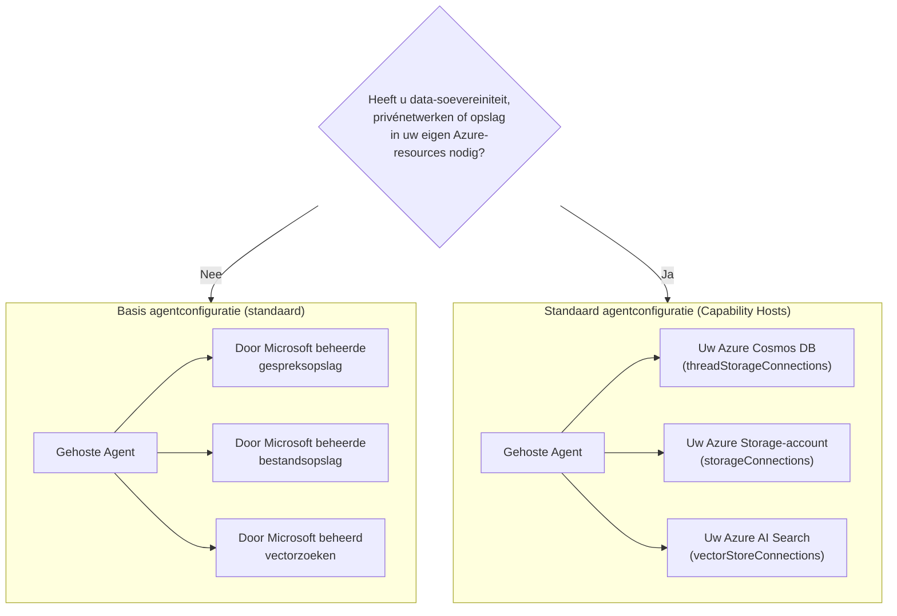

# Les 5: Productie Gehoste Agents — Opslag, Geheugen & Bestuur

In [Les 4](../lesson-4-agentdeployment/README.md) heb je de Developer Onboarding
Agent uitgerold als een **Microsoft Foundry Gehoste Agent** en er een ChatKit frontend voor geplaatst. Die
les beantwoordde *"hoe lever ik een agent op?"*. Deze les beantwoordt de vragen die volgen
in een onderneming: **Waar wordt mijn agent's data opgeslagen? Wie beheert die? Hoe voldoe ik aan naleving,
netwerk- en bestuursvereisten?**

Het belangrijkste idee in deze les is het verschil tussen een **Gehoste Agent** en een
**Capaciteitshost** — twee concepten die gemakkelijk te verwarren zijn maar fundamenteel verschillende
problemen oplossen.

## Leerdoelen

Aan het eind van deze les kun je:

- Uitleggen wat een **Gehoste Agent** je biedt (Microsoft-beheerde uitvoering) en wat niet.
- Uitleggen wat een **Capaciteitshost** is en precies wanneer je deze nodig hebt.
- Kiezen tussen **basis agent setup** (Microsoft-beheerde opslag) en **standaard agent setup**
  (breng je eigen Azure-resources mee).
- Begrijpen hoe **gespreksgeschiedenis, bestandsuploads en vector stores** worden opgeslagen, en hoe
  je ze kunt omleiden naar je eigen Azure Cosmos DB, Azure Storage en Azure AI Search.
- Toepassen van bestuurscontroles: data-soevereiniteit, privé-netwerken en **Hosted MCP tool goedkeuring**.

---

## Vereisten

1. Voltooide [Les 4](../lesson-4-agentdeployment/README.md) — je hebt een gehoste agent uitgerold.
2. Een **Microsoft Foundry** project, en een Azure-account met permissie om resources te creëren
   (Cosmos DB, Storage, Azure AI Search) en rollen toe te wijzen in de subscription/resourcegroep.
3. **Azure CLI** geverifieerd: `az login` (en `az account set --subscription <id>` als je
   meer dan één subscription hebt).
4. **Azure Developer CLI** (`azd`) geïnstalleerd — wordt gebruikt voor de standaard-setup provisioning flow.
5. **Python 3.12+** met de cursusafhankelijkheden geïnstalleerd (`pip install -r ../requirements.txt`).
6. Een actuele, niet-uitgefaseerde modeldeployment (bijvoorbeeld `gpt-5.1`). Vermijd uitgerangeerde GPT-4o / GPT-4.1.

> Deze les is vooral conceptueel en gericht op control plane. Je kunt hem van begin tot eind lezen zonder
> iets te provisionen, en daarna de praktische oefeningen gebruiken wanneer je klaar bent voor een
> standaard setup.

---

## 1. Gehoste Agents: wat Foundry voor je beheert

Een **Gehoste Agent** is een agent waarvan de *uitvoeringsomgeving* volledig wordt beheerd door Microsoft
Foundry Agent Service. Wanneer je een gehoste agent uitrolt (zoals je deed in Les 4), levert Foundry:

- **Compute** — de runtime die je agent code en tools uitvoert.
- **Schaalvergroting** — replica's schalen op en neer met de belasting (zie `agent.yaml` `scale` in Les 4).
- **Identiteit** — een beheerde identiteit voor de agent, zodat deze authenticatie naar Azure heeft zonder geheimen.
- **Observeerbaarheid** — tracing en telemetrie (zie het observeerbaarheidsgedeelte van Les 3).
- **Sessiebeheer** — threads/gesprekken, zodat multi-turn chats eerdere beurten "onthouden".

> **Belangrijk punt:** Je hoeft **geen** Capaciteitshost te configureren alleen om een Gehoste
> Agent te *laten draaien*. Een gehoste agent werkt direct uit de doos op Microsoft-beheerde infrastructuur.

---

## 2. Gehoste Agents vs Capaciteitshosts

**Gehoste Agents en Capaciteitshosts lossen verschillende problemen op.**

**Gehoste Agents** bieden de Microsoft-beheerde uitvoeringomgeving, inclusief compute, schaalvergroting,
identiteit, observeerbaarheid en sessiebeheer. Je hebt **geen** Capaciteitshosts nodig alleen om
een Gehoste Agent te draaien.

**Capaciteitshosts** zijn alleen vereist wanneer je Agent Service wilt laten gebruiken van **door klant beheerde
resources** in plaats van Microsoft-beheerde opslag. Als je tevreden bent met de standaard
Microsoft-beheerde opslag, vectorzoekfunctie en gespreksopslag, is **geen Capaciteitshost
configuratie vereist.**

Als je organisatie vereisten heeft voor **data-soevereiniteit, privé-netwerken, nalevingscontroles of
opslag in je eigen Azure Cosmos DB, Azure Storage Account en Azure AI Search resources**, dan
configureer je Capaciteitshosts om Agent Service te verbinden met die resources.

In één zin:

> Een **Gehoste Agent** gaat over *waar je agent draait*. Een **Capaciteitshost** gaat over *waar je
> agent's data zich bevindt*.

| Aspect | Gehoste Agent | Capaciteitshost |
|--------|----------------|-----------------|
| Compute / schaalvergroting / identiteit | ✅ Geleverd | — |
| Observeerbaarheid / tracing | ✅ Geleverd | — |
| Gespreks- & threadsessiebeheer | ✅ Geleverd | Verwijst door *waar het wordt opgeslagen* |
| Waar gespreksgeschiedenis is opgeslagen | Standaard Microsoft-beheerd | Je Azure Cosmos DB |
| Waar geüploade bestanden zijn opgeslagen | Standaard Microsoft-beheerd | Je Azure Storage Account |
| Waar vector embeddings zijn opgeslagen | Standaard Microsoft-beheerd | Je Azure AI Search |
| Vereist om een agent te draaien? | ✅ Ja (het *is* de agent host) | ❌ Nee — optioneel |
| Vereist voor data-soevereiniteit / BYO opslag? | ❌ Niet voldoende alleen | ✅ Ja |

---

## 3. Basis vs Standaard agent setup

Foundry beschrijft de twee data configuraties als **basis** en **standaard** agent setup.



### Wanneer blijven bij basis setup (geen Capaciteitshost)

- Ontwikkeling, prototyping en testen.
- Interne tools waar Microsoft-beheerde opslag voldoet aan jouw datahandlingsbeleid.
- Je wilt het snelste pad naar een werkende agent met zo min mogelijk infrastructuur.

### Wanneer heb je standaard setup nodig (Capaciteitshosts)

- **Data-soevereiniteit** — alle agentdata moet binnen jouw Azure-abonnement/regio blijven.
- **Beveiligingscontrole** — je moet je eigen opslagaccounts, databases en zoekdiensten gebruiken.
- **Naleving** — je hebt regelgevende of organisatorische vereisten over waar data woont.
- **Privé-netwerken** — verkeer moet binnen je virtuele netwerk blijven (breng je eigen virtuele netwerk mee).

> **Aanbeveling van Microsoft:** gebruik *aparte* Foundry accounts/projecten voor standaard vs
> basis setup. Vermijd het mengen van setup types binnen hetzelfde Foundry account.

---

## 4. Hoe Capaciteitshosts werken

Een **Capaciteitshost** is een subresource die je configureert op **twee niveaus**: het Foundry **account**
en het Foundry **project**. Het vertelt Agent Service waar agentdata opgeslagen en verwerkt moet worden:
gespreksgeschiedenis, bestandsuploads en vectorstores.

Twee regels zijn het belangrijkst:

1. **Account vóór project.** Je kunt geen capaciteitshost voor een project aanmaken tenzij een
   accountniveau capaciteitshost al bestaat.

2. **Geen overerving van configuratie.** De **project** capability host is wat Agent Service
   daadwerkelijk leest om te bepalen welke opslag/conversatie/vector resources gebruikt worden. Account-niveau
   verbindingen worden *niet* automatisch door een project gebruikt — de project capability host moet
   deze expliciet refereren.

### Verbindingen die een standaard configuratie nodig heeft

Capability hosts refereren **verbindingen** (gemaakt in je Foundry account/project) die wijzen naar
jouw Azure resources:

| Eigenschap capability host | Slaat op | Jouw Azure resource |
|--------------------------|--------|---------------------|
| `threadStorageConnections` | Agentdefinities + conversatiegeschiedenis | Azure Cosmos DB |
| `storageConnections` | Bestandsuploads / blob opslag | Azure Storage Account |
| `vectorStoreConnections` | Vector embeddings voor ophalen/zoeken | Azure AI Search |
| `aiServicesConnections` *(optioneel)* | Je eigen modeldeployments | Azure OpenAI |

Elke verbinding moet `authType`, `category`, `target` (de service **endpoint URL**, niet de
resource-ID), en `metadata.ResourceId` (de volledige Azure resource-ID) ingevuld hebben, anders kan Agent Service
de resource niet aan runtime resolven.

### Configureren van de capability hosts (control plane)

Capability hosts worden momenteel beheerd via de **Azure Resource Manager REST API** (er is nog geen
SDK voor capability-host beheer). Maak eerst de **account** capability host aan:

```http
PUT https://management.azure.com/subscriptions/{subscriptionId}/resourceGroups/{rg}/providers/Microsoft.CognitiveServices/accounts/{account}/capabilityHosts/{name}?api-version=2025-06-01

{
  "properties": { "capabilityHostKind": "Agents" }
}
```

Maak daarna de **project** capability host die jouw verbindingen verwijst:

```http
PUT https://management.azure.com/subscriptions/{subscriptionId}/resourceGroups/{rg}/providers/Microsoft.CognitiveServices/accounts/{account}/projects/{project}/capabilityHosts/{name}?api-version=2025-06-01

{
  "properties": {
    "capabilityHostKind": "Agents",
    "threadStorageConnections": ["my-cosmosdb-connection"],
    "vectorStoreConnections":  ["my-ai-search-connection"],
    "storageConnections":      ["my-storage-connection"]
  }
}
```

> **Beperkingen om te onthouden:**
> - **Één capability host per scope.** Een tweede op dezelfde scope geeft `409 Conflict`.
> - **Geen updates.** Om configuratie aan te passen moet je de capability host **verwijderen en opnieuw aanmaken**.
> - **Verwijderen is destructief.** Het verwijderen van een capability host verwijdert agents' toegang tot de bestanden,
>   conversaties en vector stores waar deze naar verwees.

### Verifieer dat het werkt

Na configuratie, voer een testconversatie uit en bevestig dat:

- Conversaties verschijnen in **jouw Azure Cosmos DB**.
- Geüploade bestanden verschijnen in **jouw Azure Storage account**.
- Vectorgegevens verschijnen in **jouw Azure AI Search index**.

---

## 5. Geheugen & contextbeheer

"Sessiebeheer" (een Hosted Agent feature) en "waar threads worden opgeslagen" (een Capability Host
verantwoordelijkheid) combineren om jouw agent **geheugen** te geven:

- Een **thread** (conversatie) houdt de geordende beurten van een chat vast. De Responses API linkt
  gesprekken aan elkaar via `previous_response_id` (je zag dit in de rooktests van Les 4).
- Bij **basisconfiguratie** woont de thread/conversatie status in Microsoft-beheerde opslag.
- Bij **standaardconfiguratie** wordt dezelfde status opgeslagen in **jouw Azure Cosmos DB** via
  `threadStorageConnections` — wat je een duurzame, doorzoekbare, soevereine conversatiegeschiedenis geeft.

Dit is het verschil tussen een agent die "binnen een sessie onthoudt" en een enterprise
systeem waar elke conversatie wordt bewaard binnen jouw eigen compliancegrens.

---

## 6. Governance & beveiligingschecklist

Gebruik deze checklist bij het promoten van een hosted agent van prototype naar productie:

- [ ] **Bepaal basis vs standaard setup** met de vragen in §3 — documenteer de beslissing.
- [ ] **Data-soevereiniteit:** indien nodig, configureer Capability Hosts zodat conversatiegeschiedenis
      (Cosmos DB), bestanden (Storage) en vectoren (AI Search) binnen jouw abonnement/ regio blijven.
- [ ] **Privé netwerken:** bij standaard setup, beperk verkeer met Bring Your Own Virtual
      Network zodat data jouw netwerk niet kan verlaten (helpt datalekken voorkomen).
- [ ] **RBAC:** verleen minimale rechten. Capability hosts maken vereist **Contributor** op het
      Foundry-account; toegang toewijzen aan je Azure resources vereist **User Access Administrator**
      of **Owner**.
- [ ] **Hosted MCP tool governance:** evalueer elke MCP server die jouw agent kan aanroepen en stel een
      **goedkeuringsmodus** in (zie §7). Stel nooit een niet-beoordeelde externe tool open aan een productieagent.
- [ ] **Observeerbaarheid:** controleer of tracing/telemetrie aan staat (Les 3) zodat je tool-aanroepen kunt auditen.
- [ ] **Kosten:** BYO resources (Cosmos DB, AI Search, Storage) worden gefactureerd aan *jouw* abonnement —
      monitor en schaal ze. Basissetup vouwt opslag in de beheerde service.

---

## 7. Hosted MCP tools & goedkeuringsworkflows

De Developer Onboarding Agent in Les 4 gebruikt al een **Hosted MCP tool** — de
[Microsoft Learn MCP server](https://learn.microsoft.com/api/mcp) — toegevoegd met:

```python
client.get_mcp_tool(
    name="Microsoft Learn MCP",
    url="https://learn.microsoft.com/api/mcp",
    approval_mode="never_require",
)
```

De **Model Context Protocol (MCP)** is een open standaard die een agent toestaat externe tools te ontdekken en aan te roepen
via een uniforme interface. **Hosted MCP tools** laten Foundry een MCP server op
naam van de agent aanroepen. Twee governance hefboompunten zijn relevant in productie:

- **`approval_mode`** — bepaalt of een mens/oproeppunt elk toolgebruik moet goedkeuren.
  - `never_require` is handig voor een vertrouwde, read-only server zoals Microsoft Learn.
  - Voor servers die **schrijven** of gevoelige systemen bereiken, vereist goedkeuring zodat een oproep
    wordt beoordeeld voordat die uitvoert. Dit is jouw **goedkeuringsworkflow**.
- **Serverallowlisting** — maak alleen verbinding met MCP servers die je hebt geëvalueerd en vertrouwt. Behandel een MCP
  URL als elke andere productieafhankelijkheid.

> **Probeer het:** wijzig de `approval_mode` van de Les 4 agent naar ‘vereist goedkeuring’, herdeploy en
> observeer hoe toolaanroepen nu pauzeren voor bevestiging voordat ze worden uitgevoerd.

---

## Hands-on oefeningen

1. **Classificeer een scenario.** Beslis voor elk van deze *basis* of *standaard* setup en geef een onderbouwing:
   (a) een hackathon demo, (b) een gezondheidszorg onboarding assistent die PII verwerkt, (c) een interne
   FAQ-bot, (d) een bankagent die alle data in-regio moet houden.
2. **Breng de opslag in kaart.** Voor de Les 4 agent, geef per capability-host eigenschap wat daar opgeslagen wordt:
   (a) chatgeschiedenis, (b) geüploade medewerkersbestanden, (c) vector embeddings.
3. **Ontwerp een goedkeuringsworkflow.** Voeg een hypothetische "maak Jira ticket" MCP tool toe aan de agent.
   Welke `approval_mode` zou je gebruiken en waarom?
4. **Kostenafweging.** Schrijf twee of drie zinnen over de kostenimplicaties van overstappen van basis
   naar standaard setup voor een agent met veel verkeer.

---

## Bronnen

- [Capability hosts — Microsoft Foundry](https://learn.microsoft.com/azure/foundry/agents/concepts/capability-hosts)
- [Standaard agent setup (ingebouwde enterprise gereedheid)](https://learn.microsoft.com/azure/foundry/agents/concepts/standard-agent-setup)

- [Gebruik je eigen bronnen](https://learn.microsoft.com/azure/foundry/agents/how-to/use-your-own-resources)

- [Stel uw agentomgeving in (basic vs standaard)](https://learn.microsoft.com/azure/foundry/agents/environment-setup)
- [Stel privé-netwerken in voor Foundry Agent Service](https://learn.microsoft.com/azure/foundry/agents/how-to/virtual-networks)
- [Voeg een verbinding toe aan uw project](https://learn.microsoft.com/azure/foundry/how-to/connections-add)
- [Microsoft Learn MCP-server](https://learn.microsoft.com/training/support/mcp)
- [Model Context Protocol](https://modelcontextprotocol.io/)

---

**Vorige:** [Les 4 — Agentimplementatie](../lesson-4-agentdeployment/README.md) &nbsp;·&nbsp; **Volgende:** [Les 6 — Microsoft Toolbox](../lesson-6-toolbox/README.md)

---

<!-- CO-OP TRANSLATOR DISCLAIMER START -->
**Disclaimer**:
Dit document is vertaald met behulp van de AI vertaaldienst [Co-op Translator](https://github.com/Azure/co-op-translator). Hoewel we streven naar nauwkeurigheid, dient u er rekening mee te houden dat geautomatiseerde vertalingen fouten of onnauwkeurigheden kunnen bevatten. Het originele document in de oorspronkelijke taal moet worden beschouwd als de gezaghebbende bron. Voor kritieke informatie wordt professionele menselijke vertaling aanbevolen. Wij zijn niet aansprakelijk voor eventuele misverstanden of verkeerde interpretaties die voortvloeien uit het gebruik van deze vertaling.
<!-- CO-OP TRANSLATOR DISCLAIMER END -->