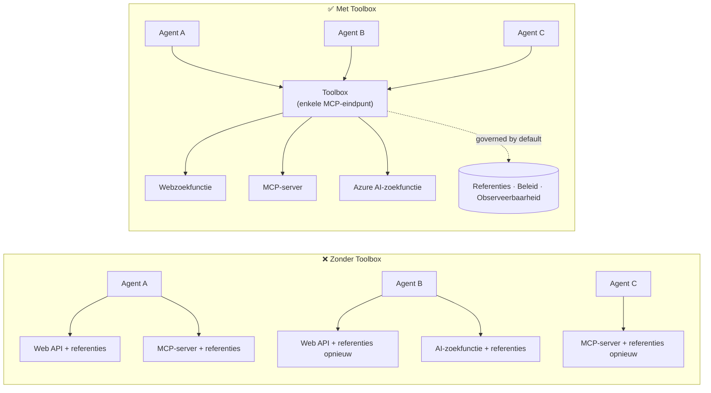

# Les 6: Microsoft Toolbox — Beheerde tools voor agenten

Vanaf [Les 5](../lesson-5-hosted-agents-production/README.md) draait je gehoste agent in
productie met de opslag- en governance houding die jouw organisatie nodig heeft. Maar kijk terug naar de
Les 4 agent: elke tool was **hardcoded** in `main.py` — de Microsoft Learn MCP URL, de
file-search vector store, enzovoort. Dat werkt voor één agent. Het schaalt **niet** naar een
organisatie met tientallen agenten en teams.

Deze les introduceert **Microsoft Toolbox**: de manier waarop Foundry je laat definiëren een geselecteerde set
tools **één keer**, ze centraal beheren, en ze beschikbaar stellen aan elke agent via een **enkel,
beheerd eindpunt**.

## Leerdoelen

Aan het einde van deze les kun je:

- Het probleem van tool-sprawl uitleggen dat Toolbox oplost.
- De **Build** en **Consume** pijlers en de tooltypes die een toolbox kan bevatten beschrijven.
- Een toolboxversie **bouwen** met de Foundry SDK.
- Een toolbox **gebruiken** vanuit een Microsoft Agent Framework gehoste agent via een enkel MCP-eindpunt.
- Versiebeheer gebruiken om toolwijzigingen te leveren zonder codewijzigingen of heruitrol van agenten.
- Governance toepassen: RBAC, inbreng van referenties en guardrail (RAI)-beleid.

---

## Vereisten

1. Voltooide [Les 4](../lesson-4-agentdeployment/README.md) en bij voorkeur
   [Les 5](../lesson-5-hosted-agents-production/README.md).
2. Een **Microsoft Foundry** project met toestemming om toolbox resources te maken en beheren.
3. **Azure CLI** geverifieerd: `az login`. De Foundry toolbox API’s vereisen het
   `https://ai.azure.com/.default` token bereik (zoals hieronder in de code getoond).
4. **Python 3.12+** met de cursus afhankelijkheden geïnstalleerd (`pip install -r ../requirements.txt`).
5. Een actuele, niet gepensioneerde modeluitrol (bijvoorbeeld `gpt-5.1`). Vermijd gepensioneerde GPT-4o / GPT-4.1.

---

## 1. Het probleem: tool-sprawl

Een enkele agent kan afhankelijk zijn van veel tools — REST API's, MCP-servers, connectors en flows — elk
met een eigen authenticatiemodel en eigen team. Naarmate je opschaalt binnen een organisatie:

- Teams **implementeren dezelfde tools opnieuw** onafhankelijk van elkaar.
- **Referenties worden gedupliceerd** over agents en repositories.
- **Governance wordt inconsistent** — elke agent handhaaft (of vergeet) het beleid zelfstandig.
- Er is **weinig zichtbaarheid** welke tools er bestaan of wie ze gebruikt.

Ontwikkelaars komen vast te zitten — niet omdat de modellen niet capabel zijn, maar omdat **toolintegratie de bottleneck wordt**.




Ondernemingen hebben al de infrastructuur — gateways, credential vaults, beleidsregels, observability.
Wat ontbrak is een ontwikkelaarservaring die het verpakt in iets **herbruikbaars,**
ontdekbaar en standaard beheerd door governance. Dat is Toolbox.

---

## 2. Wat een Toolbox is

Een **Toolbox** is een **beheerde Foundry resource**. Je definieert een zorgvuldig samengestelde set tools één keer, beheert
ze centraal in Foundry en stelt ze beschikbaar via **een enkel MCP-compatibel eindpunt** dat elke
agent kan gebruiken. Tijdens uitvoering regelt het platform **referentie-injectie, token-refresh en
handhaving van enterprise-beleid**.

Omdat een toolbox een beheerde resource is, kun je tools toevoegen, verwijderen of herconfigureren **zonder
code in je agent te wijzigen** — de agent maakt altijd verbinding met hetzelfde eindpunt.

Toolbox bestrijkt de levenscyclus van tools via vier pijlers; **Build** en **Consume** zijn vandaag beschikbaar:


| Pijler | Status | Wat het mogelijk maakt |
|--------|--------|---------------------|
| **Build** | Vandaag beschikbaar | Selecteer tools, configureer authenticatie centraal, publiceer een herbruikbare toolbox voor elk team. |
| **Consume** | Vandaag beschikbaar | Verbind elke agent met één MCP-compatibel eindpunt om dynamisch alle tools in de toolbox te ontdekken en aan te roepen. |

Het consumptieoppervlak is **open**: elke MCP-compatibele runtime of client kan een toolbox gebruiken —
Microsoft Agent Framework, LangGraph, GitHub Copilot, Claude Code, Microsoft Copilot Studio of
eigen code.

### Tooltypes die een toolbox kan bevatten

Web Search · MCP · Azure AI Search · Code Interpreter · File Search · OpenAPI · **Agent-to-Agent
(A2A)** · Fabric IQ · Tool Search · Work IQ · Browser Automation · Skill references, plus een
**Guardrail (RAI) beleid** toegepast op het toolboxniveau.

> **Tip:** Voeg een `description` toe aan **elke** tool zodat het model de juiste kan kiezen. Een toolbox
> staat maximaal **één niet-genoemde tool per type** toe — geef elke extra instantie van hetzelfde type een
> unieke `name`, anders krijg je een `invalid_payload`-fout.

---

## 3. Bouw een toolbox

Toolboxes worden beheerd met de Foundry SDKs (Python/.NET/JavaScript), de REST API, `azd`, en de
**Microsoft Foundry Toolkit voor VS Code**. Hier is het Python (`azure-ai-projects`) patroon:

```python
from azure.identity import DefaultAzureCredential
from azure.ai.projects import AIProjectClient
from azure.ai.projects.models import MCPTool, ToolboxSearchPreviewTool, WebSearchTool

endpoint = "https://<your-foundry-account>.services.ai.azure.com/api/projects/<your-project>"
project = AIProjectClient(endpoint=endpoint, credential=DefaultAzureCredential())

toolbox_version = project.toolboxes.create_toolbox_version(
    name="agent-tools",
    description="Web search + an MCP server + tool search",
    tools=[
        WebSearchTool(),
        MCPTool(
            server_label="myserver",
            server_url="https://your-mcp-server.example.com",
            require_approval="never",
            project_connection_id="my-key-auth-connection",  # inloggegevens bevinden zich in Foundry
        ),
        ToolboxSearchPreviewTool(),
    ],
)
print(f"Created toolbox: {toolbox_version.name}, version: {toolbox_version.version}")
```

Merk op wat je **niet** doet: geen geheimen in de agent. Referenties worden bewaard door een Foundry
**connection** (`project_connection_id`) en geïnjecteerd door het platform op het moment van aanroep.

> **Preview-opmerking.** Toolbox **beheer** (creëren/bijwerken van versies) is een preview functionaliteit.
> De `project.toolboxes.*` operaties getoond hierboven zitten in preview SDK builds, de REST API, `azd`,
> en de **Foundry Toolkit voor VS Code** — ze zitten **niet** in de gepinde `azure-ai-projects` gebruikt elders
> in deze cursus. Zie de bovenstaande snippet als de vorm van de Build-stap; voor een klik-door pad,
> maak de toolbox aan in de **Foundry portal** of de **Foundry Toolkit**. De
> **Consume** stap hieronder werkt met de gepinde SDK van de cursus vandaag.

---

## 4. Gebruik een toolbox vanuit je agent

Een toolbox biedt een **MCP-eindpunt**. Er zijn twee patronen:

| Rol | Eindpunt | Wanneer gebruiken |
|------|----------|-----------------|
| **Toolbox consument** | `{project_endpoint}/toolboxes/{name}/mcp?api-version=v1` | Verbind agenten. Bedient altijd de **standaardversie**. |
| **Toolbox ontwikkelaar** | `{project_endpoint}/toolboxes/{name}/versions/{version}/mcp?api-version=v1` | Test een specifieke versie voordat je promoveert. |

> **Verbind agenten met het *consumenten* eindpunt.** Omdat het altijd de standaardversie levert, kun je
> nieuwe versies promoten **zonder agentcode te wijzigen of opnieuw te implementeren**.

### Integreren met een Microsoft Agent Framework gehoste agent

Herinner je dat de Les 4 agent één hardcoded MCP tool toevoegde met `client.get_mcp_tool(...)`. Met
Toolbox wijs je in plaats daarvan **één** `MCPStreamableHTTPTool` toe aan het toolbox-eindpunt — en de agent
krijgt **elke** tool in de toolbox, centraal beheerd:

```python
import httpx
from azure.identity import DefaultAzureCredential, get_bearer_token_provider
from agent_framework import MCPStreamableHTTPTool

# Auth: Foundry toolbox vereist de https://ai.azure.com/.default scope
credential = DefaultAzureCredential()
token_provider = get_bearer_token_provider(credential, "https://ai.azure.com/.default")
http_client = httpx.AsyncClient(auth=_ToolboxAuth(token_provider), timeout=120.0)

TOOLBOX_ENDPOINT = os.environ["TOOLBOX_ENDPOINT"]  # platform geïnjecteerd tijdens runtime

mcp_tool = MCPStreamableHTTPTool(
    name="toolbox",
    url=TOOLBOX_ENDPOINT,
    http_client=http_client,
    load_prompts=False,
)

agent = chat_client.as_agent(
    name="my-toolbox-agent",
    instructions="You are a helpful assistant with access to Foundry toolbox tools.",
    tools=[mcp_tool],
)
```

Bijbehorende `.env` (let op: gebruik een **actueel** model zoals `gpt-5.1`, **niet** de gepensioneerde
`gpt-4o`):

```env
FOUNDRY_PROJECT_ENDPOINT=https://<account>.services.ai.azure.com/api/projects/<project>
TOOLBOX_ENDPOINT=https://<account>.services.ai.azure.com/api/projects/<project>/toolboxes/agent-tools/mcp?api-version=v1
AZURE_AI_MODEL_DEPLOYMENT_NAME=gpt-5.1
```

> **Controleer eerst.** Voordat je de volledige agent aansluit, verbind met een MCP client SDK (`pip install mcp`) op
> het **versiespecifieke** eindpunt en lijst de tools om te bevestigen dat ze laden zoals verwacht.

### Voer het consumptievoorbeeld uit

Deze les levert een uitvoerbaar consumptiekantvoorbeeld, [`toolbox_agent.py`](../../../lesson-6-toolbox/toolbox_agent.py). Het gebruikt
hetzelfde `FoundryChatClient.get_mcp_tool(...)` patroon dat je in Les 2 leerde, maar richt het ene
MCP tool naar jouw **toolbox** eindpunt — zodat de agent elke beheerde tool in de toolbox krijgt:

```bash
# Stel in je .env TOOLBOX_ENDPOINT in op je toolbox consumer endpoint, en dan:
python lesson-6-toolbox/toolbox_agent.py
```

Open de afgedrukte `http://localhost:8096` URL en stel een vraag die een van de tools in je
toolbox gebruikt. Voeg een tool toe of upgrade een tool in de toolbox en probeer opnieuw — **zonder deze
code te wijzigen** — om centrale governance en versiebeheer in actie te zien.

---

## 5. Versiebeheer: lever toolwijzigingen veilig

Toolbox versiebeheer geeft je expliciete controle over wanneer wijzigingen effectief worden:

1. **Maak** een nieuwe toolboxversie met de bijgewerkte set tools.
2. **Test** het tegen het versiespecifieke (ontwikkelaar) eindpunt.
3. **Promoot** het naar `default_version` wanneer je er klaar voor bent.

Elke agent die naar het **consumenten** eindpunt wijst, pikt automatisch de gepromote versie op — **geen
codewijzigingen, geen heruitrol**. (De eerste versie die je maakt wordt automatisch gepromoot naar standaard.)

Dit is het tool-governance equivalent van een blue/green deploy: je valideert een wijziging geïsoleerd,
en schakelt dan de standaardversie voor alle consumenten in één keer om.

---

## 6. Governance: hoe Toolbox betere controle biedt

Toolbox is **standaard beheerd**. De governancehefbomen die je moet kennen:

- **RBAC.** Verleen de **Foundry User** rol op het project aan elke identiteit: de **ontwikkelaar** die
  toolboxversies beheert, de **beheerde identiteit van de agent** (voor gehoste agenten die tools aanroepen
  tijdens runtime), en, voor OAuth-flows, de **eindgebruiker** wiens identiteit wordt geproxied.
- **Gecentraliseerde referenties.** Tool referenties leven in Foundry **connections**, niet in agentcode
  of `.env` bestanden. Het platform injecteert ze en ververst tokens tijdens runtime.
- **Guardrails (RAI-beleid).** Voeg een benoemd verantwoordelijk-AI beleidsregel toe aan een toolboxversie via
  `policies.rai_config.rai_policy_name`. Het draait op het **toolboxniveau**, onafhankelijk van elk
  contentfilter op modelniveau, waarbij toolinvoer en -uitvoer wordt gescreend.
- **MCP goedkeuring.** Per-tool `require_approval` regelt of een MCP tool-aanroep goedkeuring nodig heeft —
  hetzelfde goedkeuringsworkflowconcept als in [Les 5 §7](../lesson-5-hosted-agents-production/README.md#7-hosted-mcp-tools--approval-workflows).
- **Privénetwerken.** Toolbox ondersteunt virtuele netwerkconfiguraties voor ondernemingen die
  verkeer binnen hun netwerk houden.
- **Zichtbaarheid.** Omdat tools centraal zijn gecatalogiseerd, krijg je eindelijk een inventaris van wat
  er is en wie het gebruikt.

---

## Praktijkopdrachten

1. **Herstructureer Les 4.** De Les 4 agent hardcoded de Microsoft Learn MCP tool. Schets hoe je
   die tool zou verplaatsen naar een `agent-tools` toolbox en `main.py` opnieuw wijst naar het toolbox consumenteneindpunt.
   Wat verandert er in `main.py`? Wat is er niet meer nodig?
2. **Ontwerp een versie-update.** Je moet een Web Search-tool toevoegen aan een live toolbox die door vijf
   agenten wordt gebruikt. Beschrijf de create → test → promote volgorde en leg uit waarom geen van de vijf agenten
   opnieuw hoeft te worden uitgerold.
3. **Kies de authenticatie-identiteiten.** Voor een gehoste agent die een OAuth-gebaseerde MCP tool aanroept via een
   toolbox, lijst op welke identiteiten de **Foundry User** rol nodig hebben en waarom.
4. **Guardrail plaatsing.** Leg het verschil uit tussen een contentfilter op modelniveau en een
   toolbox guardrail, en geef één scenario waarin je specifiek de toolbox guardrail nodig hebt.

---

## Bronnen

- [Een toolbox maken, testen en uitrollen in Foundry](https://learn.microsoft.com/azure/foundry/agents/how-to/tools/toolbox)
- [Toolcatalogus — Foundry Agent Service](https://learn.microsoft.com/azure/foundry/agents/concepts/tool-catalog)
- [Microsoft Agent Framework — Microsoft Foundry provider (tools)](https://learn.microsoft.com/agent-framework/agents/providers/microsoft-foundry)
- [Guardrails overzicht](https://learn.microsoft.com/azure/foundry/guardrails/guardrails-overview)
- [Aan de slag met Foundry in VS Code (Foundry Toolkit)](https://learn.microsoft.com/azure/ai-foundry/how-to/develop/get-started-projects-vs-code)
- [Model Context Protocol](https://modelcontextprotocol.io/)

---

**Vorige:** [Les 5 — Productie Gehoste Agenten](../lesson-5-hosted-agents-production/README.md)
&nbsp;·&nbsp; **Volgende:** [Les 7 — Multi-Agent & A2A](../lesson-7-multi-agent-a2a/README.md)

---

<!-- CO-OP TRANSLATOR DISCLAIMER START -->
**Disclaimer**:
Dit document is vertaald met behulp van de AI vertaaldienst [Co-op Translator](https://github.com/Azure/co-op-translator). Hoewel we streven naar nauwkeurigheid, dient u er rekening mee te houden dat geautomatiseerde vertalingen fouten of onnauwkeurigheden kunnen bevatten. Het originele document in de oorspronkelijke taal moet worden beschouwd als de gezaghebbende bron. Voor kritieke informatie wordt professionele menselijke vertaling aanbevolen. Wij zijn niet aansprakelijk voor eventuele misverstanden of verkeerde interpretaties die voortvloeien uit het gebruik van deze vertaling.
<!-- CO-OP TRANSLATOR DISCLAIMER END -->