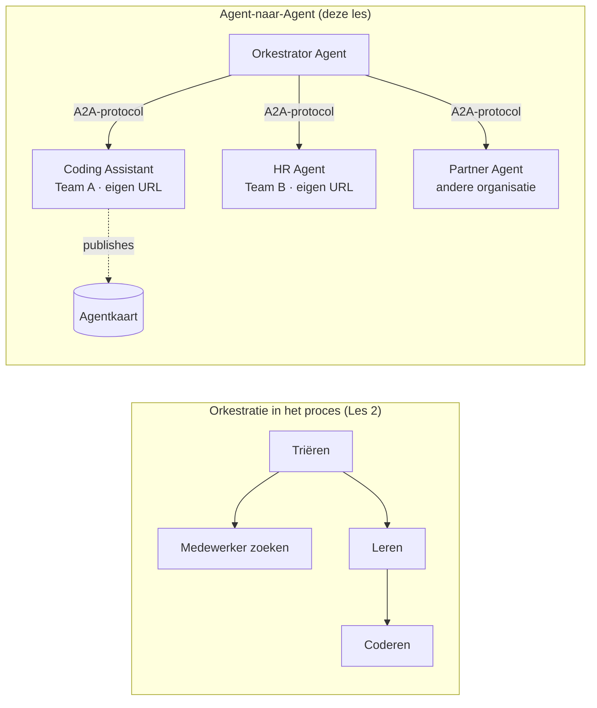

# Les 7: Multi-Agent Orkestratie & Agent-tot-Agent (A2A)

Tegen de tijd van [Les 6](../lesson-6-toolbox/README.md) kun je beheerde tools en gehoste agenten bouwen.
Maar echte systemen gebruiken zelden **één** agent. Naarmate je opschaalt, componeer je **vele** agenten — sommige die je
bezit, sommige eigendom van andere teams, sommige die volledig in andere organisaties draaien. Deze les gaat over
hoe agenten **samen** werken.

Je hebt al een vorm van multi-agent ontwerp gezien in
[Les 2's `agent-orchestration.py`](../lesson-2-agent-development/README.md): het **handoff**
patroon, waarbij een triage-agent doorverwijst naar specialisten **binnen één proces**. Deze les gaat
een niveau hoger — naar **Agent-tot-Agent (A2A)**, het open protocol voor agenten die als onafhankelijke
**geconnecteerde netwerksystemen** draaien en elkaar aanspreken over proces-, team- en organisatiegrenzen heen.

## Leerdoelen

Aan het einde van deze les kun je:

- Het verschil uitleggen tussen **in-proces orkestratie** (handoff/workflows) en
  **Agent-tot-Agent (A2A)** communicatie, en de juiste kiezen.
- De bouwstenen van A2A beschrijven: **Agent Card**, **skills**, **taken**, en **ontdekking**.
- Een Microsoft Agent Framework-agent **openbaren** als een A2A-service met `A2AExecutor`.
- Een remote agent **gebruiken** als netwerk-peer met `A2AAgent`.
- Bedrijfsoverwegingen toepassen op A2A: **beveiliging, identiteit, governance, observeerbaarheid, en kosten**.

---

## Vereisten

1. Les 2 voltooid ([Les 2](../lesson-2-agent-development/README.md)) (agentontwikkeling & orkestratie).
2. Een **Microsoft Foundry** project met een actuele modeluitrol (bijvoorbeeld `gpt-5.1`, en
   `gpt-5-codex` voor het coderingsvoorbeeld). Vermijd gepensioneerde GPT-4o / GPT-4.1.
3. **Azure CLI** geauthenticeerd: `az login`.
4. **Python 3.12+** met geïnstalleerde cursusafhankelijkheden (`pip install -r ../requirements.txt`).
   Les 7 voegt de preview pakketten `agent-framework-a2a`, `a2a-sdk`, en `uvicorn` toe.
5. `FOUNDRY_PROJECT_ENDPOINT` en `FOUNDRY_MODEL` ingesteld in je `.env` (zie de cursus README).

---

## 1. Twee manieren waarop agenten samenwerken

Er is geen enkel "multi-agent" patroon. Kies degene die past bij je **grens**:

| Patroon | Waar agenten draaien | Hoe ze verbinden | Gebruik wanneer |
|---------|--------------------|-----------------|-----------------|
| **Handoff / Workflow** (Les 2) | Eén proces, één codebase | In-memory grafiek (`HandoffBuilder`, `WorkflowBuilder`) | Je bezit alle agenten en zet ze samen uit. |
| **Agent-tot-Agent (A2A)** (deze les) | Gescheiden services, aparte levenscycli | Open **A2A protocol** via HTTP, ontdekt via **Agent Cards** | Agenten zijn eigendom van verschillende teams/organisaties, schalen onafhankelijk, of zijn geschreven in verschillende frameworks. |

Handoff gaat over **routeren binnen een applicatie**. A2A gaat over **agenten samenstellen als
onafhankelijke services** — het agent-equivalent van de overgang van functie-aanroepen naar microservices.



> **Ze componeren.** Een orkestrator die je bouwt met `HandoffBuilder` kan **remote A2A agenten**
> als deelnemers hebben — in-proces routeren naar services die zelf overal kunnen draaien.

---

## 2. De bouwstenen van A2A

A2A is een **open protocol** (niet Microsoft-specifiek), dus een A2A agent kan worden gebruikt door Microsoft
Agent Framework, LangGraph, custom code of de stack van een ander bedrijf. Vier concepten zijn belangrijk:

- **Agent Card** — een klein JSON-document, gepubliceerd op
  `/.well-known/agent-card.json`, dat de agent's **naam, beschrijving, URL, versie,
  vaardigheden en mogelijkheden** adverteert. Dit is hoe een client ontdekt wat een remote agent kan.
- **Vaardigheden (Skills)** — de gedeclareerde dingen die de agent kan doen (`id`, `naam`, `beschrijving`, `tags`,
  `voorbeelden`). Clients (en modellen) gebruiken deze om te beslissen of ze het agent aanroepen.
- **Taken (Tasks)** — een aanroep naar een A2A agent is een **taak** met een levenscyclus (ingediend → bezig →
  voltooid/mislukt). De server houdt taken bij in een **takenopslag**; streaming-updates worden ondersteund.
- **Ontdekking (Discovery)** — een client krijgt enkel een URL, haalt de Agent Card op en weet hoe de agent aan te roepen.

---

## 3. Een agent blootstellen als A2A service — `a2a_server.py`

De **Build/serve** kant wikkelt elke Microsoft Agent Framework-agent in met `A2AExecutor` en hangt het op
een A2A HTTP-applicatie. Zie [`a2a_server.py`](../../../lesson-7-multi-agent-a2a/a2a_server.py). De belangrijkste verbinding:

```python
from agent_framework.a2a import A2AExecutor
from a2a.server.apps import A2AStarletteApplication
from a2a.server.request_handlers import DefaultRequestHandler
from a2a.server.tasks import InMemoryTaskStore
from a2a.types import AgentCapabilities, AgentCard, AgentSkill

agent = client.as_agent(name="coding-assistant", instructions="...")

agent_card = AgentCard(
    name="Coding Assistant",
    description="Generates runnable code samples...",
    url="http://localhost:9000/",
    version="1.0.0",
    capabilities=AgentCapabilities(streaming=True),
    default_input_modes=["text"],
    default_output_modes=["text"],
    skills=[AgentSkill(id="generate-code", name="Generate code",
                       description="Write a runnable code snippet.", tags=["code"])],
)

request_handler = DefaultRequestHandler(
    agent_executor=A2AExecutor(agent),
    task_store=InMemoryTaskStore(),
)
app = A2AStarletteApplication(agent_card=agent_card, http_handler=request_handler).build()
# bediend met uvicorn op poort 9000
```

Merk op dat de agentcode **ongewijzigd** blijft — `A2AExecutor` past je bestaande agent aan het protocol aan.
De Agent Card maakt het **ontdekbaar** voor elke A2A client.

---

## 4. Een remote agent gebruiken — `a2a_client.py`

De **Consume** kant verbindt met een remote agent **via URL**, haalt de Agent Card op en roept hem aan
precies als een lokale agent. Zie [`a2a_client.py`](../../../lesson-7-multi-agent-a2a/a2a_client.py):

```python
from agent_framework.a2a import A2AAgent

remote_agent = A2AAgent(name="remote-coding-assistant", url="http://localhost:9000")
result = await remote_agent.run("Write a Python function that reverses a string.")
print(result.text)
```

Dat is het hele punt van A2A: vanaf de aanroeper-zijde gedraagt een remote agent zich als elke andere
`agent_framework` agent, dus je kunt hem integreren in een workflow of taken aan hem overdragen — ook al draait hij
in een ander proces, op een andere machine, eigendom van een ander team.

### Voer het van begin tot eind uit

```bash
# Terminal 1 — start de A2A-service
python a2a_server.py

# Terminal 2 — roep het aan
python a2a_client.py "Write a Python function that reverses a string."
```

Je zult het antwoord van de coderingsassistent over het A2A-protocol zien binnenkomen. Open
`http://localhost:9000/.well-known/agent-card.json` in een browser om de gepubliceerde Agent Card te zien.

---

## 5. Bedrijfsoverwegingen

Het omzetten van agenten in geconnecteerde services introduceert dezelfde zorgen als elk gedistribueerd systeem —
plus een paar AI-specifieke:


- **Identiteit & authenticatie.** Maak een A2A-agent nooit publiek beschikbaar zonder authenticatie. De Agent Card bevat
  `security` / `security_schemes`, en `A2AAgent` accepteert een `auth_interceptor` zodat aanroepers
  referenties kunnen toevoegen (OAuth bearer tokens, API-sleutels). Gebruik Entra ID / beheerde identiteiten voor
  service-naar-service authenticatie in productie; plaats de service achter een gateway.
- **Governance.** Combineer A2A met de [Toolbox uit Les 6](../lesson-6-toolbox/README.md): een externe
  agent kan als een **A2A-tool** binnen een gereguleerde toolbox worden gepubliceerd zodat RBAC, 
  credential injectie en guardrail-beleid centraal van toepassing zijn.
- **Observeerbaarheid.** Een verzoek overschrijdt nu procesgrenzen, dus draag tracing over de oproep heen.
  Schakel [Foundry Observeerbaarheid / OpenTelemetry](../lesson-3-agent-evals/README.md) in op **zowel**
  de orkestrator als elke externe agent om één end-to-end trace te verkrijgen.
- **Versiebeheer.** De Agent Card heeft een `version`. Behandel dit als een API: additionele wijzigingen zijn veilig;
  het breken van het contract van een skill vereist een nieuwe versie en een migratievenster voor gebruikers.
- **Betrouwbaarheid.** Externe agents kunnen onafhankelijk falen. Stel timeouts in (`A2AAgent(timeout=...)`), 
  handel gedeeltelijke fouten af, en zorg dat één trage deelnemer niet de hele orkestratie blokkeert.
- **Kosten.** Elke externe agent-aanroep is een eigen model-executie. Fan-out verhoogt het tokenverbruik —
  houd hier budget voor aan, en geef de voorkeur aan routering naar **één** beste agent boven het uitzenden naar velen.

---

## Praktijkopdrachten

1. **Voeg een tweede service toe.** Kopieer `a2a_server.py` om de **employee-search** agent beschikbaar te maken op poort
   9001 met een eigen Agent Card en skills. Draai beide, en laat een client elk aanroepen.
2. **Orkestreer externe peers.** Bouw een kleine `HandoffBuilder` (of eenvoudige router) waarvan de deelnemers
   bestaan uit twee `A2AAgent`s die naar jouw twee services wijzen. Routeer een query naar de juiste.
3. **Beveilig het.** Voeg een `auth_interceptor` toe aan de client en vereis een bearer token op de server.
   Wat breekt er als het token ontbreekt? Waar zou je het token opslaan in productie?
4. **Handoff versus A2A.** Schrijf twee korte paragrafen: wanneer zou je de handoff uit Les 2 in-proces houden,
   en wanneer is de extra complexiteit van A2A gerechtvaardigd? Geef een concreet voorbeeld van elk.

---

## Bronnen

- [Agent-to-Agent (A2A) — Microsoft Agent Framework](https://learn.microsoft.com/agent-framework/user-guide/agent-orchestration/a2a)
- [Multi-agent orchestration — Microsoft Agent Framework](https://learn.microsoft.com/agent-framework/user-guide/agent-orchestration/)
- [A2A protocol specificatie](https://a2a-protocol.org/)
- [A2A Python SDK (`a2a-sdk`)](https://github.com/a2aproject/a2a-python)
- [Foundry Agent Service — multi-agent patronen](https://learn.microsoft.com/azure/ai-foundry/agents/concepts/connected-agents)

---

**Vorige:** [Les 6 — Microsoft Toolbox](../lesson-6-toolbox/README.md)

---

<!-- CO-OP TRANSLATOR DISCLAIMER START -->
**Disclaimer**:
Dit document is vertaald met behulp van de AI vertaaldienst [Co-op Translator](https://github.com/Azure/co-op-translator). Hoewel we streven naar nauwkeurigheid, dient u er rekening mee te houden dat geautomatiseerde vertalingen fouten of onnauwkeurigheden kunnen bevatten. Het originele document in de oorspronkelijke taal moet worden beschouwd als de gezaghebbende bron. Voor kritieke informatie wordt professionele menselijke vertaling aanbevolen. Wij zijn niet aansprakelijk voor eventuele misverstanden of verkeerde interpretaties die voortvloeien uit het gebruik van deze vertaling.
<!-- CO-OP TRANSLATOR DISCLAIMER END -->