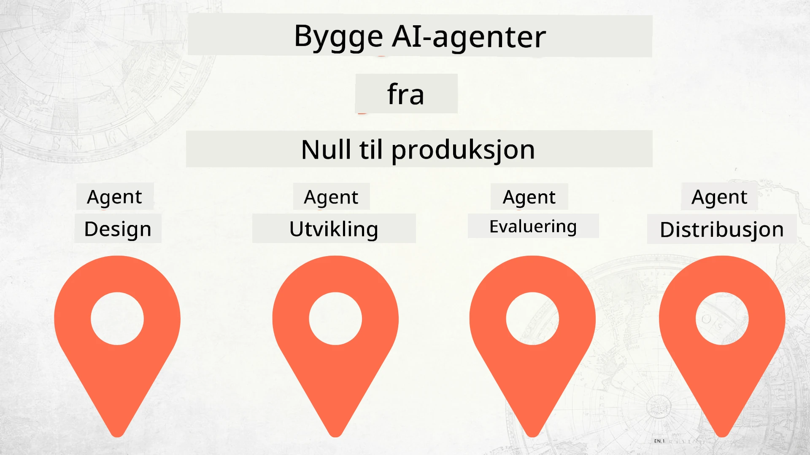

# Bygge AI-agenter fra null til produksjon



### 🌐 Støtte for flere språk

#### Støttet via GitHub Action (Automatisert og alltid oppdatert)

<!-- CO-OP TRANSLATOR LANGUAGES TABLE START -->
[Arabisk](../ar/README.md) | [Bengali](../bn/README.md) | [Bulgarsk](../bg/README.md) | [Burmese (Myanmar)](../my/README.md) | [Kinesisk (forenklet)](../zh-CN/README.md) | [Kinesisk (tradisjonell, Hong Kong)](../zh-HK/README.md) | [Kinesisk (tradisjonell, Macau)](../zh-MO/README.md) | [Kinesisk (tradisjonell, Taiwan)](../zh-TW/README.md) | [Kroatisk](../hr/README.md) | [Tsjekkisk](../cs/README.md) | [Dansk](../da/README.md) | [Nederlandsk](../nl/README.md) | [Estisk](../et/README.md) | [Finsk](../fi/README.md) | [Fransk](../fr/README.md) | [Tysk](../de/README.md) | [Gresk](../el/README.md) | [Hebraisk](../he/README.md) | [Hindi](../hi/README.md) | [Ungarsk](../hu/README.md) | [Indonesisk](../id/README.md) | [Italiensk](../it/README.md) | [Japansk](../ja/README.md) | [Kannada](../kn/README.md) | [Khmer](../km/README.md) | [Koreansk](../ko/README.md) | [Litauisk](../lt/README.md) | [Malayisk](../ms/README.md) | [Malayalam](../ml/README.md) | [Marathi](../mr/README.md) | [Nepalesisk](../ne/README.md) | [Nigeriansk pidgin](../pcm/README.md) | [Norsk](./README.md) | [Persisk (Farsi)](../fa/README.md) | [Polsk](../pl/README.md) | [Portugisisk (Brasil)](../pt-BR/README.md) | [Portugisisk (Portugal)](../pt-PT/README.md) | [Punjabi (Gurmukhi)](../pa/README.md) | [Rumensk](../ro/README.md) | [Russisk](../ru/README.md) | [Serbisk (kyrillisk)](../sr/README.md) | [Slovakisk](../sk/README.md) | [Slovensk](../sl/README.md) | [Spansk](../es/README.md) | [Swahili](../sw/README.md) | [Svensk](../sv/README.md) | [Tagalog (Filipino)](../tl/README.md) | [Tamil](../ta/README.md) | [Telugu](../te/README.md) | [Thai](../th/README.md) | [Tyrkisk](../tr/README.md) | [Ukrainsk](../uk/README.md) | [Urdu](../ur/README.md) | [Vietnamesisk](../vi/README.md)

> **Foretrekker du å klone lokalt?**
>
> Denne repoen inkluderer over 50 språkoversettelser som øker nedlastingsstørrelsen betydelig. For å klone uten oversettelser, bruk sparse checkout:
>
> **Bash / macOS / Linux:**
> ```bash
> git clone --filter=blob:none --sparse https://github.com/microsoft/Building-AI-Agents-From-Zero-To-Production.git
> cd Building-AI-Agents-From-Zero-To-Production
> git sparse-checkout set --no-cone '/*' '!translations' '!translated_images'
> ```
>
> **CMD (Windows):**
> ```cmd
> git clone --filter=blob:none --sparse https://github.com/microsoft/Building-AI-Agents-From-Zero-To-Production.git
> cd Building-AI-Agents-From-Zero-To-Production
> git sparse-checkout set --no-cone "/*" "!translations" "!translated_images"
> ```
>
> Dette gir deg alt du trenger for å fullføre kurset med en mye raskere nedlasting.
<!-- CO-OP TRANSLATOR LANGUAGES TABLE END -->

## Et kurs som lærer deg det grunnleggende om utviklingslivssyklusen for AI-agenter

[](https://github.com/microsoft/Building-AI-Agents-From-Zero-To-Production/blob/master/LICENSE?WT.mc_id=academic-105485-koreyst)
[](https://GitHub.com/microsoft/Building-AI-Agents-From-Zero-To-Production/graphs/contributors/?WT.mc_id=academic-105485-koreyst)
[](https://GitHub.com/microsoft/Building-AI-Agents-From-Zero-To-Production/issues/?WT.mc_id=academic-105485-koreyst)
[](https://GitHub.com/microsoft/Building-AI-Agents-From-Zero-To-Production/pulls/?WT.mc_id=academic-105485-koreyst)
[](http://makeapullrequest.com?WT.mc_id=academic-105485-koreyst)

[](https://discord.gg/Kuaw3ktsu6)

## 🌱 Komme i gang

Dette kurset har leksjoner som dekker det grunnleggende om å bygge og distribuere AI-agenter.

Hver leksjon bygger på den forrige, så vi anbefaler å starte fra begynnelsen og jobbe deg gjennom til slutten.

Hvis du vil utforske mer om AI-agenttemaer, kan du sjekke ut [AI Agents For Beginners Course](https://aka.ms/ai-agents-beginners).

### Møt andre elever, få svar på spørsmålene dine

Hvis du sitter fast eller har spørsmål om å bygge AI-agenter, kan du bli med i vår dedikerte Discord-kanal i [Microsoft Foundry Discord](https://discord.gg/Kuaw3ktsu6).

### Hva du trenger

Hver leksjon har sin egen kodeeksempel som du kan kjøre lokalt. Du kan [fork dette repoet](https://github.com/microsoft/Building-AI-Agents-From-Zero-To-Production/fork) for å lage din egen kopi.

Dette kurset bruker for øyeblikket følgende:

- [Microsoft Agent Framework (MAF)](https://aka.ms/ai-agents-beginners/agent-framework)
- [Microsoft Foundry](https://azure.microsoft.com/products/ai-foundry)
- [Azure OpenAI Service](https://azure.microsoft.com/products/ai-foundry/models/openai)
- [Azure CLI](https://learn.microsoft.com/cli/azure/authenticate-azure-cli?view=azure-cli-latest)

Vennligst sørg for at du har tilgang til disse tjenestene før du begynner.

Flere alternativer rundt modellhosting og tjenester kommer snart.

## 🗃️ Leksjoner

| **Leksjon**         | **Beskrivelse**                                                                                  |
|--------------------|--------------------------------------------------------------------------------------------------|
| [Agent Design](./lesson-1-agent-design/README.md)       | En introduksjon til vår "Developer Onboarding" Agent Use Case og hvordan designe effektive agenter  |
| [Agent Development](./lesson-2-agent-development/README.md)  | Ved å bruke Microsoft Agent Framework (MAF), lag 3 agenter for å hjelpe nye utviklere å komme i gang.       |
| [Agent Evaluations](./lesson-3-agent-evals/README.md)  | Bruk Microsoft Foundry for å finne ut hvor godt AI-agentene våre presterer og hvordan forbedre dem. |
| [Agent Deployment](./lesson-4-agent-deployment/README.md)   | Bruk Hosted Agents og OpenAI Chatkit for å se hvordan man distribuerer en AI-agent i produksjon.       |


## 🎒 Andre kurs

Teamet vårt produserer andre kurs! Sjekk ut:

<!-- CO-OP TRANSLATOR OTHER COURSES START -->
### LangChain
[](https://aka.ms/langchain4j-for-beginners)
[](https://aka.ms/langchainjs-for-beginners?WT.mc_id=m365-94501-dwahlin)
[](https://github.com/microsoft/langchain-for-beginners?WT.mc_id=m365-94501-dwahlin)
---

### Azure / Edge / MCP / Agenter
[](https://github.com/microsoft/AZD-for-beginners?WT.mc_id=academic-105485-koreyst)
[](https://github.com/microsoft/edgeai-for-beginners?WT.mc_id=academic-105485-koreyst)
[](https://github.com/microsoft/mcp-for-beginners?WT.mc_id=academic-105485-koreyst)
[](https://github.com/microsoft/ai-agents-for-beginners?WT.mc_id=academic-105485-koreyst)

---
 
### Generativ AI-serie
[](https://github.com/microsoft/generative-ai-for-beginners?WT.mc_id=academic-105485-koreyst)
[-9333EA?style=for-the-badge&labelColor=E5E7EB&color=9333EA)](https://github.com/microsoft/Generative-AI-for-beginners-dotnet?WT.mc_id=academic-105485-koreyst)
[-C084FC?style=for-the-badge&labelColor=E5E7EB&color=C084FC)](https://github.com/microsoft/generative-ai-for-beginners-java?WT.mc_id=academic-105485-koreyst)
[-E879F9?style=for-the-badge&labelColor=E5E7EB&color=E879F9)](https://github.com/microsoft/generative-ai-with-javascript?WT.mc_id=academic-105485-koreyst)

---
 
### Kjerneopplæring
[](https://aka.ms/ml-beginners?WT.mc_id=academic-105485-koreyst)
[](https://aka.ms/datascience-beginners?WT.mc_id=academic-105485-koreyst)
[](https://aka.ms/ai-beginners?WT.mc_id=academic-105485-koreyst)
[](https://github.com/microsoft/Security-101?WT.mc_id=academic-96948-sayoung)
[](https://aka.ms/webdev-beginners?WT.mc_id=academic-105485-koreyst)
[](https://aka.ms/iot-beginners?WT.mc_id=academic-105485-koreyst)
[](https://github.com/microsoft/xr-development-for-beginners?WT.mc_id=academic-105485-koreyst)

---
 
### Copilot-serie
[](https://aka.ms/GitHubCopilotAI?WT.mc_id=academic-105485-koreyst)
[](https://github.com/microsoft/mastering-github-copilot-for-dotnet-csharp-developers?WT.mc_id=academic-105485-koreyst)
[](https://github.com/microsoft/CopilotAdventures?WT.mc_id=academic-105485-koreyst)
<!-- CO-OP TRANSLATOR OTHER COURSES END -->

## Bidra

Dette prosjektet tar imot bidrag og forslag. De fleste bidrag krever at du godtar en
Bidragsyterlisensavtale (CLA) som erklærer at du har rett til, og faktisk gir oss
rettighetene til å bruke ditt bidrag. For detaljer, besøk <https://cla.opensource.microsoft.com>.

Når du sender en pull-forespørsel, vil en CLA-bot automatisk avgjøre om du må oppgi
en CLA, og merke PR-en tilsvarende (f.eks. statuskontroll, kommentar). Følg bare instruksjonene
fra boten. Du trenger bare å gjøre dette én gang for alle depot som bruker vår CLA.

Dette prosjektet har tatt i bruk [Microsofts Åpen Kildekode Oppførselskodeks](https://opensource.microsoft.com/codeofconduct/).
For mer informasjon, se [FAQ for Oppførselskodeks](https://opensource.microsoft.com/codeofconduct/faq/) eller
kontakt [opencode@microsoft.com](mailto:opencode@microsoft.com) med eventuelle spørsmål eller kommentarer.

## Varemerker

Dette prosjektet kan inneholde varemerker eller logoer for prosjekter, produkter eller tjenester. Autorisert bruk av Microsofts
varemerker eller logoer er underlagt og må følge
[Microsofts retningslinjer for varemerker og merkevare](https://www.microsoft.com/legal/intellectualproperty/trademarks/usage/general).
Bruk av Microsofts varemerker eller logoer i modifiserte versjoner av dette prosjektet må ikke skape forvirring eller antyde Microsofts sponsorat.
Enhver bruk av tredjeparts varemerker eller logoer er underlagt retningslinjene til disse tredjepartene.

## Få hjelp

Hvis du står fast eller har spørsmål om å bygge AI-apper, bli med:

[](https://discord.gg/Kuaw3ktsu6)

Hvis du har produktinnspill eller opplever feil under bygging, besøk:

[](https://aka.ms/foundry/forum)

---

<!-- CO-OP TRANSLATOR DISCLAIMER START -->
**Ansvarsfraskrivelse**:  
Dette dokumentet er oversatt ved hjelp av den AI-baserte oversettelsestjenesten [Co-op Translator](https://github.com/Azure/co-op-translator). Selv om vi streber etter nøyaktighet, vennligst vær oppmerksom på at automatiserte oversettelser kan inneholde feil eller unøyaktigheter. Det opprinnelige dokumentet på originalspråket skal betraktes som den autoritative kilden. For kritisk informasjon anbefales profesjonell menneskelig oversettelse. Vi påtar oss ikke ansvar for misforståelser eller feiltolkninger som følge av bruk av denne oversettelsen.
<!-- CO-OP TRANSLATOR DISCLAIMER END -->