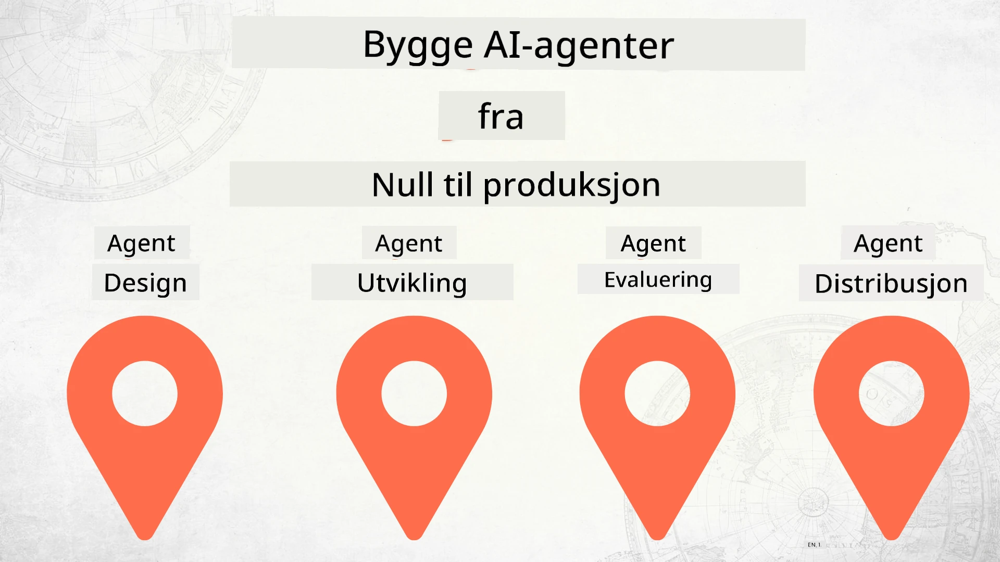

# Bygge AI-agenter fra null til produksjon



### 🌐 Flerspråklig støtte

#### Støttet via GitHub Action (Automatisert og alltid oppdatert)

<!-- CO-OP TRANSLATOR LANGUAGES TABLE START -->
[Arabic](../ar/README.md) | [Bengali](../bn/README.md) | [Bulgarian](../bg/README.md) | [Burmese (Myanmar)](../my/README.md) | [Chinese (Simplified)](../zh-CN/README.md) | [Chinese (Traditional, Hong Kong)](../zh-HK/README.md) | [Chinese (Traditional, Macau)](../zh-MO/README.md) | [Chinese (Traditional, Taiwan)](../zh-TW/README.md) | [Croatian](../hr/README.md) | [Czech](../cs/README.md) | [Danish](../da/README.md) | [Dutch](../nl/README.md) | [Estonian](../et/README.md) | [Finnish](../fi/README.md) | [French](../fr/README.md) | [German](../de/README.md) | [Greek](../el/README.md) | [Hebrew](../he/README.md) | [Hindi](../hi/README.md) | [Hungarian](../hu/README.md) | [Indonesian](../id/README.md) | [Italian](../it/README.md) | [Japanese](../ja/README.md) | [Kannada](../kn/README.md) | [Khmer](../km/README.md) | [Korean](../ko/README.md) | [Lithuanian](../lt/README.md) | [Malay](../ms/README.md) | [Malayalam](../ml/README.md) | [Marathi](../mr/README.md) | [Nepali](../ne/README.md) | [Nigerian Pidgin](../pcm/README.md) | [Norwegian](./README.md) | [Persian (Farsi)](../fa/README.md) | [Polish](../pl/README.md) | [Portuguese (Brazil)](../pt-BR/README.md) | [Portuguese (Portugal)](../pt-PT/README.md) | [Punjabi (Gurmukhi)](../pa/README.md) | [Romanian](../ro/README.md) | [Russian](../ru/README.md) | [Serbian (Cyrillic)](../sr/README.md) | [Slovak](../sk/README.md) | [Slovenian](../sl/README.md) | [Spanish](../es/README.md) | [Swahili](../sw/README.md) | [Swedish](../sv/README.md) | [Tagalog (Filipino)](../tl/README.md) | [Tamil](../ta/README.md) | [Telugu](../te/README.md) | [Thai](../th/README.md) | [Turkish](../tr/README.md) | [Ukrainian](../uk/README.md) | [Urdu](../ur/README.md) | [Vietnamese](../vi/README.md)

> **Foretrekker du å klone lokalt?**
>
> Dette depotet inneholder over 50 språköversettelser som betydelig øker nedlastingsstørrelsen. For å klone uten oversettelser, bruk sparsjekontroll:
>
> **Bash / macOS / Linux:**
> ```bash
> git clone --filter=blob:none --sparse https://github.com/microsoft/Building-AI-Agents-From-Zero-To-Production.git
> cd Building-AI-Agents-From-Zero-To-Production
> git sparse-checkout set --no-cone '/*' '!translations' '!translated_images'
> ```
>
> **CMD (Windows):**
> ```cmd
> git clone --filter=blob:none --sparse https://github.com/microsoft/Building-AI-Agents-From-Zero-To-Production.git
> cd Building-AI-Agents-From-Zero-To-Production
> git sparse-checkout set --no-cone "/*" "!translations" "!translated_images"
> ```
>
> Dette gir deg alt du trenger for å fullføre kurset med mye raskere nedlasting.
<!-- CO-OP TRANSLATOR LANGUAGES TABLE END -->

## Et kurs som lærer deg det grunnleggende i AI-agentens utviklingslivssyklus

[](https://github.com/microsoft/Building-AI-Agents-From-Zero-To-Production/blob/master/LICENSE?WT.mc_id=academic-105485-koreyst)
[](https://GitHub.com/microsoft/Building-AI-Agents-From-Zero-To-Production/graphs/contributors/?WT.mc_id=academic-105485-koreyst)
[](https://GitHub.com/microsoft/Building-AI-Agents-From-Zero-To-Production/issues/?WT.mc_id=academic-105485-koreyst)
[](https://GitHub.com/microsoft/Building-AI-Agents-From-Zero-To-Production/pulls/?WT.mc_id=academic-105485-koreyst)
[](http://makeapullrequest.com?WT.mc_id=academic-105485-koreyst)

[](https://discord.gg/Kuaw3ktsu6)

## 🌱 Komme i gang

Dette kurset har leksjoner som dekker det grunnleggende i å bygge og distribuere AI-agenter.

Hver leksjon bygger på den forrige, så vi anbefaler å starte fra begynnelsen og jobbe deg gjennom til slutten.

Hvis du vil utforske mer om AI-agenttemaer, kan du sjekke ut [AI Agents For Beginners Course](https://aka.ms/ai-agents-beginners).

### Møt andre lærende, få svar på spørsmålene dine

Hvis du støter på problemer eller har spørsmål om å bygge AI-agenter, bli med i vår dedikerte Discord-kanal i [Microsoft Foundry Discord](https://discord.gg/Kuaw3ktsu6).

### Det du trenger

Hver leksjon har sitt eget kodeeksempel som du kan kjøre lokalt. Du kan [forke dette depotet](https://github.com/microsoft/Building-AI-Agents-From-Zero-To-Production/fork) for å lage din egen kopi.

Dette kurset bruker for øyeblikket følgende:

- [Microsoft Agent Framework (MAF)](https://aka.ms/ai-agents-beginners/agent-framework)
- [Microsoft Foundry](https://azure.microsoft.com/products/ai-foundry) — et prosjekt med en distribuert **GPT-5-serie** modell (for eksempel `gpt-5.1`). Bruk **ikke** de pensjonerte GPT-4o / GPT-4.1 modellene.
- [Azure OpenAI Service](https://azure.microsoft.com/products/ai-foundry/models/openai)
- [Azure CLI](https://learn.microsoft.com/cli/azure/authenticate-azure-cli?view=azure-cli-latest) — logg inn med `az login` før du kjører eksempelstoff
- **Python 3.12 eller nyere**

Sørg for at du har tilgang til disse tjenestene før du begynner.

> **💰 Kostnad og opprydding.** Praktiske leksjoner oppretter ekte Azure-ressurser — et Microsoft Foundry
> prosjekt, en modellutplassering, en vektorbutikk, og (i Leksjon 4–6) hostede agenter og verktøykasser.
> Disse kan påløpe kostnader så lenge de eksisterer. Når du er ferdig med en leksjon — eller kurset — slett
> ressursene du ikke lenger trenger. Den enkleste metoden er å samle alt i en dedikert ressurs
> gruppe og slette hele gruppen når du er ferdig:
>
> ```bash
> az group delete --name <your-resource-group> --yes --no-wait
> ```
>
> Du kan også slette individuelle agenter, vektorbutikker og verktøykasser fra Foundry-portalen.

> **Merk om modeller.** Dette kurset betjener alle modeller gjennom **Microsoft Foundry**. Det bruker **ikke**
> *GitHub-modeller*, som blir pensjonert 30. juli 2026 — Microsoft Foundry er
> den offisielle migreringsveien. Hvis du har eldre kode som kaller GitHub-modeller, pek den i stedet mot en Foundry
> modellutplassering.

Flere alternativer for modellhosting og tjenester kommer snart.

## 🗃️ Leksjoner

| **Leksjon**         | **Beskrivelse**                                                                                  |
|--------------------|--------------------------------------------------------------------------------------------------|
| [Agent Design](./lesson-1-agent-design/README.md)       | En introduksjon til vår "Utviklertilpasning" agent-tilfelle og hvordan design effektive agenter  |
| [Agent Development](./lesson-2-agent-development/README.md)  | Ved å bruke Microsoft Agent Framework (MAF), byg en gruppe spesialiserte agenter for å hjelpe nye utviklere med onboarding.       |
| [Agent Evaluations](./lesson-3-agent-evals/README.md)  | Bruk Microsoft Foundry for å finne ut hvor godt AI-agentene våre presterer og hvordan forbedre dem. |
| [Agent Deployment](./lesson-4-agentdeployment/README.md)   | Ved å bruke Microsoft Foundry hostede agenter og OpenAI ChatKit, se hvordan man distribuerer en AI-agent i produksjon.       |
| [Production Hosted Agents](./lesson-5-hosted-agents-production/README.md)   | Ta en hostet agent til bedriftsproduksjon: Hostede agenter vs kapabilitetshosts, bring-your-own lagring, minne og styring.       |
| [Microsoft Toolbox](./lesson-6-toolbox/README.md)   | Definer verktøy én gang og styr dem sentralt: bygg en verktøykasse, bruk den fra en agent via ett MCP-endepunkt, og versjoner verktøy trygt.       |
| [Multi-Agent & A2A](./lesson-7-multi-agent-a2a/README.md)   | Sett sammen agenter som nettverkstjenester: eksponer en agent over det åpne Agent-til-Agent (A2A) protokoll og bruk en ekstern agent som jevnaldrende.       |


## 🎒 Andre kurs

Teamet vårt lager andre kurs! Sjekk ut:

<!-- CO-OP TRANSLATOR OTHER COURSES START -->
### LangChain
[](https://aka.ms/langchain4j-for-beginners)
[](https://aka.ms/langchainjs-for-beginners?WT.mc_id=m365-94501-dwahlin)
[](https://github.com/microsoft/langchain-for-beginners?WT.mc_id=m365-94501-dwahlin)
---

### Azure / Edge / MCP / Agenter
[](https://github.com/microsoft/AZD-for-beginners?WT.mc_id=academic-105485-koreyst)
[](https://github.com/microsoft/edgeai-for-beginners?WT.mc_id=academic-105485-koreyst)
[](https://github.com/microsoft/mcp-for-beginners?WT.mc_id=academic-105485-koreyst)
[](https://github.com/microsoft/ai-agents-for-beginners?WT.mc_id=academic-105485-koreyst)

---
 
### Generativ AI-serie

[](https://github.com/microsoft/generative-ai-for-beginners?WT.mc_id=academic-105485-koreyst)
[-9333EA?style=for-the-badge&labelColor=E5E7EB&color=9333EA)](https://github.com/microsoft/Generative-AI-for-beginners-dotnet?WT.mc_id=academic-105485-koreyst)
[-C084FC?style=for-the-badge&labelColor=E5E7EB&color=C084FC)](https://github.com/microsoft/generative-ai-for-beginners-java?WT.mc_id=academic-105485-koreyst)
[-E879F9?style=for-the-badge&labelColor=E5E7EB&color=E879F9)](https://github.com/microsoft/generative-ai-with-javascript?WT.mc_id=academic-105485-koreyst)

---
 
### Kjerneopplæring
[](https://aka.ms/ml-beginners?WT.mc_id=academic-105485-koreyst)
[](https://aka.ms/datascience-beginners?WT.mc_id=academic-105485-koreyst)
[](https://aka.ms/ai-beginners?WT.mc_id=academic-105485-koreyst)
[](https://github.com/microsoft/Security-101?WT.mc_id=academic-96948-sayoung)
[](https://aka.ms/webdev-beginners?WT.mc_id=academic-105485-koreyst)
[](https://aka.ms/iot-beginners?WT.mc_id=academic-105485-koreyst)
[](https://github.com/microsoft/xr-development-for-beginners?WT.mc_id=academic-105485-koreyst)

---
 
### Copilot-serien
[](https://aka.ms/GitHubCopilotAI?WT.mc_id=academic-105485-koreyst)
[](https://github.com/microsoft/mastering-github-copilot-for-dotnet-csharp-developers?WT.mc_id=academic-105485-koreyst)
[](https://github.com/microsoft/CopilotAdventures?WT.mc_id=academic-105485-koreyst)
<!-- CO-OP TRANSLATOR OTHER COURSES END -->

## Bidra

Dette prosjektet ønsker bidrag og forslag velkommen. De fleste bidrag krever at du godtar en
Contributor License Agreement (CLA) som erklærer at du har rett til, og faktisk gjør, å gi oss
rettighetene til å bruke ditt bidrag. For detaljer, besøk <https://cla.opensource.microsoft.com>.

Når du sender inn en pull request, vil en CLA-bot automatisk avgjøre om du må levere
en CLA og pynte PR-en passende (f.eks., status-sjekk, kommentar). Bare følg instruksjonene
gitt av boten. Du trenger bare gjøre dette én gang for alle repoer som bruker vår CLA.

Dette prosjektet har tatt i bruk [Microsoft Open Source Code of Conduct](https://opensource.microsoft.com/codeofconduct/).
For mer informasjon, se [Code of Conduct FAQ](https://opensource.microsoft.com/codeofconduct/faq/) eller
kontakt [opencode@microsoft.com](mailto:opencode@microsoft.com) med eventuelle spørsmål eller kommentarer.

## Varemerker

Dette prosjektet kan inneholde varemerker eller logoer for prosjekter, produkter eller tjenester. Autorisert bruk av Microsoft
varemerker eller logoer er underlagt og må følge
[Microsofts retningslinjer for varemerker og merkevare](https://www.microsoft.com/legal/intellectualproperty/trademarks/usage/general).
Bruk av Microsoft-varemerker eller logoer i modifiserte versjoner av dette prosjektet må ikke skape forvirring eller antyde Microsoft-sponsing.
All bruk av tredjeparts varemerker eller logoer er underlagt de tredjeparts retningslinjer.

## Få hjelp

Hvis du sitter fast eller har spørsmål om å bygge AI-apper, bli med i:

[](https://discord.gg/Kuaw3ktsu6)

Hvis du har produktfeedback eller feil mens du bygger, besøk:

[](https://aka.ms/foundry/forum)

---

<!-- CO-OP TRANSLATOR DISCLAIMER START -->
**Ansvarsfraskrivelse**:
Dette dokumentet er oversatt ved hjelp av AI-oversettelsestjenesten [Co-op Translator](https://github.com/Azure/co-op-translator). Selv om vi streber etter nøyaktighet, vær oppmerksom på at automatiske oversettelser kan inneholde feil eller unøyaktigheter. Det opprinnelige dokumentet på originalspråket skal betraktes som den autoritative kilden. For kritisk informasjon anbefales profesjonell menneskelig oversettelse. Vi er ikke ansvarlige for eventuelle misforståelser eller feiltolkninger som oppstår ved bruk av denne oversettelsen.
<!-- CO-OP TRANSLATOR DISCLAIMER END -->