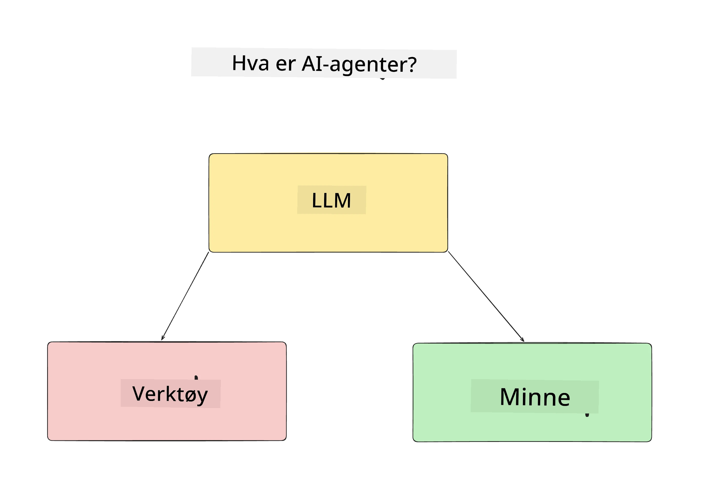
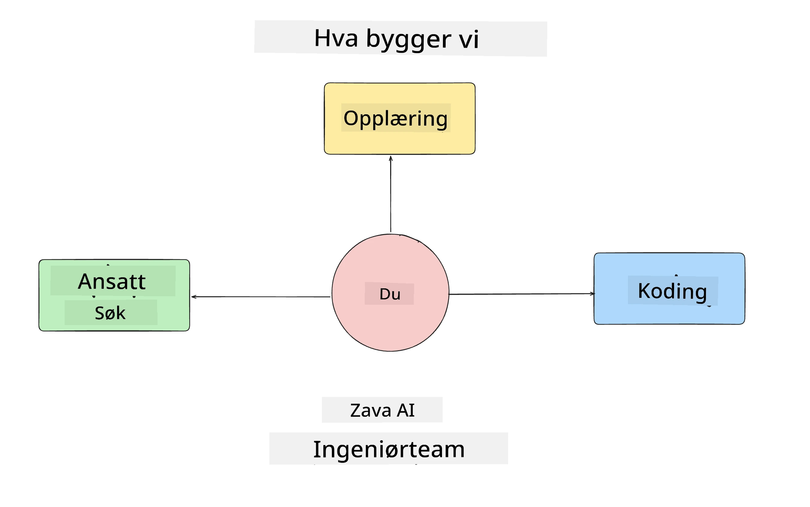
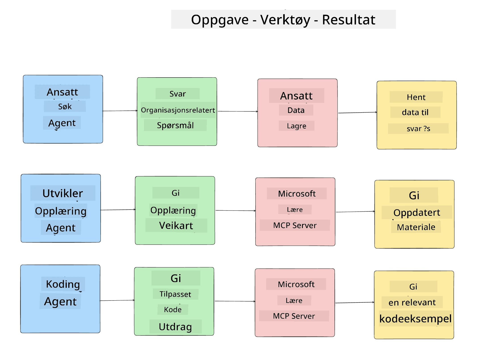
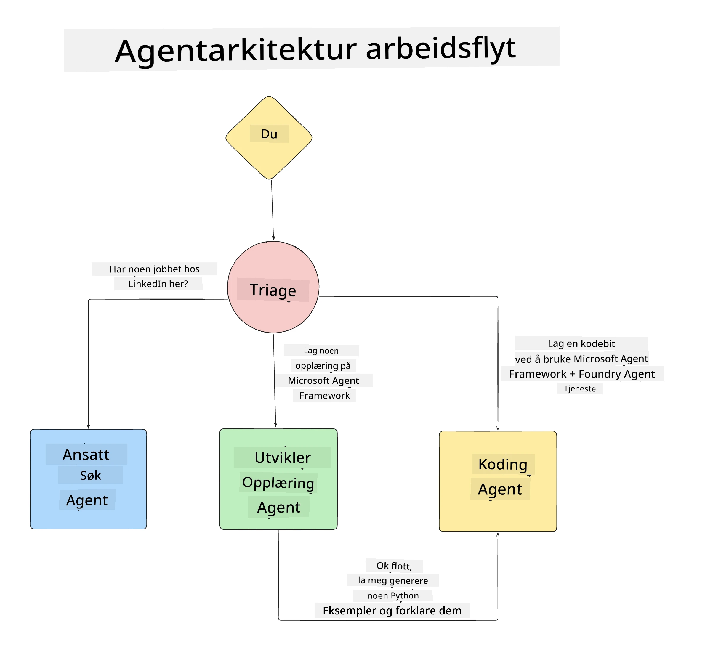

# Leksjon 1: Design av AI-agenter

Velkommen til den første leksjonen i "Bygge AI-agent fra null til produksjon"-kurset!

I denne leksjonen skal vi dekke:

- Definere hva AI-agenter er
  
- Diskutere AI-agent-applikasjonen vi bygger  

- Identifisere nødvendige verktøy og tjenester for hver agent
  
- Arkitektere vår agent-applikasjon
  
La oss starte med å definere hva en agent er og hvorfor vi vil bruke dem i en applikasjon.

> **Før du begynner på kurset.** Denne første leksjonen er konseptuell — det er ingen kode å kjøre.
> Fra [Leksjon 2](../lesson-2-agent-development/README.md) og videre trenger du: et **Azure
> abonnement** med tilgang til **Microsoft Foundry**, en utplassert **GPT-5-serie modell** (for
> eksempel `gpt-5.1` — unngå de avviklede GPT-4o / GPT-4.1), **Python 3.12+**, og **Azure CLI**
> (`az login`). Se [Hva du trenger](../README.md#what-you-need) i kurs-README for full
> liste og lenker.

## Hva er AI-agenter?

Hvis dette er første gang du utforsker hvordan du bygger en AI-agent, kan du ha spørsmål om hvordan du nøyaktig definerer hva en AI-agent er.

En enkel måte å definere hva en AI-agent er på, er ved komponentene som utgjør den:

**Stort språkmodell** - LLM vil drive evnen til å bearbeide naturlig språk fra brukeren for å tolke oppgaven de ønsker å fullføre samt tolke beskrivelsene av verktøyene som er tilgjengelige for å fullføre disse oppgavene.

**Verktøy** - Dette vil være funksjoner, API-er, datalagre og andre tjenester som LLM kan velge å bruke for å fullføre oppgavene som brukeren ber om.

**Minne** - Dette er hvordan vi lagrer både kortsiktige og langsiktige interaksjoner mellom AI-agenten og brukeren. Å lagre og hente denne informasjonen er viktig for å gjøre forbedringer og lagre brukerpreferanser over tid.

## Vårt AI-agent-bruksområde

For dette kurset skal vi bygge en AI-agent-applikasjon som hjelper nye utviklere å komme i gang med vårt AI-agent-utviklingsteam!

Før vi gjør noe utviklingsarbeid, er første steg for å lage en vellykket AI-agent-applikasjon å definere klare scenarier for hvordan vi forventer at brukerne skal arbeide med våre AI-agenter.

For denne applikasjonen jobber vi med disse scenariene:

**Scenario 1**: En ny ansatt blir med i organisasjonen og vil vite mer om teamet de har blitt med i og hvordan de kan komme i kontakt med dem.

**Scenario 2:** En ny ansatt vil vite hva som vil være den beste første oppgaven for dem å jobbe med.

**Scenario 3:** En ny ansatt ønsker å samle læringsressurser og kodeeksempler for å hjelpe dem i gang med å fullføre denne oppgaven.

## Identifisere verktøy og tjenester

Nå som vi har disse scenariene, er neste steg å kartlegge dem til verktøyene og tjenestene AI-agentene våre trenger for å fullføre disse oppgavene.

Denne prosessen faller under kategorien Kontekst-ingeniørkunst ettersom vi skal fokusere på å sørge for at våre AI-agenter har riktig kontekst til rett tid for å fullføre oppgavene.

La oss gjøre dette scenario for scenario og utføre god agentdesign ved å liste hver agents oppgaver, verktøy og ønskede resultater.

### Scenario 1 - Ansatt-søk-agent

**Oppgave** - Svar på spørsmål om ansatte i organisasjonen som ansettelsesdato, nåværende team, lokasjon og siste stilling.

**Verktøy** - Datalager med nåværende ansattliste og organisasjonskart

**Resultater** - I stand til å hente informasjon fra datalageret for å svare på generelle organisasjonsrelaterte spørsmål og spesifikke spørsmål om ansatte.

### Scenario 2 - Oppgaveanbefalingsagent

**Oppgave** - Basert på den nye ansattes utviklererfaring, finn 1-3 saker som den nye ansatte kan jobbe med.

**Verktøy** - GitHub MCP-server for å hente åpne saker og bygge en utviklerprofil

**Resultater** - I stand til å lese de siste 5 commitene på en GitHub-profil og åpne saker på et GitHub-prosjekt, og gi anbefalinger basert på match

### Scenario 3 - Kodeassistent-agent

**Oppgave** - Basert på de åpne sakene som ble anbefalt av "Oppgaveanbefalings"-agenten, forske på og tilby ressurser og generere kodeeksempler for å hjelpe den ansatte.

**Verktøy** - Microsoft Learn MCP for å finne ressurser og Kode-tolk for å generere tilpassede kodeeksempler.

**Resultater** - Hvis brukeren ber om ytterligere hjelp, skal arbeidsflyten bruke Learn MCP-serveren til å tilby lenker og utdrag av ressurser, og deretter overlate til Kode-tolk-agenten for å generere små kodeeksempler med forklaringer.

## Arkitektere vår agent-applikasjon

Nå som vi har definert hver av agentene våre, la oss lage et arkitekturdiagram som hjelper oss å forstå hvordan hver agent vil jobbe sammen og separat avhengig av oppgaven:

## Neste steg

Nå som vi har designet hver agent og vårt agentiske system, la oss gå videre til neste leksjon hvor vi skal utvikle hver av disse agentene!

---

<!-- CO-OP TRANSLATOR DISCLAIMER START -->
**Ansvarsfraskrivelse**:
Dette dokumentet er oversatt ved hjelp av AI-oversettelsestjenesten [Co-op Translator](https://github.com/Azure/co-op-translator). Selv om vi streber etter nøyaktighet, vær oppmerksom på at automatiske oversettelser kan inneholde feil eller unøyaktigheter. Det opprinnelige dokumentet på originalspråket skal betraktes som den autoritative kilden. For kritisk informasjon anbefales profesjonell menneskelig oversettelse. Vi er ikke ansvarlige for eventuelle misforståelser eller feiltolkninger som oppstår ved bruk av denne oversettelsen.
<!-- CO-OP TRANSLATOR DISCLAIMER END -->