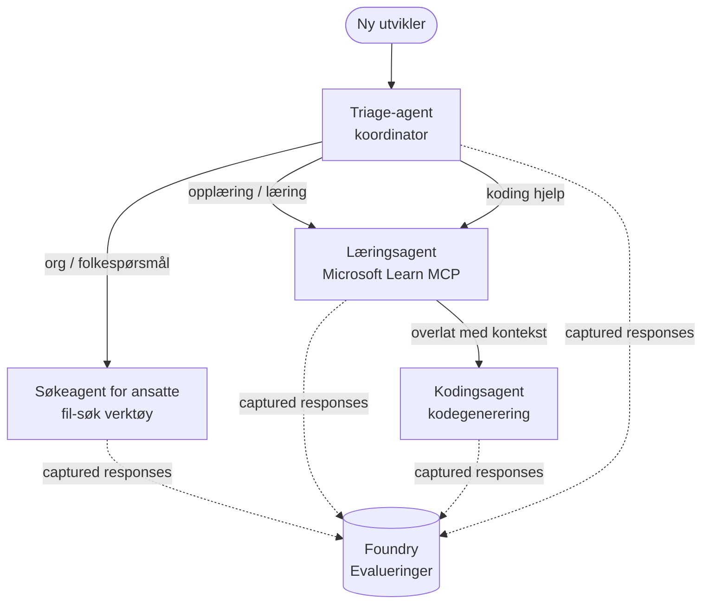

# Leksjon 3: Agentvurderinger med Microsoft Foundry

Velkommen til den tredje leksjonen i **"Bygge AI-agenter fra null til produksjon"**-kurset!

I [Leksjon 2](../lesson-2-agent-development/README.md) bygde du agenter. I denne leksjonen vil du
lære hvordan du svarer på et mye vanskeligere spørsmål: **er de gode?** Det å levere en agent som
kjører er enkelt; å vite om den ruter riktig, holder seg til dataene dine, og bruker verktøyene sine
riktig skiller en demo fra et produksjonssystem.

I denne leksjonen vil vi dekke:

- Hvorfor agentvurdering er viktig og hvordan det skiller seg fra tradisjonell testing
- Forskjellen mellom **observerbarhet**, **røyktester** og **vurderinger**
- Arbeidsflyten med flere agenter som vi skal måle
- De innebygde **Microsoft Foundry-evaluatorene** (relevans, forankring, nøyaktighet i verktøysanrop, utnyttelse av verktøyutdata)
- En trinnvis gjennomgang av vurderings-pipelinen i [`agent-evals.py`](../../../lesson-3-agent-evals/agent-evals.py)
- Hvordan kjøre den og lese resultatene

---

## Hvorfor evaluere agenter?

En tradisjonell enhetstest påstår at `add(2, 2) == 4`. Agenter fungerer ikke slik — samme
prompt kan gi ulik ordlyd ved hver kjøring, verktøy kan kalles i forskjellige rekkefølger, og
"korrekt" er ofte et spørsmål om grad heller enn en boolsk verdi. Du kan ikke påstå eksakte strenger.

I stedet evaluerer du agenter langs **kvalitetsdimensjoner** ved bruk av modellbaserte *evaluatorer* (også
kalt "LLM-som-dommer") pluss deterministiske sjekker av verktøybruk. Dette forteller deg ting som:

- Adresserte svaret faktisk spørsmålet? (**relevans**)
- Er svaret støttet av hentede data, eller hallusinerte agenten? (**forankring**)
- Kallet agenten riktig verktøy med riktige argumenter? (**nøyaktighet i verktøysanrop**)
- Brukte agenten faktisk det verktøyet returnerte? (**utnyttelse av verktøyutdata**)

### Tre komplementære kvalitetslag

Dette er ikke konkurrerende teknikker — en produksjonsagent bruker alle tre:

| Lag | Spørsmål det svarer på | Kostnad | Når det kjører | Dekket i |
|-------|-------------------------|---------|--------------|-----------|
| **Observerbarhet / sporing** | *Hva gjorde agenten, steg for steg?* | Gratis (alltid på) | Kontinuerlig i produksjon | Denne leksjonen |
| **Røyktester** | *Er agenten tilgjengelig og følger sin grunnleggende prompt?* | Billig, sekunder | Hver utrulling | [Leksjon 4](../lesson-4-agentdeployment/README.md#smoke-testing-the-hosted-agent-ci-gate) |
| **Evalueringer** | *Hvor **gode** er svarene?* | Langsommere, modellmålt | På forespørsel / nattlig / før utgivelse | Denne leksjonen |

Røyktester svarer på "krasjet det?"; evalueringer svarer på "er det bra?". Du trenger begge.

---

## Forutsetninger

1. Fullført [Leksjon 2](../lesson-2-agent-development/README.md) (agenter + vektorlagring).
2. Et **Microsoft Foundry**-prosjekt.
3. **Azure CLI** autentisert: `az login`.
4. **Python 3.12+** og kursavhengigheter installert:

   ```bash
   pip install -r ../requirements.txt
   ```


5. Miljøvariabler (opprett en `.env`-fil i denne mappen eller eksporter dem):

   | Variabel | Formål |
   |----------|---------|
   | `FOUNDRY_PROJECT_ENDPOINT` | Din Foundry-prosjektendepunkt (`https://<account>.services.ai.azure.com/api/projects/<project>`). Leses av agentenes `FoundryChatClient` **og** evalueringshjelperen. |
   | `FOUNDRY_MODEL` | Modellutrulling som **agentene** kjører på (f.eks. `gpt-5.1`). |
   | `VECTOR_STORE_ID` | Vektorbutikken for ansattregisteret laget i Lekse 2 |
   | `AZURE_AI_MODEL_DEPLOYMENT_NAME` | Modellutrulling brukt **av evaluatorene** (standard er `FOUNDRY_MODEL`, deretter `gpt-5.1`) |

> Agentene bruker `FoundryChatClient`, som henter konfigurasjon fra `FOUNDRY_`-prefikserte
> variabler (`FOUNDRY_PROJECT_ENDPOINT`, `FOUNDRY_MODEL`). Skybasert evalueringshjelper
> bruker `azure-ai-projects` SDK og vil falle tilbake til `FOUNDRY_PROJECT_ENDPOINT` hvis
> `AZURE_AI_PROJECT_ENDPOINT` ikke er satt — så de to `FOUNDRY_`-variablene er nok til
> å kjøre hele leksen.
>
> Evaluatorene drives også av en modell, så `AZURE_AI_MODEL_DEPLOYMENT_NAME`
> styrer hvilken utrulling som gjør vurderingen — det trenger ikke være samme modell som dine
> agenter bruker.

---

## Arbeidsflyten vi evaluerer

For å evaluere noe må du først kjøre det. Denne leksen gjenbruker **Developer Onboarding**
arbeidsflyten med flere agenter: en **triage** koordinator overgir til tre spesialister.



Arbeidsflyten er bygget med Microsoft Agent Frameworks **handoff** orkestrering. Den viktigste
ideen for evaluering er at **hvert agent-svar lagres på serversiden** og identifiseres med en
`response_id`. Disse ID-ene gir vi til evalueringsservicen.

---

## Evalueringsprosessen, steg for steg

[`agent-evals.py`](../../../lesson-3-agent-evals/agent-evals.py) implementerer en seks-stegs prosess. Her er hva hvert steg gjør
og hvorfor.

### Steg 1 — Kjør arbeidsflyten og spor response-IDer

Arbeidsflyten kjøres med `run_stream(...)`, og etter hvert som hendelser strømmer tilbake registrerer koden
`response_id` og `conversation_id` som hver agent produserer. Lagrede svar er råmaterialet
for evaluering — du vurderer *ekte* produksjonslignende svar, ikke gjenproduserte.


### Steg 2 — Oppsummer hva som ble fanget opp

En rask oppsummering viser hvor mange svar hver agent produserte, så du kan bekrefte at arbeidsflyten
faktisk brukte agentene du har tenkt å vurdere.

### Steg 3 — Hent de siste svarene

For hver agent hentes siste `response_id` via prosjektets OpenAI-kompatible
klient (`project_client.get_openai_client().responses.retrieve(...)`) slik at du kan forhåndsvise
teksten som skal vurderes.

### Steg 4 — Lag evalueringen

En evaluering lages med fire **innebygde Foundry-evaluatorer**:

| Evaluator | `evaluator_name` | Hva den måler |
|-----------|------------------|------------------|

| Relevans | `builtin.relevance` | Adresserer svaret brukerens forespørsel? |

| Jordethet | `builtin.groundedness` | Er svaret støttet av innhentede/verktøysdata (ikke hallusinert)? |
| Verktøy-kall presisjon | `builtin.tool_call_accuracy` | Ble riktige verktøy kalt med riktige argumenter? |
| Bruk av verktøyresultater | `builtin.tool_output_utilization` | Brukte agenten faktisk verktøyresultatene i svaret sitt? |

Hver evaluator initialiseres med distribusjonen navngitt av `AZURE_AI_MODEL_DEPLOYMENT_NAME`.

> **Hvorfor disse fire?** Relevans og jordethet måler *svar-kvalitet*; de to verktøy-
> evaluatorene måler *agent-oppførsel* — den delen tradisjonelle NLP-metrikker helt overser. For et
> verktøy-brukende, multi-agent system er verktøymetrikker ofte der de virkelige regresjonene skjuler seg.

### Steg 5 — Kjør evalueringen

De innfangede `response_id`s sendes til `evals.runs.create(...)` som datakilde. Tjenesten
gjenspiller hvert lagret svar gjennom hver evaluator.

### Steg 6 — Overvåk og les resultater

Koden polles til kjøringen er `completed` eller `failed`, deretter skrives resultat-tellinger og en
**`report_url`** ut — en dyp lenke inn i Foundry-portalen hvor du kan inspisere poeng per metrikk,
pass/fail-tellinger og individuelle vurderte svar.

---

## Kjør det

```bash
cd lesson-3-agent-evals
python agent-evals.py
```

Som standard evaluerer det den første eksempelspørringen
(`"I'm new here! Has anyone worked at Microsoft here?"`). To flere flett-intent eksempelspørringer
er inkludert i `run_evaluation_workflow()` — bytt ut `query`-variabelen for å prøve rutingsscenarier
som trener flere agenter i en enkelt kjøring.

Forventet konsollflyt:

```
Step 1: Running Developer Onboarding Workflow
Step 2: Response Data Summary
Step 3: Fetching Agent Responses
Step 4: Creating Evaluation
Step 5: Running Evaluation
Step 6: Monitoring Evaluation
  Status: running ...
  Evaluation completed successfully
  Report URL: https://...   <-- open this in the Foundry portal
```

---

## Observabilitet og sporing

Evalueringer forteller deg *hvor gode* svarene var; **observabilitet** forteller deg *hva som skjedde*
for å produsere dem — hvert agent-hopp, verktøy-kall, token-telling og latens. I Microsoft Foundry,
sender agent-kjøringer ut OpenTelemetry-spor du kan se i portalen, og Agent Framework kan
eksportere dem til Azure Monitor / Application Insights med et enkelt kall:

```python
from agent_framework.foundry import FoundryChatClient

client = FoundryChatClient()
client.configure_azure_monitor()   # eksporter spor og målinger til Application Insights
```

Bruk sporing for å **feilsøke** en dårlig evaluering: når jordethet faller, viser sporet om
fil-søk-verktøyet ikke returnerte noe, eller returnerte data agenten så ignorerte (som
er akkurat hva poengsettingen av bruk av verktøyresultater vurderer).

---

## Fra "kjøringer" til "godt": hvordan bruke dette i praksis

- **Pre-release port.** Kjør evalueringer mot et fast satt representativt sett av spørringer før
  du promoterer en ny prompt eller modell. Sammenlign poeng med forrige versjon — behandle et fall som en
  regresjon.
- **Nattlig kvalitetssignal.** Planlegg evalueringen for å oppdage drift fra data- eller avhengighets-
  endringer.
- **Par med røyktester.** [Lekse 4 røyktest](../lesson-4-agentdeployment/README.md#smoke-testing-the-hosted-agent-ci-gate)
  er din raske per-distribusjons-port; evalueringer er den langsommere, dypere kvalitetsporten. Kjør den rimelige
  på hver merge og den dyre på en tidsplan eller før utgivelse.

---

## Moderniseringsmerknad

Dette eksemplet migreres til dagens Microsoft Agent Framework Foundry API-flate
(`agent_framework.foundry`). Hvis du oppdaterer koden, se repository-roten
[`MIGRATION-GUIDE.md`](../MIGRATION-GUIDE.md) for verifiserte før/etter import- og klient-
mappinger (for eksempel `AzureAIClient` -> `FoundryChatClient`, og hosted-verktøy konstruksjon via
`client.get_file_search_tool(...)` / `client.get_mcp_tool(...)`). Evalueringskonseptene og
seks-stegs pipelinen ovenfor er uendret av denne migrasjonen.

---

## Ressurser

- [Evaluer generative AI-modeller og applikasjoner (Microsoft Learn)](https://learn.microsoft.com/en-us/azure/ai-foundry/concepts/evaluation-approach-gen-ai)
- [Innebygde evaluatorer for generativ AI](https://learn.microsoft.com/en-us/azure/ai-foundry/concepts/evaluation-evaluators/agent-evaluators)
- [Observabilitet i Microsoft Foundry](https://learn.microsoft.com/en-us/azure/ai-foundry/concepts/observability)
- [Microsoft Agent Framework](https://github.com/microsoft/agent-framework)
- [Agent-overleveringsorkestrering](https://learn.microsoft.com/en-us/agent-framework/workflows/orchestrations/handoff)

---

<!-- CO-OP TRANSLATOR DISCLAIMER START -->
**Ansvarsfraskrivelse**:
Dette dokumentet er oversatt ved hjelp av AI-oversettelsestjenesten [Co-op Translator](https://github.com/Azure/co-op-translator). Selv om vi streber etter nøyaktighet, vær oppmerksom på at automatiske oversettelser kan inneholde feil eller unøyaktigheter. Det opprinnelige dokumentet på originalspråket skal betraktes som den autoritative kilden. For kritisk informasjon anbefales profesjonell menneskelig oversettelse. Vi er ikke ansvarlige for eventuelle misforståelser eller feiltolkninger som oppstår ved bruk av denne oversettelsen.
<!-- CO-OP TRANSLATOR DISCLAIMER END -->