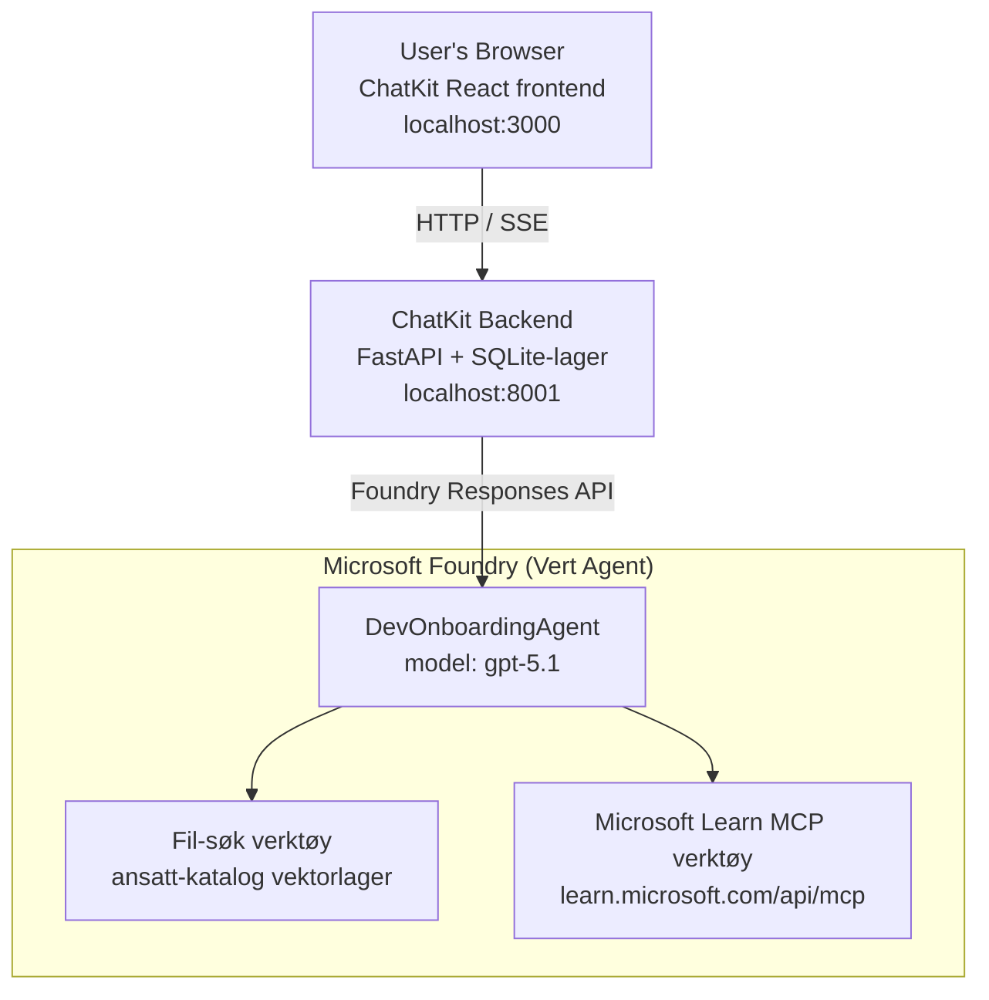

# Leksjon 4: Agentdistribusjon med Microsoft Foundry Hosted Agents + ChatKit

Denne leksjonen viser hvordan man distribuerer en verktøybrukende agent til Microsoft Foundry som en hostet agent og lager en ChatKit-basert frontend for å samhandle med den.

## Arkitektur

Den hostede agenten er en **enkel `DevOnboardingAgent`** (kjører på `gpt-5.1`) som svarer på utvikler-ombordstigningsspørsmål ved hjelp av to hostede verktøy: et **File Search** verktøy over ansattkatalogens vektorlager, og **Microsoft Learn MCP** verktøyet. En ChatKit React-frontend kommuniserer med en FastAPI-backend, som kaller agenten gjennom Foundrys **Responses API**.



## Forutsetninger

1. **Microsoft Foundry-prosjekt** i North Central US-regionen
2. **Azure CLI** autentisert (`az login`)
3. **Azure Developer CLI** (`azd`) installert
4. **Python 3.12+** og **Node.js 18+**
5. **Vektorlager** opprettet med ansattdata

## Rask start

### 1. Sett opp miljøvariabler

```bash
cd lesson-4-agentdeployment
cp .env.example .env
# Rediger .env med dine Microsoft Foundry-prosjektdetaljer
```

### 2. Distribuer den hostede agenten

**Alternativ A: Bruke Azure Developer CLI (anbefalt)**

```bash
cd hosted-agent
azd auth login
azd agent deploy
```

**Alternativ B: Bruke Docker + Azure Container Registry**

```bash
cd hosted-agent

# Bygg containeren
docker build -t developer-onboarding-agent:latest .

# Tag for ACR
docker tag developer-onboarding-agent:latest <your-acr>.azurecr.io/developer-onboarding-agent:latest

# Push til ACR
az acr login --name <your-acr>
docker push <your-acr>.azurecr.io/developer-onboarding-agent:latest

# Distribuer via Microsoft Foundry-portalen eller SDK-en
```

### 3. Start ChatKit-backenden

```bash
cd chatkit-server
python -m venv .venv
source .venv/bin/activate  # På Windows: .venv\Scripts\activate
pip install -r requirements.txt
python app.py
```

Serveren starter på `http://localhost:8001`

### 4. Start ChatKit-frontenden

```bash
cd chatkit-server/frontend
npm install
npm run dev
```

Frontenden starter på `http://localhost:3000`

### 5. Test applikasjonen

Åpne `http://localhost:3000` i nettleseren din og prøv disse spørsmålene:

**Ansatt-søk:**
- "Jeg er ny her! Har noen jobbet hos Microsoft?"
- "Hvem har erfaring med Azure Functions?"

**Læringsressurser:**
- "Lag en læringssti for Kubernetes"
- "Hvilke sertifiseringer bør jeg ta for skyløsninger?"

**Kodehjelp:**
- "Hjelp meg å skrive Python-kode for å koble til CosmosDB"
- "Vis meg hvordan jeg lager en Azure Function"

**Forespørsler til flere agenter:**
- "Jeg starter som skyingeniør. Hvem bør jeg kontakte og hva bør jeg lære?"

## Prosjektstruktur

```
lesson-4-agentdeployment/
├── .env.example                 # Environment variables template
├── implementation-plan.md       # Detailed implementation guide
├── README.md                    # This file
├── hosted-agent/               # Microsoft Foundry hosted agent
│   ├── main.py                 # Multi-agent workflow implementation
│   ├── requirements.txt        # Python dependencies
│   ├── Dockerfile              # Container definition
│   └── agent.yaml              # Agent deployment configuration
└── chatkit-server/             # ChatKit server application
    ├── app.py                  # FastAPI backend
    ├── store.py                # SQLite persistence layer
    ├── requirements.txt        # Python dependencies
    └── frontend/               # React frontend
        ├── package.json
        ├── vite.config.ts
        ├── tsconfig.json
        ├── index.html
        └── src/
            ├── main.tsx
            ├── App.tsx
            ├── App.css
            └── index.css
```

## Agenten og Dens Verktøy

Den hostede agenten er en **enkel agent** (`DevOnboardingAgent`, definert i `hosted-agent/main.py`) som håndterer tre ombordstigningsdomener. I stedet for å orkestrere separate sub-agenter, eksponerer den hver funksjon som et verktøy (eller bruker modellen direkte):

| Funksjon | Hvordan den håndteres | Verktøy |
|-----------|------------------|------|
| **Ansatt-søk & forbindelser** | Foundry hostet File Search over vektorlageret for ansattkatalogen | `client.get_file_search_tool(vector_store_ids=[...])` |
| **Læring & trening** | Microsoft Learn MCP-server (hostet MCP-verktøy) | `client.get_mcp_tool(url="https://learn.microsoft.com/api/mcp")` |
| **Kodehjelp** | Håndteres direkte av `gpt-5.1` modellen — ingen ekstern verktøy | — |

Agenten opprettes med `client.as_agent(name="DevOnboardingAgent", instructions=..., tools=[file_search_tool, learn_mcp_tool])` og serveres med `from_agent_framework(agent).run()`.

> **Designmerknad.** Tidligere utkast av denne leksjonen brukte `HandoffBuilder` multi-agent arbeidsflyt (Triage → spesialister). Den leverte agenten er en enkel verktøybrukende agent, som er enklere å distribuere og forstå for ombordstigningsspørsmål. For et eksempel på multi-agent orkestrering og overleveringer, se Leksjon 2 og Leksjon 3.

## Røyktesting av den hostede agenten (CI-port)

Å distribuere en hostet agent "vellykket" beviser bare at kontrollplanet aksepterte
definisjonen — det beviser **ikke** at agenten faktisk svarer. En manglende avhengighet,
feil modellruting eller en utløpt tilkobling kan gi en grønn-men-stille agent.

Denne leksjonen leverer en lettvekts **røyktest** som fungerer som en rask, billig post-distribusjonsport.
Den bruker [AI Smoke Test](https://github.com/marketplace/actions/ai-smoke-test)
GitHub Action for å POSTe prompt til agentens Foundry **Responses** endepunkt
(`POST {project_endpoint}/agents/{agent_name}/endpoint/protocols/openai/responses`)
og bekrefter på den returnerte teksten. Den fanger opp ødelagte distribusjoner, autentiseringsregresjoner,
system-prompt-avvik og trådbrudd på sekunder.

> Røyktester er **ikke** en erstatning for de fullstendige evalueringene i
> [Leksjon 3](../lesson-3-agent-evals/README.md) — de er et supplement. Røyktester
> svarer på *"er agenten tilgjengelig, svarer den, og følger den grunnleggende promptforventninger?"*;
> evalueringer svarer på *"hvor god er responsen?"*. Kjør den billige porten ved hver distribusjon.

### Hva som testes

Katalogen finnes i [`hosted-agent/tests/smoke-tests.json`](../../../lesson-4-agentdeployment/hosted-agent/tests/smoke-tests.json)
og tester agentens tre domener pluss promptfølgning og flertrinns-tråding:

| Test | Hva den verifiserer |
|------|------------------|
| `reachability` | Agenten svarer med ikke-tom, relevant tekst |
| `employee-search` | File-search domenet returnerer en gyldig `200` (svaret avhenger av data) |
| `learning-path` | Læringsdomenet gjentar emnet og gir et sti-lignende svar |
| `coding-assistance` | Kodedomenet returnerer et Python-svar formet som kode |
| `prompt-adherence-offtopic` | Avsporet forespørsel blir omdirigert, ikke besvart i detalj |
| `threading-turn-1/2` | Samtalestatus beholdes over turene via `previous_response_id` |

### Kjør den i CI

Arbeidsflyten i [`.github/workflows/smoke-test-hosted-agent.yml`](../../../.github/workflows/smoke-test-hosted-agent.yml)
har to jobber:

- **`static`** — en rask, ingen-Azure-port som kjører på hver pull request og push:
  den kompilerer all Python-kode (`py_compile`) og sjekker Markdown-lenker. Ingen hemmeligheter
  kreves, så den fungerer på fork PR-er.
- **`smoke`** — den Azure-tilkoblede røyktesten nedenfor. Den kjøres på forespørsel
  (Handlinger → **Agent CI (static + smoke)** → Kjør arbeidsflyten) og kan kjedes etter din
  distribusjonsarbeidsflyt.

Konfigurer disse depotets **variablene** og **hemmelighetene** for røykjobben:

| Type | Navn | Verdi |
|------|------|-------|
| Variabel | `FOUNDRY_PROJECT_ENDPOINT` | `https://<account>.services.ai.azure.com/api/projects/<project>` |
| Variabel | `HOSTED_AGENT_NAME` | Distribuert agentnavn (f.eks. `dev-onboarding` — må stemme med distribusjonen din) |
| Hemmelighet | `AZURE_CLIENT_ID` / `AZURE_TENANT_ID` / `AZURE_SUBSCRIPTION_ID` | OIDC føderert identitet for `azure/login` |

Runner-identiteten trenger **`Azure AI User`**-rollen på **Foundry prosjekt-nivå** slik at den kan
kalle Responses (og samtaler) data-plan endepunktene. Gi tilgang med:

```bash
az role assignment create \
  --assignee <object-id-or-appId-of-runner-identity> \
  --role "Azure AI User" \
  --scope "/subscriptions/<sub>/resourceGroups/<rg>/providers/Microsoft.CognitiveServices/accounts/<account>/projects/<project>"
```

### Kjør den lokalt

Du kan kjøre samme katalog før du pusher. Skaff et data-plan token skalert til
`https://ai.azure.com/` og pek runneren mot distribusjonen din:

```bash
# Publikum MÅ være https://ai.azure.com/ (cognitiveservices.azure.com-tokener blir avvist)
export FOUNDRY_TOKEN=$(az account get-access-token --resource https://ai.azure.com/ --query accessToken -o tsv)

git clone https://github.com/JFolberth/ai-smoketest && cd ai-smoketest
python runner.py \
  --project-endpoint "https://<account>.services.ai.azure.com/api/projects/<project>" \
  --agent-name dev-onboarding \
  --tests-file ../lesson-4-agentdeployment/hosted-agent/tests/smoke-tests.json
```

Avslutningskoder: `0` alt bestod, `1` en påstand feilet, `2` runner-feil (dårlig katalog / token).

## Feilsøking

### Agent svarer ikke
- Verifiser at den hostede agenten er distribuert og kjører i Microsoft Foundry
- Sjekk at `HOSTED_AGENT_NAME` og `HOSTED_AGENT_VERSION` stemmer med distribusjonen din

### Feil med vektorlager
- Sørg for at `VECTOR_STORE_ID` er riktig satt
- Verifiser at vektorlageret inneholder ansattdataene

### Autentiseringsfeil
- Kjør `az login` for å oppdatere legitimasjon
- Sørg for at du har tilgang til Microsoft Foundry-prosjektet

## Ressurser

- [Microsoft Foundry Hosted Agents Dokumentasjon](https://learn.microsoft.com/en-us/azure/ai-foundry/agents/concepts/hosted-agents)
- [Microsoft Agent Framework](https://github.com/microsoft/agent-framework)
- [ChatKit Integrasjonsprøve](https://github.com/microsoft/agent-framework/tree/main/python/samples/demos/chatkit-integration)
- [Azure Developer CLI](https://learn.microsoft.com/en-us/azure/developer/azure-developer-cli/overview)
- [AI Smoke Test GitHub Action](https://github.com/marketplace/actions/ai-smoke-test)
- [Røyktest Microsoft Foundry Agents med GitHub Actions (blogg)](https://techcommunity.microsoft.com/blog/azuredevcommunityblog/smoke-test-microsoft-foundry-agents-with-github-actions/4531912)

---

## Neste steg

Agenten din kjører på Microsoft-administrert infrastruktur. For å ta den til produksjon i bedrift —
kontrollere hvor dataene lagres (datasuverenitet, privat nettverk, bruk ditt eget Azure
Cosmos DB / Storage / AI Search) og styre dens verktøy — fortsett til
**[Leksjon 5: Produksjons-hostede agenter](../lesson-5-hosted-agents-production/README.md)**, som
forklarer den viktige forskjellen mellom **Hosted Agents** og **Capability Hosts**.

---

<!-- CO-OP TRANSLATOR DISCLAIMER START -->
**Ansvarsfraskrivelse**:
Dette dokumentet er oversatt ved hjelp av AI-oversettelsestjenesten [Co-op Translator](https://github.com/Azure/co-op-translator). Selv om vi streber etter nøyaktighet, vær oppmerksom på at automatiske oversettelser kan inneholde feil eller unøyaktigheter. Det opprinnelige dokumentet på originalspråket skal betraktes som den autoritative kilden. For kritisk informasjon anbefales profesjonell menneskelig oversettelse. Vi er ikke ansvarlige for eventuelle misforståelser eller feiltolkninger som oppstår ved bruk av denne oversettelsen.
<!-- CO-OP TRANSLATOR DISCLAIMER END -->