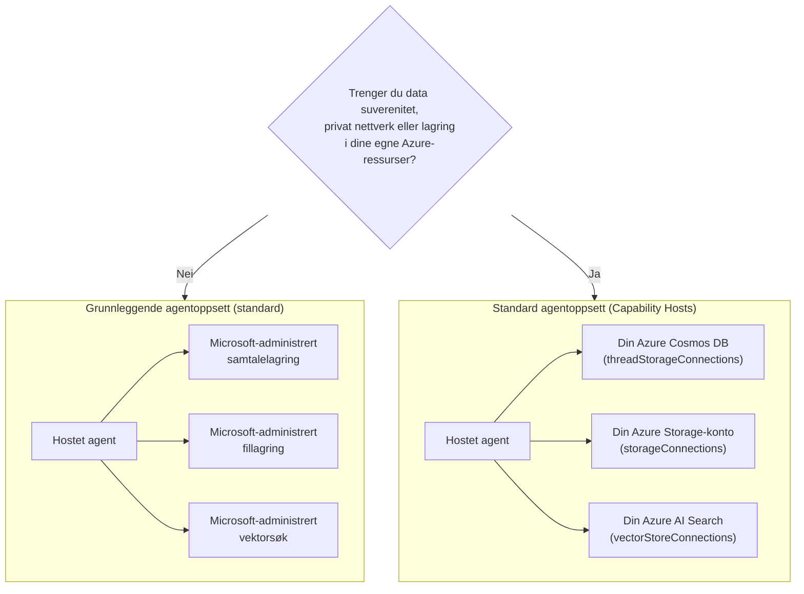

# Leksjon 5: Produksjonsverter — Lagring, Minne og Styring

I [Leksjon 4](../lesson-4-agentdeployment/README.md) distribuerte du Developer Onboarding
Agent som en **Microsoft Foundry Hosted Agent** og satte en ChatKit frontend foran den. Den
leksjonen svarte på *"hvordan leverer jeg en agent?"*. Denne leksjonen svarer på spørsmålene som følger
i en bedrift: **Hvor lagres agentens data? Hvem kontrollerer det? Hvordan oppfyller jeg regelverk,
nettverks- og styringskrav?**

Den viktigste ideen i denne leksjonen er forskjellen mellom en **Hosted Agent** og en
**Capability Host** — to konsepter som lett kan forveksles, men løser helt forskjellige
problemer.

## Læringsmål

Innen slutten av denne leksjonen vil du kunne:

- Forklare hva en **Hosted Agent** gir deg (Microsoft-administrert kjøring) og hva den **ikke** gjør.
- Forklare hva en **Capability Host** er og nøyaktig når du trenger en.
- Velge mellom **grunnleggende agent-oppsett** (Microsoft-administrert lagring) og **standard agent-oppsett**
  (bruk dine egne Azure-ressurser).
- Forstå hvordan **samtalehistorikk, filopplastinger og vektorlager** vedvares, og hvordan
  omdirigere dem til din egen Azure Cosmos DB, Azure Storage og Azure AI Search.
- Anvende styringskontroller: datasuverenitet, privat nettverk og **Hosted MCP verktøy-godkjenning**.

---

## Forutsetninger

1. Fullført [Leksjon 4](../lesson-4-agentdeployment/README.md) — du har en distribuert hosted agent.
2. Et **Microsoft Foundry** prosjekt, og en Azure-konto med tillatelse til å opprette ressurser
   (Cosmos DB, Storage, Azure AI Search) og tildele roller i abonnementet/ressursgruppen.
3. **Azure CLI** autentisert: `az login` (og `az account set --subscription <id>` hvis du har
   flere enn ett abonnement).
4. **Azure Developer CLI** (`azd`) installert — brukt for standard-oppsett provisjoneringsflyt.
5. **Python 3.12+** med kursavhengigheter installert (`pip install -r ../requirements.txt`).
6. En aktuell, ikke pensjonert modell-distribusjon (for eksempel `gpt-5.1`). Unngå pensjonerte GPT-4o / GPT-4.1.

> Denne leksjonen er hovedsakelig konseptuell og fokusert på kontrollplanet. Du kan lese den fra
> ende til ende uten å provisjonere noe, og deretter bruke de praktiske øvelsene når du er klar
> til å konfigurere et standard-oppsett.

---

## 1. Hosted Agents: hva Foundry administrerer for deg

En **Hosted Agent** er en agent hvis *kjøringsmiljø* er fullstendig administrert av Microsoft
Foundry Agent Service. Når du distribuerer en hosted agent (slik du gjorde i Leksjon 4), tilbyr Foundry:

- **Kraft** — runtime som kjører agentens kode og verktøy.
- **Skalering** — replikaer skaleres opp og ned etter belastning (se `agent.yaml` `scale` i Leksjon 4).
- **Identitet** — en administrert identitet for agenten, så den autentiserer til Azure uten hemmeligheter.
- **Observerbarhet** — sporing og telemetri (se Leksjon 3 sin observerbarhetsseksjon).
- **Sessionshåndtering** — tråder/samtaler, så flertrinns-chatter "husker" tidligere turer.

> **Hovedpoeng:** Du trenger **ikke** å konfigurere en Capability Host bare for å *kjøre* en Hosted
> Agent. En hosted agent fungerer direkte på Microsoft-administrert infrastruktur.

---

## 2. Hosted Agents vs Capability Hosts

**Hosted Agents og Capability Hosts løser forskjellige problemer.**

**Hosted Agents** tilbyr Microsoft-administrert kjøringsmiljø, inkludert kraft, skalering,
identitet, observerbarhet og sessionshåndtering. Du trenger **ikke** Capability Hosts bare for å kjøre
en Hosted Agent.

**Capability Hosts** er bare nødvendig når du ønsker at Agent Service skal bruke **kundeeide
ressurser** i stedet for Microsoft-administrert lagring. Hvis du er fornøyd med standard
Microsoft-administrert lagring, vektorsøk og samtalepersistens, **kreves ingen Capability Host
konfigurasjon.**

Hvis organisasjonen din krever **datasuverenitet, privat nettverk, etterlevelseskontroller eller
lagring i dine egne Azure Cosmos DB, Azure Storage Account og Azure AI Search ressurser**, da
konfigurerer du Capability Hosts for å koble Agent Service til disse ressursene.

Med ettsetningssvaret:

> En **Hosted Agent** handler om *hvor agenten kjører*. En **Capability Host** handler om *hvor
> agentens data bor*.

| Bekymring | Hosted Agent | Capability Host |
|---------|--------------|-----------------|
| Kraft / skalering / identitet | ✅ Tilbydd | — |
| Observerbarhet / sporing | ✅ Tilbydd | — |
| Samtale & trådsessionhåndtering | ✅ Tilbydd | Omdirigerer *hvor den lagres* |
| Hvor samtalehistorikk lagres | Microsoft-administrert som standard | Din Azure Cosmos DB |
| Hvor opplastede filer lagres | Microsoft-administrert som standard | Din Azure Storage Account |
| Hvor vektorinbeddinger lagres | Microsoft-administrert som standard | Din Azure AI Search |
| Påkrevd for å kjøre en agent? | ✅ Ja (det *er* agentverten) | ❌ Nei — valgfritt |
| Påkrevd for datasuverenitet / BYO lagring? | ❌ Ikke tilstrekkelig alene | ✅ Ja |

---

## 3. Grunnleggende vs Standard agent-oppsett

Foundry beskriver de to datakonfigurasjonene som **grunnleggende** og **standard** agent-oppsett.



### Når du bør bli på grunnleggende oppsett (uten Capability Host)

- Utvikling, prototyping og testing.
- Interne verktøy hvor Microsoft-administrert lagring tilfredsstiller din datapolitikk.
- Du ønsker den raskeste veien til en fungerende agent med minst infrastruktur.

### Når du trenger standard-oppsett (Capability Hosts)

- **Datasuverenitet** — all agentdata må forbli i ditt Azure-abonnement/region.
- **Sikkerhetskontroll** — du må bruke dine egne lagringskontoer, databaser og søketjenester.
- **Etterlevelse** — du har regulatoriske eller organisatoriske krav til hvor data lagres.
- **Privat nettverk** — trafikk må forbli innen ditt virtuelle nettverk (bruk ditt eget virtuelle nettverk).

> **Anbefaling fra Microsoft:** bruk *separate* Foundry-kontoer/prosjekter for standard og
> grunnleggende oppsett. Unngå å blande oppsetttyper innen samme Foundry-konto.

---

## 4. Hvordan Capability Hosts fungerer

En **Capability Host** er en underressurs du konfigurerer på **to nivåer**: Foundry **konto**
og Foundry **prosjekt**. Den forteller Agent Service hvor agentens data skal lagres og behandles:
samtalehistorikk, filopplastinger og vektorlager.

To regler er mest viktige:

1. **Konto før prosjekt.** Du kan ikke opprette en Capability Host på prosjektnivå med mindre det
   allerede finnes en Capability Host på kontonivå.

2. **Ingen arv av konfigurasjon.** **Prosjektet** sin Capability Host er det Agent Service virkelig
   leser for å avgjøre hvilke lagrings-/samtale-/vektorressurser som skal brukes. Konto-nivå
   tilkoblinger brukes *ikke* automatisk av et prosjekt — Capability Host for prosjektet må
   eksplisitt referere til dem.

### Tilkoblinger et standardoppsett trenger

Capability Hosts refererer til **tilkoblinger** (opprettet i din Foundry-konto/prosjekt) som peker på
dine Azure-ressurser:

| Capability host-egenskap | Lagrer | Din Azure-ressurs |
|--------------------------|--------|---------------------|
| `threadStorageConnections` | Agent-definisjoner + samtalehistorikk | Azure Cosmos DB |
| `storageConnections` | Filopplastinger / blob-lagring | Azure Storage Account |
| `vectorStoreConnections` | Vektorinnbaking for uthenting/søk | Azure AI Search |
| `aiServicesConnections` *(valgfritt)* | Egne modell-distribusjoner | Azure OpenAI |

Hver tilkobling må ha `authType`, `category`, `target` (tjenestens **endepunkt-URL**, ikke
ressurs-ID), og `metadata.ResourceId` (den fullstendige Azure-ressurs-IDen) fylt ut, ellers kan ikke Agent Service
løse opp ressursen under kjøring.

### Konfigurere Capability Hosts (kontrollplan)

Capability Hosts administreres per i dag via **Azure Resource Manager REST API** (det finnes ikke
noe SDK for Capability Host-administrasjon ennå). Først oppretter du **kontoens** Capability Host:

```http
PUT https://management.azure.com/subscriptions/{subscriptionId}/resourceGroups/{rg}/providers/Microsoft.CognitiveServices/accounts/{account}/capabilityHosts/{name}?api-version=2025-06-01

{
  "properties": { "capabilityHostKind": "Agents" }
}
```

Deretter oppretter du **prosjektets** Capability Host som refererer dine tilkoblinger:

```http
PUT https://management.azure.com/subscriptions/{subscriptionId}/resourceGroups/{rg}/providers/Microsoft.CognitiveServices/accounts/{account}/projects/{project}/capabilityHosts/{name}?api-version=2025-06-01

{
  "properties": {
    "capabilityHostKind": "Agents",
    "threadStorageConnections": ["my-cosmosdb-connection"],
    "vectorStoreConnections":  ["my-ai-search-connection"],
    "storageConnections":      ["my-storage-connection"]
  }
}
```

> **Begrensninger å huske:**
> - **Én Capability Host per scope.** En andre med samme scope gir `409 Conflict`.
> - **Ingen oppdateringer.** For å endre konfigurasjon må du **slette og opprette på nytt** Capability Host.
> - **Sletting er destruktivt.** Sletting av Capability Host fjerner agenters tilgang til filer,
>   samtaler og vektorlager den pekte på.

### Bekreft at det fungerer

Etter konfigurasjon, kjør en test-samtale og bekreft at:

- Samtaler vises i **din Azure Cosmos DB**.
- Opplastede filer vises i **din Azure Storage-konto**.
- Vektordata vises i **din Azure AI Search indeks**.

---

## 5. Minne- og kontekststyring

"Sesjonsstyring" (en Hosted Agent-funksjon) og "hvor tråder lagres" (en Capability Host
bekymring) kombineres for å gi agenten din **minne**:

- En **tråd** (samtale) holder på de ordnede trekkene i en chat. Responses API knytter sammen kall
  via `previous_response_id` (du så dette i luftetesten i Kapittel 4).
- På **grunnleggende oppsett** lever tråd-/samtaletilstand i Microsoft-administrert lagring.
- På **standardoppsett** lagres samme tilstand i **din Azure Cosmos DB** via
  `threadStorageConnections` — og gir deg varig, søkbar, suveren samtalehistorikk.

Dette er forskjellen mellom en agent som "husker innenfor en økt" og en bedrifts-
system hvor hver samtale beholdes innen ditt egne samsvarsgrenser.

---

## 6. Styrings- og sikkerhetssjekkliste

Bruk denne sjekklisten når du promoterer en hosted agent fra prototype til produksjon:

- [ ] **Bestem grunnleggende vs standard oppsett** ved hjelp av spørsmålene i §3 — dokumenter beslutningen.
- [ ] **Datasuverenitet:** hvis nødvendig, konfigurer Capability Hosts slik at samtalehistorikk
      (Cosmos DB), filer (Storage), og vektorer (AI Search) forblir i ditt abonnement/region.
- [ ] **Privat nettverk:** for standardoppsett, begrens trafikk med Bring Your Own Virtual
      Network slik at data ikke kan forlate nettverket ditt (hjelper med å hindre dataeksfiltrasjon).
- [ ] **RBAC:** gi minst nødvendige rettigheter. Opprettelse av Capability Hosts krever **Contributor** på
      Foundry-kontoen; å tildele tilgang til dine Azure-ressurser krever **User Access Administrator**
      eller **Owner**.
- [ ] **Hosted MCP verktøy-styring:** gjennomgå hver MCP-server som agenten din kan kalle og sett en
      **godkjenningsmodus** (se §7). Eksponer aldri et uroggjet eller eksternt verktøy for en produksjonsagent uten gjennomgang.
- [ ] **Observabilitet:** bekreft at sporing/telemetri er på (Kapittel 3) så du kan revidere verktøykall.
- [ ] **Kostnad:** BYO-ressurser (Cosmos DB, AI Search, Storage) faktureres på *ditt* abonnement —
      mål og overvåk disse. Grunnleggende oppsett inkluderer lagring i den administrerte tjenesten.

---

## 7. Hosted MCP-verktøy og godkjenningsflyter

Utvikler onboardings-agenten i Kapittel 4 bruker allerede et **Hosted MCP-verktøy** — den
[Microsoft Learn MCP-server](https://learn.microsoft.com/api/mcp) — lagt til med:

```python
client.get_mcp_tool(
    name="Microsoft Learn MCP",
    url="https://learn.microsoft.com/api/mcp",
    approval_mode="never_require",
)
```

**Model Context Protocol (MCP)** er en åpen standard som lar en agent oppdage og kalle
eksterne verktøy over et enhetlig grensesnitt. **Hosted MCP-verktøy** lar Foundry kalle en MCP-server på
agentens vegne. To styringsmekanismer er viktige i produksjon:

- **`approval_mode`** — kontrollerer om et menneske/bruker må godkjenne hvert verktøykall.
  - `never_require` er praktisk for en betrodd, kun les-server som Microsoft Learn.
  - For servere som kan **skrive** eller nå sensitive systemer, krev godkjenning slik at et kall blir
    gjennomgått før det utføres. Dette er din **godkjenningsflyt**.
- **Server tillatelsesliste** — koble kun til MCP-servere du har gjennomgått og stoler på.
  Behandle en MCP-URL som en hvilken som helst annen produksjonsavhengighet.

> **Prøv det:** endre `approval_mode` for agenten i Kapittel 4 til å kreve godkjenning, distribuer på nytt, og
> se hvordan verktøykall nå pauser for bekreftelse før de kjører.

---

## Praktiske øvelser

1. **Klassifiser et scenario.** For hver av disse, bestem *grunnleggende* eller *standard* oppsett og begrunn:
   (a) en hackathon-demo, (b) en onboarding-assistent for helsesektoren som håndterer PII, (c) en intern
   FAQ-bot, (d) en bankagent som må holde all data innenfor regionen.
2. **Kartlegg lagringen.** For agenten i Kapittel 4, list hvilken capability-host-egenskap som lagrer
   dens (a) chathistorikk, (b) opplastede ansattfiler, (c) vektorinnbaking.
3. **Design en godkjenningsflyt.** Legg til et hypotetisk "opprett Jira-sak" MCP-verktøy til agenten.
   Hvilken `approval_mode` ville du brukt og hvorfor?
4. **Kostnadsavveining.** Skriv to eller tre setninger om kostnadsimplikasjoner ved å gå fra grunnleggende
   til standard oppsett for en agent med høy trafikk.

---

## Ressurser

- [Capability hosts — Microsoft Foundry](https://learn.microsoft.com/azure/foundry/agents/concepts/capability-hosts)
- [Standard agent setup (innebygd enterprise readiness)](https://learn.microsoft.com/azure/foundry/agents/concepts/standard-agent-setup)

- [Bruk dine egne ressurser](https://learn.microsoft.com/azure/foundry/agents/how-to/use-your-own-resources)

- [Sett opp agentmiljøet ditt (grunnleggende vs standard)](https://learn.microsoft.com/azure/foundry/agents/environment-setup)
- [Sett opp privat nettverk for Foundry Agent Service](https://learn.microsoft.com/azure/foundry/agents/how-to/virtual-networks)
- [Legg til en tilkobling til prosjektet ditt](https://learn.microsoft.com/azure/foundry/how-to/connections-add)
- [Microsoft Learn MCP-server](https://learn.microsoft.com/training/support/mcp)
- [Model Context Protocol](https://modelcontextprotocol.io/)

---

**Forrige:** [Leksjon 4 — Agentdistribusjon](../lesson-4-agentdeployment/README.md) &nbsp;·&nbsp; **Neste:** [Leksjon 6 — Microsoft Toolbox](../lesson-6-toolbox/README.md)

---

<!-- CO-OP TRANSLATOR DISCLAIMER START -->
**Ansvarsfraskrivelse**:
Dette dokumentet er oversatt ved hjelp av AI-oversettelsestjenesten [Co-op Translator](https://github.com/Azure/co-op-translator). Selv om vi streber etter nøyaktighet, vær oppmerksom på at automatiske oversettelser kan inneholde feil eller unøyaktigheter. Det opprinnelige dokumentet på originalspråket skal betraktes som den autoritative kilden. For kritisk informasjon anbefales profesjonell menneskelig oversettelse. Vi er ikke ansvarlige for eventuelle misforståelser eller feiltolkninger som oppstår ved bruk av denne oversettelsen.
<!-- CO-OP TRANSLATOR DISCLAIMER END -->