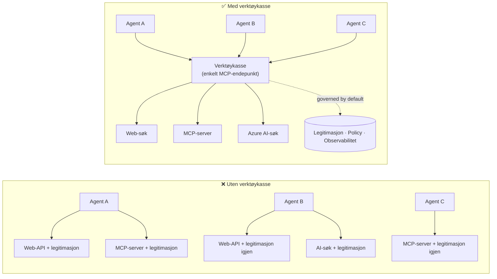

# Leksjon 6: Microsoft Toolbox — Styrte verktøy for agenter

Etter [Leksjon 5](../lesson-5-hosted-agents-production/README.md) kjører din hostede agent i
produksjon med lagrings- og styringsoppsettet organisasjonen din trenger. Men se tilbake på
agenten fra Leksjon 4: hvert verktøy var **hardkodet** i `main.py` — Microsoft Learn MCP-URL-en,
fil-søkevektorlageret, og så videre. Det fungerer for én agent. Det skalerer **ikke** til en
organisasjon med dusinvis av agenter og team.

Denne leksjonen introduserer **Microsoft Toolbox**: måten Foundry lar deg definere et kuratert sett av
verktøy **én gang**, administrere dem **sentralisert**, og eksponere dem for enhver agent gjennom en **enkel,
styrt endepunkt**.

## Læringsmål

Etter denne leksjonen vil du kunne:

- Forklare problemstillingen med verktøysprening som Toolbox løser.
- Beskrive søylene **Bygg** og **Konsum** og hvilke verktøytyper en toolbox kan inneholde.
- **Bygge** en toolbox-versjon med Foundry SDK.
- **Konsumer** en toolbox fra en Microsoft Agent Framework-hostet agent via et enkelt MCP-endepunkt.
- Bruke **versjonering** for å levere verktøysendringer uten endringer i agentkoden eller nyutrullinger.
- Anvende **styring**: RBAC, autentiseringsinjeksjon og guardrail (RAI)-policyer.

---

## Forutsetninger

1. Fullført [Leksjon 4](../lesson-4-agentdeployment/README.md) og ideelt sett
   [Leksjon 5](../lesson-5-hosted-agents-production/README.md).
2. Et **Microsoft Foundry**-prosjekt med tillatelse til å opprette og administrere toolbox-ressurser.
3. **Azure CLI** autentisert: `az login`. Foundry toolbox-API-ene krever
   `https://ai.azure.com/.default` token-omfang (vist i koden nedenfor).
4. **Python 3.12+** med kursavhengigheter installert (`pip install -r ../requirements.txt`).
5. En nåværende, ikke-retirert modellutrulling (for eksempel `gpt-5.1`). Unngå pensjonerte GPT-4o / GPT-4.1.

---

## 1. Problemet: verktøysprening

En enkelt agent kan være avhengig av mange verktøy — REST-APIer, MCP-servere, koblinger og flyter — hver
med sin egen autentiseringsmodell og ansvarlig team. Når du skalerer over en organisasjon:

- Team **implementerer de samme verktøyene på nytt** uavhengig av hverandre.
- **Legitimasjoner dupliseres** på tvers av agenter og kodearkiver.
- **Styring blir inkonsekvent** — hver agent håndhever (eller glemmer) policy på egen hånd.
- Det er **liten synlighet** i hvilke verktøy som finnes eller hvem som bruker dem.

Utviklere stopper opp — ikke fordi modellene ikke er kapable, men fordi **verktøyintegrasjon blir
flaskehalsen**.



Bedrifter har allerede infrastrukturen — gateways, legitimasjonskasser, policyer, observasjon.
Det som manglet var en utvikleropplevelse som pakker det inn i noe **gjenbrukbart,
oppdagbart, og styrt som standard**. Det er Toolbox.

---

## 2. Hva en Toolbox er

En **Toolbox** er en **administrert Foundry-ressurs**. Du definerer et kuratert sett av verktøy én gang,
administrerer dem sentralt i Foundry, og eksponerer dem gjennom **et enkelt, MCP-kompatibelt endepunkt** som enhver
agent kan konsumere. Ved kjøring håndterer plattformen **autentiseringsinjeksjon, token-fornyelse og
håndheving av bedriftsretningslinjer**.

Fordi en toolbox er en administrert ressurs, kan du legge til, fjerne eller rekonfigurere verktøy **uten å
endre kode i agenten din** — agenten kobler seg alltid til samme endepunkt.

Toolbox dekker verktøyets livssyklus gjennom fire søyler; **Bygg** og **Konsum** er tilgjengelige
i dag:

| Søyle | Status | Hva den muliggjør |
|--------|--------|-----------------|
| **Bygg** | Tilgjengelig i dag | Velg verktøy, konfigurer autentisering sentralt, publiser en gjenbrukbar toolbox som ethvert team kan konsumere. |
| **Konsum** | Tilgjengelig i dag | Koble enhver agent til ett MCP-kompatibelt endepunkt for dynamisk å oppdage og påkalle alle verktøy i toolboxen. |

Konsumeringsflaten er **åpen**: enhver MCP-kompatibel runtime eller klient kan bruke en toolbox —
Microsoft Agent Framework, LangGraph, GitHub Copilot, Claude Code, Microsoft Copilot Studio, eller
egendefinert kode.

### Verktøytyper en toolbox kan inneholde

Web Search · MCP · Azure AI Search · Code Interpreter · File Search · OpenAPI · **Agent-til-Agent
(A2A)** · Fabric IQ · Tool Search · Work IQ · Browser Automation · Ferdighetsreferanser, pluss en
**Guardrail (RAI)-policy** anvendt på toolbox-laget.

> **Tips:** Legg til en `description` på **hvert** verktøy slik at modellen kan velge riktig. En toolbox
> tillater maksimalt **ett uidentifisert verktøy per type** — gi hver ekstra forekomst av samme type et
> unikt `name`, ellers får du en `invalid_payload`-feil.

---

## 3. Bygg en toolbox

Toolboxer administreres med Foundry SDK-ene (Python/.NET/JavaScript), REST API, `azd`, og
**Microsoft Foundry Toolkit for VS Code**. Her er Python (`azure-ai-projects`) mønsteret:

```python
from azure.identity import DefaultAzureCredential
from azure.ai.projects import AIProjectClient
from azure.ai.projects.models import MCPTool, ToolboxSearchPreviewTool, WebSearchTool

endpoint = "https://<your-foundry-account>.services.ai.azure.com/api/projects/<your-project>"
project = AIProjectClient(endpoint=endpoint, credential=DefaultAzureCredential())

toolbox_version = project.toolboxes.create_toolbox_version(
    name="agent-tools",
    description="Web search + an MCP server + tool search",
    tools=[
        WebSearchTool(),
        MCPTool(
            server_label="myserver",
            server_url="https://your-mcp-server.example.com",
            require_approval="never",
            project_connection_id="my-key-auth-connection",  # legitimasjon finnes i Foundry
        ),
        ToolboxSearchPreviewTool(),
    ],
)
print(f"Created toolbox: {toolbox_version.name}, version: {toolbox_version.version}")
```

Merk hva du **ikke** gjør: ingen hemmeligheter i agenten. Legitimasjoner holdes av en Foundry
**tilkobling** (`project_connection_id`) og injiseres av plattformen ved kall.

> **Forhåndsvisningsnotat.** Toolbox **styring** (oppretting/oppdatering av versjoner) er en forhåndsvisningsfunksjon.
> `project.toolboxes.*`-operasjonene vist over leveres i forhåndsvisnings-SDK-bygninger, REST API, `azd`,
> og **Foundry Toolkit for VS Code** — de er **ikke** i den bestemte `azure-ai-projects` som brukes
> andre steder i dette kurset. Behandle eksemplet over som formen til Bygg-steget; for en
> klikk-gjennom-løsning, opprett toolboxen i **Foundry-portalen** eller **Foundry Toolkit**. 
> **Konsum**-steget nedenfor fungerer med kursets bestemte SDK i dag.

---

## 4. Konsumer en toolbox fra agenten din

En toolbox eksponerer et **MCP-endepunkt**. Det finnes to mønstre:

| Rolle | Endepunkt | Når å bruke |
|------|----------|-------------|
| **Toolbox-konsument** | `{project_endpoint}/toolboxes/{name}/mcp?api-version=v1` | Koble agenter. Server alltid **standardversjonen**. |
| **Toolbox-utvikler** | `{project_endpoint}/toolboxes/{name}/versions/{version}/mcp?api-version=v1` | Test en spesifikk versjon før promotering. |

> **Koble agenter til *konsument*-endepunktet.** Fordi det alltid serverer standardversjonen, du

> kan promotere nye versjoner **uten å endre agentkode eller omplassere**.

### Integrering med en Microsoft Agent Framework-hostet agent

Husk at Lesson 4-agenten la til et enkelt hardkodet MCP-verktøy med `client.get_mcp_tool(...)`. Med
Toolbox peker du i stedet **ett** `MCPStreamableHTTPTool` mot toolbox-endepunktet — og agenten
får **alle** verktøyene i toolboxen, styrt sentralt:

```python
import httpx
from azure.identity import DefaultAzureCredential, get_bearer_token_provider
from agent_framework import MCPStreamableHTTPTool

# Auth: Foundry verktøykasse krever https://ai.azure.com/.default-omfanget
credential = DefaultAzureCredential()
token_provider = get_bearer_token_provider(credential, "https://ai.azure.com/.default")
http_client = httpx.AsyncClient(auth=_ToolboxAuth(token_provider), timeout=120.0)

TOOLBOX_ENDPOINT = os.environ["TOOLBOX_ENDPOINT"]  # plattform-injisert ved kjøretid

mcp_tool = MCPStreamableHTTPTool(
    name="toolbox",
    url=TOOLBOX_ENDPOINT,
    http_client=http_client,
    load_prompts=False,
)

agent = chat_client.as_agent(
    name="my-toolbox-agent",
    instructions="You are a helpful assistant with access to Foundry toolbox tools.",
    tools=[mcp_tool],
)
```

Tilsvarende `.env` (merk: bruk en **aktuell** modell som `gpt-5.1`, **ikke** den pensjonerte
`gpt-4o`):

```env
FOUNDRY_PROJECT_ENDPOINT=https://<account>.services.ai.azure.com/api/projects/<project>
TOOLBOX_ENDPOINT=https://<account>.services.ai.azure.com/api/projects/<project>/toolboxes/agent-tools/mcp?api-version=v1
AZURE_AI_MODEL_DEPLOYMENT_NAME=gpt-5.1
```

> **Verifiser først.** Før du kobler til hele agenten, koble til en MCP-klient SDK (`pip install mcp`) til
> det **versjonsspesifikke** endepunktet og list opp verktøyene for å bekrefte at de lastes som forventet.

### Kjør konsum-sample

Denne leksjonen leverer et kjørbart konsum-sample, [`toolbox_agent.py`](../../../lesson-6-toolbox/toolbox_agent.py). Den bruker
samme `FoundryChatClient.get_mcp_tool(...)`-mønster som du lærte i Lesson 2, men peker det ene
MCP-verktøyet mot din **toolbox**-endepunkt — så agenten får alle styrte verktøy i toolboxen:

```bash
# I din .env, sett TOOLBOX_ENDPOINT til ditt verktøykasse-forbrukerendepunkt, så:
python lesson-6-toolbox/toolbox_agent.py
```

Åpne den utskrevne `http://localhost:8096`-URLen og still et spørsmål som bruker ett av dine
toolbox-verktøy. Legg til eller oppgrader et verktøy i toolboxen og spør igjen — **uten å endre
denne koden** — for å se sentral styring og versjonering i praksis.

---

## 5. Versjonering: lever endringer i verktøy på en sikker måte

Toolbox-versjonering gir deg eksplisitt kontroll over når endringer trer i kraft:

1. **Opprett** en ny toolbox-versjon med det oppdaterte verktøysettet.
2. **Test** den mot det versjonsspesifikke (utvikler-) endepunktet.
3. **Promotér** den til `default_version` når du er klar.

Hver agent som peker på **forbruker**-endepunktet henter automatisk opp den promotede versjonen — **ingen
kodeendringer, ingen omplassering**. (Den første versjonen du oppretter blir automatisk promotert til standard.)

Dette er verktøysstyringens ekvivalent til en blue/green deploy: du validerer en endring isolert,
og bytter deretter standard for alle forbrukere samtidig.

---

## 6. Styring: hvordan Toolbox forbedrer kontroll

Toolbox er **styrt som standard**. De styringsspakene du bør kjenne til:

- **RBAC.** Gi **Foundry User**-rollen i prosjektet til hver identitet: **utvikleren** som
  administrerer toolbox-versjoner, **agentens administrerte identitet** (for hostede agenter som kaller verktøy ved
  kjøring), og for OAuth-flyter, **sluttbrukeren** hvis identitet blir proxied.
- **Sentraliserte legitimasjoner.** Verktøyslegitimasjoner ligger i Foundry **tilkoblinger**, ikke i agentkode
  eller `.env`-filer. Plattformen injiserer dem og oppdaterer tokens ved kjøring.
- **Sikre retningslinjer (RAI-policy).** Knytt en navngitt ansvarlig-AI-policy til en toolbox-versjon via
  `policies.rai_config.rai_policy_name`. Den kjører på **toolbox-laget**, uavhengig av eventuelle
  modellnivås innholdsfilter, og skjermes verktøyinput og -output.
- **MCP-godkjenning.** Per-verktøy `require_approval` kontrollerer om et MCP verktøys-kall trenger godkjenning —
  samme godkjenningsflyt-konsept som du så i [Lesson 5 §7](../lesson-5-hosted-agents-production/README.md#7-hosted-mcp-tools--approval-workflows).
- **Privat nettverksføring.** Toolbox støtter virtuelle nettverkskonfigurasjoner for bedrifter som
  holder trafikken innenfor sitt nettverk.
- **Synlighet.** Fordi verktøy katalogiseres sentralt, får du endelig en oversikt over hva som
  eksisterer og hvem som bruker det.

---

## Praktiske øvelser

1. **Omstrukturér Lesson 4.** Lesson 4-agenten hardkoder Microsoft Learn MCP-verktøyet. Skisser hvordan du
   ville flytte det verktøyet inn i en `agent-tools` toolbox og peke `main.py` mot toolbox-forbruker
   endepunktet. Hva endres i `main.py`? Hva finnes ikke der lenger?
2. **Design en versjonsøkning.** Du må legge til et Web Search-verktøy i en aktiv toolbox brukt av fem
   agenter. Beskriv opprett → test → promotér sekvensen og forklar hvorfor ingen av de fem agentene
   trenger omplassering.
3. **Velg autentiseringsidentiteter.** For en hostet agent som kaller et OAuth-basert MCP-verktøy via en
   toolbox, list hvilke identiteter som trenger **Foundry User**-rollen og hvorfor.
4. **Plassering av sikring.** Forklar forskjellen på et modellnivås innholdsfilter og en
   toolbox-sikring, og gi ett scenario hvor du spesielt trenger toolbox-sikringen.

---

## Ressurser

- [Opprett, test og distribuer en toolbox i Foundry](https://learn.microsoft.com/azure/foundry/agents/how-to/tools/toolbox)
- [Verktøykatalog — Foundry Agent Service](https://learn.microsoft.com/azure/foundry/agents/concepts/tool-catalog)
- [Microsoft Agent Framework — Microsoft Foundry-leverandør (verktøy)](https://learn.microsoft.com/agent-framework/agents/providers/microsoft-foundry)
- [Oversikt over sikre retningslinjer](https://learn.microsoft.com/azure/foundry/guardrails/guardrails-overview)
- [Kom i gang med Foundry i VS Code (Foundry Toolkit)](https://learn.microsoft.com/azure/ai-foundry/how-to/develop/get-started-projects-vs-code)
- [Model Context Protocol](https://modelcontextprotocol.io/)

---

**Forrige:** [Lesson 5 — Production Hosted Agents](../lesson-5-hosted-agents-production/README.md)
&nbsp;·&nbsp; **Neste:** [Lesson 7 — Multi-Agent & A2A](../lesson-7-multi-agent-a2a/README.md)

---

<!-- CO-OP TRANSLATOR DISCLAIMER START -->
**Ansvarsfraskrivelse**:
Dette dokumentet er oversatt ved hjelp av AI-oversettelsestjenesten [Co-op Translator](https://github.com/Azure/co-op-translator). Selv om vi streber etter nøyaktighet, vær oppmerksom på at automatiske oversettelser kan inneholde feil eller unøyaktigheter. Det opprinnelige dokumentet på originalspråket skal betraktes som den autoritative kilden. For kritisk informasjon anbefales profesjonell menneskelig oversettelse. Vi er ikke ansvarlige for eventuelle misforståelser eller feiltolkninger som oppstår ved bruk av denne oversettelsen.
<!-- CO-OP TRANSLATOR DISCLAIMER END -->