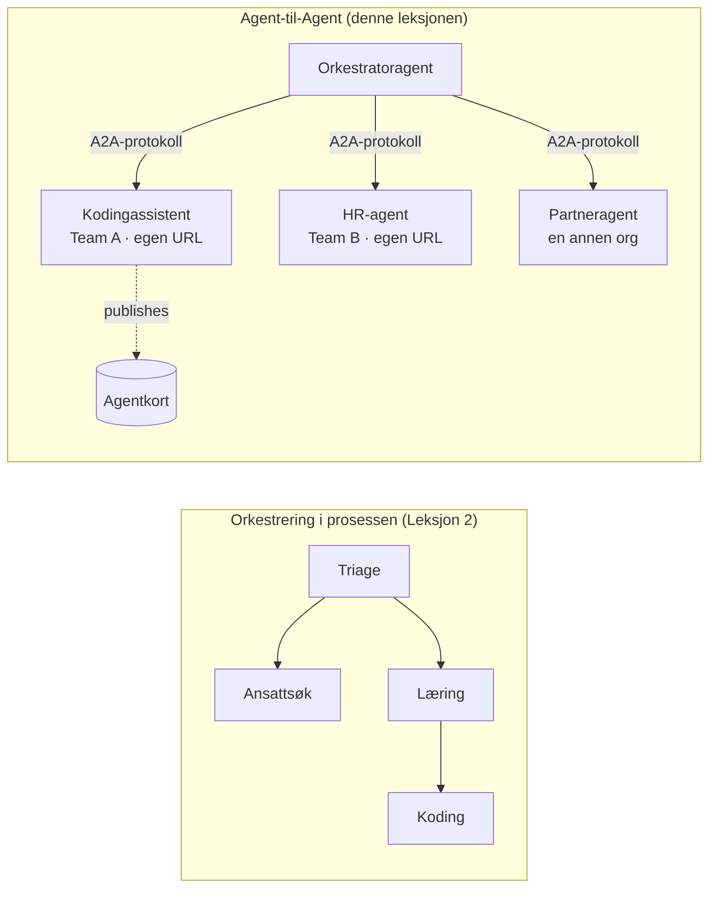

# Leksjon 7: Multi-Agent Orkestrering & Agent-til-Agent (A2A)

Med [Leksjon 6](../lesson-6-toolbox/README.md) kan du bygge styrte verktøy og hostede agenter.
Men ekte systemer bruker sjelden **én** agent. Når du skalerer, setter du sammen **mange** agenter — noen du
eier, noen eid av andre team, noen som kjører i helt andre organisasjoner. Denne leksjonen handler om
hvordan agenter jobber **sammen**.

Du har allerede møtt en form for multi-agent design i
[Leksjon 2 sin `agent-orchestration.py`](../lesson-2-agent-development/README.md): **handoff**
mønsteret, hvor en triage-agent ruter til spesialister **inne i en enkelt prosess**. Denne leksjonen tar
det ett nivå opp — til **Agent-til-Agent (A2A)**, den åpne protokollen for agenter som kjører som uavhengige
**nettverkstjenester** og kaller hverandre på tvers av prosess-, team- og organisasjonsgrenser.

## Læringsmål

Etter denne leksjonen vil du kunne:

- Forklare forskjellen mellom **inn-prosess orkestrering** (handoff/arbeidsflyter) og
  **Agent-til-Agent (A2A)** kommunikasjon, og velge riktig.
- Beskrive A2A byggesteinene: **Agentkort**, **ferdigheter**, **oppgaver** og **oppdagelse**.
- **Eksponere** en Microsoft Agent Framework-agent som en A2A-tjeneste med `A2AExecutor`.
- **Bruke** en ekstern agent som en nettverksbasert jevnbyrdig med `A2AAgent`.
- Anvende virksomhetskrav på A2A: **sikkerhet, identitet, styring, observerbarhet og kostnad**.

---

## Forutsetninger

1. Fullført [Leksjon 2](../lesson-2-agent-development/README.md) (agentutvikling & orkestrering).
2. Et **Microsoft Foundry**-prosjekt med en gjeldende modellutrulling (for eksempel `gpt-5.1`, og
   `gpt-5-codex` for kodesample). Unngå pensjonert GPT-4o / GPT-4.1.
3. **Azure CLI** autentisert: `az login`.
4. **Python 3.12+** med kursavhengigheter installert (`pip install -r ../requirements.txt`).
   Leksjon 7 legger til forhåndsvisning-pakkene `agent-framework-a2a`, `a2a-sdk`, og `uvicorn`.
5. `FOUNDRY_PROJECT_ENDPOINT` og `FOUNDRY_MODEL` satt i din `.env` (se kurs-README).

---

## 1. To måter agenter samarbeider på

Det finnes ikke ett enkelt "multi-agent" mønster. Velg det som passer til din **grense**:

| Mønster | Hvor agenter kjører | Hvordan de kobler | Bruk når |
|---------|-------------------|-------------------|----------|
| **Handoff / Arbeidsflyt** (Leksjon 2) | Én prosess, én kodebase | Minnebasert graf (`HandoffBuilder`, `WorkflowBuilder`) | Du eier alle agentene og distribuerer dem sammen. |
| **Agent-til-Agent (A2A)** (denne leksjonen) | Separate tjenester, separate livssykluser | Åpen **A2A-protokoll** over HTTP, oppdaget via **Agentkort** | Agenter eies av forskjellige team/org, skalerer uavhengig, eller er skrevet i forskjellige rammeverk. |

Handoff handler om **ruting inne i en applikasjon**. A2A handler om **å komponere agenter som
uavhengige tjenester** — agentenes ekvivalent til å gå fra funksjonskall til mikrotjenester.



> **De settes sammen.** En orkestrator du bygger med `HandoffBuilder` kan ha **eksterne A2A-agenter**
> som deltakere — inn-prosess ruting til tjenester som selv kjører hvor som helst.

---

## 2. A2A byggesteinene

A2A er en **åpen protokoll** (ikke Microsoft-spesifikk), så en A2A-agent kan brukes av Microsoft
Agent Framework, LangGraph, egendefinert kode, eller en annen bedrifts stack. Fire konsepter er viktige:

- **Agentkort** — et lite JSON-dokument, publisert på
  `/.well-known/agent-card.json`, som annonserer agentens **navn, beskrivelse, URL, versjon,
  ferdigheter og kapasiteter**. Dette er hvordan en klient **oppdager** hva en ekstern agent kan gjøre.
- **Ferdigheter** — de erklærte tingene agenten kan gjøre (`id`, `navn`, `beskrivelse`, `tags`,
  `eksempler`). Klienter (og modeller) bruker disse for å bestemme om de skal kalle den.
- **Oppgaver** — et kall til en A2A-agent er en **oppgave** med livssyklus (innsendt → arbeider →
  fullført/feilet). Serveren sporer oppgaver i en **oppgave-lager**; strømming av oppdateringer støttes.
- **Oppdagelse** — en klient som kun har en URL henter Agentkortet og vet hvordan den skal kalle agenten.

---

## 3. Eksponer en agent som en A2A-tjeneste — `a2a_server.py`

**Bygg/serve**-siden pakker inn en Microsoft Agent Framework-agent med `A2AExecutor` og monterer den
på en A2A HTTP-applikasjon. Se [`a2a_server.py`](../../../lesson-7-multi-agent-a2a/a2a_server.py). Nøkkelkoblingen:

```python
from agent_framework.a2a import A2AExecutor
from a2a.server.apps import A2AStarletteApplication
from a2a.server.request_handlers import DefaultRequestHandler
from a2a.server.tasks import InMemoryTaskStore
from a2a.types import AgentCapabilities, AgentCard, AgentSkill

agent = client.as_agent(name="coding-assistant", instructions="...")

agent_card = AgentCard(
    name="Coding Assistant",
    description="Generates runnable code samples...",
    url="http://localhost:9000/",
    version="1.0.0",
    capabilities=AgentCapabilities(streaming=True),
    default_input_modes=["text"],
    default_output_modes=["text"],
    skills=[AgentSkill(id="generate-code", name="Generate code",
                       description="Write a runnable code snippet.", tags=["code"])],
)

request_handler = DefaultRequestHandler(
    agent_executor=A2AExecutor(agent),
    task_store=InMemoryTaskStore(),
)
app = A2AStarletteApplication(agent_card=agent_card, http_handler=request_handler).build()
# serveres med uvicorn på port 9000
```

Merk at agentkoden er **uendret** — `A2AExecutor` tilpasser din eksisterende agent til protokollen.
Agentkortet gjør den **oppdagbar** for hvilken som helst A2A-klient.

---

## 4. Bruk en ekstern agent — `a2a_client.py`

**Bruk**-siden kobler til en ekstern agent **via URL**, henter Agentkortet og kaller den
akkurat som en lokal agent. Se [`a2a_client.py`](../../../lesson-7-multi-agent-a2a/a2a_client.py):

```python
from agent_framework.a2a import A2AAgent

remote_agent = A2AAgent(name="remote-coding-assistant", url="http://localhost:9000")
result = await remote_agent.run("Write a Python function that reverses a string.")
print(result.text)
```

Det er hele poenget med A2A: fra anroperens side oppfører en ekstern agent seg som en hvilken som helst
annen `agent_framework` agent, så du kan bruke den i en arbeidsflyt eller overlevere til den — selv
om den kjører i en annen prosess, på en annen maskin, eid av et annet team.

### Kjør det fra start til slutt

```bash
# Terminal 1 — start A2A-tjenesten
python a2a_server.py

# Terminal 2 — ring den opp
python a2a_client.py "Write a Python function that reverses a string."
```

Du vil se kodingsassistentens svar komme over A2A-protokollen. Åpne
`http://localhost:9000/.well-known/agent-card.json` i en nettleser for å se det publiserte Agentkortet.

---

## 5. Virksomhetsbekymringer

Å gjøre agenter til nettverkstjenester introduserer de samme utfordringene som i ethvert distribuert system —
pluss noen AI-spesifikke:

- **Identitet & autentisering.** Eksponer aldri en A2A-agent uten autentisering. Agentkortet inkluderer
  `security` / `security_schemes`, og `A2AAgent` aksepterer en `auth_interceptor` slik at anroperne kan legge til
  legitimasjon (OAuth-bærertoken, API-nøkler). Bruk Entra ID / administrerte identiteter for
  tjeneste-til-tjeneste autentisering i produksjon; plasser tjenesten bak en gateway.
- **Styring.** Kombiner A2A med [Leksjon 6's Toolbox](../lesson-6-toolbox/README.md): en ekstern
  agent kan publiseres som et **A2A verktøy** i en styrt verktøykasse slik at RBAC, legitimasjonsinjeksjon,
  og policyer for retningslinjer gjelder sentralt.
- **Observerbarhet.** En forespørsel krysser nå prosessgrenser, så propagér tracing gjennom kallet.
  Aktiver [Foundry Observerbarhet / OpenTelemetry](../lesson-3-agent-evals/README.md) på **både** den
  orkestrator og hver ekstern agent for å få én ende-til-ende sporing.
- **Versjonering.** Agentkortet har en `version`. Behandle det som en API: additive endringer er trygge;
  bryting av en ferdighets kontrakt krever en ny versjon og et migrasjonsvindu for brukerne.
- **Pålitelighet.** Eksterne agenter kan feile uavhengig. Sett tidsavbrudd (`A2AAgent(timeout=...)`), håndter
  delvise feil, og ikke la en treg jevnbyrdig stoppe hele orkestreringen.
- **Kostnad.** Hvert eksternt agentkall er sin egen modell-invokasjon. Fan-out multipliserer token-bruk —
  budsjetter for det, og foretrekk ruting til **én** beste agent fremfor å kringkaste til mange.

---

## Praktiske øvelser

1. **Legg til en andre tjeneste.** Kopier `a2a_server.py` for å eksponere **employee-search** agenten på port
   9001 med sitt eget Agentkort og ferdigheter. Kjør begge, og få en klient til å kalle begge.
2. **Orkestrer eksterne jevnbyrdige.** Bygg en liten `HandoffBuilder` (eller enkel ruter) hvis deltakere
   inkluderer to `A2AAgent`s som peker på dine to tjenester. Ruter en spørring til riktig.
3. **Sikre det.** Legg til en `auth_interceptor` i klienten og kreve bærertoken på serveren.
   Hva bryter hvis token mangler? Hvor ville du lagret token i produksjon?
4. **Handoff vs A2A.** Skriv to korte avsnitt: når beholder du Leksjon 2 sin inn-prosess
   handoff, og når er den ekstra kompleksiteten i A2A berettiget? Gi et konkret eksempel på hver.

---

## Ressurser

- [Agent-til-Agent (A2A) — Microsoft Agent Framework](https://learn.microsoft.com/agent-framework/user-guide/agent-orchestration/a2a)
- [Multi-agent orkestrering — Microsoft Agent Framework](https://learn.microsoft.com/agent-framework/user-guide/agent-orchestration/)
- [A2A protokollspesifikasjon](https://a2a-protocol.org/)
- [A2A Python SDK (`a2a-sdk`)](https://github.com/a2aproject/a2a-python)
- [Foundry Agent Service — multi-agent mønstre](https://learn.microsoft.com/azure/ai-foundry/agents/concepts/connected-agents)

---

**Forrige:** [Leksjon 6 — Microsoft Toolbox](../lesson-6-toolbox/README.md)

---

<!-- CO-OP TRANSLATOR DISCLAIMER START -->
**Ansvarsfraskrivelse**:
Dette dokumentet er oversatt ved hjelp av AI-oversettelsestjenesten [Co-op Translator](https://github.com/Azure/co-op-translator). Selv om vi streber etter nøyaktighet, vær oppmerksom på at automatiske oversettelser kan inneholde feil eller unøyaktigheter. Det opprinnelige dokumentet på originalspråket skal betraktes som den autoritative kilden. For kritisk informasjon anbefales profesjonell menneskelig oversettelse. Vi er ikke ansvarlige for eventuelle misforståelser eller feiltolkninger som oppstår ved bruk av denne oversettelsen.
<!-- CO-OP TRANSLATOR DISCLAIMER END -->