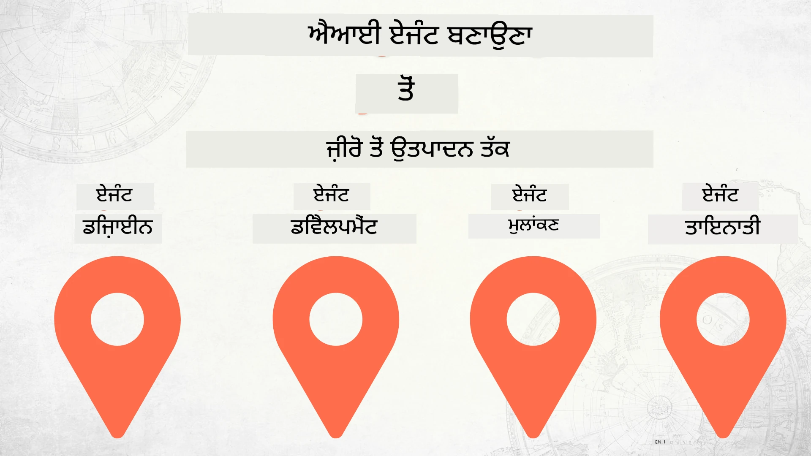

# ਜ਼ੀਰੋ ਤੋਂ ਉਤਪਾਦਨ ਤੱਕ ਏਆਈ ਏਜੰਟ ਬਣਾਉਣਾ



### 🌐 ਬਹੁ-ਭਾਸ਼ਾਈ ਸਹਿਯੋਗ

#### GitHub ਐਕਸ਼ਨ ਰਾਹੀਂ ਸਮਰਥਿਤ (ਆਟੋਮੇਟਿਕ ਅਤੇ ਹਮੇਸ਼ਾ ਅਤਿ-ਆਧੁਨਿਕ)

<!-- CO-OP TRANSLATOR LANGUAGES TABLE START -->
[Arabic](../ar/README.md) | [Bengali](../bn/README.md) | [Bulgarian](../bg/README.md) | [Burmese (Myanmar)](../my/README.md) | [Chinese (Simplified)](../zh-CN/README.md) | [Chinese (Traditional, Hong Kong)](../zh-HK/README.md) | [Chinese (Traditional, Macau)](../zh-MO/README.md) | [Chinese (Traditional, Taiwan)](../zh-TW/README.md) | [Croatian](../hr/README.md) | [Czech](../cs/README.md) | [Danish](../da/README.md) | [Dutch](../nl/README.md) | [Estonian](../et/README.md) | [Finnish](../fi/README.md) | [French](../fr/README.md) | [German](../de/README.md) | [Greek](../el/README.md) | [Hebrew](../he/README.md) | [Hindi](../hi/README.md) | [Hungarian](../hu/README.md) | [Indonesian](../id/README.md) | [Italian](../it/README.md) | [Japanese](../ja/README.md) | [Kannada](../kn/README.md) | [Korean](../ko/README.md) | [Lithuanian](../lt/README.md) | [Malay](../ms/README.md) | [Malayalam](../ml/README.md) | [Marathi](../mr/README.md) | [Nepali](../ne/README.md) | [Nigerian Pidgin](../pcm/README.md) | [Norwegian](../no/README.md) | [Persian (Farsi)](../fa/README.md) | [Polish](../pl/README.md) | [Portuguese (Brazil)](../pt-BR/README.md) | [Portuguese (Portugal)](../pt-PT/README.md) | [Punjabi (Gurmukhi)](./README.md) | [Romanian](../ro/README.md) | [Russian](../ru/README.md) | [Serbian (Cyrillic)](../sr/README.md) | [Slovak](../sk/README.md) | [Slovenian](../sl/README.md) | [Spanish](../es/README.md) | [Swahili](../sw/README.md) | [Swedish](../sv/README.md) | [Tagalog (Filipino)](../tl/README.md) | [Tamil](../ta/README.md) | [Telugu](../te/README.md) | [Thai](../th/README.md) | [Turkish](../tr/README.md) | [Ukrainian](../uk/README.md) | [Urdu](../ur/README.md) | [Vietnamese](../vi/README.md)

> **ਇਸ ਨੂੰ ਸਥਾਨਕ ਤੌਰ 'ਤੇ ਕਲੋਨ ਕਰਨਾ ਪਸੰਦ ਕਰੋ?**
>
> ਇਸ ਰੀਪੋ ਵਿੱਚ 50+ ਭਾਸ਼ਾਵਾਂ ਦੀਆਂ ਅਨੁਵਾਦ ਸ਼ਾਮਲ ਹਨ ਜੋ ਡਾਊਨਲੋਡ ਦਾ ਆਕਾਰ ਕਾਫ਼ੀ ਵਧਾਉਂਦੇ ਹਨ। ਬਿਨਾਂ ਅਨੁਵਾਦਾਂ ਦੇ ਕਲੋਨ ਕਰਨ ਲਈ, ਸਪਾਰਸ ਚੈਕਆਉਟ ਦੀ ਵਰਤੋਂ ਕਰੋ:
>
> **Bash / macOS / Linux:**
> ```bash
> git clone --filter=blob:none --sparse https://github.com/microsoft/Building-AI-Agents-From-Zero-To-Production.git
> cd Building-AI-Agents-From-Zero-To-Production
> git sparse-checkout set --no-cone '/*' '!translations' '!translated_images'
> ```
>
> **CMD (Windows):**
> ```cmd
> git clone --filter=blob:none --sparse https://github.com/microsoft/Building-AI-Agents-From-Zero-To-Production.git
> cd Building-AI-Agents-From-Zero-To-Production
> git sparse-checkout set --no-cone "/*" "!translations" "!translated_images"
> ```
>
> ਇਸ ਨਾਲ ਤੁਹਾਨੂੰ ਕੌਰਸ ਨੂੰ ਮੁਕੰਮਲ ਕਰਨ ਲਈ ਲੋੜੀਂਦਾ ਸਾਰਾ ਕੁਝ ਬਹੁਤ ਤੇਜ਼ ਡਾਊਨਲੋਡ ਨਾਲ ਮਿਲ ਜਾਵੇਗਾ।
<!-- CO-OP TRANSLATOR LANGUAGES TABLE END -->

## ਏਆਈ ਏਜੰਟ ਵਿਕਾਸ ਲਾਈਫਸਾਈਕਲ ਦੇ ਮੂਲ ਭੂਤ ਤੱਤ ਸਿੱਖਾਉਣ ਵਾਲਾ ਇੱਕ ਕੋਰਸ

[](https://github.com/microsoft/Building-AI-Agents-From-Zero-To-Production/blob/master/LICENSE?WT.mc_id=academic-105485-koreyst)
[](https://GitHub.com/microsoft/Building-AI-Agents-From-Zero-To-Production/graphs/contributors/?WT.mc_id=academic-105485-koreyst)
[](https://GitHub.com/microsoft/Building-AI-Agents-From-Zero-To-Production/issues/?WT.mc_id=academic-105485-koreyst)
[](https://GitHub.com/microsoft/Building-AI-Agents-From-Zero-To-Production/pulls/?WT.mc_id=academic-105485-koreyst)
[](http://makeapullrequest.com?WT.mc_id=academic-105485-koreyst)

[](https://discord.gg/Kuaw3ktsu6)

## 🌱 ਸ਼ੁਰੂਆਤ

ਇਸ ਕੋਰਸ ਵਿੱਚ ਏਆਈ ਏਜੰਟ ਬਣਾਉਣ ਅਤੇ ਤਿਆਰ ਕਰਨ ਦੇ ਮੁੱਢਲੇ ਸਭਕਾਂ ਨੂੰ ਕਵਰ ਕੀਤਾ ਗਿਆ ਹੈ।

ਹਰ ਇੱਕ ਪਾਠ ਪਹਿਲੇ ਪਾਠ ਤੇ ਆਧਾਰਿਤ ਹੈ, ਇਸ ਲਈ ਅਸੀਂ ਸਿਫ਼ਾਰਸ਼ ਕਰਦੇ ਹਾਂ ਕਿ ਤੁਸੀਂ ਸ਼ੁਰੂਆਤ ਤੋਂ ਹੁੰਕੇ ਆਖਰੀ ਤੱਕ ਕੰਮ ਕਰੋ।

ਜੇ ਤੁਸੀਂ ਏਆਈ ਏਜੰਟ ਦੇ ਵਿਸ਼ਿਆਂ ਬਾਰੇ ਹੋਰ ਜਾਣਨਾ ਚਾਹੁੰਦੇ ਹੋ, ਤਾਂ ਤੁਸੀਂ [AI Agents For Beginners Course](https://aka.ms/ai-agents-beginners) ਵਿੱਚ ਵੇਖ ਸਕਦੇ ਹੋ।

### ਹੋਰ ਸਿੱਖਣ ਵਾਲਿਆਂ ਨਾਲ ਮਿਲੋ, ਆਪਣੇ ਸਵਾਲਾਂ ਦੇ ਜਵਾਬ ਪ੍ਰਾਪਤ ਕਰੋ

ਜੇ ਤੁਸੀਂ ਕਿਤੇ ਫਸ ਜਾਂਦੇ ਹੋ ਜਾਂ ਏਆਈ ਏਜੰਟ ਬਣਾਉਣ ਬਾਰੇ ਕੋਈ ਸਵਾਲ ਹੈ, ਤਾਂ ਸਾਡੇ espesyal ਡਿਸਕੋਰਡ ਚੈਨਲ ਵਿੱਚ ਸ਼ਾਮਿਲ ਹੋਵੋ [Microsoft Foundry Discord](https://discord.gg/Kuaw3ktsu6)।

### ਤੁਹਾਨੂੰ ਕੀ ਲੋੜ ਹੈ

ਹਰ ਪਾਠ ਦੇ ਨਾਲ ਇਕ ਕੋਡ ਸੈਂਪਲ ਹੁੰਦਾ ਹੈ ਜੋ ਤੁਸੀਂ ਸਥਾਨਕ ਰੂਪ ਵਿੱਚ ਚਲਾ ਸਕਦੇ ਹੋ। ਤੁਸੀਂ [ਇਹ ਰੀਪੋ fork ਕਰ ਸਕਦੇ ਹੋ](https://github.com/microsoft/Building-AI-Agents-From-Zero-To-Production/fork) ਆਪਣੀ ਕਾਪੀ ਬਣਾਉਣ ਲਈ।

ਇਹ ਕੋਰਸ ਹੁਣੇ ਹੇਠਾਂ ਦਿੱਤੀਆਂ ਚੀਜ਼ਾਂ ਦੀ ਵਰਤੋਂ ਕਰਦਾ ਹੈ:

- [Microsoft Agent Framework (MAF)](https://aka.ms/ai-agents-beginners/agent-framework)
- [Microsoft Foundry](https://azure.microsoft.com/products/ai-foundry)
- [Azure OpenAI Service](https://azure.microsoft.com/products/ai-foundry/models/openai)
- [Azure CLI](https://learn.microsoft.com/cli/azure/authenticate-azure-cli?view=azure-cli-latest)

ਕਿਰਪਾ ਕਰਕੇ ਸ਼ੁਰੂ ਕਰਨ ਤੋਂ ਪਹਿਲਾਂ ਇਹ ਸੇਵਾਵਾਂ ਸੂਲੀਅਚਾਰਕ ਪੁਸ਼ਟੀ ਕਰੋ।

ਮਾਡਲ ਹੋਸਟਿੰਗ ਅਤੇ ਸੇਵਾਵਾਂ ਨਾਲ ਸਬੰਧਤ ਹੋਰ ਵਿਕਲਪ ਜਲਦੀ ਆ ਰਹੇ ਹਨ। 

## 🗃️ ਪਾਠ

| **ਪਾਠ**           | **ਵਰਣਨ**                                                                                         |
|--------------------|--------------------------------------------------------------------------------------------------|
| [ਏਜੰਟ ਡਿਜ਼ਾਈਨ](./lesson-1-agent-design/README.md)       | ਸਾਡੇ "ਡਿਵੈਲਪਰ ਓਨਬੋਰਡਿੰਗ" ਏਜੰਟ ਯੂਜ਼ ਕੇਸ ਦਾ ਪਰਚয়ের ਅਤੇ ਪ੍ਰਭਾਵਸ਼ਾਲੀ ਏਜੰਟਾਂ ਨੂੰ ਡਿਜ਼ਾਈਨ ਕਰਨ ਦਾ ਤਰੀਕਾ        |
| [ਏਜੰਟ ਵਿਕਾਸ](./lesson-2-agent-development/README.md)      | Microsoft Agent Framework (MAF) ਦੀ ਵਰਤੋਂ ਕਰਕੇ 3 ਏਜੰਟ ਬਣਾਓ ਜੋ ਨਵੇਂ ਡਿਵੈਲਪਰਾਂ ਨੂੰ ਓਨਬੋਰਡ ਕਰਨ ਵਿੱਚ ਮਦਦ ਕਰਨ       |
| [ਏਜੰਟ ਮੁੱਲਾਂਕਣ](./lesson-3-agent-evals/README.md)      | Microsoft Foundry ਦੀ ਵਰਤੋਂ ਨਾਲ, ਸਾਡੇ ਏਆਈ ਏਜੰਟ ਕਿਵੇਂ ਕੰਮ ਕਰ ਰਹੇ ਹਨ ਅਤੇ ਉਹਨਾ ਨੂੰ ਕਿਵੇਂ ਸੁਧਾਰਨਾ ਹੈ ਜਾਣੋ          |
| [ਏਜੰਟ ਤਿਆਰ ਕਰਨ](./lesson-4-agent-deployment/README.md)    | Hosted Agents ਅਤੇ OpenAI Chatkit ਦੀ ਵਰਤੋਂ ਕਰਕੇ ਏਆਈ ਏਜੰਟ ਨੂੰ ਉਤਪਾਦਨ ਵਿੱਚ ਤਿਆਰ ਕਰਨ ਦਾ ਤਰੀਕਾ ਵੇਖੋ                |


## 🎒 ਹੋਰ ਕੋਰਸ

ਸਾਡੀ ٹیم ਹੋਰ ਕੋਰਸ ਵੀ ਤਿਆਰ ਕਰਦੀ ਹੈ! ਵੇਖੋ:

<!-- CO-OP TRANSLATOR OTHER COURSES START -->
### ਲੈਂਗਚੇਨ
[](https://aka.ms/langchain4j-for-beginners)
[](https://aka.ms/langchainjs-for-beginners?WT.mc_id=m365-94501-dwahlin)
[](https://github.com/microsoft/langchain-for-beginners?WT.mc_id=m365-94501-dwahlin)
---

### Azure / Edge / MCP / ਏਜੰਟ
[](https://github.com/microsoft/AZD-for-beginners?WT.mc_id=academic-105485-koreyst)
[](https://github.com/microsoft/edgeai-for-beginners?WT.mc_id=academic-105485-koreyst)
[](https://github.com/microsoft/mcp-for-beginners?WT.mc_id=academic-105485-koreyst)
[](https://github.com/microsoft/ai-agents-for-beginners?WT.mc_id=academic-105485-koreyst)

---
 
### Generative AI ਸੀਰੀਜ਼
[](https://github.com/microsoft/generative-ai-for-beginners?WT.mc_id=academic-105485-koreyst)
[-9333EA?style=for-the-badge&labelColor=E5E7EB&color=9333EA)](https://github.com/microsoft/Generative-AI-for-beginners-dotnet?WT.mc_id=academic-105485-koreyst)
[-C084FC?style=for-the-badge&labelColor=E5E7EB&color=C084FC)](https://github.com/microsoft/generative-ai-for-beginners-java?WT.mc_id=academic-105485-koreyst)
[-E879F9?style=for-the-badge&labelColor=E5E7EB&color=E879F9)](https://github.com/microsoft/generative-ai-with-javascript?WT.mc_id=academic-105485-koreyst)

---
 
### ਮੁੱਖ ਸਿੱਖਿਆ
[](https://aka.ms/ml-beginners?WT.mc_id=academic-105485-koreyst)
[](https://aka.ms/datascience-beginners?WT.mc_id=academic-105485-koreyst)
[](https://aka.ms/ai-beginners?WT.mc_id=academic-105485-koreyst)
[](https://github.com/microsoft/Security-101?WT.mc_id=academic-96948-sayoung)
[](https://aka.ms/webdev-beginners?WT.mc_id=academic-105485-koreyst)
[](https://aka.ms/iot-beginners?WT.mc_id=academic-105485-koreyst)
[](https://github.com/microsoft/xr-development-for-beginners?WT.mc_id=academic-105485-koreyst)

---
 
### Copilot ਸੀਰੀਜ਼
[](https://aka.ms/GitHubCopilotAI?WT.mc_id=academic-105485-koreyst)
[](https://github.com/microsoft/mastering-github-copilot-for-dotnet-csharp-developers?WT.mc_id=academic-105485-koreyst)
[](https://github.com/microsoft/CopilotAdventures?WT.mc_id=academic-105485-koreyst)
<!-- CO-OP TRANSLATOR OTHER COURSES END -->

## ਯੋਗਦਾਨ

ਇਹ ਪ੍ਰੋਜੈਕਟ ਯੋਗਦਾਨ ਅਤੇ ਸੁਝਾਅ ਨੂੰ ਸਵਾਗਤ ਕਰਦਾ ਹੈ। ਬਹੁਤੇ ਯੋਗਦਾਨਾਂ ਲਈ ਤੁਹਾਨੂੰ ਇੱਕ
Contributor License Agreement (CLA) ਨਾਲ ਸਹਿਮਤ ਹੋਣਾ ਲਾਜ਼ਮੀ ਹੈ ਜੋ ਦੱਸਦਾ ਹੈ ਕਿ ਤੁਹਾਡੇ ਕੋਲ ਤੁਹਾਡੇ ਯੋਗਦਾਨ ਦੇ
ਉਪਯੋਗ ਕਰਨ ਦਾ ਅਧਿਕਾਰ ਹੈ ਅਤੇ ਅਸਲ ਵਿੱਚ ਦਿੰਦੇ ਹੋ। ਵਿਸਥਾਰ ਲਈ, <https://cla.opensource.microsoft.com> ਵੇਖੋ।

ਜਦੋਂ ਤੁਸੀਂ ਇੱਕ ਪુલ ਰਿਕਵੇਸਟ ਭੇਜਦੇ ਹੋ, ਤਾਂ ਇੱਕ CLA ਬੋਟ ਮੋਟੇ ਤੌਰ 'ਤੇ ਇਹ ਨਿਰਧਾਰਿਤ ਕਰੇਗਾ ਕਿ ਕੀ ਤੁਹਾਨੂੰ CLA ਮੁਹੱਈਆ ਕਰਵਾਉਣਾ ਜਰੂਰੀ ਹੈ
ਅਤੇ ਪੀਆਰ ਨੂੰ ਉਚਿਤ ਤਰੀਕੇ ਨਾਲ ਸਜਾਏਗਾ (ਜਿਵੇਂ ਕਿ ਸਥਿਤੀ ਜਾਂਚ, ਟਿੱਪਣੀ)। ਬੋਟ ਵੱਲੋਂ ਦਿੱਤੇ ਗਏ ਹੁਕਮਾਂ ਦੀ ਪਾਲਣਾ ਕਰੋ।
ਤੁਹਾਨੂੰ ਸਾਡੇ CLA ਨੂੰ ਵਰਤਦੇ ਹੋਏ ਸਾਰੇ ਰੈਪੋ ਵਿੱਚ ਕੇਵਲ ਇੱਕ ਵਾਰੀ ਇਹ ਕਰਨਾ ਪਵੇਗਾ।

ਇਹ ਪ੍ਰੋਜੈਕਟ ਨੇ [Microsoft Open Source Code of Conduct](https://opensource.microsoft.com/codeofconduct/) ਨੂੰ ਅਪਣਾਇਆ ਹੈ।
ਹੋਰ ਜਾਣਕਾਰੀ ਲਈ [Code of Conduct FAQ](https://opensource.microsoft.com/codeofconduct/faq/) ਵੇਖੋ ਜਾਂ
ਕਿਸੇ ਵੀ ਹੋਰ ਸਵਾਲ ਜਾਂ ਟਿੱਪਣੀ ਲਈ [opencode@microsoft.com](mailto:opencode@microsoft.com) ਨਾਲ ਸੰਪਰਕ ਕਰੋ।

## ਟ੍ਰੇਡਮਾਰਕ

ਇਸ ਪ੍ਰੋਜੈਕਟ ਵਿੱਚ ਪ੍ਰੋਜੈਕਟਾਂ, ਉਤਪਾਦਾਂ ਜਾਂ ਸੇਵਾਵਾਂ ਲਈ ਟ੍ਰੇਡਮਾਰਕ ਜਾਂ ਲੋਗੋ ਸ਼ਾਮਲ ਹੋ ਸਕਦੇ ਹਨ। Microsoft
ਟ੍ਰੇਡਮਾਰਕ ਜਾਂ ਲੋਗੋ ਦੇ ਅਧਿਕਾਰਿਤ ਉਪਯੋਗ ’ਤੇ
[Microsoft's Trademark & Brand Guidelines](https://www.microsoft.com/legal/intellectualproperty/trademarks/usage/general) ਦੀ ਪਾਲਣਾ ਕਰਨੀ ਲਾਜ਼ਮੀ ਹੈ।
ਇਸ ਪ੍ਰੋਜੈਕਟ ਦੇ ਸੰਸ਼ੋਧਤ ਸੰਸਕਰਣਾਂ ਵਿੱਚ Microsoft ਟ੍ਰੇਡਮਾਰਕ ਜਾਂ ਲੋਗੋ ਦੇ ਉਪਯੋਗ ਨਾਲ ਗੁਲਮਿਟੀ ਜਾਂ Microsoft ਦੀ ਪ੍ਰਾਇਕਤਾ ਦਾ ਭਰਮ ਨਹੀਂ ਪੈਦਾ ਹੋਣਾ ਚਾਹੀਦਾ।
ਤਿਹਰੇ-ਪੱਖੀ ਟ੍ਰੇਡਮਾਰਕ ਜਾਂ ਲੋਗੋ ਦੇ ਕਿਸੇ ਵੀ ਉਪਯੋਗ ’ਤੇ ਉਹਨਾਂ ਤਿਹਰੀ ਪੱਖ ਦੀਆਂ ਨੀਤੀਆਂ ਲਾਗੂ ਹੁੰਦੀਆਂ ਹਨ।

## ਸਹਾਇਤਾ ਪ੍ਰਾਪਤ ਕਰੋ

ਜੇ ਤੁਸੀਂ ਫਸ ਗਏ ਹੋ ਜਾਂ AI ਐਪਸ ਬਣਾਉਣ ਬਾਰੇ ਕੋਈ ਸਵਾਲ ਹੈ, ਤਾਂ ਸ਼ਾਮਿਲ ਹੋਵੋ:

[](https://discord.gg/Kuaw3ktsu6)

ਜੇ ਤੁਹਾਡੇ ਕੋਲ ਉਤਪਾਦੀ ਫੀਡਬੈਕ ਹੈ ਜਾਂ ਬਣਾਉਂਦਿਆਂ ਦੌਰਾਨ ਗਲਤੀਆਂ ਹਨ ਤਾਂ ਵੇਖੋ:

[](https://aka.ms/foundry/forum)

---

<!-- CO-OP TRANSLATOR DISCLAIMER START -->
**ਡਿਸਕਲੇਮਰ**:  
ਇਹ ਦਸਤਾਵੇਜ਼ AI ਅਨੁਵਾਦ ਸੇਵਾ [Co-op Translator](https://github.com/Azure/co-op-translator) ਦੀ ਵਰਤੋਂ ਕਰਕੇ ਅਨੁਵਾਦਿਤ ਕੀਤਾ ਗਿਆ ਹੈ। ਜਦੋਂ ਕਿ ਅਸੀਂ ਸਹੀਅਤ ਲਈ ਯਤਨ ਕਰਦੇ ਹਾਂ, ਕਿਰਪਾ ਕਰਕੇ ਧਿਆਨ ਵਿੱਚ ਰੱਖੋ ਕਿ ਸਵਯੰਕ੍ਰਿਤ ਅਨੁਵਾਦਾਂ ਵਿੱਚ ਗਲਤੀਆਂ ਜਾਂ ਅਸਹੀਤਾਂ ਹੋ ਸਕਦੀਆਂ ਹਨ। ਮੂਲ ਦਸਤਾਵੇਜ਼ ਆਪਣੀ ਮੂਲ ਭਾਸ਼ਾ ਵਿੱਚ ਹੀ ਪ੍ਰਮੁੱਖ ਸਰੋਤ ਮੰਨਿਆ ਜਾਣਾ ਚਾਹੀਦਾ ਹੈ। ਮਹੱਤਵਪੂਰਨ ਜਾਣਕਾਰੀ ਲਈ ਪੇਸ਼ੇਵਰ ਮਨੁੱਖੀ ਅਨੁਵਾਦ ਦੀ ਸਿਫ਼ਾਰਸ਼ ਕੀਤੀ ਜਾਂਦੀ ਹੈ। ਅਸੀਂ ਇਸ ਅਨੁਵਾਦ ਦੇ ਇਸਤੇਮਾਲ ਨਾਲ ਪੈਦਾ ਹੋਣ ਵਾਲੀਆਂ ਕਿਸੇ ਵੀ ਗਲਤਫਹਿਮੀਆਂ ਜਾਂ ਗਲਤ ਵਿਆਖਿਆਵਾਂ ਲਈ ਜਿਮੀਵਾਰ ਨਹੀਂ ਹਾਂ।
<!-- CO-OP TRANSLATOR DISCLAIMER END -->