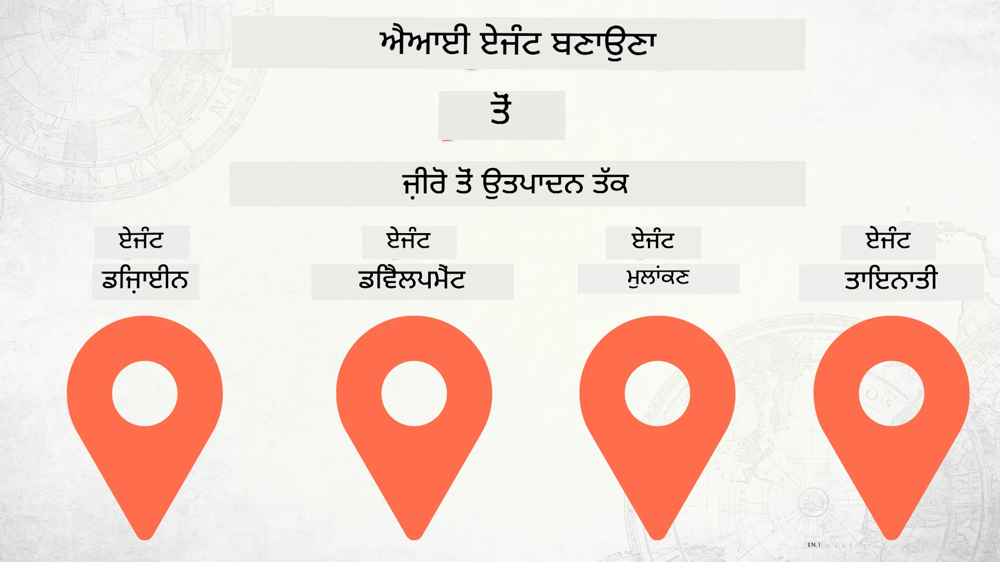

# ਜ਼ੀਰੋ ਤੋਂ ਉਤਪਾਦਨ ਤੱਕ AI ਏਜੰਟ ਬਣਾਉਣਾ



### 🌐 ਬਹੁ-ਭਾਸ਼ਾ ਸਹਿਯੋਗ

#### GitHub Action ਰਾਹੀਂ ਸਮਰਥਿਤ (ਆਟੋਮੇਟਿਕ ਅਤੇ ਹਮੇਸ਼ਾਂ ਨਵੀਨਤਮ)

<!-- CO-OP TRANSLATOR LANGUAGES TABLE START -->
[ਅਰਬੀ](../ar/README.md) | [ਬੰਗਾਲੀ](../bn/README.md) | [ਬੁਲਗੇਰੀ](../bg/README.md) | [ਬਰਮੀ (ਮਿਆਨਮਾਰ)](../my/README.md) | [ਚੀਨੀ (ਸਰਲ)](../zh-CN/README.md) | [ਚੀਨੀ (ਰਵਾਇਤੀ, ਹੋਂਗ ਕੋੰਗ)](../zh-HK/README.md) | [ਚੀਨੀ (ਰਵਾਇਤੀ, ਮੈਕਾਉ)](../zh-MO/README.md) | [ਚੀਨੀ (ਰਵਾਇਤੀ, ਤਾਇਵਾਨ)](../zh-TW/README.md) | [ਕ੍ਰੋਏਸ਼ੀਆਈ](../hr/README.md) | [ਚੈਕ](../cs/README.md) | [ਡੈਨਿਸ਼](../da/README.md) | [ਡੱਚ](../nl/README.md) | [ਐਸਟੋਨੀਆਈ](../et/README.md) | [ਫਿਨਿਸ਼](../fi/README.md) | [ਫ਼ਰਾਂਸੀਸੀ](../fr/README.md) | [ਜਰਮਨ](../de/README.md) | [ਗ੍ਰੀਕ](../el/README.md) | [ਹੀਬਰੂ](../he/README.md) | [ਹਿੰਦੀ](../hi/README.md) | [ਹੰਗੇਰੀ](../hu/README.md) | [ਇੰਡੋਨੇਸ਼ੀਆਈ](../id/README.md) | [ਇਤਾਲਵੀ](../it/README.md) | [ਜਾਪਾਨੀ](../ja/README.md) | [ਕਨੜ](../kn/README.md) | [ਖਮੇਰ](../km/README.md) | [ਕੋਰੀਆਈ](../ko/README.md) | [ਲਿਥੁਆਨੀਆਈ](../lt/README.md) | [ਮਲਈ](../ms/README.md) | [ਮਲਯਾਲਮ](../ml/README.md) | [ਮਰਾਠੀ](../mr/README.md) | [ਨੇਪਾਲੀ](../ne/README.md) | [ਨਾਈਜੀਰੀਆਈ ਪਿਡਜਿਨ](../pcm/README.md) | [ਨਾਰਵੇਜੀਆਈ](../no/README.md) | [ਫ਼ਾਰਸੀ](../fa/README.md) | [ਪੋਲਿਸ਼](../pl/README.md) | [ਪੁਰਤਗਾਲੀ (ਬਰਾਜ਼ੀਲ)](../pt-BR/README.md) | [ਪੁਰਤਗਾਲੀ (ਪੁਰਤਗਾਲ)](../pt-PT/README.md) | [ਪੰਜਾਬੀ (ਗੁਰਮੁਖੀ)](./README.md) | [ਰੋਮਾਨੀਆਈ](../ro/README.md) | [ਰੂਸੀ](../ru/README.md) | [ਸਰਬੀਆਈ (ਸਿਰਿਲਿਕ)](../sr/README.md) | [ਸਲੋਵਾਕ](../sk/README.md) | [ਸਲੋਵੇਨੀਆਈ](../sl/README.md) | [ਸਪੇਨੀ](../es/README.md) | [ਸਵਾਹਿਲੀ](../sw/README.md) | [ਸਵੀਡੀਸ਼](../sv/README.md) | [ਟਾਗਾਲੋਗ (ਫਿਲੀਪੀਨੀ)](../tl/README.md) | [ਤਾਮਿਲ](../ta/README.md) | [ਤੇਲੁਗੁ](../te/README.md) | [ਥਾਈ](../th/README.md) | [ਤੁਰਕੀ](../tr/README.md) | [ਯੂਕਰੇਨੀ](../uk/README.md) | [ਉਰਦੂ](../ur/README.md) | [ਵਿਯਤਨਾਮੀ](../vi/README.md)

> **ਲੋਕਲ ਤੌਰ 'ਤੇ ਕਲੋਨ ਕਰਨਾ ਪਸੰਦ ਹੋਵੇ?**
>
> ਇਹ ਰੇਪੋ 50+ ਭਾਸ਼ਾ ਅਨੁਵਾਦ ਸ਼ਾਮਲ ਕਰਦਾ ਹੈ, ਜੋ ਡਾਊਨਲੋਡ ਆਕਾਰ ਨੂੰ ਕਾਫੀ ਵਧਾ ਦਿੰਦਾ ਹੈ। ਬਿਨਾਂ ਅਨੁਵਾਦਾਂ ਦੇ ਕਲੋਨ ਕਰਨ ਲਈ, sparse checkout ਵਰਤੋ:
>
> **Bash / macOS / Linux:**
> > ```bash
> git clone --filter=blob:none --sparse https://github.com/microsoft/Building-AI-Agents-From-Zero-To-Production.git
> cd Building-AI-Agents-From-Zero-To-Production
> git sparse-checkout set --no-cone '/*' '!translations' '!translated_images'
> ```
>
> **CMD (Windows):**
> > ```cmd
> git clone --filter=blob:none --sparse https://github.com/microsoft/Building-AI-Agents-From-Zero-To-Production.git
> cd Building-AI-Agents-From-Zero-To-Production
> git sparse-checkout set --no-cone "/*" "!translations" "!translated_images"
> ```
>
> ਇਹ ਤੁਹਾਨੂੰ ਕੋਰਸ ਪੂਰਾ ਕਰਨ ਲਈ ਸਾਰਾ ਸਮੱਗਰੀ ਦਿੰਦਾ ਹੈ ਅਤੇ ਡਾਊਨਲੋਡ ਬਹੁਤ ਤੇਜ਼ ਹੁੰਦੀ ਹੈ।
<!-- CO-OP TRANSLATOR LANGUAGES TABLE END -->

## ਇੱਕ ਕੋਰਸ ਜੋ ਤੁਹਾਨੂੰ AI ਏਜੰਟ ਵਿਕਾਸ ਜੀਵਨਚੱਕਰ ਦੀਆਂ ਮੂਲ ਗੱਲਾਂ ਸਿਖਾਉਂਦਾ ਹੈ

[](https://github.com/microsoft/Building-AI-Agents-From-Zero-To-Production/blob/master/LICENSE?WT.mc_id=academic-105485-koreyst)
[](https://GitHub.com/microsoft/Building-AI-Agents-From-Zero-To-Production/graphs/contributors/?WT.mc_id=academic-105485-koreyst)
[](https://GitHub.com/microsoft/Building-AI-Agents-From-Zero-To-Production/issues/?WT.mc_id=academic-105485-koreyst)
[](https://GitHub.com/microsoft/Building-AI-Agents-From-Zero-To-Production/pulls/?WT.mc_id=academic-105485-koreyst)
[](http://makeapullrequest.com?WT.mc_id=academic-105485-koreyst)

[](https://discord.gg/Kuaw3ktsu6)

## 🌱 ਸ਼ੁਰੂਆਤ

ਇਸ ਕੋਰਸ ਵਿੱਚ AI ਏਜੰਟ ਬਣਾਉਣ ਅਤੇ ਤੈਨਾਤ ਕਰਨ ਦੀਆਂ ਮੂਲ ਗੱਲਾਂ ਨੂੰ ਕਵਰ ਕਰਨ ਵਾਲੇ ਪਾਠ ਹਨ।

ਹਰੇਕ ਲੈਸਨ ਪਿਛਲੇ 'ਤੇ ਨਿਰਭਰ ਹੁੰਦਾ ਹੈ, ਇਸ ਲਈ ਅਸੀਂ ਸੁਝਾਉਂਦੇ ਹਾਂ ਕਿ ਤੁਸੀਂ ਸ਼ੁਰੂ ਤੋਂ ਸ਼ੁਰੂ ਕਰਕੇ ਅਖੀਰ ਤੱਕ ਅੱਗੇ ਵਧੋ।

ਜੇ ਤੁਸੀਂ AI ਏਜੰਟ ਵਿਸ਼ਿਆਂ ਬਾਰੇ ਹੋਰ ਪਤਾ ਕਰਨਾ ਚਾਹੁੰਦੇ ਹੋ, ਤਾਂ ਤੁਸੀਂ [AI ਏਜੰਟਾਂ ਲਈ ਸ਼ੁਰੂਆਤੀ ਕੋਰਸ](https://aka.ms/ai-agents-beginners) ਨੂੰ ਦੇਖ ਸਕਦੇ ਹੋ।

### ਹੋਰ ਸਿੱਖਣ ਵਾਲਿਆਂ ਨਾਲ ਮਿਲੋ, ਆਪਣੇ ਸਵਾਲਾਂ ਦੇ ਉੱਤਰ ਪ੍ਰਾਪਤ ਕਰੋ

ਜੇ ਤੁਸੀਂ ਫਸ ਜਾਂਦੇ ਹੋ ਜਾਂ AI ਏਜੰਟ ਬਣਾਉਣ ਬਾਰੇ ਕੋਈ ਵੀ ਸਵਾਲ ਹੋਵੇ, ਤਾਂ ਸਾਡੇ ਸਮਰਪਿਤ Discord ਚੈਨਲ ਵਿੱਚ ਸ਼ਾਮِل ਹੋਵੋ: [Microsoft Foundry Discord](https://discord.gg/Kuaw3ktsu6).

### ਤੁਹਾਨੂੰ ਕੀ ਚਾਹੀਦਾ ਹੈ

ਹਰੇਕ ਲੈਸਨ ਦੇ ਕੋਲ ਆਪਣਾ ਕੋਡ ਸੈਂਪਲ ਹੁੰਦਾ ਹੈ ਜੋ ਤੁਸੀਂ ਲੋਕਲ ਤੌਰ 'ਤੇ ਚਲਾ ਸਕਦੇ ਹੋ। ਤੁਸੀਂ ਆਪਣੀ ਕਾਪੀ ਬਣਾਉਣ ਲਈ [ਇਸ ਰੇਪੋ ਨੂੰ ਫੋਰਕ ਕਰੋ](https://github.com/microsoft/Building-AI-Agents-From-Zero-To-Production/fork)।

ਇਹ ਕੋਰਸ ਵਰਤਮਾਨ ਵਿੱਚ ਹੇਠ ਲਿਖੀਆਂ ਚੀਜ਼ਾਂ ਦੀ ਵਰਤੋਂ ਕਰਦਾ ਹੈ:

- [Microsoft Agent Framework (MAF)](https://aka.ms/ai-agents-beginners/agent-framework)
- [Microsoft Foundry](https://azure.microsoft.com/products/ai-foundry) — ਇੱਕ ਪ੍ਰੋਜੈਕਟ ਜਿਸ ਵਿੱਚ ਤੈਨਾਤ ਕੀਤਾ ਗਿਆ **GPT-5 ਸੀਰੀਜ਼** ਮਾਡਲ ਹੈ (ਉਦਾਹਰਨ ਲਈ `gpt-5.1`). ਕਿਰਪਾ ਕਰਕੇ ਰਿਟਾਇਰਡ GPT-4o / GPT-4.1 ਮਾਡਲਾਂ ਦੀ ਵਰਤੋਂ ਨਾ ਕਰੋ।
- [Azure OpenAI Service](https://azure.microsoft.com/products/ai-foundry/models/openai)
- [Azure CLI](https://learn.microsoft.com/cli/azure/authenticate-azure-cli?view=azure-cli-latest) — ਕਿਸੇ ਵੀ ਸੈਂਪਲ ਨੂੰ ਚਲਾਉਣ ਤੋਂ ਪਹਿਲਾਂ `az login` ਨਾਲ ਸਾਈਨ ਇਨ ਕਰੋ
- **Python 3.12 ਜਾਂ ਉਸ ਤੋਂ ਨਵਾਂ**

ਕਿਰਪਾ ਕਰਕੇ ਸ਼ੁਰੂ ਕਰਨ ਤੋਂ ਪਹਿਲਾਂ ਇਹਨਾਂ ਸੇਵਾਵਾਂ ਤੱਕ ਤੁਹਾਡੀ ਪਹੁੰਚ ਦੀ ਪੁਸ਼ਟੀ ਕਰੋ।

> **💰 ਲਾਗਤ ਅਤੇ ਸਫਾਈ।** ਹੱਥ-ਅਨੁਭਵੀ ਪਾਠ ਅਸਲ Azure ਸਰੋਤ ਬਣਾਉਂਦੇ ਹਨ — ਇੱਕ Microsoft Foundry
> ਪ੍ਰੋਜੈਕਟ, ਇੱਕ ਮਾਡਲ ਡਿਪਲੋਇਮੈਂਟ, ਇੱਕ ਵੈਕਟਰ ਸਟੋਰ, ਅਤੇ (ਪਾਠ 4–6 ਵਿੱਚ) ਹੋਸਟ ਕੀਤੇ ਏਜੰਟ ਅਤੇ ਟੂਲਬਾਕਸ।
> ਇਹਨਾਂ ਦੇ ਮੌਜੂਦ ਹੋਣ ਦੌਰਾਨ ਖਰਚ ਆ ਸਕਦੇ ਹਨ। ਜਦੋਂ ਤੁਸੀਂ ਇੱਕ ਪਾਠ — ਜਾਂ ਕੋਰਸ — ਖਤਮ ਕਰ ਲਓ, ਤਾਂ ਉਹ
> ਸਰੋਤ ਜਿਹਨਾਂ ਦੀ ਤੁਹਾਨੂੰ ਲੋੜ ਨਹੀਂ, ਮਿਟਾ ਦਿਓ। ਸਭ ਤੋਂ ਸਧਾਰਨ ਤਰੀਕਾ ਇਹ ਹੈ ਕਿ ਸਭ ਕੁਝ ਇੱਕ ਸਮਰਪਿਤ ਰਿਸੋਰਸ
> ਸਮੂਹ ਵਿੱਚ ਰੱਖੋ ਅਤੇ ਜਦੋਂ ਤੁਸੀਂ ਖਤਮ ਕਰ ਲਵੋ ਤਾਂ ਪੂਰੇ ਗਰੁੱਪ ਨੂੰ ਹਟਾ ਦਿਓ:
>
> ```bash
> az group delete --name <your-resource-group> --yes --no-wait
> ```
>
> ਤੁਸੀਂ Foundry ਪੋਰਟਲ ਤੋਂ ਵੱਖ-ਵੱਖ ਏਜੰਟ, ਵੈਕਟਰ ਸਟੋਰ, ਅਤੇ ਟੂਲਬਾਕਸ ਵੀ ਹਟਾ ਸਕਦੇ ਹੋ।

> **ਮਾਡਲਾਂ ਬਾਰੇ ਨੋਟ।** ਇਹ ਕੋਰਸ ਸਾਰੇ ਮਾਡਲ **Microsoft Foundry** ਰਾਹੀਂ ਪ੍ਰਦਾਨ ਕਰਦਾ ਹੈ। ਇਹ **ਨਹੀਂ**
> *GitHub Models* ਦੀ ਵਰਤੋਂ ਕਰਦਾ, ਜੋ **30 ਜੁਲਾਈ, 2026** ਨੂੰ ਰਿਟਾਇਰ ਕੀਤਾ ਜਾ ਰਿਹਾ ਹੈ — Microsoft Foundry ਹੈ
> ਸਰਕਾਰੀ ਮਾਈਗ੍ਰੇਸ਼ਨ ਰਸਤਾ। ਜੇ ਤੁਹਾਡੇ ਕੋਲ ਪੁਰਾਣਾ ਕੋਡ ਹੈ ਜੋ GitHub Models ਨੂੰ ਕਾਲ ਕਰਦਾ ਹੈ, ਤਾਂ ਉਸਨੂੰ Foundry
> ਮਾਡਲ ਡਿਪਲੋਇਮੈਂਟ ਵੱਲ ਇਸ਼ਾਰਾ ਕਰੋ।

ਮਾਡਲ ਹੋਸਟਿੰਗ ਅਤੇ ਸੇਵਾਵਾਂ ਬਾਰੇ ਹੋਰ ਵਿਕਲਪ ਜਲਦੀ ਆ ਰਹੇ ਹਨ।

## 🗃️ ਪਾਠ

| **ਲੈਸਨ**         | **ਵੇਰਵਾ**                                                                                  |
|--------------------|--------------------------------------------------------------------------------------------------|
| [ਏਜੰਟ ਡਿਜ਼ਾਇਨ](./lesson-1-agent-design/README.md)       | ਸਾਡੇ "Developer Onboarding" ਏਜੰਟ ਉਪਯੋਗ ਮਾਮਲੇ ਦਾ ਪਰਿਚਯ ਅਤੇ ਪ੍ਰਭਾਵਸ਼ਾਲੀ ਏਜੰਟ ਕਿਵੇਂ ਡਿਜ਼ਾਇਨ ਕਰਨੇ, ਇਸ ਦੀ ਜਾਣਕਾਰੀ  |
| [ਏਜੰਟ ਵਿਕਾਸ](./lesson-2-agent-development/README.md)  | Microsoft Agent Framework (MAF) ਦੀ ਵਰਤੋਂ ਕਰਦਿਆਂ, ਨਵੇਂ ਡਿਵੈਲਪਰਾਂ ਨੂੰ ਸ਼ੁਰੂ ਕਰਨ ਵਿੱਚ ਮਦਦ ਕਰਨ ਲਈ ਵਿਸ਼ੇਸ਼ਤ ਏਜੰਟਾਂ ਦਾ ਸੈੱਟ ਬਣਾਓ।       |
| [ਏਜੰਟ ਮੂਲਿਆੰਕਣ](./lesson-3-agent-evals/README.md)  | Microsoft Foundry ਦੀ ਵਰਤੋਂ ਕਰਕੇ, ਪਤਾ ਲਗਾਓ ਕਿ ਸਾਡੇ AI ਏਜੰਟ ਕਿਵੇਂ ਪ੍ਰਦਰਸ਼ਨ ਕਰ ਰਹੇ ਹਨ ਅਤੇ ਉਹਨਾਂ ਨੂੰ ਕਿਵੇਂ ਸੁਧਾਰਿਆ ਜਾ ਸਕਦਾ ਹੈ। |
| [ਏਜੰਟ ਡਿਪਲੋਇਮੈਂਟ](./lesson-4-agentdeployment/README.md)   | Microsoft Foundry ਹੋਸਟ ਕੀਤੇ ਏਜੰਟ ਅਤੇ OpenAI ChatKit ਦੀ ਵਰਤੋਂ ਕਰਕੇ, ਵੇਖੋ ਕਿ AI ਏਜੰਟ ਨੂੰ ਉਤਪਾਦਨ ਵਿੱਚ ਕਿਵੇਂ ਤੈਨਾਤ ਕੀਤਾ ਜਾ ਸਕਦਾ ਹੈ।       |
| [ਉਤਪਾਦਨ ਹੋਸਟ ਕੀਤੇ ਏਜੰਟ](./lesson-5-hosted-agents-production/README.md)   | ਇੱਕ ਹੋਸਟ ਕੀਤੇ ਏਜੰਟ ਨੂੰ ਐਂਟਰਪ੍ਰਾਈਜ਼ ਉਤਪਾਦਨ ਵਿੱਚ ਲੈ ਜਾਓ: Hosted Agents vs Capability Hosts, ਆਪਣਾ ਸਟੋਰੇਜ, ਮੈਮੋਰੀ, ਅਤੇ ਗਵਰਨੈਂਸ।       |
| [Microsoft ਟੂਲਬਾਕਸ](./lesson-6-toolbox/README.md)   | ਟੂਲਜ਼ ਨੂੰ ਇਕ ਵਾਰ ਪਰਿਭਾਸ਼ਿਤ ਕਰੋ ਅਤੇ ਕੇਂਦਰੀ ਤੌਰ 'ਤੇ ਉਹਨਾਂ 'ਤੇ ਸ਼ਾਸਨ ਕਰੋ: ਇੱਕ ਟੂਲਬਾਕਸ ਬਣਾਓ, ਇਸ ਨੂੰ ਇੱਕ ਏਜੰਟ ਤੋਂ ਇੱਕ MCP endpoint ਰਾਹੀਂ ਵਰਤੋ, ਅਤੇ ਟੂਲਜ਼ ਦੇ ਵਰਜ਼ਨ ਸੁਰੱਖਿਅਤ ਤਰੀਕੇ ਨਾਲ ਸੰਭਾਲੋ।       |
| [ਮਲਟੀ-ਏਜੰਟ & A2A](./lesson-7-multi-agent-a2a/README.md)   | ਏਜੰਟਾਂ ਨੂੰ ਨੈੱਟਵਰਕਡ ਸੇਵਾਵਾਂ ਵਜੋਂ ਰਚੋ: ਇੱਕ ਏਜੰਟ ਨੂੰ ਖੁੱਲ੍ਹੇ Agent-to-Agent (A2A) ਪ੍ਰੋਟੋਕੋਲ ਉੱਤੇ ਦਰਸਾਓ ਅਤੇ ਇੱਕ ਰਿਮੋਟ ਏਜੰਟ ਨੂੰ ਪੀਅਰ ਵਜੋਂ ਵਰਤੋ।       |


## 🎒 ਹੋਰ ਕੋਰਸ

ਸਾਡੀ ਟੀਮ ਹੋਰ ਕੋਰਸ ਤਿਆਰ ਕਰਦੀ ਹੈ! ਦੇਖੋ:

<!-- CO-OP TRANSLATOR OTHER COURSES START -->
### LangChain
[](https://aka.ms/langchain4j-for-beginners)
[](https://aka.ms/langchainjs-for-beginners?WT.mc_id=m365-94501-dwahlin)
[](https://github.com/microsoft/langchain-for-beginners?WT.mc_id=m365-94501-dwahlin)
---

### Azure / Edge / MCP / Agents
[](https://github.com/microsoft/AZD-for-beginners?WT.mc_id=academic-105485-koreyst)
[](https://github.com/microsoft/edgeai-for-beginners?WT.mc_id=academic-105485-koreyst)
[](https://github.com/microsoft/mcp-for-beginners?WT.mc_id=academic-105485-koreyst)
[](https://github.com/microsoft/ai-agents-for-beginners?WT.mc_id=academic-105485-koreyst)

---
 
### ਜਨਰੇਟਿਵ AI ਸੀਰੀਜ਼

[](https://github.com/microsoft/generative-ai-for-beginners?WT.mc_id=academic-105485-koreyst)
[-9333EA?style=for-the-badge&labelColor=E5E7EB&color=9333EA)](https://github.com/microsoft/Generative-AI-for-beginners-dotnet?WT.mc_id=academic-105485-koreyst)
[-C084FC?style=for-the-badge&labelColor=E5E7EB&color=C084FC)](https://github.com/microsoft/generative-ai-for-beginners-java?WT.mc_id=academic-105485-koreyst)
[-E879F9?style=for-the-badge&labelColor=E5E7EB&color=E879F9)](https://github.com/microsoft/generative-ai-with-javascript?WT.mc_id=academic-105485-koreyst)

---
 
### ਮੁੱਖ ਸਿਖਲਾਈ
[](https://aka.ms/ml-beginners?WT.mc_id=academic-105485-koreyst)
[](https://aka.ms/datascience-beginners?WT.mc_id=academic-105485-koreyst)
[](https://aka.ms/ai-beginners?WT.mc_id=academic-105485-koreyst)
[](https://github.com/microsoft/Security-101?WT.mc_id=academic-96948-sayoung)
[](https://aka.ms/webdev-beginners?WT.mc_id=academic-105485-koreyst)
[](https://aka.ms/iot-beginners?WT.mc_id=academic-105485-koreyst)
[](https://github.com/microsoft/xr-development-for-beginners?WT.mc_id=academic-105485-koreyst)

---
 
### Copilot ਸੀਰੀਜ਼
[](https://aka.ms/GitHubCopilotAI?WT.mc_id=academic-105485-koreyst)
[](https://github.com/microsoft/mastering-github-copilot-for-dotnet-csharp-developers?WT.mc_id=academic-105485-koreyst)
[](https://github.com/microsoft/CopilotAdventures?WT.mc_id=academic-105485-koreyst)
<!-- CO-OP TRANSLATOR OTHER COURSES END -->

## ਯੋਗਦਾਨ

ਇਹ ਪ੍ਰੋਜੈਕਟ ਯੋਗਦਾਨ ਅਤੇ ਸੁਝਾਵਾਂ ਦਾ ਸਵਾਗਤ ਕਰਦਾ ਹੈ।  ਜ਼ਿਆਦਾਤਰ ਯੋਗਦਾਨਾਂ ਲਈ ਤੁਹਾਨੂੰ ਇੱਕ ਨਾਲ ਸਹਿਮਤ ਹੋਣਾ ਲਾਜ਼ਮੀ ਹੁੰਦਾ ਹੈ
Contributor License Agreement (CLA) ਜੋ ਇਹ ਘੋਸ਼ਣਾ ਕਰਦਾ ਹੈ ਕਿ ਤੁਹਾਡੇ ਕੋਲ ਹੱਕ ਹਨ, ਅਤੇ ਤੁਸੀਂ ਦਰਅਸਲ ਸਾਨੂੰ
ਤੁਹਾਡੇ ਯੋਗਦਾਨ ਨੂੰ ਵਰਤਣ ਦੇ ਹੱਕ ਦਿੰਦੇ ਹੋ। ਵਿਸਥਾਰ ਲਈ ਵੇਖੋ <https://cla.opensource.microsoft.com>.

ਜਦੋਂ ਤੁਸੀਂ ਇੱਕ pull request ਜਮ੍ਹਾਂ ਕਰਦੇ ਹੋ, ਇੱਕ CLA ਬੋਟ ਸਵੈਚਾਲਿਤ ਤੌਰ 'ਤੇ ਨਿਰਧਾਰਤ ਕਰੇਗਾ ਕਿ ਕੀ ਤੁਹਾਨੂੰ CLA ਪ੍ਰਦਾਨ ਕਰਨ ਦੀ ਲੋੜ ਹੈ
ਅਤੇ PR ਨੂੰ ਉਚਿਤ ਤਰੀਕੇ ਨਾਲ ਸਜਾਵੇਗਾ (ਉਦਾਹਰਨ ਲਈ, ਸਥਿਤੀ ਜਾਂਚ, ਟਿੱਪਣੀ)। ਸਿਰਫ ਬੋਟ ਵੱਲੋਂ ਦਿੱਤੀਆਂ ਹਦਾਇਤਾਂ ਦੀ ਪਾਲਣਾ ਕਰੋ।
ਤੁਹਾਨੂੰ ਸਾਡੀ CLA ਦੇ ਨਾਲ ਸਾਰੇ ਰੀਪੋਜ਼ ਵਿੱਚ ਸਿਰਫ ਇੱਕ ਵਾਰੀ ਇਹ ਕਰਨਾ ਪਵੇਗਾ।

ਇਸ ਪ੍ਰੋਜੈਕਟ ਨੇ [Microsoft ਓਪਨ ਸੋਰਸ ਆਚਰਨ ਸੰਹਿਤਾ](https://opensource.microsoft.com/codeofconduct/) ਨੂੰ ਅਪਨਾਇਆ ਹੈ।
ਹੋਰ ਜਾਣਕਾਰੀ ਲਈ [ਆਚਰਨ ਸੰਹਿਤਾ FAQ](https://opensource.microsoft.com/codeofconduct/faq/) ਵੇਖੋ ਜਾਂ
ਕਿਸੇ ਵੀ ਹੋਰ ਪ੍ਰਸ਼ਨ ਜਾਂ ਟਿੱਪਣੀਆਂ ਲਈ [opencode@microsoft.com](mailto:opencode@microsoft.com) ਨਾਲ ਸੰਪਰਕ ਕਰੋ।

## ਟ੍ਰੇਡਮਾਰਕ

ਇਸ ਪ੍ਰੋਜੈਕਟ ਵਿੱਚ ਪ੍ਰੋਜੈਕਟਾਂ, ਉਤਪਾਦਾਂ ਜਾਂ ਸੇਵਾਵਾਂ ਲਈ ਟ੍ਰੇਡਮਾਰਕ ਜਾਂ ਲੋਗੋ ਸ਼ਾਮਲ ਹੋ ਸਕਦੇ ਹਨ। ਮਾਇਕਰੋਸਾਫਟ
ਟ੍ਰੇਡਮਾਰਕਾਂ ਜਾਂ ਲੋਗੋਜ਼ ਦੀ ਅਧਿਕਾਰਤ ਵਰਤੋਂ ਇਨ੍ਹਾਂ ਦੇ ਨਿਯਮਾਂ ਦੇ ਅਧੀਨ ਹੈ ਅਤੇ ਇਹਨਾਂ ਦੀ ਪਾਲਣਾ ਕਰਨੀ ਲਾਜ਼ਮੀ ਹੈ
[Microsoft ਦੇ ਟ੍ਰੇਡਮਾਰਕ ਅਤੇ ਬ੍ਰਾਂਡ ਨਿਰਦੇଶ](https://www.microsoft.com/legal/intellectualproperty/trademarks/usage/general).
ਇਸ ਪ੍ਰੋਜੈਕਟ ਦੇ ਸੋਧੇ ਹੋਏ ਵਰਜਨਾਂ ਵਿੱਚ Microsoft ਦੇ ਟ੍ਰੇਡਮਾਰਕ ਜਾਂ ਲੋਗੋਜ਼ ਦੀ ਵਰਤੋਂ ਗਲਤਫ਼ਹਮੀ ਨਹੀਂ ਪੈਦਾ ਕਰਨੀ ਚਾਹੀਦੀ ਅਤੇ ਨਾ ਹੀ ਇਹ Microsoft ਦੀ ਪੰਜਾਕਾਰੀ ਦਾ ਇਸ਼ਾਰਾ ਦੇਣੀ ਚਾਹੀਦੀ ਹੈ।
ਤੀਸਰੇ-ਪਾਰਟੀ ਦੇ ਟ੍ਰੇਡਮਾਰਕਾਂ ਜਾਂ ਲੋਗੋਜ਼ ਦੀ ਕੋਈ ਵੀ ਵਰਤੋਂ ਉਹਨਾਂ ਤੀਸਰੇ-ਪਾਰਟੀਆਂ ਦੀਆਂ ਨીતੀਆਂ ਦੇ ਅਧੀਨ ਹੋਵੇਗੀ।

## ਮਦਦ ਲਈ

ਜੇ ਤੁਸੀਂ ਅਟਕ ਜਾਂ ਜੇ AI ਐਪਸ ਬਣਾਉਣ ਬਾਰੇ ਕੋਈ ਪ੍ਰਸ਼ਨ ਹੋਵੇ, ਤਾਂ ਜੁੜੋ:

[](https://discord.gg/Kuaw3ktsu6)

ਜੇ ਤੁਹਾਡੇ ਕੋਲ ਉਤਪਾਦ ਬਾਰੇ ਫੀਡਬੈਕ ਹੈ ਜਾਂ ਬਣਾਉਂਦੇ ਸਮੇਂ ਕੋਈ ਤਰੁੱਟੀਆਂ ਆ ਰਹੀਆਂ ਹਨ ਤਾਂ ਵੇਖੋ:

[](https://aka.ms/foundry/forum)

---

<!-- CO-OP TRANSLATOR DISCLAIMER START -->
**ਅਸਵੀਕਾਰੋਪਣ**:
ਇਸ ਦਸਤਾਵੇਜ਼ ਦਾ ਅਨੁਵਾਦ ਏਆਈ ਅਨੁਵਾਦ ਸੇਵਾ [Co-op Translator](https://github.com/Azure/co-op-translator) ਦੀ ਵਰਤੋਂ ਕਰਕੇ ਕੀਤਾ ਗਿਆ ਹੈ। ਜਦੋਂ ਕਿ ਅਸੀਂ ਸਹੀਤਾਵਾਂ ਲਈ ਯਤਨਸ਼ੀਲ ਹਾਂ, ਕਿਰਪਾ ਕਰਕੇ ਧਿਆਨ ਰੱਖੋ ਕਿ ਸਵੈਚਾਲਿਤ ਅਨੁਵਾਦਾਂ ਵਿੱਚ ਗਲਤੀਆਂ ਜਾਂ ਅਸਮੱਤਿਆਵਾਂ ਹੋ ਸਕਦੀਆਂ ਹਨ। ਮੂਲ ਦਸਤਾਵੇਜ਼ ਆਪਣੀ ਮੂਲ ਭਾਸ਼ਾ ਵਿੱਚ ਅਧਿਕਾਰਕ ਸਰੋਤ ਮੰਨਿਆ ਜਾਣਾ ਚਾਹੀਦਾ ਹੈ। ਜਰੂਰੀ ਜਾਣਕਾਰੀ ਲਈ, ਪੇਸ਼ੇਵਰ ਮਨੁੱਖੀ ਅਨੁਵਾਦ ਦੀ ਸਿਫ਼ਾਰਸ਼ ਕੀਤੀ ਜਾਂਦੀ ਹੈ। ਅਸੀਂ ਇਸ ਅਨੁਵਾਦ ਦੇ ਉਪਯੋਗ ਤੋਂ ਪੈਦਾ ਹੋਣ ਵਾਲੀਆਂ ਕਿਸੇ ਵੀ ਗਲਤਫਹਿਮੀਆਂ ਜਾਂ ਗਲਤ ਵਿਆਖਿਆਵਾਂ ਲਈ ਜਵਾਬਦੇਹ ਨਹੀਂ ਹਾਂ।
<!-- CO-OP TRANSLATOR DISCLAIMER END -->