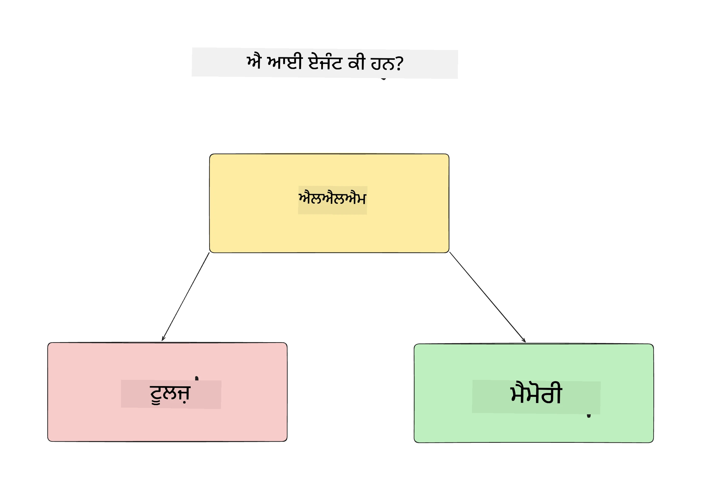
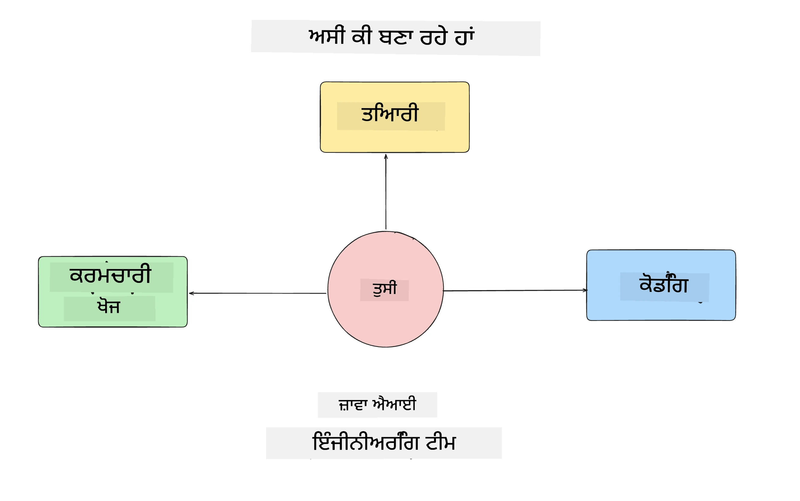
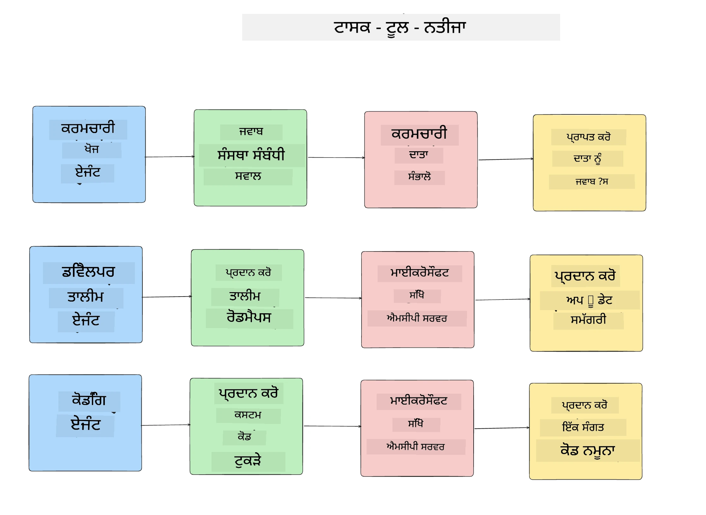
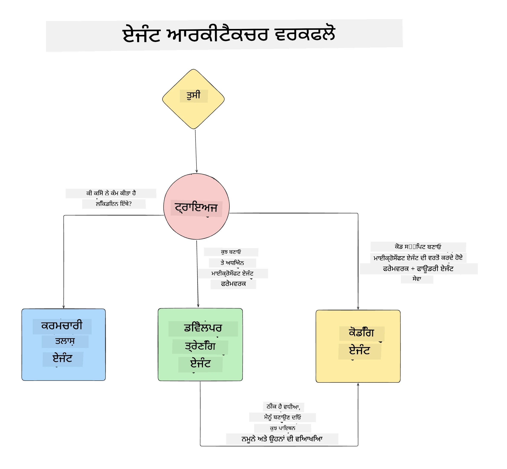

# ਪਾਠ 1: ਏਆਈ ਏਜੰਟ ਡਿਜ਼ਾਇਨ

ਸਾਡੇ "Building AI Agent from Zero to Production Course" ਦੇ ਪਹਿਲੇ ਪਾਠ ਵਿੱਚ ਤੁਹਾਡਾ ਸੁਆਗਤ ਹੈ!

ਇਸ ਪਾਠ ਵਿੱਚ ਅਸੀਂ ਕਵਰ ਕਰਾਂਗੇ:

- ਏਆਈ ਏਜੰਟ ਕੀ ਹੁੰਦੇ ਹਨ
  
- ਅਸੀਂ ਜੋ ਏਆਈ ਏਜੰਟ ਐਪਲੀਕੇਸ਼ਨ ਬਣਾਉਣ ਵਾਲੇ ਹਾਂ ਉਸ ਬਾਰੇ ਚਰਚਾ  

- ਹਰ ਏਜੰਟ ਲਈ ਲੋੜੀਂਦੇ ਟੂਲ ਅਤੇ ਸੇਵਾ ਦੀ ਪਛਾਣ
  
- ਆਪਣੀ ਏਜੰਟ ਐਪਲੀਕੇਸ਼ਨ ਦੀ ਆਰਕੀਟੈਕਚਰ ਬਣਾਉਣਾ
  
ਆਓ ਸ਼ੁਰੂ ਕਰੀਏ: ਏਜੰਟ ਕੀ ਹਨ ਅਤੇ ਅਸੀਂ ਉਹਨਾਂ ਨੂੰ ਐਪਲੀਕੇਸ਼ਨ ਵਿੱਚ ਕਿਉਂ ਵਰਤਾਂਗੇ।

> **ਕੋਰਸ ਸ਼ੁਰੂ ਕਰਨ ਤੋਂ ਪਹਿਲਾਂ।** ਇਹ ਪਹਿਲਾ ਪਾਠ ਸਿਧਾਂਤਕ ਹੈ — ਚਲਾਉਣ ਲਈ ਕੋਈ ਕੋਡ ਨਹੀਂ ਹੈ।
> [Lesson 2](../lesson-2-agent-development/README.md) ਤੋਂ ਅੱਗੇ ਤੁਹਾਨੂੰ ਲੋੜ ਹੋਵੇਗੀ: ਇੱਕ **Azure
> ਸਬਸਕ੍ਰਿਪਸ਼ਨ** ਜਿਸ ਵਿੱਚ **Microsoft Foundry** ਤੱਕ ਪਹੁੰਚ ਹੋਵੇ, ਇੱਕ ਤੈਨਾਤ ਕੀਤਾ ਹੋਇਆ **GPT-5 series model** (ਉਦਾਹਰਨ ਲਈ
> `gpt-5.1` — retired GPT-4o / GPT-4.1 ਤੋਂ ਬਚੋ), **Python 3.12+**, ਅਤੇ **Azure CLI**
> (`az login`). ਕੋਰਸ README ਵਿੱਚ ਪੂਰੀ ਜਾਣਕਾਰੀ ਲਈ [What You Need](../README.md#what-you-need) ਵੇਖੋ
> ਸੂਚੀ ਅਤੇ ਲਿੰਕ।

## ਏਆਈ ਏਜੰਟ ਕੀ ਹਨ?

ਜੇ ਇਹ ਤੁਹਾਡਾ ਪਹਿਲਾ ਵਾਰ ਹੈ ਕਿ ਤੁਸੀਂ ਏਆਈ ਏਜੰਟ ਬਣਾਉਣ ਦੀ ਖੋਜ ਕਰ ਰਹੇ ਹੋ, ਤਾਂ ਤੁਹਾਡੇ ਮਨ ਵਿੱਚ ਇਹ ਸਵਾਲ ਹੋ ਸਕਦੇ ਹਨ ਕਿ ਏਆਈ ਏਜੰਟ ਨੂੰ ਠੀਕ ਤਰੀਕੇ ਨਾਲ ਕਿਵੇਂ ਪਰਿਭਾਸ਼ਿਤ ਕੀਤਾ ਜਾਵੇ।

ਇੱਕ ਸਧਾਰਨ ਤਰੀਕੇ ਲਈ ਜੋ ਇਹ ਵੇਖਦਾ ਹੈ ਕਿ ਕਿਸ ਤਰ੍ਹਾਂ ਦੇ ਘਟਕ ਇਸਨੂੰ ਬਣਾਉਂਦੇ ਹਨ, ਏਆਈ ਏਜੰਟ ਦੀ ਪਰਿਭਾਸ਼ਾ ਇਸ ਤਰ੍ਹਾਂ ਕੀਤੀ ਜਾ ਸਕਦੀ ਹੈ:

**Large Language Model** - LLM ਯੂਜ਼ਰ ਦੀ ਕੁਦਰਤੀ ਭਾਸ਼ਾ ਨੂੰ ਪ੍ਰੋਸੈਸ ਕਰਨ ਦੀ ਸਮਰੱਥਾ ਨੂੰ ਚਲਾਏਗਾ ਤਾਂ ਜੋ ਉਹ ਜੋ ਕੰਮ ਕਰਵਾਉਣਾ ਚਾਹੁੰਦਾ ਹੈ ਉਸਨੂੰ ਸਮਝੇ ਅਤੇ ਉਹਨਾਂ ਕਾਰਜਾਂ ਨੂੰ ਪੂਰਾ ਕਰਨ ਲਈ ਉਪਲਬਧ ਟੂਲਾਂ ਦੀ ਵਿਆਖਿਆ ਨੂੰ ਵੀ ਸਮਝੇ।

**Tools** - ਇਹ ਫੰਕਸ਼ਨ, APIs, ਡੇਟਾ ਸਟੋਰੇਜ਼ ਅਤੇ ਹੋਰ ਸੇਵਾਵਾਂ ਹਨ ਜੋ LLM ਉਪਭੋਗਤਾ ਵੱਲੋਂ ਮੰਗੇ ਗਏ ਕਾਰਜ ਪੂਰੇ ਕਰਨ ਲਈ ਵਰਤ ਸਕਦਾ ਹੈ।

**Memory** - ਇਹ ਢੰਗ ਹੈ ਜਿਸ ਨਾਲ ਅਸੀਂ ਏਆਈ ਏਜੰਟ ਅਤੇ ਯૂਜ਼ਰ ਵਿਚਕਾਰ ਛੋਟੀ ਅਤੇ ਲੰਬੀ ਅਵਧੀ ਦੀਆਂ ਪਰਸਪਰਕ੍ਰਿਆਵਾਂ ਨੂੰ ਸਟੋਰ ਕਰਦੇ ਹਾਂ। ਇਹ ਜਾਣਕਾਰੀ ਸਟੋਰ ਅਤੇ ਰੀਟਰੀਵ ਕਰਨਾ ਸੁਧਾਰ ਲਿਆਉਣ ਅਤੇ ਸਮੇਂ ਦੇ ਨਾਲ ਯੂਜ਼ਰ ਪਸੰਦਾਂ ਨੂੰ ਸਾਂਭਣ ਲਈ ਮਹੱਤਵਪੂਰਣ ਹੈ।

## ਸਾਡਾ ਏਆਈ ਏਜੰਟ ਉਪਯੋਗ ਕੇਸ

ਇਸ ਕੋਰਸ ਲਈ, ਅਸੀਂ ਇੱਕ ਏਆਈ ਏਜੰਟ ਐਪਲੀਕੇਸ਼ਨ ਬਣਾਉਣ ਜਾ ਰਹੇ ਹਾਂ ਜੋ ਨਵੇਂ ਡਿਵੈਲਪਰਾਂ ਨੂੰ ਸਾਡੀ ਏਆਈ ਏਜੰਟ ਡਿਵੈਲਪਮੈਂਟ ਟੀਮ ਵਿੱਚ ਸ਼ਾਮਿਲ ਹੋਣ ਵਿੱਚ ਮਦਦ ਕਰੇਗਾ!

ਕਿਸੇ ਵੀ ਡਿਵੈਲਪਮੈਂਟ ਕੰਮ ਨੂੰ ਸ਼ੁਰੂ ਕਰਨ ਤੋਂ ਪਹਿਲਾਂ, ਇੱਕ ਸਫਲ ਏਆਈ ਏਜੰਟ ਐਪਲੀਕੇਸ਼ਨ ਬਣਾਉਣ ਦਾ ਪਹਿਲਾ ਕਦਮ ਇਹ ਹੈ ਕਿ ਅਸੀਂ ਆਪਣੇ ਯੂਜ਼ਰਾਂ ਤੋਂ ਉਮੀਦ ਕਰਦੇ ਹਾਂ ਕਿ ਉਹ ਕਿਸ ਤਰ੍ਹਾਂ ਸਾਡੇ ਏਜੰਟਾਂ ਨਾਲ ਕੰਮ ਕਰਨਗੇ, ਇਸ ਦੀਆਂ ਸਪੱਸ਼ਟ ਸੈਨਾਰਿਓਆਂ ਨੂੰ ਪਰਿਭਾਸ਼ਿਤ ਕਰਨਾ।

ਇਸ ਐਪਲੀਕੇਸ਼ਨ ਲਈ, ਅਸੀਂ ਇਹ ਸੈਨਾਰਿਓ ਵਰਤਾਂਗੇ:

**Scenario 1**: ਇਕ ਨਵਾਂ ਕਰਮਚਾਰੀ ਸਾਡੇ ਸੰਗਠਨ ਵਿੱਚ ਸ਼ਾਮਿਲ ਹੁੰਦਾ ਹੈ ਅਤੇ ਉਹ ਜਾਣਨਾ ਚਾਹੁੰਦਾ ਹੈ ਕਿ ਉਹ ਜਿਸ ਟੀਮ ਵਿੱਚ ਸ਼ਾਮਿਲ ਹੋਇਆ ਹੈ ਉਸ ਬਾਰੇ ਹੋਰ ਕਿਹੜੀ ਜਾਣਕਾਰੀ ਹੈ ਅਤੇ ਉਹਨਾਂ ਨਾਲ ਕਿਵੇਂ ਸੰਪਰਕ ਕੀਤਾ ਜਾ ਸਕਦਾ ਹੈ।

**Scenario 2:** ਇਕ ਨਵਾਂ ਕਰਮਚਾਰੀ ਜਾਣਨਾ ਚਾਹੁੰਦਾ ਹੈ ਕਿ ਉਸ ਲਈ ਸ਼ੁਰੂਆਤ ਵਿੱਚ ਸਭ ਤੋਂ ਵਧੀਆ ਪਹਿਲਾ ਕੰਮ ਕਿਹੜਾ ਹੋਵੇਗਾ।

**Scenario 3:** ਇਕ ਨਵਾਂ ਕਰਮਚਾਰੀ ਸਿਖਣ ਲਈ ਸਰੋਤ ਅਤੇ ਕੋਡ ਨਮੂਨੇ ਇਕੱਠੇ ਕਰਨਾ ਚਾਹੁੰਦਾ ਹੈ ਤਾਂ ਕਿ ਉਹ ਇਸ ਕੰਮ ਨੂੰ ਸ਼ੁਰੂ ਕਰਨ ਵਿੱਚ ਮਦਦ ਲੈ ਸਕੇ।

## ਟੂਲ ਅਤੇ ਸੇਵਾਵਾਂ ਦੀ ਪਛਾਣ

ਹੁਣ ਜਦੋਂ ਅਸੀਂ ਇਹ ਸੈਨਾਰਿਓ ਬਣਾਇਆ ਹੈ, ਅਗਲਾ ਕਦਮ ਇਹ ਹੈ ਕਿ ਉਨ੍ਹਾਂ ਨੂੰ ਉਹਨਾਂ ਟੂਲਾਂ ਅਤੇ ਸੇਵਾਵਾਂ ਨਾਲ ਜੋੜਨਾ ਜੋ ਸਾਡੇ ਏਆਈ ਏਜੰਟਾਂ ਨੂੰ ਇਹ ਕਾਰਜ ਪੂਰੇ ਕਰਨ ਲਈ ਲੋੜੀਂਦੇ ਹੋਣਗੇ।

ਇਹ ਪ੍ਰਕਿਰਿਆ Context Engineering ਦੀ ਸ਼੍ਰੇਣੀ ਵਿੱਚ ਆਉਂਦੀ ਹੈ ਕਿਉਂਕਿ ਅਸੀਂ ਧਿਆਨ ਕੇਂਦ੍ਰਿਤ ਕਰਾਂਗੇ ਕਿ ਸਾਡੇ ਏਆਈ ਏਜੰਟਾਂ ਕੋਲ ਠੀਕ ਸਮੇਂ 'ਤੇ ਠੀਕ ਸੰਦਰਭ ਹੋਵੇ ਤਾਂ ਜੋ ਉਹ ਕਾਰਜ ਪੂਰੇ ਕਰ ਸਕਣ।

ਆਓ ਇਹ ਸੈਨਾਰਿਓ ਇੱਕ-ਇੱਕ ਕਰਕੇ ਕਰੀਏ ਅਤੇ ਹਰ ਏਜੰਟ ਦੇ ਟਾਸਕ, ਟੂਲ ਅਤੇ ਚਾਹੀਦੇ ਨਤੀਜੇ ਲਿਖ ਕੇ ਵਧੀਆ agentic ਡਿਜ਼ਾਇਨ ਕਰੀਏ।

### Scenario 1 - ਕਰਮਚਾਰੀ ਖੋਜ ਏਜੰਟ

**Task** - ਕਰਮਚਾਰੀਆਂ ਬਾਰੇ ਸੰਗਠਨ ਨੂੰ ਸਬੰਧਤ ਸਵਾਲਾਂ ਦੇ ਜਵਾਬ ਦੇਣਾ, ਜਿਵੇਂ ਸ਼ਾਮਿਲ ਹੋਣ ਦੀ ਤਾਰੀਖ, ਵਰਤਮਾਨ ਟੀਮ, ਸਥਾਨ ਅਤੇ ਆਖਰੀ ਪੋਜ਼ੀਸ਼ਨ।

**Tools** - ਮੌਜੂਦਾ ਕਰਮਚਾਰੀ ਸੂਚੀ ਅਤੇ ਆਰਗ ਚਾਰਟ ਦਾ ਡੇਟਾਸਟੋਰ

**Outcomes** - ਡੇਟਾਸਟੋਰ ਤੋਂ ਜਾਣਕਾਰੀ ਪ੍ਰਾਪਤ ਕਰਨ ਯੋਗ, ਤਾਂ ਜੋ ਆਮ ਸੰਗਠਨਾਤਮਕ ਸਵਾਲਾਂ ਅਤੇ ਵਿਸ਼ੇਸ਼ ਕਰਮਚਾਰੀ ਸਵਾਲਾਂ ਦੇ ਜਵਾਬ ਦਿੱਤੇ ਜਾ ਸਕਣ।

### Scenario 2 - ਟਾਸਕ ਸਿਫਾਰਸ਼ੀ ਏਜੰਟ

**Task** - ਨਵੇਂ ਕਰਮਚਾਰੀ ਦੇ ਡਿਵੈਲਪਰ ਅਨੁਭਵ ਦੇ ਆਧਾਰ 'ਤੇ 1-3 ਇਸ਼ੂਆਂ ਦੀ ਸਿਫਾਰਸ਼ ਕਰੋ ਜਿਨ੍ਹਾਂ 'ਤੇ ਨਵਾਂ ਕਰਮਚਾਰੀ ਕੰਮ ਕਰ ਸਕਦਾ ਹੈ।

**Tools** - GitHub MCP Server ਖੁਲੇ issues ਪ੍ਰਾਪਤ ਕਰਨ ਅਤੇ ਡਿਵੈਲਪਰ ਪ੍ਰੋਫ਼ਾਇਲ ਬਣਾਉਣ ਲਈ

**Outcomes** - GitHub ਪ੍ਰੋਫ਼ਾਈਲ ਦੇ ਆਖਰੀ 5 commits ਪੜ੍ਹ ਸਕਣ ਅਤੇ ਕਿਸੇ GitHub ਪ੍ਰੋਜੈਕਟ 'ਤੇ open issues ਵੇਖ ਕੇ ਮਿਲਾਪ ਦੇ ਆਧਾਰ 'ਤੇ ਸਿਫਾਰਸ਼ਾਂ ਦੇ ਸਕਣਾ

### Scenario 3 -  ਕੋਡ ਅਸਿਸਟੈਂਟ ਏਜੰਟ

**Task** - "Task Recommendation" ਏਜੰਟ ਵੱਲੋਂ ਸਿਫਾਰਸ਼ ਕੀਤੀਆਂ Open Issues ਦੇ ਆਧਾਰ 'ਤੇ ਖੋਜ ਕਰਨੀ, ਸਰੋਤ ਮੁਹੱਈਆ ਕਰਨੇ ਅਤੇ ਕਰਮਚਾਰੀ ਦੀ ਮਦਦ ਲਈ ਕੋਡ ਸਨਿੱਪਟ ਤਿਆਰ ਕਰਨੇ।

**Tools** - Microsoft Learn MCP ਸਰੋਤ ਲੱਭਣ ਲਈ ਅਤੇ Code Interpreter ਕਸਟਮ ਕੋਡ ਸਨਿੱਪਟ ਤਿਆਰ ਕਰਨ ਲਈ।

**Outcomes** - ਜੇ ਯੂਜ਼ਰ ਵਧੇਰੇ ਮਦਦ ਮੰਗਦਾ ਹੈ, ਤਾਂ ਵਰਕਫਲੋ Learn MCP Server ਦੀ ਵਰਤੋਂ ਕਰਕੇ ਸਰੋਤਾਂ ਲਈ ਲਿੰਕ ਅਤੇ ਸਨਿੱਪਟ ਪ੍ਰਦਾਨ ਕਰੇਗਾ ਅਤੇ ਫਿਰ Code Interpreter ਏਜੰਟ ਨੂੰ ਛੋਟੇ ਕੋਡ ਸਨਿੱਪਟਾਂ ਨੂੰ ਵਿਆਖਿਆਵਾਂ ਨਾਲ ਬਣਾਉਣ ਲਈ ਸੌਂਪ ਦੇਵੇਗਾ।

## ਆਪਣੀ ਏਜੰਟ ਐਪਲੀਕੇਸ਼ਨ ਦੀ ਆਰਕੀਟੈਕਚਰ

ਹੁਣ ਜਦੋਂ ਅਸੀਂ ਆਪਣੀਆਂ ਹਰ ਏਜੰਟ ਨੂੰ ਪਰਿਭਾਸ਼ਿਤ ਕਰ ਲਿਆ ਹੈ, ਆਓ ਇੱਕ ਆਰਕੀਟੈਕਚਰ ਡਾਇਗ੍ਰਾਮ ਬਣਾਈਏ ਜੋ ਸਾਨੂੰ ਸਮਝਣ ਵਿੱਚ ਮਦਦ ਕਰੇਗਾ ਕਿ ਹਰ ਏਜੰਟ ਕਿਸ ਤਰ੍ਹਾਂ ਮਿਲ ਕੇ ਅਤੇ ਵੱਖ-ਵੱਖ ਕੰਮ ਕਰੇਗਾ, ਕਾਰਜ ਦੀ ਨਿਰਭਰਤਾ ਦੇ ਅਨੁਸਾਰ:

## ਅਗਲੇ ਕਦਮ

ਹੁਣ ਜਦੋਂ ਅਸੀਂ ਹਰ ਏਜੰਟ ਅਤੇ ਸਾਡੀ agentic ਸਿਸਟਮ ਦੀ ਡਿਜ਼ਾਇਨ ਕਰ ਲਈ ਹੈ, ਆਓ ਅਗਲੇ ਪਾਠ ਵੱਲ ਵਧੀਏ ਜਿੱਥੇ ਅਸੀਂ ਇਨ੍ਹਾਂ ਹਰੇਕ ਏਜੰਟਾਂ ਨੂੰ ਵਿਕਸਿਤ ਕਰਾਂਗੇ!

---

<!-- CO-OP TRANSLATOR DISCLAIMER START -->
**ਅਸਵੀਕਾਰੋਪਣ**:
ਇਸ ਦਸਤਾਵੇਜ਼ ਦਾ ਅਨੁਵਾਦ ਏਆਈ ਅਨੁਵਾਦ ਸੇਵਾ [Co-op Translator](https://github.com/Azure/co-op-translator) ਦੀ ਵਰਤੋਂ ਕਰਕੇ ਕੀਤਾ ਗਿਆ ਹੈ। ਜਦੋਂ ਕਿ ਅਸੀਂ ਸਹੀਤਾਵਾਂ ਲਈ ਯਤਨਸ਼ੀਲ ਹਾਂ, ਕਿਰਪਾ ਕਰਕੇ ਧਿਆਨ ਰੱਖੋ ਕਿ ਸਵੈਚਾਲਿਤ ਅਨੁਵਾਦਾਂ ਵਿੱਚ ਗਲਤੀਆਂ ਜਾਂ ਅਸਮੱਤਿਆਵਾਂ ਹੋ ਸਕਦੀਆਂ ਹਨ। ਮੂਲ ਦਸਤਾਵੇਜ਼ ਆਪਣੀ ਮੂਲ ਭਾਸ਼ਾ ਵਿੱਚ ਅਧਿਕਾਰਕ ਸਰੋਤ ਮੰਨਿਆ ਜਾਣਾ ਚਾਹੀਦਾ ਹੈ। ਜਰੂਰੀ ਜਾਣਕਾਰੀ ਲਈ, ਪੇਸ਼ੇਵਰ ਮਨੁੱਖੀ ਅਨੁਵਾਦ ਦੀ ਸਿਫ਼ਾਰਸ਼ ਕੀਤੀ ਜਾਂਦੀ ਹੈ। ਅਸੀਂ ਇਸ ਅਨੁਵਾਦ ਦੇ ਉਪਯੋਗ ਤੋਂ ਪੈਦਾ ਹੋਣ ਵਾਲੀਆਂ ਕਿਸੇ ਵੀ ਗਲਤਫਹਿਮੀਆਂ ਜਾਂ ਗਲਤ ਵਿਆਖਿਆਵਾਂ ਲਈ ਜਵਾਬਦੇਹ ਨਹੀਂ ਹਾਂ।
<!-- CO-OP TRANSLATOR DISCLAIMER END -->