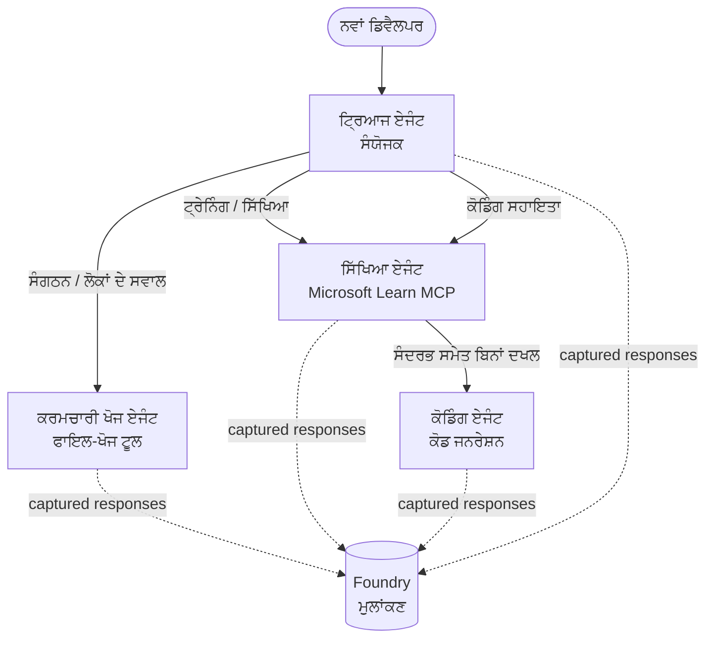

# ਪਾਠ 3: Microsoft Foundry ਨਾਲ ਏਜੰਟ ਮੁਲਿਆੰਕਣ

ਤੁਹਾਡਾ **"Building AI Agents from Zero to Production"** ਕੋਰਸ ਦੇ ਤੀਜੇ ਪਾਠ ਵਿੱਚ ਸਵਾਗਤ ਹੈ!

ਤੁਸੀਂ [ਪਾਠ 2](../lesson-2-agent-development/README.md) ਵਿੱਚ ਏਜੰਟ ਬਣਾਏ। ਇਸ ਪਾਠ ਵਿੱਚ ਤੁਸੀਂ
ਸਿੱਖੋਗੇ ਕਿ ਇੱਕ ਬਹੁਤ ਮੁਸ਼ਕਲ ਸਵਾਲ ਦਾ ਕਿਵੇਂ ਜਵਾਬ ਦੇਣਾ ਹੈ: **ਕੀ ਇਹ ਵਧੀਆ ਹਨ?** ਇੱਕ ਐਜੰਟ ਜੋ
ਚਲਾਉਣਾ ਆਸਾਨ ਹੈ; ਇਹ ਜਾਣਨਾ ਕਿ ਇਹ ਸਹੀ ਤਰੀਕੇ ਨਾਲ ਰੂਟ ਕਰਦਾ ਹੈ, ਤੁਹਾਡੇ ਡੇਟਾ 'ਤੇ ਅਧਾਰਿਤ ਰਹਿੰਦਾ ਹੈ, ਅਤੇ ਆਪਣੇ
ਟੂਲਾਂ ਨੂੰ ਠੀਕ ਤਰੀਕੇ ਨਾਲ ਵਰਤਣਾ ਹੀ ਇੱਕ ਡੈਮੋ ਅਤੇ ਉਤਪਾਦਨ ਪ੍ਰਣਾਲੀ ਨੂੰ ਵੱਖ ਕਰਦਾ ਹੈ।

ਇਸ ਪਾਠ ਵਿੱਚ ਅਸੀਂ ਹੇਠਲਿਖਤ ਬਿੰਦੂ ਕਵਰ ਕਰਾਂਗੇ:

- ਕਿਉਂ ਏਜੰਟ ਮੁਲਿਆੰਕਣ ਮਹੱਤਵਪੂਰਨ ਹੈ ਅਤੇ ਇਹ ਪਰੰਪਰਾਗਤ ਟੈਸਟਿੰਗ ਤੋਂ ਕਿਵੇਂ ਵੱਖਰਾ ਹੈ
- **observability**, **smoke tests**, ਅਤੇ **evaluations** ਦੇ ਵਿਚਕਾਰ ਅੰਤਰ
- ਅਸੀਂ ਜਿਸ ਮਲਟੀ-ਏਜੰਟ ਵਰਕਫਲੋ ਦੀ ਮਾਪ ਕਰਨ ਜਾ ਰਹੇ ਹਾਂ
- ਬਿਲਟ-ਇਨ **Microsoft Foundry evaluators** (ਸੰਬੰਧਤਾ, ਅਧਾਰਿਤਤਾ, ਟੂਲ-ਕਾਲ ਸਹੀਤੀ, ਟੂਲ-ਆਉਟਪੁਟ ਦੀ ਵਰਤੋਂ)
- ਮੁਲਿਆੰਕਣ ਪਾਈਪਲਾਈਨ ਦੀ ਕਦਮ-ਦਰ-ਕਦਮ ਵਾਕਥਰੂ ਵਿੱਚ [`agent-evals.py`](../../../lesson-3-agent-evals/agent-evals.py)
- ਇਸਨੂੰ ਕਿਵੇਂ ਚਲਾਉਣਾ ਹੈ ਅਤੇ ਨਤੀਜੇ ਕਿਵੇਂ ਪੜ੍ਹਨੇ ਹਨ

---

## ਏਜੰਟਾਂ ਦਾ ਮੁਲਿਆੰਕਣ ਕਿਉਂ ਕਰੋ?

ਇੱਕ ਪਰੰਪਰਿਕ ਯੂਨਿਟ ਟੈਸਟ ਇਹ ਦਾਅਵਾ ਕਰਦਾ ਹੈ ਕਿ `add(2, 2) == 4`। ਏਜੰਟ ਇਸ ਤਰ੍ਹਾਂ ਕੰਮ ਨਹੀਂ ਕਰਦੇ — ਇੱਕੋ
ਪ੍ਰੋਂਪਟ ਹਰ ਰਨ ਵਿੱਚ ਵੱਖਰੇ ਸ਼ਬਦਾਂ ਰਾਹੀਂ ਨਤੀਜਾ ਦੇ ਸਕਦਾ ਹੈ, ਟੂਲ ਵੱਖ-ਵੱਖ ਕ੍ਰਮ ਵਿੱਚ ਕਾਲ ਕੀਤੇ ਜਾ ਸਕਦੇ ਹਨ, ਅਤੇ
"ਸਹੀ" ਅਕਸਰ ਦਰਜੇ ਦਾ ਮਾਮਲਾ ਹੁੰਦਾ ਹੈ ਨਾ ਕਿ ਬੂਲੀਅਨ। ਤੁਸੀਂ ਸਹੀ ਸਤਰਾਂ 'ਤੇ ਦਾਅਵਾ ਨਹੀਂ ਕਰ ਸਕਦੇ।

ਇਸਦੀ ਥਾਂ, ਤੁਸੀਂ ਏਜੰਟਾਂ ਨੂੰ **ਗੁਣਵੱਤਾ ਪੱਧਰਾਂ** ਦੇ ਆਧਾਰ 'ਤੇ ਮਾਡਲ-ਆਧਾਰਿਤ *evaluators* (ਜਿਨ੍ਹਾਂ ਨੂੰ
"LLM-as-a-judge" ਕਿਹਾ ਜਾਂਦਾ ਹੈ) ਅਤੇ ਟੂਲ ਵਰਤੋਂ 'ਤੇ ਨਿਸ਼ਚਿਤ ਜਾਂਚਾਂ ਨਾਲ ਮੁਲਿਆੰਕਣ ਕਰਦੇ ਹੋ। ਇਹ ਤੁਹਾਨੂੰ ਹੇਠ ਲਿਖੀਆਂ ਗੱਲਾਂ ਦੱਸਦਾ ਹੈ:

- ਕੀ ਜਵਾਬ ਨੇ ਵਾਸਤਵ ਵਿੱਚ ਸਵਾਲ ਦਾ ਉੱਤਰ ਦਿੱਤਾ? (**relevance**)
- ਕੀ ਜਵਾਬ ਨੂੰ ਰੀਟ੍ਰੀਵ ਕੀਤੇ ਡੇਟਾ ਨੇ ਸਮਰਥਨ ਕੀਤਾ ਹੈ, ਜਾਂ ਕੀ ਏਜੰਟ ਨੇ ਹਾਲੂਸੀਨੇਟ ਕੀਤਾ? (**groundedness**)
- ਕੀ ਏਜੰਟ ਨੇ ਸਹੀ ਆਰਗੁਮੈਂਟਾਂ ਨਾਲ ਸਹੀ ਟੂਲ ਕਾਲ ਕੀਤਾ? (**tool-call accuracy**)
- ਕੀ ਏਜੰਟ ਨੇ ਵਾਸਤਵ ਵਿੱਚ ਟੂਲ ਵਲੋਂ ਦਿੱਤਾ ਗਿਆ ਨਤੀਜਾ ਵਰਤਿਆ? (**tool-output utilization**)

### ਗੁਣਵੱਤਾ ਦੀਆਂ ਤਿੰਨ ਪਰਸਪਰ-ਪੂਰਕ ਪਰਤਾਂ

ਇਹ ਮੁਕਾਬਲਾ ਕਰਨ ਵਾਲੀਆਂ ਤਕਨੀਕਾਂ ਨਹੀਂ ਹਨ — ਇੱਕ ਉਤਪਾਦਨ ਏਜੰਟ ਤਿੰਨਾਂ ਨੂੰ ਵਰਤਦਾ ਹੈ:

| ਪਰਤ | ਇਹ ਕਿਹੜਾ ਸਵਾਲ ਜਵਾਬ ਦਿੰਦੀ ਹੈ | ਲਾਗਤ | ਕਦੋਂ ਇਹ ਚਲਦੀ ਹੈ | ਕਿੱਥੇ ਕਵਰ ਕੀਤਾ گیا |
|-------|--------------------|------|--------------|------------|
| **Observability / tracing** | *ਏਜੰਟ ਨੇ ਕਦਮ ਦਰ ਕਦਮ ਕੀ ਕੀਤਾ?* | ਮੁਫ਼ਤ (ਹਮੇਸ਼ਾਂ ਚਾਲੂ) | ਉਤਪਾਦਨ ਵਿੱਚ ਲਗਾਤਾਰ | ਇਸ ਪਾਠ |
| **Smoke tests** | *ਕੀ ਏਜੰਟ ਤੱਕ ਪਹੁੰਚ ਹੈ ਅਤੇ ਇਹ ਆਪਣੀ ਮੂਲ ਪ੍ਰੋਂਪਟ ਦੀ ਪਾਲਣਾ ਕਰ ਰਿਹਾ ਹੈ?* | ਸਸਤਾ, ਸੈਕੰਡਾਂ | ਹਰ ਡਿਪਲੋਇ | [ਪਾਠ 4](../lesson-4-agentdeployment/README.md#smoke-testing-the-hosted-agent-ci-gate) |
| **Evaluations** | *ਜਵਾਬ ਕਿੰਨੇ **ਚੰਗੇ** ਹਨ?* | ਧੀਮਾ, ਮਾਡਲ-ਅਨੁਸਾਰ | ਮੰਗ 'ਤੇ / ਰਾਤੀਂ / ਪ੍ਰੀ-ਰਿਲੀਜ਼ | ਇਹ ਪਾਠ |

Smoke tests answer "did it break?"; evaluations answer "is it good?". You want both.

---

## ਲਾਜ਼ਮੀ ਸ਼ਰਤਾਂ

1. [ਪਾਠ 2](../lesson-2-agent-development/README.md) ਮੁਕੰਮਲ ਕੀਤਾ ਹੋਇਆ (ਏਜੰਟ + ਵੇਕਟਰ ਸਟੋਰ).
2. ਇੱਕ **Microsoft Foundry** ਪ੍ਰੋਜੈਕਟ.
3. **Azure CLI** ਪ੍ਰਮਾਣਿਤ: `az login`.
4. **Python 3.12+** ਅਤੇ ਕੋਰਸ ਦੀਆਂ ਡੀਪੈਂਡੈਂਸੀਜ਼ ਇੰਸਟਾਲ ਕੀਤੀਆਂ ਹੋਣ:

   ```bash
   pip install -r ../requirements.txt
   ```


5. ਇਨਵਾਇਰਨਮੈਂਟ ਵੈਰੀਏਬਲ (ਇਸ ਫੋਲਡਰ ਵਿੱਚ `.env` ਫਾਇਲ ਬਣਾਓ ਜਾਂ ਉਨ੍ਹਾਂ ਨੂੰ export ਕਰੋ):

   | ਵੇਰੀਏਬਲ | ਮਕਸਦ |
   |----------|---------|
   | `FOUNDRY_PROJECT_ENDPOINT` | ਤੁਹਾਡੇ Foundry ਪ੍ਰੋਜੈਕਟ ਦਾ endpoint (`https://<account>.services.ai.azure.com/api/projects/<project>`). ਏਜੰਟਾਂ ਦੇ `FoundryChatClient` **ਅਤੇ** ਮੁਲਾਂਕਣ ਸਹਾਇਕ ਦੁਆਰਾ ਪੜ੍ਹਿਆ ਜਾਂਦਾ ਹੈ। |
   | `FOUNDRY_MODEL` | ਉਹ ਮਾਡਲ ਡਿਪਲੌਇਮੈਂਟ ਜਿਸ 'ਤੇ **ਏਜੰਟ** ਚਲਦੇ ਹਨ (ਉਦਾਹਰਨ: `gpt-5.1`). |
   | `VECTOR_STORE_ID` | ਲੈਸਨ 2 ਵਿੱਚ ਬਣਾਇਆ ਗਿਆ employee-directory ਵੈਕਟਰ ਸਟੋਰ |
   | `AZURE_AI_MODEL_DEPLOYMENT_NAME` | ਉਹ ਮਾਡਲ ਡਿਪਲੌਇਮੈਂਟ ਜੋ **ਮੁਲਾਂਕਣ ਕਰਨ ਵਾਲੇ** ਵਰਤਦੇ ਹਨ (ਡਿਫਾਲਟ `FOUNDRY_MODEL`, ਫਿਰ `gpt-5.1`) |

> ਏਜੰਟ `FoundryChatClient` ਵਰਤਦੇ ਹਨ, ਜੋ `FOUNDRY_`-ਪ੍ਰੀਫਿਕਸ ਵਾਲੀਆਂ
> ਵੈਰੀਏਬਲਾਂ (`FOUNDRY_PROJECT_ENDPOINT`, `FOUNDRY_MODEL`) ਤੋਂ ਕਨਫਿਗ ਪੜ੍ਹਦਾ ਹੈ। ਕਲਾਉਡ ਮੁਲਾਂਕਣ ਸਹਾਇਕ
> `azure-ai-projects` SDK ਵਰਤਦਾ ਹੈ ਅਤੇ ਜੇ
> `AZURE_AI_PROJECT_ENDPOINT` ਸੈਟ ਨਾ ਹੋਵੇ ਤਾਂ ਇਹ `FOUNDRY_PROJECT_ENDPOINT` 'ਤੇ fallback ਕਰੇਗਾ — ਇਸ ਲਈ ਦੋ `FOUNDRY_` ਵੈਰੀਏਬਲ
> ਸਾਰੇ ਲੈਸਨ ਨੂੰ ਚਲਾਉਣ ਲਈ ਕਾਫ਼ੀ ਹਨ।
>
> ਮੁਲਾਂਕਣ ਕਰਨ ਵਾਲੇ ਖ਼ੁਦ ਇੱਕ ਮਾਡਲ ਦੁਆਰਾ ਸੰਚਾਲਿਤ ਹੁੰਦੇ ਹਨ, ਇਸ ਲਈ `AZURE_AI_MODEL_DEPLOYMENT_NAME`
> ਨਿਰਧਾਰਤ ਕਰਦਾ ਹੈ ਕਿ ਕਿਹੜੀ ਡਿਪਲੌਇਮੈਂਟ ਜੱਜਿੰਗ ਕਰਦੀ ਹੈ — ਇਹ ਜ਼ਰੂਰੀ ਨਹੀਂ
> ਕਿ ਇਹ ਤੁਹਾਡੇ ਏਜੰਟਾਂ ਵੱਲੋਂ ਵਰਤੇ ਜਾਂਦੇ ਮਾਡਲ ਦੇ ਸਮਾਨ ਹੋਵੇ।

---

## ਅਸੀਂ ਜਿਸ ਵਰਕਫਲੋ ਦੀ ਮੁਲਾਂਕਣ ਕਰ ਰਹੇ ਹਾਂ

ਕਿਸੇ ਚੀਜ਼ ਦਾ ਮੁਲਾਂਕਣ ਕਰਨ ਲਈ, ਤੁਹਾਨੂੰ ਪਹਿਲਾਂ ਇਸਨੂੰ ਚਲਾਉਣਾ ਪੈਂਦਾ ਹੈ। ਇਹ ਲੈਸਨ **Developer Onboarding**
ਮਲਟੀ-ਏਜੰਟ ਵਰਕਫਲੋ: ਇੱਕ **triage** ਕੋਆਰਡੀਨੇਟਰ ਤਿੰਨ ਵਿਸ਼ੇਸ਼ਜ্ঞਾਂ ਨੂੰ ਕੰਮ ਸੌਂਪਦਾ ਹੈ।



The workflow is built with the Microsoft Agent Framework's **handoff** orchestration. The key
idea for evaluation is that **every agent turn is persisted server-side** and identified by a
`response_id`. These IDs are what we hand to the evaluation service.

---

## The evaluation pipeline, step by step

[`agent-evals.py`](../../../lesson-3-agent-evals/agent-evals.py) implements a six-step pipeline. Here is what each step does
and why.

### Step 1 — Run the workflow and track response IDs

The workflow is executed with `run_stream(...)`, and as events stream back the code records the
`response_id` and `conversation_id` produced by each agent. Persisted responses are the raw
material for evaluation — you are grading *real* production-shaped responses, not re-generated
ones.

### Step 2 — Summarise what was captured

A quick summary prints how many responses each agent produced, so you can confirm the workflow
actually exercised the agents you intend to grade.

### Step 3 — Fetch the final responses

For each agent, the last `response_id` is retrieved through the project's OpenAI-compatible
client (`project_client.get_openai_client().responses.retrieve(...)`) so you can preview the
text that will be judged.

### Step 4 — Create the evaluation

An evaluation is created with four **built-in Foundry evaluators**:

| ਇਵੈਲੂਏਟਰ | `evaluator_name` | ਇਹ ਕੀ ਮਾਪਦਾ ਹੈ |
|-----------|------------------|------------------|

| ਸੰਬੰਧਤਾ | `builtin.relevance` | ਕੀ ਜਵਾਬ ਉਪਭੋਗਤਾ ਦੀ ਬੇਨਤੀ ਨੂੰ ਸੰਬੋਧਨ ਕਰਦਾ ਹੈ? |

| ਅਧਾਰਿਤਤਾ | `builtin.groundedness` | ਕੀ ਜਵਾਬ ਨੂੰ ਪ੍ਰਾਪਤ/ਟੂਲ ਡਾਟਾ ਦੁਆਰਾ ਸਮਰਥਿਤ ਕੀਤਾ ਗਿਆ ਹੈ (ਕਲਪਨਾ ਨਹੀਂ)? |
| ਟੂਲ-ਕਾਲ ਦੀ ਸਹੀਅਤ | `builtin.tool_call_accuracy` | ਕੀ ਸਹੀ ਟੂਲ ਸਹੀ ਆਰਗੁਮੇੰਟਸ ਨਾਲ ਕਾਲ ਕੀਤੇ ਗਏ ਸਨ? |
| ਟੂਲ-ਆਉਟਪੁਟ ਦੀ ਵਰਤੋਂ | `builtin.tool_output_utilization` | ਕੀ ਏਜੰਟ ਨੇ ਵਾਸਤਵ ਵਿੱਚ ਆਪਣੇ ਜਵਾਬ ਵਿੱਚ ਟੂਲ ਦੇ ਨਤੀਜੇ ਵਰਤੇ? |

ਹਰ ਇਵੈਲੂਏਟਰ ਨੂੰ `AZURE_AI_MODEL_DEPLOYMENT_NAME` ਨਾਂ ਵਾਲੇ ਡਿਪਲੋਇਮੈਂਟ ਨਾਲ ਆਰੰਭ ਕੀਤਾ ਜਾਂਦਾ ਹੈ। ਇਹ

> **ਇਹ ਚਾਰ ਕਿਉਂ?** ਸੰਬੰਧਤਾ ਅਤੇ ਅਧਾਰਿਤਤਾ *ਜਵਾਬ ਦੀ ਗੁਣਵੱਤਾ* ਮਾਪਦੀਆਂ ਹਨ; ਦੋ ਟੂਲ
> ਇਵੈਲੂਏਟਰ *ਏਜੰਟਿਕ ਵਿਹਾਰ* ਨੂੰ ਮਾਪਦੇ ਹਨ — ਉਹ ਭਾਗ ਜੋ ਰਵਾਇਤੀ NLP ਮੈਟ੍ਰਿਕਸ ਪੂਰੀ ਤਰ੍ਹਾਂ ਨਹੀਂ ਪਕੜਦੀਆਂ। ਇੱਕ
> ਟੂਲ-ਵਰਤੋਂ ਵਾਲੀ, ਬਹੁ-ਏਜੰਟ ਸਿਸਟਮ ਲਈ, ਟੂਲ ਮੈਟ੍ਰਿਕਸ ਅਕਸਰ ਉਹੇ ਹਨ ਜਿੱਥੇ ਹਕੀਕਤੀ ਰਿਗ੍ਰੈਸ਼ਨ ਛੁਪੇ ਹੁੰਦੇ ਹਨ।

### ਕਦਮ 5 — ਮੁਲਾਂਕਣ ਚਲਾਓ

ਕੈਪਚਰ ਕੀਤੇ `response_id`s ਨੂੰ ਡੇਟਾ ਸਰੋਤ ਵਜੋਂ `evals.runs.create(...)` ਨੂੰ ਦਿੱਤਾ ਜਾਂਦਾ ਹੈ। ਇਹ
ਸੇਵਾ ਹਰ ਸਟੋਰ ਕੀਤਾ ਗਿਆ ਜਵਾਬ ਹਰ ਇੱਕ ਇਵੈਲੂਏਟਰ ਰਾਹੀਂ ਦੁਹਰਾਉਂਦੀ ਹੈ।

### ਕਦਮ 6 — ਨਿਰੀਖਣ ਕਰੋ ਅਤੇ ਨਤੀਜੇ ਪੜ੍ਹੋ

ਕੋਡ ਰਨ ਨੂੰ ਪੋਲ ਕਰਦਾ ਹੈ ਜਦ ਤੱਕ ਇਹ `completed` ਜਾਂ `failed` ਨਹੀਂ ਹੋ ਜਾਂਦਾ, ਫਿਰ ਨਤੀਜਿਆਂ ਦੀ ਗਿਣਤੀ ਅਤੇ ਇੱਕ
**`report_url`** — Foundry ਪੋਰਟਲ ਵਿੱਚ ਇੱਕ ਡੀਪ ਲਿੰਕ ਹੈ ਜਿੱਥੇ ਤੁਸੀਂ ਪ੍ਰਤੀ-ਮੈਟ੍ਰਿਕ ਸਕੋਰ ਦੀ ਜਾਂਚ ਕਰ ਸਕਦੇ ਹੋ,
ਪਾਸ/ਫੇਲ ਗਿਣਤੀਆਂ, ਅਤੇ ਵਿਅਕਤੀਗਤ ਜਾਂਚੇ ਗਏ ਜਵਾਬ।

---

## ਚਲਾਓ

```bash
cd lesson-3-agent-evals
python agent-evals.py
```

ਮੂਲ ਤੌਰ 'ਤੇ ਇਹ ਪਹਿਲੇ ਉਦਾਹਰਨ ਪ੍ਰਸ਼ਨ ਦਾ ਮੁਲਾਂਕਣ ਕਰਦਾ ਹੈ
(`"ਮੈਂ ਇੱਥੇ ਨਵਾਂ ਹਾਂ! ਕੀ ਕਿਸੇ ਨੇ ਇੱਥੇ Microsoft 'ਤੇ ਕੰਮ ਕੀਤਾ ਹੈ?"`). ਹੋਰ ਦੋ ਬਹੁ-ਇਰਾਦੇ ਵਾਲੇ ਉਦਾਹਰਨ ਪ੍ਰਸ਼ਨ
`run_evaluation_workflow()` ਵਿੱਚ ਸ਼ਾਮِل ਹਨ — ਰਾਊਟਿੰਗ ਸਟੇਨਾਰਿਓਜ਼ ਨੂੰ ਅਜ਼ਮਾਉਣ ਲਈ `query` ਵੈਰੀਏਬਲ ਬਦਲੋ
ਜੋ ਇੱਕ ਰਨ ਵਿੱਚ ਹੋਰ ਏਜੰਟਾਂ ਨੂੰ ਵਰਤਦੇ ਹਨ।

ਉਮੀਦ ਕੀਤੀ ਕੰਸੋਲ ਫਲੋ:

```
Step 1: Running Developer Onboarding Workflow
Step 2: Response Data Summary
Step 3: Fetching Agent Responses
Step 4: Creating Evaluation
Step 5: Running Evaluation
Step 6: Monitoring Evaluation
  Status: running ...
  Evaluation completed successfully
  Report URL: https://...   <-- open this in the Foundry portal
```

---

## ਨਿਰੀਖਣਯੋਗਤਾ ਅਤੇ ਟ੍ਰੇਸਿੰਗ

ਮੁਲਾਂਕਣ ਦੱਸਦੇ ਹਨ ਕਿ ਜਵਾਬਾਂ *ਕਿੰਨੇ ਚੰਗੇ* ਸਨ; **ਨਿਰੀਖਣਯੋਗਤਾ** ਦੱਸਦੀ ਹੈ ਕਿ *ਕੀ ਹੋਇਆ*
ਉਨ੍ਹਾਂ ਨੂੰ ਉਤਪੰਨ ਕਰਨ ਲਈ — ਹਰ ਏਜੰਟ ਹੌਪ, ਟੂਲ ਕਾਲ, ਟੋਕਨ ਗਿਣਤੀ, ਅਤੇ ਲੈਟੈਂਸੀ. Microsoft Foundry,
ਏਜੰਟ ਰਨ OpenTelemetry ਟ੍ਰੇਸ ਜਾਰੀ ਕਰਦੇ ਹਨ ਜੋ ਤੁਸੀਂ ਪੋਰਟਲ ਵਿੱਚ ਦੇਖ ਸਕਦੇ ਹੋ, ਅਤੇ Agent Framework ਇਹਨਾਂ ਨੂੰ
ਇੱਕ ਹੀ ਕਾਲ ਨਾਲ Azure Monitor / Application Insights ਵਿੱਚ ਐਕਸਪੋਰਟ ਕਰ ਸਕਦਾ ਹੈ:

```python
from agent_framework.foundry import FoundryChatClient

client = FoundryChatClient()
client.configure_azure_monitor()   # ਟਰੇਸ ਅਤੇ ਮੈਟ੍ਰਿਕਸ ਨੂੰ Application Insights ਵਿੱਚ ਐਕਸਪੋਰਟ ਕਰੋ
```

ਖਰਾਬ ਮੁਲਾਂਕਣ ਸਕੋਰ ਨੂੰ **ਡਿਬੱਗ** ਕਰਨ ਲਈ ਟ੍ਰੇਸਿੰਗ ਦੀ ਵਰਤੋਂ ਕਰੋ: ਜਦੋਂ ਅਧਾਰਿਤਤਾ ਘਟਦੀ ਹੈ, ਟ੍ਰੇਸ ਤੁਹਾਨੂੰ ਦਿਖਾਉਂਦਾ ਹੈ ਕਿ
ਕੀ ਫਾਈਲ-ਸਰਚ ਟੂਲ ਨੇ ਕੁਝ ਨਹੀਂ ਦਿੱਤਾ, ਜਾਂ ਇਸਨੇ ਡੇਟਾ ਦਿੱਤਾ ਜਿਸਨੂੰ ਫਿਰ ਏਜੰਟ ਨੇ ਅਣਦੇਖਾ ਕੀਤਾ (ਜੋ
ਬਿਲਕੁਲ ਉਹੀ ਚੀਜ਼ ਹੈ ਜਿਸਦਾ ਟੂਲ-ਆਉਟਪੁਟ ਦੀ ਵਰਤੋਂ ਅੰਕਨ ਕਰਦੀ ਹੈ).

---

## "runs" ਤੋਂ "good": ਇਸਨੂੰ ਅਮਲ ਵਿੱਚ ਕਿਵੇਂ ਵਰਤਣਾ ਹੈ

- **ਪ੍ਰੀ-ਰਿਲੀਜ਼ ਗੇਟ।** ਨਿਰਧਾਰਤ ਪ੍ਰਤੀਨਿਧੀ ਪ੍ਰਸ਼ਨਾਂ ਦੇ ਸੈੱਟ ਖਿਲਾਫ ਮੁਲਾਂਕਣ ਚਲਾਓ
  ਨਵੇਂ ਪ੍ਰੰਪਟ ਜਾਂ ਮਾਡਲ ਨੂੰ ਪ੍ਰੋਮੋਟ ਕਰਨ ਤੋਂ ਪਹਿਲਾਂ। ਸਕੋਰਾਂ ਦੀ ਤੁਲਨਾ ਪਹਿਲਾਂ ਦੀ ਵਰਜਨ ਨਾਲ ਕਰੋ — ਘਟੋਤਰੀ ਨੂੰ ਇੱਕ
  ਰਿਗ੍ਰੈਸ਼ਨ.
- **ਰਾਤਾਨਾ ਗੁਣਵੱਤਾ ਸਿਗਨਲ।** ਡੇਟਾ ਜਾਂ ਡਿਪੈਂਡੇੰਸੀ ਵਿਚ ਹੋ ਰਹੇ ਡ੍ਰਿਫਟ ਨੂੰ ਪਕੜਨ ਲਈ ਮੁਲਾਂਕਣ ਸ਼ੈਡਿਊਲ ਕਰੋ
  ਬਦਲਾਅ.
- **ਸਮੋਕ ਟੈਸਟਾਂ ਨਾਲ ਜੋੜੋ।** [ਲੇਸਨ 4 ਦਾ ਸਮੋਕ ਟੈਸਟ](../lesson-4-agentdeployment/README.md#smoke-testing-the-hosted-agent-ci-gate)
  ਇਹ ਤੁਹਾਡਾ ਤੇਜ਼ ਪ੍ਰਤੀ-ਡਿਪਲੋਇਮੈਂਟ ਗੇਟ ਹੈ; ਮੁਲਾਂਕਣ ਧੀਮੇ, ਹੋਰ ਗਹਿਰੇ ਗੁਣਵੱਤਾ ਗੇਟ ਹਨ। ਸਸਤੇ
  ਨੂੰ ਹਰ ਮਰਜ 'ਤੇ ਚਲਾਓ ਅਤੇ ਮਹਿੰਗੇ ਵਾਲੇ ਨੂੰ ਇੱਕ ਸ਼ੈਡਿਊਲ 'ਤੇ ਜਾਂ ਰਿਲੀਜ਼ ਤੋਂ ਪਹਿਲਾਂ ਚਲਾਓ।

---

## ਆਧੁਨਿਕੀਕਰਨ ਨੋਟ

ਇਹ ਨਮੂਨਾ ਮੌਜੂਦਾ Microsoft Agent Framework Foundry API ਸਤਹ 'ਤੇ ਮਾਈਗਰੇਟ ਕੀਤਾ ਜਾ ਰਿਹਾ ਹੈ
(`agent_framework.foundry`). ਜੇ ਤੁਸੀਂ ਕੋਡ ਅੱਪਡੇਟ ਕਰ ਰਹੇ ਹੋ, ਤਾਂ ਰਿਪੋਜ਼ਟਰੀ-ਰੂਟ ਨੂੰ ਵੇਖੋ
[`MIGRATION-GUIDE.md`](../MIGRATION-GUIDE.md) ਲਈ ਤਸਦੀਕ ਕੀਤੇ ਗਏ ਪਹਿਲਾਂ/ਬਾਅਦ ਇੰਪੋਰਟ ਅਤੇ ਕਲਾਇਂਟ
ਮੈਪਿੰਗਜ਼ (ਉਦਾਹਰਨ ਲਈ `AzureAIClient` -> `FoundryChatClient`, ਅਤੇ hosted-tool ਨਿਰਮਾਣ ਰਾਹੀਂ
`client.get_file_search_tool(...)` / `client.get_mcp_tool(...)`). ਮੁਲਾਂਕਣ ਧਾਰਨਾਵਾਂ ਅਤੇ
ਉਪਰ ਦਿੱਤੀ ਛੇ-ਕਦਮੀ ਪਾਈਪਲਾਈਨ ਉਸ ਮਾਈਗ੍ਰੇਸ਼ਨ ਨਾਲ ਬਦਲਦੀ ਨਹੀਂ ਹੈ।

---

## ਸਰੋਤ

- [ਸਾਰਜਨਾਤਮਕ AI ਮਾਡਲਾਂ ਅਤੇ ਐਪਲੀਕੇਸ਼ਨਾਂ ਦਾ ਮੁਲਾਂਕਣ (Microsoft Learn)](https://learn.microsoft.com/en-us/azure/ai-foundry/concepts/evaluation-approach-gen-ai)
- [ਸਾਰਜਨਾਤਮਕ AI ਲਈ ਬਿਲਟ-ਇਨ ਇਵੈਲੂਏਟਰ](https://learn.microsoft.com/en-us/azure/ai-foundry/concepts/evaluation-evaluators/agent-evaluators)
- [Microsoft Foundry ਵਿੱਚ ਨਿਰੀਖਣਯੋਗਤਾ](https://learn.microsoft.com/en-us/azure/ai-foundry/concepts/observability)
- [Microsoft Agent Framework](https://github.com/microsoft/agent-framework)
- [ਏਜੰਟ ਹੈਨਡੌਫ਼ ਆਰਕੀਸਟ੍ਰੇਸ਼ਨ](https://learn.microsoft.com/en-us/agent-framework/workflows/orchestrations/handoff)

---

<!-- CO-OP TRANSLATOR DISCLAIMER START -->
**ਅਸਵੀਕਾਰੋਪਣ**:
ਇਸ ਦਸਤਾਵੇਜ਼ ਦਾ ਅਨੁਵਾਦ ਏਆਈ ਅਨੁਵਾਦ ਸੇਵਾ [Co-op Translator](https://github.com/Azure/co-op-translator) ਦੀ ਵਰਤੋਂ ਕਰਕੇ ਕੀਤਾ ਗਿਆ ਹੈ। ਜਦੋਂ ਕਿ ਅਸੀਂ ਸਹੀਤਾਵਾਂ ਲਈ ਯਤਨਸ਼ੀਲ ਹਾਂ, ਕਿਰਪਾ ਕਰਕੇ ਧਿਆਨ ਰੱਖੋ ਕਿ ਸਵੈਚਾਲਿਤ ਅਨੁਵਾਦਾਂ ਵਿੱਚ ਗਲਤੀਆਂ ਜਾਂ ਅਸਮੱਤਿਆਵਾਂ ਹੋ ਸਕਦੀਆਂ ਹਨ। ਮੂਲ ਦਸਤਾਵੇਜ਼ ਆਪਣੀ ਮੂਲ ਭਾਸ਼ਾ ਵਿੱਚ ਅਧਿਕਾਰਕ ਸਰੋਤ ਮੰਨਿਆ ਜਾਣਾ ਚਾਹੀਦਾ ਹੈ। ਜਰੂਰੀ ਜਾਣਕਾਰੀ ਲਈ, ਪੇਸ਼ੇਵਰ ਮਨੁੱਖੀ ਅਨੁਵਾਦ ਦੀ ਸਿਫ਼ਾਰਸ਼ ਕੀਤੀ ਜਾਂਦੀ ਹੈ। ਅਸੀਂ ਇਸ ਅਨੁਵਾਦ ਦੇ ਉਪਯੋਗ ਤੋਂ ਪੈਦਾ ਹੋਣ ਵਾਲੀਆਂ ਕਿਸੇ ਵੀ ਗਲਤਫਹਿਮੀਆਂ ਜਾਂ ਗਲਤ ਵਿਆਖਿਆਵਾਂ ਲਈ ਜਵਾਬਦੇਹ ਨਹੀਂ ਹਾਂ।
<!-- CO-OP TRANSLATOR DISCLAIMER END -->