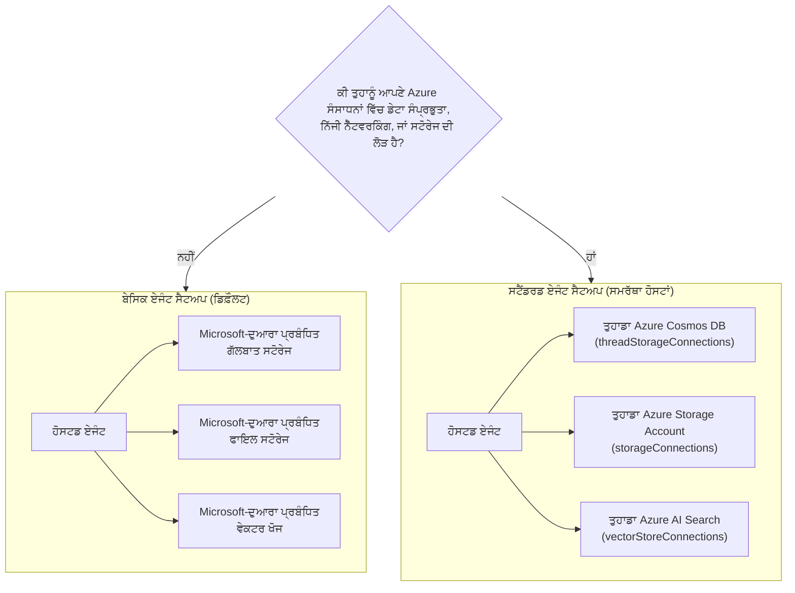

# ਪਾਠ 5: ਪ੍ਰੋਡਕਸ਼ਨ ਹੁਸਟਡ ਏਜੰਟ — ਸਟੋਰੇਜ, ਮੈਮੋਰੀ & ਸ਼ਾਸਨ

In [ਪਾਠ 4](../lesson-4-agentdeployment/README.md) ਤੁਸੀਂ Developer Onboarding
ਏਜੰਟ ਨੂੰ **Microsoft Foundry ਹੁਸਟਡ ਏਜੰਟ** ਵਜੋਂ ਤਾਇਨਾਤ ਕੀਤਾ ਅਤੇ ਇਸਦੇ ਸਾਹਮਣੇ ਇੱਕ ChatKit ਫਰੰਟਐਂਡ ਰੱਖਿਆ। ਉਹ
ਪਾਠ ਨੇ ਜਵਾਬ ਦਿੱਤਾ *"ਮੈਂ ਇੱਕ ਏਜੰਟ ਕਿਵੇਂ ਸ਼ਿਪ ਕਰਾਂ?"*. ਇਹ ਪਾਠ ਅਗਲੇ ਆਉਣ ਵਾਲੇ ਸਵਾਲਾਂ ਦੇ ਜਵਾਬ ਦਿੰਦਾ ਹੈ
ਇੱਕ ਉਦਯੋਗ ਵਿੱਚ: **ਮੇਰੇ ਏਜੰਟ ਦਾ ਡੇਟਾ ਕਿੱਥੇ ਸੰਭਾਲਿਆ ਜਾਂਦਾ ਹੈ? ਕੌਣ ਇਸਨੂੰ ਨਿਯੰਤ੍ਰਿਤ ਕਰਦਾ ਹੈ? ਮੈਂ ਕਿਵੇਂ ਕੰਪਲਾਇੰਸ,
ਨੈੱਟਵਰਕਿੰਗ, ਅਤੇ ਸ਼ਾਸਨ ਦੀਆਂ ਲੋੜਾਂ ਪੂਰੀਆਂ ਕਰਾਂ?**

ਇਸ ਪਾਠ ਵਿੱਚ ਸਭ ਤੋਂ ਮਹੱਤਵਪੂਰਣ ਵਿਚਾਰ **ਹੁਸਟਡ ਏਜੰਟ** ਅਤੇ ਇੱਕ
**ਕੈਪੇਬਿਲਿਟੀ ਹੋਸਟ** — ਦੋ ਧਾਰਣਾਵਾਂ ਜੋ ਆਸਾਨੀ ਨਾਲ ਗਲਤ ਸਮਝੀਆਂ ਜਾ ਸਕਦੀਆਂ ਹਨ ਪਰ ਪੂਰੀ ਤਰ੍ਹਾਂ ਵੱਖ-ਵੱਖ
ਸਮੱਸਿਆਵਾਂ ਹੱਲ ਕਰਦੀਆਂ ਹਨ।

## ਸਿਖਣ ਦੇ ਉਦੇਸ਼

ਇਸ ਪਾਠ ਦੇ ਅੰਤ ਤੱਕ ਤੁਸੀਂ ਸਮਰੱਥ ਹੋਵੋਗੇ:

- ਵਖਿਆਨ ਕਰੋ ਕਿ ਇੱਕ **ਹੁਸਟਡ ਏਜੰਟ** ਤੁਹਾਨੂੰ ਕੀ ਦਿੰਦਾ ਹੈ (Microsoft-ਪਰਬੰਧਿਤ ਐਕਜ਼ੈਕਿਊਸ਼ਨ) ਅਤੇ ਇਹ ਕੀ **ਨਹੀਂ** ਦਿੰਦਾ।
- ਸਮਝਾਓ ਕਿ **ਕੈਪੇਬਿਲਿਟੀ ਹੋਸਟ** ਕੀ ਹੈ ਅਤੇ ਠੀਕ ਕਦੋਂ ਤੁਹਾਨੂੰ ਇੱਕ ਦੀ ਲੋੜ ਹੁੰਦੀ ਹੈ।
- **ਬੇਸਿਕ ਏਜੰਟ ਸੈਟਅਪ** (Microsoft-ਪਰਬੰਧਿਤ ਸਟੋਰੇਜ) ਅਤੇ **ਸਟੈਂਡਰਡ ਏਜੰਟ ਸੈਟਅਪ**
  (ਆਪਣੇ Azure ਸਰੋਤ ਲਿਆਓ) ਵਿਚੋਂ ਚੁਣੋ।
- ਸਮਝੋ ਕਿ **ਗੱਲਬਾਤ ਇਤਿਹਾਸ, ਫਾਇਲ ਅਪਲੋਡ, ਅਤੇ ਵੇਕਟਰ ਸਟੋਅਰਜ਼** ਕਿਵੇਂ ਸਥਾਈ ਕੀਤੇ ਜਾਂਦੇ ਹਨ, ਅਤੇ ਕਿਵੇਂ
  ਉਨ੍ਹਾਂ ਨੂੰ ਆਪਣੇ Azure Cosmos DB, Azure Storage, ਅਤੇ Azure AI Search ਵਲ ਰੀਡਾਇਰੈਕਟ ਕਰਨਾ ਹੈ।
- ਸ਼ਾਸਨ ਨਿਯੰਤਰਣ ਲਗੂ ਕਰੋ: ਡੇਟਾ ਰਾਜਸਤਾ, ਨਿੱਜੀ ਨੈੱਟਵਰਕਿੰਗ, ਅਤੇ **Hosted MCP tool approval**.

---

## ਲੋੜੀਂਦੀਆਂ ਸ਼ਰਤਾਂ

1. Completed [ਪਾਠ 4](../lesson-4-agentdeployment/README.md) — ਤੁਹਾਡੇ ਕੋਲ ਇੱਕ ਹੁਸਟਡ ਏਜੰਟ ਤਾਇਨਾਤ ਹੈ।
2. ਇੱਕ **Microsoft Foundry** ਪ੍ਰੋਜੈਕਟ, ਅਤੇ ਇੱਕ Azure ਅਕਾਊਂਟ ਜਿਸ ਨੂੰ ਸਰੋਤ ਬਣਾਉਣ ਦੀ ਅਨੁਮਤੀ ਹੈ
   (Cosmos DB, Storage, Azure AI Search) ਅਤੇ ਸਬਸਕ੍ਰਿਪਸ਼ਨ/ਰਿਸੋਰਸ ਗਰੁੱਪ ਵਿੱਚ ਭੂਮਿਕਾਵਾਂ ਸੌਂਪਣ ਦੀ ਸਮਰੱਥਾ।
3. **Azure CLI** ਪ੍ਰਮਾਣਿਤ: `az login` (ਅਤੇ `az account set --subscription <id>` ਜੇ ਤੁਹਾਡੇ ਕੋਲ
   ਇੱਕ ਤੋਂ ਵੱਧ ਸਬਸਕ੍ਰਿਪਸ਼ਨ ਹੈ)।
4. **Azure Developer CLI** (`azd`) ਇੰਸਟਾਲ ਕੀਤਾ ਹੋਇਆ — ਸਟੈਂਡਰਡ-ਸੈਟਅਪ ਪ੍ਰੋਵੀਜ਼ਨਿੰਗ ਫਲੋ ਲਈ ਵਰਤਿਆ ਜਾਂਦਾ ਹੈ।
5. **Python 3.12+** ਨਾਲ ਕੋਰਸ ਦੀਆਂ ਡੀਪੈਂਡੰਸੀਜ਼ ਇੰਸਟਾਲ ਕੀਤੀਆਂ ਹੋਣ (`pip install -r ../requirements.txt`)।
6. ਇੱਕ ਮੌਜੂਦਾ, ਗੈਰ-ਰੀਟਾਇਰਡ ਮਾਡਲ ਡਿਪਲੋਇਮੈਂਟ (ਉਦਾਹਰਣ ਲਈ `gpt-5.1`). ਰੀਟਾਇਰਡ GPT-4o / GPT-4.1 ਤੋਂ ਬਚੋ।

> ਇਹ ਪਾਠ ਜ਼ਿਆਦਾਤਰ ਧਾਰਨਾਤਮਕ ਅਤੇ ਕੰਟਰੋਲ-ਪਲੇਨ ਕੇਂਦਰਿਤ ਹੈ। ਤੁਸੀਂ ਇਸਨੂੰ ਸ਼ੁਰੂ ਤੋਂ ਅੰਤ ਤੱਕ ਬਿਨਾਂ
> ਕਿਸੇ ਪ੍ਰੋਵੀਜ਼ਨਿੰਗ ਦੇ ਪੜ੍ਹ ਸਕਦੇ ਹੋ, ਫਿਰ ਜਦੋਂ ਤੁਸੀਂ ਤਿਆਰ ਹੋ ਤਾਂ ਹੱਥ-ਓਨ ਅਭਿਆਸ ਵਰਤੋਂ ਇੱਕ
> ਸਟੈਂਡਰਡ ਸੈਟਅਪ ਨੂੰ ਕਨਫਿਗਰ ਕਰਨ ਲਈ।

---

## 1. ਹੁਸਟਡ ਏਜੰਟ: Foundry ਤੁਹਾਡੇ ਲਈ ਕੀ ਪ੍ਰਬੰਧ ਕਰਦਾ ਹੈ

ਇੱਕ **ਹੁਸਟਡ ਏਜੰਟ** ਉਹ ਏਜੰਟ ਹੈ ਜਿਸਦਾ *ਐਕਜ਼ੈਕਿਊਸ਼ਨ ਵਾਤਾਵਰਣ* ਪੂਰੀ ਤਰ੍ਹਾਂ Microsoft
Foundry Agent Service ਦੁਆਰਾ ਪ੍ਰਬੰਧਿਤ ਕੀਤਾ ਜਾਂਦਾ ਹੈ। ਜਦੋਂ ਤੁਸੀਂ ਇਕHosted ਏਜੰਟ ਤਾਇਨਾਤ ਕਰਦੇ ਹੋ (ਜਿਵੇਂ ਤੁਸੀਂ ਪਾਠ 4 ਵਿੱਚ ਕੀਤਾ), Foundry ਇਹ ਮੁਹੱਈਆ ਕਰਦਾ ਹੈ:

- **Compute** — ਉਹ ਰਨਟਾਈਮ ਜੋ ਤੁਹਾਡੇ ਏਜੰਟ ਕੋਡ ਅਤੇ ਟੂਲ ਚਲਾਉਂਦਾ ਹੈ।
- **Scaling** — ਨਕਲਾਂ ਲੋਡ ਦੇ ਨਾਲ ਉੱਪਰ-ਹੇਠਾਂ ਹੁੰਦੀਆਂ ਹਨ (ਦੇਖੋ `agent.yaml` `scale` ਪਾਠ 4 ਵਿੱਚ)।
- **Identity** — ਏਜੰਟ ਲਈ ਇੱਕ ਪ੍ਰਬੰਧਿਤ ਪਛਾਣ, ਤਾਂ ਕਿ ਇਹ Azure ਨੂੰ ਬਿਨਾਂ ਸੀਕ੍ਰੇਟਸ ਦੇ ਪ੍ਰਮਾਣਿਤ ਕਰ ਸਕੇ।
- **Observability** — ਟ੍ਰੇਸਿੰਗ ਅਤੇ ਟੈਲੀਮੇਟਰੀ (ਦੇਖੋ ਪਾਠ 3 ਦਾ observability ਭਾਗ)।
- **Session management** — ਥਰੇਡ/ਗੱਲਬਾਤਾਂ, ਇਸ ਲਈ ਬਹੁ-ਦੌਰ ਚੈਟ ਪਹਿਲੀਆਂ ਵਾਰੀਾਂ "ਯਾਦ" ਰੱਖਦੀ ਹੈ।

> **ਮੁੱਖ ਬਿੰਦੂ:** ਤੁਹਾਨੂੰ ਸਿਰਫ਼ ਇੱਕ **ਹੁਸਟਡ ਏਜੰਟ** ਨੂੰ *ਚਲਾਉਣ* ਲਈ **ਕੈਪੇਬਿਲਿਟੀ ਹੋਸਟ** ਸੰਰਚਿਤ ਕਰਨ ਦੀ ਲੋੜ **ਨਹੀਂ** ਹੈ।
> ਇੱਕ ਏਜੰਟ। ਇੱਕ ਹੁਸਟਡ ਏਜੰਟ Microsoft-ਪਰਬੰਧਿਤ ਢਾਂਚੇ ਉੱਤੇ ਬਾਕਸ ਤੋਂ ਬਾਹਰ ਹੀ ਕੰਮ ਕਰਦਾ ਹੈ।

---

## 2. ਹੁਸਟਡ ਏਜੰਟਸ ਬਨਾਮ ਕੈਪੇਬਿਲਿਟੀ ਹੋਸਟ

**ਹੁਸਟਡ ਏਜੰਟ ਅਤੇ ਕੈਪੇਬਿਲਿਟੀ ਹੋਸਟ ਵੱਖ-ਵੱਖ ਸਮੱਸਿਆਵਾਂ ਹੱਲ ਕਰਦੇ ਹਨ।**

**ਹੁਸਟਡ ਏਜੰਟ** ਮਾਇਕਰੋਸਾਫਟ-ਪਰਬੰਧਿਤ ਐਕਜ਼ੈਕਿਊਸ਼ਨ ਵਾਤਾਵਰਣ ਪ੍ਰਦਾਨ ਕਰਦੇ ਹਨ, ਜਿਸ ਵਿੱਚ ਕੰਪਿਊਟ, ਸਕੇਲਿੰਗ,
ਪਛਾਣ, ਵੇਖਣਯੋਗਤਾ ਅਤੇ ਸੈਸ਼ਨ ਪ੍ਰਬੰਧਨ. ਤੁਹਾਨੂੰ ਸਿਰਫ਼ ਚਲਾਉਣ ਲਈ **ਕੈਪੇਬਿਲਿਟੀ ਹੋਸਟ** ਦੀ ਲੋੜ **ਨਹੀਂ** ਹੈ
ਇੱਕ **ਹੁਸਟਡ ਏਜੰਟ**।

**ਕੈਪੇਬਿਲਿਟੀ ਹੋਸਟ** ਸਿਰਫ਼ ਤਦਾਂ ਲੋੜੀਂਦੇ ਹਨ ਜਦੋਂ ਤੁਸੀਂ ਚਾਹੁੰਦੇ ਹੋ ਕਿ Agent Service **ਗਾਹਕ-ਮਲਕੀਅਤ ਵਾਲੇ
ਸਰੋਤ** ਦੀ ਥਾਂ Microsoft-ਪਰਬੰਧਿਤ ਸਟੋਰੇਜ ਵਰਤੇ। ਜੇ ਤੁਸੀਂ ਡਿਫੌਲਟ ਨਾਲ ਖੁਸ਼ ਹੋ
Microsoft-ਪਰਬੰਧਿਤ ਸਟੋਰੇਜ, ਵੇਕਟਰ ਖੋਜ ਅਤੇ ਗੱਲਬਾਤ ਦੀ ਲਗਾਤਾਰਤਾ, **ਤਾਂ ਕੋਈ ਕੈਪੇਬਿਲਿਟੀ ਹੋਸਟ
ਸੰਰਚਨਾ ਲਾਜ਼ਮੀ ਨਹੀਂ ਹੈ।**

ਜੇ ਤੁਹਾਡੀ ਸੰਗਠਨ ਨੂੰ **ਡੇਟਾ ਰਾਜਸਤਾ, ਨਿੱਜੀ ਨੈੱਟਵਰਕਿੰਗ, ਕੰਪਲਾਇੰਸ ਨਿਯੰਤਰਣ ਜਾਂ
storage in your own Azure Cosmos DB, Azure Storage Account and Azure AI Search resources**, ਤਾਂ
ਤੁਸੀਂ **ਕੈਪੇਬਿਲਿਟੀ ਹੋਸਟ** ਸੰਰਚਿਤ ਕਰਦੇ ਹੋ ਤਾਂ ਜੋ Agent Service ਉਹਨਾਂ ਸਰੋਤਾਂ ਨਾਲ ਜੁੜ ਸਕੇ।

ਇੱਕ ਵਾਕ ਵਿੱਚ:

> ਇੱਕ **ਹੁਸਟਡ ਏਜੰਟ** *ਇਸ ਗੱਲ ਬਾਰੇ ਹੈ ਕਿ ਤੁਹਾਡਾ ਏਜੰਟ ਕਿੱਥੇ ਚਲਦਾ ਹੈ*। ਇੱਕ **ਕੈਪੇਬਿਲਿਟੀ ਹੋਸਟ** *ਇਸ ਗੱਲ ਬਾਰੇ ਹੈ ਕਿ ਤੁਹਾਡੇ
> ਏਜੰਟ ਦਾ ਡੇਟਾ ਕਿੱਥੇ ਰਹਿੰਦਾ ਹੈ*।

| ਚਿੰਤਾ | ਹੁਸਟਡ ਏਜੰਟ | ਕੈਪੇਬਿਲਿਟੀ ਹੋਸਟ |
|---------|--------------|-----------------|
| ਕੰਪਿਊਟ / ਸਕੇਲਿੰਗ / ਪਛਾਣ | ✅ Provided | — |
| ਵੇਖਣਯੋਗਤਾ / ਟ੍ਰੇਸਿੰਗ | ✅ Provided | — |
| ਗੱਲਬਾਤ & ਥਰੇਡ ਸੈਸ਼ਨ ਪ੍ਰਬੰਧਨ | ✅ Provided | ਰੀਡਾਇਰੈਕਟ ਕਰਦਾ ਹੈ *ਜਿੱਥੇ ਇਹ ਸਟੋਰ ਕੀਤਾ ਜਾਂਦਾ ਹੈ* |
| ਗੱਲਬਾਤ ਇਤਿਹਾਸ ਕਿੱਥੇ ਸਟੋਰ ਹੁੰਦਾ ਹੈ | Microsoft-managed by default | Your Azure Cosmos DB |
| ਅਪਲੋਡ ਕੀਤੀਆਂ ਫਾਇਲਾਂ ਕਿੱਥੇ ਸਟੋਰ ਹੁੰਦੀਆਂ ਹਨ | Microsoft-managed by default | Your Azure Storage Account |
| ਵੇਕਟਰ ਐਮਬੈਡੀੰਗ ਕਿੱਥੇ ਸਟੋਰ ਹੁੰਦੇ ਹਨ | Microsoft-managed by default | Your Azure AI Search |
| ਕੀ ਏਜੰਟ ਚਲਾਉਣ ਲਈ ਲਾਜ਼ਮੀ ਹੈ? | ✅ Yes (ਇਹ *ਖੁਦ* ਏਜੰਟ ਹੋਸਟ ਹੈ) | ❌ No — optional |
| ਕੀ ਡੇਟਾ ਰਾਜਸਤਾ / BYO ਸਟੋਰੇਜ ਲਈ ਲਾਜ਼ਮੀ ਹੈ? | ❌ Not sufficient alone | ✅ Yes |

---

## 3. ਬੇਸਿਕ vs ਸਟੈਂਡਰਡ ਏਜੰਟ ਸੈਟਅਪ

Foundry ਦੋ ਡੇਟਾ ਸੰਰਚਨਾਵਾਂ ਨੂੰ **ਬੇਸਿਕ** ਅਤੇ **ਸਟੈਂਡਰਡ** ਏਜੰਟ ਸੈਟਅਪ ਵਜੋਂ ਵਰਣਨ ਕਰਦਾ ਹੈ।



### ਕਦੋਂ ਬੇਸਿਕ ਸੈਟਅਪ 'ਤੇ ਰਹਿਣਾ (ਕੋਈ ਕੈਪੇਬਿਲਿਟੀ ਹੋਸਟ ਨਹੀਂ)

- ਵਿਕਾਸ, ਪ੍ਰੋਟੋਟਾਈਪਿੰਗ, ਅਤੇ ਟੈਸਟਿੰਗ।
- ਅੰਦਰੂਨੀ ਟੂਲ ਜਿੱਥੇ Microsoft-ਪਰਬੰਧਿਤ ਸਟੋਰੇਜ ਤੁਹਾਡੀ ਡੇਟਾ-ਹੈਂਡਲਿੰਗ ਨੀਤੀ ਨੂੰ ਪੂਰਾ ਕਰਦਾ ਹੈ।
- ਤੁਸੀਂ ਘੱਟ ਤੋਂ ਘੱਟ ਇੰਫਰਾਸਟਰੱਕਚਰ ਨਾਲ ਇੱਕ ਕੰਮ ਕਰ ਰਹੇ ਏਜੰਟ ਤੱਕ ਸਭ ਤੋਂ ਤੇਜ਼ ਰਸਤਾ ਚਾਹੁੰਦੇ ਹੋ।

### ਜਦੋਂ ਤੁਹਾਨੂੰ ਸਟੈਂਡਰਡ ਸੈਟਅਪ ਦੀ ਲੋੜ ਹੁੰਦੀ ਹੈ (ਕੈਪੇਬਿਲਿਟੀ ਹੋਸਟ)

- **ਡੇਟਾ ਰਾਜਸਤਾ** — ਸਾਰਾ ਏਜੰਟ ਡੇਟਾ ਤੁਹਾਡੇ Azure subscription/region ਵਿੱਚ ਹੀ ਰਹਿਣਾ ਚਾਹੀਦਾ ਹੈ।
- **ਸੁਰੱਖਿਆ ਨਿਯੰਤਰਣ** — ਤੁਹਾਨੂੰ ਆਪਣੇ ਸਟੋਰੇਜ ਅਕਾਊਂਟ, ਡੈਟਾਬੇਸ, ਅਤੇ ਖੋਜ ਸੇਵਾਵਾਂ ਵਰਤਣੀਆਂ ਹੋਣਗੀਆਂ।
- **ਕੰਪਲਾਇੰਸ** — ਤੁਹਾਡੇ ਕੋਲ ਨਿਯਮਕ ਜਾਂ ਸੰਗਠਨਾਤਮਕ ਲੋੜਾਂ ਹੋ ਸਕਦੀਆਂ ਹਨ ਕਿ ਡੇਟਾ ਕਿੱਥੇ ਰਹੇ।
- **ਨਿੱਜੀ ਨੈੱਟਵਰਕਿੰਗ** — ਟ੍ਰੈਫਿਕ ਤੁਹਾਡੇ ਵਰਚੁਅਲ ਨੈੱਟਵਰਕ ਦੇ ਅੰਦਰ ਹੀ ਰਹਿਣਾ ਚਾਹੀਦਾ ਹੈ (ਆਪਣਾ ਵਰਚੁਅਲ ਨੈੱਟਵਰਕ ਲਿਆਓ)।

> **Microsoft ਤੋਂ ਸਿਫਾਰਸ਼:** *ਵੱਖ-ਵੱਖ* Foundry ਖਾਤੇ/ਪ੍ਰੋਜੈਕਟ ਸਟੈਂਡਰਡ ਵਿਰੁੱਧ
> ਬੇਸਿਕ ਸੈਟਅਪ ਲਈ ਵਰਤੋ। ਇੱਕੋ Foundry ਖਾਤੇ ਵਿੱਚ ਸੈਟਅਪ ਕਿਸਮਾਂ ਨੂੰ ਮਿਲਾਉਣ ਤੋਂ ਬਚੋ।

---

## 4. ਕੈਪੇਬਿਲਿਟੀ ਹੋਸਟ ਕਿਵੇਂ ਕੰਮ ਕਰਦੇ ਹਨ

ਇੱਕ **ਕੈਪੇਬਿਲਿਟੀ ਹੋਸਟ** ਇੱਕ ਸਬ-ਰਿਸੋਰਸ ਹੈ ਜਿਸਨੂੰ ਤੁਸੀਂ **ਦੋ ਸਕੋਪਸ** 'ਤੇ ਸੰਰਚਿਤ ਕਰਦੇ ਹੋ: Foundry **ਖਾਤਾ**
ਅਤੇ Foundry **ਪ੍ਰੋਜੈਕਟ**. ਇਹ Agent Service ਨੂੰ ਦੱਸਦਾ ਹੈ ਕਿ ਏਜੰਟ ਡੇਟਾ ਕਿੱਥੇ ਸਟੋਰ ਅਤੇ ਪ੍ਰੋਸੈਸ ਕੀਤਾ ਜਾਣਾ ਚਾਹੀਦਾ ਹੈ:
ਗੱਲਬਾਤ ਇਤਿਹਾਸ, ਫਾਇਲ ਅਪਲੋਡ, ਅਤੇ ਵੇਕਟਰ ਸਟੋਰ।

ਦੋ ਨਿਯਮ ਸਭ ਤੋਂ ਜ਼ਰੂਰੀ ਹਨ:

1. **ਖਾਤਾ ਪਹਿਲਾਂ।** ਤੁਸੀਂ ਪ੍ਰੋਜੈਕਟ ਕੈਪੇਬਿਲਿਟੀ ਹੋਸਟ ਨਹੀਂ ਬਣਾ ਸਕਦੇ ਜਦ ਤੱਕ ਇੱਕ
   ਖਾਤਾ-ਸਤਰੀ ਕੈਪੇਬਿਲਿਟੀ ਹੋਸਟ ਪਹਿਲਾਂ ਹੀ ਮੌਜੂਦ ਨਾ ਹੋਵੇ।

2. **ਕੰਫਿਗਰੇਸ਼ਨ ਦਾ ਵਾਰਸਾ ਨਹੀਂ।** **ਪ੍ਰੋਜੈਕਟ** ਕੈਪੇਬਿਲਿਟੀ ਹੋਸਟ ਉਹ ਹੈ ਜੋ Agent Service
   ਅਸਲ ਵਿੱਚ ਪੜ੍ਹਦਾ ਹੈ ਤਾਂ ਜੋ ਇਹ ਫੈਸਲਾ ਕਰ ਸਕੇ ਕਿ ਕਿਹੜੇ ਸਟੋਰੇਜ/ਗੱਲਬਾਤ/ਵੇਕਟਰ ਸਰੋਤ ਵਰਤਣੇ ਹਨ। ਅਕਾਊਂਟ-ਸਤਰ
   ਕਨੈਕਸ਼ਨ ਪ੍ਰੋਜੈਕਟ ਵੱਲੋਂ *ਆਪੇ* ਸਵੈਚਾਲਿਤ ਤੌਰ 'ਤੇ ਵਰਤੇ ਨਹੀਂ ਜਾਂਦੇ — ਪ੍ਰੋਜੈਕਟ ਕੈਪੇਬਿਲਿਟੀ ਹੋਸਟ ਨੂੰ
   ਉਨਾਂ ਨੂੰ ਖਾਸ ਤੌਰ 'ਤੇ ਹਵਾਲਾ ਦੇਣਾ ਚਾਹੀਦਾ ਹੈ.

### ਸਟੈਂਡਰਡ ਸੈਟਅੱਪ ਲਈ ਲੋੜੀਂਦੇ ਕਨੈਕਸ਼ਨ

ਕੈਪੇਬਿਲਿਟੀ ਹੋਸਟ ਉਹ **ਕਨੈਕਸ਼ਨ** (ਤੁਹਾਡੇ Foundry account/project ਵਿੱਚ ਬਣਾਏ ਗਏ) ਨੂੰ ਹਵਾਲਾ ਕਰਦੇ ਹਨ ਜੋ ਦਰਸਾਉਂਦੇ ਹਨ
ਤੁਹਾਡੇ Azure ਸਰੋਤ:

| ਕੈਪੇਬਿਲਿਟੀ ਹੋਸਟ ਪ੍ਰਾਪਰਟੀ | ਸਟੋਰ ਕਰਦਾ ਹੈ | ਤੁਹਾਡਾ Azure ਸਰੋਤ |
|--------------------------|--------|---------------------|
| `threadStorageConnections` | Agent ਪਰਿਭਾਸ਼ਾਵਾਂ + ਗੱਲਬਾਤ ਇਤਿਹਾਸ | Azure Cosmos DB |
| `storageConnections` | ਫਾਈਲ ਅਪਲੋਡ / ਬਲੌਬ ਸਟੋਰੇਜ | Azure Storage Account |
| `vectorStoreConnections` | ਪੁਨਰ-ਪ੍ਰਾਪਤੀ/ਖੋਜ ਲਈ ਵੇਕਟਰ ਇੰਬੈਡਿੰਗ | Azure AI Search |
| `aiServicesConnections` *(ਵਿਕਲਪਿਕ)* | ਤੁਹਾਡੇ ਆਪਣੇ ਮਾਡਲ ਡਿਪਲੋਇਮੈਂਟ | Azure OpenAI |

Each connection must have `authType`, `category`, `target` (ਸੇਵਾ **endpoint URL**, ਨਾ ਕਿ
   resource ID), and `metadata.ResourceId` (ਪੂਰਾ Azure resource ID) populated, or Agent Service
cannot resolve the resource at runtime.

### Configuring the capability hosts (control plane)

ਕੈਪੇਬਿਲਿਟੀ ਹੋਸਟਾਂ ਨੂੰ ਇਸ ਵੇਲੇ **Azure Resource Manager REST API** ਰਾਹੀਂ ਪ੍ਰਬੰਧ ਕੀਤਾ ਜਾਂਦਾ ਹੈ (ਹੁਣ ਤੱਕ ਕੋਈ
SDK for capability-host management yet). First create the **account** capability host:

```http
PUT https://management.azure.com/subscriptions/{subscriptionId}/resourceGroups/{rg}/providers/Microsoft.CognitiveServices/accounts/{account}/capabilityHosts/{name}?api-version=2025-06-01

{
  "properties": { "capabilityHostKind": "Agents" }
}
```

Then create the **project** capability host that references your connections:

```http
PUT https://management.azure.com/subscriptions/{subscriptionId}/resourceGroups/{rg}/providers/Microsoft.CognitiveServices/accounts/{account}/projects/{project}/capabilityHosts/{name}?api-version=2025-06-01

{
  "properties": {
    "capabilityHostKind": "Agents",
    "threadStorageConnections": ["my-cosmosdb-connection"],
    "vectorStoreConnections":  ["my-ai-search-connection"],
    "storageConnections":      ["my-storage-connection"]
  }
}
```

> **ਯਾਦ ਰੱਖਣ ਲਈ ਪਾਬੰਦੀਆਂ:**
> - **ਹਰ ਸਕੋਪ ਲਈ ਇੱਕ capability host.** ਇੱਕੋ ਹੀ ਸਕੋਪ 'ਤੇ ਦੂਜਾ ਬਣਾਇਆ ਗਿਆ ਤਾਂ `409 Conflict` ਵਾਪਸ ਆਉਂਦਾ ਹੈ।
> - **ਕੋਈ ਅੱਪਡੇਟ ਨਹੀਂ।** ਸੈੱਟਿੰਗ ਬਦਲਣ ਲਈ ਤੁਹਾਨੂੰ **ਡਿਲੀਟ ਅਤੇ ਦੁਬਾਰਾ ਬਣਾਉਣਾ** ਪਵੇਗਾ।
> - **ਡਿਲੀਸ਼ਨ ਨੁਕਸਾਨਦਾਇਕ ਹੈ।** ਕੈਪੇਬਿਲਿਟੀ ਹੋਸਟ ਨੂੰ ਮਿਟਾਉਣ ਨਾਲ ਏਜੰਟਾਂ ਦੀ ਫਾਇਲਾਂ,
>   ਗੱਲਬਾਤਾਂ, ਅਤੇ ਉਹਨਾਂ ਵੇਕਟਰ ਸਟੋਰਾਂ ਤੱਕ ਪਹੁੰਚ ਜੋ ਇਹ ਦਰਸਾ ਰਿਹਾ ਸੀ, ਹਟ ਜਾਂਦੀ ਹੈ।

### Verify it works

After configuration, run a test conversation and confirm that:

- Conversations appear in **your Azure Cosmos DB**.
- Uploaded files appear in **your Azure Storage account**.
- Vector data appears in **your Azure AI Search index**.

---

## 5. Memory & context management

"Session management" (ਇੱਕ Hosted Agent ਫੀਚਰ) ਅਤੇ "ਕਿੱਥੇ threads ਸਟੋਰ ਕੀਤੇ ਜਾਂਦੇ ਹਨ" (ਇੱਕ Capability Host
concern) ਮਿਲ ਕੇ ਤੁਹਾਡੇ ਏਜੰਟ ਨੂੰ **ਮੈਮੋਰੀ** ਦਿੰਦੇ ਹਨ:

- A **thread** (conversation) holds the ordered turns of a chat. The Responses API threads calls
  together via `previous_response_id` (ਤੁਸੀਂ ਇਹ Lesson 4 smoke tests ਵਿੱਚ ਵੇਖਿਆ ਸੀ).
- On **basic setup**, thread/conversation state lives in Microsoft-managed storage.
- On **standard setup**, that same state is persisted to **your Azure Cosmos DB** via
  `threadStorageConnections` — ਤੁਹਾਨੂੰ ਟਿਕਾਊ, ਖੋਜਯੋਗ, ਸੁਵੈਰਣ ਗੱਲਬਾਤ ਇਤਿਹਾਸ ਦਿੰਦਾ ਹੈ.

This is the difference between an agent that "remembers within a session" and an enterprise
system where every conversation is retained in your own compliance boundary.

---

## 6. Governance & security checklist

Use this checklist when promoting a hosted agent from prototype to production:

- [ ] **Decide basic vs standard setup** using the questions in §3 — document the decision.
- [ ] **Data sovereignty:** if required, configure Capability Hosts so conversation history
      (Cosmos DB), files (Storage), and vectors (AI Search) stay in your subscription/region.
- [ ] **Private networking:** for standard setup, restrict traffic with Bring Your Own Virtual
      Network so data cannot leave your network (this helps prevent data ਨਿਕਾਸ).
- [ ] **RBAC:** grant least privilege. Creating capability hosts needs **Contributor** on the
      Foundry account; assigning access to your Azure resources needs **User Access Administrator**
or **Owner**.
- [ ] **Hosted MCP tool governance:** review every MCP server your agent can call and set an
      **approval mode** (see §7). Never expose an unreviewed external tool to a production agent.
- [ ] **Observability:** confirm tracing/telemetry is on (Lesson 3) so you can audit tool calls.
- [ ] **Cost:** BYO resources (Cosmos DB, AI Search, Storage) are billed to *ਤੁਹਾਡੇ* subscription —
      size and monitor them. Basic setup folds storage into the managed service.

---

## 7. Hosted MCP tools & approval workflows

The Developer Onboarding Agent in Lesson 4 already uses a **Hosted MCP tool** — the
[Microsoft Learn MCP ਸਰਵਰ](https://learn.microsoft.com/api/mcp) — added with:

```python
client.get_mcp_tool(
    name="Microsoft Learn MCP",
    url="https://learn.microsoft.com/api/mcp",
    approval_mode="never_require",
)
```

The **Model Context Protocol (MCP)** is an open standard that lets an agent discover and call
external tools over a uniform interface. **Hosted MCP tools** let Foundry call an MCP server on the
agent's behalf. Two governance levers matter in production:

- **`approval_mode`** — controls whether a human/caller must approve each tool invocation.
  - `never_require` is convenient for a trusted, read-only server like Microsoft Learn.
  - For servers that can **write** or reach sensitive systems, require approval so a call is
    reviewed before it executes. This is your **approval workflow**.
- **Server allow-listing** — only connect MCP servers you have reviewed and trust. Treat an MCP
  URL like any other production dependency.

> **Try it:** change the Lesson 4 agent's `approval_mode` to require approval, redeploy, and
> observe how tool calls now pause for confirmation before running.

---

## Hands-on exercises

1. **Classify a scenario.** For each of these, decide *basic* or *standard* setup and justify it:
   (a) ਇੱਕ ਹੈਕਥੌਨ ਡੈਮੋ, (b) ਇੱਕ ਹੇਲਥਕੇਅਰ ਓਨਬੋਰਡਿੰਗ ਸਹਾਇਕ ਜੋ PII ਸੰਭਾਲਦਾ ਹੈ, (c) ਇੱਕ ਆਂਤਰਿਕ
   FAQ bot, (d) a bank agent that must keep all data in-region.
2. **Map the storage.** For the Lesson 4 agent, list which capability-host property would store
   its (a) chat history, (b) uploaded employee files, (c) vector embeddings.
3. **Design an approval workflow.** Add a hypothetical "create Jira ticket" MCP tool to the agent.
   What `approval_mode` would you use and why?
4. **ਲਾਗਤ ਤਰਕ-ਵਿਚਾਰ।** ਬੇਸਿਕ ਤੋਂ
   ਸਟੈਂਡਰਡ ਸੈਟਅੱਪ 'ਤੇ ਜਾਣ ਦੇ ਲਾਗਤ ਪ੍ਰਭਾਵ, ਇੱਕ ਉੱਚ-ਟ੍ਰੈਫਿਕ ਏਜੰਟ ਲਈ, ਬਾਰੇ ਦੋ ਜਾਂ ਤਿੰਨ ਵਾਕ ਲਿਖੋ.

---

## Resources

- [ਕੈਪੇਬਿਲਿਟੀ ਹੋਸਟ — Microsoft Foundry](https://learn.microsoft.com/azure/foundry/agents/concepts/capability-hosts)
- [ਸਟੈਂਡਰਡ ਏਜੰਟ ਸੈਟਅੱਪ (ਬਿਲਟ-ਇਨ ਐਂਟਰਪ੍ਰਾਈਜ਼ ਤਿਆਰੀ)](https://learn.microsoft.com/azure/foundry/agents/concepts/standard-agent-setup)

- [ਆਪਣੇ ਖੁਦ ਦੇ ਸਰੋਤਾਂ ਦੀ ਵਰਤੋਂ ਕਰੋ](https://learn.microsoft.com/azure/foundry/agents/how-to/use-your-own-resources)

- [ਆਪਣਾ ਏਜੰਟ ਵਾਤਾਵਰਣ ਸੈੱਟ ਕਰੋ (ਬੇਸਿਕ ਬਨਾਮ ਸਟੈਂਡਰਡ)](https://learn.microsoft.com/azure/foundry/agents/environment-setup)
- [Foundry Agent Service ਲਈ ਨਿੱਜੀ ਨੈਟਵਰਕਿੰਗ ਸੈੱਟ ਕਰੋ](https://learn.microsoft.com/azure/foundry/agents/how-to/virtual-networks)
- [ਆਪਣੇ ਪ੍ਰੋਜੈਕਟ ਵਿੱਚ ਇੱਕ ਕਨੈਕਸ਼ਨ ਜੋੜੋ](https://learn.microsoft.com/azure/foundry/how-to/connections-add)
- [Microsoft Learn MCP ਸਰਵਰ](https://learn.microsoft.com/training/support/mcp)
- [ਮਾਡਲ ਸੰਦਰਭ ਪ੍ਰੋਟੋਕੋਲ](https://modelcontextprotocol.io/)

---

**ਪਿਛਲਾ:** [ਪਾਠ 4 — ਏਜੰਟ ਡਿਪਲਾਇਮੈਂਟ](../lesson-4-agentdeployment/README.md) &nbsp;·&nbsp; **ਅਗਲਾ:** [ਪਾਠ 6 — Microsoft ਟੂਲਬਾਕਸ](../lesson-6-toolbox/README.md)

---

<!-- CO-OP TRANSLATOR DISCLAIMER START -->
**ਅਸਵੀਕਾਰੋਪਣ**:
ਇਸ ਦਸਤਾਵੇਜ਼ ਦਾ ਅਨੁਵਾਦ ਏਆਈ ਅਨੁਵਾਦ ਸੇਵਾ [Co-op Translator](https://github.com/Azure/co-op-translator) ਦੀ ਵਰਤੋਂ ਕਰਕੇ ਕੀਤਾ ਗਿਆ ਹੈ। ਜਦੋਂ ਕਿ ਅਸੀਂ ਸਹੀਤਾਵਾਂ ਲਈ ਯਤਨਸ਼ੀਲ ਹਾਂ, ਕਿਰਪਾ ਕਰਕੇ ਧਿਆਨ ਰੱਖੋ ਕਿ ਸਵੈਚਾਲਿਤ ਅਨੁਵਾਦਾਂ ਵਿੱਚ ਗਲਤੀਆਂ ਜਾਂ ਅਸਮੱਤਿਆਵਾਂ ਹੋ ਸਕਦੀਆਂ ਹਨ। ਮੂਲ ਦਸਤਾਵੇਜ਼ ਆਪਣੀ ਮੂਲ ਭਾਸ਼ਾ ਵਿੱਚ ਅਧਿਕਾਰਕ ਸਰੋਤ ਮੰਨਿਆ ਜਾਣਾ ਚਾਹੀਦਾ ਹੈ। ਜਰੂਰੀ ਜਾਣਕਾਰੀ ਲਈ, ਪੇਸ਼ੇਵਰ ਮਨੁੱਖੀ ਅਨੁਵਾਦ ਦੀ ਸਿਫ਼ਾਰਸ਼ ਕੀਤੀ ਜਾਂਦੀ ਹੈ। ਅਸੀਂ ਇਸ ਅਨੁਵਾਦ ਦੇ ਉਪਯੋਗ ਤੋਂ ਪੈਦਾ ਹੋਣ ਵਾਲੀਆਂ ਕਿਸੇ ਵੀ ਗਲਤਫਹਿਮੀਆਂ ਜਾਂ ਗਲਤ ਵਿਆਖਿਆਵਾਂ ਲਈ ਜਵਾਬਦੇਹ ਨਹੀਂ ਹਾਂ।
<!-- CO-OP TRANSLATOR DISCLAIMER END -->