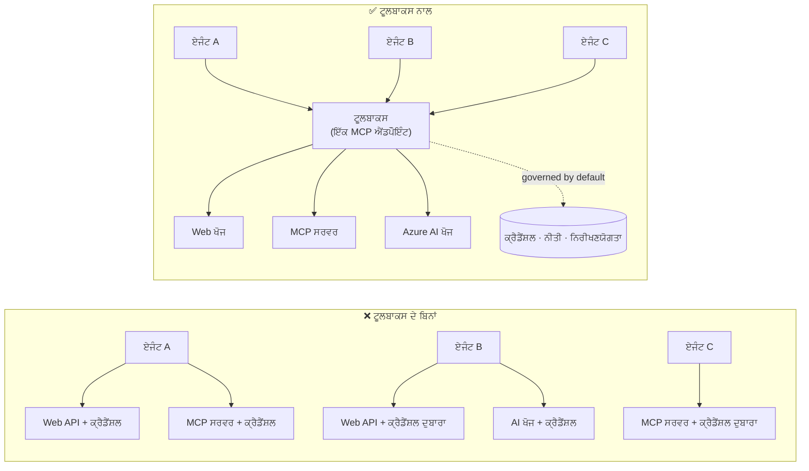

# ਪਾਠ 6: Microsoft Toolbox — ਏਜੰਟਾਂ ਲਈ ਸ਼ਾਸਿਤ ਟੂਲ

ਪਿਛਲੇ [ਪਾਠ 5](../lesson-5-hosted-agents-production/README.md) ਦੇ ਅਨੁਸਾਰ ਤੁਹਾਡਾ ਹੋਸਟਡ ਏਜੰਟ ਚੱਲਦਾ ਹੈ
ਉਤਪਾਦਨ ਵਿੱਚ, ਉਹ ਸਟੋਰੇਜ ਅਤੇ ਗਵਰਨੈਂਸ ਪੋਜ਼ਚਰ ਜਿਸਦੀ ਤੁਹਾਡੇ ਸੰਗਠਨ ਨੂੰ ਲੋੜ ਹੈ।
ਪਰ ਪਾਠ 4 ਦੇ ਏਜੰਟ ਨੂੰ ਵਾਪਸ ਵੇਖੋ: ਹਰ ਟੂਲ `main.py` ਵਿੱਚ **ਸਖ਼ਤੀ ਨਾਲ ਕੋਡ ਕੀਤਾ ਗਿਆ** ਸੀ — Microsoft Learn MCP URL, the
file-search vector store, ਆਦਿ। ਇਹ ਇੱਕ ਏਜੰਟ ਲਈ ਠੀਕ ਹੈ। ਇਹ **ਨਹੀਂ** ਸਕੇਲ ਹੁੰਦਾ ਇੱਕ
ਸੰਸਥਾ ਲਈ ਜਿਸਦੇ ਦਰਜਨਾਂ ਏਜੰਟ ਅਤੇ ਟੀਮਾਂ ਹਨ।

This lesson introduces **Microsoft Toolbox**: the way Foundry lets you define a curated set of
ਟੂਲਾਂ ਨੂੰ **ਇੱਕ ਵਾਰੀ**, ਉਹਨਾਂ ਨੂੰ **ਕੇਂਦਰੀ ਤੌਰ 'ਤੇ** ਪ੍ਰਬੰਧਿਤ ਕਰੋ, ਅਤੇ ਕਿਸੇ ਵੀ ਏਜੰਟ ਲਈ ਉਨ੍ਹਾਂ ਦੀ ਪਹੁੰਚ **ਇੱਕ,
ਸ਼ਾਸਿਤ ਐਂਡਪਾਇੰਟ**.

## ਸਿੱਖਣ ਦੇ ਉਦੇਸ਼

ਇਸ ਪਾਠ ਦੇ ਅੰਤ ਤੱਕ ਤੁਸੀਂ ਸਮਰੱਥ ਹੋਵੋਗੇ:

- Toolbox ਦੁਆਰਾ ਹੱਲ ਕੀਤੀ ਜਾਣ ਵਾਲੀ ਟੂਲ-ਫੈਲਾਅ ਸਮੱਸਿਆ ਦੀ ਵਿਆਖਿਆ ਕਰੋ।
- **Build** ਅਤੇ **Consume** ਅਸੂਲਾਂ ਅਤੇ ਉਹ ਟੂਲ ਕਿਸਮਾਂ ਜੋ ਇੱਕ ਟੂਲਬੌਕਸ ਵਿੱਚ ਹੋ ਸਕਦੀਆਂ ਹਨ, ਦਾ ਵਰਣਨ ਕਰੋ।
- Foundry SDK ਨਾਲ **Build** ਕਰਕੇ ਇੱਕ ਟੂਲਬੌਕਸ ਵਰਜਨ ਬਣਾਉਣਾ।
- ਇੱਕ Microsoft Agent Framework ਹੋਸਟਡ ਏਜੰਟ ਤੋਂ ਇੱਕ ਸਿੰਗਲ MCP ਐਂਡਪਾਇੰਟ ਰਾਹੀਂ **Consume** ਕਰੋ।
- **versioning** ਦੀ ਵਰਤੋਂ ਕਰੋ ਤਾਂ ਜੋ ਟੂਲ ਬਦਲਾਅ ਐਜੰਟ ਕੋਡ ਵਿੱਚ ਕੋਈ ਤਬਦੀਲੀ ਜਾਂ ਰਿਡਿਪਲੋਏ ਕੀਤੇ ਬਿਨਾਂ ਭੇਜੇ ਜਾ ਸਕਣ।
- **governance** ਨੂੰ ਲਾਗੂ ਕਰੋ: RBAC, credential injection, ਅਤੇ guardrail (RAI) ਨੀਤੀਆਂ।

---

## ਪੂਰਵ-ਅਵਸ਼ਕਤਾਵਾਂ

1. [ਪਾਠ 4](../lesson-4-agentdeployment/README.md) ਪੂਰਾ ਕੀਤਾ ਹੋਇਆ ਅਤੇ ਸੰਭਵ ਹੋਵੇ ਤਾਂ
   [ਪਾਠ 5](../lesson-5-hosted-agents-production/README.md).
2. ਇੱਕ **Microsoft Foundry** ਪ੍ਰੋਜੈਕਟ ਜਿਸਨੂੰ ਟੂਲਬੌਕਸ ਰਿਸੋਰਸ ਬਣਾਉਣ ਅਤੇ ਪ੍ਰਬੰਧਿਤ ਕਰਨ ਦੀ ਇਜਾਜ਼ਤ ਹੈ।
3. **Azure CLI** authenticated: `az login`. Foundry toolbox APIs ਲਈ ਲੋੜ ਹੈ ਕਿ
   `https://ai.azure.com/.default` token ਸਕੋਪ (ਹੇਠਾਂ ਕੋਡ ਵਿੱਚ ਦਿਖਾਇਆ ਗਿਆ).
4. **Python 3.12+** ਅਤੇ ਕੋਰਸ ਦੀਆਂ ਡਿਪੇਂਡੰਸੀਜ਼ ਇੰਸਟਾਲ ਕੀਤੀਆਂ ਹੋਈਆਂ (`pip install -r ../requirements.txt`)।
5. ਇੱਕ ਮੌਜੂਦਾ, ਗੈਰ-ਰਿਟਾਇਰਡ ਮਾਡਲ ਡਿਪਲੋਇਮੈਂਟ (ਉਦਾਹਰਨ ਵਜੋਂ `gpt-5.1`). ਰਿਟਾਇਰਡ GPT-4o / GPT-4.1 ਤੋਂ ਬਚੋ।

---

## 1. ਸਮੱਸਿਆ: ਟੂਲ-ਫੈਲਾਅ

ਇੱਕ ਏਜੰਟ ਕਈ ਟੂਲਾਂ 'ਤੇ ਨਿਰਭਰ ਹੋ ਸਕਦਾ ਹੈ — REST APIs, MCP ਸਰਵਰ, ਕਨੈਕਟਰ ਅਤੇ ਫਲੋਜ਼ — ਹਰ ਇੱਕ
ਆਪਣਾ ਪ੍ਰਮਾਣਿਕਤਾ ਮਾਡਲ ਅਤੇ ਮਾਲਕ ਟੀਮ ਹੁੰਦੀ ਹੈ। ਜਿਵੇਂ ਤੁਸੀਂ ਆਪਣੇ ਸੰਗਠਨ ਵਿੱਚ ਪੈਮਾਨਾ ਵਧਾਉਂਦੇ ਹੋ:

- ਟੀਮਾਂ **ਉਹੀ ਟੂਲਾਂ ਨੂੰ ਦੁਬਾਰਾ ਅਲੱਗ-ਅਲੱਗ ਤਰੀਕੇ ਨਾਲ ਲਾਗੂ** ਕਰਦੀਆਂ ਹਨ।
- ਏਜੰਟਾਂ ਅਤੇ ਰਿਪੋਜ਼ ਵਿੱਚ **ਕ੍ਰੈਡੇਨਸ਼ੀਅਲ ਨਕਲ ਹੋ ਜਾਂਦੇ ਹਨ**।
- **ਗਵਰਨੈਂਸ ਅਸੰਗਤ ਹੋ ਜਾਂਦੀ ਹੈ** — ਹਰ ਏਜੰਟ ਆਪਣੀ ਤਰ੍ਹਾਂ ਨੀਤੀ ਲਾਗੂ ਕਰਦਾ (ਜਾਂ ਭੁੱਲ ਜਾਂਦਾ) ਹੈ।
- ਉਨ੍ਹਾਂ ਟੂਲਾਂ ਬਾਰੇ ਜਾਂ ਉਨ੍ਹਾਂ ਨੂੰ ਕੌਣ ਵਰਤ ਰਿਹਾ ਹੈ, ਇਸ ਬਾਰੇ **ਘੱਟ ਦਿੱਖ** ਹੁੰਦੀ ਹੈ।

ਡਿਵੈਲਪਰ ਰੁਕ ਜਾਂਦੇ ਹਨ — ਨਾ ਕਿ ਇਸ ਲਈ ਕਿ ਮਾਡਲ ਸਮਰੱਥ ਨਹੀਂ ਹਨ, ਪਰ ਕਿਉਂਕਿ **ਟੂਲ ਇੰਟੀਗ੍ਰੇਸ਼ਨ ਬਣ ਜਾਂਦਾ ਹੈ
ਬੋਟਲਨੇਕ।



ਐਂਟਰਪ੍ਰਾਈਜ਼ਾਂ ਕੋਲ ਪਹਿਲਾਂ ਹੀ ਢਾਂਚਾ ਮੌਜੂਦ ਹੈ — ਗੇਟਵੇਜ਼, ਕ੍ਰੈਡੈਂਸ਼ੀਅਲ ਵੌਲਟ, ਨੀਤੀਆਂ, ਨਿਰੀਖਣਯੋਗਤਾ।
ਜੋ ਘੱਟ ਸੀ ਉਹ ਇੱਕ ਡਿਵੈਲਪਰ ਅਨੁਭਵ ਸੀ ਜੋ ਇਸਨੂੰ ਕਿਸੇ ਚੀਜ਼ ਵਿੱਚ ਪੈਕੇਜ ਕਰਦਾ ਹੈ ਜੋ **ਪੁਨਰ-ਉਪਯੋਗਯੋਗ,
**ਖੋਜਯੋਗ, ਅਤੇ ਡਿਫਾਲਟ ਤੌਰ 'ਤੇ ਸ਼ਾਸਿਤ**। ਇਹੀ Toolbox ਹੈ।

---

## 2. ਟੂਲਬੌਕਸ ਕੀ ਹੈ

ਇੱਕ **Toolbox** ਇੱਕ **managed Foundry resource** ਹੈ। ਤੁਸੀਂ ਇੱਕ ਚੁਣੀ ਹੋਈ ਟੂਲਾਂ ਦੀ ਸੈੱਟ ਇੱਕ ਵਾਰੀ ਪਰਿਭਾਸ਼ਿਤ ਕਰਦੇ ਹੋ, ਕੇਂਦਰੀ ਤੌਰ 'ਤੇ Foundry ਵਿੱਚ ਪ੍ਰਬੰਧ ਕਰਦੇ ਹੋ, ਅਤੇ ਉਨ੍ਹਾਂ ਨੂੰ
Foundry ਵਿੱਚ ਕੇਂਦਰੀ ਤੌਰ 'ਤੇ ਪ੍ਰਬੰਧ ਕਰਦੇ ਹੋ, ਅਤੇ ਉਹਨਾਂ ਨੂੰ **ਇੱਕ MCP-ਅਨੁਕੂਲ ਐਂਡਪਾਇੰਟ** ਰਾਹੀਂ ਐਕਸਪੋਜ਼ ਕਰਦੇ ਹੋ ਜੋ ਕੋਈ ਵੀ

ਏਜੰਟ ਖਪਤ ਕਰ ਸਕਦਾ ਹੈ। ਰਨ-ਟਾਈਮ ਦੌਰਾਨ ਪਲੇਟਫਾਰਮ **ਪ੍ਰਮਾਣ-ਪੱਤਰ ਇੰਜੈਕਸ਼ਨ, ਟੋਕਨ ਰੀਫ੍ਰੈਸ਼, ਅਤੇ
ਐਂਟਰਪ੍ਰਾਈਜ਼ ਨੀਤੀਆਂ ਦੀ ਲਾਗੂਵਾਈ**.

ਕਿਉਂਕਿ ਟੂਲਬਾਕਸ ਇੱਕ ਪ੍ਰਬੰਧਿਤ ਰਿਸੋਰਸ ਹੈ, ਤੁਸੀਂ ਟੂਲ ਜੋੜ, ਹਟਾ, ਜਾਂ ਦੁਬਾਰਾ ਸੰਰਚਿਤ ਕਰ ਸਕਦੇ ਹੋ **ਬਿਨਾਂ
ਤੁਹਾਡੇ ਏਜੰਟ ਵਿੱਚ ਕੋਡ ਬਦਲੇ** — ਏਜੰਟ ਹਮੇਸ਼ਾ ਇੱਕੋ endpoint ਨਾਲ ਜੁੜਦਾ ਹੈ.

ਟੂਲਬਾਕਸ ਟੂਲ ਦੇ ਜੀਵਨਚੱਕਰ ਨੂੰ ਚਾਰ ਪਿਲਰਾਂ ਰਾਹੀਂ ਕਵਰ ਕਰਦਾ ਹੈ; **Build** ਅਤੇ **Consume** ਅੱਜ
ਉਪਲਬਧ ਹਨ:

| ਪਿਲਰ | ਸਥਿਤੀ | ਇਹ ਕੀ ਯੋਗ ਬਣਾਉਂਦਾ ਹੈ |
|--------|--------|-----------------|
| **Build** | Available today | ਟੂਲ ਚੁਣੋ, ਪ੍ਰਮਾਣਿਕਤਾ ਨੂੰ ਕੇਂਦ੍ਰਿਤ ਤੌਰ 'ਤੇ ਸੰਰਚਿਤ ਕਰੋ, ਇੱਕ ਦੁਬਾਰਾ ਵਰਤਣਯੋਗ ਟੂਲਬਾਕਸ ਪ੍ਰਕਾਸ਼ਿਤ ਕਰੋ ਜਿਸਨੂੰ ਕੋਈ ਵੀ ਟੀਮ ਖਪਤ ਕਰ ਸਕਦੀ ਹੈ. |
| **Consume** | Available today | ਕਿਸੇ ਵੀ ਏਜੰਟ ਨੂੰ ਇੱਕ MCP-compatible endpoint ਨਾਲ ਜੋੜੋ ਤਾਂ ਜੋ ਟੂਲਬਾਕਸ ਦੇ ਸਾਰੇ ਟੂਲਾਂ ਨੂੰ ਡਾਇਨੈਮਿਕ ਤਰੀਕੇ ਨਾਲ ਖੋਜਿਆ ਅਤੇ ਕਾਲ ਕੀਤਾ ਜਾ ਸਕੇ. |

ਖਪਤ ਸਤਹ **ਖੁੱਲੀ** ਹੈ: ਕੋਈ ਵੀ MCP-compatible ਰਨਟਾਈਮ ਜਾਂ ਕਲਾਇੰਟ ਇੱਕ ਟੂਲਬਾਕਸ ਵਰਤ ਸਕਦਾ ਹੈ —
Microsoft Agent Framework, LangGraph, GitHub Copilot, Claude Code, Microsoft Copilot Studio, or
custom code.

### ਟੂਲ ਕਿਸਮਾਂ ਜੋ ਟੂਲਬਾਕਸ ਵਿੱਚ ਹੋ ਸਕਦੀਆਂ ਹਨ

Web Search · MCP · Azure AI Search · Code Interpreter · File Search · OpenAPI · **Agent-to-Agent
(A2A)** · Fabric IQ · Tool Search · Work IQ · Browser Automation · Skill references, plus a
**Guardrail (RAI) policy** applied at the toolbox layer.

> **ਸੁਝਾਅ:** ਹਰ ਇੱਕ ਟੂਲ ਲਈ ਇੱਕ `description` ਜੋੜੋ ਤਾਂ ਕਿ ਮਾਡਲ ਸਹੀ ਟੂਲ ਚੁਣ ਸਕੇ। ਇੱਕ ਟੂਲਬਾਕਸ
> ਵੱਧ ਤੋਂ ਵੱਧ **one unnamed tool per type** ਦੀ ਆਗਿਆ ਦਿੰਦਾ ਹੈ — ਇੱਕੋ ਕਿਸਮ ਦੇ ਹਰ ਹੋਰ ਨਮੂਨੇ ਨੂੰ ਇੱਕ
> ਇੱਕ ਵਿਲੱਖਣ `name` ਦਿਓ, ਨਹੀਂ ਤਾਂ ਤੁਹਾਨੂੰ `invalid_payload` ਤ੍ਰੁਟੀ ਮਿਲੇਗੀ।

---

## 3. ਟੂਲਬਾਕਸ ਬਣਾਓ

ਟੂਲਬਾਕਸਾਂ ਦੀ ਪ੍ਰਬੰਧਨਾ Foundry SDKs (Python/.NET/JavaScript), REST API, `azd`, ਅਤੇ the
**Microsoft Foundry Toolkit for VS Code**. ਇੱਥੇ Python (`azure-ai-projects`) ਪੈਟਰਨ ਹੈ:

```python
from azure.identity import DefaultAzureCredential
from azure.ai.projects import AIProjectClient
from azure.ai.projects.models import MCPTool, ToolboxSearchPreviewTool, WebSearchTool

endpoint = "https://<your-foundry-account>.services.ai.azure.com/api/projects/<your-project>"
project = AIProjectClient(endpoint=endpoint, credential=DefaultAzureCredential())

toolbox_version = project.toolboxes.create_toolbox_version(
    name="agent-tools",
    description="Web search + an MCP server + tool search",
    tools=[
        WebSearchTool(),
        MCPTool(
            server_label="myserver",
            server_url="https://your-mcp-server.example.com",
            require_approval="never",
            project_connection_id="my-key-auth-connection",  # ਕ੍ਰੈਡੈਂਸ਼ਲ Foundry ਵਿੱਚ ਮੌਜੂਦ ਹਨ
        ),
        ToolboxSearchPreviewTool(),
    ],
)
print(f"Created toolbox: {toolbox_version.name}, version: {toolbox_version.version}")
```

ਧਿਆਨ ਦਿਓ ਕਿ ਤੁਸੀਂ ਕੀ **ਨਹੀਂ** ਕਰਦੇ: ਏਜੰਟ ਵਿੱਚ ਕੋਈ ਸੀਕਰੇਟ ਨਹੀਂ। ਪ੍ਰਮਾਣ-ਪੱਤਰ ਇੱਕ Foundry
**connection** (`project_connection_id`) ਅਤੇ ਕਾਲ ਸਮੇਂ ਪਲੇਟਫਾਰਮ ਵੱਲੋਂ ਇੰਜੈਕਟ ਕੀਤੇ ਜਾਂਦੇ ਹਨ.

> **Preview note.** ਟੂਲਬਾਕਸ **ਪਰਬੰਧਨ** (ਸਿਰਜਣਾ/ਵਰਜਨ ਅੱਪਡੇਟ) ਇੱਕ ਪ੍ਰੀਵਿਊ ਸਮਰੱਥਾ ਹੈ.
> The `project.toolboxes.*` operations shown above ship in preview SDK builds, the REST API, `azd`,
> and the **Foundry Toolkit for VS Code** — they are **not** in the pinned `azure-ai-projects` used
> elsewhere in this course. Treat the snippet above as the shape of the Build step; for a
> click-through path, create the toolbox in the **Foundry portal** or the **Foundry Toolkit**. The
> **Consume** step below works with the course's pinned SDK today.

---

## 4. ਆਪਣੇ ਏਜੰਟ ਤੋਂ ਟੂਲਬਾਕਸ ਖਪਤ ਕਰੋ

ਇੱਕ ਟੂਲਬਾਕਸ ਇੱਕ **MCP endpoint** ਉਪਲਬਧ ਕਰਵਾਉਂਦਾ ਹੈ। ਦੋ ਪੈਟਰਨ ਹਨ:

| ਭੂਮਿਕਾ | Endpoint | ਕਦੋਂ ਵਰਤਣਾ ਹੈ |
|------|----------|-------------|
| **Toolbox consumer** | `{project_endpoint}/toolboxes/{name}/mcp?api-version=v1` | ਏਜੰਟਾਂ ਨੂੰ ਕਨੈਕਟ ਕਰੋ। ਹਮੇਸ਼ਾ **default version** ਦੀ ਸੇਵਾ ਕਰਦਾ ਹੈ। |
| **Toolbox developer** | `{project_endpoint}/toolboxes/{name}/versions/{version}/mcp?api-version=v1` | ਇੱਕ ਵਿਸ਼ੇਸ਼ ਵਰਜਨ ਨੂੰ ਪ੍ਰਮੋਟ ਕਰਨ ਤੋਂ ਪਹਿਲਾਂ ਟੈਸਟ ਕਰੋ। |


> **ਏਜੰਟਾਂ ਨੂੰ *consumer* ਐਂਡਪੌਇੰਟ ਨਾਲ ਜੁੜੋ।** ਕਿਉਂਕਿ ਇਹ ਹਮੇਸ਼ਾਂ ਡਿਫੌਲਟ ਵਰਜ਼ਨ ਸਰਵ ਕਰਦਾ ਹੈ, ਤੁਸੀਂ

> ਨਵੇਂ ਵਰਜਨਾਂ ਨੂੰ **ਏਜੰਟ ਕੋਡ ਬਦਲੇ ਬਿਨਾਂ ਜਾਂ ਦੁਬਾਰਾ ਡਿਪਲੋਈ ਕੀਤੇ ਬਿਨਾਂ** ਪ੍ਰਮੋਟ ਕੀਤਾ ਜਾ ਸਕਦਾ ਹੈ।

### Microsoft Agent Framework ਨਾਲ ਹੋਸਟ ਕੀਤੇ ਏਜੰਟ ਨੂੰ ਇੰਟਿਗ੍ਰੇਟ ਕਰਨਾ

ਯਾਦ ਕਰੋ ਕਿ Lesson 4 ਦਾ ਏਜੰਟ ਇੱਕ ਇਕਲ ਸਖਤ-ਕੋਡ ਕੀਤਾ MCP ਟੂਲ `client.get_mcp_tool(...)` ਨਾਲ ਜੋੜਦਾ ਸੀ। ਨਾਲ
Toolbox, ਤੁਸੀਂ ਇਸ ਦੀ ਥਾਂ ਇੱਕ **`MCPStreamableHTTPTool`** ਨੂੰ toolbox endpoint ਵੱਲ ਨਿਸ਼ਾਨਾ ਕਰਦੇ ਹੋ — ਅਤੇ ਏਜੰਟ
toolbox ਵਿੱਚ ਮੌਜੂਦ **ਹਰ** ਟੂਲ ਨੂੰ ਕੇਂਦਰੀ ਤੌਰ 'ਤੇ ਗਵਰਨ ਕੀਤਾ ਹੋਇਆ ਪ੍ਰਾਪਤ ਕਰਦਾ ਹੈ:

```python
import httpx
from azure.identity import DefaultAzureCredential, get_bearer_token_provider
from agent_framework import MCPStreamableHTTPTool

# ਪ੍ਰਮਾਣਿਕਤਾ: Foundry toolbox ਨੂੰ https://ai.azure.com/.default ਸਕੋਪ ਦੀ ਲੋੜ ਹੈ
credential = DefaultAzureCredential()
token_provider = get_bearer_token_provider(credential, "https://ai.azure.com/.default")
http_client = httpx.AsyncClient(auth=_ToolboxAuth(token_provider), timeout=120.0)

TOOLBOX_ENDPOINT = os.environ["TOOLBOX_ENDPOINT"]  # ਪਲੇਟਫਾਰਮ ਦੁਆਰਾ ਰਨਟਾਈਮ ਦੌਰਾਨ ਇਨਜੈਕਟ ਕੀਤਾ ਗਿਆ

mcp_tool = MCPStreamableHTTPTool(
    name="toolbox",
    url=TOOLBOX_ENDPOINT,
    http_client=http_client,
    load_prompts=False,
)

agent = chat_client.as_agent(
    name="my-toolbox-agent",
    instructions="You are a helpful assistant with access to Foundry toolbox tools.",
    tools=[mcp_tool],
)
```

Corresponding `.env` (ਨੋਟ: ਇੱਕ **ਮੌਜੂਦਾ** ਮਾਡਲ ਜਿਵੇਂ `gpt-5.1` ਵਰਤੋ, **ਨਾ ਕਿ** ਰਿਟਾਇਰਡ
`gpt-4o`):

```env
FOUNDRY_PROJECT_ENDPOINT=https://<account>.services.ai.azure.com/api/projects/<project>
TOOLBOX_ENDPOINT=https://<account>.services.ai.azure.com/api/projects/<project>/toolboxes/agent-tools/mcp?api-version=v1
AZURE_AI_MODEL_DEPLOYMENT_NAME=gpt-5.1
```

> **ਪਹਿਲਾਂ ਪ੍ਰਮਾਣਿਤ ਕਰੋ।** ਪੂਰੇ ਏਜੰਟ ਨੂੰ ਵਾਇਰਿੰਗ ਕਰਨ ਤੋਂ ਪਹਿਲਾਂ, ਇੱਕ MCP ਕਲਾਇੰਟ SDK (`pip install mcp`) ਨੂੰ
> ਸੰਸਕਰਣ-ਨਿਰਧਾਰਿਤ endpoint ਨਾਲ ਜੋੜੋ ਅਤੇ ਟੂਲਾਂ ਦੀ ਸੂਚੀ ਬਨਾਓ ਤਾਂ ਜੋ ਉਹ ਉਮੀਦ ਅਨੁਸਾਰ ਲੋਡ ਹੋ ਰਹੇ ਹਨ ਇਹ ਦੀ ਪੁਸ਼ਟੀ ਹੋ ਸਕੇ।

### ਕਨਸਿਊਮ ਸੈਂਪਲ ਚਲਾਓ

ਇਸ ਪਾਠ ਵਿੱਚ ਇੱਕ ਚਲਾਉਣ ਯੋਗ ਕੰਸਿਊਮ-ਸਾਈਡ ਸੈਂਪਲ ਸ਼ਾਮਲ ਹੈ, [`toolbox_agent.py`](../../../lesson-6-toolbox/toolbox_agent.py). ਇਹ ਉਹੀ
`FoundryChatClient.get_mcp_tool(...)` ਪੈਟਰਨ ਵਰਤਦਾ ਹੈ ਜੋ ਤੁਸੀਂ Lesson 2 ਵਿੱਚ ਸਿੱਖਿਆ ਸੀ, ਪਰ ਇੱਕ
MCP ਟੂਲ ਨੂੰ ਤੁਹਾਡੇ **toolbox** endpoint ਵੱਲ ਇਸ਼ਾਰਾ ਕਰਦਾ ਹੈ — ਇਸ ਲਈ ਏਜੰਟ toolbox ਵਿੱਚ ਹਰ ਗਵਰਨ ਕੀਤਾ ਟੂਲ ਪ੍ਰਾਪਤ ਕਰਦਾ ਹੈ:

```bash
# ਆਪਣੇ .env ਵਿੱਚ TOOLBOX_ENDPOINT ਨੂੰ ਆਪਣੇ ਟੂਲਬਾਕਸ ਕੰਜ਼ਿਊਮਰ ਏਂਡਪੌਇੰਟ 'ਤੇ ਸੈਟ ਕਰੋ, ਫਿਰ:
python lesson-6-toolbox/toolbox_agent.py
```

ਪਰਿੰਟ ਕੀਤਾ ਹੋਇਆ `http://localhost:8096` URL ਖੋਲ੍ਹੋ ਅਤੇ ਇੱਕ ਪ੍ਰਸ਼ਨ ਪੁੱਛੋ ਜੋ ਤੁਹਾਡੇ
toolbox ਦੇ ਟੂਲਾਂ ਵਿੱਚੋਂ ਕਿਸੇ ਇੱਕ ਨੂੰ ਵਰਤਦਾ ਹੋਵੇ। toolbox ਵਿੱਚ ਕੋਈ ਟੂਲ ਸ਼ਾਮਿਲ ਕਰੋ ਜਾਂ ਅਪਗਰੇਡ ਕਰੋ ਅਤੇ ਫਿਰ ਪੁੱਛੋ — **ਇਸ
ਕੋਡ ਨੂੰ ਬਦਲੇ ਬਿਨਾਂ** — ਤਾਂ ਜੋ ਤੁਸੀਂ ਕੇਂਦਰੀ ਗਵਰਨੈਂਸ ਅਤੇ ਵਰਜਨਿੰਗ ਨੂੰ ਕਾਰਜ ਵਿੱਚ ਦੇਖ ਸਕੋ।

---

## 5. Versioning: ship tool changes safely

Toolbox ਦੀ ਵਰਜਨਿੰਗ ਤੁਹਾਨੂੰ ਇਹ ਸਪੱਸ਼ਟ ਨਿਯੰਤਰਣ ਦਿੰਦੀ ਹੈ ਕਿ ਬਦਲਾਅ ਕਦੋਂ ਪ੍ਰਭਾਵੀ ਹੋਣਗੇ:

1. **ਬਨਾਓ** ਇੱਕ ਨਵੀਂ Toolbox ਵਰਜਨ ਅਪਡੇਟ ਕੀਤੇ ਟੂਲ ਸੈੱਟ ਨਾਲ।
2. **ਟੈਸਟ ਕਰੋ** ਇਸ ਨੂੰ ਵਰਜਨ-ਨਿਰਧਾਰਿਤ (ਡਿਵੈਲਪਰ) endpoint ਉੱਤੇ।
3. **ਪ੍ਰਮੋਟ** ਕਰੋ ਇਸਨੂੰ `default_version` ਵੱਲ ਜਦੋਂ ਤੁਸੀਂ ਤਿਆਰ ਹੋ।

ਹਰ ਏਜੰਟ ਜੋ **consumer** endpoint ਵੱਲ ਨਿਰਦੇਸ਼ਿਤ ਹੈ ਉਹ ਪ੍ਰਮੋਟ ਕੀਤਾ ਵਰਜ਼ਨ ਆਪਣੇ ਆਪ ਲੈ ਲੈਂਦਾ ਹੈ — **ਕੋਈ
ਕੋਡ ਬਦਲਾਅ, ਕੋਈ ਦੁਬਾਰਾ ਡਿਪਲੋਇ ਨਹੀਂ**। (ਜੋ ਪਹਿਲਾ ਵਰਜ਼ਨ ਤੁਸੀਂ ਬਣਾਉਂਦੇ ਹੋ ਉਹ ਆਟੋ-ਪ੍ਰਮੋਟ ਕੀਤਾ ਜਾਂਦਾ ਹੈ default ਵਜੋਂ।)

ਇਹ ਟੂਲ-ਗਵਰਨੈਂਸ ਦਾ blue/green ਡਿਪਲੋਏ ਦੇ ਸਮਕक्ष ਹੈ: ਤੁਸੀਂ ਇੱਕ ਬਦਲਾਅ ਨੂੰ ਅਲੱਗ ਤੌਰ 'ਤੇ ਵੈਧ ਕਰਦੇ ਹੋ,
ਫਿਰ ਇੱਕ ਵਾਰੀ ਸਾਰੇ consumer ਲਈ default ਨੂੰ ਬਦਲ ਦਿੰਦੇ ਹੋ।

---

## 6. Governance: how Toolbox improves control

Toolbox **ਡਿਫੌਲਟ ਰੂਪ ਵਿੱਚ ਗਵਰਨ ਕੀਤਾ ਜਾਂਦਾ ਹੈ**। ਉਹ ਗਵਰਨੈਂਸ ਲੀਵਰ ਜੋ ਤੁਹਾਨੂੰ ਜਾਣਨੇ ਚਾਹੀਦੇ ਹਨ:

- **RBAC.** ਪ੍ਰੋਜੈਕਟ 'ਤੇ ਹਰ ਆਈਡੈਂਟਿਟੀ ਨੂੰ **Foundry User** ਰੋਲ ਦਿਓ: ਉਹ **developer** ਜੋ
  toolbox ਵਰਜ਼ਨਾਂ ਨੂੰ ਪ੍ਰਬੰਧਿਤ ਕਰਨ ਵਾਲਾ, **agent's managed identity** (ਉਹ ਹੋਸਟ ਕੀਤੇ ਏਜੰਟ ਜੋ ਰਨਟਾਈਮ 'ਤੇ
  ਟੂਲਾਂ ਨੂੰ ਕਾਲ ਕਰਦੇ ਹਨ), ਅਤੇ, OAuth ਫਲੋਜ਼ ਲਈ, ਉਹ **end user** ਜਿਸ ਦੀ ਆਈਡੈਂਟਿਟੀ ਪ੍ਰਾਕਸੀ ਕੀਤੀ ਜਾਂਦੀ ਹੈ।
- **Centralised credentials.** ਟੂਲ ਪ੍ਰਮਾਣ ਪੱਤਰ Foundry **connections** ਵਿੱਚ ਰਹਿੰਦੇ ਹਨ, ਨਾ ਕਿ agent ਕੋਡ
  ਜਾਂ `.env` ਫਾਇਲਾਂ ਵਿੱਚ। ਪਲੇਟਫਾਰਮ ਉਹਨਾਂ ਨੂੰ ਇੰਜੈਕਟ ਕਰਦਾ ਹੈ ਅਤੇ ਰਨਟਾਈਮ 'ਤੇ ਟੋਕਨ ਰੀਫ੍ਰੈਸ਼ ਕਰਦਾ ਹੈ।
- **Guardrails (RAI policy).** ਇੱਕ ਨਾਮਿਤ responsible-AI ਨੀਤੀ ਨੂੰ Toolbox ਵਰਜ਼ਨ ਨਾਲ ਜੋੜੋ ਰਾਹੀਂ
  `policies.rai_config.rai_policy_name`. ਇਹ **toolbox layer** 'ਤੇ ਚਲਦੀ ਹੈ, ਕਿਸੇ ਵੀ
  ਮਾਡਲ-ਸਤਰੀ ਸਮੱਗਰੀ ਫਿਲਟਰ ਤੋਂ ਸੁਤੰਤਰ ਹੋ ਕੇ, ਟੂਲ ਇਨਪੁੱਟ ਅਤੇ ਆਉਟਪੁੱਟ ਦੀ ਸਕਰੀਨਿੰਗ ਕਰਦੀ ਹੈ।
- **MCP approval.** ਪ੍ਰਤੀ-ਟੂਲ `require_approval` ਇਹ ਨਿਰਧਾਰਤ ਕਰਦਾ ਹੈ ਕਿ ਕੀ MCP ਟੂਲ ਕਾਲ ਨੂੰ ਮਨਜ਼ੂਰੀ ਦੀ ਲੋੜ ਹੈ —
  ਉਹੀ approval-workflow ਧਾਰਨਾ ਜੋ ਤੁਸੀਂ [Lesson 5 §7](../lesson-5-hosted-agents-production/README.md#7-hosted-mcp-tools--approval-workflows) ਵਿੱਚ ਵੇਖੀ ਸੀ।
- **Private networking.** Toolbox ਉਹਨਾਂ ਐਂਟਰਪ੍ਰਾਈਜ਼ ਲਈ ਵਰਚੁਅਲ-ਨੈਟਵਰਕ ਸੰਰਚਨਾਵਾਂ ਦਾ ਸਮਰਥਨ ਕਰਦਾ ਹੈ ਜੋ
  ਅਪਣੀ ਨੈੱਟਵਰਕ ਦੇ ਅੰਦਰ ਟ੍ਰੈਫਿਕ ਰੱਖਦੇ ਹਨ।
- **Visibility.** ਕਿਉਂਕਿ ਟੂਲ ਕੇਂਦਰੀ ਤੌਰ 'ਤੇ ਕੈਟਲੌਗ ਕੀਤੇ ਜਾਂਦੇ ਹਨ, ਤੁਹਾਨੂੰ ਆਖ਼ਿਰਕਾਰ ਇਹ ਮਿਲਦਾ ਹੈ ਕਿ ਕੀ
  ਮੌਜੂਦ ਹੈ ਅਤੇ ਕੌਣ ਇਸਦੀ ਖਪਤ ਕਰਦਾ ਹੈ।

---

## ਪ੍ਰਯੋਗਾਤਮਕ ਅਭਿਆਸ

1. **Refactor Lesson 4.** Lesson 4 ਦਾ ਏਜੰਟ Microsoft Learn MCP ਟੂਲ ਨੂੰ ਹਾਰਡਕੋਡ ਕਰਦਾ ਹੈ। ਰੂਪਰੇਖਾ ਬਣਾਓ ਕਿ ਤੁਸੀਂ
   ਉਸ ਟੂਲ ਨੂੰ `agent-tools` Toolbox ਵਿੱਚ ਕਿਵੇਂ ਮੂਵ ਕਰੋਗੇ ਅਤੇ `main.py` ਨੂੰ Toolbox consumer
   endpoint ਵੱਲ ਨਿਰਦੇਸ਼ਤ ਕਰੋਂਗੇ। `main.py` ਵਿੱਚ ਕੀ ਬਦਲੇਗਾ? ਹੁਣ ਉੱਥੇ ਕੀ ਨਹੀਂ ਰਹੇਗਾ?
2. **Design a version bump.** ਤੁਹਾਨੂੰ ਇੱਕ Web Search ਟੂਲ ਜੋੜਨ ਦੀ ਲੋੜ ਹੈ ਇਕ ਲਾਈਵ Toolbox ਵਿੱਚ ਜਿਸ ਨੂੰ ਪੰਜ
   ਏਜੰਟ ਵਰਤ ਰਹੇ ਹਨ। ਸਿਰਜੋ → ਟੈਸਟ → ਪ੍ਰਮੋਟ ਦੀ ਕ੍ਰਮਬੱਧਤਾ ਵਰਣਨ ਕਰੋ ਅਤੇ ਸਮਝਾਓ ਕਿਉਂ ਇਨ੍ਹਾਂ ਪੰਜਾਂ ਵਿੱਚੋਂ ਕਿਸੇ ਨੂੰ ਵੀ
   ਦੁਬਾਰਾ ਡਿਪਲੋਇ ਕਰਨ ਦੀ ਲੋੜ ਨਹੀਂ ਪੈਂਦੀ।
3. **Pick the auth identities.** ਇਕ ਹੋਸਟ ਕੀਤੇ ਏਜੰਟ ਲਈ ਜੋ OAuth-ਅਧਾਰਿਤ MCP ਟੂਲ ਨੂੰ Toolbox ਰਾਹੀਂ ਕਾਲ ਕਰਦਾ ਹੈ,
   ਉਹ ਆਈਡੈਂਟਿਟੀਆਂ ਲਿਸਟ ਕਰੋ ਜਿਨ੍ਹਾਂ ਨੂੰ **Foundry User** ਰੋਲ ਦੀ ਲੋੜ ਹੈ ਅਤੇ ਕਿਉਂ।
4. **Guardrail placement.** ਮਾਡਲ-ਸਤਰੀ ਸਮੱਗਰੀ ਫਿਲਟਰ ਅਤੇ Toolbox ਗਾਰਡਰੇਲ ਵਿੱਚਕਾਰ ਫ਼ਰਕ ਸਮਝਾਓ, ਅਤੇ ਇੱਕ ਸਿਨਾਰੀਓ ਦਿਓ ਜਿੱਥੇ ਤੁਹਾਨੂੰ ਖਾਸ ਤੌਰ 'ਤੇ Toolbox ਗਾਰਡਰੇਲ ਦੀ ਲੋੜ ਹੋਵੇ।


---

## ਸਰੋਤ

- [Foundry ਵਿੱਚ Toolbox ਬਣਾਉ, ਟੈਸਟ ਅਤੇ ਡਿਪਲੋਇ ਕਰੋ](https://learn.microsoft.com/azure/foundry/agents/how-to/tools/toolbox)
- [ਟੂਲ ਕੈਟਾਲੌਗ — Foundry Agent Service](https://learn.microsoft.com/azure/foundry/agents/concepts/tool-catalog)
- [Microsoft Agent Framework — Microsoft Foundry ਪ੍ਰੋਵਾਈਡਰ (ਟੂਲ)](https://learn.microsoft.com/agent-framework/agents/providers/microsoft-foundry)
- [Guardrails ਦਾ ਜਾਇਜ਼ਾ](https://learn.microsoft.com/azure/foundry/guardrails/guardrails-overview)
- [VS Code ਵਿੱਚ Foundry ਨਾਲ ਸ਼ੁਰੂਆਤ ਕਰੋ (Foundry Toolkit)](https://learn.microsoft.com/azure/ai-foundry/how-to/develop/get-started-projects-vs-code)
- [Model Context Protocol](https://modelcontextprotocol.io/)

---

**ਪਿਛਲਾ:** [Lesson 5 — Production Hosted Agents](../lesson-5-hosted-agents-production/README.md)
&nbsp;·&nbsp; **ਅਗਲਾ:** [Lesson 7 — Multi-Agent & A2A](../lesson-7-multi-agent-a2a/README.md)

---

<!-- CO-OP TRANSLATOR DISCLAIMER START -->
**ਅਸਵੀਕਾਰੋਪਣ**:
ਇਸ ਦਸਤਾਵੇਜ਼ ਦਾ ਅਨੁਵਾਦ ਏਆਈ ਅਨੁਵਾਦ ਸੇਵਾ [Co-op Translator](https://github.com/Azure/co-op-translator) ਦੀ ਵਰਤੋਂ ਕਰਕੇ ਕੀਤਾ ਗਿਆ ਹੈ। ਜਦੋਂ ਕਿ ਅਸੀਂ ਸਹੀਤਾਵਾਂ ਲਈ ਯਤਨਸ਼ੀਲ ਹਾਂ, ਕਿਰਪਾ ਕਰਕੇ ਧਿਆਨ ਰੱਖੋ ਕਿ ਸਵੈਚਾਲਿਤ ਅਨੁਵਾਦਾਂ ਵਿੱਚ ਗਲਤੀਆਂ ਜਾਂ ਅਸਮੱਤਿਆਵਾਂ ਹੋ ਸਕਦੀਆਂ ਹਨ। ਮੂਲ ਦਸਤਾਵੇਜ਼ ਆਪਣੀ ਮੂਲ ਭਾਸ਼ਾ ਵਿੱਚ ਅਧਿਕਾਰਕ ਸਰੋਤ ਮੰਨਿਆ ਜਾਣਾ ਚਾਹੀਦਾ ਹੈ। ਜਰੂਰੀ ਜਾਣਕਾਰੀ ਲਈ, ਪੇਸ਼ੇਵਰ ਮਨੁੱਖੀ ਅਨੁਵਾਦ ਦੀ ਸਿਫ਼ਾਰਸ਼ ਕੀਤੀ ਜਾਂਦੀ ਹੈ। ਅਸੀਂ ਇਸ ਅਨੁਵਾਦ ਦੇ ਉਪਯੋਗ ਤੋਂ ਪੈਦਾ ਹੋਣ ਵਾਲੀਆਂ ਕਿਸੇ ਵੀ ਗਲਤਫਹਿਮੀਆਂ ਜਾਂ ਗਲਤ ਵਿਆਖਿਆਵਾਂ ਲਈ ਜਵਾਬਦੇਹ ਨਹੀਂ ਹਾਂ।
<!-- CO-OP TRANSLATOR DISCLAIMER END -->