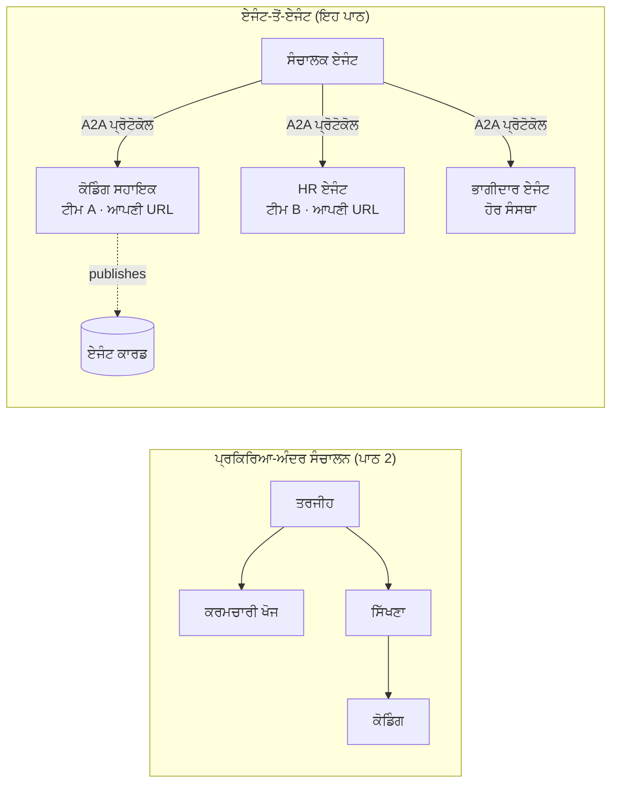

# ਪਾਠ 7: ਬਹੁ-ਏਜੰਟ ਸੰਚਾਲਨ ਅਤੇ ਏਜੰਟ-ਤੋਂ-ਏਜੰਟ (A2A)

[ਪਾਠ 6](../lesson-6-toolbox/README.md) ਰਾਹੀਂ ਤੁਸੀਂ ਸ਼ਾਸਨਯੁਕਤ ਟੂਲ ਅਤੇ ਹੋਸਟ ਕੀਤੇ ਏਜੰਟ ਬਣਾਉ ਸਕਦੇ ਹੋ।
ਪਰ ਅਸਲ ਸਿਸਟਮ ਅਕਸਰ **ਇੱਕ** ਏਜੰਟ ਹੀ ਨਹੀਂ ਵਰਤਦੇ। ਜਿਵੇਂ ਤੁਸੀਂ ਸਕੇਲ ਕਰਦੇ ਹੋ, ਤੁਸੀਂ **ਕਈ** ਏਜੰਟ ਜੋੜਦੇ ਹੋ — ਕੁਝ
ਤੁਹਾਡੇ ਹਨ, ਕੁਝ ਹੋਰ ਟੀਮਾਂ ਦੇ ਹਨ, ਕੁਝ ਪੂਰੀ ਤਰ੍ਹਾਂ ਹੋਰ ਸੰਸਥਾਵਾਂ ਵਿੱਚ ਚੱਲ ਰਹੇ ਹਨ। ਇਹ ਪਾਠ ਬਾਰੇ ਹੈ
ਕਿ ਏਜੰਟ ਇਕੱਠੇ ਕਿਵੇਂ ਕੰਮ ਕਰਦੇ **ਹਨ**।

ਤੁਸੀਂ ਪਹਿਲਾਂ ਹੀ ਬਹੁ-ਏਜੰਟ ਡਿਜ਼ਾਈਨ ਦਾ ਇੱਕ ਰੂਪ ਮਿਲਿਆ ਸੀ
[ਪਾਠ 2 ਦਾ `agent-orchestration.py`](../lesson-2-agent-development/README.md): the **handoff**
ਨਮੂਨਾ, ਜਿੱਥੇ ਇੱਕ ਟ੍ਰਿਆਜ ਏਜੰਟ ਇੱਕ ਹੀ ਪ੍ਰੋਸੈੱਸ ਦੇ ਅੰਦਰ ਵਿਸ਼ੇਸ਼ਜਾਂ ਵੱਲ ਰੂਟ ਕਰਦਾ ਹੈ। ਇਹ ਪਾਠ ਇੱਕ
ਪੱਧਰ ਉੱਪਰ — **Agent-to-Agent (A2A)**, ਉਹ ਖੁੱਲਾ ਪ੍ਰੋਟੋਕੋਲ ਜਿਸ ਲਈ ਏਜੰਟ ਅਜ਼ਾਦ
**ਨੈੱਟਵਰਕ ਸੇਵਾਵਾਂ** ਵਜੋਂ ਚਲਦੇ ਹਨ ਅਤੇ ਪ੍ਰੋਸੈਸ, ਟੀਮ, ਅਤੇ ਸੰਸਥਾਨਕ ਸਰਹੱਦਾਂ ਦੇ ਪਾਰ ਇਕ ਦੂਜੇ ਨੂੰ ਕਾਲ ਕਰਦੇ ਹਨ।

## ਸਿੱਖਣ ਦੇ ਉਦੇਸ਼

ਇਸ ਪਾਠ ਦੇ ਅੰਤ ਤੱਕ ਤੁਸੀਂ ਸਮਰੱਥ ਹੋਵੋਗੇ:

- ਵਿਆਖਯਾ ਕਰੋ ਕਿ **ਇਨ-ਪ੍ਰੋਸੈੱਸ ਸੰਚਾਲਨ** (handoff/workflows) ਅਤੇ
  **Agent-to-Agent (A2A)** ਸੰਚਾਰ ਵਿੱਚ ਕੀ ਫਰਕ ਹੈ, ਅਤੇ ਸਹੀ ਚੋਣ ਕਰੋ।
- A2A ਦੇ ਨਿਰਮਾਣ ਭਾਗ ਵਰਣਨ ਕਰੋ: **ਏਜੰਟ ਕਾਰਡ**, **ਕੁਸ਼ਲਤਾਵਾਂ**, **ਟਾਸਕ**, ਅਤੇ **ਖੋਜ**।
- **ਇੱਕ Microsoft Agent Framework ਏਜੰਟ ਨੂੰ `A2AExecutor` ਨਾਲ A2A ਸੇਵਾ ਵਜੋਂ ਪ੍ਰਗਟ ਕਰੋ।**
- **ਇੱਕ ਦੂਰੇ ਏਜੰਟ ਨੂੰ ਨੈੱਟਵਰਕ ਪੀਅਰ ਵਜੋਂ `A2AAgent` ਨਾਲ ਖਪਤ ਕਰੋ।**
- A2A 'ਤੇ ਐਂਟਰਪ੍ਰਾਈਜ਼ ਚਿੰਤਾਵਾਂ ਲਾਗੂ ਕਰੋ: **ਸੁਰੱਖਿਆ, ਪਛਾਣ, ਸ਼ਾਸਨ, ਨਿਰੀਖਣਯੋਗਤਾ, ਅਤੇ ਲਾਗਤ।**

---

## ਪੂਰਵ-ਸ਼ਰਤਾਂ

1. [ਪਾਠ 2](../lesson-2-agent-development/README.md) ਪੂਰਾ ਕੀਤਾ ਹੋਇਆ (ਏਜੰਟ ਵਿਕਾਸ ਅਤੇ ਸੰਚਾਲਨ)।
2. ਇੱਕ **Microsoft Foundry** ਪ੍ਰੋਜੈਕਟ ਜਿਸ ਵਿੱਚ ਮੌਜੂਦਾ ਮਾਡਲ ਡਿਪਲੋਇਮੈਂਟ ਹੋਵੇ (ਉਦਾਹਰਨ ਵਜੋਂ `gpt-5.1`, ਅਤੇ
   `gpt-5-codex` ਕੋਡਿੰਗ ਨਮੂਨੇ ਲਈ). ਰਿਟਾਇਰ ਹੋ ਚੁੱਕੇ GPT-4o / GPT-4.1 ਤੋਂ ਬਚੋ।
3. **Azure CLI** ਪ੍ਰਮਾਣਿਤ: `az login`।
4. **Python 3.12+** ਨਾਲ ਕੋਰਸ ਦੀਆਂ ਡਿਪੈਂਡੇੰਸੀਜ਼ ਇੰਸਟਾਲ ਕੀਤੀਆਂ ਹੋਣ (`pip install -r ../requirements.txt`)।
   ਪਾਠ 7 ਵਿੱਚ ਪ੍ਰੀਵਿਊ `agent-framework-a2a`, `a2a-sdk`, ਅਤੇ `uvicorn` ਪੈਕੇਜ ਸ਼ਾਮਿਲ ਹਨ।
5. `FOUNDRY_PROJECT_ENDPOINT` ਅਤੇ `FOUNDRY_MODEL` ਤੁਹਾਡੇ `.env` ਵਿੱਚ ਸੈੱਟ ਹੋਣ (ਕੋਰਸ README ਵੇਖੋ)।

---

## 1. ਦੋ ਤਰੀਕੇ ਜਿਹਨਾਂ ਨਾਲ ਏਜੰਟ ਇਕੱਠੇ ਕੰਮ ਕਰਦੇ ਹਨ

ਇੱਕੋ "ਬਹੁ-ਏਜੰਟ" ਪੈਟਰਨ ਨਹੀਂ ਹੈ। ਉਹ ਚੁਣੋ ਜੋ ਤੁਹਾਡੀ **ਸੀਮਾ** ਨਾਲ ਮਿਲਦੀ ਹੋਵੇ:

| ਪੈਟਰਨ | ਏਜੰਟ ਕਿੱਥੇ ਚੱਲਦੇ ਹਨ | ਉਹ ਕਿਵੇਂ ਜੁੜਦੇ ਹਨ | ਵਰਤੋਂ ਕਦੋਂ |
|---------|------------------|------------------|----------|
| **ਹੈਂਡਾਫ਼ / ਵਰਕਫਲੋ** (ਪਾਠ 2) | ਇੱਕ ਪ੍ਰੋਸੈੱਸ, ਇੱਕ ਕੋਡਬੇਸ | ਇਨ-ਮੈਮੋਰੀ ਗ੍ਰਾਫ (`HandoffBuilder`, `WorkflowBuilder`) | ਤੁਸੀਂ ਸਾਰੇ ਏਜੰਟਾਂ ਦੇ ਮਾਲਕ ਹੋ ਅਤੇ ਉਹਨਾਂ ਨੂੰ ਇਕੱਠੇ ਡਿਪਲੋਏ ਕਰਦੇ ਹੋ। |
| **Agent-to-Agent (A2A)** (ਇਸ ਪਾਠ) | ਅਲੱਗ ਸੇਵਾਵਾਂ, ਅਲੱਗ ਲਾਈਫਸਾਇਕਲ | HTTP ਉੱਤੇ ਖੁਲਾ **A2A protocol**, **ਏਜੰਟ ਕਾਰਡ** ਰਾਹੀਂ ਖੋਜਯੋਗ | ਏਜੰਟ ਵੱਖ-ਵੱਖ ਟੀਮਾਂ/ਸੰਗਠਨਾਂ ਦੇ ਹੋ ਸਕਦੇ ਹਨ, ਸਵਤੰਤਰ ਤੌਰ 'ਤੇ ਸਕੇਲ ਹੁੰਦੇ ਹਨ, ਜਾਂ ਵੱਖ-ਵੱਖ ਫਰੇਮਵਰਕਾਂ ਵਿੱਚ ਲਿਖੇ ਜਾਂਦੇ ਹਨ। |

ਹੈਂਡਾਫ਼ ਐਪਲੀਕੇਸ਼ਨ ਦੇ ਅੰਦਰ **ਰੂਟਿੰਗ** ਬਾਰੇ ਹੈ। A2A **ਏਜੰਟਾਂ ਨੂੰ
ਆਜ਼ਾਦ ਸੇਵਾਵਾਂ ਵਜੋਂ ਰਚਨਾ** ਬਾਰੇ ਹੈ — ਫੰਕਸ਼ਨ ਕਾਲਾਂ ਤੋਂ ਮਾਈਕ੍ਰੋਸੇਵਾਵਾਂ ਵੱਲ ਜਾਣ ਦਾ ਏਜੰਟ ਸਮਕੱਖ।



> **ਉਹ ਜੋੜਦੇ ਹਨ।** `HandoffBuilder` ਨਾਲ ਤੁਸੀਂ ਬਣਾਇਆ ਇੱਕ ਸੰਚਾਲਕ **ਦੂਰਲੇ A2A ਏਜੰਟ**
> ਨੂੰ ਭਾਗੀਦਾਰਾਂ ਵਜੋਂ ਰੱਖ ਸਕਦਾ ਹੈ — ਪ੍ਰੋਸੈੱਸ ਅੰਦਰ ਰੂਟਿੰਗ ਉਹਨਾਂ ਸੇਵਾਵਾਂ ਵੱਲ ਜੋ ਖੁਦ ਕਿਤੇ ਵੀ ਚਲਦੀਆਂ ਹਨ।

---

## 2. A2A ਦੇ ਆਧਾਰਭੂਤ ਹਿੱਸੇ

A2A ਇੱਕ **ਖੁੱਲਾ ਪ੍ਰੋਟੋਕੋਲ** ਹੈ (Microsoft-ਖਾਸ ਨਹੀਂ), ਇਸ ਲਈ ਇੱਕ A2A ਏਜੰਟ ਨੂੰ Microsoft
Agent Framework, LangGraph, custom code, ਜਾਂ ਕਿਸੇ ਹੋਰ ਕੰਪਨੀ ਦੇ ਸਟੈਕ ਦੁਆਰਾ ਖਪਤ ਕੀਤਾ ਜਾ ਸਕਦਾ ਹੈ। ਚਾਰ ਧਾਰਨਾਵਾਂ ਮਹੱਤਵ ਰੱਖਦੀਆਂ ਹਨ:

- **ਏਜੰਟ ਕਾਰਡ** — ਇੱਕ ਛੋਟਾ JSON ਦਸਤਾਵੇਜ਼, ਪ੍ਰਕਾਸ਼ਿਤ ਕੀਤਾ ਜਾਂਦਾ ਹੈ
  `/.well-known/agent-card.json`, ਜੋ ਏਜੰਟ ਦੇ **ਨਾਮ, ਵੇਰਵਾ, URL, ਵਰਜ਼ਨ,
  ਕੁਸ਼ਲਤਾਵਾਂ, ਅਤੇ ਸਮਰੱਥਾਵਾਂ** ਨੂੰ ਵਿਗਿਆਪਿਤ ਕਰਦਾ ਹੈ। ਇਹ ਹੀ ਤਰੀਕਾ ਹੈ ਜਿਸ ਨਾਲ ਇੱਕ ਕਲਾਇੰਟ **ਪਤਾ ਲਗਾਉਂਦਾ ਹੈ** ਕਿ ਦੂਰਾ ਏਜੰਟ ਕੀ ਕਰ ਸਕਦਾ ਹੈ।
- **ਕੁਸ਼ਲਤਾਵਾਂ (Skills)** — ਏਜੰਟ ਵੱਲੋਂ ਘੋਸ਼ਿਤ ਕੀਤੀਆਂ ਗਈਆਂ ਚੀਜ਼ਾਂ (`id`, `name`, `description`, `tags`,
  `examples`). ਕਲਾਇੰਟ (ਅਤੇ ਮਾਡਲ) ਇਹਨਾਂ ਨੂੰ ਇਹ ਫੈਸਲਾ ਕਰਨ ਲਈ ਵਰਤਦੇ ਹਨ ਕਿ ਕੀ ਇਹਨੂੰ ਕਾਲ ਕਰਨਾ ਚਾਹੀਦਾ ਹੈ।
- **ਟਾਸਕ (Tasks)** — ਇੱਕ A2A ਏਜੰਟ ਨੂੰ ਕੀਤੀ ਕਾਲ ਇੱਕ **ਟਾਸਕ** ਹੁੰਦੀ ਹੈ ਜਿਸਦਾ ਲਾਈਫਸਾਇਕਲ (submitted → working →
  completed/failed)। ਸਰਵਰ ਟਾਸਕਾਂ ਨੂੰ ਇੱਕ **ਟਾਸਕ ਸਟੋਰ** ਵਿੱਚ ਟ੍ਰੈਕ ਕਰਦਾ ਹੈ; ਸਟ੍ਰੀਮਿੰਗ ਅਪਡੇਟਸ ਸਹਿ-ਸਮਰਥਿਤ ਹਨ।
- **ਖੋਜ (Discovery)** — ਇੱਕ ਕਲਾਇੰਟ ਜਿਸਨੂੰ ਸਿਰਫ਼ ਇੱਕ URL ਦਿੱਤਾ ਗਿਆ ਹੋਵੇ, ਉਹ ਏਜੰਟ ਕਾਰਡ ਫੈਚ ਕਰਦਾ ਹੈ ਅਤੇ ਜਾਣਦਾ ਹੈ ਕਿ ਏਜੰਟ ਨੂੰ ਕਿਵੇਂ ਕਾਲ ਕਰਨਾ ਹੈ।

---

## 3. ਇੱਕ ਏਜੰਟ ਨੂੰ A2A ਸੇਵਾ ਵਜੋਂ ਪ੍ਰਗਟ ਕਰੋ — `a2a_server.py`

The **Build/serve** ਪਾਸਾ ਕਿਸੇ ਵੀ Microsoft Agent Framework ਏਜੰਟ ਨੂੰ `A2AExecutor` ਨਾਲ ਰੈਪ ਕਰਦਾ ਹੈ ਅਤੇ ਇਸਨੂੰ
ਇੱਕ A2A HTTP ਐਪਲੀਕੇਸ਼ਨ 'ਤੇ ਮਾਊਂਟ ਕਰਦਾ ਹੈ। ਵੇਖੋ [`a2a_server.py`](../../../lesson-7-multi-agent-a2a/a2a_server.py)। ਮੁੱਖ ਵਾਇਰਿੰਗ:

```python
from agent_framework.a2a import A2AExecutor
from a2a.server.apps import A2AStarletteApplication
from a2a.server.request_handlers import DefaultRequestHandler
from a2a.server.tasks import InMemoryTaskStore
from a2a.types import AgentCapabilities, AgentCard, AgentSkill

agent = client.as_agent(name="coding-assistant", instructions="...")

agent_card = AgentCard(
    name="Coding Assistant",
    description="Generates runnable code samples...",
    url="http://localhost:9000/",
    version="1.0.0",
    capabilities=AgentCapabilities(streaming=True),
    default_input_modes=["text"],
    default_output_modes=["text"],
    skills=[AgentSkill(id="generate-code", name="Generate code",
                       description="Write a runnable code snippet.", tags=["code"])],
)

request_handler = DefaultRequestHandler(
    agent_executor=A2AExecutor(agent),
    task_store=InMemoryTaskStore(),
)
app = A2AStarletteApplication(agent_card=agent_card, http_handler=request_handler).build()
# uvicorn ਨਾਲ ਪੋਰਟ 9000 ਤੇ ਸਰਵ ਕੀਤਾ ਗਿਆ
```

ਨੋਟ ਕਰੋ ਕਿ ਏਜੰਟ ਕੋਡ **ਅਪਰਿਵਰਤਿਤ** ਹੈ — `A2AExecutor` ਤੁਹਾਡੇ ਮੌਜੂਦਾ ਏਜੰਟ ਨੂੰ ਪ੍ਰੋਟੋਕੋਲ ਲਈ ਅਡੈਪਟ ਕਰਦਾ ਹੈ।
ਏਜੰਟ ਕਾਰਡ ਹੀ ਇਸਨੂੰ ਕਿਸੇ ਵੀ A2A ਕਲਾਇੰਟ ਲਈ **ਖੋਜਯੋਗ** ਬਣਾਉਂਦਾ ਹੈ।

---

## 4. ਇੱਕ ਦੂਰੇ ਏਜੰਟ ਨੂੰ ਖਪਤ ਕਰੋ — `a2a_client.py`

The **Consume** ਪਾਸਾ ਇੱਕ ਦੂਰੇ ਏਜੰਟ ਨਾਲ **URL ਰਾਹੀਂ** ਜੁੜਦਾ ਹੈ, ਉਸਦਾ ਏਜੰਟ ਕਾਰਡ ਫੈਚ ਕਰਦਾ ਹੈ, ਅਤੇ ਇਸਨੂੰ
ਬਿਲਕੁਲ ਇੱਕ ਲੋਕਲ ਏਜੰਟ ਵਾਂਗ ਕਾਲ ਕਰਦਾ ਹੈ। ਵੇਖੋ [`a2a_client.py`](../../../lesson-7-multi-agent-a2a/a2a_client.py):

```python
from agent_framework.a2a import A2AAgent

remote_agent = A2AAgent(name="remote-coding-assistant", url="http://localhost:9000")
result = await remote_agent.run("Write a Python function that reverses a string.")
print(result.text)
```

ਇਹੀ A2A ਦੀ ਪੂਰੀ ਮੁੱਖ ਗੱਲ ਹੈ: ਕਾਲ ਕਰਨ ਵਾਲੇ ਦੀ ਇਕ ਪੱਖ ਤੋਂ ਇੱਕ ਦੂਰਾ ਏਜੰਟ ਕਿਸੇ ਵੀ ਹੋਰ
`agent_framework` ਏਜੰਟ ਵਾਂਗ ਵਰਤਦਾ ਹੈ, ਇਸ ਲਈ ਤੁਸੀਂ ਇਸਨੂੰ ਇੱਕ ਵਰਕਫਲੋ ਵਿੱਚ ਪਾ ਸਕਦੇ ਹੋ ਜਾਂ ਇਸਨੂੰ ਹੈਂਡਆਫ਼ ਕਰ ਸਕਦੇ ਹੋ — ਹਾਲਾਂਕਿ ਇਹ ਅਲੱਗ
ਪ੍ਰੋਸੈੱਸ ਵਿੱਚ, ਅਲੱਗ ਮਸ਼ੀਨ 'ਤੇ, ਵੱਖਰੀ ਟੀਮ ਦੁਆਰਾ ਮਾਲਕੀ ਹੋ ਸਕਦਾ ਹੈ।

### ਇਸਨੂੰ ਸ਼ੁਰੂ ਤੋਂ ਅੰਤ ਤੱਕ ਚਲਾਓ

```bash
# Terminal 1 — A2A ਸੇਵਾ ਸ਼ੁਰੂ ਕਰੋ
python a2a_server.py

# Terminal 2 — ਉਸਨੂੰ ਕਾਲ ਕਰੋ
python a2a_client.py "Write a Python function that reverses a string."
```

ਤੁਸੀਂ ਦੇਖੋਗੇ ਕਿ ਕੋਡਿੰਗ ਸਹਾਇਕ ਦਾ ਜਵਾਬ A2A ਪ੍ਰੋਟੋਕੋਲ ਰਾਹੀਂ ਆਉਂਦਾ ਹੈ। ਖੋਲ੍ਹੋ
`http://localhost:9000/.well-known/agent-card.json` ਨੂੰ ਇੱਕ ਬਰਾਊਜ਼ਰ ਵਿੱਚ ਤਾਂ ਜੋ ਪ੍ਰਕਾਸ਼ਿਤ ਏਜੰਟ ਕਾਰਡ ਨੂੰ ਵੇਖ ਸਕੋ।

---

## 5. ਐਂਟਰਪ੍ਰਾਈਜ਼ ਚਿੰਤਾਵਾਂ

ਏਜੰਟਾਂ ਨੂੰ ਨੈੱਟਵਰਕ ਸੇਵਾਵਾਂ ਵਿੱਚ ਬਦਲਣਾ ਕਿਸੇ ਵੀ ਵਿਤਰਿਤ ਸਿਸਟਮ ਵਾਂਗ ਉਹੀ ਚਿੰਤਾਵਾਂ ਲਿਆਉਂਦਾ ਹੈ —
ਅਤੇ ਕੁਝ AI-ਖਾਸ ਚਿੰਤਾਵਾਂ ਵੀ:

- **ਪਛਾਣ ਅਤੇ ਪ੍ਰਮਾਣਿਕਤਾ।** ਕਦੇ ਵੀ ਇੱਕ A2A ਏਜੰਟ ਨੂੰ ਬਿਨਾਂ ਪ੍ਰਮਾਣਿਕਤਾ ਦੇ ਨਾ ਖੋਲ੍ਹੋ। ਏਜੰਟ ਕਾਰਡ `security` / `security_schemes`
  ਸ਼ਾਮਿਲ ਕਰਦਾ ਹੈ, ਅਤੇ `A2AAgent` ਇੱਕ `auth_interceptor` ਸਵੀਕਾਰ ਕਰਦਾ ਹੈ ਤਾਂ ਕਿ ਕਾਲ ਕਰਨ ਵਾਲੇ
  ਕ੍ਰੈਡੇੰਸ਼ਲ (OAuth bearer tokens, API keys) ਜੋੜ ਸਕਣ। ਉਤਪਾਦਨ ਵਿੱਚ ਸੇਵਾ-ਟੂ-ਸੇਵਾ ਪ੍ਰਮਾਣਿਕਤਾ ਲਈ Entra ID / managed identities ਵਰਤੋ;
  ਸੇਵਾ ਨੂੰ ਇੱਕ ਗੇਟਵੇ ਦੇ ਪਿੱਛੇ ਰੱਖੋ।
- **ਸ਼ਾਸਨ।** A2A ਨੂੰ [ਪਾਠ 6 ਦੇ ਟੂਲਬਾਕਸ](../lesson-6-toolbox/README.md) ਨਾਲ ਜੋੜੋ: ਇੱਕ ਦੂਰਾ
  ਏਜੰਟ ਇੱਕ **A2A tool** ਵਜੋਂ ਇੱਕ ਸ਼ਾਸਤਰੀਕ੍ਰਤ ਟੂਲਬਾਕਸ ਦੇ ਅੰਦਰ ਪ੍ਰਕਾਸ਼ਿਤ ਕੀਤਾ ਜਾ ਸਕਦਾ ਹੈ ਤਾਂ ਜੋ RBAC, credential injection,
  ਅਤੇ guardrail ਨीतੀਆਂ ਕੇਂਦਰੀ ਤੌਰ 'ਤੇ ਲਾਗੂ ਹੋ ਸਕਣ।
- **ਨਿਰੀਖਣਯੋਗਤਾ।** ਹੁਣ ਇੱਕ ਰਿਕਵੈਸਟ ਪ੍ਰੋਸੈੱਸ ਸਰਹੱਦਾਂ ਨੂੰ ਪਾਰ ਕਰਦੀ ਹੈ, ਇਸ ਲਈ ਕਾਲ ਦੇ ਪਾਰ ਟ੍ਰੇਸਿੰਗ ਨੂੰ ਪ੍ਰਸਾਰਿਤ ਕਰੋ।
  [Foundry Observability / OpenTelemetry](../lesson-3-agent-evals/README.md) ਨੂੰ **ਦੋਹਾਂ**
  ਸੰਚਾਲਕ ਅਤੇ ਹਰ ਦੂਰੇ ਏਜੰਟ 'ਤੇ ਚਾਲੂ ਕਰੋ ਤਾਂ ਜੋ ਤੁਹਾਨੂੰ ਇੱਕ ਐਂਡ-ਟੂ-ਐਂਡ ਟਰੇਸ ਮਿਲੇ।
- **ਵਰਜ਼ਨਿੰਗ।** ਏਜੰਟ ਕਾਰਡ ਵਿੱਚ ਇੱਕ `version` ਹੁੰਦਾ ਹੈ। ਇਸਨੂੰ ਇੱਕ API ਵਾਂਗ ਵਤੋਂ ਦੇਖੋ: ਜੋੜੀਵਾਲੇ ਬਦਲਾਅ ਸੁਰੱਖਿਅਤ ਹਨ;
  ਕਿਸੇ ਸਕਿਲ ਦੇ ਕਾਂਟ੍ਰੈਕਟ ਨੂੰ ਤੋੜਨਾ ਨਵੀਂ ਵਰਜ਼ਨ ਦੀ ਲੋੜ ਕਰਦਾ ਹੈ ਅਤੇ ਉਪਭੋਗਤਾਵਾਂ ਲਈ ਮਾਈਗ੍ਰੇਸ਼ਨ ਵਿੰਡੋ ਦੀ ਲੋੜ ਹੋਣੀ ਚਾਹੀਦੀ ਹੈ।
- **ਭਰੋਸੇਯੋਗਤਾ।** ਦੂਰਲੇ ਏਜੰਟ ਅਲੱਗ-ਅਲੱਗ ਢੰਗ ਨਾਲ ਫੇਲ ਹੁੰਦੇ ਹਨ। ਟਾਈਮਆਉਟ ਸੈੱਟ ਕਰੋ (`A2AAgent(timeout=...)`), ਸੰਭਾਲੋ
  ਅੰਸ਼ਿਕ ਅਸਫਲਤਾ, ਅਤੇ ਇੱਕ ਹੌਲੀ ਪੀਅਰ ਨੂੰ ਸਾਰੀ ਸੰਚਾਲਨਾ ਨੂੰ ਬਲੌਕ ਕਰਨ ਨਾ ਦਿਓ।
- **ਲਾਗਤ।** ਹਰ ਦੂਰੇ ਏਜੰਟ ਦੀ ਕਾਲ ਆਪਣੀ ਮਾਡਲ ਇੰਵੋਕੇਸ਼ਨ ਹੁੰਦੀ ਹੈ। ਫੈਨ-ਆਊਟ ਟੋਕਨ ਖਰਚ ਨੂੰ ਗੁਣਾ ਕਰਦਾ ਹੈ —
  ਇਸ ਲਈ ਬਜਟ ਰੱਖੋ, ਅਤੇ ਬਹੁਤਾਂ ਨੂੰ ਬਰਾਡਕਾਸਟ ਕਰਨ ਦੇ ਬਦਲੇ **ਇੱਕ** ਸਭ ਤੋਂ ਵਧੀਆ ਏਜੰਟ ਨੂੰ ਰੂਟ ਕਰਨ ਨੂੰ ਤਰਜੀਹ ਦਿਓ।

---

## ਹੱਥ-ਉੱਤੇ ਅਭਿਆਸ

1. **ਇਕ ਦੂਜੀ ਸੇਵਾ ਜੋੜੋ।** `a2a_server.py` ਨੂੰ ਨਕਲ ਕਰੋ ਤਾਂ ਜੋ **employee-search** ਏਜੰਟ ਨੂੰ ਪੋਰਟ
   9001 ਤੇ ਆਪਣੇ ਨਿੱਜੀ ਏਜੰਟ ਕਾਰਡ ਅਤੇ ਕੁਸ਼ਲਤਾਵਾਂ ਨਾਲ ਪ੍ਰਗਟ ਕਰੋ। ਦੋਹਾਂ ਚਲਾਓ, ਅਤੇ ਇੱਕ ਕਲਾਇੰਟ ਹਰ ਇੱਕ ਨੂੰ ਕਾਲ ਕਰਵਾਓ।
2. **ਦੂਰਲੇ ਪੀਅਰਾਂ ਨੂੰ ਸੰਚਾਲਿਤ ਕਰੋ।** ਇੱਕ ਛੋਟਾ `HandoffBuilder` ਬਣਾਓ (ਜਾਂ ਸਾਦਾ ਰਾਊਟਰ) ਜਿਸਦੇ ਭਾਗੀਦਾਰ
   ਦੋ `A2AAgent`s ਸ਼ਾਮਿਲ ਕਰਨ ਜੋ ਤੁਹਾਡੇ ਦੋ ਸੇਵਾਵਾਂ ਵੱਲ ਇਸ਼ਾਰਾ ਕਰਦੇ ਹਨ। ਇੱਕ ਪ੍ਰਸ਼ਨ ਨੂੰ ਸਹੀ ਏਜੰਟ ਵੱਲ ਰੂਟ ਕਰੋ।
3. **ਇਸਨੂੰ ਸੁਰੱਖਿਅਤ ਕਰੋ।** ਕਲਾਇੰਟ 'ਤੇ ਇੱਕ `auth_interceptor` ਸ਼ਾਮਿਲ ਕਰੋ ਅਤੇ ਸਰਵਰ 'ਤੇ ਇੱਕ bearer token ਦੀ ਲੋੜ ਰੱਖੋ।
   ਜੇ ਟੋਕਨ ਗਾਇਬ ਹੋਵੇ ਤਾਂ ਕੀ ਟੁੱਟਦਾ ਹੈ? ਉਤਪਾਦਨ ਵਿੱਚ ਤੁਸੀਂ ਟੋਕਨ ਕਿੱਥੇ ਸਟੋਰ ਕਰੋਗੇ?
4. **ਹੈਂਡਾਫ਼ ਵਿਰੁੱਧ A2A.** ਦੋ ਛੋਟੇ ਪੈਰਾਗ੍ਰਾਫ ਲਿਖੋ: ਤੁਸੀਂ ਕਦੋਂ ਪਾਠ 2 ਦਾ ਇਨ-ਪ੍ਰੋਸੈੱਸ ਹੈਂਡਾਫ਼ ਰੱਖੋਗੇ
   ਅਤੇ A2A ਦੀ ਵਧੇਰੀ ਜਟਿਲਤਾ ਕਦੋਂ ਜਾਇਜ਼ ਹੋਵੇਗੀ? ਹਰ ਇੱਕ ਦੀ ਇੱਕ ਠੋਸ ਉਦਾਹਰਨ ਦਿਓ।

---

## ਸਰੋਤ

- [ਏਜੰਟ-ਤੋਂ-ਏਜੰਟ (A2A) — Microsoft Agent Framework](https://learn.microsoft.com/agent-framework/user-guide/agent-orchestration/a2a)
- [ਬਹੁ-ਏਜੰਟ ਸੰਚਾਲਨ — Microsoft Agent Framework](https://learn.microsoft.com/agent-framework/user-guide/agent-orchestration/)
- [A2A ਪ੍ਰੋਟੋਕੋਲ ਵਿਸ਼ੇਸ਼ਣ](https://a2a-protocol.org/)
- [A2A Python SDK (`a2a-sdk`)](https://github.com/a2aproject/a2a-python)
- [Foundry Agent Service — ਬਹੁ-ਏਜੰਟ ਪੈਟਰਨ](https://learn.microsoft.com/azure/ai-foundry/agents/concepts/connected-agents)

---

**ਪਿਛਲਾ:** [ਪਾਠ 6 — Microsoft Toolbox](../lesson-6-toolbox/README.md)

---

<!-- CO-OP TRANSLATOR DISCLAIMER START -->
**ਅਸਵੀਕਾਰੋਪਣ**:
ਇਸ ਦਸਤਾਵੇਜ਼ ਦਾ ਅਨੁਵਾਦ ਏਆਈ ਅਨੁਵਾਦ ਸੇਵਾ [Co-op Translator](https://github.com/Azure/co-op-translator) ਦੀ ਵਰਤੋਂ ਕਰਕੇ ਕੀਤਾ ਗਿਆ ਹੈ। ਜਦੋਂ ਕਿ ਅਸੀਂ ਸਹੀਤਾਵਾਂ ਲਈ ਯਤਨਸ਼ੀਲ ਹਾਂ, ਕਿਰਪਾ ਕਰਕੇ ਧਿਆਨ ਰੱਖੋ ਕਿ ਸਵੈਚਾਲਿਤ ਅਨੁਵਾਦਾਂ ਵਿੱਚ ਗਲਤੀਆਂ ਜਾਂ ਅਸਮੱਤਿਆਵਾਂ ਹੋ ਸਕਦੀਆਂ ਹਨ। ਮੂਲ ਦਸਤਾਵੇਜ਼ ਆਪਣੀ ਮੂਲ ਭਾਸ਼ਾ ਵਿੱਚ ਅਧਿਕਾਰਕ ਸਰੋਤ ਮੰਨਿਆ ਜਾਣਾ ਚਾਹੀਦਾ ਹੈ। ਜਰੂਰੀ ਜਾਣਕਾਰੀ ਲਈ, ਪੇਸ਼ੇਵਰ ਮਨੁੱਖੀ ਅਨੁਵਾਦ ਦੀ ਸਿਫ਼ਾਰਸ਼ ਕੀਤੀ ਜਾਂਦੀ ਹੈ। ਅਸੀਂ ਇਸ ਅਨੁਵਾਦ ਦੇ ਉਪਯੋਗ ਤੋਂ ਪੈਦਾ ਹੋਣ ਵਾਲੀਆਂ ਕਿਸੇ ਵੀ ਗਲਤਫਹਿਮੀਆਂ ਜਾਂ ਗਲਤ ਵਿਆਖਿਆਵਾਂ ਲਈ ਜਵਾਬਦੇਹ ਨਹੀਂ ਹਾਂ।
<!-- CO-OP TRANSLATOR DISCLAIMER END -->