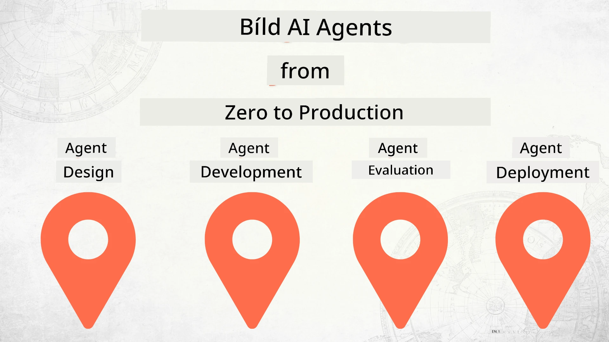

# Building AI Agents from Zero to Production



### 🌐 Multi-Language Support

#### Supported via GitHub Action (Automated & Always Up-to-Date)

<!-- CO-OP TRANSLATOR LANGUAGES TABLE START -->
[Arabic](../ar/README.md) | [Bengali](../bn/README.md) | [Bulgarian](../bg/README.md) | [Burmese (Myanmar)](../my/README.md) | [Chinese (Simplified)](../zh-CN/README.md) | [Chinese (Traditional, Hong Kong)](../zh-HK/README.md) | [Chinese (Traditional, Macau)](../zh-MO/README.md) | [Chinese (Traditional, Taiwan)](../zh-TW/README.md) | [Croatian](../hr/README.md) | [Czech](../cs/README.md) | [Danish](../da/README.md) | [Dutch](../nl/README.md) | [Estonian](../et/README.md) | [Finnish](../fi/README.md) | [French](../fr/README.md) | [German](../de/README.md) | [Greek](../el/README.md) | [Hebrew](../he/README.md) | [Hindi](../hi/README.md) | [Hungarian](../hu/README.md) | [Indonesian](../id/README.md) | [Italian](../it/README.md) | [Japanese](../ja/README.md) | [Kannada](../kn/README.md) | [Korean](../ko/README.md) | [Lithuanian](../lt/README.md) | [Malay](../ms/README.md) | [Malayalam](../ml/README.md) | [Marathi](../mr/README.md) | [Nepali](../ne/README.md) | [Nigerian Pidgin](./README.md) | [Norwegian](../no/README.md) | [Persian (Farsi)](../fa/README.md) | [Polish](../pl/README.md) | [Portuguese (Brazil)](../pt-BR/README.md) | [Portuguese (Portugal)](../pt-PT/README.md) | [Punjabi (Gurmukhi)](../pa/README.md) | [Romanian](../ro/README.md) | [Russian](../ru/README.md) | [Serbian (Cyrillic)](../sr/README.md) | [Slovak](../sk/README.md) | [Slovenian](../sl/README.md) | [Spanish](../es/README.md) | [Swahili](../sw/README.md) | [Swedish](../sv/README.md) | [Tagalog (Filipino)](../tl/README.md) | [Tamil](../ta/README.md) | [Telugu](../te/README.md) | [Thai](../th/README.md) | [Turkish](../tr/README.md) | [Ukrainian](../uk/README.md) | [Urdu](../ur/README.md) | [Vietnamese](../vi/README.md)

> **Prefer to Clone Locally?**

> Dis repository get 50+ language translations wey go make di download size big. To clone without di translations, use sparse checkout:
> ```bash
> git clone --filter=blob:none --sparse https://github.com/microsoft/Building-AI-Agents-From-Zero-To-Production.git
> cd Building-AI-Agents-From-Zero-To-Production
> git sparse-checkout set --no-cone '/*' '!translations' '!translated_images'
> ```
> Dis one go give you all wey you need to finish di course plus much faster download.
<!-- CO-OP TRANSLATOR LANGUAGES TABLE END -->

## A course teaching you the fundamentals of the AI Agent Developement Lifecycle

[](https://github.com/microsoft/Building-AI-Agents-From-Zero-To-Production/blob/master/LICENSE?WT.mc_id=academic-105485-koreyst)
[](https://GitHub.com/microsoft/Building-AI-Agents-From-Zero-To-Production/graphs/contributors/?WT.mc_id=academic-105485-koreyst)
[](https://GitHub.com/microsoft/Building-AI-Agents-From-Zero-To-Production/issues/?WT.mc_id=academic-105485-koreyst)
[](https://GitHub.com/microsoft/Building-AI-Agents-From-Zero-To-Production/pulls/?WT.mc_id=academic-105485-koreyst)
[](http://makeapullrequest.com?WT.mc_id=academic-105485-koreyst)

[](https://discord.gg/Kuaw3ktsu6)

## 🌱 Getting Started

Dis course get lessons wey dey cover di fundamentals of how to build and deploy AI Agents.

Each lesson dey build on top the one wey come before am, so we recommend say begin from di start and waka your way reach di end.

If you want explore more about AI Agent tori, you fit check di [AI Agents For Beginners Course](https://aka.ms/ai-agents-beginners).

### Meet Other Learners, Get Your Questions Answered

If you jam problem or get any question about how to build AI Agents, join our dedicated Discord Channel for di [Microsoft Foundry Discord](https://discord.gg/Kuaw3ktsu6).

### What You Need

Each Lesson get e own code sample wey you fit run for your local machine. You fit [fork dis repo](https://github.com/microsoft/Building-AI-Agents-From-Zero-To-Production/fork) make you get your own copy.

Dis course dey use these ones now:

- [Microsoft Agent Framework (MAF)](https://aka.ms/ai-agents-beginners/agent-framework)
- [Microsoft Foundry](https://azure.microsoft.com/products/ai-foundry)
- [Azure OpenAI Service](https://azure.microsoft.com/products/ai-foundry/models/openai)
- [Azure CLI](https://learn.microsoft.com/cli/azure/authenticate-azure-cli?view=azure-cli-latest)

Make sure say you get access to these services before you start.

More options about model hosting and services go soon come.

## 🗃️ Lessons

| **Lesson**         | **Description**                                                                                  |
|--------------------|--------------------------------------------------------------------------------------------------|
| [Agent Design](./lesson-1-agent-design/README.md)       | Introduction to our "Developer Onboarding" Agent Use Case and how to design effective agents  |
| [Agent Development](./lesson-2-agent-development/README.md)  | Using the Microsoft Agent Framework (MAF), create 3 agents to help new developers onboard.       |
| [Agent Evaluations](./lesson-3-agent-evals/README.md)  | Using Microsoft Foundry, check how well our AI Agents dey perform and how to make dem better. |
| [Agent Deployment](./lesson-4-agent-deployment/README.md)   | Using the Hosted Agents and OpenAI Chatkit, see how to deploy an AI Agent for production.       |


## 🎒 Other Courses

Our team dey produce other courses! Check am out:

<!-- CO-OP TRANSLATOR OTHER COURSES START -->
### LangChain
[](https://aka.ms/langchain4j-for-beginners)
[](https://aka.ms/langchainjs-for-beginners?WT.mc_id=m365-94501-dwahlin)
[](https://github.com/microsoft/langchain-for-beginners?WT.mc_id=m365-94501-dwahlin)
---

### Azure / Edge / MCP / Agents
[](https://github.com/microsoft/AZD-for-beginners?WT.mc_id=academic-105485-koreyst)
[](https://github.com/microsoft/edgeai-for-beginners?WT.mc_id=academic-105485-koreyst)
[](https://github.com/microsoft/mcp-for-beginners?WT.mc_id=academic-105485-koreyst)
[](https://github.com/microsoft/ai-agents-for-beginners?WT.mc_id=academic-105485-koreyst)

---
 
### Generative AI Series
[](https://github.com/microsoft/generative-ai-for-beginners?WT.mc_id=academic-105485-koreyst)
[-9333EA?style=for-the-badge&labelColor=E5E7EB&color=9333EA)](https://github.com/microsoft/Generative-AI-for-beginners-dotnet?WT.mc_id=academic-105485-koreyst)
[-C084FC?style=for-the-badge&labelColor=E5E7EB&color=C084FC)](https://github.com/microsoft/generative-ai-for-beginners-java?WT.mc_id=academic-105485-koreyst)
[-E879F9?style=for-the-badge&labelColor=E5E7EB&color=E879F9)](https://github.com/microsoft/generative-ai-with-javascript?WT.mc_id=academic-105485-koreyst)

---
 
### Core Learning
[](https://aka.ms/ml-beginners?WT.mc_id=academic-105485-koreyst)
[](https://aka.ms/datascience-beginners?WT.mc_id=academic-105485-koreyst)
[](https://aka.ms/ai-beginners?WT.mc_id=academic-105485-koreyst)
[](https://github.com/microsoft/Security-101?WT.mc_id=academic-96948-sayoung)
[](https://aka.ms/webdev-beginners?WT.mc_id=academic-105485-koreyst)
[](https://aka.ms/iot-beginners?WT.mc_id=academic-105485-koreyst)
[](https://github.com/microsoft/xr-development-for-beginners?WT.mc_id=academic-105485-koreyst)

---
 
### Copilot Series
[](https://aka.ms/GitHubCopilotAI?WT.mc_id=academic-105485-koreyst)
[](https://github.com/microsoft/mastering-github-copilot-for-dotnet-csharp-developers?WT.mc_id=academic-105485-koreyst)
[](https://github.com/microsoft/CopilotAdventures?WT.mc_id=academic-105485-koreyst)
<!-- CO-OP TRANSLATOR OTHER COURSES END -->

## Contributing

Dis projek dey welcome contributions an suggestions. Most contributions dem need say you agree to one
Contributor License Agreement (CLA) wey talk say you get di right, an you really go,
giva us di rights to use your contribution. For details, visit <https://cla.opensource.microsoft.com>.

When you submit one pull request, CLA bot go automatically check if you need to provide
one CLA an arrange di PR correct (example, status check, comment). Just follow di instructions
wey di bot give. You only go need do dis one time for all repos wey dey use our CLA.

Dis projek don adopt di [Microsoft Open Source Code of Conduct](https://opensource.microsoft.com/codeofconduct/).
For more info see di [Code of Conduct FAQ](https://opensource.microsoft.com/codeofconduct/faq/) or
contact [opencode@microsoft.com](mailto:opencode@microsoft.com) if you get any other questions or comments.

## Trademarks

Dis projek fit get trademarks or logos for projects, products, or services. Authorized use of Microsoft
trademarks or logos need to follow
[Microsoft's Trademark & Brand Guidelines](https://www.microsoft.com/legal/intellectualproperty/trademarks/usage/general).
To use Microsoft trademarks or logos for changed versions of dis projek must no cause confusion or mean say
Microsoft dey sponsor am.
Any use of third-party trademarks or logos dey subject to di policies of dem third-parties.

## Getting Help

If you jam gbege or get any questions about how to build AI apps, join:

[](https://discord.gg/Kuaw3ktsu6)

If you get product feedback or errors while you dey build, visit:

[](https://aka.ms/foundry/forum)

---

<!-- CO-OP TRANSLATOR DISCLAIMER START -->
**Disclaimer**:  
Dis document na AI translation service [Co-op Translator](https://github.com/Azure/co-op-translator) we use translate am. Even though we dey try make am correct, abeg sabi say automated translation fit get some mistakes or no too correct. The original document wey dem write for e original language na the correct one. If na serious matter, e better make person wey sabi human translation do am. We no go take responsibility for any wrong understanding or confusion wey fit come from this translation.
<!-- CO-OP TRANSLATOR DISCLAIMER END -->