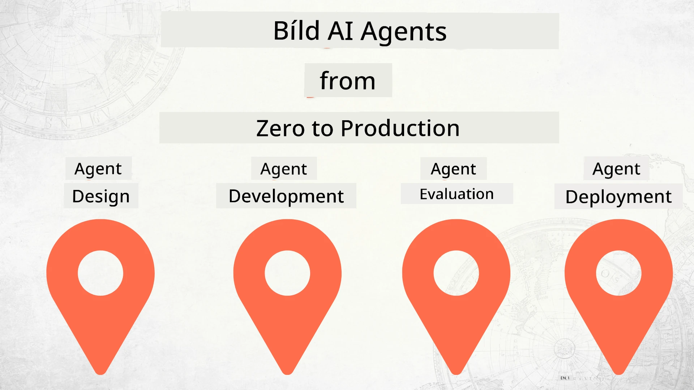

# Building AI Agents from Zero to Production



### 🌐 Multi-Language Support

#### Supported via GitHub Action (Automated & Always Up-to-Date)

<!-- CO-OP TRANSLATOR LANGUAGES TABLE START -->
[Arabic](../ar/README.md) | [Bengali](../bn/README.md) | [Bulgarian](../bg/README.md) | [Burmese (Myanmar)](../my/README.md) | [Chinese (Simplified)](../zh-CN/README.md) | [Chinese (Traditional, Hong Kong)](../zh-HK/README.md) | [Chinese (Traditional, Macau)](../zh-MO/README.md) | [Chinese (Traditional, Taiwan)](../zh-TW/README.md) | [Croatian](../hr/README.md) | [Czech](../cs/README.md) | [Danish](../da/README.md) | [Dutch](../nl/README.md) | [Estonian](../et/README.md) | [Finnish](../fi/README.md) | [French](../fr/README.md) | [German](../de/README.md) | [Greek](../el/README.md) | [Hebrew](../he/README.md) | [Hindi](../hi/README.md) | [Hungarian](../hu/README.md) | [Indonesian](../id/README.md) | [Italian](../it/README.md) | [Japanese](../ja/README.md) | [Kannada](../kn/README.md) | [Khmer](../km/README.md) | [Korean](../ko/README.md) | [Lithuanian](../lt/README.md) | [Malay](../ms/README.md) | [Malayalam](../ml/README.md) | [Marathi](../mr/README.md) | [Nepali](../ne/README.md) | [Nigerian Pidgin](./README.md) | [Norwegian](../no/README.md) | [Persian (Farsi)](../fa/README.md) | [Polish](../pl/README.md) | [Portuguese (Brazil)](../pt-BR/README.md) | [Portuguese (Portugal)](../pt-PT/README.md) | [Punjabi (Gurmukhi)](../pa/README.md) | [Romanian](../ro/README.md) | [Russian](../ru/README.md) | [Serbian (Cyrillic)](../sr/README.md) | [Slovak](../sk/README.md) | [Slovenian](../sl/README.md) | [Spanish](../es/README.md) | [Swahili](../sw/README.md) | [Swedish](../sv/README.md) | [Tagalog (Filipino)](../tl/README.md) | [Tamil](../ta/README.md) | [Telugu](../te/README.md) | [Thai](../th/README.md) | [Turkish](../tr/README.md) | [Ukrainian](../uk/README.md) | [Urdu](../ur/README.md) | [Vietnamese](../vi/README.md)

> **Prefer to Clone Locally?**
>
> Dis repository get 50+ language translations wey dey make di download size big. To clone without translations, use sparse checkout:
>
> **Bash / macOS / Linux:**
> ```bash
> git clone --filter=blob:none --sparse https://github.com/microsoft/Building-AI-Agents-From-Zero-To-Production.git
> cd Building-AI-Agents-From-Zero-To-Production
> git sparse-checkout set --no-cone '/*' '!translations' '!translated_images'
> ```
>
> **CMD (Windows):**
> ```cmd
> git clone --filter=blob:none --sparse https://github.com/microsoft/Building-AI-Agents-From-Zero-To-Production.git
> cd Building-AI-Agents-From-Zero-To-Production
> git sparse-checkout set --no-cone "/*" "!translations" "!translated_images"
> ```
>
> Dis one go give you everything wey you need to finish di course with faster download.
<!-- CO-OP TRANSLATOR LANGUAGES TABLE END -->

## Course wey go teach you di fundamentals of AI Agent Development Lifecycle

[](https://github.com/microsoft/Building-AI-Agents-From-Zero-To-Production/blob/master/LICENSE?WT.mc_id=academic-105485-koreyst)
[](https://GitHub.com/microsoft/Building-AI-Agents-From-Zero-To-Production/graphs/contributors/?WT.mc_id=academic-105485-koreyst)
[](https://GitHub.com/microsoft/Building-AI-Agents-From-Zero-To-Production/issues/?WT.mc_id=academic-105485-koreyst)
[](https://GitHub.com/microsoft/Building-AI-Agents-From-Zero-To-Production/pulls/?WT.mc_id=academic-105485-koreyst)
[](http://makeapullrequest.com?WT.mc_id=academic-105485-koreyst)

[](https://discord.gg/Kuaw3ktsu6)

## 🌱 How to Start

Dis course get lessons wey cover di basics of building and deploying AI Agents.

Every lesson de build on top di one wey come before, so we recommend make you start from di beginning and waka go till di end.

If you want explore more about AI Agent palava, fit check di [AI Agents For Beginners Course](https://aka.ms/ai-agents-beginners).

### Meet Other Learners, Get Your Questions Answered

If you jam any wahala or get questions about building AI Agents, join our dedicated Discord Channel for di [Microsoft Foundry Discord](https://discord.gg/Kuaw3ktsu6).

### Wetin You Need


Each Lesson get im own code sample wey you fit run for your local machine. You fit [fork this repo](https://github.com/microsoft/Building-AI-Agents-From-Zero-To-Production/fork) to create your own copy.

Dis course dey use dis tins now:

- [Microsoft Agent Framework (MAF)](https://aka.ms/ai-agents-beginners/agent-framework)
- [Microsoft Foundry](https://azure.microsoft.com/products/ai-foundry) — na project wey get deployed **GPT-5 series** model (for example `gpt-5.1`). No use retired GPT-4o / GPT-4.1 models.
- [Azure OpenAI Service](https://azure.microsoft.com/products/ai-foundry/models/openai)
- [Azure CLI](https://learn.microsoft.com/cli/azure/authenticate-azure-cli?view=azure-cli-latest) — sign in with `az login` before you run any sample
- **Python 3.12 or later**

Make sure say you get access to these services before you start.

> **💰 Cost & cleanup.** Di hands-on lessons dey create real Azure resources — one Microsoft Foundry
> project, one model deployment, one vector store, and (for Lessons 4–6) hosted agents and toolboxes.
> Dem fit cause cost while e still dey. When you finish any lesson — or di whole course — delete di
> resources wey you no need again. Di easiest way na to put everything for one dedicated resource
> group and delete di whole group when you don finish:
>
> ```bash
> az group delete --name <your-resource-group> --yes --no-wait
> ```
>
> You fit also delete individual agents, vector stores, and toolboxes from the Foundry portal.

> **Note on models.** Dis course dey serve all models through **Microsoft Foundry**. E no
> dey use *GitHub Models*, wey dem go retire on **July 30, 2026** — Microsoft Foundry na di
> official migration path. If you get old code wey dey call GitHub Models, make you point am to one Foundry
> model deployment instead.

More options on top model hosting and services go show soon.

## 🗃️ Lessons

| **Lesson**         | **Description**                                                                                  |
|--------------------|--------------------------------------------------------------------------------------------------|
| [Agent Design](./lesson-1-agent-design/README.md)       | Na introduction to our "Developer Onboarding" Agent Use Case and how to design better agents  |
| [Agent Development](./lesson-2-agent-development/README.md)  | Using Microsoft Agent Framework (MAF), build set of special agents to help new developers onboard.       |
| [Agent Evaluations](./lesson-3-agent-evals/README.md)  | Using Microsoft Foundry, find out how well our AI Agents dey perform and how to make dem beta. |
| [Agent Deployment](./lesson-4-agentdeployment/README.md)   | Using Microsoft Foundry hosted agents and OpenAI ChatKit, see how to deploy AI Agent for production.       |
| [Production Hosted Agents](./lesson-5-hosted-agents-production/README.md)   | Take hosted agent go enterprise production: Hosted Agents vs Capability Hosts, bring-your-own storage, memory, and governance.       |
| [Microsoft Toolbox](./lesson-6-toolbox/README.md)   | Define tools one time and control dem centrally: build toolbox, use am from agent via one MCP endpoint, and version tools safely.       |
| [Multi-Agent & A2A](./lesson-7-multi-agent-a2a/README.md)   | Arrange agents as networked services: expose agent over open Agent-to-Agent (A2A) protocol and use remote agent as peer.       |


## 🎒 Other Courses

Our team dey produce oda courses! Check am out:

<!-- CO-OP TRANSLATOR OTHER COURSES START -->
### LangChain
[](https://aka.ms/langchain4j-for-beginners)
[](https://aka.ms/langchainjs-for-beginners?WT.mc_id=m365-94501-dwahlin)
[](https://github.com/microsoft/langchain-for-beginners?WT.mc_id=m365-94501-dwahlin)
---

### Azure / Edge / MCP / Agents
[](https://github.com/microsoft/AZD-for-beginners?WT.mc_id=academic-105485-koreyst)
[](https://github.com/microsoft/edgeai-for-beginners?WT.mc_id=academic-105485-koreyst)
[](https://github.com/microsoft/mcp-for-beginners?WT.mc_id=academic-105485-koreyst)
[](https://github.com/microsoft/ai-agents-for-beginners?WT.mc_id=academic-105485-koreyst)

---
 
### Generative AI Series

[](https://github.com/microsoft/generative-ai-for-beginners?WT.mc_id=academic-105485-koreyst)
[-9333EA?style=for-the-badge&labelColor=E5E7EB&color=9333EA)](https://github.com/microsoft/Generative-AI-for-beginners-dotnet?WT.mc_id=academic-105485-koreyst)
[-C084FC?style=for-the-badge&labelColor=E5E7EB&color=C084FC)](https://github.com/microsoft/generative-ai-for-beginners-java?WT.mc_id=academic-105485-koreyst)
[-E879F9?style=for-the-badge&labelColor=E5E7EB&color=E879F9)](https://github.com/microsoft/generative-ai-with-javascript?WT.mc_id=academic-105485-koreyst)

---
 
### Core Learning
[](https://aka.ms/ml-beginners?WT.mc_id=academic-105485-koreyst)
[](https://aka.ms/datascience-beginners?WT.mc_id=academic-105485-koreyst)
[](https://aka.ms/ai-beginners?WT.mc_id=academic-105485-koreyst)
[](https://github.com/microsoft/Security-101?WT.mc_id=academic-96948-sayoung)
[](https://aka.ms/webdev-beginners?WT.mc_id=academic-105485-koreyst)
[](https://aka.ms/iot-beginners?WT.mc_id=academic-105485-koreyst)
[](https://github.com/microsoft/xr-development-for-beginners?WT.mc_id=academic-105485-koreyst)

---
 
### Copilot Series
[](https://aka.ms/GitHubCopilotAI?WT.mc_id=academic-105485-koreyst)
[](https://github.com/microsoft/mastering-github-copilot-for-dotnet-csharp-developers?WT.mc_id=academic-105485-koreyst)
[](https://github.com/microsoft/CopilotAdventures?WT.mc_id=academic-105485-koreyst)
<!-- CO-OP TRANSLATOR OTHER COURSES END -->

## Contributing

Dis projek dey welcome contributions and suggestions. Most contributions require say you go agree to
Contributor License Agreement (CLA) wey talk say you get right, and you really don, grant us
di rights to use your contribution. For details, waka go <https://cla.opensource.microsoft.com>.

When you submit pull request, CLA bot go automatically sabi whether you need to provide
CLA and go put the correct decoration for di PR (like status check, comment). Just follow
di instructions wey bot give you. You go only need to do this once for all repos wey dey use our CLA.

Dis projek don adopt [Microsoft Open Source Code of Conduct](https://opensource.microsoft.com/codeofconduct/).
For more info see [Code of Conduct FAQ](https://opensource.microsoft.com/codeofconduct/faq/) or
contact [opencode@microsoft.com](mailto:opencode@microsoft.com) if you get any other questions or comments.

## Trademarks

Dis projek fit get trademarks or logos for projects, products, or services. Authorized way to use Microsoft
trademarks or logos dey based on and you must follow
[Microsoft's Trademark & Brand Guidelines](https://www.microsoft.com/legal/intellectualproperty/trademarks/usage/general).
Use of Microsoft trademarks or logos for changed versions of dis projek must no cause confusion or make people think say Microsoft be sponsor.
Any way to use third-party trademarks or logos e depend on those third parties own policies.

## Getting Help

If you jam wahala or get any question about how to build AI apps, join:

[](https://discord.gg/Kuaw3ktsu6)

If you get product feedback or you meet errors while you dey build,

[](https://aka.ms/foundry/forum)

---

<!-- CO-OP TRANSLATOR DISCLAIMER START -->
**Disclaimer**:
Dis document don translate wit AI translation service [Co-op Translator](https://github.com/Azure/co-op-translator). Even tho we dey try make am correct, abeg make you know say automated translation fit get errors or mistakes. Di original document for dia own language na im be di correct source. For important info, make person wey sabi human translation do am. We no go responsible for any misunderstanding or wrong understanding wey fit happen because of dis translation.
<!-- CO-OP TRANSLATOR DISCLAIMER END -->