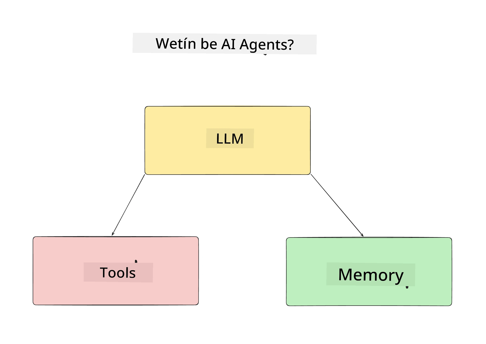
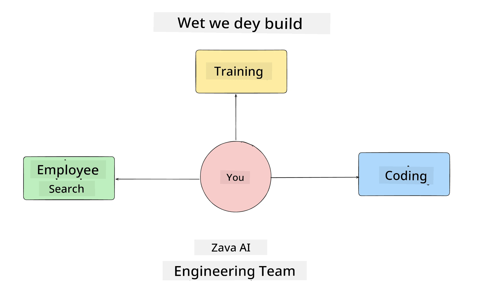
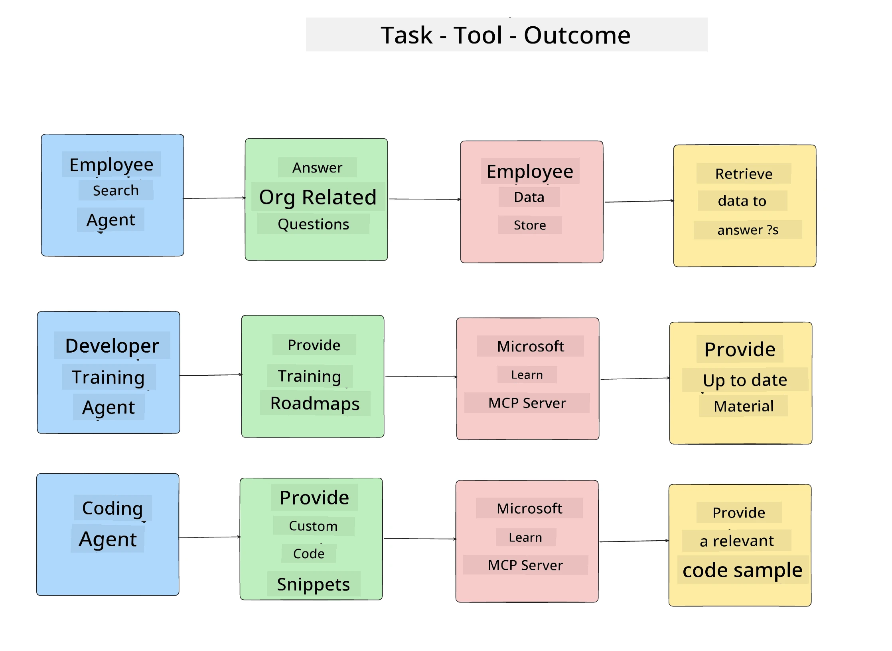
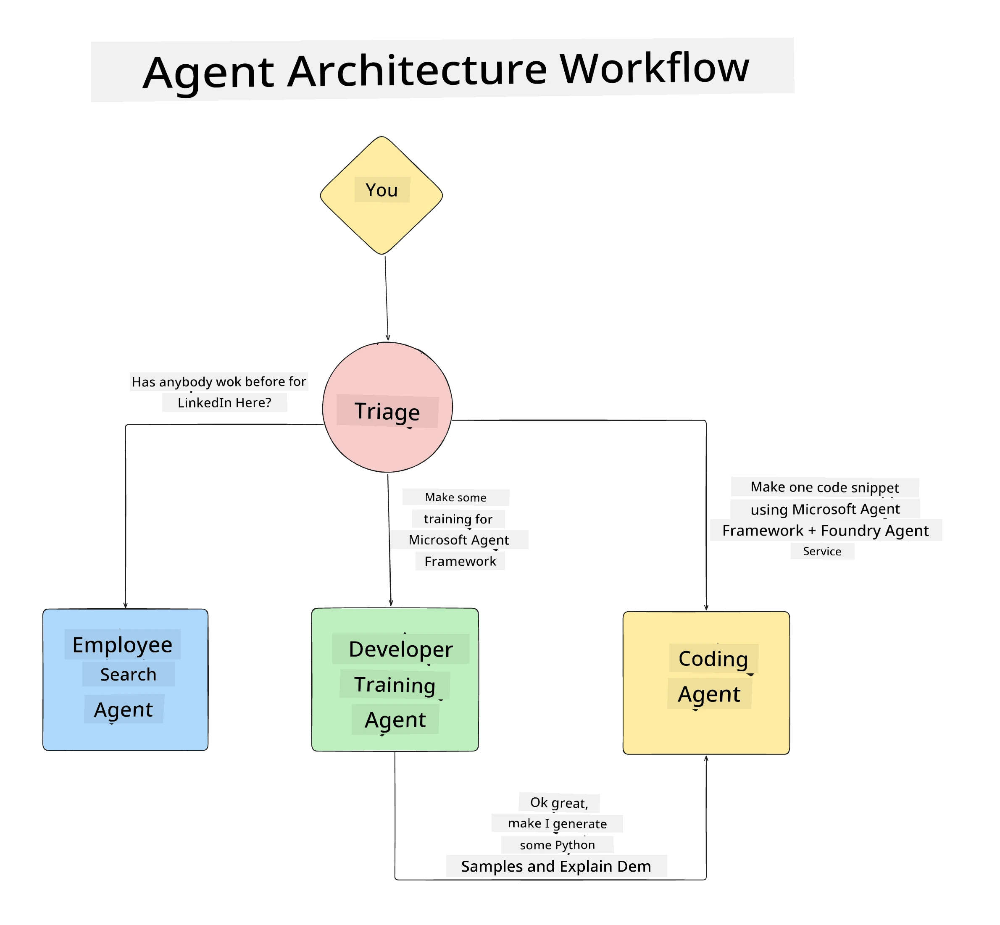

# Lesson 1: AI Agent Design

Welcome to di first lesson of di "Building AI Agent from Zero to Production Course"!

For dis lesson, we go cover:

- Defining wetin AI Agents be
  
- Talk about di AI Agent Application we dey build  

- Identify di tools and service wey each agent need
  
- Architect our Agent Application
  
Make we start by defining wetin agent be and why we go use dem inside application.

> **Before you start di course.** Dis first lesson na conceptual — no code to run.
> From [Lesson 2](../lesson-2-agent-development/README.md) and beyond, you go need: **Azure
> subscription** wey get access to **Microsoft Foundry**, one deployed **GPT-5 series model** (for
> example `gpt-5.1` — avoid di retired GPT-4o / GPT-4.1), **Python 3.12+**, and di **Azure CLI**
> (`az login`). See [Wetyn You Need](../README.md#what-you-need) for di course README for full
> list and links.

## Wetin Be AI Agents?

If na your first time to explore how to build AI Agent, you fit get question on how to exactly define wetin AI Agent be.

For simple way to define AI Agent, na by di components wey dem get:

**Large Language Model** - Di LLM go power di ability to process natural language from user to understand di work dem wan do plus di ability to understand description of di tools wey dem get to do di work.

**Tools** - Dem na functions, APIs, data stores, and other services wey di LLM fit choose to use to finish di tasks wey di user request.

**Memory** - Na how we dey store short term and long term interaction between di AI Agent and di user. To store and get back this information dey important to make beta and dey remember user preferences over time.

## Our AI Agent Use Case

For dis course, we go build AI Agent application wey go help new developers join our AI Agent Development Team!

Before we start any development work, di first step to create successful AI Agent application na to define clear scenarios on how we expect our users take work with our AI Agents.

For dis application, we go work with these scenarios:

**Scenario 1**: New employee join our organization and want know more about di team wey dem join plus how to connect with dem.

**Scenario 2:** New employee want know wetin be best first work wey dem fit start do.

**Scenario 3:** New employee want gather learning resources and code samples to help dem start and finish this work.

## Identifying the Tools and Services

Now we don create these scenarios, next step na to map dem to tools and services wey our AI agents go need to finish dem tasks.

Dis process na part of Context Engineering as we go focus to make sure say our AI Agents get right context at right time to finish di tasks.

Make we do am scenario by scenario and do beta agentic design by listing each agent task, tools and di way we want am make e turn out.

### Scenario 1 - Employee Search Agent

**Task** - Answer questions about employees for di organization like join date, current team, location and last position.

**Tools** - Datastore of current employee list and org chart

**Outcomes** - Fit find information from datastore to answer general organizational questions and specific questions about employees.

### Scenario 2 - Task Recommendation Agent

**Task** - Based on new employee developer experience, find 1-3 issues wey new employee fit work on.

**Tools** - GitHub MCP Server to get open issues and build developer profile

**Outcomes** - Fit read last 5 commits of GitHub Profile and open issues for GitHub project and make recommendations based on match

### Scenario 3 - Code Assistant Agent

**Task** - Based on Open Issues wey "Task Recommendation" Agent recommend, research and provide resources plus generate code snippets to help employee.

**Tools** - Microsoft Learn MCP to find resources and Code Interpreter to generate custom code snippets.

**Outcomes** - If user ask for extra help, workflow go use Learn MCP Server to provide links and snippets to resources then pass to Code Interpreter agent to generate small code snippets with explanations.

## Architecting our Agent Application

Now we don define each of our Agents, make we create architecture diagram wey go help us understand how each agent go work together and separate depending on di task:

## Next Steps

Now we don design each agent and our agentic system, make we move go next lesson wey we go develop each of these agents!

---

<!-- CO-OP TRANSLATOR DISCLAIMER START -->
**Disclaimer**:
Dis document don translate wit AI translation service [Co-op Translator](https://github.com/Azure/co-op-translator). Even tho we dey try make am correct, abeg make you know say automated translation fit get errors or mistakes. Di original document for dia own language na im be di correct source. For important info, make person wey sabi human translation do am. We no go responsible for any misunderstanding or wrong understanding wey fit happen because of dis translation.
<!-- CO-OP TRANSLATOR DISCLAIMER END -->