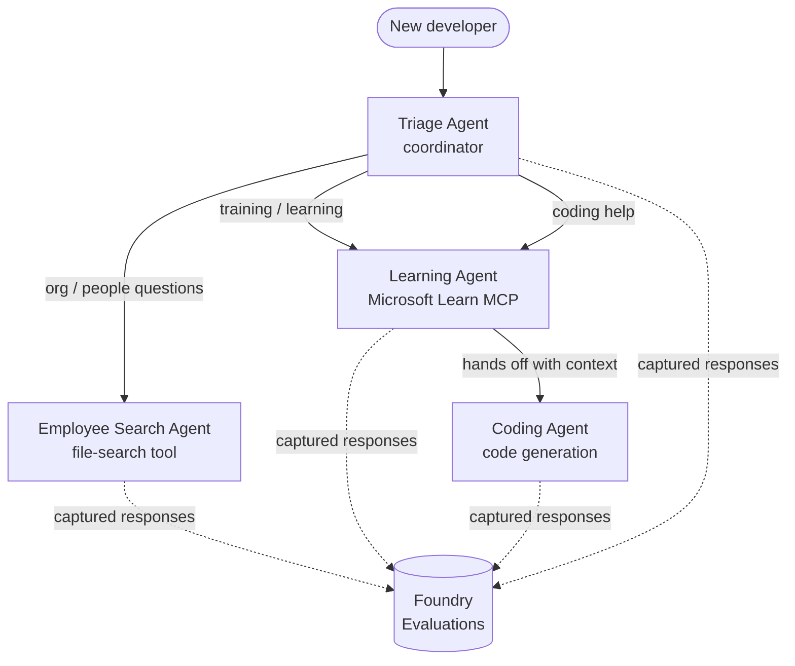

# Lesson 3: Agent Evaluations wit Microsoft Foundry

Welcome to di third lesson for di **"Building AI Agents from Zero to Production"** course!

For [Lesson 2](../lesson-2-agent-development/README.md) you build agents. For dis lesson you
go learn how to answer beta hard question: **dem good?** To ship agent wey
dey run easy; to sabi if e dey route correct, e dey follow your data, and e dey use im
tools well na wetin separate demo from production system.

For dis lesson we go cover:

- Why agent evaluation matter and how e different from traditional testing
- Di difference between **observability**, **smoke tests**, and **evaluations**
- Di multi-agent workflow we go measure
- Di built-in **Microsoft Foundry evaluators** (relevance, groundedness, tool-call accuracy, tool-output utilization)
- Step by step walkthrough of evaluation pipeline for [`agent-evals.py`](../../../lesson-3-agent-evals/agent-evals.py)
- How to run am and read di results

---

## Why you go evaluate agents?

Traditional unit test dey assert say `add(2, 2) == 4`. Agents no dey work like dat — di same
prompt fit give diferent wording every time, tools fit dey call for different orders, and
"correct" na usually matter of level, no be just true or false. You no fit assert on exact strings.

Instead, you go evaluate agents on **quality dimensions** using model-based *evaluators* (we also
dey call "LLM-as-a-judge") plus clear checks on how dem take use tools. Dis go tell you:

- Di answer really answer di question? (**relevance**)
- Di answer e base on wetin you find for data, or na agent just make am up? (**groundedness**)
- Di agent call di correct tool wit di correct arguments? (**tool-call accuracy**)
- Di agent really use wetin di tool return? (**tool-output utilization**)

### Three layers of quality wey dey complement each oda

Dem no be competing techniques — production agent dey use all three:

| Layer | Question e dey answer | Cost | When e run | Covered in |
|-------|--------------------|------|--------------|------------|
| **Observability / tracing** | *Wetin di agent do, step by step?* | Free (always on) | Continuously for prod | Dis lesson |
| **Smoke tests** | *Agent fit reach and e dey follow im basic prompt?* | Cheap, seconds | Every deploy | [Lesson 4](../lesson-4-agentdeployment/README.md#smoke-testing-the-hosted-agent-ci-gate) |
| **Evaluations** | *How **good** di responses?* | Slow small, model-metered | On demand / nightly / pre-release | Dis lesson |

Smoke tests dey answer "e break?" ; evaluations dey answer "e good?". You need both.

---

## Wetin you need before

1. Finish [Lesson 2](../lesson-2-agent-development/README.md) (agents + vector store).
2. Get **Microsoft Foundry** project.
3. **Azure CLI** don authenticate: `az login`.
4. **Python 3.12+** and course dependencies install:

   ```bash
   pip install -r ../requirements.txt
   ```


5. Environment variables (krieyit wan `.env` file for dis folder or export dem):

   | Variable | Purpose |
   |----------|---------|
   | `FOUNDRY_PROJECT_ENDPOINT` | Ya Foundry project endpoint (`https://<account>.services.ai.azure.com/api/projects/<project>`). Na di agents dem `FoundryChatClient` **and** di evaluation helper dey read am. |
   | `FOUNDRY_MODEL` | Model deployment we di **agents** dey run on (like `gpt-5.1`). |
   | `VECTOR_STORE_ID` | Di employee-directory vector store we dem create for Lesson 2 |
   | `AZURE_AI_MODEL_DEPLOYMENT_NAME` | Model deployment we **di evaluators** dey use (default na `FOUNDRY_MODEL`, then `gpt-5.1`) |

> Di agents dem use `FoundryChatClient`, we dey read config from di `FOUNDRY_`-prefixed
> variables (`FOUNDRY_PROJECT_ENDPOINT`, `FOUNDRY_MODEL`). Di cloud evaluation helper
> dey use di `azure-ai-projects` SDK and if `AZURE_AI_PROJECT_ENDPOINT` no set,
> e go fallback to `FOUNDRY_PROJECT_ENDPOINT` — so di two `FOUNDRY_` variables na enough
> to run di whole lesson.
>
> Di evaluators dem sef powered by wan model, so `AZURE_AI_MODEL_DEPLOYMENT_NAME`
> dey control which deployment na di judge — e no gree be di same model we your
> agents dey use.

---

## Di workflow we we dey evaluate

To evaluate sometin, you first gats run am. Dis lesson dey reuse di **Developer Onboarding**
multi-agent workflow: wan **triage** coordinator dey hand off to three specialists.



Di workflow dem build am wit Microsoft Agent Framework's **handoff** orchestration. Di main
idea for evaluation na say **every agent turn dey persisted server-side** and di dem get
`response_id`. Na dis IDs we dey hand to di evaluation service.

---

## Di evaluation pipeline, step by step

[`agent-evals.py`](../../../lesson-3-agent-evals/agent-evals.py) implement six-step pipeline. Dis na wetin each step dey do
and why.

### Step 1 — Run di workflow and track response IDs

Di workflow dey execute wit `run_stream(...)`, and as events dey flow back di code dey record
di `response_id` and `conversation_id` we each agent produce. Persisted responses na di raw
material for evaluation — you dey grade *real* production-shape responses, no be re-generated
ones.

### Step 2 — Summarise wetin dem capture

Quick summary dey print how many responses each agent produce, so you fit confirm di workflow
actually test di agents we you want grade.

### Step 3 — Fetch di final responses

For each agent, di last `response_id` go retrieve through di project's OpenAI-compatible
client (`project_client.get_openai_client().responses.retrieve(...)`) so you fit preview di
text wey dem go judge.

### Step 4 — Create di evaluation

Evaluation go create with four **built-in Foundry evaluators**:

| Evaluator | `evaluator_name` | Wetin e dey measure |
|-----------|------------------|------------------|

| Relevance | `builtin.relevance` | Di response dey answer wetin di user ask? |

| Groundedness | `builtin.groundedness` | Na di response dey supported by di retrieved/tool data (no be hallucination)? |
| Tool-call accuracy | `builtin.tool_call_accuracy` | Dem call di correct tools wit di correct arguments? |
| Tool-output utilization | `builtin.tool_output_utilization` | Di agent really use di tool results for im answer? |

Each evaluator dey initialized wit di deployment wey dem name `AZURE_AI_MODEL_DEPLOYMENT_NAME`.

> **Why dis four?** Relevance and groundedness dey measure *answer quality*; di two tool
> evaluators dey measure *agentic behaviour* — na di part wey traditional NLP metrics no dey show at all. For
> tool-using, multi-agent system, tool metrics na often where real regressions dey hide.

### Step 5 — Run di evaluation

Di captured `response_id`s dem dey pass go `evals.runs.create(...)` as di data source. Di
service dey replay every stored response through every evaluator.

### Step 6 — Monitor and read di results

Di code dey poll di run until e be `completed` or `failed`, den e go print di result counts and
**`report_url`** — na deep link inside Foundry portal where you fit check per-metric scores,
pass/fail counts, and individual judged responses.

---

## Run am

```bash
cd lesson-3-agent-evals
python agent-evals.py
```

By default e dey evaluate di first example query
(`"I'm new here! Has anyone worked at Microsoft here?"`). Two more multi-intent example queries
dey inside `run_evaluation_workflow()` — change di `query` variable to try routing scenarios
wey go exercise more agents for one run.

Di expected console flow be:

```
Step 1: Running Developer Onboarding Workflow
Step 2: Response Data Summary
Step 3: Fetching Agent Responses
Step 4: Creating Evaluation
Step 5: Running Evaluation
Step 6: Monitoring Evaluation
  Status: running ...
  Evaluation completed successfully
  Report URL: https://...   <-- open this in the Foundry portal
```

---

## Observability and tracing

Evaluations dey tell you *how good* di responses be; **observability** dey tell you *wetin happen*
to produce dem — every agent jump, tool call, token count, and latency. For Microsoft Foundry,
agent runs dey emit OpenTelemetry traces wey you fit view for di portal, and di Agent Framework fit
export dem go Azure Monitor / Application Insights wit only one call:

```python
from agent_framework.foundry import FoundryChatClient

client = FoundryChatClient()
client.configure_azure_monitor()   # send traces + metrics go Application Insights
```

Use tracing to **debug** bad evaluation score: when groundedness drop, di trace go show you
if di file-search tool return nothing, or if e return data wey di agent then ignore (na
exactly wetin tool-output utilization dey score).

---

## From "runs" to "good": how to use dis one for practice

- **Pre-release gate.** Run evaluations against fixed set of representative queries before
  you promote new prompt or model. Compare scores wit di previous version — treat any drop as
  regression.
- **Nightly quality signal.** Schedule di evaluation to catch drift from data or dependency
  changes.
- **Pair wit smoke tests.** Di [Lesson 4 smoke test](../lesson-4-agentdeployment/README.md#smoke-testing-the-hosted-agent-ci-gate)
  na your fast per-deploy gate; evaluations na di slower, deeper quality gate. Run di cheap
  one for every merge and di expensive one for schedule or before release.

---

## Modernisation note

Dis sample dey migrate to di current Microsoft Agent Framework Foundry API surface
(`agent_framework.foundry`). If you dey update di code, check di repository-root
[`MIGRATION-GUIDE.md`](../MIGRATION-GUIDE.md) for di verified before/after import and client
mappings (for example `AzureAIClient` -> `FoundryChatClient`, and hosted-tool construction via
`client.get_file_search_tool(...)` / `client.get_mcp_tool(...)`). Di evaluation concepts and di
six-step pipeline wey I talk about no change from dat migration.

---

## Resources

- [Evaluate generative AI models and applications (Microsoft Learn)](https://learn.microsoft.com/en-us/azure/ai-foundry/concepts/evaluation-approach-gen-ai)
- [Built-in evaluators for generative AI](https://learn.microsoft.com/en-us/azure/ai-foundry/concepts/evaluation-evaluators/agent-evaluators)
- [Observability in Microsoft Foundry](https://learn.microsoft.com/en-us/azure/ai-foundry/concepts/observability)
- [Microsoft Agent Framework](https://github.com/microsoft/agent-framework)
- [Agent handoff orchestration](https://learn.microsoft.com/en-us/agent-framework/workflows/orchestrations/handoff)

---

<!-- CO-OP TRANSLATOR DISCLAIMER START -->
**Disclaimer**:
Dis document don translate wit AI translation service [Co-op Translator](https://github.com/Azure/co-op-translator). Even tho we dey try make am correct, abeg make you know say automated translation fit get errors or mistakes. Di original document for dia own language na im be di correct source. For important info, make person wey sabi human translation do am. We no go responsible for any misunderstanding or wrong understanding wey fit happen because of dis translation.
<!-- CO-OP TRANSLATOR DISCLAIMER END -->