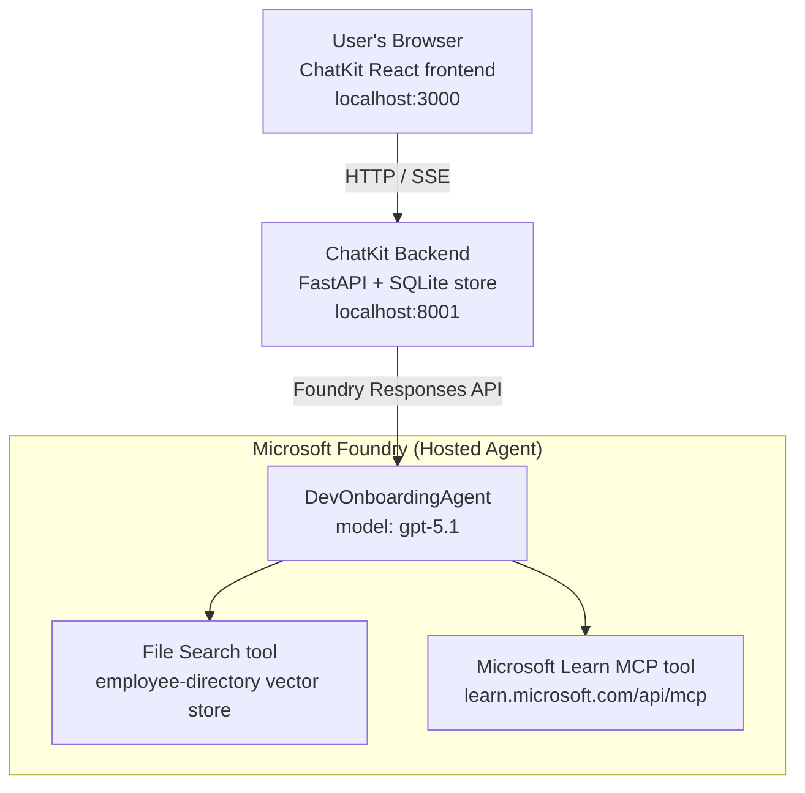

# Lesson 4: Agent Deployment wit Microsoft Foundry Hosted Agents + ChatKit

Dis lesson dey show ow to deploy tool-using agent go Microsoft Foundry as hosted agent plus create ChatKit-based frontend wey go interact with am.

## Architecture

Di hosted agent na **one `DevOnboardingAgent`** (wey dey run for `gpt-5.1`) wey dey answer developer-onboarding questions wit two hosted tools: **File Search** tool for di employee-directory vector store, plus di **Microsoft Learn MCP** tool. ChatKit React frontend dey yarn to FastAPI backend wey dey call di agent through Foundry **Responses API**.



## Prerequisites

1. **Microsoft Foundry Project** for North Central US region
2. **Azure CLI** login set (`az login`)
3. **Azure Developer CLI** (`azd`) install finish
4. **Python 3.12+** and **Node.js 18+**
5. **Vector Store** don create wit employee data

## Quick Start

### 1. Set Up Environment Variables

```bash
cd lesson-4-agentdeployment
cp .env.example .env
# Edit .env wit your Microsoft Foundry project details
```

### 2. Deploy di Hosted Agent

**Option A: Using Azure Developer CLI (Recommended)**

```bash
cd hosted-agent
azd auth login
azd agent deploy
```

**Option B: Using Docker + Azure Container Registry**

```bash
cd hosted-agent

# Build di container
docker build -t developer-onboarding-agent:latest .

# Tag for ACR
docker tag developer-onboarding-agent:latest <your-acr>.azurecr.io/developer-onboarding-agent:latest

# Push go ACR
az acr login --name <your-acr>
docker push <your-acr>.azurecr.io/developer-onboarding-agent:latest

# Deploy throu Microsoft Foundry portal or SDK
```

### 3. Start di ChatKit Backend

```bash
cd chatkit-server
python -m venv .venv
source .venv/bin/activate  # For Windows: .venv\Scripts\activate
pip install -r requirements.txt
python app.py
```

Di server go start for `http://localhost:8001`

### 4. Start di ChatKit Frontend

```bash
cd chatkit-server/frontend
npm install
npm run dev
```

Di frontend go start for `http://localhost:3000`

### 5. Test di Application

Open `http://localhost:3000` for your browser and try dis kind queries dem:

**Employee Search:**
- "I just start here! Anybody don work for Microsoft before?"
- "Who get experience wit Azure Functions?"

**Learning Resources:**
- "Make learning path for Kubernetes"
- "Which certifications I suppose pursue for cloud architecture?"

**Coding Help:**
- "Help me write Python code for connect to CosmosDB"
- "Show me how to make Azure Function"

**Multi-Agent Queries:**
- "I dey start as cloud engineer. Who I suppose connect with and wetin I suppose learn?"

## Project Structure

```
lesson-4-agentdeployment/
├── .env.example                 # Environment variables template
├── implementation-plan.md       # Detailed implementation guide
├── README.md                    # This file
├── hosted-agent/               # Microsoft Foundry hosted agent
│   ├── main.py                 # Multi-agent workflow implementation
│   ├── requirements.txt        # Python dependencies
│   ├── Dockerfile              # Container definition
│   └── agent.yaml              # Agent deployment configuration
└── chatkit-server/             # ChatKit server application
    ├── app.py                  # FastAPI backend
    ├── store.py                # SQLite persistence layer
    ├── requirements.txt        # Python dependencies
    └── frontend/               # React frontend
        ├── package.json
        ├── vite.config.ts
        ├── tsconfig.json
        ├── index.html
        └── src/
            ├── main.tsx
            ├── App.tsx
            ├── App.css
            └── index.css
```

## The Agent and Its Tools

Di hosted agent na **one single agent** (`DevOnboardingAgent`, wey dey inside `hosted-agent/main.py`) wey dey handle three onboarding domains. Instead of to dey manage separate sub-agents, e dey show each capability as tool (or e fit rely on di model directly):

| Capability | How e dey handled | Tool |
|-----------|------------------|------|
| **Employee search & connections** | Foundry hosted File Search for di employee-directory vector store | `client.get_file_search_tool(vector_store_ids=[...])` |
| **Learning & training** | Microsoft Learn MCP server (hosted MCP tool) | `client.get_mcp_tool(url="https://learn.microsoft.com/api/mcp")` |
| **Coding assistance** | `gpt-5.1` model handle am directly — no external tool | — |

Di agent dey created wit `client.as_agent(name="DevOnboardingAgent", instructions=..., tools=[file_search_tool, learn_mcp_tool])` and e dey served wit `from_agent_framework(agent).run()`.

> **Design note.** Early versions of dis lesson use `HandoffBuilder` multi-agent workflow (Triage → specialists). Di shipped agent na single tool-using agent, wey easy to deploy and understand for onboarding Q&A. For example of multi-agent orchestration and handoffs, check Lesson 2 and Lesson 3.

## Smoke Testing di Hosted Agent (CI Gate)

To deploy hosted agent "successfully" no mean sey e prove di control plane accept di
definition — e **no** prove di agent really go answer. If dependency miss,
model routing bad, or connection don expire, fit make agent green but silent.

Dis lesson carry lightweight **smoke test** wey dey act as fast, cheap post-deploy
gate. E dey use [AI Smoke Test](https://github.com/marketplace/actions/ai-smoke-test)
GitHub Action to POST prompts to di agent's Foundry **Responses** endpoint
(`POST {project_endpoint}/agents/{agent_name}/endpoint/protocols/openai/responses`)
and e dey check di returned text. E fit catch broken deployments, auth regressions,
system-prompt drift, and threading wahala fast-fast.

> Smoke tests **no** replace full evaluations for
> [Lesson 3](../lesson-3-agent-evals/README.md) — dem complement each other. Smoke tests
> dey answer *"Agent dey reachable, e dey respond, and e dey follow basic prompt?"*;
> evaluations dey answer *"Response quality how?"*. Run dis cheap gate every deploy.

### Wetin dem dey test

Di catalog dey at [`hosted-agent/tests/smoke-tests.json`](../../../lesson-4-agentdeployment/hosted-agent/tests/smoke-tests.json)
and e use all di agent three domains, prompt adherence plus multi-turn threading:

| Test | Wetin e dey verify |
|------|------------------|
| `reachability` | Agent respond wit correct, on-scope text |
| `employee-search` | File-search domain give healthy `200` (reply dey depend on data) |
| `learning-path` | Learning domain echo topic and give path-style answer |
| `coding-assistance` | Coding domain give code-shaped Python answer |
| `prompt-adherence-offtopic` | Off-topic request e dey redirect, no answer for detail |
| `threading-turn-1/2` | Conversation state dey keep across turns with `previous_response_id` |

### Run am for CI

Workflow for [`.github/workflows/smoke-test-hosted-agent.yml`](../../../.github/workflows/smoke-test-hosted-agent.yml)
get two jobs:

- **`static`** — fast, no-Azure gate wey dey run every pull request and push:
  e dey compile all Python sources (`py_compile`) plus check Markdown links. No secrets
  needed, so e fit work for fork PRs.
- **`smoke`** — di Azure-connected smoke test below. E dey run on demand
  (Actions → **Agent CI (static + smoke)** → Run workflow) and fit follow your
  deploy workflow.

Configure dis repository **variables** and **secrets** for di smoke job:

| Kind | Name | Value |
|------|------|-------|
| Variable | `FOUNDRY_PROJECT_ENDPOINT` | `https://<account>.services.ai.azure.com/api/projects/<project>` |
| Variable | `HOSTED_AGENT_NAME` | Deployed agent name (ex: `dev-onboarding` — must match your deployment) |
| Secret | `AZURE_CLIENT_ID` / `AZURE_TENANT_ID` / `AZURE_SUBSCRIPTION_ID` | OIDC federated identity for `azure/login` |

Runner identity need **`Azure AI User`** role for **Foundry project scope** so e fit
call Responses (and conversations) data-plane endpoints. Grant am wit:

```bash
az role assignment create \
  --assignee <object-id-or-appId-of-runner-identity> \
  --role "Azure AI User" \
  --scope "/subscriptions/<sub>/resourceGroups/<rg>/providers/Microsoft.CognitiveServices/accounts/<account>/projects/<project>"
```

### Run am locally

You fit run di same catalog before you push. Get data-plane token with scope
`https://ai.azure.com/` and point di runner to your deployment:

```bash
# Audience GAT be https://ai.azure.com/ (cognitiveservices.azure.com tokens no go pass)
export FOUNDRY_TOKEN=$(az account get-access-token --resource https://ai.azure.com/ --query accessToken -o tsv)

git clone https://github.com/JFolberth/ai-smoketest && cd ai-smoketest
python runner.py \
  --project-endpoint "https://<account>.services.ai.azure.com/api/projects/<project>" \
  --agent-name dev-onboarding \
  --tests-file ../lesson-4-agentdeployment/hosted-agent/tests/smoke-tests.json
```

Exit codes: `0` mean all test pass, `1` mean assertion fail, `2` mean runner error (bad catalog / token).

## Troubleshooting

### Agent no dey respond
- Make sure di hosted agent dey deployed and dey run for Microsoft Foundry
- Check sey `HOSTED_AGENT_NAME` and `HOSTED_AGENT_VERSION` match your deployment

### Vector store wahala
- Make sure `VECTOR_STORE_ID` dey set correct
- Verify sey vector store get di employee data

### Authentication wahala
- Run `az login` to refresh credentials
- Make sure sey you get access to Microsoft Foundry project

## Resources

- [Microsoft Foundry Hosted Agents Documentation](https://learn.microsoft.com/en-us/azure/ai-foundry/agents/concepts/hosted-agents)
- [Microsoft Agent Framework](https://github.com/microsoft/agent-framework)
- [ChatKit Integration Sample](https://github.com/microsoft/agent-framework/tree/main/python/samples/demos/chatkit-integration)
- [Azure Developer CLI](https://learn.microsoft.com/en-us/azure/developer/azure-developer-cli/overview)
- [AI Smoke Test GitHub Action](https://github.com/marketplace/actions/ai-smoke-test)
- [Smoke Test Microsoft Foundry Agents with GitHub Actions (blog)](https://techcommunity.microsoft.com/blog/azuredevcommunityblog/smoke-test-microsoft-foundry-agents-with-github-actions/4531912)

---

## Next Steps

Your agent dey run on Microsoft managed infrastructure. If you wan use am for big company production —
to control where e data dey live (data sovereignty, private networking, bring-your-own Azure
Cosmos DB / Storage / AI Search) plus govern e tools — continue make you read
**[Lesson 5: Production Hosted Agents](../lesson-5-hosted-agents-production/README.md)**, wey
explain di important difference between **Hosted Agents** and **Capability Hosts**.

---

<!-- CO-OP TRANSLATOR DISCLAIMER START -->
**Disclaimer**:
Dis document don translate wit AI translation service [Co-op Translator](https://github.com/Azure/co-op-translator). Even tho we dey try make am correct, abeg make you know say automated translation fit get errors or mistakes. Di original document for dia own language na im be di correct source. For important info, make person wey sabi human translation do am. We no go responsible for any misunderstanding or wrong understanding wey fit happen because of dis translation.
<!-- CO-OP TRANSLATOR DISCLAIMER END -->