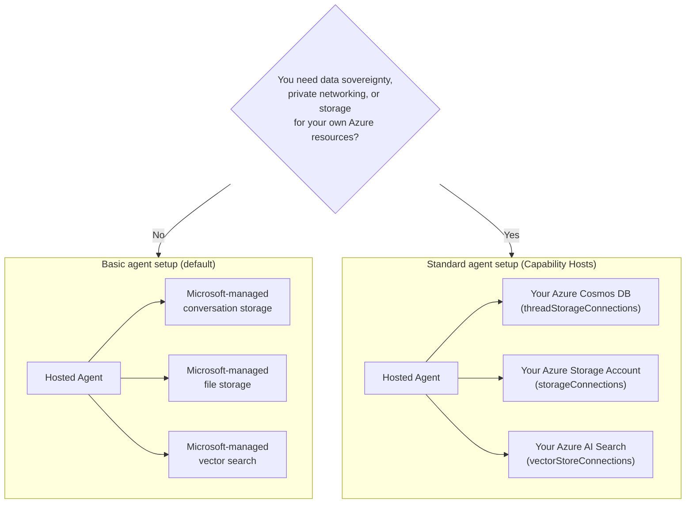

# Lesson 5: Production Hosted Agents — Storage, Memory & Governance

For [Lesson 4](../lesson-4-agentdeployment/README.md) una don deploy di Developer Onboarding
Agent as **Microsoft Foundry Hosted Agent** and put ChatKit frontend for front. Dat
lesson answer *"how I go take ship agent?"*. Dis lesson go answer di next questions
for enterprise: **Where di agent data dey stored? Who dey control am? How I fit meet compliance,
networking, and governance requirements?**

Di most important tori for dis lesson na di difference between **Hosted Agent** and
**Capability Host** — two concepts wey e easy to confuse but dem dey solve completely different
wahala.

## Learning Objectives

By di end of dis lesson, you go fit:

- Explain wetin **Hosted Agent** dey give you (Microsoft-managed execution) and wetin e no dey give.
- Explain wetin **Capability Host** be and exactly wen you need am.
- Choose between **basic agent setup** (Microsoft-managed storage) and **standard agent setup**
  (bring-your-own Azure resources).
- Understand how **conversation history, file uploads, and vector stores** dey persist, and how
  you go redirect dem to your own Azure Cosmos DB, Azure Storage, and Azure AI Search.
- Apply governance controls: data sovereignty, private networking, and **Hosted MCP tool approval**.

---

## Prerequisites

1. Don complete [Lesson 4](../lesson-4-agentdeployment/README.md) — you get hosted agent deployed.
2. You need **Microsoft Foundry** project and Azure account wey get permission to create resources
   (Cosmos DB, Storage, Azure AI Search) and assign roles for subscription/resource group.
3. **Azure CLI** authenticated: `az login` (plus `az account set --subscription <id>` if you get
   more than one subscription).
4. **Azure Developer CLI** (`azd`) installed — na dis you use for standard-setup provisioning flow.
5. **Python 3.12+** plus di course dependencies installed (`pip install -r ../requirements.txt`).
6. Current, non-retired model deployment (example na `gpt-5.1`). Avoid retired GPT-4o / GPT-4.1.

> Dis lesson na concept and control-plane focused mostly. You fit read am finish without
> provisioning anything, then use di hands-on exercises when you ready to configure
> standard setup.

---

## 1. Hosted Agents: wetin Foundry dey manage for you

**Hosted Agent** na agent wey di *execution environment* full managed by Microsoft
Foundry Agent Service. Wen you deploy hosted agent (like you do for Lesson 4), Foundry dey provide:

- **Compute** — di runtime wey dey run your agent code and tools.
- **Scaling** — replicas go scale up and down as load dey (see `agent.yaml` `scale` for Lesson 4).
- **Identity** — managed identity for agent, so e fit authenticate for Azure without secrets.
- **Observability** — tracing and telemetry (check Lesson 3 observability section).
- **Session management** — threads/conversations, so multi-turn chats "remember" previous turns.

> **Key point:** You no need configure Capability Host just to *run* Hosted
> Agent. Hosted agent dey work ready to go for Microsoft-managed infrastructure.

---

## 2. Hosted Agents vs Capability Hosts

**Hosted Agents and Capability Hosts dey solve different wahala.**

**Hosted Agents** dey provide Microsoft-managed execution environment, including compute, scaling,
identity, observability and session management. You no need Capability Hosts just to run
Hosted Agent.

**Capability Hosts** na only when you want Agent Service use **customer-owned
resources** instead of Microsoft-managed storage that you go need am. If you dey okay with default
Microsoft-managed storage, vector search and conversation persistence, **no Capability Host
configuration dey needed.**

If your organisation require **data sovereignty, private networking, compliance controls or
storage for your own Azure Cosmos DB, Azure Storage Account and Azure AI Search resources**, then
you go configure Capability Hosts to connect Agent Service to those resources.

For one sentence:

> **Hosted Agent** na about *where your agent dey run*. **Capability Host** na about *where your
> agent data dey live*.

| Concern | Hosted Agent | Capability Host |
|---------|--------------|-----------------|
| Compute / scaling / identity | ✅ E provide | — |
| Observability / tracing | ✅ E provide | — |
| Conversation & thread session management | ✅ E provide | Redirect *where e dey stored* |
| Where conversation history dey stored | Microsoft-managed by default | Your Azure Cosmos DB |
| Where uploaded files dey stored | Microsoft-managed by default | Your Azure Storage Account |
| Where vector embeddings dey stored | Microsoft-managed by default | Your Azure AI Search |
| Required to run agent? | ✅ Yes (na di agent host) | ❌ No — optional |
| Required for data sovereignty / BYO storage? | ❌ No alone e no enough | ✅ Yes |

---

## 3. Basic vs Standard agent setup

Foundry describe two data setup as **basic** and **standard** agent setup.



### When to remain for basic setup (no Capability Host)

- For development, prototyping, and testing.
- Internal tools wey Microsoft-managed storage fit satisfy your data-handling policy.
- You want fastest way to get working agent without plenty infrastructure.

### When you suppose use standard setup (Capability Hosts)

- **Data sovereignty** — all di agent data must stay inside your Azure subscription/region.
- **Security control** — you must use your own storage accounts, databases, and search services.
- **Compliance** — you get regulatory or organizational requirements about where data dey.
- **Private networking** — traffic must remain inside your virtual network (BYO virtual network).

> **Recommendation from Microsoft:** make una use *separate* Foundry accounts/projects for standard and
> basic setup. No mix different setup types inside same Foundry account.

---

## 4. How Capability Hosts dey work

**Capability Host** na sub-resource wey you configure for **two scopes**: Foundry **account**
and Foundry **project**. E dey tell Agent Service where to store and process agent data:
conversation history, file uploads, and vector stores.

Two rules important pass be:

1. **Account first before project.** You no fit create project capability host unless
   account-level capability host already dey.

2. **No inheritance of configuration.** Di **project** capability host na wetin Agent Service
   really dey read to sabi which storage/conversation/vector resources to use. Connections wey dey
   account level no dey *automatically* used by project — the project capability host must
   explicitly refer to dem.

### Connections wey standard setup need

Capability hosts dey refer to **connections** (wey you create for your Foundry account/project) wey dey point to
your Azure resources:

| Capability host property | Stores | Your Azure resource |
|--------------------------|--------|---------------------|
| `threadStorageConnections` | Agent definitions + conversation history | Azure Cosmos DB |
| `storageConnections` | File uploads / blob storage | Azure Storage Account |
| `vectorStoreConnections` | Vector embeddings for retrieval/search | Azure AI Search |
| `aiServicesConnections` *(optional)* | Your own model deployments | Azure OpenAI |

Every connection must get `authType`, `category`, `target` (the service **endpoint URL**, no be
resource ID), and `metadata.ResourceId` (the full Azure resource ID) wey dem fill inside, or else Agent Service
no go fit find the resource during runtime.

### How to configure the capability hosts (control plane)

Right now, dem dey manage capability hosts through the **Azure Resource Manager REST API** (no
SDK dey yet for capability-host management). First, create the **account** capability host:

```http
PUT https://management.azure.com/subscriptions/{subscriptionId}/resourceGroups/{rg}/providers/Microsoft.CognitiveServices/accounts/{account}/capabilityHosts/{name}?api-version=2025-06-01

{
  "properties": { "capabilityHostKind": "Agents" }
}
```

Then create the **project** capability host wey go refer to your connections:

```http
PUT https://management.azure.com/subscriptions/{subscriptionId}/resourceGroups/{rg}/providers/Microsoft.CognitiveServices/accounts/{account}/projects/{project}/capabilityHosts/{name}?api-version=2025-06-01

{
  "properties": {
    "capabilityHostKind": "Agents",
    "threadStorageConnections": ["my-cosmosdb-connection"],
    "vectorStoreConnections":  ["my-ai-search-connection"],
    "storageConnections":      ["my-storage-connection"]
  }
}
```

> **Wetin you gots remember:**
> - **Only one capability host per scope.** If you try create second one for same scope, e go return `409 Conflict`.
> - **No updates dey allowed.** If you wan change configuration, you gots **delete then recreate** the capability host.
> - **Deletion dey destructive.** If you delete capability host, e go remove agents access to files,
>   conversations, and vector stores wey e dey point to.

### How to check say e dey work

After you set am, try run one test conversation and confirm say:

- Conversations dey show for **your Azure Cosmos DB**.
- Uploaded files dey show for **your Azure Storage account**.
- Vector data dey show for **your Azure AI Search index**.

---

## 5. Memory & context management

"Session management" (na Hosted Agent feature be this) and "where threads dey stored" (na Capability Host
mata) join to give your agent **memory**:

- A **thread** (conversation) na ordered chat turns e hold. The Responses API dey join calls
  together with `previous_response_id` (you see am for Lesson 4 smoke tests).
- For **basic setup**, thread/conversation state dey inside Microsoft-managed storage.
- For **standard setup**, that same state dey saved inside **your Azure Cosmos DB** through
  `threadStorageConnections` — this one give you better, queryable conversation history wey belong only to you.

Dis na the difference between agent wey "remember within a session" and one enterprise
system wey keep every conversation inside your own compliance boundary.

---

## 6. Governance & security checklist

Use this checklist wen you wan promote hosted agent from prototype go production:

- [ ] **Decide basic vs standard setup** by using the questions for §3 — write down how you decide.
- [ ] **Data sovereignty:** if e dey necessary, configure Capability Hosts so conversation history
      (Cosmos DB), files (Storage), and vectors (AI Search) go remain inside your subscription/region.
- [ ] **Private networking:** for standard setup, make sure traffic no go pass outside by bringing your own virtual
      network so data no fit escape your network (e go help stop data exfiltration).
- [ ] **RBAC:** give only as much privilege as e need. To create capability hosts, you gots **Contributor** for
      Foundry account; to assign access to your Azure resources, you need **User Access Administrator**
      or **Owner** role.
- [ ] **Hosted MCP tool governance:** check every MCP server wey your agent fit call and set
      **approval mode** (check §7). No ever expose tool wey you never check to production agent.
- [ ] **Observability:** make sure tracing/telemetry dey on (Lesson 3) so you fit audit tool calls.
- [ ] **Cost:** BYO resources (Cosmos DB, AI Search, Storage) dey charged to *your* subscription —
      size am and monitor dem. Basic setup dey bundle storage inside the managed service.

---

## 7. Hosted MCP tools & approval workflows

The Developer Onboarding Agent for Lesson 4 don already use **Hosted MCP tool** — the
[Microsoft Learn MCP server](https://learn.microsoft.com/api/mcp) — we add am with:

```python
client.get_mcp_tool(
    name="Microsoft Learn MCP",
    url="https://learn.microsoft.com/api/mcp",
    approval_mode="never_require",
)
```

The **Model Context Protocol (MCP)** na open standard wey allow agent find and call
external tools through one uniform interface. **Hosted MCP tools** dey allow Foundry call MCP server on
behalf of agent. For production, two governance things matter:

- **`approval_mode`** — e dey control whether human/caller gots approve every tool call.
  - `never_require` dey convenient for trusted, read-only server like Microsoft Learn.
  - For servers wey fit **write** or connect to sensitive systems, approval gots dey before call go.
    Na dis be your **approval workflow**.
- **Server allow-listing** — only connect MCP servers wey you don review and trust. Treat MCP
  URL like any other important production dependency.

> **Try am:** change Lesson 4 agent’s `approval_mode` make e require approval, redeploy, and
> see as e go make tool calls dey wait for confirmation before e run.

---

## Hands-on exercises

1. **Classify scenario.** For each one, decide if na *basic* or *standard* setup and explain why:
   (a) hackathon demo, (b) healthcare onboarding assistant wey dey handle PII, (c) internal
   FAQ bot, (d) bank agent wey gots keep all data inside region.
2. **Map storage.** For Lesson 4 agent, list which capability-host property go store
   (a) chat history, (b) uploaded employee files, (c) vector embeddings.
3. **Design approval workflow.** Add hypothetical "create Jira ticket" MCP tool to agent.
   Which `approval_mode` you go use and why?
4. **Cost trade-off.** Write two or three sentences about cost people go face when them move from basic
   to standard setup for high-traffic agent.

---

## Resources

- [Capability hosts — Microsoft Foundry](https://learn.microsoft.com/azure/foundry/agents/concepts/capability-hosts)
- [Standard agent setup (built-in enterprise readiness)](https://learn.microsoft.com/azure/foundry/agents/concepts/standard-agent-setup)

- [Use your own resources](https://learn.microsoft.com/azure/foundry/agents/how-to/use-your-own-resources)

- [Set up your agent environment (basic vs standard)](https://learn.microsoft.com/azure/foundry/agents/environment-setup)
- [Set up private networking for Foundry Agent Service](https://learn.microsoft.com/azure/foundry/agents/how-to/virtual-networks)
- [Add a connection to your project](https://learn.microsoft.com/azure/foundry/how-to/connections-add)
- [Microsoft Learn MCP server](https://learn.microsoft.com/training/support/mcp)
- [Model Context Protocol](https://modelcontextprotocol.io/)

---

**Previous:** [Lekshon 4 — Agent Deployment](../lesson-4-agentdeployment/README.md) &nbsp;·&nbsp; **Next:** [Lekshon 6 — Microsoft Toolbox](../lesson-6-toolbox/README.md)

---

<!-- CO-OP TRANSLATOR DISCLAIMER START -->
**Disclaimer**:
Dis document don translate wit AI translation service [Co-op Translator](https://github.com/Azure/co-op-translator). Even tho we dey try make am correct, abeg make you know say automated translation fit get errors or mistakes. Di original document for dia own language na im be di correct source. For important info, make person wey sabi human translation do am. We no go responsible for any misunderstanding or wrong understanding wey fit happen because of dis translation.
<!-- CO-OP TRANSLATOR DISCLAIMER END -->