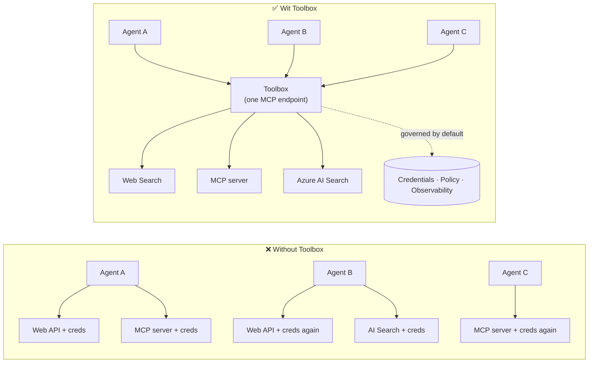

# Lesson 6: Microsoft Toolbox — Tools Wey Dem De Manage For Agents

From [Lesson 5](../lesson-5-hosted-agents-production/README.md) your hosted agent dey run for
production with the storage and governance wey your organisation need. But look back that
Lesson 4 agent: every tool just **hardcoded** inside `main.py` — the Microsoft Learn MCP URL, the
file-search vector store, and like that. E fit work for one agent. E no go **scale** reach
organisation wey get plenti agents and teams.

Dis lesson go introduce **Microsoft Toolbox**: di way wey Foundry dey allow you define one curated set of
tools **one time**, manage dem **centrally**, and show dem to any agent through **one,
governed endpoint**.

## Wetin You go Learn

By di end of dis lesson you go fit:

- Explain di tool-sprawl wahala wey Toolbox dey solve.
- Talk about di **Build** and **Consume** pillars plus di kind tools wey toolbox fit get.
- **Build** toolbox version with Foundry SDK.
- **Consume** toolbox from Microsoft Agent Framework hosted agent through one MCP endpoint.
- Use **versioning** to move tool changes without changing agent code or do redeploy.
- Do **governance**: RBAC, put credentials, and guardrail (RAI) policies.

---

## Wetin You Need Before You Start

1. Finish [Lesson 4](../lesson-4-agentdeployment/README.md) and if fit
   [Lesson 5](../lesson-5-hosted-agents-production/README.md).
2. One **Microsoft Foundry** project wey get permission to create and manage toolbox resources.
3. **Azure CLI** wey you don signin: `az login`. Foundry toolbox APIs need
   `https://ai.azure.com/.default` token scope (dem show am for code below).
4. **Python 3.12+** plus di course dependencies installed (`pip install -r ../requirements.txt`).
5. One current, non-retired model deployment (example `gpt-5.1`). No use retired GPT-4o / GPT-4.1.

---

## 1. Di Wahala: Tool Sprawl

One agent fit depend on plenti tools — REST APIs, MCP servers, connectors, and flows — and each one
get im own authentication model and im own team wey dey manage am. As you dey scale inside organisation:

- Teams **dey do tool again and again** on their own.
- **Credentials dey duplicate** for agents and repos.
- **Governance no dey consistent** — every agent dey apply (or forget) policy for by imself.
- E get **small visibility** on top which tools dey or who dey use dem.

Developers dey stop — no be because models no fit, but because **tool integration na im be
wahala**.



Enterprises don get infrastructure — gateways, credential vaults, policies, observability.
Wetin still dey missing na developer experience wey package am into something **wey
people fit use again, find, and wey dey govern by default**. Na dat one na Toolbox.

---

## 2. Wetin Be Toolbox

**Toolbox** na **managed Foundry resource**. You go define curated set of tools one time, manage
dem centrally for Foundry, and expose dem through **one MCP-compatible endpoint** wey any
agent fit consume. For runtime, platform dey handle **credential injection, token refresh, and
enterprise policy enforcement**.

Because toolbox na managed resource, you fit add, remove, or change tools **without
changing code for your agent** — agent go still join the same endpoint always.

Toolbox dey cover di tool lifecycle inside four pillars; **Build** and **Consume** dey available
today:

| Pillar | Status | Wetin e enable |
|--------|--------|-----------------|
| **Build** | E dey today | Choose tools, configure authentication centrally, publish reusable toolbox wey any team fit use. |
| **Consume** | E dey today | Connect any agent to one MCP-compatible endpoint to find and run all tools for toolbox. |

Di consumption surface dey **open**: any MCP-compatible runtime or client fit use toolbox —
Microsoft Agent Framework, LangGraph, GitHub Copilot, Claude Code, Microsoft Copilot Studio, or
custom code.

### Kinds of Tools Wey Toolbox Fit Get

Web Search · MCP · Azure AI Search · Code Interpreter · File Search · OpenAPI · **Agent-to-Agent
(A2A)** · Fabric IQ · Tool Search · Work IQ · Browser Automation · Skill references, and plus
**Guardrail (RAI) policy** wey dem put for toolbox layer.

> **Tip:** Add `description` to **every** tool make model fit choose correct one. Toolbox
> go allow only **one unnamed tool per type** — make other ones of same type get
> different `name`, if no be so, you go get `invalid_payload` error.

---

## 3. How to Build Toolbox

Toolbox dem dey manage with Foundry SDKs (Python/.NET/JavaScript), REST API, `azd`, and
**Microsoft Foundry Toolkit for VS Code**. Dis na di Python (`azure-ai-projects`) pattern:

```python
from azure.identity import DefaultAzureCredential
from azure.ai.projects import AIProjectClient
from azure.ai.projects.models import MCPTool, ToolboxSearchPreviewTool, WebSearchTool

endpoint = "https://<your-foundry-account>.services.ai.azure.com/api/projects/<your-project>"
project = AIProjectClient(endpoint=endpoint, credential=DefaultAzureCredential())

toolbox_version = project.toolboxes.create_toolbox_version(
    name="agent-tools",
    description="Web search + an MCP server + tool search",
    tools=[
        WebSearchTool(),
        MCPTool(
            server_label="myserver",
            server_url="https://your-mcp-server.example.com",
            require_approval="never",
            project_connection_id="my-key-auth-connection",  # credentials dey for Foundry
        ),
        ToolboxSearchPreviewTool(),
    ],
)
print(f"Created toolbox: {toolbox_version.name}, version: {toolbox_version.version}")
```

Note wetin you **no** dey do: no secrets inside agent. Credentials dey for Foundry
**connection** (`project_connection_id`) and platform na im dey inject am when e call.

> **Preview note.** Toolbox **management** (to create or update versions) na beta skill.
> `project.toolboxes.*` operations wey dem show above dey inside preview SDK builds, REST API, `azd`,
> and **Foundry Toolkit for VS Code** — dem no dey inside pinned `azure-ai-projects` wey
> we dey use for other parts of dis course. Treat di code above as how Build step suppose be; for
> easier way, create toolbox for **Foundry portal** or **Foundry Toolkit**. Di **Consume** step
> below fit work with course pinned SDK today.

---

## 4. How to Consume Toolbox from Your Agent

Toolbox dey expose **MCP endpoint**. E get two patterns:

| Role | Endpoint | When you go use am |
|------|----------|-------------|
| **Toolbox consumer** | `{project_endpoint}/toolboxes/{name}/mcp?api-version=v1` | Connect agents. E go always give di **default version**. |
| **Toolbox developer** | `{project_endpoint}/toolboxes/{name}/versions/{version}/mcp?api-version=v1` | Test particular version before you promote am. |

> **Connect agents to di *consumer* endpoint.** Because e dey always serve di default version, you

> fit promote new versions **without changing agent code or redeploying**.

### How to join body with Microsoft Agent Framework hosted agent

Remember say Lesson 4 agent add one hardcoded MCP tool with `client.get_mcp_tool(...)`. With
Toolbox you go instead point **one** `MCPStreamableHTTPTool` for the toolbox endpoint — and the agent
go get **every** tool for the toolbox, wey dem dey govern for one place:

```python
import httpx
from azure.identity import DefaultAzureCredential, get_bearer_token_provider
from agent_framework import MCPStreamableHTTPTool

# Auth: Foundry toolbox need di https://ai.azure.com/.default scope
credential = DefaultAzureCredential()
token_provider = get_bearer_token_provider(credential, "https://ai.azure.com/.default")
http_client = httpx.AsyncClient(auth=_ToolboxAuth(token_provider), timeout=120.0)

TOOLBOX_ENDPOINT = os.environ["TOOLBOX_ENDPOINT"]  # platform-injected na di time we dem dey run am

mcp_tool = MCPStreamableHTTPTool(
    name="toolbox",
    url=TOOLBOX_ENDPOINT,
    http_client=http_client,
    load_prompts=False,
)

agent = chat_client.as_agent(
    name="my-toolbox-agent",
    instructions="You are a helpful assistant with access to Foundry toolbox tools.",
    tools=[mcp_tool],
)
```

Corresponding `.env` (note: use **correct** model like `gpt-5.1`, **no** the retired
`gpt-4o`):

```env
FOUNDRY_PROJECT_ENDPOINT=https://<account>.services.ai.azure.com/api/projects/<project>
TOOLBOX_ENDPOINT=https://<account>.services.ai.azure.com/api/projects/<project>/toolboxes/agent-tools/mcp?api-version=v1
AZURE_AI_MODEL_DEPLOYMENT_NAME=gpt-5.1
```

> **Check am first.** Before you connect full agent, make one MCP client SDK (`pip install mcp`) join
> the **version-specific** endpoint come list the tools to confirm sey dem load well.

### Run the consume sample

This lesson get one runnable consume-side sample, [`toolbox_agent.py`](../../../lesson-6-toolbox/toolbox_agent.py). E use
the same `FoundryChatClient.get_mcp_tool(...)` pattern wey you learn for Lesson 2, but e point the one
MCP tool at your **toolbox** endpoint — so the agent go get every governed tool for the toolbox:

```bash
# For your .env, set TOOLBOX_ENDPOINT to your toolbox consumer endpoint, den:
python lesson-6-toolbox/toolbox_agent.py
```

Open the printed `http://localhost:8096` URL ask question wey go exercise one of your
toolbox tools. Add or upgrade tool for the toolbox come ask again — **without changing this
code** — to see the central governance and versioning for action.

---

## 5. Versioning: how to safely ship tool changes

Toolbox versioning dey give you clear control on when changes go start:

1. **Create** new toolbox version with the new tool set.
2. **Test** am for the version-specific (developer) endpoint.
3. **Promote** am become `default_version` wen you ready.

Every agent wey point to the **consumer** endpoint go pick the promoted version automatically — **no
code change, no redeployment**. (The first version wey you create go auto-promote become the default.)

Dis na the tool-governance version of blue/green deploy: you go check change separate,
then switch the default for all consumers at once.

---

## 6. Governance: how Toolbox dey improve control

Toolbox dey **govern by default**. These na the governance controls you gats sabi:

- **RBAC.** Give the **Foundry User** role for the project to every identity: the **developer** wey
  dey manage toolbox versions, the **agent's managed identity** (for hosted agents wey dey call tools at
  runtime), and, for OAuth flows, the **end user** wey dem dey proxy identity for.
- **Centralised credentials.** Tool credentials dey Foundry **connections**, no dey agent code
  or `.env` files. Platform dey inject them and dey renew tokens at runtime.
- **Guardrails (RAI policy).** You fit attach comme responsible-AI policy to toolbox version through
  `policies.rai_config.rai_policy_name`. E dey run for the **toolbox layer**, separate from any
  model-level content filter, wey dey check tool inputs and outputs.
- **MCP approval.** Per-tool `require_approval` na to control if MCP tool call need approval —
  na the same approval-workflow way wey you see for [Lesson 5 §7](../lesson-5-hosted-agents-production/README.md#7-hosted-mcp-tools--approval-workflows).
- **Private networking.** Toolbox fit support virtual-network setup for enterprise wey
  wan keep traffic inside their own network.
- **Visibility.** Because tools dey catalogued centrally, you go finally get list of wetin
  dey and who dey use am.

---

## Hands-on exercises

1. **Refactor Lesson 4.** The Lesson 4 agent hardcode the Microsoft Learn MCP tool. Plan how you
   go move that tool into `agent-tools` toolbox come point `main.py` at the toolbox consumer
   endpoint. Wetin change for `main.py`? Wetin no dey there again?
2. **Design a version bump.** You gots add Web Search tool to live toolbox wey five
   agents dey use. Describe create → test → promote steps and explain why none of the five agents
   gats redeploy.
3. **Choose auth identities.** For hosted agent wey dey call OAuth-based MCP tool through
   toolbox, list which identities gats get **Foundry User** role and why.
4. **Guardrail place.** Talk difference between model-level content filter and
   toolbox guardrail, and give one example wey you need toolbox guardrail specially.

---

## Resources

- [How to create, test, and deploy a toolbox for Foundry](https://learn.microsoft.com/azure/foundry/agents/how-to/tools/toolbox)
- [Tool catalog — Foundry Agent Service](https://learn.microsoft.com/azure/foundry/agents/concepts/tool-catalog)
- [Microsoft Agent Framework — Microsoft Foundry provider (tools)](https://learn.microsoft.com/agent-framework/agents/providers/microsoft-foundry)
- [Guardrails overview](https://learn.microsoft.com/azure/foundry/guardrails/guardrails-overview)
- [Get started with Foundry in VS Code (Foundry Toolkit)](https://learn.microsoft.com/azure/ai-foundry/how-to/develop/get-started-projects-vs-code)
- [Model Context Protocol](https://modelcontextprotocol.io/)

---

**Previous:** [Lesson 5 — Production Hosted Agents](../lesson-5-hosted-agents-production/README.md)
&nbsp;·&nbsp; **Next:** [Lesson 7 — Multi-Agent & A2A](../lesson-7-multi-agent-a2a/README.md)

---

<!-- CO-OP TRANSLATOR DISCLAIMER START -->
**Disclaimer**:
Dis document don translate wit AI translation service [Co-op Translator](https://github.com/Azure/co-op-translator). Even tho we dey try make am correct, abeg make you know say automated translation fit get errors or mistakes. Di original document for dia own language na im be di correct source. For important info, make person wey sabi human translation do am. We no go responsible for any misunderstanding or wrong understanding wey fit happen because of dis translation.
<!-- CO-OP TRANSLATOR DISCLAIMER END -->