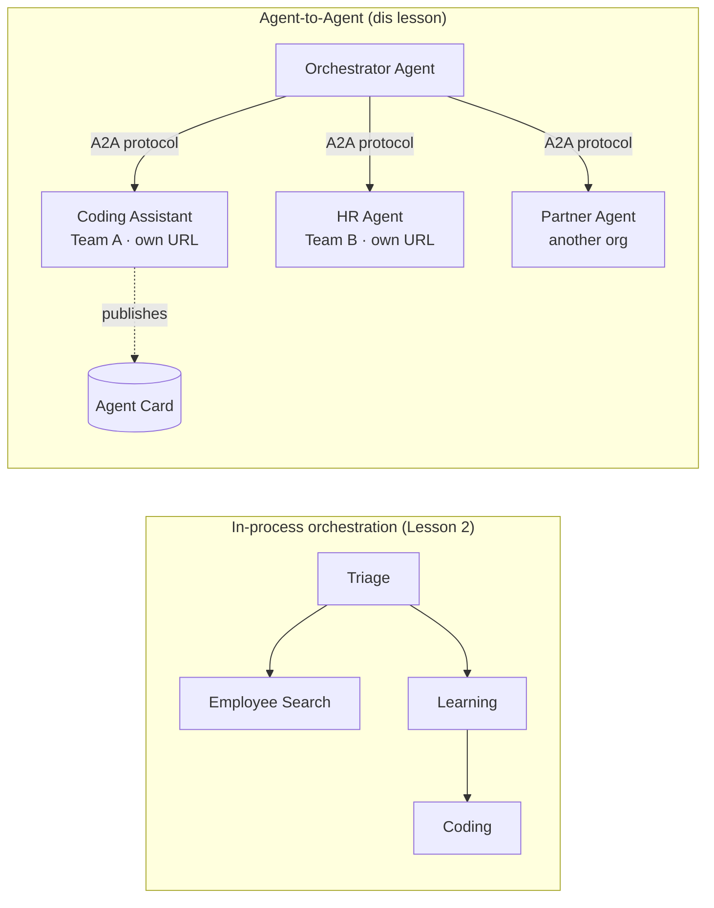

# Lesson 7: Multi-Agent Orchestration & Agent-to-Agent (A2A)

By [Lesson 6](../lesson-6-toolbox/README.md) you fit build governed tools and hosted agents.
But real systems no dey use **one** agent only. As you dey scale, you go dey join **many** agents — some na your own,
some na other teams own, some dey run for other organisations completely. Dis lesson na about
how agents dey work **together**.

You don already meet one kain multi-agent design before for
[Lesson 2's `agent-orchestration.py`](../lesson-2-agent-development/README.md): the **handoff**
pattern, where triage agent go direct things to specialists **inside one process**. Dis lesson go
one level up — to **Agent-to-Agent (A2A)**, di open protocol for agents wey dey run as independent
**networked services** and dem dey call each other across process, team, and organisational boundaries.

## Learning Objectives

By di time you finish dis lesson, you go fit:

- Explain di difference between **in-process orchestration** (handoff/workflows) and
  **Agent-to-Agent (A2A)** communication, and choose correct one.
- Describe di A2A building blocks: **Agent Card**, **skills**, **tasks**, and **discovery**.
- **Expose** Microsoft Agent Framework agent as A2A service with `A2AExecutor`.
- **Consume** remote agent as networked peer with `A2AAgent`.
- Apply enterprise mata to A2A: **security, identity, governance, observability, and cost**.

---

## Prerequisites

1. You go don finish [Lesson 2](../lesson-2-agent-development/README.md) (agent development & orchestration).
2. Get **Microsoft Foundry** project with running model deployment (for example `gpt-5.1`, and
   `gpt-5-codex` for coding sample). No use retired GPT-4o / GPT-4.1.
3. **Azure CLI** must don authenticate: `az login`.
4. **Python 3.12+** and course dependencies install don complete (`pip install -r ../requirements.txt`).
   Lesson 7 go add preview `agent-framework-a2a`, `a2a-sdk`, and `uvicorn` packages.
5. `FOUNDRY_PROJECT_ENDPOINT` and `FOUNDRY_MODEL` must set for your `.env` (look the course README).

---

## 1. Two ways agents dey work together

No be only one "multi-agent" pattern dey. Choose the one wey  fit your **boundary** well:

| Pattern | Where agents run | How dem connect | When to use am |
|---------|------------------|------------------|--------------|
| **Handoff / Workflow** (Lesson 2) | One process, one codebase | In-memory graph (`HandoffBuilder`, `WorkflowBuilder`) | You get all the agents and you deploy all of dem together. |
| **Agent-to-Agent (A2A)** (dis lesson) | Separate services, separate lifecycles | Open **A2A protocol** over HTTP, discover through **Agent Cards** | Agents belong to different teams/orgs, dem fit scale separately, or dem write am for different frameworks. |

Handoff na about **routing inside one app**. A2A na about **joining agents as
independent services** — na like to move from function calls to microservices.



> **Dem fit join.** Orchestrator wey you build wit `HandoffBuilder` fit get **remote A2A agents**
> as participants — in-process routing go services wey fit run anywhere.

---

## 2. The A2A building blocks

A2A na **open protocol** (no be only Microsoft own), so A2A agent fit get consumed by Microsoft
Agent Framework, LangGraph, custom code, or any other company stack. Four tins matter:

- **Agent Card** — small JSON document, wey e for dey for
  `/.well-known/agent-card.json`, wey dey show the agent's **name, description, URL, version,
  skills, and capabilities**. Na so client fit **discover** wetin remote agent fit do.
- **Skills** — the things the agent talk say e fit do (`id`, `name`, `description`, `tags`,
  `examples`). Clients (and models) go use dis one to decide if dem go call am.
- **Tasks** — call go A2A agent na **task** wey get lifecycle (submitted → working →
  completed/failed). Server dey track tasks inside **task store**; streaming updates dey supported.
- **Discovery** — client wey only get URL go fetch Agent Card and know how to  call the agent.

---

## 3. Expose agent as A2A service — `a2a_server.py`

The **Build/serve** side dey wrap any Microsoft Agent Framework agent with `A2AExecutor` and e mount am
for A2A HTTP application. Check [`a2a_server.py`](../../../lesson-7-multi-agent-a2a/a2a_server.py). Na di main wiring be dis:

```python
from agent_framework.a2a import A2AExecutor
from a2a.server.apps import A2AStarletteApplication
from a2a.server.request_handlers import DefaultRequestHandler
from a2a.server.tasks import InMemoryTaskStore
from a2a.types import AgentCapabilities, AgentCard, AgentSkill

agent = client.as_agent(name="coding-assistant", instructions="...")

agent_card = AgentCard(
    name="Coding Assistant",
    description="Generates runnable code samples...",
    url="http://localhost:9000/",
    version="1.0.0",
    capabilities=AgentCapabilities(streaming=True),
    default_input_modes=["text"],
    default_output_modes=["text"],
    skills=[AgentSkill(id="generate-code", name="Generate code",
                       description="Write a runnable code snippet.", tags=["code"])],
)

request_handler = DefaultRequestHandler(
    agent_executor=A2AExecutor(agent),
    task_store=InMemoryTaskStore(),
)
app = A2AStarletteApplication(agent_card=agent_card, http_handler=request_handler).build()
# dem serve am wit uvicorn for port 9000
```

Notice say agent code no change — `A2AExecutor` na im dey adapt your existing agent to di protocol.
The Agent Card na im make am **discoverable** to any A2A client.

---

## 4. Consume remote agent — `a2a_client.py`

The **Consume** side dey connect to remote agent **by URL**, e fetch im Agent Card, then e call am
like na local agent. See [`a2a_client.py`](../../../lesson-7-multi-agent-a2a/a2a_client.py):

```python
from agent_framework.a2a import A2AAgent

remote_agent = A2AAgent(name="remote-coding-assistant", url="http://localhost:9000")
result = await remote_agent.run("Write a Python function that reverses a string.")
print(result.text)
```

Na dis di koko of A2A: from caller side, remote agent behave as normal
`agent_framework` agent, so you fit drop am inside any workflow or hand-off am — even if e dey run
inside different process, different machine, or na other team own be dat.

### Run am from beginning to end

```bash
# Terminal 1 — strat di A2A service
python a2a_server.py

# Terminal 2 — make di call
python a2a_client.py "Write a Python function that reverses a string."
```

You go see coding assistant response come true through the A2A protocol. Open
`http://localhost:9000/.well-known/agent-card.json` for browser to see di published Agent Card.

---

## 5. Enterprise concerns

To turn agents to networked services dey bring the same wahala as any distributed system —
plus some AI-specific ones:


- **Identity & authentication.** No ever show A2A agent wey no get authentication. Di Agent Card carry
  `security` / `security_schemes`, and `A2AAgent` dey accept `auth_interceptor` so callers fit attach
  credentials (OAuth bearer tokens, API keys). Make you use Entra ID / managed identities for
  service-to-service auth for production; put di service behind gateway.
- **Governance.** Combine A2A wit [Lesson 6's Toolbox](../lesson-6-toolbox/README.md): remote
  agent fit publish as **A2A tool** wey dey inside governed toolbox so RBAC, credential injection,
  and guardrail policies fit apply well for one place.
- **Observability.** Request now dey cross process boundary, so make tracing cross di call too.
  Enable [Foundry Observability / OpenTelemetry](../lesson-3-agent-evals/README.md) for **both** di
  orchestrator and each remote agent so you go get one complete end-to-end trace.
- **Versioning.** Di Agent Card get `version` inside. Make you treat am like API: additive changes dey safe;
  if you go break skill's contract, you need new version plus migration time for consumers.
- **Reliability.** Remote agents fit fail on their own. Set timeouts (`A2AAgent(timeout=...)`), handle
  partial failure, and no allow one slow peer block the whole orchestration.
- **Cost.** Every remote agent call na separate model invocation. Fan-out fit multiply token use —
  plan budget for am, and prefer to route to **one** best agent than to broadcast to many.

---

## Hands-on exercises

1. **Add another service.** Copy `a2a_server.py` make you show the **employee-search** agent for port
   9001 wit im own Agent Card and skills. Run both together, and make client call each one.
2. **Orchestrate remote peers.** Build small `HandoffBuilder` (or simple router) wey participant
   na two `A2AAgent`s wey dey point to your two services. Route query to correct one.
3. **Secure am.** Add `auth_interceptor` to client and require bearer token for server side.
   Wetin go break if token dey miss? Where you go fit keep token for production?
4. **Handoff vs A2A.** Write two short paragraph: when you go keep Lesson 2 in-process
   handoff, and when the extra complication of A2A dey necessary? Give one clear example for each.

---

## Resources

- [Agent-to-Agent (A2A) — Microsoft Agent Framework](https://learn.microsoft.com/agent-framework/user-guide/agent-orchestration/a2a)
- [Multi-agent orchestration — Microsoft Agent Framework](https://learn.microsoft.com/agent-framework/user-guide/agent-orchestration/)
- [A2A protocol specification](https://a2a-protocol.org/)
- [A2A Python SDK (`a2a-sdk`)](https://github.com/a2aproject/a2a-python)
- [Foundry Agent Service — multi-agent patterns](https://learn.microsoft.com/azure/ai-foundry/agents/concepts/connected-agents)

---

**Previous:** [Lesson 6 — Microsoft Toolbox](../lesson-6-toolbox/README.md)

---

<!-- CO-OP TRANSLATOR DISCLAIMER START -->
**Disclaimer**:
Dis document don translate wit AI translation service [Co-op Translator](https://github.com/Azure/co-op-translator). Even tho we dey try make am correct, abeg make you know say automated translation fit get errors or mistakes. Di original document for dia own language na im be di correct source. For important info, make person wey sabi human translation do am. We no go responsible for any misunderstanding or wrong understanding wey fit happen because of dis translation.
<!-- CO-OP TRANSLATOR DISCLAIMER END -->