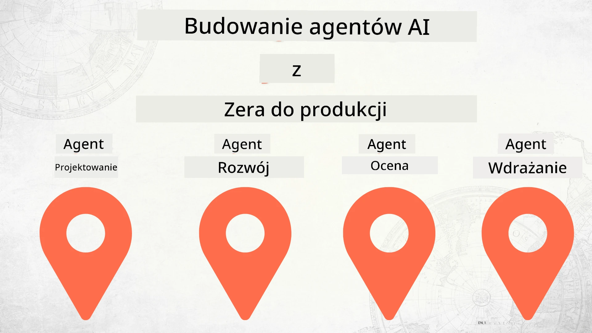

# Tworzenie Agentów AI od Zera do Produkcji



### 🌐 Wsparcie Wielojęzyczne

#### Obsługiwane za pomocą GitHub Action (Automatyczne i Zawsze Aktualne)

<!-- CO-OP TRANSLATOR LANGUAGES TABLE START -->
[Arabski](../ar/README.md) | [Bengalski](../bn/README.md) | [Bułgarski](../bg/README.md) | [Birmański (Myanmar)](../my/README.md) | [Chiński (Uproszczony)](../zh-CN/README.md) | [Chiński (Tradycyjny, Hongkong)](../zh-HK/README.md) | [Chiński (Tradycyjny, Makau)](../zh-MO/README.md) | [Chiński (Tradycyjny, Tajwan)](../zh-TW/README.md) | [Chorwacki](../hr/README.md) | [Czeski](../cs/README.md) | [Duński](../da/README.md) | [Holenderski](../nl/README.md) | [Estoński](../et/README.md) | [Fiński](../fi/README.md) | [Francuski](../fr/README.md) | [Niemiecki](../de/README.md) | [Grecki](../el/README.md) | [Hebrajski](../he/README.md) | [Hindi](../hi/README.md) | [Węgierski](../hu/README.md) | [Indonezyjski](../id/README.md) | [Włoski](../it/README.md) | [Japoński](../ja/README.md) | [Kannada](../kn/README.md) | [Koreański](../ko/README.md) | [Litewski](../lt/README.md) | [Malajski](../ms/README.md) | [Malayalam](../ml/README.md) | [Marathi](../mr/README.md) | [Nepalski](../ne/README.md) | [Pidgin Nigeryjski](../pcm/README.md) | [Norweski](../no/README.md) | [Perski (Farsi)](../fa/README.md) | [Polski](./README.md) | [Portugalski (Brazylia)](../pt-BR/README.md) | [Portugalski (Portugalia)](../pt-PT/README.md) | [Pendżabski (Gurmukhi)](../pa/README.md) | [Rumuński](../ro/README.md) | [Rosyjski](../ru/README.md) | [Serbski (Cyrylica)](../sr/README.md) | [Słowacki](../sk/README.md) | [Słoweński](../sl/README.md) | [Hiszpański](../es/README.md) | [Suaheli](../sw/README.md) | [Szwedzki](../sv/README.md) | [Tagalog (Filipiński)](../tl/README.md) | [Tamilski](../ta/README.md) | [Telugu](../te/README.md) | [Tajski](../th/README.md) | [Turecki](../tr/README.md) | [Ukraiński](../uk/README.md) | [Urdu](../ur/README.md) | [Wietnamski](../vi/README.md)

> **Wolisz klonować lokalnie?**
>
> To repozytorium zawiera ponad 50 tłumaczeń, co znacznie zwiększa rozmiar pobierania. Aby sklonować bez tłumaczeń, użyj sparse checkout:
>
> **Bash / macOS / Linux:**
> ```bash
> git clone --filter=blob:none --sparse https://github.com/microsoft/Building-AI-Agents-From-Zero-To-Production.git
> cd Building-AI-Agents-From-Zero-To-Production
> git sparse-checkout set --no-cone '/*' '!translations' '!translated_images'
> ```
>
> **CMD (Windows):**
> ```cmd
> git clone --filter=blob:none --sparse https://github.com/microsoft/Building-AI-Agents-From-Zero-To-Production.git
> cd Building-AI-Agents-From-Zero-To-Production
> git sparse-checkout set --no-cone "/*" "!translations" "!translated_images"
> ```
>
> Dzięki temu otrzymasz wszystko, co potrzebne do ukończenia kursu, przy dużo szybszym pobieraniu.
<!-- CO-OP TRANSLATOR LANGUAGES TABLE END -->

## Kurs uczący podstaw cyklu życia tworzenia Agentów AI

[](https://github.com/microsoft/Building-AI-Agents-From-Zero-To-Production/blob/master/LICENSE?WT.mc_id=academic-105485-koreyst)
[](https://GitHub.com/microsoft/Building-AI-Agents-From-Zero-To-Production/graphs/contributors/?WT.mc_id=academic-105485-koreyst)
[](https://GitHub.com/microsoft/Building-AI-Agents-From-Zero-To-Production/issues/?WT.mc_id=academic-105485-koreyst)
[](https://GitHub.com/microsoft/Building-AI-Agents-From-Zero-To-Production/pulls/?WT.mc_id=academic-105485-koreyst)
[](http://makeapullrequest.com?WT.mc_id=academic-105485-koreyst)

[](https://discord.gg/Kuaw3ktsu6)

## 🌱 Zaczynamy

Ten kurs zawiera lekcje obejmujące podstawy tworzenia i wdrażania Agentów AI.

Każda lekcja buduje na poprzedniej, więc zalecamy rozpoczęcie od początku i kontynuowanie aż do końca.

Jeśli chcesz zgłębić więcej tematów dotyczących Agentów AI, możesz sprawdzić [Kurs AI Agents dla Początkujących](https://aka.ms/ai-agents-beginners).

### Poznaj innych uczniów, uzyskaj odpowiedzi na swoje pytania

Jeśli utkniesz lub masz pytania dotyczące budowy Agentów AI, dołącz do naszego dedykowanego kanału Discord w [Microsoft Foundry Discord](https://discord.gg/Kuaw3ktsu6).

### Czego potrzebujesz

Każda lekcja ma własny przykład kodu, który możesz uruchomić lokalnie. Możesz [forkować to repozytorium](https://github.com/microsoft/Building-AI-Agents-From-Zero-To-Production/fork), aby utworzyć własną kopię.

Ten kurs obecnie korzysta z następujących narzędzi:

- [Microsoft Agent Framework (MAF)](https://aka.ms/ai-agents-beginners/agent-framework)
- [Microsoft Foundry](https://azure.microsoft.com/products/ai-foundry)
- [Azure OpenAI Service](https://azure.microsoft.com/products/ai-foundry/models/openai)
- [Azure CLI](https://learn.microsoft.com/cli/azure/authenticate-azure-cli?view=azure-cli-latest)

Proszę upewnij się, że masz dostęp do tych usług przed rozpoczęciem.

Więcej opcji dotyczących hostingu modeli i usług pojawi się wkrótce.

## 🗃️ Lekcje

| **Lekcja**            | **Opis**                                                                                              |
|-----------------------|-----------------------------------------------------------------------------------------------------|
| [Projektowanie Agenta](./lesson-1-agent-design/README.md)       | Wprowadzenie do naszego przypadku użycia "Developer Onboarding" Agenta oraz jak projektować skutecznych agentów |
| [Tworzenie Agenta](./lesson-2-agent-development/README.md)     | Korzystając z Microsoft Agent Framework (MAF), stwórz 3 agentów, którzy pomogą nowym programistom przy onboardingu. |
| [Oceny Agentów](./lesson-3-agent-evals/README.md)               | Korzystając z Microsoft Foundry, dowiedz się, jak dobrze działają nasi Agenci AI i jak je ulepszyć.                 |
| [Wdrażanie Agenta](./lesson-4-agent-deployment/README.md)      | Korzystając z Hosted Agents i OpenAI Chatkit, zobacz, jak wdrożyć Agenta AI do produkcji.                           |

## 🎒 Inne kursy

Nasz zespół tworzy również inne kursy! Sprawdź:

<!-- CO-OP TRANSLATOR OTHER COURSES START -->
### LangChain
[](https://aka.ms/langchain4j-for-beginners)
[](https://aka.ms/langchainjs-for-beginners?WT.mc_id=m365-94501-dwahlin)
[](https://github.com/microsoft/langchain-for-beginners?WT.mc_id=m365-94501-dwahlin)
---

### Azure / Edge / MCP / Agenci
[](https://github.com/microsoft/AZD-for-beginners?WT.mc_id=academic-105485-koreyst)
[](https://github.com/microsoft/edgeai-for-beginners?WT.mc_id=academic-105485-koreyst)
[](https://github.com/microsoft/mcp-for-beginners?WT.mc_id=academic-105485-koreyst)
[](https://github.com/microsoft/ai-agents-for-beginners?WT.mc_id=academic-105485-koreyst)

---
 
### Seria Generatywnej AI
[](https://github.com/microsoft/generative-ai-for-beginners?WT.mc_id=academic-105485-koreyst)
[-9333EA?style=for-the-badge&labelColor=E5E7EB&color=9333EA)](https://github.com/microsoft/Generative-AI-for-beginners-dotnet?WT.mc_id=academic-105485-koreyst)
[-C084FC?style=for-the-badge&labelColor=E5E7EB&color=C084FC)](https://github.com/microsoft/generative-ai-for-beginners-java?WT.mc_id=academic-105485-koreyst)
[-E879F9?style=for-the-badge&labelColor=E5E7EB&color=E879F9)](https://github.com/microsoft/generative-ai-with-javascript?WT.mc_id=academic-105485-koreyst)

---
 
### Podstawy Nauki
[](https://aka.ms/ml-beginners?WT.mc_id=academic-105485-koreyst)
[](https://aka.ms/datascience-beginners?WT.mc_id=academic-105485-koreyst)
[](https://aka.ms/ai-beginners?WT.mc_id=academic-105485-koreyst)
[](https://github.com/microsoft/Security-101?WT.mc_id=academic-96948-sayoung)
[](https://aka.ms/webdev-beginners?WT.mc_id=academic-105485-koreyst)
[](https://aka.ms/iot-beginners?WT.mc_id=academic-105485-koreyst)
[](https://github.com/microsoft/xr-development-for-beginners?WT.mc_id=academic-105485-koreyst)

---
 
### Seria Copilot
[](https://aka.ms/GitHubCopilotAI?WT.mc_id=academic-105485-koreyst)
[](https://github.com/microsoft/mastering-github-copilot-for-dotnet-csharp-developers?WT.mc_id=academic-105485-koreyst)
[](https://github.com/microsoft/CopilotAdventures?WT.mc_id=academic-105485-koreyst)
<!-- CO-OP TRANSLATOR OTHER COURSES END -->

## Wkład

Ten projekt zaprasza do składania wkładów i sugestii. Większość wkładów wymaga, abyś zgodził się na
Umowę Licencyjną Współtwórcy (CLA), deklarując, że masz prawo, oraz faktycznie udzielasz
nam praw do korzystania z Twojego wkładu. Szczegóły znajdziesz na <https://cla.opensource.microsoft.com>.

Gdy zgłaszasz pull request, bot CLA automatycznie określi, czy musisz dostarczyć
CLA i odpowiednio oznaczy PR (np. sprawdzenie statusu, komentarz). Po prostu postępuj zgodnie z instrukcjami
podanymi przez bota. Będziesz musiał to zrobić tylko raz we wszystkich repozytoriach korzystających z naszej CLA.

Projekt ten przyjął [Microsoft Open Source Code of Conduct](https://opensource.microsoft.com/codeofconduct/).
Więcej informacji znajdziesz w [Code of Conduct FAQ](https://opensource.microsoft.com/codeofconduct/faq/) lub
skontaktuj się z [opencode@microsoft.com](mailto:opencode@microsoft.com) w razie dodatkowych pytań lub uwag.

## Znaki towarowe

Projekt może zawierać znaki towarowe lub logotypy projektów, produktów lub usług. Autoryzowane użycie znaków towarowych lub logotypów Microsoft
jest uzależnione od i musi być zgodne z
[Microsoft's Trademark & Brand Guidelines](https://www.microsoft.com/legal/intellectualproperty/trademarks/usage/general).
Użycie znaków towarowych lub logotypów Microsoft w zmodyfikowanych wersjach tego projektu nie może powodować nieporozumień ani sugerować sponsorowania przez Microsoft.
Wszelkie użycie znaków towarowych lub logotypów stron trzecich podlega politykom tych stron.

## Uzyskanie pomocy

Jeśli utkniesz lub masz pytania dotyczące tworzenia aplikacji AI, dołącz do:

[](https://discord.gg/Kuaw3ktsu6)

Jeśli masz opinie o produkcie lub występują błędy podczas tworzenia, odwiedź:

[](https://aka.ms/foundry/forum)

---

<!-- CO-OP TRANSLATOR DISCLAIMER START -->
**Oświadczenie**:  
Niniejszy dokument został przetłumaczony za pomocą usługi tłumaczenia AI [Co-op Translator](https://github.com/Azure/co-op-translator). Chociaż dążymy do dokładności, prosimy mieć na uwadze, że automatyczne tłumaczenia mogą zawierać błędy lub nieścisłości. Oryginalny dokument w języku oryginalnym powinien być traktowany jako dokument źródłowy. W przypadku istotnych informacji zalecane jest skorzystanie z profesjonalnego tłumaczenia wykonanego przez człowieka. Nie ponosimy odpowiedzialności za jakiekolwiek nieporozumienia lub błędne interpretacje wynikające z korzystania z tego tłumaczenia.
<!-- CO-OP TRANSLATOR DISCLAIMER END -->