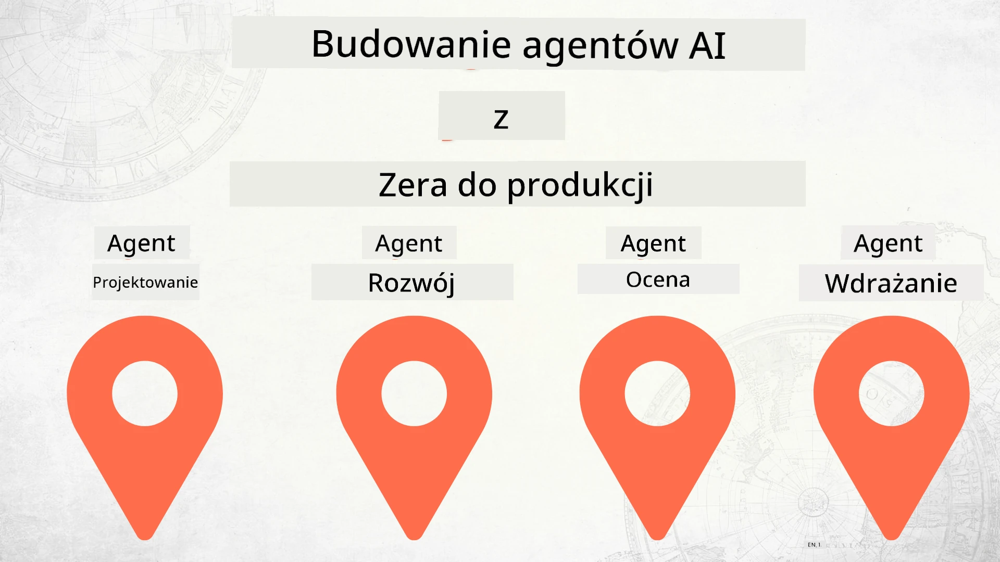

# Tworzenie agentów AI od podstaw do produkcji



### 🌐 Obsługa wielojęzykowa

#### Obsługiwane przez GitHub Action (automatyczne i zawsze aktualne)

<!-- CO-OP TRANSLATOR LANGUAGES TABLE START -->
[Arabski](../ar/README.md) | [Bengalski](../bn/README.md) | [Bułgarski](../bg/README.md) | [Birmański (Myanmar)](../my/README.md) | [Chiński (uproszczony)](../zh-CN/README.md) | [Chiński (tradycyjny, Hongkong)](../zh-HK/README.md) | [Chiński (tradycyjny, Makau)](../zh-MO/README.md) | [Chiński (tradycyjny, Tajwan)](../zh-TW/README.md) | [Chorwacki](../hr/README.md) | [Czeski](../cs/README.md) | [Duński](../da/README.md) | [Niderlandzki](../nl/README.md) | [Estoński](../et/README.md) | [Fiński](../fi/README.md) | [Francuski](../fr/README.md) | [Niemiecki](../de/README.md) | [Grecki](../el/README.md) | [Hebrajski](../he/README.md) | [Hindi](../hi/README.md) | [Węgierski](../hu/README.md) | [Indonezyjski](../id/README.md) | [Włoski](../it/README.md) | [Japoński](../ja/README.md) | [Kannada](../kn/README.md) | [Khmer](../km/README.md) | [Koreański](../ko/README.md) | [Litewski](../lt/README.md) | [Malajski](../ms/README.md) | [Malayalam](../ml/README.md) | [Marathi](../mr/README.md) | [Nepalski](../ne/README.md) | [Nigeryjski pidgin](../pcm/README.md) | [Norweski](../no/README.md) | [Perski (farsi)](../fa/README.md) | [Polski](./README.md) | [Portugalski (Brazylia)](../pt-BR/README.md) | [Portugalski (Portugalia)](../pt-PT/README.md) | [Pendżabski (Gurmukhi)](../pa/README.md) | [Rumuński](../ro/README.md) | [Rosyjski](../ru/README.md) | [Serbski (cyrylica)](../sr/README.md) | [Słowacki](../sk/README.md) | [Słoweński](../sl/README.md) | [Hiszpański](../es/README.md) | [Suahili](../sw/README.md) | [Szwedzki](../sv/README.md) | [Tagalog (filipiński)](../tl/README.md) | [Tamilski](../ta/README.md) | [Telugu](../te/README.md) | [Tajski](../th/README.md) | [Turecki](../tr/README.md) | [Ukraiński](../uk/README.md) | [Urdu](../ur/README.md) | [Wietnamski](../vi/README.md)

> **Wolisz klonować lokalnie?**
>
> To repozytorium zawiera tłumaczenia na ponad 50 języków, co znacznie zwiększa rozmiar pobierania. Aby sklonować bez tłumaczeń, użyj sparse checkout:
>
> **Bash / macOS / Linux:**
> ```bash
> git clone --filter=blob:none --sparse https://github.com/microsoft/Building-AI-Agents-From-Zero-To-Production.git
> cd Building-AI-Agents-From-Zero-To-Production
> git sparse-checkout set --no-cone '/*' '!translations' '!translated_images'
> ```
>
> **CMD (Windows):**
> ```cmd
> git clone --filter=blob:none --sparse https://github.com/microsoft/Building-AI-Agents-From-Zero-To-Production.git
> cd Building-AI-Agents-From-Zero-To-Production
> git sparse-checkout set --no-cone "/*" "!translations" "!translated_images"
> ```
>
> To dostarczy wszystkiego, czego potrzebujesz, aby ukończyć kurs, a pobieranie będzie dużo szybsze.
<!-- CO-OP TRANSLATOR LANGUAGES TABLE END -->

## Kurs uczący fundamentów cyklu życia tworzenia agentów AI

[](https://github.com/microsoft/Building-AI-Agents-From-Zero-To-Production/blob/master/LICENSE?WT.mc_id=academic-105485-koreyst)
[](https://GitHub.com/microsoft/Building-AI-Agents-From-Zero-To-Production/graphs/contributors/?WT.mc_id=academic-105485-koreyst)
[](https://GitHub.com/microsoft/Building-AI-Agents-From-Zero-To-Production/issues/?WT.mc_id=academic-105485-koreyst)
[](https://GitHub.com/microsoft/Building-AI-Agents-From-Zero-To-Production/pulls/?WT.mc_id=academic-105485-koreyst)
[](http://makeapullrequest.com?WT.mc_id=academic-105485-koreyst)

[](https://discord.gg/Kuaw3ktsu6)

## 🌱 Rozpoczęcie

Ten kurs zawiera lekcje dotyczące podstaw tworzenia i wdrażania agentów AI.

Każda lekcja opiera się na poprzedniej, więc zalecamy rozpoczęcie od początku i przechodzenie kolejno do końca.

Jeśli chcesz zgłębić więcej tematów dotyczących agentów AI, możesz sprawdzić [Kurs dla początkujących Agentów AI](https://aka.ms/ai-agents-beginners).

### Spotkaj innych uczniów i uzyskaj odpowiedzi na pytania

Jeśli utkniesz lub masz pytania dotyczące tworzenia agentów AI, dołącz do naszego dedykowanego Kanału Discord w [Microsoft Foundry Discord](https://discord.gg/Kuaw3ktsu6).

### Co jest potrzebne

Każda lekcja zawiera własny przykład kodu, który możesz uruchomić lokalnie. Możesz [sforkować to repozytorium](https://github.com/microsoft/Building-AI-Agents-From-Zero-To-Production/fork), aby utworzyć własną kopię.

Obecnie kurs korzysta z następujących narzędzi:

- [Microsoft Agent Framework (MAF)](https://aka.ms/ai-agents-beginners/agent-framework)
- [Microsoft Foundry](https://azure.microsoft.com/products/ai-foundry) — projekt z modelem z serii **GPT-5** (np. `gpt-5.1`). Nie używaj modeli wycofanych GPT-4o / GPT-4.1.
- [Azure OpenAI Service](https://azure.microsoft.com/products/ai-foundry/models/openai)
- [Azure CLI](https://learn.microsoft.com/cli/azure/authenticate-azure-cli?view=azure-cli-latest) — zaloguj się poleceniem `az login` przed uruchomieniem jakiegokolwiek przykładu
- **Python 3.12 lub nowszy**

Upewnij się, że masz dostęp do tych usług przed rozpoczęciem.

> **💰 Koszt i sprzątanie.** Lekcje praktyczne tworzą rzeczywiste zasoby Azure — projekt Microsoft Foundry,
> wdrożenie modelu, magazyn wektorowy oraz (w lekcjach 4–6) hostowanych agentów i zestawy narzędzi.
> Te zasoby mogą generować koszty tak długo, jak istnieją. Po zakończeniu lekcji — lub kursu —
> usuń zasoby, których nie potrzebujesz. Najprościej jest umieścić wszystko w dedykowanej grupie zasobów
> i usunąć całą grupę po zakończeniu:
>
> ```bash
> az group delete --name <your-resource-group> --yes --no-wait
> ```
>
> Możesz też usuwać pojedynczych agentów, magazyny wektorów i zestawy narzędzi z portalu Foundry.

> **Uwaga na modele.** Ten kurs korzysta ze wszystkich modeli za pośrednictwem **Microsoft Foundry**. Nie używa on *GitHub Models*, które zostaną wycofane 30 lipca 2026 r. — Microsoft Foundry to
> oficjalna ścieżka migracji. Jeśli masz starszy kod korzystający z GitHub Models, skieruj go na wdrożenie modelu Foundry.


Wkrótce pojawią się kolejne opcje dotyczące hostowania modeli i usług. 

## 🗃️ Lekcje

| **Lekcja**         | **Opis**                                                                                  |
|--------------------|--------------------------------------------------------------------------------------------------|
| [Projektowanie agenta](./lesson-1-agent-design/README.md)       | Wprowadzenie do przypadku użycia agenta „Onboarding dewelopera” oraz jak projektować efektywnych agentów  |
| [Tworzenie agenta](./lesson-2-agent-development/README.md)  | Za pomocą Microsoft Agent Framework (MAF) zbuduj zestaw wyspecjalizowanych agentów wspierających nowych deweloperów.       |
| [Oceny agentów](./lesson-3-agent-evals/README.md)  | Korzystając z Microsoft Foundry sprawdź, jak działają nasi agenci AI i jak ich poprawić. |
| [Wdrożenie agenta](./lesson-4-agentdeployment/README.md)   | Za pomocą hostowanych agentów Microsoft Foundry i OpenAI ChatKit naucz się wdrażać agenta AI do produkcji.       |
| [Hostowani agenci produkcyjni](./lesson-5-hosted-agents-production/README.md)   | Wdróż hostowanego agenta do produkcji korporacyjnej: hostowani agenci vs hosty zdolności, własna pamięć, magazyn i zarządzanie.       |
| [Narzędzia Microsoft](./lesson-6-toolbox/README.md)   | Zdefiniuj narzędzia raz i zarządzaj nimi centralnie: zbuduj zestaw narzędzi, korzystaj z niego przez jedną końcówkę MCP i wersjonuj narzędzia bezpiecznie.       |
| [Agenci wieloosobowi & A2A](./lesson-7-multi-agent-a2a/README.md)   | Komponuj agentów jako usługi sieciowe: udostępnij agenta przez otwarty protokół Agent-to-Agent (A2A) i korzystaj z zdalnego agenta jako peer.       |


## 🎒 Inne kursy

Nasz zespół tworzy także inne kursy! Sprawdź:

<!-- CO-OP TRANSLATOR OTHER COURSES START -->
### LangChain
[](https://aka.ms/langchain4j-for-beginners)
[](https://aka.ms/langchainjs-for-beginners?WT.mc_id=m365-94501-dwahlin)
[](https://github.com/microsoft/langchain-for-beginners?WT.mc_id=m365-94501-dwahlin)
---

### Azure / Edge / MCP / Agenci
[](https://github.com/microsoft/AZD-for-beginners?WT.mc_id=academic-105485-koreyst)
[](https://github.com/microsoft/edgeai-for-beginners?WT.mc_id=academic-105485-koreyst)
[](https://github.com/microsoft/mcp-for-beginners?WT.mc_id=academic-105485-koreyst)
[](https://github.com/microsoft/ai-agents-for-beginners?WT.mc_id=academic-105485-koreyst)

---
 
### Seria Generatywnej AI

[](https://github.com/microsoft/generative-ai-for-beginners?WT.mc_id=academic-105485-koreyst)
[-9333EA?style=for-the-badge&labelColor=E5E7EB&color=9333EA)](https://github.com/microsoft/Generative-AI-for-beginners-dotnet?WT.mc_id=academic-105485-koreyst)
[-C084FC?style=for-the-badge&labelColor=E5E7EB&color=C084FC)](https://github.com/microsoft/generative-ai-for-beginners-java?WT.mc_id=academic-105485-koreyst)
[-E879F9?style=for-the-badge&labelColor=E5E7EB&color=E879F9)](https://github.com/microsoft/generative-ai-with-javascript?WT.mc_id=academic-105485-koreyst)

---
 
### Podstawowe Nauki
[](https://aka.ms/ml-beginners?WT.mc_id=academic-105485-koreyst)
[](https://aka.ms/datascience-beginners?WT.mc_id=academic-105485-koreyst)
[](https://aka.ms/ai-beginners?WT.mc_id=academic-105485-koreyst)
[](https://github.com/microsoft/Security-101?WT.mc_id=academic-96948-sayoung)
[](https://aka.ms/webdev-beginners?WT.mc_id=academic-105485-koreyst)
[](https://aka.ms/iot-beginners?WT.mc_id=academic-105485-koreyst)
[](https://github.com/microsoft/xr-development-for-beginners?WT.mc_id=academic-105485-koreyst)

---
 
### Seria Copilot
[](https://aka.ms/GitHubCopilotAI?WT.mc_id=academic-105485-koreyst)
[](https://github.com/microsoft/mastering-github-copilot-for-dotnet-csharp-developers?WT.mc_id=academic-105485-koreyst)
[](https://github.com/microsoft/CopilotAdventures?WT.mc_id=academic-105485-koreyst)
<!-- CO-OP TRANSLATOR OTHER COURSES END -->

## Wkład w projekt

Ten projekt z radością przyjmuje wkład i sugestie. Większość wkładów wymaga zgody na
Umowę Licencyjną Współtwórcy (CLA), która deklaruje, że masz prawo oraz rzeczywiście udzielasz nam
praw do korzystania z twojego wkładu. Szczegóły znajdziesz na stronie <https://cla.opensource.microsoft.com>.

Po wysłaniu pull request, bot CLA automatycznie określi, czy musisz dostarczyć
CLA i odpowiednio oznaczy PR (np. status, komentarz). Po prostu postępuj zgodnie z instrukcjami
podanymi przez bota. Będziesz musiał to zrobić tylko raz dla wszystkich repozytoriów korzystających z naszego CLA.

Projekt przyjął [Microsoft Open Source Code of Conduct](https://opensource.microsoft.com/codeofconduct/).
Po więcej informacji zobacz [Code of Conduct FAQ](https://opensource.microsoft.com/codeofconduct/faq/) lub
skontaktuj się z [opencode@microsoft.com](mailto:opencode@microsoft.com) w przypadku dodatkowych pytań lub uwag.

## Znaki towarowe

Projekt może zawierać znaki towarowe lub loga projektów, produktów lub usług. Autoryzowane użycie znaków
towarowych lub logotypów Microsoft podlega i musi być zgodne z
[Microsoft's Trademark & Brand Guidelines](https://www.microsoft.com/legal/intellectualproperty/trademarks/usage/general).
Użycie znaków towarowych lub logotypów Microsoft w zmodyfikowanych wersjach tego projektu nie może powodować
nieporozumień ani sugerować wsparcia Microsoft.

## Uzyskanie pomocy

Jeśli utkniesz lub masz pytania dotyczące tworzenia aplikacji AI, dołącz do:

[](https://discord.gg/Kuaw3ktsu6)

Jeśli masz opinię o produkcie lub wystąpiły błędy podczas budowania, odwiedź:

[](https://aka.ms/foundry/forum)

---

<!-- CO-OP TRANSLATOR DISCLAIMER START -->
**Zastrzeżenie**:
Niniejszy dokument został przetłumaczony za pomocą usługi tłumaczenia AI [Co-op Translator](https://github.com/Azure/co-op-translator). Choć dążymy do dokładności, prosimy pamiętać, że automatyczne tłumaczenia mogą zawierać błędy lub niedokładności. Oryginalny dokument w jego języku źródłowym należy uznawać za autorytatywne źródło. W przypadku informacji krytycznych zalecane jest skorzystanie z profesjonalnego tłumaczenia wykonanego przez człowieka. Nie ponosimy odpowiedzialności za jakiekolwiek nieporozumienia lub błędne interpretacje wynikające z użycia tego tłumaczenia.
<!-- CO-OP TRANSLATOR DISCLAIMER END -->