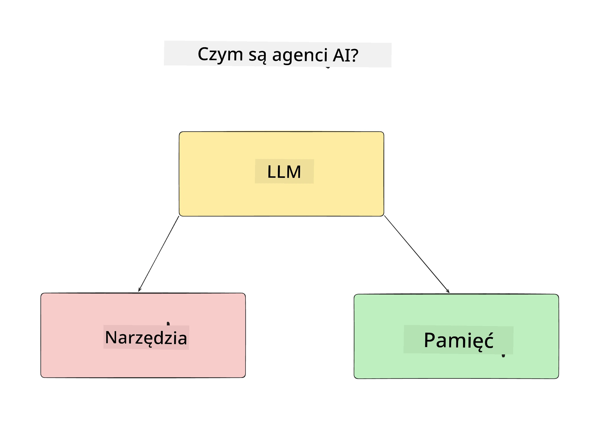
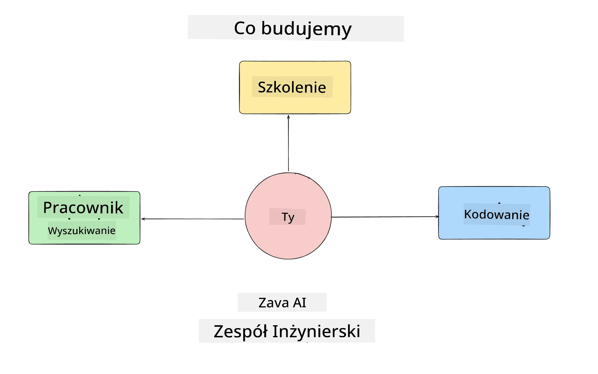
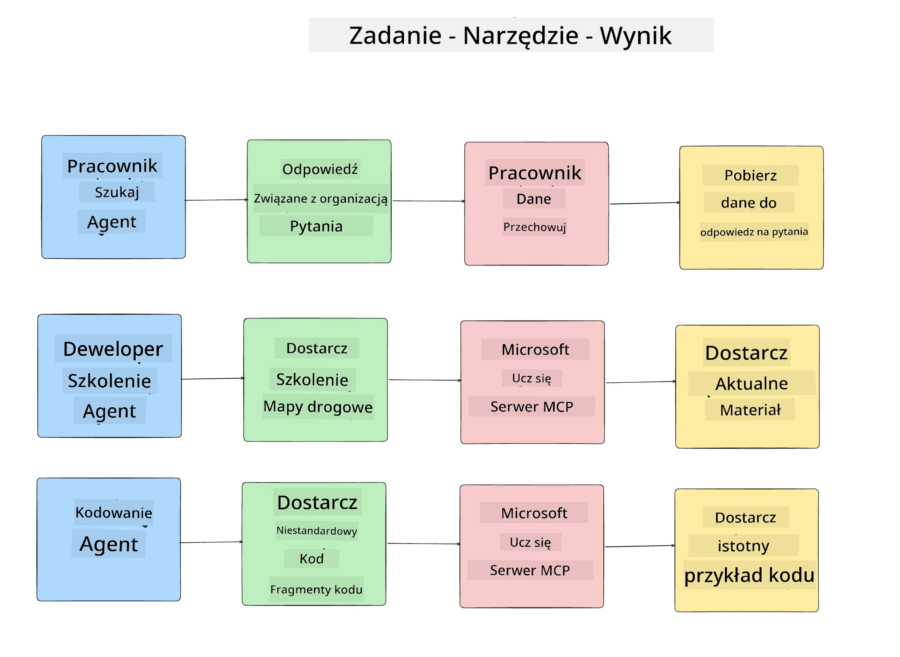
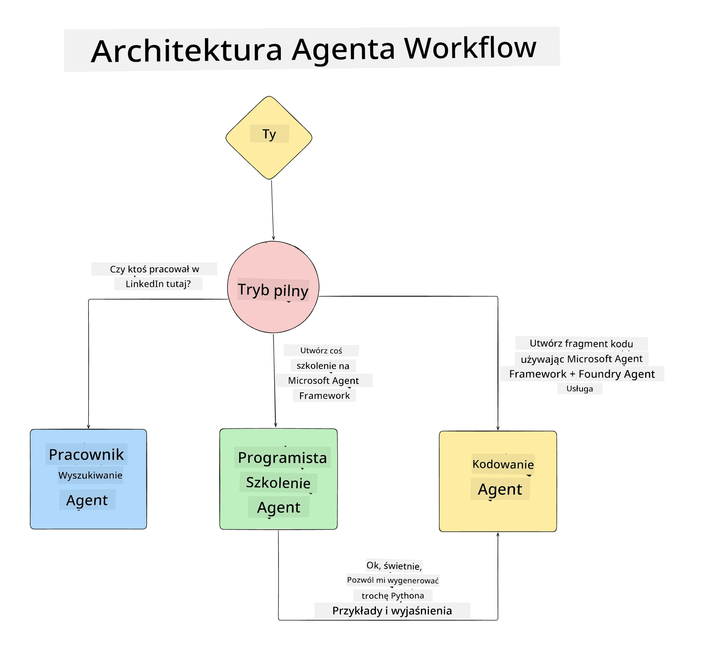

# Lekcja 1: Projektowanie Agenta SI

Witamy w pierwszej lekcji kursu „Budowanie Agenta SI od zera do produkcji”!

W tej lekcji omówimy:

- Definicję czym są Agenty SI
  
- Omówienie aplikacji Agenta SI, którą budujemy  

- Identyfikację wymaganych narzędzi i usług dla każdego agenta
  
- Architektura naszej aplikacji Agenta
  
Zacznijmy od zdefiniowania czym jest agent i dlaczego chcielibyśmy go używać w aplikacji.

> **Zanim zaczniesz kurs.** Ta pierwsza lekcja jest koncepcyjna — nie ma żadnego kodu do uruchomienia.
> Od [Lekcji 2](../lesson-2-agent-development/README.md) będziesz potrzebować: **subskrypcji Azure** z dostępem do **Microsoft Foundry**, wdrożonego modelu serii **GPT-5** (na przykład `gpt-5.1` — unikaj wycofanych modeli GPT-4o / GPT-4.1), **Python 3.12+** oraz **Azure CLI** (`az login`). Zobacz [Co jest potrzebne](../README.md#what-you-need) w README kursu, aby poznać pełną listę i linki.

## Czym są Agenty SI?

Jeśli jest to Twój pierwszy raz, gdy poznajesz, jak budować Agenta SI, możesz mieć pytania, jak dokładnie zdefiniować, czym jest Agent SI.

Prosty sposób na zdefiniowanie Agenta SI przez składniki, z których się składa:

**Duży Model Językowy** - LLM zapewnia zarówno zdolność do przetwarzania języka naturalnego od użytkownika, aby zinterpretować zadanie, które chce wykonać, jak i interpretację opisów dostępnych narzędzi do realizacji tych zadań.

**Narzędzia** - Są to funkcje, API, magazyny danych i inne usługi, które LLM może wybrać do wykorzystania w celu wykonania zadań zleconych przez użytkownika.

**Pamięć** - To sposób przechowywania zarówno krótkoterminowych, jak i długoterminowych interakcji między Agentem SI a użytkownikiem. Przechowywanie i odzyskiwanie tych informacji jest ważne dla dokonywania usprawnień i zapisywania preferencji użytkownika w czasie.

## Nasz przypadek użycia Agenta SI

W tym kursie zbudujemy aplikację Agenta SI, która pomaga nowym deweloperom dołączyć do naszego Zespołu Rozwoju Agentów SI!

Zanim rozpoczniemy prace programistyczne, pierwszym krokiem do stworzenia udanej aplikacji Agenta SI jest określenie jasnych scenariuszy, jak oczekujemy, że nasi użytkownicy będą współpracować z naszymi Agentami SI.

Dla tej aplikacji będziemy pracować z następującymi scenariuszami:

**Scenariusz 1**: Nowy pracownik dołącza do naszej organizacji i chce dowiedzieć się więcej o zespole, do którego dołączył, oraz jak się z nim połączyć.

**Scenariusz 2:** Nowy pracownik chce dowiedzieć się, jakie będzie najlepsze pierwsze zadanie do rozpoczęcia pracy.

**Scenariusz 3:** Nowy pracownik chce zgromadzić materiały szkoleniowe i przykłady kodu, które pomogą mu rozpocząć realizację tego zadania.

## Identyfikacja narzędzi i usług

Teraz, gdy mamy te scenariusze, następnym krokiem jest dopasowanie ich do narzędzi i usług, które nasi Agenci SI będą potrzebować do realizacji tych zadań.

Ten proces zalicza się do kategorii Inżynierii Kontekstowej, ponieważ skupimy się na zapewnieniu, że nasze Agenty SI będą miały właściwy kontekst we właściwym czasie, aby wykonywać zadania.

Zróbmy to scenariusz po scenariuszu i dokonajmy dobrego projektu agentowego, wymieniając zadanie, narzędzia i oczekiwane wyniki każdego agenta.

### Scenariusz 1 - Agent wyszukiwania pracowników

**Zadanie** - Odpowiadanie na pytania o pracowników w organizacji, takie jak data dołączenia, aktualny zespół, lokalizacja i ostatnie stanowisko.

**Narzędzia** - Magazyn danych z aktualną listą pracowników i schemat organizacyjny

**Wyniki** - Możliwość pobierania informacji z magazynu danych, aby odpowiadać na ogólne pytania organizacyjne oraz konkretne pytania o pracowników.

### Scenariusz 2 - Agent rekomendacji zadań

**Zadanie** - Na podstawie doświadczenia dewelopera nowego pracownika, zaproponować 1-3 zadania, nad którymi nowy pracownik może pracować.

**Narzędzia** - Serwer MCP GitHub do pobierania otwartych problemów i budowania profilu dewelopera

**Wyniki** - Możliwość odczytania ostatnich 5 zatwierdzeń w profilu GitHub oraz otwartych problemów w projekcie GitHub i tworzenie rekomendacji na podstawie dopasowania

### Scenariusz 3 - Agent asystenta kodu

**Zadanie** - Na podstawie otwartych problemów zalecanych przez agenta „Rekomendacja zadań”, wyszukiwanie i dostarczanie zasobów oraz generowanie fragmentów kodu, które pomogą pracownikowi.

**Narzędzia** - Microsoft Learn MCP do znalezienia zasobów oraz Interpreter kodu do generowania niestandardowych fragmentów kodu.

**Wyniki** - Jeśli użytkownik poprosi o dodatkową pomoc, przepływ pracy powinien użyć serwera Learn MCP do dostarczenia linków i fragmentów do zasobów, a następnie przekazać zadanie agentowi Interpreter kodu, aby wygenerować małe fragmenty kodu z wyjaśnieniami.

## Architektura naszej aplikacji Agenta

Teraz, gdy zdefiniowaliśmy każdego z naszych agentów, stwórzmy diagram architektury, który pomoże nam zrozumieć, jak każdy agent będzie współdziałał i pracował oddzielnie w zależności od zadania:

## Kolejne kroki

Teraz, gdy zaprojektowaliśmy każdego agenta i nasz system agentowy, przejdźmy do następnej lekcji, gdzie rozwiniemy każdego z tych agentów!

---

<!-- CO-OP TRANSLATOR DISCLAIMER START -->
**Zastrzeżenie**:
Niniejszy dokument został przetłumaczony za pomocą usługi tłumaczenia AI [Co-op Translator](https://github.com/Azure/co-op-translator). Choć dążymy do dokładności, prosimy pamiętać, że automatyczne tłumaczenia mogą zawierać błędy lub niedokładności. Oryginalny dokument w jego języku źródłowym należy uznawać za autorytatywne źródło. W przypadku informacji krytycznych zalecane jest skorzystanie z profesjonalnego tłumaczenia wykonanego przez człowieka. Nie ponosimy odpowiedzialności za jakiekolwiek nieporozumienia lub błędne interpretacje wynikające z użycia tego tłumaczenia.
<!-- CO-OP TRANSLATOR DISCLAIMER END -->