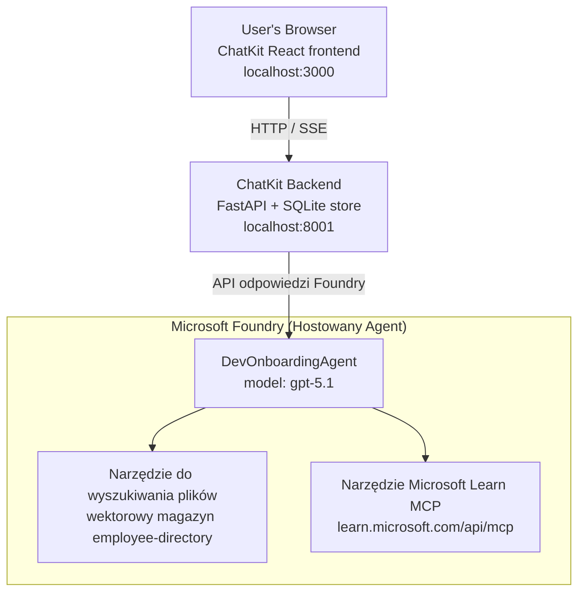

# Lekcja 4: Wdrażanie agenta z użyciem hostowanych agentów Microsoft Foundry + ChatKit

Ta lekcja pokazuje, jak wdrożyć agenta korzystającego z narzędzi do Microsoft Foundry jako hostowanego agenta oraz jak stworzyć frontend oparty na ChatKit do interakcji z nim.

## Architektura

Hostowany agent to **pojedynczy `DevOnboardingAgent`** (uruchomiony na `gpt-5.1`), który odpowiada na pytania dotyczące wdrożenia programisty, korzystając z dwóch hostowanych narzędzi: narzędzia **File Search** nad wektorowym sklepem employee-directory oraz narzędzia **Microsoft Learn MCP**. Frontend React oparty na ChatKit komunikuje się z backendem FastAPI, który wywołuje agenta przez Foundry **Responses API**.



## Wymagania wstępne

1. **Projekt Microsoft Foundry** w regionie North Central US
2. **Azure CLI** uwierzytelniony (`az login`)
3. Zainstalowany **Azure Developer CLI** (`azd`)
4. **Python 3.12+** i **Node.js 18+**
5. Utworzony **Vector Store** z danymi pracowników

## Szybki start

### 1. Ustaw zmienne środowiskowe

```bash
cd lesson-4-agentdeployment
cp .env.example .env
# Edytuj plik .env, wpisując szczegóły projektu Microsoft Foundry
```

### 2. Wdroż hostowanego agenta

**Opcja A: Użycie Azure Developer CLI (zalecane)**

```bash
cd hosted-agent
azd auth login
azd agent deploy
```

**Opcja B: Użycie Docker + Azure Container Registry**

```bash
cd hosted-agent

# Zbuduj kontener
docker build -t developer-onboarding-agent:latest .

# Tag dla ACR
docker tag developer-onboarding-agent:latest <your-acr>.azurecr.io/developer-onboarding-agent:latest

# Wypchnij do ACR
az acr login --name <your-acr>
docker push <your-acr>.azurecr.io/developer-onboarding-agent:latest

# Wdróż za pomocą portalu Microsoft Foundry lub SDK
```

### 3. Uruchom backend ChatKit

```bash
cd chatkit-server
python -m venv .venv
source .venv/bin/activate  # Na Windows: .venv\Scripts\activate
pip install -r requirements.txt
python app.py
```

Serwer zostanie uruchomiony pod adresem `http://localhost:8001`

### 4. Uruchom frontend ChatKit

```bash
cd chatkit-server/frontend
npm install
npm run dev
```

Frontend zostanie uruchomiony pod adresem `http://localhost:3000`

### 5. Przetestuj aplikację

Otwórz `http://localhost:3000` w przeglądarce i wypróbuj następujące zapytania:

**Wyszukiwanie pracowników:**
- "Jestem tu nowy! Czy ktoś pracował w Microsoft?"
- "Kto ma doświadczenie w Azure Functions?"

**Materiały szkoleniowe:**
- "Utwórz ścieżkę nauki dla Kubernetes"
- "Jakie certyfikaty powinienem zdobyć, aby zostać architektem chmury?"

**Pomoc w kodowaniu:**
- "Pomóż mi napisać kod Python do połączenia z CosmosDB"
- "Pokaż, jak utworzyć Azure Function"

**Zapytania wieloagentowe:**
- "Zaczynam jako inżynier chmury. Z kim powinienem się połączyć i czego się nauczyć?"

## Struktura projektu

```
lesson-4-agentdeployment/
├── .env.example                 # Environment variables template
├── implementation-plan.md       # Detailed implementation guide
├── README.md                    # This file
├── hosted-agent/               # Microsoft Foundry hosted agent
│   ├── main.py                 # Multi-agent workflow implementation
│   ├── requirements.txt        # Python dependencies
│   ├── Dockerfile              # Container definition
│   └── agent.yaml              # Agent deployment configuration
└── chatkit-server/             # ChatKit server application
    ├── app.py                  # FastAPI backend
    ├── store.py                # SQLite persistence layer
    ├── requirements.txt        # Python dependencies
    └── frontend/               # React frontend
        ├── package.json
        ├── vite.config.ts
        ├── tsconfig.json
        ├── index.html
        └── src/
            ├── main.tsx
            ├── App.tsx
            ├── App.css
            └── index.css
```

## Agent i jego narzędzia

Hostowany agent to **pojedynczy agent** (`DevOnboardingAgent`, zdefiniowany w `hosted-agent/main.py`), który obsługuje trzy domeny wdrożenia. Zamiast organizować osobne pod-agenty, udostępnia każdą funkcję jako narzędzie (lub korzysta bezpośrednio z modelu):

| Możliwość | Jak jest obsługiwana | Narzędzie |
|-----------|---------------------|----------|
| **Wyszukiwanie pracowników i kontakty** | Hostowane File Search Foundry nad wektorowym sklepem employee-directory | `client.get_file_search_tool(vector_store_ids=[...])` |
| **Nauka i szkolenia** | Serwer Microsoft Learn MCP (hostowane narzędzie MCP) | `client.get_mcp_tool(url="https://learn.microsoft.com/api/mcp")` |
| **Pomoc w kodowaniu** | Obsługiwane bezpośrednio przez model `gpt-5.1` — bez narzędzi zewnętrznych | — |


Agent jest tworzony za pomocą `client.as_agent(name="DevOnboardingAgent", instructions=..., tools=[file_search_tool, learn_mcp_tool])` i uruchamiany przez `from_agent_framework(agent).run()`.

> **Notatka dotycząca projektu.** Wcześniejsze wersje tej lekcji używały wieloagentowego przepływu pracy `HandoffBuilder` (Triaged → specjaliści). Dostarczony agent to pojedynczy agent korzystający z narzędzi, co jest prostsze w wdrożeniu i zrozumieniu dla stylu pytań i odpowiedzi przy onboardingu. Przykład wieloagentowej orkiestracji i przekazań znajdziesz w Lekcji 2 i Lekcji 3.

## Test dymny hostowanego agenta (brama CI)

Pomyślne wdrożenie hostowanego agenta tylko dowodzi, że płaszczyzna kontrolna zaakceptowała
definicję — nie dowodzi jednak, że agent rzeczywiście odpowiada. Brakująca zależność,
błędne kierowanie modelu lub wygasłe połączenie mogą pozostawić agenta w stanie zielonym, ale milczącym.

Ta lekcja dostarcza lekkiego **testu dymnego**, który działa jako szybka i tania brama po wdrożeniu.
Używa akcji GitHub [AI Smoke Test](https://github.com/marketplace/actions/ai-smoke-test)
do wysłania zapytań POST do punktu końcowego **Responses** agenta Foundry
(`POST {project_endpoint}/agents/{agent_name}/endpoint/protocols/openai/responses`)
i weryfikuje zwrócony tekst. W kilka sekund wychwytuje błędne wdrożenia, regresje uwierzytelniania,
dryft promptu systemowego oraz przerwania w wątkowaniu.

> Testy dymne **nie są** zamiennikiem pełnych ocen w
> [Lekcji 3](../lesson-3-agent-evals/README.md) — stanowią uzupełnienie. Testy dymne
> odpowiadają na pytanie *"czy agent jest dostępny, reaguje oraz realizuje podstawowe oczekiwania promptu?"*;
> oceny odpowiadają na pytanie *"jak dobra jest odpowiedź?"*. Uruchamiaj tani test przy każdym wdrożeniu.

### Co jest testowane

Katalog znajduje się w [`hosted-agent/tests/smoke-tests.json`](../../../lesson-4-agentdeployment/hosted-agent/tests/smoke-tests.json)
i sprawdza trzy dziedziny agenta oraz zgodność z promptem i wieloturnowe wątkowanie:

| Test | Co weryfikuje |
|------|---------------|
| `reachability` | Agent odpowiada niepustym, zgodnym z zakresem tekstem |
| `employee-search` | Dziedzina wyszukiwania plików zwraca poprawny status `200` (odpowiedź zależy od danych) |
| `learning-path` | Dziedzina nauki powtarza temat i generuje odpowiedź w stylu ścieżki |
| `coding-assistance` | Dziedzina kodowania zwraca odpowiedź w formie kodu Pythona |
| `prompt-adherence-offtopic` | Zapytanie poza tematyką jest przekierowywane, ale nie uzyskuje szczegółowej odpowiedzi |
| `threading-turn-1/2` | Stan konwersacji jest utrzymywany pomiędzy turami za pomocą `previous_response_id` |

### Uruchom go w CI

Przepływ pracy w [`.github/workflows/smoke-test-hosted-agent.yml`](../../../.github/workflows/smoke-test-hosted-agent.yml)
ma dwie prace:

- **`static`** — szybka brama bez Azure, uruchamiana przy każdym pull request i push:
  kompiluje wszystkie źródła Python (`py_compile`) i sprawdza linki Markdown. Brak potrzeby sekretów,
  więc działa na forkowanych PR.
- **`smoke`** — poniższy test dymny powiązany z Azure. Uruchamiany na żądanie
  (Actions → **Agent CI (static + smoke)** → Run workflow) i może być wywoływany po twoim
  przepływie wdrożenia.

Skonfiguruj te **zmienne** i **sekrety** repozytorium dla pracy smoke:


| Rodzaj | Nazwa | Wartość |
|------|------|-------|

| Zmienna | `FOUNDRY_PROJECT_ENDPOINT` | `https://<account>.services.ai.azure.com/api/projects/<project>` |
| Zmienna | `HOSTED_AGENT_NAME` | Nazwa wdrożonego agenta (np. `dev-onboarding` — musi odpowiadać twojemu wdrożeniu) |
| Sekret | `AZURE_CLIENT_ID` / `AZURE_TENANT_ID` / `AZURE_SUBSCRIPTION_ID` | Federowana tożsamość OIDC dla `azure/login` |

Tożsamość runnera potrzebuje roli **`Azure AI User`** w **zakresie projektu Foundry**, aby mogła
wywoływać punkty końcowe danych płaszczyzny odpowiedzi (i konwersacji). Przyznaj ją za pomocą:

```bash
az role assignment create \
  --assignee <object-id-or-appId-of-runner-identity> \
  --role "Azure AI User" \
  --scope "/subscriptions/<sub>/resourceGroups/<rg>/providers/Microsoft.CognitiveServices/accounts/<account>/projects/<project>"
```

### Uruchom to lokalnie

Możesz uruchomić ten sam katalog przed wdrożeniem. Uzyskaj token płaszczyzny danych ograniczony do
`https://ai.azure.com/` i skieruj runnera na swoje wdrożenie:

```bash
# Audience MUSI być https://ai.azure.com/ (tokeny cognitiveservices.azure.com są odrzucane)
export FOUNDRY_TOKEN=$(az account get-access-token --resource https://ai.azure.com/ --query accessToken -o tsv)

git clone https://github.com/JFolberth/ai-smoketest && cd ai-smoketest
python runner.py \
  --project-endpoint "https://<account>.services.ai.azure.com/api/projects/<project>" \
  --agent-name dev-onboarding \
  --tests-file ../lesson-4-agentdeployment/hosted-agent/tests/smoke-tests.json
```

Kody zakończenia: `0` wszystkie przeszły, `1` nie powiodło się potwierdzenie, `2` błąd runnera (zły katalog / token).

## Rozwiązywanie problemów

### Agent nie odpowiada
- Sprawdź, czy hostowany agent jest wdrożony i działa w Microsoft Foundry
- Sprawdź, czy `HOSTED_AGENT_NAME` i `HOSTED_AGENT_VERSION` odpowiadają twojemu wdrożeniu

### Błędy magazynu wektorów
- Upewnij się, że `VECTOR_STORE_ID` jest poprawnie ustawiony
- Sprawdź, czy magazyn wektorów zawiera dane pracowników

### Błędy uwierzytelniania
- Uruchom `az login`, aby odświeżyć poświadczenia
- Upewnij się, że masz dostęp do projektu Microsoft Foundry

## Zasoby

- [Dokumentacja hostowanych agentów Microsoft Foundry](https://learn.microsoft.com/en-us/azure/ai-foundry/agents/concepts/hosted-agents)
- [Microsoft Agent Framework](https://github.com/microsoft/agent-framework)
- [Przykład integracji ChatKit](https://github.com/microsoft/agent-framework/tree/main/python/samples/demos/chatkit-integration)
- [Azure Developer CLI](https://learn.microsoft.com/en-us/azure/developer/azure-developer-cli/overview)
- [Akcja GitHub AI Smoke Test](https://github.com/marketplace/actions/ai-smoke-test)
- [Test dymny hostowanych agentów Microsoft Foundry z GitHub Actions (blog)](https://techcommunity.microsoft.com/blog/azuredevcommunityblog/smoke-test-microsoft-foundry-agents-with-github-actions/4531912)

---

## Kolejne kroki

Twój agent działa na infrastrukturze zarządzanej przez Microsoft. Aby przejść do produkcji korporacyjnej —
kontrolując, gdzie przebywają jego dane (suwerenność danych, prywatna sieć, własny Azure
Cosmos DB / Storage / AI Search) i zarządzając jego narzędziami — kontynuuj
**[Lekcja 5: Produkcyjne hostowane agenty](../lesson-5-hosted-agents-production/README.md)**, która
wyjaśnia kluczową różnicę między **Hosted Agents** a **Capability Hosts**.

---

<!-- CO-OP TRANSLATOR DISCLAIMER START -->
**Zastrzeżenie**:
Niniejszy dokument został przetłumaczony za pomocą usługi tłumaczenia AI [Co-op Translator](https://github.com/Azure/co-op-translator). Choć dążymy do dokładności, prosimy pamiętać, że automatyczne tłumaczenia mogą zawierać błędy lub niedokładności. Oryginalny dokument w jego języku źródłowym należy uznawać za autorytatywne źródło. W przypadku informacji krytycznych zalecane jest skorzystanie z profesjonalnego tłumaczenia wykonanego przez człowieka. Nie ponosimy odpowiedzialności za jakiekolwiek nieporozumienia lub błędne interpretacje wynikające z użycia tego tłumaczenia.
<!-- CO-OP TRANSLATOR DISCLAIMER END -->