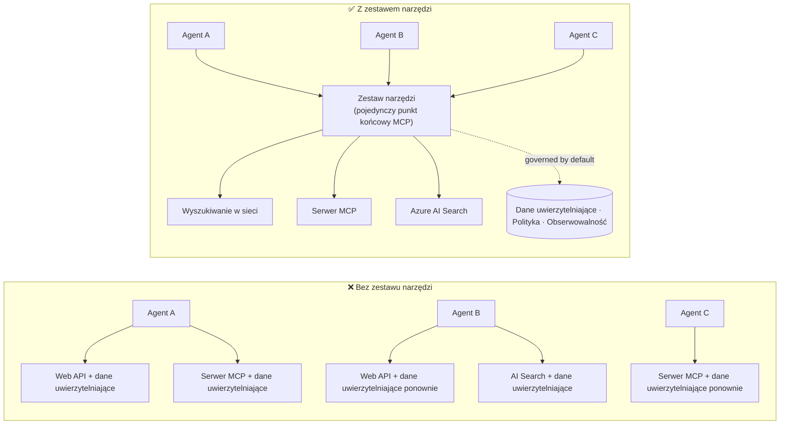

# Lekcja 6: Microsoft Toolbox — Zarządzane narzędzia dla agentów

Po [Lekcji 5](../lesson-5-hosted-agents-production/README.md) twój hostowany agent działa w
produkcji z poziomem przechowywania i zarządzania wymaganym przez twoją organizację. Ale spójrz na
agenta z Lekcji 4: każde narzędzie było **na stałe wpisane** w `main.py` — adres URL Microsoft Learn MCP,
wektorowy magazyn do wyszukiwania plików i tak dalej. To działa dla jednego agenta. To **nie**
skaluje się na organizację z dziesiątkami agentów i zespołów.

Ta lekcja przedstawia **Microsoft Toolbox**: sposób, w jaki Foundry pozwala zdefiniować wyselekcjonowany zestaw
narzędzi **raz**, zarządzać nimi **centralnie** i udostępniać je dowolnemu agentowi przez **jeden,
zarządzany punkt końcowy**.

## Cele nauki

Pod koniec tej lekcji będziesz w stanie:

- Wyjaśnić problem rozproszonych narzędzi, który rozwiązuje Toolbox.
- Opisać filary **Budowania** i **Konsumpcji** oraz typy narzędzi, które może zawierać toolbox.
- **Zbudować** wersję toolboxa za pomocą Foundry SDK.
- **Korzystać** z toolboxa z hostowanego agenta Microsoft Agent Framework przez pojedynczy punkt końcowy MCP.
- Wykorzystać **wersjonowanie**, aby wprowadzać zmiany narzędzi bez zmiany kodu agenta lub ponownego wdrażania.
- Zastosować **zarządzanie**: RBAC, wstrzykiwanie poświadczeń i zasady guardrail (RAI).

---

## Wymagania wstępne

1. Ukończona [Lekcja 4](../lesson-4-agentdeployment/README.md) i najlepiej
   [Lekcja 5](../lesson-5-hosted-agents-production/README.md).
2. Projekt **Microsoft Foundry** z uprawnieniami do tworzenia i zarządzania zasobami toolboxa.
3. **Azure CLI** zalogowany: `az login`. API toolboxa Foundry wymaga
   zakresu tokena `https://ai.azure.com/.default` (pokazanego w kodzie poniżej).
4. **Python 3.12+** z zainstalowanymi zależnościami kursu (`pip install -r ../requirements.txt`).
5. Aktualne, nieprzestarzałe wdrożenie modelu (np. `gpt-5.1`). Unikaj przestarzałych GPT-4o / GPT-4.1.

---

## 1. Problem: rozproszenie narzędzi

Pojedynczy agent może zależeć od wielu narzędzi — REST API, serwerów MCP, konektorów i przepływów — każde
z własnym modelem uwierzytelniania i przypisanym zespołem. W miarę skalowania w organizacji:

- Zespoły **niezależnie implementują te same narzędzia**.
- **Poświadczenia są duplikowane** między agentami i repozytoriami.
- **Zarządzanie staje się niespójne** — każdy agent samodzielnie egzekwuje (lub zapomina) zasady.
- Jest **mała widoczność** tego, jakie narzędzia istnieją i kto ich używa.

Deweloperzy utknęli — nie dlatego, że modele nie są zdolne, ale ponieważ **integracja narzędzi
staje się wąskim gardłem**.



Przedsiębiorstwa już mają infrastrukturę — bramy, sejfy poświadczeń, zasady, możliwość obserwacji.
Brakowało tylko doświadczenia dewelopera, które pakietuje to w coś **wielokrotnego użytku,
odkrywalnego i zarządzanego domyślnie**. To jest Toolbox.

---

## 2. Czym jest Toolbox

**Toolbox** to **zarządzany zasób Foundry**. Definiujesz wyselekcjonowany zestaw narzędzi raz, zarządzasz
nimi centralnie w Foundry i udostępniasz je przez **jedyny punkt końcowy zgodny z MCP**, który każdy
agent może wykorzystać. W czasie działania platforma obsługuje **wstrzykiwanie poświadczeń, odświeżanie tokenów i
wymuszanie zasad na poziomie przedsiębiorstwa**.

Ponieważ toolbox jest zarządzanym zasobem, możesz dodawać, usuwać lub rekonfigurować narzędzia **bez
zmiany kodu w swoim agencie** — agent zawsze łączy się z tym samym punktem końcowym.

Toolbox obejmuje cykl życia narzędzi przez cztery filary; **Build** i **Consume** są dostępne
już dziś:

| Filar | Status | Co umożliwia |
|--------|--------|-----------------|
| **Build** | Dostępny dziś | Wybierz narzędzia, skonfiguruj uwierzytelnianie centralnie, opublikuj wielokrotnie używany toolbox, z którego każdy zespół może korzystać. |
| **Consume** | Dostępny dziś | Podłącz dowolnego agenta do jednego punktu końcowego zgodnego z MCP, aby dynamicznie wykrywać i wywoływać wszystkie narzędzia w toolboxie. |

Powierzchnia konsumpcji jest **otwarta**: każdy środowisko wykonawcze lub klient zgodny z MCP może korzystać z toolboxa —
Microsoft Agent Framework, LangGraph, GitHub Copilot, Claude Code, Microsoft Copilot Studio lub
własny kod.

### Typy narzędzi, które może zawierać toolbox

Web Search · MCP · Azure AI Search · Code Interpreter · File Search · OpenAPI · **Agent-to-Agent
(A2A)** · Fabric IQ · Tool Search · Work IQ · Browser Automation · Odwołania do umiejętności, plus
**zasada Guardrail (RAI)** stosowana na warstwie toolboxa.

> **Wskazówka:** Dodaj `description` do **każdego** narzędzia, aby model mógł wybrać właściwe. Toolbox
> pozwala maksymalnie na **jedno narzędzie bez nazwy na typ** — nadaj unikalną `name` każdemu kolejnemu egzemplarzowi tego samego typu,
> albo otrzymasz błąd `invalid_payload`.

---

## 3. Budowanie toolboxa

Toolboxy są zarządzane za pomocą Foundry SDK (Python/.NET/JavaScript), REST API, `azd` oraz
**Microsoft Foundry Toolkit dla VS Code**. Oto wzór w Pythonie (`azure-ai-projects`):

```python
from azure.identity import DefaultAzureCredential
from azure.ai.projects import AIProjectClient
from azure.ai.projects.models import MCPTool, ToolboxSearchPreviewTool, WebSearchTool

endpoint = "https://<your-foundry-account>.services.ai.azure.com/api/projects/<your-project>"
project = AIProjectClient(endpoint=endpoint, credential=DefaultAzureCredential())

toolbox_version = project.toolboxes.create_toolbox_version(
    name="agent-tools",
    description="Web search + an MCP server + tool search",
    tools=[
        WebSearchTool(),
        MCPTool(
            server_label="myserver",
            server_url="https://your-mcp-server.example.com",
            require_approval="never",
            project_connection_id="my-key-auth-connection",  # poświadczenia znajdują się w Foundry
        ),
        ToolboxSearchPreviewTool(),
    ],
)
print(f"Created toolbox: {toolbox_version.name}, version: {toolbox_version.version}")
```

Zauważ, co **nie** robisz: żadnych sekretów w agencie. Poświadczenia są przechowywane przez
połączenie w Foundry (`project_connection_id`) i wstrzykiwane przez platformę w czasie wywołania.

> **Uwaga przesiewowa.** Zarządzanie toolboxem (tworzenie/aktualizacja wersji) jest funkcją w wersji podglądowej.
> Operacje `project.toolboxes.*` pokazane powyżej są dostępne w wersjach podglądowych SDK, REST API, `azd`,
> i **Foundry Toolkit dla VS Code** — **nie** są dostępne w przypiętym `azure-ai-projects` używanym
> w innych częściach kursu. Traktuj ten fragment jako schemat kroku Budowania; dla
> ścieżki z kliknięciami, utwórz toolbox w **portalu Foundry** lub **Foundry Toolkit**. Krok
> **Consume** poniżej działa już dzisiaj z przypiętym SDK kursu.

---

## 4. Konsumpcja toolboxa z twojego agenta

Toolbox udostępnia **punkt końcowy MCP**. Są dwa wzorce:

| Rola | Punkt końcowy | Kiedy używać |
|------|----------|-------------|
| **Konsument toolboxa** | `{project_endpoint}/toolboxes/{name}/mcp?api-version=v1` | Podłącz agentów. Zawsze obsługuje **domyślną wersję**. |
| **Deweloper toolboxa** | `{project_endpoint}/toolboxes/{name}/versions/{version}/mcp?api-version=v1` | Testuj konkretną wersję przed jej wypromowaniem. |

> **Podłącz agentów do *konsumenckiego* punktu końcowego.** Ponieważ zawsze obsługuje domyślną wersję, możesz
> promować nowe wersje **bez zmiany kodu agenta lub ponownego wdrażania**.

### Integracja z hostowanym agentem Microsoft Agent Framework

Przypomnij sobie, że agent z Lekcji 4 dodał jedno, na stałe wpisane narzędzie MCP poprzez `client.get_mcp_tool(...)`. Z
Toolbox wskazujesz zamiast tego **jedno** `MCPStreamableHTTPTool` na punkt końcowy toolboxa — a agent
uzyskuje **wszystkie** narzędzia w toolboxie, zarządzane centralnie:

```python
import httpx
from azure.identity import DefaultAzureCredential, get_bearer_token_provider
from agent_framework import MCPStreamableHTTPTool

# Auth: Zestaw narzędzi Foundry wymaga zakresu https://ai.azure.com/.default
credential = DefaultAzureCredential()
token_provider = get_bearer_token_provider(credential, "https://ai.azure.com/.default")
http_client = httpx.AsyncClient(auth=_ToolboxAuth(token_provider), timeout=120.0)

TOOLBOX_ENDPOINT = os.environ["TOOLBOX_ENDPOINT"]  # platforma wstrzyknięta podczas wykonywania

mcp_tool = MCPStreamableHTTPTool(
    name="toolbox",
    url=TOOLBOX_ENDPOINT,
    http_client=http_client,
    load_prompts=False,
)

agent = chat_client.as_agent(
    name="my-toolbox-agent",
    instructions="You are a helpful assistant with access to Foundry toolbox tools.",
    tools=[mcp_tool],
)
```

Odpowiadający plik `.env` (uwaga: użyj **aktualnego** modelu, np. `gpt-5.1`, **nie** przestarzałego
`gpt-4o`):

```env
FOUNDRY_PROJECT_ENDPOINT=https://<account>.services.ai.azure.com/api/projects/<project>
TOOLBOX_ENDPOINT=https://<account>.services.ai.azure.com/api/projects/<project>/toolboxes/agent-tools/mcp?api-version=v1
AZURE_AI_MODEL_DEPLOYMENT_NAME=gpt-5.1
```

> **Zweryfikuj najpierw.** Zanim podepniesz pełnego agenta, połącz klienta MCP SDK (`pip install mcp`) z
> **punkt końcowy specyficzny dla wersji** i wyświetl listę narzędzi, aby potwierdzić ich poprawne załadowanie.

### Uruchom przykład konsumpcyjny

W tej lekcji dostarczono uruchamialny przykład po stronie konsumpcji, [`toolbox_agent.py`](../../../lesson-6-toolbox/toolbox_agent.py). Używa on
tego samego wzoru `FoundryChatClient.get_mcp_tool(...)`, którego nauczyłeś się w Lekcji 2, ale wskazuje jedno
narzędzie MCP na twój **punkt końcowy toolboxa** — dzięki czemu agent ma dostęp do każdego zarządzanego narzędzia w toolboxie:

```bash
# W swoim pliku .env ustaw TOOLBOX_ENDPOINT na punkt końcowy konsumenta toolbox, następnie:
python lesson-6-toolbox/toolbox_agent.py
```

Otwórz wydrukowany adres URL `http://localhost:8096` i zadaj pytanie, które używa jednego z narzędzi
w toolboxie. Dodaj lub uaktualnij narzędzie w toolboxie i zapytaj ponownie — **bez zmiany tego
kodu** — aby zobaczyć zarządzanie centralne i wersjonowanie w działaniu.

---

## 5. Wersjonowanie: bezpieczne wprowadzanie zmian narzędzi

Wersjonowanie toolboxa daje ci wyraźną kontrolę nad tym, kiedy zmiany zaczynają obowiązywać:

1. **Utwórz** nową wersję toolboxa z aktualnym zestawem narzędzi.
2. **Przetestuj** ją na punkcie końcowym specyficznym dla wersji (dla dewelopera).
3. **Wypromuj** ją do `default_version`, kiedy będziesz gotowy.

Każdy agent podłączony do punktu końcowego **konsumenta** automatycznie odbiera wypromowaną wersję — **bez
zmiany kodu, bez ponownego wdrażania**. (Pierwsza utworzona wersja jest automatycznie wypromowana na domyślną.)

Jest to odpowiednik zarządzania narzędziem opartego na blue/green deploy: najpierw weryfikujesz zmianę w izolacji,
potem jednocześnie przełączasz domyślną wersję dla wszystkich konsumentów.

---

## 6. Zarządzanie: jak Toolbox poprawia kontrolę

Toolbox jest **domyślnie zarządzany**. Dźwignie zarządzania, które powinieneś znać:

- **RBAC.** Nadaj każdej tożsamości rolę **Foundry User** na projekcie: **deweloperowi** zarządzającemu wersjami toolboxa,
  **zarządzanej tożsamości agenta** (dla hostowanych agentów wywołujących narzędzia w czasie działania),
  oraz w przepływach OAuth — **użytkownikowi końcowemu**, którego tożsamość jest pośredniczona.
- **Centralne poświadczenia.** Poświadczenia narzędzi przechowywane są w **połączeniach** Foundry, nie w kodzie agenta
  lub plikach `.env`. Platforma wstrzykuje je i odświeża tokeny w czasie działania.
- **Guardrails (polityka RAI).** Dołącz nazwaną politykę odpowiedzialnej AI do wersji toolboxa poprzez
  `policies.rai_config.rai_policy_name`. Działa ona na **warstwie toolboxa**, niezależnie od
  filtra treści na poziomie modelu, filtrując dane wejściowe i wyjściowe narzędzi.
- **Zatwierdzenie MCP.** Parametr `require_approval` dla narzędzia MCP kontroluje, czy wywołanie narzędzia wymaga zatwierdzenia —
  taki sam mechanizm zatwierdzania, jaki widziałeś w [Lekcji 5 §7](../lesson-5-hosted-agents-production/README.md#7-hosted-mcp-tools--approval-workflows).
- **Prywatna sieć.** Toolbox wspiera konfiguracje sieci wirtualnych dla przedsiębiorstw, które
  utrzymują ruch w obrębie swojej sieci.
- **Widoczność.** Ponieważ narzędzia są katalogowane centralnie, wreszcie masz inwentaryzację tego,
  co istnieje i kto korzysta.

---

## Ćwiczenia praktyczne

1. **Refaktoryzuj Lekcję 4.** Agent z Lekcji 4 na stałe wpisuje narzędzie Microsoft Learn MCP. Nakreśl,
   jak przeniósłbyś to narzędzie do toolboxa `agent-tools` i skierował `main.py` na punkt końcowy
   konsumenta toolboxa. Co się zmienia w `main.py`? Co już tam nie figuruje?
2. **Zaprojektuj podbicie wersji.** Musisz dodać narzędzie Web Search do działającego toolboxa używanego przez pięciu
   agentów. Opisz sekwencję tworzenia → testowania → promowania i wyjaśnij, dlaczego żaden z pięciu agentów
   nie wymaga ponownego wdrożenia.
3. **Wybierz tożsamości uwierzytelniające.** Dla hostowanego agenta, który wywołuje narzędzie MCP oparte na OAuth przez
   toolbox, wymień, które tożsamości potrzebują roli **Foundry User** i dlaczego.
4. **Umiejscowienie guardrail.** Wyjaśnij różnicę między filtrem treści na poziomie modelu a
   guardrailem w toolboxie, i podaj jedno zastosowanie, gdzie potrzebujesz właśnie guardrail toolboxa.

---

## Zasoby

- [Tworzenie, testowanie i wdrażanie toolboxa w Foundry](https://learn.microsoft.com/azure/foundry/agents/how-to/tools/toolbox)
- [Katalog narzędzi — Foundry Agent Service](https://learn.microsoft.com/azure/foundry/agents/concepts/tool-catalog)
- [Microsoft Agent Framework — dostawca Microsoft Foundry (narzędzia)](https://learn.microsoft.com/agent-framework/agents/providers/microsoft-foundry)
- [Przegląd Guardrails](https://learn.microsoft.com/azure/foundry/guardrails/guardrails-overview)
- [Rozpocznij pracę z Foundry w VS Code (Foundry Toolkit)](https://learn.microsoft.com/azure/ai-foundry/how-to/develop/get-started-projects-vs-code)
- [Model Context Protocol](https://modelcontextprotocol.io/)

---

**Poprzednia:** [Lekcja 5 — Hostowani agenci produkcyjni](../lesson-5-hosted-agents-production/README.md)
&nbsp;·&nbsp; **Następna:** [Lekcja 7 — Wielu agentów i A2A](../lesson-7-multi-agent-a2a/README.md)

---

<!-- CO-OP TRANSLATOR DISCLAIMER START -->
**Zastrzeżenie**:
Niniejszy dokument został przetłumaczony za pomocą usługi tłumaczenia AI [Co-op Translator](https://github.com/Azure/co-op-translator). Choć dążymy do dokładności, prosimy pamiętać, że automatyczne tłumaczenia mogą zawierać błędy lub niedokładności. Oryginalny dokument w jego języku źródłowym należy uznawać za autorytatywne źródło. W przypadku informacji krytycznych zalecane jest skorzystanie z profesjonalnego tłumaczenia wykonanego przez człowieka. Nie ponosimy odpowiedzialności za jakiekolwiek nieporozumienia lub błędne interpretacje wynikające z użycia tego tłumaczenia.
<!-- CO-OP TRANSLATOR DISCLAIMER END -->