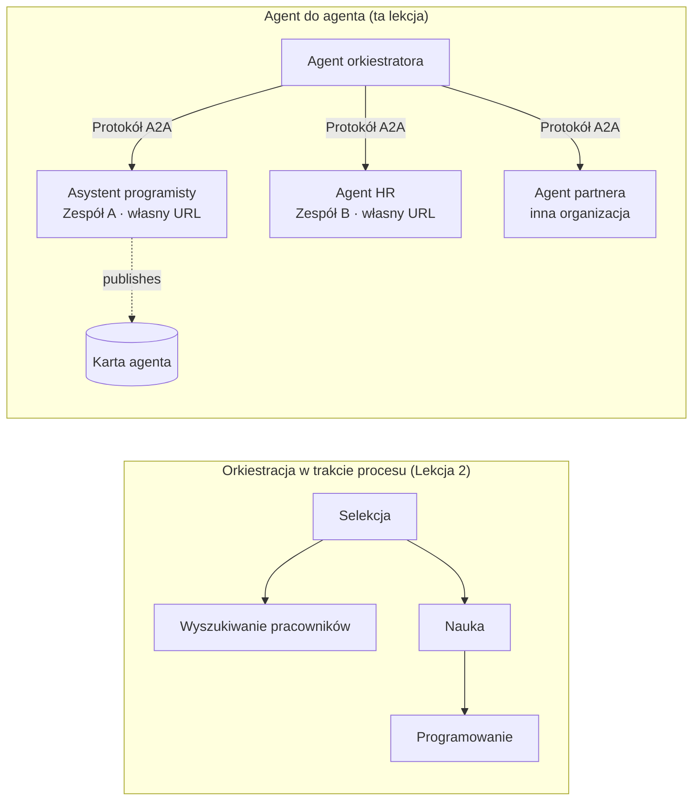

# Lekcja 7: Orkiestracja Multi-Agentów i Agent-to-Agent (A2A)

W Lekcji [6](../lesson-6-toolbox/README.md) nauczyłeś się tworzyć zarządzane narzędzia i hostowane agentów.
Ale prawdziwe systemy rzadko korzystają z **jednego** agenta. W miarę skalowania łączysz **wielu** agentów — niektórych należących do Ciebie,
innych należących do różnych zespołów, a jeszcze innych działających w zupełnie innych organizacjach. Ta lekcja dotyczy
tego, jak agenci pracują **wspólnie**.

Już spotkałeś jedną formę projektowania multi-agentowego w
[Lekcji 2 w `agent-orchestration.py`](../lesson-2-agent-development/README.md): wzorzec **handoff**
polegający na tym, że agent triage przekazuje zadania do specjalistów **wewnątrz jednego procesu**. Ta lekcja przechodzi
o poziom wyżej — do **Agent-to-Agent (A2A)**, otwartego protokołu dla agentów działających jako niezależne
**usługi sieciowe**, które wywołują się nawzajem przez granice procesów, zespołów i organizacji.

## Cele nauki

Pod koniec tej lekcji będziesz potrafił:

- Wyjaśnić różnicę między **orkiestracją wewnątrzprocesową** (handoff/workflows) a
  komunikacją **Agent-to-Agent (A2A)** i wybrać odpowiednią.
- Opisać elementy budujące A2A: **Agent Card**, **umiejętności**, **zadania** oraz **odkrywanie**.
- **Udostępnić** agenta Microsoft Agent Framework jako usługę A2A przy pomocy `A2AExecutor`.
- **Konsumpcja** zdalnego agenta jako peer sieciowego z `A2AAgent`.
- Zastosować kwestie korporacyjne do A2A: **bezpieczeństwo, tożsamość, zarządzanie, obserwowalność oraz koszty**.

---

## Wymagania wstępne

1. Ukończona [Lekcja 2](../lesson-2-agent-development/README.md) (rozwój agentów i orkiestracja).
2. Projekt **Microsoft Foundry** z aktualnym deployem modelu (na przykład `gpt-5.1` i
   `gpt-5-codex` dla przykładu kodu). Unikaj wycofanych GPT-4o / GPT-4.1.
3. Uwierzytelniony **Azure CLI**: `az login`.
4. **Python 3.12+** z zainstalowanymi zależnościami kursu (`pip install -r ../requirements.txt`).
   Lekcja 7 dodaje pakiety w wersji preview: `agent-framework-a2a`, `a2a-sdk` i `uvicorn`.
5. Ustawione zmienne `FOUNDRY_PROJECT_ENDPOINT` i `FOUNDRY_MODEL` w pliku `.env` (patrz README kursu).

---

## 1. Dwa sposoby współpracy agentów

Nie ma jednego wzorca „multi-agent”. Wybierz ten, który pasuje do Twojej **granicy**:

| Wzorzec | Gdzie działają agenci | Jak się łączą | Używaj gdy |
|---------|------------------|------------------|----------|
| **Handoff / Workflow** (Lekcja 2) | Jeden proces, jedna baza kodu | Graf w pamięci (`HandoffBuilder`, `WorkflowBuilder`) | Posiadasz wszystkich agentów i wdrażasz ich razem. |
| **Agent-to-Agent (A2A)** (ta lekcja) | Osobne usługi, osobne cykle życia | Otwarty **protokół A2A** przez HTTP, odkrywany przez **Agent Card** | Agenci należą do różnych zespołów/organizacji, skalują się niezależnie lub są napisani w różnych frameworkach. |

Handoff dotyczy **trasowania w aplikacji**. A2A dotyczy **kompozycji agentów jako
niezależnych usług** — odpowiednik przejścia z wywołań funkcji do mikroserwisów.



> **Komponują się.** Orkiestrator zbudowany za pomocą `HandoffBuilder` może mieć **zdalnych agentów A2A**
> jako uczestników — trasowanie w procesie do usług działających gdziekolwiek indziej.

---

## 2. Elementy budujące A2A

A2A to **otwarty protokół** (nie specyficzny dla Microsoft), więc agenta A2A może konsumować Microsoft
Agent Framework, LangGraph, własny kod lub stos innej firmy. Cztery kluczowe pojęcia to:

- **Agent Card** — mały dokument JSON, publikowany pod
  `/.well-known/agent-card.json`, który reklamuje **nazwę, opis, URL, wersję,
  umiejętności i możliwości** agenta. To sposób, w jaki klient **odkrywa** co zdalny agent potrafi.
- **Umiejętności** — zadeklarowane rzeczy, które agent potrafi robić (`id`, `name`, `description`, `tags`,
  `examples`). Klienci (i modele) używają ich, by zdecydować, czy wywołać agenta.
- **Zadania** — wywołanie agenta A2A to **zadanie** z cyklem życia (złożone → w trakcie →
  wykonane/niepowodzenie). Serwer przechowuje zadania w **task store**; obsługuje aktualizacje strumieniowe.
- **Odkrywanie** — klient otrzymujący tylko URL pobiera Agent Card i wie, jak wywołać agenta.

---

## 3. Udostępnianie agenta jako usługi A2A — `a2a_server.py`

Strona **Build/serve** opakowuje dowolnego agenta Microsoft Agent Framework przy pomocy `A2AExecutor` i montuje go
jako aplikację HTTP A2A. Zobacz [`a2a_server.py`](../../../lesson-7-multi-agent-a2a/a2a_server.py). Kluczowe podłączenie:

```python
from agent_framework.a2a import A2AExecutor
from a2a.server.apps import A2AStarletteApplication
from a2a.server.request_handlers import DefaultRequestHandler
from a2a.server.tasks import InMemoryTaskStore
from a2a.types import AgentCapabilities, AgentCard, AgentSkill

agent = client.as_agent(name="coding-assistant", instructions="...")

agent_card = AgentCard(
    name="Coding Assistant",
    description="Generates runnable code samples...",
    url="http://localhost:9000/",
    version="1.0.0",
    capabilities=AgentCapabilities(streaming=True),
    default_input_modes=["text"],
    default_output_modes=["text"],
    skills=[AgentSkill(id="generate-code", name="Generate code",
                       description="Write a runnable code snippet.", tags=["code"])],
)

request_handler = DefaultRequestHandler(
    agent_executor=A2AExecutor(agent),
    task_store=InMemoryTaskStore(),
)
app = A2AStarletteApplication(agent_card=agent_card, http_handler=request_handler).build()
# serwowane przez uvicorn na porcie 9000
```

Zauważ, że kod agenta jest **niezmieniony** — `A2AExecutor` dopasowuje Twój istniejący agent do protokołu.
Agent Card sprawia, że jest on **odkrywalny** dla dowolnego klienta A2A.

---

## 4. Konsumpcja zdalnego agenta — `a2a_client.py`

Strona **Consume** łączy się do zdalnego agenta **przez URL**, pobiera jego Agent Card i wywołuje go
dokładnie jak lokalnego agenta. Zobacz [`a2a_client.py`](../../../lesson-7-multi-agent-a2a/a2a_client.py):

```python
from agent_framework.a2a import A2AAgent

remote_agent = A2AAgent(name="remote-coding-assistant", url="http://localhost:9000")
result = await remote_agent.run("Write a Python function that reverses a string.")
print(result.text)
```

O to chodzi w A2A: z punktu widzenia wywołującego zdalny agent zachowuje się jak każdy inny
agent `agent_framework`, więc możesz włączyć go w workflow lub przekazać zadanie — mimo że działa
w innym procesie, na innym urządzeniu, własność innego zespołu.

### Uruchom całość end-to-end

```bash
# Terminal 1 — uruchom usługę A2A
python a2a_server.py

# Terminal 2 — wywołaj ją
python a2a_client.py "Write a Python function that reverses a string."
```

Zobaczysz odpowiedź asystenta do kodowania przychodzącą przez protokół A2A. Otwórz
`http://localhost:9000/.well-known/agent-card.json` w przeglądarce, aby zobaczyć opublikowany Agent Card.

---

## 5. Kwestie korporacyjne

Zamiana agentów na usługi sieciowe wprowadza te same problemy co każdy system rozproszony —
plus kilka specyficznych dla AI:

- **Tożsamość i uwierzytelnianie.** Nigdy nie udostępniaj agenta A2A bez uwierzytelnienia. Agent Card zawiera
  `security` / `security_schemes`, a `A2AAgent` akceptuje `auth_interceptor`, dzięki któremu wywołujący dodają
  poświadczenia (tokeny OAuth bearer, klucze API). W produkcji korzystaj z Entra ID / zarządzanych tożsamości
  do uwierzytelniania usług-serwisów; umieść usługę za gatewayem.
- **Zarządzanie.** Połącz A2A z [Toolbox Lekcji 6](../lesson-6-toolbox/README.md): zdalny
  agent może być opublikowany jako **narzędzie A2A** w zarządzanym toolboxie, dzięki czemu RBAC, wstrzykiwanie poświadczeń
  i polityki zabezpieczeń działają centralnie.
- **Obserwowalność.** Teraz żądanie przechodzi przez granice procesów, więc propaguj śledzenie w wywołaniach.
  Włącz [Foundry Observability / OpenTelemetry](../lesson-3-agent-evals/README.md) na **obydwu**
  — orkiestratorze i każdym zdalnym agencie — aby uzyskać kompletny ślad end-to-end.
- **Wersjonowanie.** Agent Card ma `version`. Traktuj to jak API: zmiany dodające są bezpieczne;
  łamiące kontrakt umiejętności wymagają nowej wersji i okresu migracji dla konsumentów.
- **Niezawodność.** Zdalni agenci mogą zawieść niezależnie. Ustaw timeouty (`A2AAgent(timeout=...)`), obsługuj
  częściowe awarie i nie pozwól, by jeden wolny peer blokował całą orkiestrację.
- **Koszty.** Każde wywołanie zdalnego agenta to oddzielne wywołanie modelu. Rozgłaszanie zwiększa zużycie tokenów —
  uwzględnij to w budżecie i preferuj trasowanie do **jednego** najlepszego agenta zamiast do wielu.

---

## Ćwiczenia praktyczne

1. **Dodaj drugą usługę.** Skopiuj `a2a_server.py`, aby udostępnić agenta **employee-search** na porcie
   9001 z własnym Agent Card i umiejętnościami. Uruchom obie usługi i wykonaj wywołania klienta do każdej.
2. **Orkiestruj zdalnych peerów.** Zbuduj mały `HandoffBuilder` (lub prosty router), którego uczestnikami
   będą dwa `A2AAgent` wskazujące na Twoje dwie usługi. Skieruj zapytanie do odpowiedniego.
3. **Zabezpiecz to.** Dodaj `auth_interceptor` do klienta i wymuś token bearer na serwerze.
   Co się psuje, gdy token jest nieobecny? Gdzie przechowywałbyś token w produkcji?
4. **Handoff vs A2A.** Napisz dwa krótkie akapity: kiedy trzymasz się przekazania z Lekcji 2
   wewnątrz procesu, a kiedy uzasadniona jest dodatkowa złożoność A2A? Podaj konkretny przykład każdego.

---

## Zasoby

- [Agent-to-Agent (A2A) — Microsoft Agent Framework](https://learn.microsoft.com/agent-framework/user-guide/agent-orchestration/a2a)
- [Orkiestracja multi-agentowa — Microsoft Agent Framework](https://learn.microsoft.com/agent-framework/user-guide/agent-orchestration/)
- [Specyfikacja protokołu A2A](https://a2a-protocol.org/)
- [A2A Python SDK (`a2a-sdk`)](https://github.com/a2aproject/a2a-python)
- [Foundry Agent Service — wzorce multi-agentowe](https://learn.microsoft.com/azure/ai-foundry/agents/concepts/connected-agents)

---

**Poprzednia:** [Lekcja 6 — Microsoft Toolbox](../lesson-6-toolbox/README.md)

---

<!-- CO-OP TRANSLATOR DISCLAIMER START -->
**Zastrzeżenie**:
Niniejszy dokument został przetłumaczony za pomocą usługi tłumaczenia AI [Co-op Translator](https://github.com/Azure/co-op-translator). Choć dążymy do dokładności, prosimy pamiętać, że automatyczne tłumaczenia mogą zawierać błędy lub niedokładności. Oryginalny dokument w jego języku źródłowym należy uznawać za autorytatywne źródło. W przypadku informacji krytycznych zalecane jest skorzystanie z profesjonalnego tłumaczenia wykonanego przez człowieka. Nie ponosimy odpowiedzialności za jakiekolwiek nieporozumienia lub błędne interpretacje wynikające z użycia tego tłumaczenia.
<!-- CO-OP TRANSLATOR DISCLAIMER END -->