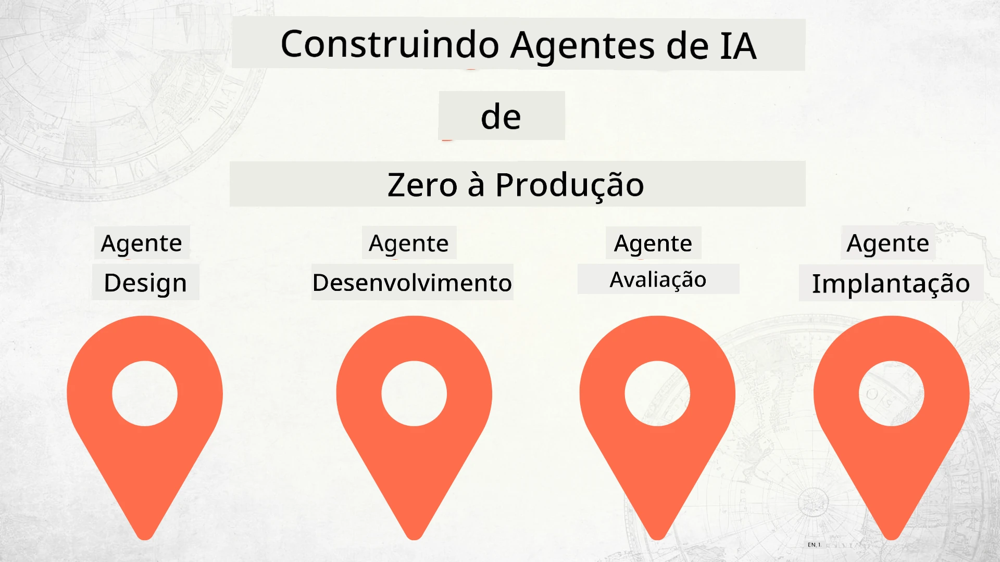

# Construindo Agentes de IA do Zero à Produção



### 🌐 Suporte Multilíngue

#### Suportado via GitHub Action (Automatizado e Sempre Atualizado)

<!-- CO-OP TRANSLATOR LANGUAGES TABLE START -->
[Árabe](../ar/README.md) | [Bengali](../bn/README.md) | [Búlgaro](../bg/README.md) | [Birmanês (Myanmar)](../my/README.md) | [Chinês (Simplificado)](../zh-CN/README.md) | [Chinês (Tradicional, Hong Kong)](../zh-HK/README.md) | [Chinês (Tradicional, Macau)](../zh-MO/README.md) | [Chinês (Tradicional, Taiwan)](../zh-TW/README.md) | [Croata](../hr/README.md) | [Tcheco](../cs/README.md) | [Dinamarquês](../da/README.md) | [Holandês](../nl/README.md) | [Estoniano](../et/README.md) | [Finlandês](../fi/README.md) | [Francês](../fr/README.md) | [Alemão](../de/README.md) | [Grego](../el/README.md) | [Hebraico](../he/README.md) | [Hindi](../hi/README.md) | [Húngaro](../hu/README.md) | [Indonésio](../id/README.md) | [Italiano](../it/README.md) | [Japonês](../ja/README.md) | [Kannada](../kn/README.md) | [Khmer](../km/README.md) | [Coreano](../ko/README.md) | [Lituano](../lt/README.md) | [Malaio](../ms/README.md) | [Malayalam](../ml/README.md) | [Marathi](../mr/README.md) | [Nepali](../ne/README.md) | [Pidgin Nigeriano](../pcm/README.md) | [Norueguês](../no/README.md) | [Persa (Farsi)](../fa/README.md) | [Polonês](../pl/README.md) | [Português (Brasil)](./README.md) | [Português (Portugal)](../pt-PT/README.md) | [Punjabi (Gurmukhi)](../pa/README.md) | [Romeno](../ro/README.md) | [Russo](../ru/README.md) | [Sérvio (Cirílico)](../sr/README.md) | [Eslovaco](../sk/README.md) | [Esloveno](../sl/README.md) | [Espanhol](../es/README.md) | [Suaíli](../sw/README.md) | [Sueco](../sv/README.md) | [Tagalog (Filipino)](../tl/README.md) | [Tamil](../ta/README.md) | [Telugu](../te/README.md) | [Tailandês](../th/README.md) | [Turco](../tr/README.md) | [Ucraniano](../uk/README.md) | [Urdu](../ur/README.md) | [Vietnamita](../vi/README.md)

> **Prefere clonar localmente?**
>
> Este repositório inclui traduções em mais de 50 idiomas, o que aumenta significativamente o tamanho do download. Para clonar sem as traduções, use checkout esparso:
>
> **Bash / macOS / Linux:**
> ```bash
> git clone --filter=blob:none --sparse https://github.com/microsoft/Building-AI-Agents-From-Zero-To-Production.git
> cd Building-AI-Agents-From-Zero-To-Production
> git sparse-checkout set --no-cone '/*' '!translations' '!translated_images'
> ```
>
> **CMD (Windows):**
> ```cmd
> git clone --filter=blob:none --sparse https://github.com/microsoft/Building-AI-Agents-From-Zero-To-Production.git
> cd Building-AI-Agents-From-Zero-To-Production
> git sparse-checkout set --no-cone "/*" "!translations" "!translated_images"
> ```
>
> Isso fornece tudo o que você precisa para concluir o curso com um download muito mais rápido.
<!-- CO-OP TRANSLATOR LANGUAGES TABLE END -->

## Um curso que ensina os fundamentos do Ciclo de Vida de Desenvolvimento de Agentes de IA

[](https://github.com/microsoft/Building-AI-Agents-From-Zero-To-Production/blob/master/LICENSE?WT.mc_id=academic-105485-koreyst)
[](https://GitHub.com/microsoft/Building-AI-Agents-From-Zero-To-Production/graphs/contributors/?WT.mc_id=academic-105485-koreyst)
[](https://GitHub.com/microsoft/Building-AI-Agents-From-Zero-To-Production/issues/?WT.mc_id=academic-105485-koreyst)
[](https://GitHub.com/microsoft/Building-AI-Agents-From-Zero-To-Production/pulls/?WT.mc_id=academic-105485-koreyst)
[](http://makeapullrequest.com?WT.mc_id=academic-105485-koreyst)

[](https://discord.gg/Kuaw3ktsu6)

## 🌱 Começando

Este curso possui aulas cobrindo os fundamentos para construir e implantar Agentes de IA.

Cada lição se baseia na anterior, então recomendamos começar do início e avançar até o final.

Se quiser explorar mais sobre tópicos de Agentes de IA, você pode conferir o [Curso de Agentes de IA para Iniciantes](https://aka.ms/ai-agents-beginners).

### Conheça Outros Estudantes, Tire Suas Dúvidas

Se ficar preso ou tiver qualquer dúvida sobre a construção de Agentes de IA, junte-se ao nosso canal dedicado no Discord no [Microsoft Foundry Discord](https://discord.gg/Kuaw3ktsu6).

### O Que Você Precisa

Cada lição tem seu próprio código de exemplo que você pode executar localmente. Você pode [fazer um fork deste repositório](https://github.com/microsoft/Building-AI-Agents-From-Zero-To-Production/fork) para criar sua própria cópia.

Este curso utiliza atualmente:

- [Microsoft Agent Framework (MAF)](https://aka.ms/ai-agents-beginners/agent-framework)
- [Microsoft Foundry](https://azure.microsoft.com/products/ai-foundry)
- [Azure OpenAI Service](https://azure.microsoft.com/products/ai-foundry/models/openai)
- [Azure CLI](https://learn.microsoft.com/cli/azure/authenticate-azure-cli?view=azure-cli-latest)

Por favor, certifique-se de ter acesso a esses serviços antes de começar.

Mais opções de hospedagem de modelos e serviços em breve.

## 🗃️ Aulas

| **Aula**            | **Descrição**                                                                                  |
|---------------------|------------------------------------------------------------------------------------------------|
| [Design do Agente](./lesson-1-agent-design/README.md)         | Uma introdução ao nosso caso de uso "Integração de Desenvolvedores" e como desenhar agentes eficazes |
| [Desenvolvimento do Agente](./lesson-2-agent-development/README.md) | Usando o Microsoft Agent Framework (MAF), crie 3 agentes para ajudar novos desenvolvedores na integração. |
| [Avaliações do Agente](./lesson-3-agent-evals/README.md)     | Usando o Microsoft Foundry, descubra quão bem nossos Agentes de IA estão performando e como melhorá-los. |
| [Implantação do Agente](./lesson-4-agent-deployment/README.md)  | Usando os Agentes Hospedados e o OpenAI Chatkit, veja como implantar um Agente de IA em produção.     |

## 🎒 Outros Cursos

Nossa equipe produz outros cursos! Confira:

<!-- CO-OP TRANSLATOR OTHER COURSES START -->
### LangChain
[](https://aka.ms/langchain4j-for-beginners)
[](https://aka.ms/langchainjs-for-beginners?WT.mc_id=m365-94501-dwahlin)
[](https://github.com/microsoft/langchain-for-beginners?WT.mc_id=m365-94501-dwahlin)
---

### Azure / Edge / MCP / Agentes
[](https://github.com/microsoft/AZD-for-beginners?WT.mc_id=academic-105485-koreyst)
[](https://github.com/microsoft/edgeai-for-beginners?WT.mc_id=academic-105485-koreyst)
[](https://github.com/microsoft/mcp-for-beginners?WT.mc_id=academic-105485-koreyst)
[](https://github.com/microsoft/ai-agents-for-beginners?WT.mc_id=academic-105485-koreyst)

---
 
### Série de IA Generativa
[](https://github.com/microsoft/generative-ai-for-beginners?WT.mc_id=academic-105485-koreyst)
[-9333EA?style=for-the-badge&labelColor=E5E7EB&color=9333EA)](https://github.com/microsoft/Generative-AI-for-beginners-dotnet?WT.mc_id=academic-105485-koreyst)
[-C084FC?style=for-the-badge&labelColor=E5E7EB&color=C084FC)](https://github.com/microsoft/generative-ai-for-beginners-java?WT.mc_id=academic-105485-koreyst)
[-E879F9?style=for-the-badge&labelColor=E5E7EB&color=E879F9)](https://github.com/microsoft/generative-ai-with-javascript?WT.mc_id=academic-105485-koreyst)

---
 
### Aprendizado Fundamental
[](https://aka.ms/ml-beginners?WT.mc_id=academic-105485-koreyst)
[](https://aka.ms/datascience-beginners?WT.mc_id=academic-105485-koreyst)
[](https://aka.ms/ai-beginners?WT.mc_id=academic-105485-koreyst)
[](https://github.com/microsoft/Security-101?WT.mc_id=academic-96948-sayoung)
[](https://aka.ms/webdev-beginners?WT.mc_id=academic-105485-koreyst)
[](https://aka.ms/iot-beginners?WT.mc_id=academic-105485-koreyst)
[](https://github.com/microsoft/xr-development-for-beginners?WT.mc_id=academic-105485-koreyst)

---
 
### Série Copilot
[](https://aka.ms/GitHubCopilotAI?WT.mc_id=academic-105485-koreyst)
[](https://github.com/microsoft/mastering-github-copilot-for-dotnet-csharp-developers?WT.mc_id=academic-105485-koreyst)
[](https://github.com/microsoft/CopilotAdventures?WT.mc_id=academic-105485-koreyst)
<!-- CO-OP TRANSLATOR OTHER COURSES END -->

## Contribuindo

Este projeto recebe contribuições e sugestões com prazer. A maioria das contribuições exige que você concorde com um
Acordo de Licença de Contribuidor (CLA) declarando que você tem o direito e realmente concede a nós
os direitos de usar sua contribuição. Para detalhes, visite <https://cla.opensource.microsoft.com>.

Quando você submete uma pull request, um bot de CLA determinará automaticamente se é necessário fornecer
um CLA e decorará o PR apropriadamente (por exemplo, verificação de status, comentário). Basta seguir as instruções
fornecidas pelo bot. Você precisará fazer isso apenas uma vez para todos os repositórios que usam nosso CLA.

Este projeto adotou o [Código de Conduta de Código Aberto da Microsoft](https://opensource.microsoft.com/codeofconduct/).
Para mais informações veja o [FAQ do Código de Conduta](https://opensource.microsoft.com/codeofconduct/faq/) ou
entre em contato com [opencode@microsoft.com](mailto:opencode@microsoft.com) para qualquer dúvida ou comentário adicional.

## Marcas Registradas

Este projeto pode conter marcas registradas ou logotipos de projetos, produtos ou serviços. O uso autorizado das marcas ou logotipos da Microsoft
está sujeito e deve seguir
[Diretrizes de Marca e Propriedade Intelectual da Microsoft](https://www.microsoft.com/legal/intellectualproperty/trademarks/usage/general).
O uso de marcas ou logotipos da Microsoft em versões modificadas deste projeto não deve causar confusão ou sugerir patrocínio da Microsoft.
Qualquer uso de marcas ou logotipos de terceiros está sujeito às políticas desses terceiros.

## Obter Ajuda

Se você ficar preso ou tiver dúvidas sobre como criar aplicativos de IA, participe:

[](https://discord.gg/Kuaw3ktsu6)

Se você tiver feedback sobre produtos ou erros durante o desenvolvimento, visite:

[](https://aka.ms/foundry/forum)

---

<!-- CO-OP TRANSLATOR DISCLAIMER START -->
**Aviso Legal**:  
Este documento foi traduzido utilizando o serviço de tradução automática [Co-op Translator](https://github.com/Azure/co-op-translator). Embora nos esforcemos pela precisão, por favor, esteja ciente de que traduções automáticas podem conter erros ou imprecisões. O documento original em seu idioma nativo deve ser considerado a fonte autorizada. Para informações críticas, recomenda-se tradução profissional humana. Não nos responsabilizamos por quaisquer mal-entendidos ou interpretações incorretas decorrentes do uso desta tradução.
<!-- CO-OP TRANSLATOR DISCLAIMER END -->