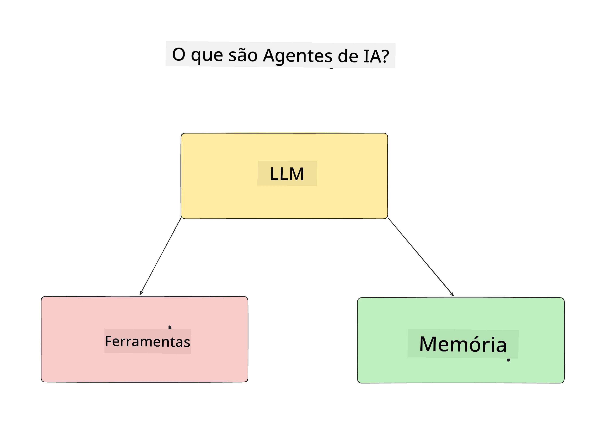
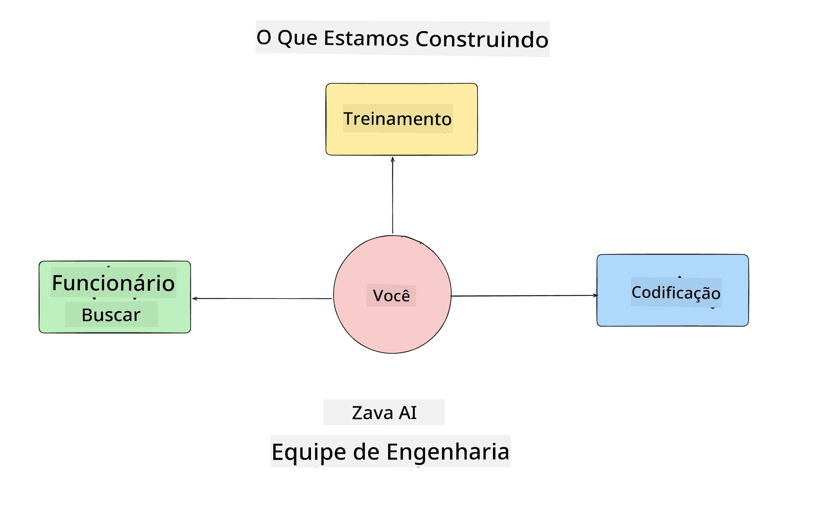
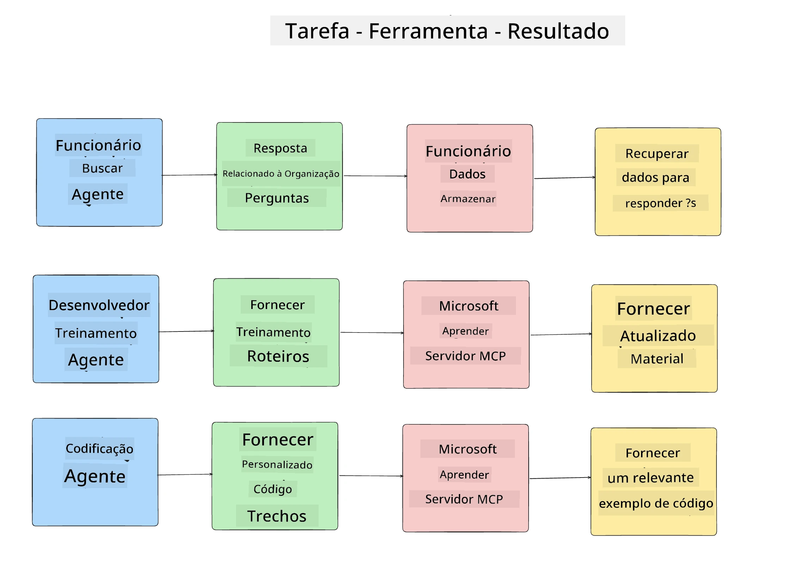
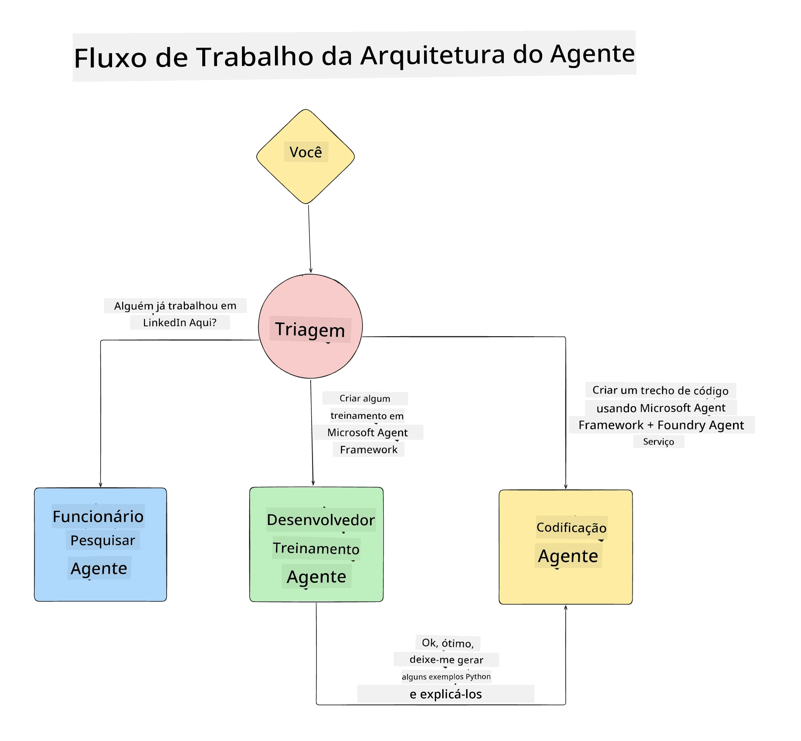

# Lição 1: Design de Agente de IA

Bem-vindo à primeira lição do  "Construindo Agentes de IA do Zero à Produção"!

Nesta lição vamos cobrir:

- Definindo o que são Agentes de IA
  
- Discutir a aplicação de Agentes de IA que estamos construindo  

- Identificar as ferramentas e serviços necessários para cada agente
  
- Arquitetar nossa Aplicação de Agente
  
Vamos começar definindo o que é um agente e por que o usaríamos dentro de uma aplicação.

> **Antes de começar o curso.** Esta primeira lição é conceitual — não há código para executar.
> A partir de [Lição 2](../lesson-2-agent-development/README.md) em diante você precisará: uma **assinatura
> do Azure** com acesso ao **Microsoft Foundry**, um modelo da série **GPT-5** implantado (por
> exemplo `gpt-5.1` — evite os aposentados GPT-4o / GPT-4.1), **Python 3.12+**, e o **Azure CLI**
> (`az login`). Veja [O que você precisa](../README.md#what-you-need) no README do curso para a
> lista completa e links.

## O que são Agentes de IA?

Se esta é sua primeira vez explorando como construir um Agente de IA, você pode ter dúvidas sobre como exatamente definir o que é um Agente de IA.

Uma maneira simples de definir o que é um Agente de IA é pelos componentes que o compõem:

**Modelo de Linguagem de Grande Escala** - O LLM dará suporte tanto à capacidade de processar linguagem natural do usuário para interpretar a tarefa que eles querem completar quanto a interpretar as descrições das ferramentas disponíveis para concluir essas tarefas.

**Ferramentas** - Serão funções, APIs, repositórios de dados e outros serviços que o LLM pode escolher usar para completar as tarefas solicitadas pelo usuário.

**Memória** - É assim que armazenamos tanto interações de curto prazo quanto de longo prazo entre o Agente de IA e o usuário. Armazenar e recuperar essas informações é importante para aprimorar e salvar as preferências do usuário ao longo do tempo.

## Nosso Caso de Uso de Agente de IA

Para este curso, vamos construir uma aplicação de Agente de IA que ajuda novos desenvolvedores a se integrarem à nossa Equipe de Desenvolvimento de Agentes de IA!

Antes de fazermos qualquer trabalho de desenvolvimento, o primeiro passo para criar uma aplicação de Agente de IA bem-sucedida é definir cenários claros sobre como esperamos que nossos usuários interajam com nossos Agentes de IA.

Para esta aplicação, trabalharemos com estes cenários:

**Cenário 1**:  Um novo funcionário entra em nossa organização e quer saber mais sobre a equipe que ingressou e como se conectar com ela.

**Cenário 2:** Um novo funcionário quer saber qual seria a melhor primeira tarefa para começar a trabalhar.

**Cenário 3:** Um novo funcionário quer reunir recursos de aprendizado e exemplos de código para ajudá-lo a começar a completar essa tarefa.

## Identificando as Ferramentas e Serviços

Agora que criamos esses cenários, o próximo passo é mapeá-los para as ferramentas e serviços que nossos agentes de IA precisarão para completar essas tarefas.

Esse processo se enquadra na categoria de Engenharia de Contexto, pois vamos nos concentrar em garantir que nossos Agentes de IA tenham o contexto certo no momento certo para concluir as tarefas.

Vamos fazer isso cenário por cenário e realizar um bom design orientado a agentes listando a tarefa, as ferramentas e os resultados desejados de cada agente.

### Cenário 1 - Agente de Busca de Funcionários

**Tarefa** -   Responder perguntas sobre funcionários na organização, como data de entrada, equipe atual, localização e último cargo.

**Ferramentas** - Banco de dados com a lista atual de funcionários e o organograma

**Resultados** - Capaz de recuperar informações do banco de dados para responder perguntas organizacionais gerais e perguntas específicas sobre funcionários.

### Cenário 2 - Agente de Recomendação de Tarefas

**Tarefa** - Com base na experiência de desenvolvimento do novo funcionário, sugerir 1-3 issues que o novo funcionário possa trabalhar.

**Ferramentas** - Servidor GitHub MCP para obter issues abertas e construir um perfil de desenvolvedor

**Resultados** - Capaz de ler os últimos 5 commits de um perfil do GitHub e as issues abertas em um projeto do GitHub e fazer recomendações com base em uma correspondência

### Cenário 3 -  Agente Assistente de Código

**Tarefa** - Com base nas issues abertas recomendadas pelo Agente "Recomendação de Tarefas", pesquisar e fornecer recursos e gerar trechos de código para ajudar o funcionário.

**Ferramentas** - Microsoft Learn MCP para encontrar recursos e Code Interpreter para gerar trechos de código personalizados.

**Resultados** - Se o usuário pedir ajuda adicional, o fluxo de trabalho deve usar o servidor Learn MCP para fornecer links e trechos de recursos e então transferir para o agente Code Interpreter para gerar pequenos trechos de código com explicações.

## Arquitetando nossa Aplicação de Agente

Agora que definimos cada um dos nossos Agentes, vamos criar um diagrama de arquitetura que nos ajudará a entender como cada agente funcionará em conjunto e separadamente dependendo da tarefa:

## Próximos Passos

Agora que projetamos cada agente e nosso sistema orientado a agentes, vamos para a próxima lição onde desenvolveremos cada um desses agentes!

---

<!-- CO-OP TRANSLATOR DISCLAIMER START -->
**Aviso Legal**:
Este documento foi traduzido usando o serviço de tradução por IA [Co-op Translator](https://github.com/Azure/co-op-translator). Embora nos esforcemos pela precisão, por favor, esteja ciente de que traduções automatizadas podem conter erros ou imprecisões. O documento original em seu idioma nativo deve ser considerado a fonte autorizada. Para informações críticas, recomenda-se tradução profissional humana. Não nos responsabilizamos por quaisquer mal-entendidos ou interpretações incorretas decorrentes do uso desta tradução.
<!-- CO-OP TRANSLATOR DISCLAIMER END -->