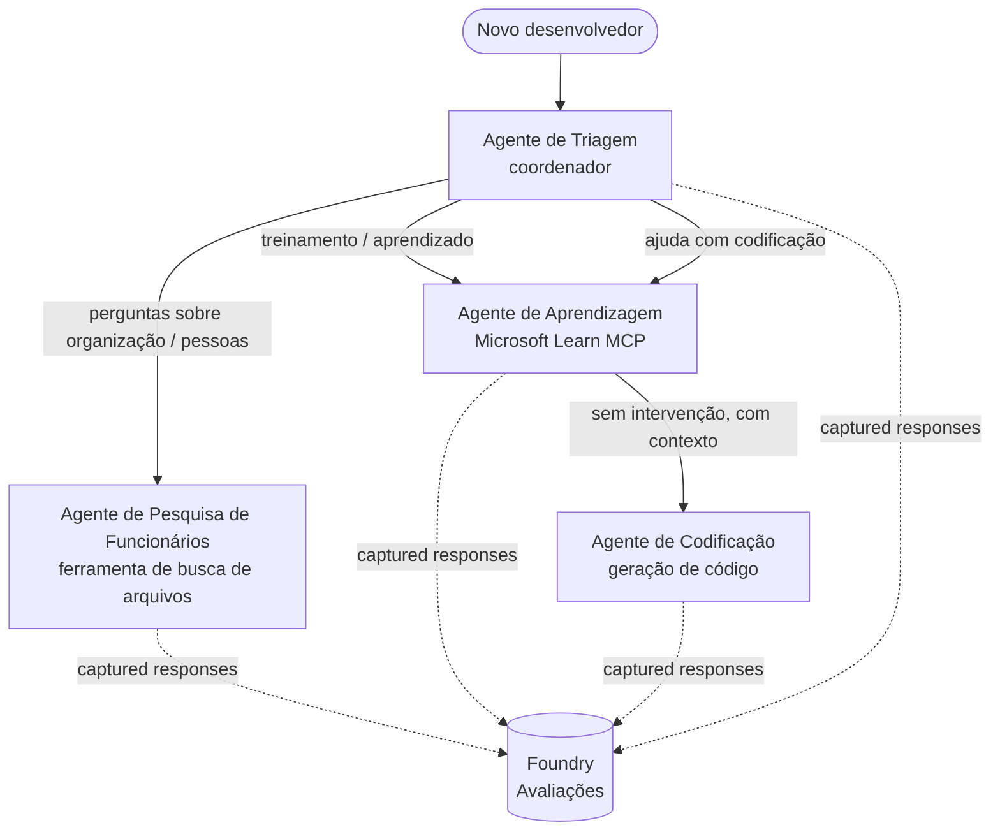

# Lição 3: Avaliações de Agentes com Microsoft Foundry

Bem-vindo à terceira lição do **"Construindo Agentes de IA do Zero à Produção"**!

Na [Lição 2](../lesson-2-agent-development/README.md) você construiu agentes. Nesta lição você
vai aprender a responder uma pergunta muito mais difícil: **eles são bons?** Colocar um agente que
rode é fácil; saber se ele roteia corretamente, permanece fundamentado nos seus dados e usa suas
ferramentas corretamente é o que separa uma demonstração de um sistema de produção.

Nesta lição cobriremos:

- Por que a avaliação de agentes importa e como ela difere de testes tradicionais
- A diferença entre **observabilidade**, **testes de fumaça**, e **avaliações**
- O fluxo de trabalho multiagente que vamos medir
- Os **avaliadores integrados do Microsoft Foundry** (relevância, fundamentação, precisão na chamada de ferramenta, utilização do resultado da ferramenta)
- Um passo a passo do pipeline de avaliação em [`agent-evals.py`](../../../lesson-3-agent-evals/agent-evals.py)
- Como executá-lo e ler os resultados

---

## Por que avaliar agentes?

Um teste unitário tradicional afirma que `add(2, 2) == 4`. Agentes não funcionam assim — o mesmo
prompt pode produzir redações diferentes a cada execução, ferramentas podem ser chamadas em ordens diferentes, e
"correto" frequentemente é uma questão de grau em vez de um booleano. Você não pode afirmar strings exatas.

Em vez disso, você avalia agentes ao longo de **dimensões de qualidade** usando *avaliadores* baseados em modelos (também
chamados de "LLM-as-a-judge") além de verificações determinísticas no uso de ferramentas. Isso lhe diz coisas como:

- A resposta realmente abordou a pergunta? (**relevância**)
- A resposta é sustentada pelos dados recuperados, ou o agente alucinou? (**fundamentação**)
- O agente chamou a ferramenta certa com os argumentos corretos? (**precisão na chamada de ferramenta**)
- O agente realmente utilizou o que a ferramenta retornou? (**utilização do resultado da ferramenta**)

### Três camadas complementares de qualidade

Essas não são técnicas concorrentes — um agente de produção usa todas as três:

| Camada | Pergunta que responde | Custo | Quando é executado | Abordado em |
|-------|--------------------|------|--------------|------------|
| **Observabilidade / rastreamento** | *O que o agente fez, passo a passo?* | Grátis (sempre ativo) | Continuamente em produção | Esta lição |
| **Testes de fumaça** | *O agente está acessível e seguindo seu prompt básico?* | Barato, segundos | A cada deploy | [Lição 4](../lesson-4-agentdeployment/README.md#smoke-testing-the-hosted-agent-ci-gate) |
| **Avaliações** | *Quão **boas** são as respostas?* | Mais lento, medido por modelo | Sob demanda / noturno / pré-lançamento | Esta lição |

Testes de fumaça respondem "quebrou?"; avaliações respondem "é bom?". Você quer ambos.

---

## Pré-requisitos

1. Ter concluído a [Lição 2](../lesson-2-agent-development/README.md) (agentes + armazenamento vetorial).
2. Um projeto **Microsoft Foundry**.
3. **Azure CLI** autenticado: `az login`.
4. **Python 3.12+** e as dependências do curso instaladas:

   ```bash
   pip install -r ../requirements.txt
   ```

5. Variáveis de ambiente (crie um arquivo `.env` nesta pasta ou exporte-as):

   | Variável | Finalidade |
   |----------|---------|
   | `FOUNDRY_PROJECT_ENDPOINT` | O endpoint do seu projeto Foundry (`https://<account>.services.ai.azure.com/api/projects/<project>`). Lido pelo `FoundryChatClient` dos agentes **e** pelo auxiliar de avaliação. |
   | `FOUNDRY_MODEL` | Implantação de modelo em que os **agentes** são executados (por exemplo `gpt-5.1`). |
   | `VECTOR_STORE_ID` | O armazenamento vetorial do diretório de funcionários criado na Lição 2 |
   | `AZURE_AI_MODEL_DEPLOYMENT_NAME` | Implantação de modelo usada **pelos avaliadores** (padrão para `FOUNDRY_MODEL`, depois `gpt-5.1`) |

> Os agentes usam `FoundryChatClient`, que lê a configuração das variáveis com prefixo `FOUNDRY_`
> (`FOUNDRY_PROJECT_ENDPOINT`, `FOUNDRY_MODEL`). O auxiliar de avaliação em nuvem
> usa o SDK `azure-ai-projects` e recorrerá a `FOUNDRY_PROJECT_ENDPOINT` se
> `AZURE_AI_PROJECT_ENDPOINT` não estiver definido — então as duas variáveis `FOUNDRY_` são suficientes para
> executar toda a lição.
>
> Os avaliadores são alimentados por um modelo, então `AZURE_AI_MODEL_DEPLOYMENT_NAME`
> controla qual implantação fará a avaliação — não precisa ser o mesmo modelo que seus
> agentes usam.

---

## O fluxo de trabalho que estamos avaliando

Para avaliar algo, primeiro você precisa executá-lo. Esta lição reutiliza o **Developer Onboarding**
fluxo de trabalho multiagente: um coordenador de **triagem** encaminha para três especialistas.



O fluxo de trabalho é construído com a orquestração de **handoff** do Microsoft Agent Framework. A ideia chave
para avaliação é que **cada turno do agente é persistido no servidor** e identificado por um
`response_id`. Esses IDs são o que entregamos ao serviço de avaliação.

---

## O pipeline de avaliação, passo a passo

[`agent-evals.py`](../../../lesson-3-agent-evals/agent-evals.py) implementa um pipeline de seis passos. Aqui está o que cada passo faz
e por quê.

### Passo 1 — Execute o fluxo de trabalho e registre os IDs de resposta

O fluxo de trabalho é executado com `run_stream(...)`, e à medida que os eventos são transmitidos de volta o código registra o
`response_id` e `conversation_id` produzidos por cada agente. Respostas persistidas são o material bruto
para avaliação — você está avaliando respostas *reais* com formato de produção, não
re-geradas.

### Passo 2 — Resumir o que foi capturado

Um resumo rápido imprime quantas respostas cada agente produziu, para que você possa confirmar que o fluxo de trabalho
realmente exercitou os agentes que você pretende avaliar.

### Passo 3 — Buscar as respostas finais

Para cada agente, o último `response_id` é recuperado através do cliente compatível com OpenAI do projeto
(`project_client.get_openai_client().responses.retrieve(...)`) para que você possa visualizar o
texto que será julgado.

### Passo 4 — Criar a avaliação

Uma avaliação é criada com quatro **avaliadores integrados do Foundry**:

| Avaliador | `evaluator_name` | O que ele mede |
|-----------|------------------|------------------|
| Relevância | `builtin.relevance` | A resposta atende à solicitação do usuário? |
| Fundamentação | `builtin.groundedness` | A resposta é suportada pelos dados recuperados/da ferramenta (não alucinada)? |
| Precisão na chamada de ferramenta | `builtin.tool_call_accuracy` | As ferramentas certas foram chamadas com os argumentos corretos? |
| Utilização da saída da ferramenta | `builtin.tool_output_utilization` | O agente realmente usou os resultados da ferramenta em sua resposta? |

Cada avaliador é inicializado com a implantação nomeada por `AZURE_AI_MODEL_DEPLOYMENT_NAME`.

> **Por que esses quatro?** Relevância e fundamentação medem a *qualidade da resposta*; os dois avaliadores de ferramentas
> medem o *comportamento de agente* — a parte que as métricas tradicionais de NLP deixam totalmente de fora. Para um
> sistema multiagente que usa ferramentas, as métricas de ferramenta costumam ser onde os regressos reais se escondem.

### Passo 5 — Executar a avaliação

Os `response_id`s capturados são passados para `evals.runs.create(...)` como a fonte de dados. O
serviço reproduz cada resposta armazenada através de cada avaliador.

### Passo 6 — Monitorar e ler os resultados

O código consulta a execução até que ela esteja `completed` ou `failed`, então imprime as contagens de resultados e um
**`report_url`** — um link profundo no portal Foundry onde você pode inspecionar as pontuações por métrica,
contagens de aprovação/reprovação, e respostas julgadas individualmente.

---

## Executar

```bash
cd lesson-3-agent-evals
python agent-evals.py
```

Por padrão, ele avalia a primeira consulta de exemplo
(`"I'm new here! Has anyone worked at Microsoft here?"`). Dois outros exemplos de consultas multi-intenção
estão incluídos em `run_evaluation_workflow()` — troque a variável `query` para testar cenários de roteamento
que exercitam mais agentes em uma única execução.

Fluxo esperado no console:

```
Step 1: Running Developer Onboarding Workflow
Step 2: Response Data Summary
Step 3: Fetching Agent Responses
Step 4: Creating Evaluation
Step 5: Running Evaluation
Step 6: Monitoring Evaluation
  Status: running ...
  Evaluation completed successfully
  Report URL: https://...   <-- open this in the Foundry portal
```

---

## Observabilidade e rastreamento

As avaliações dizem *quão boas* foram as respostas; a **observabilidade** diz *o que aconteceu*
para produzi-las — cada salto de agente, chamada de ferramenta, contagem de tokens e latência. No Microsoft Foundry,
as execuções de agentes emitem traces OpenTelemetry que você pode visualizar no portal, e o Agent Framework pode
exportá-los para o Azure Monitor / Application Insights com uma única chamada:

```python
from agent_framework.foundry import FoundryChatClient

client = FoundryChatClient()
client.configure_azure_monitor()   # exportar rastreamentos e métricas para o Application Insights
```

Use o rastreamento para **depurar** uma baixa pontuação de avaliação: quando a fundamentação cai, o trace mostra se
a ferramenta de busca de arquivos não retornou nada, ou retornou dados que o agente então ignorou (o que é
exatamente o que a utilização da saída da ferramenta está avaliando).

---

## De "execuções" a "boas": como usar isso na prática

- **Portão pré-lançamento.** Execute avaliações contra um conjunto fixo de consultas representativas antes de
  promover um novo prompt ou modelo. Compare as pontuações com a versão anterior — trate uma queda como uma
  regressão.
- **Sinal de qualidade noturno.** Agende a avaliação para detectar deriva de dados ou alterações de dependência
  .
- **Combine com testes de fumaça.** O [Teste de fumaça da Lição 4](../lesson-4-agentdeployment/README.md#smoke-testing-the-hosted-agent-ci-gate)
  é seu gate rápido por deploy; avaliações são o gate de qualidade mais lento e profundo. Execute o barato
  em cada merge e o caro em uma programação ou antes do lançamento.

---

## Nota de modernização

Este exemplo está sendo migrado para a superfície de API atual do Microsoft Agent Framework Foundry
(`agent_framework.foundry`). Se você estiver atualizando o código, veja o arquivo
[`MIGRATION-GUIDE.md`](../MIGRATION-GUIDE.md) para os mapeamentos verificados antes/depois de importação e de cliente
(por exemplo `AzureAIClient` -> `FoundryChatClient`, e construção de ferramentas hospedadas via
`client.get_file_search_tool(...)` / `client.get_mcp_tool(...)`). Os conceitos de avaliação e o
pipeline de seis passos acima não são alterados por essa migração.

---

## Recursos

- [Avaliar modelos e aplicações de IA generativa (Microsoft Learn)](https://learn.microsoft.com/en-us/azure/ai-foundry/concepts/evaluation-approach-gen-ai)
- [Avaliadores integrados para IA generativa](https://learn.microsoft.com/en-us/azure/ai-foundry/concepts/evaluation-evaluators/agent-evaluators)
- [Observabilidade no Microsoft Foundry](https://learn.microsoft.com/en-us/azure/ai-foundry/concepts/observability)
- [Microsoft Agent Framework](https://github.com/microsoft/agent-framework)
- [Orquestração de handoff de agentes](https://learn.microsoft.com/en-us/agent-framework/workflows/orchestrations/handoff)

---

<!-- CO-OP TRANSLATOR DISCLAIMER START -->
**Aviso Legal**:
Este documento foi traduzido usando o serviço de tradução por IA [Co-op Translator](https://github.com/Azure/co-op-translator). Embora nos esforcemos pela precisão, por favor, esteja ciente de que traduções automatizadas podem conter erros ou imprecisões. O documento original em seu idioma nativo deve ser considerado a fonte autorizada. Para informações críticas, recomenda-se tradução profissional humana. Não nos responsabilizamos por quaisquer mal-entendidos ou interpretações incorretas decorrentes do uso desta tradução.
<!-- CO-OP TRANSLATOR DISCLAIMER END -->