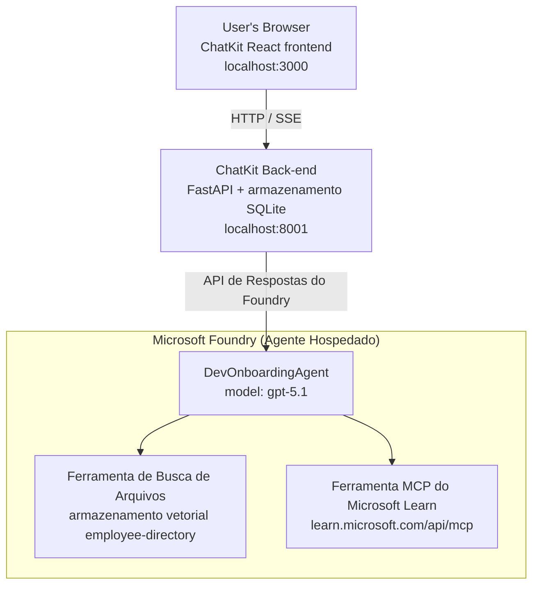

# Lesson 4: Implantação de Agente com Microsoft Foundry Hosted Agents + ChatKit

Esta lição demonstra como implantar um agente que usa ferramentas no Microsoft Foundry como um hosted agent e criar um frontend baseado em ChatKit para interagir com ele.

## Arquitetura

O agente hospedado é um **único `DevOnboardingAgent`** (executando em `gpt-5.1`) que responde perguntas de integração de desenvolvedores usando duas ferramentas hospedadas: uma ferramenta **File Search** sobre o vector store employee-directory, e a ferramenta **Microsoft Learn MCP**. Um frontend React com ChatKit comunica-se com um backend FastAPI, que chama o agente através da **Responses API** do Foundry.



## Pré-requisitos

1. **Microsoft Foundry Project** na região North Central US
2. **Azure CLI** autenticado (`az login`)
3. **Azure Developer CLI** (`azd`) instalado
4. **Python 3.12+** e **Node.js 18+**
5. **Vector Store** criado com dados de funcionários

## Início Rápido

### 1. Configure as Variáveis de Ambiente

```bash
cd lesson-4-agentdeployment
cp .env.example .env
# Edite o arquivo .env com os detalhes do seu projeto Microsoft Foundry
```

### 2. Implemente o Agente Hospedado

**Opção A: Usando Azure Developer CLI (Recomendado)**

```bash
cd hosted-agent
azd auth login
azd agent deploy
```

**Opção B: Usando Docker + Azure Container Registry**

```bash
cd hosted-agent

# Construir o contêiner
docker build -t developer-onboarding-agent:latest .

# Tag para o ACR
docker tag developer-onboarding-agent:latest <your-acr>.azurecr.io/developer-onboarding-agent:latest

# Enviar para o ACR
az acr login --name <your-acr>
docker push <your-acr>.azurecr.io/developer-onboarding-agent:latest

# Implantar via portal Microsoft Foundry ou SDK
```

### 3. Inicie o Backend do ChatKit

```bash
cd chatkit-server
python -m venv .venv
source .venv/bin/activate  # No Windows: .venv\Scripts\activate
pip install -r requirements.txt
python app.py
```

O servidor será iniciado em `http://localhost:8001`

### 4. Inicie o Frontend do ChatKit

```bash
cd chatkit-server/frontend
npm install
npm run dev
```

O frontend será iniciado em `http://localhost:3000`

### 5. Teste o Aplicativo

Abra `http://localhost:3000` no seu navegador e teste estas consultas:

**Busca de Funcionários:**
- "Sou novo aqui! Alguém já trabalhou na Microsoft?"
- "Quem tem experiência com Azure Functions?"

**Recursos de Aprendizado:**
- "Crie um caminho de aprendizado para Kubernetes"
- "Quais certificações devo buscar para arquitetura de nuvem?"

**Ajuda de Programação:**
- "Ajude-me a escrever código Python para conectar ao CosmosDB"
- "Mostre-me como criar uma Azure Function"

**Consultas Multi-Agente:**
- "Estou começando como engenheiro de nuvem. Com quem devo me conectar e o que devo aprender?"

## Estrutura do Projeto

```
lesson-4-agentdeployment/
├── .env.example                 # Environment variables template
├── implementation-plan.md       # Detailed implementation guide
├── README.md                    # This file
├── hosted-agent/               # Microsoft Foundry hosted agent
│   ├── main.py                 # Multi-agent workflow implementation
│   ├── requirements.txt        # Python dependencies
│   ├── Dockerfile              # Container definition
│   └── agent.yaml              # Agent deployment configuration
└── chatkit-server/             # ChatKit server application
    ├── app.py                  # FastAPI backend
    ├── store.py                # SQLite persistence layer
    ├── requirements.txt        # Python dependencies
    └── frontend/               # React frontend
        ├── package.json
        ├── vite.config.ts
        ├── tsconfig.json
        ├── index.html
        └── src/
            ├── main.tsx
            ├── App.tsx
            ├── App.css
            └── index.css
```

## O Agente e Suas Ferramentas

O agente hospedado é um **agente único** (`DevOnboardingAgent`, definido em `hosted-agent/main.py`) que lida com três domínios de integração. Em vez de orquestrar sub-agentes separados, ele expõe cada capacidade como uma ferramenta (ou depende diretamente do modelo):

| Capacidade | Como é tratada | Ferramenta |
|-----------|------------------|------|
| **Pesquisa e conexões de funcionários** | File Search hospedado no Foundry sobre o vector store employee-directory | `client.get_file_search_tool(vector_store_ids=[...])` |
| **Aprendizado e treinamento** | Servidor Microsoft Learn MCP (ferramenta MCP hospedada) | `client.get_mcp_tool(url="https://learn.microsoft.com/api/mcp")` |
| **Assistência de codificação** | Gerenciado diretamente pelo modelo `gpt-5.1` — sem ferramenta externa | — |

O agente é criado com `client.as_agent(name="DevOnboardingAgent", instructions=..., tools=[file_search_tool, learn_mcp_tool])` e servido com `from_agent_framework(agent).run()`.

> **Nota de design.** Rascunhos anteriores desta lição usaram um fluxo de trabalho multi-agente `HandoffBuilder` (Triagem → especialistas). O agente entregue é um único agente que usa ferramentas, o que é mais simples de implantar e raciocinar para perguntas e respostas no estilo de integração. Para um exemplo de orquestração multi-agente e transferências, veja Lição 2 e Lição 3.

## Teste de Smoke do Agente Hospedado (Gate de CI)

Implantar um agente hospedado "com sucesso" apenas prova que o plano de controle aceitou a
definição — **não** prova que o agente realmente responda. Uma dependência ausente,
roteamento de modelo incorreto, ou uma conexão expirada podem deixar um agente com status verde, mas silencioso.

Esta lição inclui um **smoke test** leve que atua como uma verificação rápida e barata pós-implantação
gate. Ele usa a [AI Smoke Test](https://github.com/marketplace/actions/ai-smoke-test)
GitHub Action para POSTar prompts para o endpoint **Responses** do agente no Foundry
(`POST {project_endpoint}/agents/{agent_name}/endpoint/protocols/openai/responses`)
e afirmar sobre o texto retornado. Ele captura implantações quebradas, regressões de autenticação,
deriva do system-prompt, e falhas no threading em segundos.

> Testes smoke **não** substituem as avaliações completas em
> [Lição 3](../lesson-3-agent-evals/README.md) — eles são um complemento. Testes smoke
> respondem *"o agente está acessível, respondendo e seguindo expectativas básicas do prompt?"*;
> avaliações respondem *"quão boa é a resposta?"*. Rode o gate barato em todo deploy.

### O que é testado

O catálogo está em [`hosted-agent/tests/smoke-tests.json`](../../../lesson-4-agentdeployment/hosted-agent/tests/smoke-tests.json)
e exerce os três domínios do agente além da aderência ao prompt e ao threading multi-turno:

| Teste | O que verifica |
|------|------------------|
| `reachability` | O agente responde com texto não vazio e dentro do escopo |
| `employee-search` | O domínio de pesquisa de arquivos retorna um `200` saudável (resposta depende dos dados) |
| `learning-path` | O domínio de aprendizado ecoa o tópico e produz uma resposta no estilo de um caminho de aprendizado |
| `coding-assistance` | O domínio de codificação retorna uma resposta em Python com formato de código |
| `prompt-adherence-offtopic` | Pedido fora do tópico é redirecionado, não respondido em detalhe |
| `threading-turn-1/2` | O estado da conversa é mantido entre turnos via `previous_response_id` |

### Execute no CI

O workflow em [`.github/workflows/smoke-test-hosted-agent.yml`](../../../.github/workflows/smoke-test-hosted-agent.yml)
tem dois jobs:

- **`static`** — um gate rápido, sem Azure, que roda em todo pull request e push:
  ele compila todas as fontes Python (`py_compile`) e verifica links Markdown. Nenhum segredo
  é necessário, então funciona em PRs de fork.
- **`smoke`** — o smoke test conectado ao Azure abaixo. Ele roda sob demanda
  (Actions → **Agent CI (static + smoke)** → Run workflow) e pode ser encadeado após o seu
  workflow de deploy.

Configure essas **variáveis** e **secrets** do repositório para o job de smoke:

| Tipo | Nome | Valor |
|------|------|-------|
| Variável | `FOUNDRY_PROJECT_ENDPOINT` | `https://<account>.services.ai.azure.com/api/projects/<project>` |
| Variável | `HOSTED_AGENT_NAME` | Nome do agente implantado (ex.: `dev-onboarding` — deve coincidir com sua implantação) |
| Segredo | `AZURE_CLIENT_ID` / `AZURE_TENANT_ID` / `AZURE_SUBSCRIPTION_ID` | Identidade federada OIDC para `azure/login` |

A identidade do runner precisa da role **`Azure AI User`** no **escopo do projeto Foundry** para que possa
chamar os endpoints do plano de dados Responses (e conversations). Conceda-a com:

```bash
az role assignment create \
  --assignee <object-id-or-appId-of-runner-identity> \
  --role "Azure AI User" \
  --scope "/subscriptions/<sub>/resourceGroups/<rg>/providers/Microsoft.CognitiveServices/accounts/<account>/projects/<project>"
```

### Execute localmente

Você pode executar o mesmo catálogo antes de enviar. Adquira um token do plano de dados com escopo para
`https://ai.azure.com/` e aponte o runner para sua implantação:

```bash
# O público DEVE ser https://ai.azure.com/ (tokens de cognitiveservices.azure.com são rejeitados)
export FOUNDRY_TOKEN=$(az account get-access-token --resource https://ai.azure.com/ --query accessToken -o tsv)

git clone https://github.com/JFolberth/ai-smoketest && cd ai-smoketest
python runner.py \
  --project-endpoint "https://<account>.services.ai.azure.com/api/projects/<project>" \
  --agent-name dev-onboarding \
  --tests-file ../lesson-4-agentdeployment/hosted-agent/tests/smoke-tests.json
```

Códigos de saída: `0` todos passaram, `1` uma asserção falhou, `2` erro do runner (catálogo / token inválido).

## Solução de Problemas

### Agente não respondendo
- Verifique se o agente hospedado está implantado e em execução no Microsoft Foundry
- Verifique se `HOSTED_AGENT_NAME` e `HOSTED_AGENT_VERSION` correspondem à sua implantação

### Erros do vector store
- Assegure que `VECTOR_STORE_ID` esteja configurado corretamente
- Verifique se o vector store contém os dados dos funcionários

### Erros de autenticação
- Execute `az login` para atualizar as credenciais
- Certifique-se de que você tem acesso ao projeto Microsoft Foundry

## Recursos

- [Documentação do Microsoft Foundry Hosted Agents](https://learn.microsoft.com/en-us/azure/ai-foundry/agents/concepts/hosted-agents)
- [Microsoft Agent Framework](https://github.com/microsoft/agent-framework)
- [Exemplo de integração com ChatKit](https://github.com/microsoft/agent-framework/tree/main/python/samples/demos/chatkit-integration)
- [Azure Developer CLI](https://learn.microsoft.com/en-us/azure/developer/azure-developer-cli/overview)
- [AI Smoke Test GitHub Action](https://github.com/marketplace/actions/ai-smoke-test)
- [Smoke Test Microsoft Foundry Agents with GitHub Actions (blog)](https://techcommunity.microsoft.com/blog/azuredevcommunityblog/smoke-test-microsoft-foundry-agents-with-github-actions/4531912)

---

## Próximos Passos

Seu agente roda em infraestrutura gerenciada pela Microsoft. Para levá-lo à produção empresarial —
controlando onde seus dados residem (soberania de dados, rede privada, trazer seu próprio Azure
Cosmos DB / Storage / AI Search) e governando suas ferramentas — continue para
**[Lição 5: Hosted Agents em Produção](../lesson-5-hosted-agents-production/README.md)**, que
explica a diferença crucial entre **Hosted Agents** e **Capability Hosts**.

---

<!-- CO-OP TRANSLATOR DISCLAIMER START -->
**Aviso Legal**:
Este documento foi traduzido usando o serviço de tradução por IA [Co-op Translator](https://github.com/Azure/co-op-translator). Embora nos esforcemos pela precisão, por favor, esteja ciente de que traduções automatizadas podem conter erros ou imprecisões. O documento original em seu idioma nativo deve ser considerado a fonte autorizada. Para informações críticas, recomenda-se tradução profissional humana. Não nos responsabilizamos por quaisquer mal-entendidos ou interpretações incorretas decorrentes do uso desta tradução.
<!-- CO-OP TRANSLATOR DISCLAIMER END -->