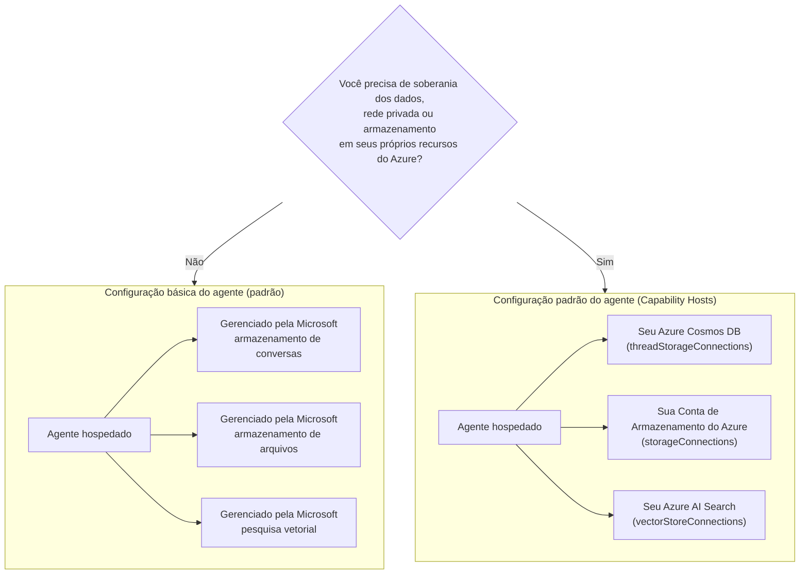

# Lição 5: Agentes Hospedados em Produção — Armazenamento, Memória & Governança

Na [Lição 4](../lesson-4-agentdeployment/README.md) você implantou o Agente de Integração de Desenvolvedores
como um **Agente Hospedado do Microsoft Foundry** e colocou um frontend ChatKit na frente dele. Essa
lição respondeu *"como eu enviar um agente?"*. Esta lição responde às perguntas que vêm a seguir
em uma empresa: **Onde os dados do meu agente são armazenados? Quem os controla? Como eu atendo aos requisitos de conformidade,**
de rede e de governança?**

A ideia mais importante nesta lição é a diferença entre um **Agente Hospedado** e um
**Host de Capacidade** — dois conceitos fáceis de confundir, mas que resolvem problemas completamente diferentes
problemas.

## Objetivos de Aprendizagem

Ao final desta lição você será capaz de:

- Explicar o que um **Agente Hospedado** oferece (execução gerenciada pela Microsoft) e o que ele **não** oferece.
- Explicar o que é um **Host de Capacidade** e exatamente quando você precisa de um.
- Escolher entre **configuração básica do agente** (armazenamento gerenciado pela Microsoft) e **configuração padrão do agente**
  (usar seus próprios recursos do Azure).
- Entender como **histórico de conversas, uploads de arquivos e armazenamentos vetoriais** são persistidos, e como
  redirecioná-los para seu próprio Azure Cosmos DB, Azure Storage e Azure AI Search.
- Aplicar controles de governança: soberania de dados, rede privada, e **aprovação de ferramentas MCP hospedadas**.

---

## Pré-requisitos

1. Ter concluído a [Lição 4](../lesson-4-agentdeployment/README.md) — você tem um agente hospedado implantado.
2. Um projeto **Microsoft Foundry** e uma conta Azure com permissão para criar recursos
   (Cosmos DB, Storage, Azure AI Search) e atribuir funções na assinatura/grupo de recursos.
3. **Azure CLI** autenticado: `az login` (e `az account set --subscription <id>` se você tiver
   mais de uma assinatura).
4. **Azure Developer CLI** (`azd`) instalado — usado para o fluxo de provisionamento da configuração padrão.
5. **Python 3.12+** com as dependências do curso instaladas (`pip install -r ../requirements.txt`).
6. Uma implantação de modelo atual e não aposentada (por exemplo `gpt-5.1`). Evite GPT-4o / GPT-4.1 aposentados.

> Esta lição é predominantemente conceitual e focada no plano de controle. Você pode lê-la do início ao fim sem
> provisionar nada, e então usar os exercícios práticos quando estiver pronto para configurar uma
> configuração padrão.

---

## 1. Agentes Hospedados: o que o Foundry gerencia para você

Um **Agente Hospedado** é um agente cujo *ambiente de execução* é totalmente gerenciado pelo Microsoft
Foundry Agent Service. Quando você implanta um agente hospedado (como fez na Lição 4), o Foundry fornece:

- **Computação** — o runtime que executa o código e as ferramentas do seu agente.
- **Escalonamento** — réplicas sobem e descem conforme a carga (veja `agent.yaml` `scale` na Lição 4).
- **Identidade** — uma identidade gerenciada para o agente, para que ele se autentique no Azure sem segredos.
- **Observabilidade** — rastreamento e telemetria (veja a seção de observabilidade da Lição 3).
- **Gerenciamento de sessão** — threads/conversas, para que chats de múltiplas rodadas "lembrem" das rodadas anteriores.

> **Ponto chave:** Você **não** precisa configurar um Host de Capacidade apenas para *executar* um Agente Hospedado.
> Agente. Um agente hospedado funciona imediatamente na infraestrutura gerenciada pela Microsoft.

---

## 2. Agentes Hospedados vs Hosts de Capacidade

**Agentes Hospedados e Hosts de Capacidade resolvem problemas diferentes.**

**Agentes Hospedados** fornecem o ambiente de execução gerenciado pela Microsoft, incluindo computação, escalonamento,
identidade, observabilidade e gerenciamento de sessão. Você **não** precisa de Hosts de Capacidade apenas para executar
um Agente Hospedado.

**Hosts de Capacidade** são necessários apenas quando você quer que o Agent Service use **recursos de propriedade do cliente**
em vez do armazenamento gerenciado pela Microsoft. Se você estiver satisfeito com o armazenamento padrão gerenciado pela Microsoft,
pesquisa vetorial e persistência de conversas, **nenhuma configuração de Host de Capacidade
é necessária.**

Se sua organização requer **soberania de dados, rede privada, controles de conformidade ou
armazenamento em seu próprio Azure Cosmos DB, Conta de Armazenamento do Azure e recursos Azure AI Search**, então
você configura Hosts de Capacidade para conectar o Agent Service a esses recursos.

Em uma frase:

> Um **Agente Hospedado** é sobre *onde seu agente roda*. Um **Host de Capacidade** é sobre *onde os
> dados do seu agente vivem*.

| Preocupação | Agente Hospedado | Host de Capacidade |
|---------|--------------|-----------------|
| Computação / escalonamento / identidade | ✅ Fornecido | — |
| Observabilidade / rastreamento | ✅ Fornecido | — |
| Gerenciamento de conversas & sessões de thread | ✅ Fornecido | Redireciona *para onde é armazenado* |
| Onde o histórico de conversas é armazenado | Gerenciado pela Microsoft por padrão | Seu Azure Cosmos DB |
| Onde arquivos enviados são armazenados | Gerenciado pela Microsoft por padrão | Sua Conta de Armazenamento do Azure |
| Onde embeddings vetoriais são armazenados | Gerenciado pela Microsoft por padrão | Seu Azure AI Search |
| Necessário para executar um agente? | ✅ Sim (ele *é* o host do agente) | ❌ Não — opcional |
| Necessário para soberania de dados / armazenamento BYO? | ❌ Sozinho não é suficiente | ✅ Sim |

---

## 3. Configuração básica vs padrão do agente

O Foundry descreve as duas configurações de dados como **configuração básica** e **configuração padrão** do agente.



### When to stay on basic setup (no Capability Host)

- Desenvolvimento, prototipagem e testes.
- Ferramentas internas onde o armazenamento gerenciado pela Microsoft satisfaz sua política de tratamento de dados.
- Você quer o caminho mais rápido para ter um agente funcionando com a menor infraestrutura.

### When you need standard setup (Capability Hosts)

- **Soberania de dados** — todos os dados do agente devem permanecer em sua assinatura/região do Azure.
- **Controle de segurança** — você deve usar suas próprias contas de armazenamento, bancos de dados e serviços de busca.
- **Conformidade** — você tem requisitos regulatórios ou organizacionais sobre onde os dados residem.
- **Rede privada** — o tráfego deve permanecer dentro da sua rede virtual (traga sua própria rede virtual - BYO).

> **Recomendação da Microsoft:** use *contas/projetos* Foundry *separados* para configuração padrão vs
> configuração básica. Evite misturar tipos de configuração na mesma conta Foundry.

---

## 4. Como os Hosts de Capacidade funcionam

Um **Host de Capacidade** é um sub-recurso que você configura em **dois escopos**: a **conta** Foundry
e o Foundry **projeto**. Ele informa ao Agent Service onde armazenar e processar os dados do agente:
conversa, histórico de conversas, uploads de arquivos e armazenamentos vetoriais.

Duas regras importam mais:

1. **Conta antes do projeto.** Você não pode criar um host de capacidade de projeto a menos que um
   host de capacidade em nível de conta já exista.
2. **Sem herança de configuração.** O host de capacidade do **projeto** é o que o Agent Service
   realmente lê para decidir quais recursos de armazenamento/conversação/vetoriais usar. As conexões em nível de conta
   não são usadas automaticamente por um projeto — o host de capacidade do projeto deve
   referenciá-las explicitamente.

### Conexões que uma configuração padrão precisa

Hosts de Capacidade referenciam **conexões** (criadas na sua conta/projeto Foundry) que apontam para
seus recursos do Azure:

| Propriedade do host de capacidade | Armazena | Seu recurso do Azure |
|--------------------------|--------|---------------------|
| `threadStorageConnections` | definições do agente + histórico de conversas | Azure Cosmos DB |
| `storageConnections` | Uploads de arquivos / blob storage | Conta de Armazenamento do Azure |
| `vectorStoreConnections` | Embeddings vetoriais para recuperação/busca | Azure AI Search |
| `aiServicesConnections` *(opcional)* | Suas próprias implantações de modelo | Azure OpenAI |

Each connection must have `authType`, `category`, `target` (the service **endpoint URL**, not the
resource ID), and `metadata.ResourceId` (the full Azure resource ID) populated, or Agent Service
cannot resolve the resource at runtime.

### Configuring the capability hosts (control plane)

Hosts de Capacidade atualmente são gerenciados via **Azure Resource Manager REST API** (ainda não existe
um SDK para gerenciamento de hosts de capacidade). Primeiro crie o host de capacidade **da conta**:

```http
PUT https://management.azure.com/subscriptions/{subscriptionId}/resourceGroups/{rg}/providers/Microsoft.CognitiveServices/accounts/{account}/capabilityHosts/{name}?api-version=2025-06-01

{
  "properties": { "capabilityHostKind": "Agents" }
}
```

Em seguida crie o host de capacidade **do projeto** que referencia suas conexões:

```http
PUT https://management.azure.com/subscriptions/{subscriptionId}/resourceGroups/{rg}/providers/Microsoft.CognitiveServices/accounts/{account}/projects/{project}/capabilityHosts/{name}?api-version=2025-06-01

{
  "properties": {
    "capabilityHostKind": "Agents",
    "threadStorageConnections": ["my-cosmosdb-connection"],
    "vectorStoreConnections":  ["my-ai-search-connection"],
    "storageConnections":      ["my-storage-connection"]
  }
}
```

> **Restrições a lembrar:**
> - **Um host de capacidade por escopo.** Um segundo no mesmo escopo retorna `409 Conflict`.
> - **Sem atualizações.** Para alterar a configuração você deve **deletar e recriar** o host de capacidade.
> - **A exclusão é destrutiva.** Deletar um host de capacidade remove o acesso dos agentes aos arquivos,
>   conversas e armazenamentos vetoriais aos quais ele apontava.

### Verifique se funciona

Após a configuração, execute uma conversa de teste e confirme que:

- As conversas aparecem no **seu Azure Cosmos DB**.
- Os arquivos enviados aparecem na **sua Conta de Armazenamento do Azure**.
- Dados vetoriais aparecem no **seu índice do Azure AI Search**.

---

## 5. Memória & gerenciamento de contexto

"Gerenciamento de sessão" (uma funcionalidade do Agente Hospedado) e "onde as threads são armazenadas" (uma preocupação do Host de Capacidade)
se combinam para dar ao seu agente **memória**:

- Uma **thread** (conversa) mantém as rodadas ordenadas de um chat. A Responses API encadeia chamadas
  via `previous_response_id` (você viu isto nos testes iniciais da Lição 4).
- Na **configuração básica**, o estado da thread/conversa vive no armazenamento gerenciado pela Microsoft.
- Na **configuração padrão**, esse mesmo estado é persistido no **seu Azure Cosmos DB** via
  `threadStorageConnections` — fornecendo histórico de conversas durável, consultável e soberano.

Esta é a diferença entre um agente que "lembra dentro de uma sessão" e um sistema empresarial
onde cada conversa é retida dentro do seu próprio perímetro de conformidade.

---

## 6. Lista de verificação de governança & segurança

Use esta lista de verificação ao promover um agente hospedado de protótipo para produção:

- [ ] **Decida configuração básica vs padrão** usando as questões em §3 — documente a decisão.
- [ ] **Soberania de dados:** se exigido, configure Hosts de Capacidade para que o histórico de conversas
      (Cosmos DB), arquivos (Storage) e vetores (AI Search) permaneçam em sua assinatura/região.
- [ ] **Rede privada:** para configuração padrão, restrinja o tráfego com traga sua própria rede virtual
      para que os dados não saiam da sua rede (ajuda a prevenir exfiltração de dados).
- [ ] **RBAC:** conceda o menor privilégio. Criar hosts de capacidade requer **Contributor** na
      conta Foundry; atribuir acesso aos seus recursos do Azure requer **User Access Administrator**
      ou **Owner**.
- [ ] **Governança de ferramentas MCP hospedadas:** revise cada servidor MCP que seu agente pode chamar e defina um
      **modo de aprovação** (veja §7). Nunca exponha uma ferramenta externa não revisada a um agente em produção.
- [ ] **Observabilidade:** confirme que rastreamento/telemetria está ativado (Lição 3) para que você possa auditar as chamadas das ferramentas.
- [ ] **Custo:** recursos BYO (Cosmos DB, AI Search, Storage) são cobrados na *sua* assinatura —
      dimensione-os e monitore-os. A configuração básica incorpora o armazenamento ao serviço gerenciado.

---

## 7. Ferramentas MCP hospedadas & fluxos de aprovação

O Agente de Integração de Desenvolvedores na Lição 4 já usa uma **ferramenta MCP hospedada** — o
[Servidor MCP do Microsoft Learn](https://learn.microsoft.com/api/mcp) — adicionado com:

```python
client.get_mcp_tool(
    name="Microsoft Learn MCP",
    url="https://learn.microsoft.com/api/mcp",
    approval_mode="never_require",
)
```

O **Model Context Protocol (MCP)** é um padrão aberto que permite que um agente descubra e chame
ferramentas externas por uma interface uniforme. **Ferramentas MCP hospedadas** permitem que o Foundry chame um servidor MCP em nome do
agente. Dois mecanismos de governança importam em produção:

- **`approval_mode`** — controla se um humano/chamador deve aprovar cada invocação da ferramenta.
  - `never_require` é conveniente para um servidor confiável e somente leitura como o Microsoft Learn.
  - Para servidores que podem **escrever** ou alcançar sistemas sensíveis, exija aprovação para que uma chamada seja
    revisada antes de ser executada. Este é o seu **fluxo de aprovação**.
- **Lista de permissões de servidores** — conecte apenas servidores MCP que você revisou e confia. Trate a URL de um MCP
  como qualquer outra dependência de produção.

> **Experimente:** altere o `approval_mode` do agente da Lição 4 para exigir aprovação, reimplante, e
> observe como as chamadas de ferramenta agora pausam para confirmação antes de serem executadas.

---

## Exercícios práticos

1. **Classifique um cenário.** Para cada um destes, decida *configuração básica* ou *configuração padrão* e justifique:
   (a) uma demo de hackathon, (b) um assistente de integração na área de saúde lidando com PII (informações pessoais identificáveis), (c) um FAQ interno,
   (d) um agente bancário que deve manter todos os dados na região.
2. **Mapeie o armazenamento.** Para o agente da Lição 4, liste qual propriedade do host de capacidade armazenaria
   seus (a) histórico de chat, (b) arquivos de funcionários enviados, (c) embeddings vetoriais.
3. **Projete um fluxo de aprovação.** Adicione uma ferramenta MCP hipotética "criar ticket no Jira" ao agente.
   Qual `approval_mode` você usaria e por quê?
4. **Compromisso de custo.** Escreva duas ou três frases sobre as implicações de custo de migrar da configuração básica
   para a configuração padrão para um agente de alto tráfego.

---

## Recursos

- [Hosts de Capacidade — Microsoft Foundry](https://learn.microsoft.com/azure/foundry/agents/concepts/capability-hosts)
- [Configuração padrão do agente (prontidão empresarial integrada)](https://learn.microsoft.com/azure/foundry/agents/concepts/standard-agent-setup)
- [Use seus próprios recursos](https://learn.microsoft.com/azure/foundry/agents/how-to/use-your-own-resources)

- [Configure o ambiente do seu agente (básico vs padrão)](https://learn.microsoft.com/azure/foundry/agents/environment-setup)
- [Configure a rede privada para o Foundry Agent Service](https://learn.microsoft.com/azure/foundry/agents/how-to/virtual-networks)
- [Adicione uma conexão ao seu projeto](https://learn.microsoft.com/azure/foundry/how-to/connections-add)
- [Servidor Microsoft Learn MCP](https://learn.microsoft.com/training/support/mcp)
- [Model Context Protocol](https://modelcontextprotocol.io/)

---

**Anterior:** [Lição 4 — Implantação de Agente](../lesson-4-agentdeployment/README.md) &nbsp;·&nbsp; **Próxima:** [Lição 6 — Caixa de Ferramentas da Microsoft](../lesson-6-toolbox/README.md)

---

<!-- CO-OP TRANSLATOR DISCLAIMER START -->
**Aviso Legal**:
Este documento foi traduzido usando o serviço de tradução por IA [Co-op Translator](https://github.com/Azure/co-op-translator). Embora nos esforcemos pela precisão, por favor, esteja ciente de que traduções automatizadas podem conter erros ou imprecisões. O documento original em seu idioma nativo deve ser considerado a fonte autorizada. Para informações críticas, recomenda-se tradução profissional humana. Não nos responsabilizamos por quaisquer mal-entendidos ou interpretações incorretas decorrentes do uso desta tradução.
<!-- CO-OP TRANSLATOR DISCLAIMER END -->