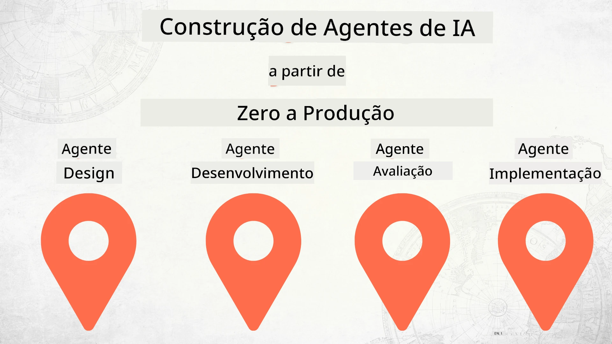

# Construir Agentes de IA do Zero à Produção



### 🌐 Suporte Multilíngue

#### Suportado via GitHub Action (Automatizado e Sempre Atualizado)

<!-- CO-OP TRANSLATOR LANGUAGES TABLE START -->
[Árabe](../ar/README.md) | [Bengalês](../bn/README.md) | [Búlgaro](../bg/README.md) | [Birmanês (Myanmar)](../my/README.md) | [Chinês (Simplificado)](../zh-CN/README.md) | [Chinês (Tradicional, Hong Kong)](../zh-HK/README.md) | [Chinês (Tradicional, Macau)](../zh-MO/README.md) | [Chinês (Tradicional, Taiwan)](../zh-TW/README.md) | [Croata](../hr/README.md) | [Checo](../cs/README.md) | [Dinamarquês](../da/README.md) | [Neerlandês](../nl/README.md) | [Estónio](../et/README.md) | [Finlandês](../fi/README.md) | [Francês](../fr/README.md) | [Alemão](../de/README.md) | [Grego](../el/README.md) | [Hebraico](../he/README.md) | [Hindi](../hi/README.md) | [Húngaro](../hu/README.md) | [Indonésio](../id/README.md) | [Italiano](../it/README.md) | [Japonês](../ja/README.md) | [Kannada](../kn/README.md) | [Khmer](../km/README.md) | [Coreano](../ko/README.md) | [Lituano](../lt/README.md) | [Malaio](../ms/README.md) | [Malayalam](../ml/README.md) | [Marathi](../mr/README.md) | [Nepalês](../ne/README.md) | [Pidgin nigeriano](../pcm/README.md) | [Norueguês](../no/README.md) | [Persa (Farsi)](../fa/README.md) | [Polaco](../pl/README.md) | [Português (Brasil)](../pt-BR/README.md) | [Português (Portugal)](./README.md) | [Punjabi (Gurmukhi)](../pa/README.md) | [Romeno](../ro/README.md) | [Russo](../ru/README.md) | [Sérvio (Cirílico)](../sr/README.md) | [Eslovaco](../sk/README.md) | [Esloveno](../sl/README.md) | [Espanhol](../es/README.md) | [Suaíli](../sw/README.md) | [Sueco](../sv/README.md) | [Tagalo (Filipino)](../tl/README.md) | [Tamil](../ta/README.md) | [Telugu](../te/README.md) | [Tailandês](../th/README.md) | [Turco](../tr/README.md) | [Ucraniano](../uk/README.md) | [Urdu](../ur/README.md) | [Vietnamita](../vi/README.md)

> **Prefere clonar localmente?**
>
> Este repositório inclui mais de 50 traduções de idiomas, o que aumenta significativamente o tamanho do download. Para clonar sem traduções, utilize o checkout esparso:
>
> **Bash / macOS / Linux:**
> > ```bash
> git clone --filter=blob:none --sparse https://github.com/microsoft/Building-AI-Agents-From-Zero-To-Production.git
> cd Building-AI-Agents-From-Zero-To-Production
> git sparse-checkout set --no-cone '/*' '!translations' '!translated_images'
> ```
>
> **CMD (Windows):**
> > ```cmd
> git clone --filter=blob:none --sparse https://github.com/microsoft/Building-AI-Agents-From-Zero-To-Production.git
> cd Building-AI-Agents-From-Zero-To-Production
> git sparse-checkout set --no-cone "/*" "!translations" "!translated_images"
> ```
>
> Isto dá-lhe tudo o que precisa para concluir o curso com um download muito mais rápido.
<!-- CO-OP TRANSLATOR LANGUAGES TABLE END -->

## Um curso que lhe ensina os fundamentos do ciclo de vida do desenvolvimento de Agentes de IA

[](https://github.com/microsoft/Building-AI-Agents-From-Zero-To-Production/blob/master/LICENSE?WT.mc_id=academic-105485-koreyst)
[](https://GitHub.com/microsoft/Building-AI-Agents-From-Zero-To-Production/graphs/contributors/?WT.mc_id=academic-105485-koreyst)
[](https://GitHub.com/microsoft/Building-AI-Agents-From-Zero-To-Production/issues/?WT.mc_id=academic-105485-koreyst)
[](https://GitHub.com/microsoft/Building-AI-Agents-From-Zero-To-Production/pulls/?WT.mc_id=academic-105485-koreyst)
[](http://makeapullrequest.com?WT.mc_id=academic-105485-koreyst)

[](https://discord.gg/Kuaw3ktsu6)

## 🌱 Começar

Este curso tem lições que cobrem os fundamentos da construção e implantação de Agentes de IA.

Cada lição baseia-se na anterior, por isso recomendamos começar desde o início e avançar até ao fim.

Se quiser explorar mais sobre tópicos de Agentes de IA, pode consultar o [Curso de Agentes de IA para Principiantes](https://aka.ms/ai-agents-beginners).

### Conheça outros aprendizes e obtenha respostas às suas perguntas

Se ficar bloqueado ou tiver perguntas sobre como construir Agentes de IA, junte-se ao nosso canal dedicado no [Discord do Microsoft Foundry](https://discord.gg/Kuaw3ktsu6).

### O que precisa

Cada lição tem o seu próprio exemplo de código que pode executar localmente. Pode [criar um fork deste repositório](https://github.com/microsoft/Building-AI-Agents-From-Zero-To-Production/fork) para criar a sua própria cópia.

Este curso utiliza atualmente o seguinte:

- [Microsoft Agent Framework (MAF)](https://aka.ms/ai-agents-beginners/agent-framework)
- [Microsoft Foundry](https://azure.microsoft.com/products/ai-foundry) — um projeto com um modelo da série **GPT-5** implantado (por exemplo `gpt-5.1`). Não utilize os modelos retirados GPT-4o / GPT-4.1.
- [Azure OpenAI Service](https://azure.microsoft.com/products/ai-foundry/models/openai)
- [Azure CLI](https://learn.microsoft.com/cli/azure/authenticate-azure-cli?view=azure-cli-latest) — inicie sessão com `az login` antes de executar qualquer exemplo
- **Python 3.12 ou posterior**

Por favor, assegure-se de que tem acesso a estes serviços antes de começar.

> **💰 Custo e limpeza.** As lições práticas criam recursos reais no Azure — um projeto Microsoft Foundry
> projeto, uma implantação de modelo, um armazenamento vetorial e (nas Lições 4–6) agentes alojados e toolboxes.
> Estes podem incorrer custos enquanto existirem. Quando terminar uma lição — ou o curso — elimine os
> recursos que já não necessita. A abordagem mais simples é colocar tudo num grupo de recursos dedicado
> e eliminar todo o grupo quando terminar:
>
> > ```bash
> az group delete --name <your-resource-group> --yes --no-wait
> ```
>
> Também pode eliminar agentes individuais, armazenamentos vetoriais e toolboxes a partir do portal Foundry.

> **Nota sobre modelos.** Este curso serve todos os modelos através do **Microsoft Foundry**. Não
> utiliza *GitHub Models*, que está a ser descontinuado em **30 de julho de 2026** — o Microsoft Foundry é o
> caminho oficial de migração. Se tiver código antigo que chama GitHub Models, aponte-o para uma implantação do Foundry
> de modelo em vez disso.

Mais opções sobre hospedagem de modelos e serviços em breve. 

## 🗃️ Lições

| **Lição**         | **Descrição**                                                                                  |
|--------------------|--------------------------------------------------------------------------------------------------|
| [Design de Agente](./lesson-1-agent-design/README.md)       | Uma introdução ao nosso Caso de Uso "Developer Onboarding" e como conceber agentes eficazes  |
| [Desenvolvimento de Agente](./lesson-2-agent-development/README.md)  | Usando o Microsoft Agent Framework (MAF), construa um conjunto de agentes especializados para ajudar novos desenvolvedores a integrarem-se.       |
| [Avaliações de Agentes](./lesson-3-agent-evals/README.md)  | Usando o Microsoft Foundry, descubra o desempenho dos nossos Agentes de IA e como melhorá-los. |
| [Implementação de Agentes](./lesson-4-agentdeployment/README.md)   | Usando agentes alojados do Microsoft Foundry e o OpenAI ChatKit, veja como colocar um Agente de IA em produção.       |
| [Agentes Alojados em Produção](./lesson-5-hosted-agents-production/README.md)   | Leve um agente alojado para produção empresarial: Agentes Alojados vs Capability Hosts, traga o seu próprio armazenamento, memória e governação.       |
| [Microsoft Toolbox](./lesson-6-toolbox/README.md)   | Defina ferramentas uma vez e governe-as centralmente: construa uma toolbox, consuma-a a partir de um agente via um endpoint MCP, e versione as ferramentas com segurança.       |
| [Multi-Agente & A2A](./lesson-7-multi-agent-a2a/README.md)   | Componha agentes como serviços em rede: exponha um agente através do protocolo aberto Agent-to-Agent (A2A) e utilize um agente remoto como um par.       |


## 🎒 Outros Cursos

A nossa equipa produz outros cursos! Veja:

<!-- CO-OP TRANSLATOR OTHER COURSES START -->
### LangChain
[](https://aka.ms/langchain4j-for-beginners)
[](https://aka.ms/langchainjs-for-beginners?WT.mc_id=m365-94501-dwahlin)
[](https://github.com/microsoft/langchain-for-beginners?WT.mc_id=m365-94501-dwahlin)
---

### Azure / Edge / MCP / Agentes
[](https://github.com/microsoft/AZD-for-beginners?WT.mc_id=academic-105485-koreyst)
[](https://github.com/microsoft/edgeai-for-beginners?WT.mc_id=academic-105485-koreyst)
[](https://github.com/microsoft/mcp-for-beginners?WT.mc_id=academic-105485-koreyst)
[](https://github.com/microsoft/ai-agents-for-beginners?WT.mc_id=academic-105485-koreyst)

---
 
### Série de IA Generativa

[](https://github.com/microsoft/generative-ai-for-beginners?WT.mc_id=academic-105485-koreyst)
[-9333EA?style=for-the-badge&labelColor=E5E7EB&color=9333EA)](https://github.com/microsoft/Generative-AI-for-beginners-dotnet?WT.mc_id=academic-105485-koreyst)
[-C084FC?style=for-the-badge&labelColor=E5E7EB&color=C084FC)](https://github.com/microsoft/generative-ai-for-beginners-java?WT.mc_id=academic-105485-koreyst)
[-E879F9?style=for-the-badge&labelColor=E5E7EB&color=E879F9)](https://github.com/microsoft/generative-ai-with-javascript?WT.mc_id=academic-105485-koreyst)

---
 
### Aprendizagem Essencial
[](https://aka.ms/ml-beginners?WT.mc_id=academic-105485-koreyst)
[](https://aka.ms/datascience-beginners?WT.mc_id=academic-105485-koreyst)
[](https://aka.ms/ai-beginners?WT.mc_id=academic-105485-koreyst)
[](https://github.com/microsoft/Security-101?WT.mc_id=academic-96948-sayoung)
[](https://aka.ms/webdev-beginners?WT.mc_id=academic-105485-koreyst)
[](https://aka.ms/iot-beginners?WT.mc_id=academic-105485-koreyst)
[](https://github.com/microsoft/xr-development-for-beginners?WT.mc_id=academic-105485-koreyst)

---
 
### Série Copilot
[](https://aka.ms/GitHubCopilotAI?WT.mc_id=academic-105485-koreyst)
[](https://github.com/microsoft/mastering-github-copilot-for-dotnet-csharp-developers?WT.mc_id=academic-105485-koreyst)
[](https://github.com/microsoft/CopilotAdventures?WT.mc_id=academic-105485-koreyst)
<!-- CO-OP TRANSLATOR OTHER COURSES END -->

## Contribuir

Este projeto acolhe contribuições e sugestões.  A maioria das contribuições exige que concorde com um
Acordo de Licença de Contribuidor (CLA) declarando que tem o direito de, e que de facto, nos concede
os direitos de usar a sua contribuição. Para mais informações, visite <https://cla.opensource.microsoft.com>.

Quando submeter um pull request, um bot de CLA determinará automaticamente se precisa de fornecer
um CLA e assinalará o PR adequadamente (por exemplo, verificação de estado, comentário). Basta seguir as instruções
fornecidas pelo bot. Só terá de o fazer uma vez em todos os repositórios que utilizam o nosso CLA.

Este projeto adotou o [Código de Conduta de Código Aberto da Microsoft](https://opensource.microsoft.com/codeofconduct/).
Para mais informações, consulte a [FAQ do Código de Conduta](https://opensource.microsoft.com/codeofconduct/faq/) ou
contacte [opencode@microsoft.com](mailto:opencode@microsoft.com) com quaisquer questões ou comentários adicionais.

## Marcas registadas

Este projeto pode conter marcas registadas ou logótipos de projetos, produtos ou serviços. O uso autorizado das marcas registadas ou logótipos da Microsoft
está sujeito e deve obedecer às
[Diretrizes de Marcas e Identidade da Microsoft](https://www.microsoft.com/legal/intellectualproperty/trademarks/usage/general).
O uso de marcas registadas ou logótipos da Microsoft em versões modificadas deste projeto não deve causar confusão nem sugerir patrocínio da Microsoft.
Qualquer utilização de marcas registadas ou logótipos de terceiros está sujeita às políticas desses terceiros.

## Obter Ajuda

Se ficar bloqueado ou tiver alguma dúvida sobre como criar aplicações de IA, junte-se a:

[](https://discord.gg/Kuaw3ktsu6)

Se tiver feedback sobre o produto ou encontrar erros durante o desenvolvimento, visite:

[](https://aka.ms/foundry/forum)

---

<!-- CO-OP TRANSLATOR DISCLAIMER START -->
**Aviso Legal**:
Este documento foi traduzido utilizando o serviço de tradução automática [Co-op Translator](https://github.com/Azure/co-op-translator). Embora nos esforcemos pela precisão, esteja ciente de que traduções automáticas podem conter erros ou imprecisões. O documento original na sua língua nativa deve ser considerado a fonte autorizada. Para informações críticas, recomenda-se tradução profissional humana. Não nos responsabilizamos por quaisquer mal-entendidos ou interpretações incorretas resultantes da utilização desta tradução.
<!-- CO-OP TRANSLATOR DISCLAIMER END -->