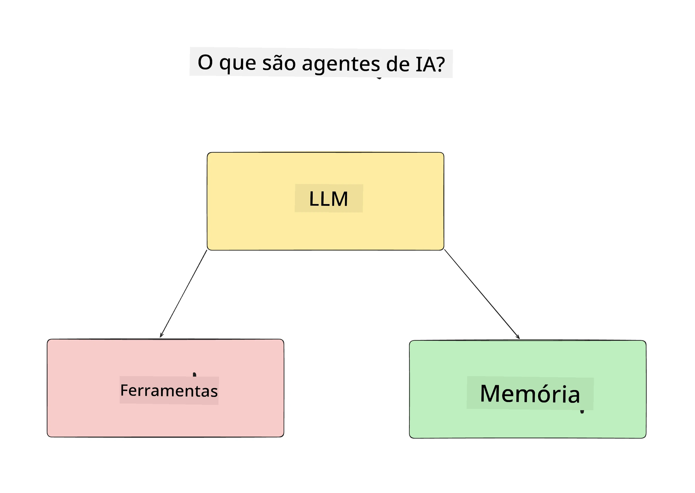
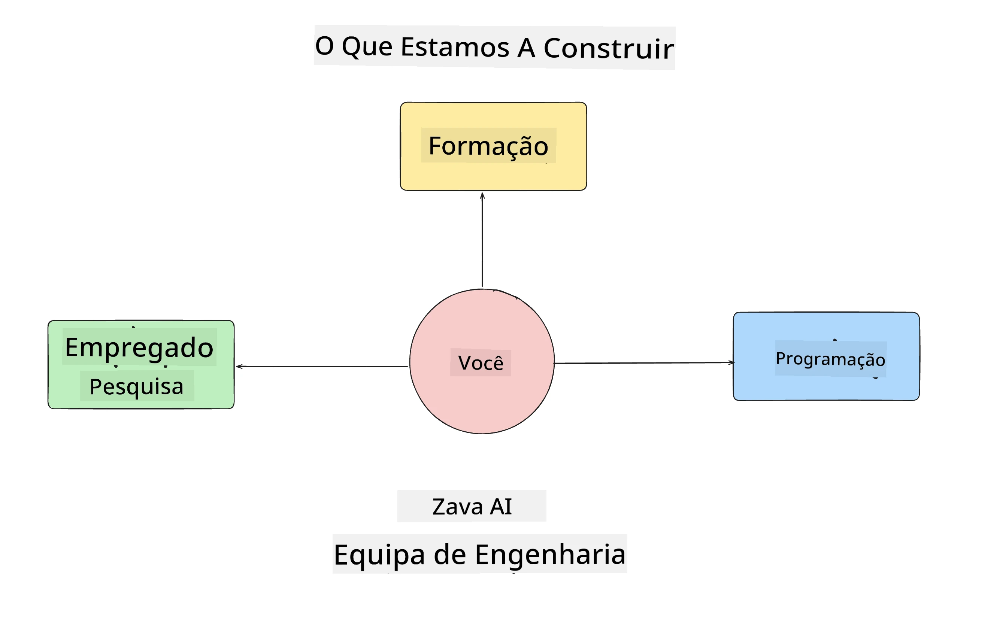
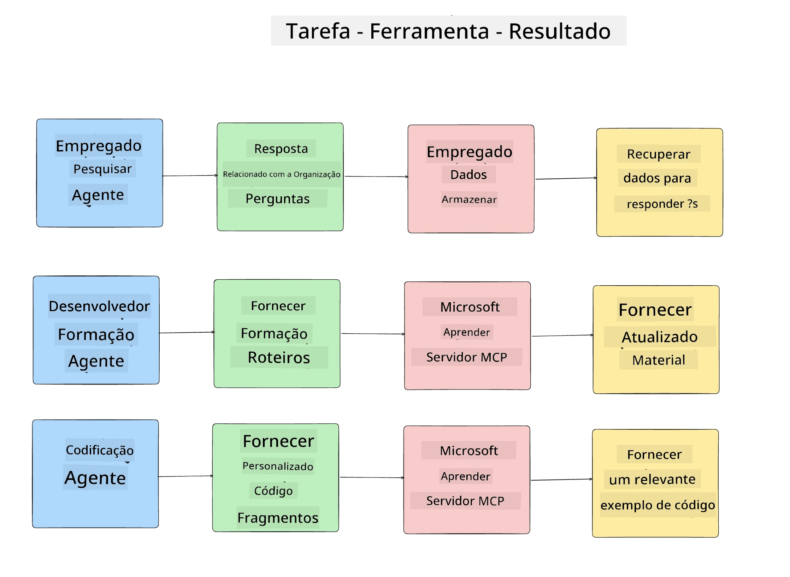
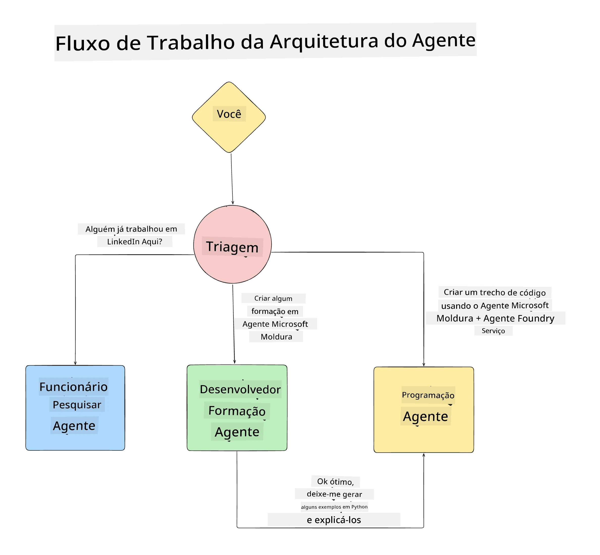

# Lição 1: Conceção de Agentes de IA

Bem-vindo à primeira lição do  "Construir Agentes de IA: do Zero à Produção"!

Nesta lição vamos abordar:

- Definir o que são Agentes de IA
  
- Discutir a Aplicação de Agente de IA que estamos a construir  

- Identificar as ferramentas e serviços necessários para cada agente
  
- Arquitetar a nossa Aplicação de Agentes
  
Vamos começar por definir o que é um agente e porque o utilizaríamos numa aplicação.

> **Antes de começar o curso.** Esta primeira lição é conceptual — não há código para executar.
> A partir da [Lição 2](../lesson-2-agent-development/README.md) em diante, irá precisar de: uma **assinatura
> do Azure** com acesso a **Microsoft Foundry**, um modelo da série **GPT-5** implementado (por
> exemplo `gpt-5.1` — evite os modelos aposentados GPT-4o / GPT-4.1), **Python 3.12+**, e a **Azure CLI**
> (`az login`). Consulte [O que precisa](../README.md#what-you-need) no README do curso para a lista completa
> e links.

## O que são Agentes de IA?

Se é a primeira vez que explora como construir um Agente de IA, poderá ter dúvidas sobre como definir exactamente o que é um Agente de IA.

Uma forma simples de definir o que é um Agente de IA é pelos componentes que o constituem:

**Large Language Model** - O LLM fornecerá tanto a capacidade de processar linguagem natural do utilizador para interpretar a tarefa que pretende realizar como de interpretar as descrições das ferramentas disponíveis para concluir essas tarefas.

**Ferramentas** - Estas serão funções, APIs, armazéns de dados e outros serviços que o LLM pode optar por usar para completar as tarefas solicitadas pelo utilizador.

**Memória** - É assim que armazenamos tanto interações de curto prazo como de longo prazo entre o Agente de IA e o utilizador. Armazenar e recuperar esta informação é importante para melhorar e guardar preferências do utilizador ao longo do tempo.

## O nosso caso de uso de Agente de IA

Para este curso, vamos construir uma aplicação de Agente de IA que ajude novos programadores a integrarem-se na nossa Equipa de Desenvolvimento de Agentes de IA!

Antes de fazermos qualquer trabalho de desenvolvimento, o primeiro passo para criar uma aplicação de Agente de IA bem-sucedida é definir cenários claros sobre como esperamos que os utilizadores trabalhem com os nossos Agentes de IA.

Para esta aplicação, iremos trabalhar com os seguintes cenários:

**Cenário 1**:  Um novo colaborador junta-se à nossa organização e quer saber mais sobre a equipa que integrou e como entrar em contacto com ela.

**Cenário 2:** Um novo colaborador quer saber qual seria a melhor primeira tarefa para começar a trabalhar.

**Cenário 3:** Um novo colaborador quer reunir recursos de aprendizagem e exemplos de código para o ajudar a iniciar-se e a completar essa tarefa.

## Identificar as Ferramentas e Serviços

Agora que temos estes cenários definidos, o próximo passo é mapeá-los para as ferramentas e serviços que os nossos agentes de IA vão precisar para completar estas tarefas.

Este processo insere-se na categoria de Engenharia de Contexto, à medida que nos vamos concentrar em garantir que os nossos Agentes de IA têm o contexto certo no momento certo para completar as tarefas.

Vamos abordar cenário a cenário e aplicar uma boa conceção agentiva, listando a tarefa, as ferramentas e os resultados desejados de cada agente.

### Cenário 1 - Agente de Pesquisa de Colaboradores

**Tarefa** - Responder a perguntas sobre os colaboradores na organização, tais como data de entrada, equipa atual, localização e último cargo.

**Ferramentas** - Armazenamento de dados da lista atual de colaboradores e organograma

**Resultados** - Capaz de recuperar informação do armazenamento de dados para responder a perguntas organizacionais gerais e a perguntas específicas sobre colaboradores.

### Cenário 2 - Agente de Recomendação de Tarefas

**Tarefa** - Com base na experiência de desenvolvimento do novo colaborador, sugerir 1-3 issues (problemas) em que o novo colaborador possa trabalhar.

**Ferramentas** - GitHub MCP Server para obter issues em aberto e construir um perfil de programador

**Resultados** - Capaz de ler os últimos 5 commits de um perfil do GitHub e os issues abertos num projeto GitHub e de fazer recomendações com base numa correspondência

### Cenário 3 -  Agente Assistente de Código

**Tarefa** - Com base nos Issues Abertos recomendados pelo Agente de "Recomendação de Tarefas", pesquisar e fornecer recursos e gerar excertos de código para ajudar o colaborador.

**Ferramentas** - Microsoft Learn MCP para encontrar recursos e Code Interpreter para gerar excertos de código personalizados.

**Resultados** - Se o utilizador pedir ajuda adicional, o fluxo de trabalho deve usar o Learn MCP Server para fornecer links e excertos de recursos e depois encaminhar para o agente Code Interpreter para gerar pequenos excertos de código com explicações.

## Arquitectar a nossa Aplicação de Agentes

Agora que definimos cada um dos nossos Agentes, vamos criar um diagrama de arquitetura que nos ajudará a compreender como cada agente funcionará em conjunto e separadamente, dependendo da tarefa:

## Próximos Passos

Agora que desenhámos cada agente e o nosso sistema agentivo, passemos para a próxima lição onde iremos desenvolver cada um destes agentes!

---

<!-- CO-OP TRANSLATOR DISCLAIMER START -->
**Aviso Legal**:
Este documento foi traduzido utilizando o serviço de tradução automática [Co-op Translator](https://github.com/Azure/co-op-translator). Embora nos esforcemos pela precisão, esteja ciente de que traduções automáticas podem conter erros ou imprecisões. O documento original na sua língua nativa deve ser considerado a fonte autorizada. Para informações críticas, recomenda-se tradução profissional humana. Não nos responsabilizamos por quaisquer mal-entendidos ou interpretações incorretas resultantes da utilização desta tradução.
<!-- CO-OP TRANSLATOR DISCLAIMER END -->