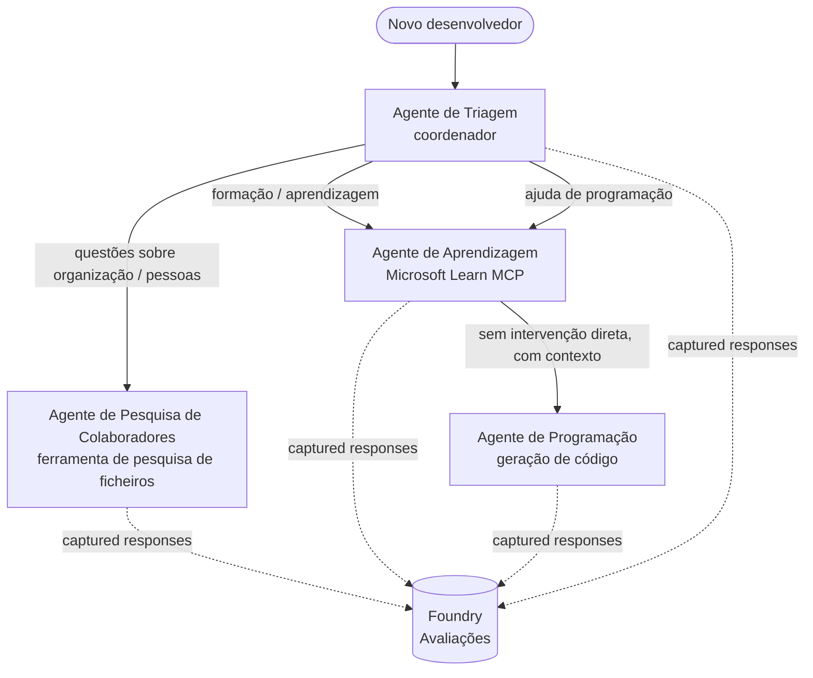

# Lição 3: Avaliações de Agentes com Microsoft Foundry

Bem-vindo à terceira lição do curso **"Construir Agentes de IA do Zero até à Produção"**!

Na [Lição 2](../lesson-2-agent-development/README.md) construiu agentes. Nesta lição vai
aprender a responder a uma pergunta muito mais difícil: **são bons?** Entregar um agente que
funcionar é fácil; saber se encaminha corretamente, se se mantém fundamentado nos seus dados e se utiliza as suas
ferramentas correctamente é o que separa uma demo de um sistema de produção.

Nesta lição iremos abordar:

- Porque é que a avaliação de agentes importa e como difere dos testes tradicionais
- A diferença entre **observabilidade**, **testes rápidos (smoke tests)** e **avaliações**
- O fluxo de trabalho multi-agente que vamos medir
- Os **avaliadores incorporados do Microsoft Foundry** (relevância, fundamentação, precisão de chamadas de ferramenta, utilização da saída das ferramentas)
- Um guia passo a passo do pipeline de avaliação em [`agent-evals.py`](../../../lesson-3-agent-evals/agent-evals.py)
- Como executá-lo e ler os resultados

---

## Porque avaliar agentes?

Um teste unitário tradicional afirma que `add(2, 2) == 4`. Os agentes não funcionam assim — o mesmo
prompt pode produzir formulações diferentes a cada execução, as ferramentas podem ser chamadas em ordens diferentes, e
«correto» é muitas vezes uma questão de grau em vez de um booleano. Não se pode afirmar com base em strings exactas.

Em vez disso, avalia-se os agentes ao longo de **dimensões de qualidade** usando *avaliadores* baseados em modelos (também
designados por "LLM-as-a-judge") além de verificações determinísticas do uso das ferramentas. Isto diz-lhe coisas como:

- A resposta respondeu realmente à pergunta? (**relevância**)
- A resposta é suportada pelos dados recuperados ou o agente alucinou? (**fundamentação**)
- O agente chamou a ferramenta correcta com os argumentos correctos? (**precisão de chamadas de ferramenta**)
- O agente realmente utilizou o que a ferramenta devolveu? (**utilização da saída das ferramentas**)

### Três camadas complementares de qualidade

Estas não são técnicas concorrentes — um agente em produção usa as três:

| Camada | Questão que responde | Custo | Quando é executada | Coberto em |
|-------|--------------------|------|--------------|------------|
| **Observabilidade / rastreio** | *O que fez o agente, passo a passo?* | Gratuito (sempre activo) | Continuamente em produção | Esta lição |
| **Testes rápidos (smoke tests)** | *O agente está acessível e a seguir o seu prompt básico?* | Barato, segundos | Em cada deploy | [Lição 4](../lesson-4-agentdeployment/README.md#smoke-testing-the-hosted-agent-ci-gate) |
| **Avaliações** | *Quão **boas** são as respostas?* | Mais lento, cobrado por modelo | A pedido / nocturno / pré-lançamento | Esta lição |

Os testes rápidos respondem «quebrou?»; as avaliações respondem «é bom?». Quer ambos.

---

## Pré-requisitos

1. Ter concluído a [Lição 2](../lesson-2-agent-development/README.md) (agentes + vector store).
2. Um projeto **Microsoft Foundry**.
3. **Azure CLI** autenticado: `az login`.
4. **Python 3.12+** e as dependências do curso instaladas:

   ```bash
   pip install -r ../requirements.txt
   ```

5. Variáveis de ambiente (crie um ficheiro `.env` nesta pasta ou exporte-as):

   | Variável | Finalidade |
   |----------|---------|
   | `FOUNDRY_PROJECT_ENDPOINT` | O endpoint do seu projeto Foundry (`https://<account>.services.ai.azure.com/api/projects/<project>`). Lido pelo `FoundryChatClient` dos agentes **e** pelo auxiliar de avaliação. |
   | `FOUNDRY_MODEL` | Deployment do modelo em que os **agentes** correm (ex.: `gpt-5.1`). |
   | `VECTOR_STORE_ID` | O vector store do directório de funcionários criado na Lição 2 |
   | `AZURE_AI_MODEL_DEPLOYMENT_NAME` | Deployment do modelo utilizado **pelos avaliadores** (por defeito `FOUNDRY_MODEL`, depois `gpt-5.1`) |

> Os agentes usam `FoundryChatClient`, que lê a configuração das variáveis com prefixo `FOUNDRY_`
> (`FOUNDRY_PROJECT_ENDPOINT`, `FOUNDRY_MODEL`). O auxiliar de avaliação na cloud
> usa o SDK `azure-ai-projects` e recorrerá a `FOUNDRY_PROJECT_ENDPOINT` se
> `AZURE_AI_PROJECT_ENDPOINT` não estiver definido — por isso as duas variáveis `FOUNDRY_` são suficientes para
> executar toda a lição.
>
> Os avaliadores são eles próprios alimentados por um modelo, por isso `AZURE_AI_MODEL_DEPLOYMENT_NAME`
> controla que deployment faz a avaliação — não tem de ser o mesmo modelo que o seu
> agentes usam.

---

## O fluxo de trabalho que estamos a avaliar

Para avaliar algo, primeiro tem de o executar. Esta lição reutiliza o **Onboarding de Desenvolvedores**
fluxo de trabalho multi-agente: um coordenador de triagem entrega a três especialistas.



O fluxo de trabalho é construído com a orquestração **handoff** do Microsoft Agent Framework. A ideia
principal para avaliação é que **cada turno do agente é persistido no lado do servidor** e identificado por um
`response_id`. Esses IDs são o que entregamos ao serviço de avaliação.

---

## O pipeline de avaliação, passo a passo

[`agent-evals.py`](../../../lesson-3-agent-evals/agent-evals.py) implementa um pipeline de seis passos. Aqui está o que cada passo faz
e porquê.

### Passo 1 — Executar o fluxo de trabalho e registar os IDs de resposta

O fluxo de trabalho é executado com `run_stream(...)`, e à medida que os eventos chegam em streaming o código regista o
`response_id` e `conversation_id` produzidos por cada agente. As respostas persistidas são o material bruto
para avaliação — está a classificar respostas *reais*, com forma de produção, não respostas re-geradas
essas.

### Passo 2 — Resumir o que foi capturado

Um resumo rápido imprime quantas respostas cada agente produziu, para que possa confirmar que o fluxo de trabalho
efectivamente colocou à prova os agentes que pretende classificar.

### Passo 3 — Obter as respostas finais

Para cada agente, o último `response_id` é recuperado através do cliente compatível com OpenAI do projecto
cliente (`project_client.get_openai_client().responses.retrieve(...)`) para que possa pré-visualizar o
texto que será julgado.

### Passo 4 — Criar a avaliação

Uma avaliação é criada com quatro **avaliadores incorporados do Foundry**:

| Avaliador | `evaluator_name` | O que mede |
|-----------|------------------|------------------|
| Relevância | `builtin.relevance` | A resposta aborda o pedido do utilizador? |
| Fundamentação | `builtin.groundedness` | A resposta é suportada pelos dados recuperados/ferramenta (não é uma alucinação)? |
| Precisão de chamadas de ferramenta | `builtin.tool_call_accuracy` | Foram chamadas as ferramentas corretas com os argumentos corretos? |
| Utilização da saída da ferramenta | `builtin.tool_output_utilization` | O agente realmente usou os resultados da ferramenta na sua resposta? |

Cada avaliador é inicializado com o deployment indicado por `AZURE_AI_MODEL_DEPLOYMENT_NAME`.

> **Porque estes quatro?** Relevância e fundamentação medem a *qualidade da resposta*; os dois avaliadores de ferramentas
> medem o *comportamento agentivo* — a parte que as métricas NLP tradicionais falham completamente. Para um
> sistema multi-agente que usa ferramentas, as métricas de ferramenta são muitas vezes onde as regressões reais se escondem.

### Passo 5 — Executar a avaliação

Os `response_id`s capturados são passados para `evals.runs.create(...)` como fonte de dados. O
serviço reproduz cada resposta armazenada através de cada avaliador.

### Passo 6 — Monitorizar e ler os resultados

O código interroga a execução até que esteja `completed` ou `failed`, depois imprime as contagens de resultados e um
**`report_url`** — um link profundo no portal Foundry onde pode inspecionar pontuações por métrica,
contagens de aprovações/falhas e respostas individuais avaliadas.

---

## Executar

```bash
cd lesson-3-agent-evals
python agent-evals.py
```

Por defeito avalia a primeira consulta de exemplo
(`"Sou novo aqui! Alguém já trabalhou na Microsoft aqui?"`). Mais duas consultas de exemplo multi-intenção
estão incluídas em `run_evaluation_workflow()` — troque a variável `query` para experimentar cenários de encaminhamento
que exercitam mais agentes numa única execução.

Fluxo de consola esperado:

```
Step 1: Running Developer Onboarding Workflow
Step 2: Response Data Summary
Step 3: Fetching Agent Responses
Step 4: Creating Evaluation
Step 5: Running Evaluation
Step 6: Monitoring Evaluation
  Status: running ...
  Evaluation completed successfully
  Report URL: https://...   <-- open this in the Foundry portal
```

---

## Observabilidade e rastreio

As avaliações dizem-lhe *quão boas* foram as respostas; a **observabilidade** diz-lhe *o que aconteceu*
para as produzir — cada salto de agente, chamada de ferramenta, contagem de tokens e latência. No Microsoft Foundry,
as execuções dos agentes emitem traces OpenTelemetry que pode ver no portal, e o Agent Framework pode
exportá-las para Azure Monitor / Application Insights com uma única chamada:

```python
from agent_framework.foundry import FoundryChatClient

client = FoundryChatClient()
client.configure_azure_monitor()   # exportar registos e métricas para o Application Insights
```

Use o rastreio para **depurar** uma má pontuação de avaliação: quando a fundamentação diminui, o trace mostra-lhe
se a ferramenta de pesquisa de ficheiros não devolveu nada, ou devolveu dados que o agente depois ignorou (o que é
exactamente o que a utilização da saída das ferramentas está a pontuar).

---

## De "execuções" a "bom": como usar isto na prática

- **Portão pré-lançamento.** Execute avaliações contra um conjunto fixo de consultas representativas antes de
  promover um novo prompt ou modelo. Compare pontuações com a versão anterior — trate uma queda como uma
  regressão.
- **Sinal de qualidade nocturno.** Agende a avaliação para detectar deriva devido a dados ou alterações de dependências.
  mudanças.
- **Combine com testes rápidos.** O [teste rápido da Lição 4](../lesson-4-agentdeployment/README.md#smoke-testing-the-hosted-agent-ci-gate)
  é o seu portão rápido por deploy; as avaliações são o portão de qualidade mais lento e profundo. Execute o barato
  em cada merge e o dispendioso numa agenda ou antes do lançamento.

---

## Nota de modernização

Este exemplo está a ser migrado para a actual superfície da API do Microsoft Agent Framework Foundry
(`agent_framework.foundry`). Se estiver a actualizar o código, veja o guia na raiz do repositório
[`MIGRATION-GUIDE.md`](../MIGRATION-GUIDE.md) para os mapeamentos verificados antes/depois de importação e cliente
(por exemplo `AzureAIClient` -> `FoundryChatClient`, e construção de ferramentas hospedadas via
`client.get_file_search_tool(...)` / `client.get_mcp_tool(...)`). Os conceitos de avaliação e o
pipeline de seis passos acima não são alterados por essa migração.

---

## Recursos

- [Avaliar modelos e aplicações de IA generativa (Microsoft Learn)](https://learn.microsoft.com/en-us/azure/ai-foundry/concepts/evaluation-approach-gen-ai)
- [Avaliadores incorporados para IA generativa](https://learn.microsoft.com/en-us/azure/ai-foundry/concepts/evaluation-evaluators/agent-evaluators)
- [Observabilidade no Microsoft Foundry](https://learn.microsoft.com/en-us/azure/ai-foundry/concepts/observability)
- [Microsoft Agent Framework](https://github.com/microsoft/agent-framework)
- [Orquestração de handoff de agentes](https://learn.microsoft.com/en-us/agent-framework/workflows/orchestrations/handoff)

---

<!-- CO-OP TRANSLATOR DISCLAIMER START -->
**Aviso Legal**:
Este documento foi traduzido utilizando o serviço de tradução automática [Co-op Translator](https://github.com/Azure/co-op-translator). Embora nos esforcemos pela precisão, esteja ciente de que traduções automáticas podem conter erros ou imprecisões. O documento original na sua língua nativa deve ser considerado a fonte autorizada. Para informações críticas, recomenda-se tradução profissional humana. Não nos responsabilizamos por quaisquer mal-entendidos ou interpretações incorretas resultantes da utilização desta tradução.
<!-- CO-OP TRANSLATOR DISCLAIMER END -->