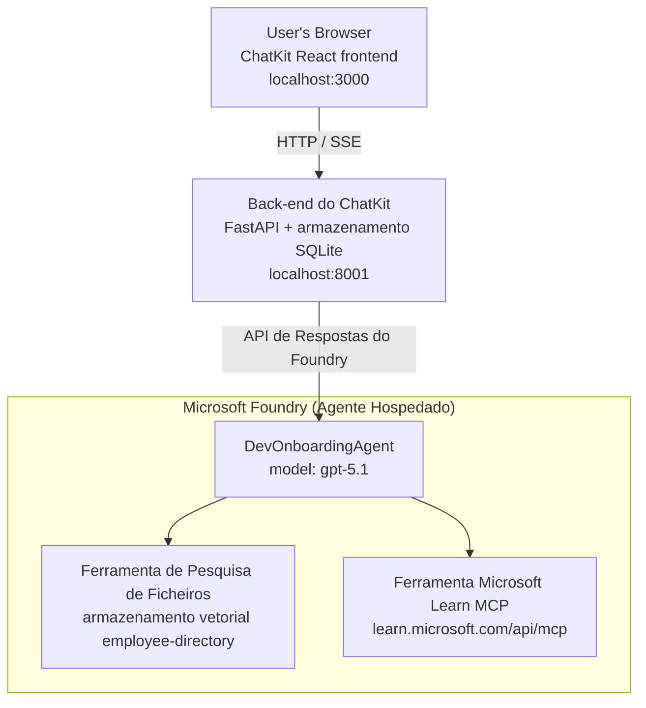

# Aula 4: Implementação de Agentes com Hosted Agents do Microsoft Foundry + ChatKit

Esta aula demonstra como implementar um agente que usa ferramentas no Microsoft Foundry como um agente hospedado e como criar um frontend baseado em ChatKit para interagir com ele.

## Arquitetura

O agente hospedado é um **único `DevOnboardingAgent`** (a correr em `gpt-5.1`) que responde a perguntas de onboarding de desenvolvedores usando duas ferramentas hospedadas: uma ferramenta **File Search** sobre o employee-directory vector store, e a ferramenta **Microsoft Learn MCP**. Um frontend React baseado em ChatKit comunica com um backend FastAPI, que chama o agente através da **Responses API** do Foundry.



## Pré-requisitos

1. **Microsoft Foundry Project** na região North Central US
2. **Azure CLI** autenticado (`az login`)
3. **Azure Developer CLI** (`azd`) instalado
4. **Python 3.12+** e **Node.js 18+**
5. **Vector Store** criado com os dados dos funcionários

## Início Rápido

### 1. Definir Variáveis de Ambiente

```bash
cd lesson-4-agentdeployment
cp .env.example .env
# Edite o ficheiro .env com os detalhes do seu projeto Microsoft Foundry
```

### 2. Implementar o Agente Hospedado

**Opção A: Utilizar o Azure Developer CLI (Recomendado)**

```bash
cd hosted-agent
azd auth login
azd agent deploy
```

**Opção B: Utilizar Docker + Azure Container Registry**

```bash
cd hosted-agent

# Construir a imagem do contentor
docker build -t developer-onboarding-agent:latest .

# Tag para o ACR
docker tag developer-onboarding-agent:latest <your-acr>.azurecr.io/developer-onboarding-agent:latest

# Enviar para o ACR
az acr login --name <your-acr>
docker push <your-acr>.azurecr.io/developer-onboarding-agent:latest

# Implantar através do portal Microsoft Foundry ou do SDK
```

### 3. Iniciar o Backend do ChatKit

```bash
cd chatkit-server
python -m venv .venv
source .venv/bin/activate  # No Windows: .venv\Scripts\activate
pip install -r requirements.txt
python app.py
```

O servidor iniciará em `http://localhost:8001`

### 4. Iniciar o Frontend do ChatKit

```bash
cd chatkit-server/frontend
npm install
npm run dev
```

O frontend iniciará em `http://localhost:3000`

### 5. Testar a Aplicação

Abra `http://localhost:3000` no seu navegador e experimente estas consultas:

**Pesquisa de Funcionários:**
- "Sou novo aqui! Alguém já trabalhou na Microsoft?"
- "Quem tem experiência com Azure Functions?"

**Recursos de Aprendizagem:**
- "Crie um plano de aprendizagem para Kubernetes"
- "Que certificações devo obter para arquitetura na cloud?"

**Ajuda de Programação:**
- "Ajuda-me a escrever código Python para conectar ao CosmosDB"
- "Mostra-me como criar uma Azure Function"

**Consultas Multi-Agente:**
- "Estou a começar como engenheiro de cloud. Com quem devo contactar e o que devo aprender?"

## Estrutura do Projeto

```
lesson-4-agentdeployment/
├── .env.example                 # Environment variables template
├── implementation-plan.md       # Detailed implementation guide
├── README.md                    # This file
├── hosted-agent/               # Microsoft Foundry hosted agent
│   ├── main.py                 # Multi-agent workflow implementation
│   ├── requirements.txt        # Python dependencies
│   ├── Dockerfile              # Container definition
│   └── agent.yaml              # Agent deployment configuration
└── chatkit-server/             # ChatKit server application
    ├── app.py                  # FastAPI backend
    ├── store.py                # SQLite persistence layer
    ├── requirements.txt        # Python dependencies
    └── frontend/               # React frontend
        ├── package.json
        ├── vite.config.ts
        ├── tsconfig.json
        ├── index.html
        └── src/
            ├── main.tsx
            ├── App.tsx
            ├── App.css
            └── index.css
```

## O Agente e as Suas Ferramentas

O agente hospedado é um **agente único** (`DevOnboardingAgent`, definido em `hosted-agent/main.py`) que trata três domínios de onboarding. Em vez de orquestrar sub-agentes separados, expõe cada capacidade como uma ferramenta (ou recorre ao modelo diretamente):

| Capacidade | Como é tratada | Ferramenta |
|-----------|------------------|------|
| **Pesquisa de funcionários & ligações** | File Search hospedado no Foundry sobre o employee-directory vector store | `client.get_file_search_tool(vector_store_ids=[...])` |
| **Aprendizagem & formação** | Servidor Microsoft Learn MCP (ferramenta MCP hospedada) | `client.get_mcp_tool(url="https://learn.microsoft.com/api/mcp")` |
| **Assistência de programação** | Processado pelo modelo `gpt-5.1` diretamente — sem ferramenta externa | — |

O agente é criado com `client.as_agent(name="DevOnboardingAgent", instructions=..., tools=[file_search_tool, learn_mcp_tool])` e servido com `from_agent_framework(agent).run()`.

> **Nota de design.** Rascunhos anteriores desta aula usavam um fluxo de trabalho multi-agente `HandoffBuilder` (Triagem → especialistas). O agente fornecido é um agente único que utiliza ferramentas, o que é mais simples de implementar e de compreender para perguntas e respostas de onboarding. Para um exemplo de orquestração multi-agente e passagens, veja a Aula 2 e a Aula 3.

## Teste de smoke do Agente Hospedado (Portão de CI)

A implementação de um agente hospedado "com sucesso" apenas prova que o plano de controlo aceitou a
definição — não prova que o agente realmente responde. Uma dependência em falta,
encaminhamento de modelo incorreto ou uma ligação expirada podem deixar o agente com estado 'verde' mas silencioso.

Esta aula inclui um **smoke test** leve que funciona como um portão pós-implementação rápido e económico
de verificação. Utiliza a ação GitHub [AI Smoke Test](https://github.com/marketplace/actions/ai-smoke-test)
GitHub Action para enviar via POST prompts ao endpoint **Responses** do agente no Foundry
(`POST {project_endpoint}/agents/{agent_name}/endpoint/protocols/openai/responses`)
e verificar o texto devolvido. Detecta implementações avariadas, regressões de autenticação,
deriva do system-prompt e falhas de threading em segundos.

> Os smoke tests **não** substituem as avaliações completas em
> [Lesson 3](../lesson-3-agent-evals/README.md) — são um complemento. Os smoke tests
> respondem *"o agente é alcançável, está a responder e está a seguir as expectativas básicas do prompt?"*;
> as avaliações respondem *"qual a qualidade da resposta?"*. Execute este portão barato em cada implementação.

### O que é testado

O catálogo encontra-se em [`hosted-agent/tests/smoke-tests.json`](../../../lesson-4-agentdeployment/hosted-agent/tests/smoke-tests.json)
e testa os três domínios do agente, além da aderência ao prompt e do encadeamento multi-turno:

| Teste | O que verifica |
|------|------------------|
| `reachability` | O agente responde com texto não vazio e dentro do âmbito |
| `employee-search` | O domínio de pesquisa de ficheiros devolve um `200` saudável (resposta depende dos dados) |
| `learning-path` | O domínio de aprendizagem ecoa o tópico e produz uma resposta em estilo de percurso |
| `coding-assistance` | O domínio de programação devolve uma resposta em Python com formato de código |
| `prompt-adherence-offtopic` | Um pedido fora de tópico é redireccionado, não respondido em detalhe |
| `threading-turn-1/2` | O estado da conversa é mantido entre voltas através de `previous_response_id` |

### Executar em CI

O workflow em [`.github/workflows/smoke-test-hosted-agent.yml`](../../../.github/workflows/smoke-test-hosted-agent.yml)
tem dois jobs:

- **`static`** — um portão rápido, sem Azure, que corre em cada pull request e push:
  compila todas as fontes Python (`py_compile`) e verifica links em Markdown. Não são necessários segredos
  requeridos, pelo que funciona em PRs de forks.
- **`smoke`** — o teste smoke ligado ao Azure abaixo. Corre a pedido
  (Actions → **Agent CI (static + smoke)** → Run workflow) e pode ser encadeado após o seu
  workflow de deploy.

Configure estas **variáveis** e **secrets** do repositório para o job smoke:

| Tipo | Nome | Valor |
|------|------|-------|
| Variável | `FOUNDRY_PROJECT_ENDPOINT` | `https://<account>.services.ai.azure.com/api/projects/<project>` |
| Variável | `HOSTED_AGENT_NAME` | Nome do agente implementado (ex. `dev-onboarding` — deve coincidir com a sua implementação) |
| Segredo | `AZURE_CLIENT_ID` / `AZURE_TENANT_ID` / `AZURE_SUBSCRIPTION_ID` | Identidade federada OIDC para `azure/login` |

A identidade do runner necessita da role **`Azure AI User`** ao nível do **Foundry project scope** para poder
chamar os endpoints de data-plane Responses (e conversations). Conceda-a com:

```bash
az role assignment create \
  --assignee <object-id-or-appId-of-runner-identity> \
  --role "Azure AI User" \
  --scope "/subscriptions/<sub>/resourceGroups/<rg>/providers/Microsoft.CognitiveServices/accounts/<account>/projects/<project>"
```

### Executar localmente

Pode executar o mesmo catálogo antes de fazer push. Adquira um token de data-plane com scope
`https://ai.azure.com/` e aponte o runner para a sua implementação:

```bash
# O destinatário DEVE ser https://ai.azure.com/ (os tokens de cognitiveservices.azure.com são rejeitados)
export FOUNDRY_TOKEN=$(az account get-access-token --resource https://ai.azure.com/ --query accessToken -o tsv)

git clone https://github.com/JFolberth/ai-smoketest && cd ai-smoketest
python runner.py \
  --project-endpoint "https://<account>.services.ai.azure.com/api/projects/<project>" \
  --agent-name dev-onboarding \
  --tests-file ../lesson-4-agentdeployment/hosted-agent/tests/smoke-tests.json
```

Códigos de saída: `0` todos passaram, `1` uma asserção falhou, `2` erro do runner (catálogo/token inválido).

## Resolução de Problemas

### Agente não responde
- Verifique se o agente hospedado está implementado e a correr no Microsoft Foundry
- Verifique se `HOSTED_AGENT_NAME` e `HOSTED_AGENT_VERSION` coincidem com a sua implementação

### Erros do Vector Store
- Assegure que `VECTOR_STORE_ID` está definido correctamente
- Verifique que o vector store contém os dados dos funcionários

### Erros de autenticação
- Execute `az login` para atualizar as credenciais
- Assegure que tem acesso ao projeto Microsoft Foundry

## Recursos

- [Documentação de Hosted Agents do Microsoft Foundry](https://learn.microsoft.com/en-us/azure/ai-foundry/agents/concepts/hosted-agents)
- [Microsoft Agent Framework](https://github.com/microsoft/agent-framework)
- [Exemplo de Integração ChatKit](https://github.com/microsoft/agent-framework/tree/main/python/samples/demos/chatkit-integration)
- [Azure Developer CLI](https://learn.microsoft.com/en-us/azure/developer/azure-developer-cli/overview)
- [AI Smoke Test GitHub Action](https://github.com/marketplace/actions/ai-smoke-test)
- [Testar Smoke a Agentes Microsoft Foundry com GitHub Actions (blog)](https://techcommunity.microsoft.com/blog/azuredevcommunityblog/smoke-test-microsoft-foundry-agents-with-github-actions/4531912)

---

## Próximos Passos

O seu agente corre em infra‑estrutura gerida pela Microsoft. Para o levar à produção empresarial —
controlando onde os seus dados residem (soberania dos dados, redes privadas, trazer o seu próprio Azure
Cosmos DB / Storage / AI Search) e gerindo as suas ferramentas — continue para
**[Lição 5: Agentes Hospedados em Produção](../lesson-5-hosted-agents-production/README.md)**, que
explica a diferença crucial entre **Hosted Agents** e **Capability Hosts**.

---

<!-- CO-OP TRANSLATOR DISCLAIMER START -->
**Aviso Legal**:
Este documento foi traduzido utilizando o serviço de tradução automática [Co-op Translator](https://github.com/Azure/co-op-translator). Embora nos esforcemos pela precisão, esteja ciente de que traduções automáticas podem conter erros ou imprecisões. O documento original na sua língua nativa deve ser considerado a fonte autorizada. Para informações críticas, recomenda-se tradução profissional humana. Não nos responsabilizamos por quaisquer mal-entendidos ou interpretações incorretas resultantes da utilização desta tradução.
<!-- CO-OP TRANSLATOR DISCLAIMER END -->