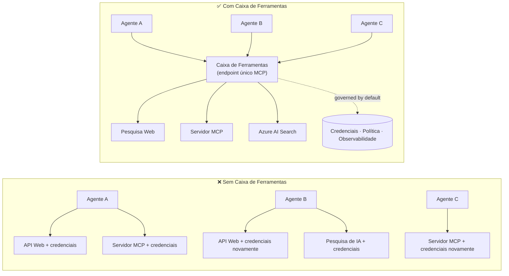

# Lição 6: Microsoft Toolbox — Ferramentas Governadas para Agentes

Após a [Lição 5](../lesson-5-hosted-agents-production/README.md) o seu agente alojado corre em
produção com a postura de armazenamento e governação que a sua organização necessita. Mas volte a olhar para o
agente da Lição 4: cada ferramenta estava codificada diretamente em `main.py` — o Microsoft Learn MCP URL, o
file-search vector store, e assim por diante. Isso funciona para um agente. Não escala para uma
organização com dezenas de agentes e equipas.

Esta lição apresenta o **Microsoft Toolbox**: a forma como o Foundry lhe permite definir um conjunto curado de
ferramentas **uma só vez**, geri-las **centralmente**, e expô-las a qualquer agente através de um **único,
endpoint governado**.

## Objetivos de Aprendizagem

No final desta lição será capaz de:

- Explicar o problema de proliferação de ferramentas que o Toolbox resolve.
- Descrever os pilares **Build** e **Consume** e os tipos de ferramentas que um toolbox pode conter.
- **Build** uma versão de toolbox com o Foundry SDK.
- **Consume** um toolbox a partir de um agente alojado do Microsoft Agent Framework através de um único MCP endpoint.
- Usar **versioning** para entregar alterações de ferramentas sem alterações de código do agente ou reimplantações.
- Aplicar **governança**: RBAC, injeção de credenciais, e políticas de guardrail (RAI).

---

## Pré-requisitos

1. Ter concluído a [Lição 4](../lesson-4-agentdeployment/README.md) e idealmente
   a [Lição 5](../lesson-5-hosted-agents-production/README.md).
2. Um projeto **Microsoft Foundry** com permissão para criar e gerir recursos de toolbox.
3. **Azure CLI** autenticado: `az login`. As APIs do Foundry toolbox requerem o
   âmbito de token `https://ai.azure.com/.default` (mostrado no código abaixo).
4. **Python 3.12+** com as dependências do curso instaladas (`pip install -r ../requirements.txt`).
5. Uma implantação de modelo atual e não retirada (por exemplo `gpt-5.1`). Evite o GPT-4o / GPT-4.1 retirados.

---

## 1. O problema: proliferação de ferramentas

Um único agente pode depender de muitas ferramentas — REST APIs, servidores MCP, conectores e fluxos — cada uma
com o seu próprio modelo de autenticação e equipa responsável. À medida que escala numa organização:

- As equipas **reimplementam as mesmas ferramentas** de forma independente.
- **As credenciais são duplicadas** entre agentes e repositórios.
- **A governação torna-se inconsistente** — cada agente aplica (ou esquece) a política por si.
- Há **pouca visibilidade** sobre que ferramentas existem ou quem as está a usar.

Os desenvolvedores travam — não porque os modelos não sejam capazes, mas porque **a integração de ferramentas se torna
o gargalo**.



As empresas já possuem a infraestrutura — gateways, cofres de credenciais, políticas, observabilidade.
O que faltava era uma experiência de desenvolvedor que empacotasse isto numa coisa **reutilizável,
descobrável e governada por predefinição**. Isso é o Toolbox.

---

## 2. O que é um Toolbox

Um **Toolbox** é um **recurso Foundry gerido**. Define um conjunto curado de ferramentas uma só vez, gere-as
centralmente no Foundry e expõe-as através de **um único endpoint compatível com MCP** que qualquer
agente pode consumir. Em tempo de execução a plataforma trata da **injeção de credenciais, renovação de tokens e
aplicação de políticas empresariais**.

Porque um toolbox é um recurso gerido, pode adicionar, remover ou reconfigurar ferramentas **sem
alterar o código do seu agente** — o agente liga-se sempre ao mesmo endpoint.

O Toolbox cobre o ciclo de vida das ferramentas através de quatro pilares; **Build** e **Consume** estão disponíveis
hoje:

| Pilar | Estado | O que permite |
|--------|--------|-----------------|
| **Build** | Disponível hoje | Selecionar ferramentas, configurar autenticação centralmente, publicar um toolbox reutilizável que qualquer equipa possa consumir. |
| **Consume** | Disponível hoje | Ligar qualquer agente a um endpoint compatível com MCP para descobrir dinamicamente e invocar todas as ferramentas no toolbox. |

A superfície de consumo é **aberta**: qualquer runtime ou cliente compatível com MCP pode usar um toolbox —
Microsoft Agent Framework, LangGraph, GitHub Copilot, Claude Code, Microsoft Copilot Studio, ou
código personalizado.

### Tipos de ferramentas que um toolbox pode conter

Web Search · MCP · Azure AI Search · Code Interpreter · File Search · OpenAPI · **Agent-to-Agent
(A2A)** · Fabric IQ · Tool Search · Work IQ · Browser Automation · referências de skills, além de uma
**política Guardrail (RAI)** aplicada ao nível do toolbox.

> **Dica:** Adicione um `description` a **cada** ferramenta para que o modelo possa escolher a correta. Um toolbox
> permite no máximo **uma ferramenta sem nome por tipo** — dê a cada instância adicional do mesmo tipo um
> único `name`, ou obterá um erro `invalid_payload`.

---

## 3. Construir um toolbox

Os toolboxes são geridos com os SDKs do Foundry (Python/.NET/JavaScript), a REST API, `azd`, e o
**Microsoft Foundry Toolkit for VS Code**. Aqui está o padrão para Python (`azure-ai-projects`):

```python
from azure.identity import DefaultAzureCredential
from azure.ai.projects import AIProjectClient
from azure.ai.projects.models import MCPTool, ToolboxSearchPreviewTool, WebSearchTool

endpoint = "https://<your-foundry-account>.services.ai.azure.com/api/projects/<your-project>"
project = AIProjectClient(endpoint=endpoint, credential=DefaultAzureCredential())

toolbox_version = project.toolboxes.create_toolbox_version(
    name="agent-tools",
    description="Web search + an MCP server + tool search",
    tools=[
        WebSearchTool(),
        MCPTool(
            server_label="myserver",
            server_url="https://your-mcp-server.example.com",
            require_approval="never",
            project_connection_id="my-key-auth-connection",  # as credenciais estão armazenadas no Foundry
        ),
        ToolboxSearchPreviewTool(),
    ],
)
print(f"Created toolbox: {toolbox_version.name}, version: {toolbox_version.version}")
```

Repare no que **não** faz: sem segredos no agente. As credenciais são mantidas por uma Foundry
**connection** (`project_connection_id`) e injetadas pela plataforma em tempo de chamada.

> **Nota de pré-visualização.** A **gestão** de Toolbox (criação/atualização de versões) é uma funcionalidade em pré-visualização.
> As operações `project.toolboxes.*` mostradas acima são disponibilizadas em builds de SDK em pré-visualização, na REST API, `azd`,
> e no **Foundry Toolkit for VS Code** — não fazem parte do `azure-ai-projects` fixo usado
> noutros pontos deste curso. Considere o excerto acima como a forma do passo Build; para um
> caminho click-through, crie o toolbox no **Foundry portal** ou no **Foundry Toolkit**. O
> passo **Consume** abaixo funciona com o SDK fixo do curso atualmente.

---

## 4. Consumir um toolbox a partir do seu agente

Um toolbox expõe um **endpoint MCP**. Existem dois padrões:

| Função | Endpoint | Quando usar |
|------|----------|-------------|
| **Consumidor de toolbox** | `{project_endpoint}/toolboxes/{name}/mcp?api-version=v1` | Ligar agentes. Serve sempre a **versão por defeito**. |
| **Desenvolvedor de toolbox** | `{project_endpoint}/toolboxes/{name}/versions/{version}/mcp?api-version=v1` | Testar uma versão específica antes de a promover. |

> **Ligue os agentes ao endpoint *consumer*.** Como serve sempre a versão por defeito, pode
> promover novas versões **sem alterações de código no agente ou reimplantações**.

### Integração com um agente alojado do Microsoft Agent Framework

Lembre-se que o agente da Lição 4 adicionou uma única ferramenta MCP codificada em `client.get_mcp_tool(...)`. Com
Toolbox, aponta em vez disso **uma** `MCPStreamableHTTPTool` para o endpoint do toolbox — e o agente
obtém **todas** as ferramentas no toolbox, geridas centralmente:

```python
import httpx
from azure.identity import DefaultAzureCredential, get_bearer_token_provider
from agent_framework import MCPStreamableHTTPTool

# Autenticação: A caixa de ferramentas Foundry requer o âmbito https://ai.azure.com/.default
credential = DefaultAzureCredential()
token_provider = get_bearer_token_provider(credential, "https://ai.azure.com/.default")
http_client = httpx.AsyncClient(auth=_ToolboxAuth(token_provider), timeout=120.0)

TOOLBOX_ENDPOINT = os.environ["TOOLBOX_ENDPOINT"]  # Injetado pela plataforma em tempo de execução

mcp_tool = MCPStreamableHTTPTool(
    name="toolbox",
    url=TOOLBOX_ENDPOINT,
    http_client=http_client,
    load_prompts=False,
)

agent = chat_client.as_agent(
    name="my-toolbox-agent",
    instructions="You are a helpful assistant with access to Foundry toolbox tools.",
    tools=[mcp_tool],
)
```

`.env` correspondente (nota: use um modelo **atual** como `gpt-5.1`, **não** o retirado
`gpt-4o`):

```env
FOUNDRY_PROJECT_ENDPOINT=https://<account>.services.ai.azure.com/api/projects/<project>
TOOLBOX_ENDPOINT=https://<account>.services.ai.azure.com/api/projects/<project>/toolboxes/agent-tools/mcp?api-version=v1
AZURE_AI_MODEL_DEPLOYMENT_NAME=gpt-5.1
```

> **Verifique primeiro.** Antes de ligar o agente completo, ligue um SDK cliente MCP (`pip install mcp`) ao
> endpoint **específico da versão** e liste as ferramentas para confirmar que carregam conforme esperado.

### Execute o exemplo de consumo

Esta lição inclui um exemplo executável do lado do consumidor, [`toolbox_agent.py`](../../../lesson-6-toolbox/toolbox_agent.py). Usa
o mesmo padrão `FoundryChatClient.get_mcp_tool(...)` que aprendeu na Lição 2, mas aponta a única
ferramenta MCP para o seu endpoint **toolbox** — assim o agente obtém todas as ferramentas governadas no toolbox:

```bash
# No seu .env, defina TOOLBOX_ENDPOINT para o endpoint do consumidor da toolbox, depois:
python lesson-6-toolbox/toolbox_agent.py
```

Abra a URL impressa `http://localhost:8096` e coloque uma pergunta que utilize uma das
ferramentas do toolbox. Adicione ou atualize uma ferramenta no toolbox e pergunte novamente — **sem alterar este
código** — para ver a governação central e o versionamento em ação.

---

## 5. Versionamento: lançar alterações de ferramentas com segurança

O versionamento do Toolbox dá-lhe controlo explícito sobre quando as alterações entram em vigor:

1. **Criar** uma nova versão do toolbox com o conjunto de ferramentas actualizado.
2. **Testar** contra o endpoint específico da versão (developer).
3. **Promover** para `default_version` quando estiver pronto.

Cada agente apontado para o endpoint **consumer** adopta a versão promovida automaticamente — **sem
alterações de código, sem reimplantações**. (A primeira versão que criar é promovida automaticamente para a versão por defeito.)

Isto é o equivalente de governação de ferramentas a um deploy blue/green: valida-se uma alteração isoladamente,
depois altera-se a predefinição para todos os consumidores de uma só vez.

---

## 6. Governação: como o Toolbox melhora o controlo

O Toolbox é **governado por predefinição**. As alavancas de governação que deve conhecer:

- **RBAC.** Conceda o papel **Foundry User** no projeto a cada identidade: o **developer** que
  gere versões do toolbox, a **managed identity** do agente (para agentes alojados a chamar ferramentas em
  tempo de execução), e, para fluxos OAuth, o **utilizador final** cuja identidade é transmitida por proxy.
- **Credenciais centralizadas.** As credenciais das ferramentas residem nas **connections** do Foundry, não no código do agente
  nem em ficheiros `.env`. A plataforma injeta-as e renova tokens em tempo de execução.
- **Guardrails (política RAI).** Anexe uma política responsible-AI nomeada a uma versão do toolbox via
  `policies.rai_config.rai_policy_name`. Esta corre ao **nível do toolbox**, independentemente de qualquer
  filtro de conteúdo ao nível do modelo, filtrando entradas e saídas das ferramentas.
- **Aprovação MCP.** A propriedade `require_approval` por ferramenta controla se uma chamada a uma ferramenta MCP necessita de aprovação —
  o mesmo conceito de fluxo de aprovação que viu na [Lição 5 §7](../lesson-5-hosted-agents-production/README.md#7-hosted-mcp-tools--approval-workflows).
- **Rede privada.** O Toolbox suporta configurações de rede virtual para empresas que
  mantêm o tráfego dentro da sua rede.
- **Visibilidade.** Como as ferramentas são catalogadas centralmente, finalmente obtém um inventário do que
  existe e quem as consome.

---

## Exercícios práticos

1. **Refatorar a Lição 4.** O agente da Lição 4 tem a ferramenta Microsoft Learn MCP codificada de forma rígida. Esboce como iria
   mover essa ferramenta para um toolbox `agent-tools` e apontar `main.py` para o endpoint consumer do toolbox.
   endpoint. O que muda em `main.py`? O que deixa de residir lá?
2. **Planeie uma actualização de versão.** Precisa de adicionar uma ferramenta Web Search a um toolbox em produção usado por cinco
   agentes. Descreva a sequência criar → testar → promover e explique porque nenhum dos cinco agentes
   precisa de ser reimplantado.
3. **Escolha as identidades de autenticação.** Para um agente alojado que chama uma ferramenta MCP baseada em OAuth através de um
   toolbox, liste quais identidades precisam do papel **Foundry User** e porquê.
4. **Colocação do guardrail.** Explique a diferença entre um filtro de conteúdo ao nível do modelo e um
   guardrail do toolbox, e dê um cenário em que necessita especificamente do guardrail do toolbox.

---

## Recursos

- [Criar, testar e implantar um toolbox no Foundry](https://learn.microsoft.com/azure/foundry/agents/how-to/tools/toolbox)
- [Catálogo de ferramentas — Foundry Agent Service](https://learn.microsoft.com/azure/foundry/agents/concepts/tool-catalog)
- [Microsoft Agent Framework — fornecedor Microsoft Foundry (ferramentas)](https://learn.microsoft.com/agent-framework/agents/providers/microsoft-foundry)
- [Visão geral dos Guardrails](https://learn.microsoft.com/azure/foundry/guardrails/guardrails-overview)
- [Começar com o Foundry no VS Code (Foundry Toolkit)](https://learn.microsoft.com/azure/ai-foundry/how-to/develop/get-started-projects-vs-code)
- [Model Context Protocol](https://modelcontextprotocol.io/)

---

**Anterior:** [Lição 5 — Agentes Alojados em Produção](../lesson-5-hosted-agents-production/README.md)
&nbsp;·&nbsp; **Seguinte:** [Lição 7 — Multi-Agente & A2A](../lesson-7-multi-agent-a2a/README.md)

---

<!-- CO-OP TRANSLATOR DISCLAIMER START -->
**Aviso Legal**:
Este documento foi traduzido utilizando o serviço de tradução automática [Co-op Translator](https://github.com/Azure/co-op-translator). Embora nos esforcemos pela precisão, esteja ciente de que traduções automáticas podem conter erros ou imprecisões. O documento original na sua língua nativa deve ser considerado a fonte autorizada. Para informações críticas, recomenda-se tradução profissional humana. Não nos responsabilizamos por quaisquer mal-entendidos ou interpretações incorretas resultantes da utilização desta tradução.
<!-- CO-OP TRANSLATOR DISCLAIMER END -->