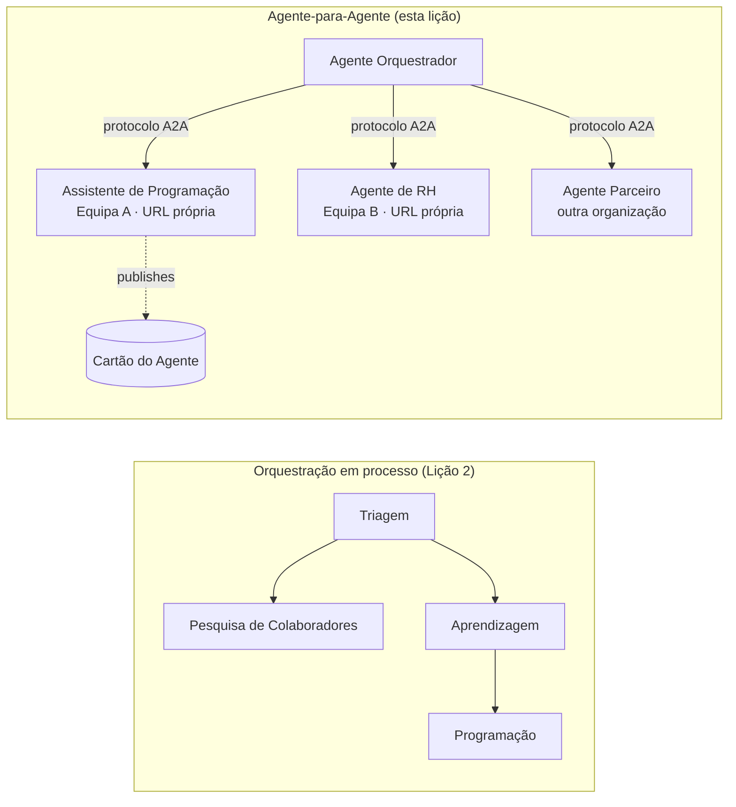

# Lição 7: Orquestração Multi-Agente & Agente-para-Agente (A2A)

Com a [Lição 6](../lesson-6-toolbox/README.md) pode construir ferramentas governadas e agentes alojados.
Mas os sistemas reais raramente usam **um** agente. À medida que escala, compõe **muitos** agentes — alguns que
possui, outros detidos por outras equipas, outros a correr em organizações completamente diferentes. Esta lição trata de
como os agentes trabalham **em conjunto**.

Já encontrou uma forma de design multi-agente em
[o `agent-orchestration.py` da Lição 2](../lesson-2-agent-development/README.md): o padrão de **handoff**
onde um agente de triagem encaminha para especialistas **dentro de um único processo**. Esta lição sobe
um nível acima — para **Agente-para-Agente (A2A)**, o protocolo aberto para agentes que correm como
**serviços em rede** e se chamam através de fronteiras de processo, equipa e organização.

## Objetivos de aprendizagem

No final desta lição será capaz de:

- Explicar a diferença entre **orquestração em processo** (handoff/fluxos de trabalho) e
  **Agente-para-Agente (A2A)** de comunicação, e escolher a mais adequada.
- Descrever os blocos de construção do A2A: **Agent Card**, **skills**, **tasks**, e **discovery**.
- **Expor** um agente do Microsoft Agent Framework como um serviço A2A com `A2AExecutor`.
- **Consumir** um agente remoto como um par em rede com `A2AAgent`.
- Aplicar preocupações empresariais ao A2A: **segurança, identidade, governação, observabilidade e custo**.

---

## Pré-requisitos

1. Ter concluído a [Lição 2](../lesson-2-agent-development/README.md) (desenvolvimento de agentes e orquestração).
2. Um projeto **Microsoft Foundry** com uma implantação de modelo atual (por exemplo `gpt-5.1`, e
   `gpt-5-codex` para o exemplo de codificação). Evite GPT-4o / GPT-4.1 descontinuados.
3. **Azure CLI** autenticado: `az login`.
4. **Python 3.12+** com as dependências do curso instaladas (`pip install -r ../requirements.txt`).
   A Lição 7 adiciona os pacotes em pré-visualização `agent-framework-a2a`, `a2a-sdk` e `uvicorn`.
5. `FOUNDRY_PROJECT_ENDPOINT` e `FOUNDRY_MODEL` definidos no seu `.env` (veja o README do curso).

---

## 1. Duas formas de os agentes trabalharem em conjunto

Não existe um único padrão "multi-agente". Escolha aquele que corresponde ao seu **limite**:

| Padrão | Onde os agentes correm | Como se conectam | Quando usar |
|---------|------------------|------------------|----------|
| **Handoff / Workflow** (Lição 2) | Um processo, uma base de código | Grafo em memória (`HandoffBuilder`, `WorkflowBuilder`) | Possui todos os agentes e os implementa em conjunto. |
| **Agente-para-Agente (A2A)** (esta lição) | Serviços separados, ciclos de vida separados | Protocolo **A2A** aberto sobre HTTP, descoberto via **Agent Cards** | Os agentes pertencem a equipas/organizações diferentes, escalam de forma independente ou estão implementados em frameworks diferentes. |

Handoff trata de **encaminhamento dentro de uma aplicação**. A2A trata de **compor agentes como
serviços independentes** — o equivalente, para agentes, de passar de chamadas de função para microserviços.



> **Eles compõem.** Um orquestrador que constrói com `HandoffBuilder` pode ter **agentes A2A remotos**
> como participantes — encaminhamento em processo para serviços que por sua vez correm em qualquer lugar.

---

## 2. Os blocos de construção do A2A

O A2A é um **protocolo aberto** (não específico da Microsoft), por isso um agente A2A pode ser consumido pela Microsoft
Agent Framework, LangGraph, código personalizado, ou pela stack de outra empresa. Quatro conceitos são importantes:

- **Agent Card** — um pequeno documento JSON, publicado em
  `/.well-known/agent-card.json`, que anuncia o **nome, descrição, URL, versão,
  skills, e capacidades**. É assim que um cliente **descobre** o que um agente remoto pode fazer.
- **Skills** — as coisas declaradas que o agente consegue fazer (`id`, `name`, `description`, `tags`,
  `examples`). Os clientes (e modelos) usam-nos para decidir se devem chamá-lo.
- **Tasks** — uma chamada a um agente A2A é uma **task** com um ciclo de vida (submetida → em execução →
  concluída/falhada). O servidor acompanha as tasks numa **task store**; atualizações em streaming são suportadas.
- **Discovery** — um cliente com apenas um URL busca o Agent Card e sabe como chamar o agente.

---

## 3. Expor um agente como um serviço A2A — `a2a_server.py`

O lado de **Build/serve** envolve qualquer agente do Microsoft Agent Framework com `A2AExecutor` e monta-o
numa aplicação HTTP A2A. Veja [`a2a_server.py`](../../../lesson-7-multi-agent-a2a/a2a_server.py). A ligação chave:

```python
from agent_framework.a2a import A2AExecutor
from a2a.server.apps import A2AStarletteApplication
from a2a.server.request_handlers import DefaultRequestHandler
from a2a.server.tasks import InMemoryTaskStore
from a2a.types import AgentCapabilities, AgentCard, AgentSkill

agent = client.as_agent(name="coding-assistant", instructions="...")

agent_card = AgentCard(
    name="Coding Assistant",
    description="Generates runnable code samples...",
    url="http://localhost:9000/",
    version="1.0.0",
    capabilities=AgentCapabilities(streaming=True),
    default_input_modes=["text"],
    default_output_modes=["text"],
    skills=[AgentSkill(id="generate-code", name="Generate code",
                       description="Write a runnable code snippet.", tags=["code"])],
)

request_handler = DefaultRequestHandler(
    agent_executor=A2AExecutor(agent),
    task_store=InMemoryTaskStore(),
)
app = A2AStarletteApplication(agent_card=agent_card, http_handler=request_handler).build()
# servido com o uvicorn na porta 9000
```

Note que o código do agente permanece **inalterado** — `A2AExecutor` adapta o seu agente existente ao protocolo.
O Agent Card é o que o torna **descobrável** para qualquer cliente A2A.

---

## 4. Consumir um agente remoto — `a2a_client.py`

O lado de **Consume** liga-se a um agente remoto **por URL**, obtém o seu Agent Card, e chama-o
exatamente como um agente local. Veja [`a2a_client.py`](../../../lesson-7-multi-agent-a2a/a2a_client.py):

```python
from agent_framework.a2a import A2AAgent

remote_agent = A2AAgent(name="remote-coding-assistant", url="http://localhost:9000")
result = await remote_agent.run("Write a Python function that reverses a string.")
print(result.text)
```

Esse é todo o propósito do A2A: do ponto de vista do chamador, um agente remoto comporta-se como qualquer outro
`agent_framework` agent, portanto pode integrá-lo num workflow ou encaminhar para ele — mesmo que corra
num processo diferente, numa máquina diferente, propriedade de uma equipa diferente.

### Execute-o de ponta a ponta

```bash
# Terminal 1 — iniciar o serviço A2A
python a2a_server.py

# Terminal 2 — chamá-lo
python a2a_client.py "Write a Python function that reverses a string."
```

Verá a resposta do assistente de codificação chegar através do protocolo A2A. Abra
`http://localhost:9000/.well-known/agent-card.json` num navegador para ver o Agent Card publicado.

---

## 5. Preocupações empresariais

Transformar agentes em serviços em rede introduz as mesmas preocupações que qualquer sistema distribuído —
além de algumas específicas para IA:

- **Identidade e autenticação.** Nunca exponha um agente A2A sem autenticação. O Agent Card transporta
  `security` / `security_schemes`, e o `A2AAgent` aceita um `auth_interceptor` para que os chamadores anexem
  credenciais (tokens bearer OAuth, chaves de API). Use Entra ID / managed identities para
  autenticação serviço-a-serviço em produção; coloque o serviço atrás de um gateway.
- **Governação.** Combine o A2A com a [Toolbox da Lição 6](../lesson-6-toolbox/README.md): um agente remoto
  pode ser publicado como uma **A2A tool** dentro de uma toolbox governada para que RBAC, injeção de credenciais,
  e políticas de guardrail se apliquem centralmente.
- **Observability.** Um pedido agora atravessa fronteiras de processo, por isso propague tracing ao longo da chamada.
  Ative [Foundry Observability / OpenTelemetry](../lesson-3-agent-evals/README.md) em **ambos** os
  orquestrador e cada agente remoto para obter um rastreio de ponta a ponta.
- **Versionamento.** O Agent Card tem um `version`. Trate-o como uma API: alterações aditivas são seguras;
  quebrar o contrato de uma skill necessita de uma nova versão e de uma janela de migração para os consumidores.
- **Fiabilidade.** Agentes remotos falham de forma independente. Defina timeouts (`A2AAgent(timeout=...)`), trate
  falhas parciais, e não permita que um par lento bloqueie toda a orquestração.
- **Custo.** Cada chamada a um agente remoto é a sua própria invocação de modelo. O fan-out multiplica os gastos com tokens —
  inclua-o no orçamento, e prefira o encaminhamento para **um** agente melhor em vez de difundir para muitos.

---

## Exercícios práticos

1. **Adicione um segundo serviço.** Copie `a2a_server.py` para expor o agente **employee-search** na porta
   9001 com o seu próprio Agent Card e skills. Execute ambos e faça com que um cliente chame cada um.
2. **Orquestre pares remotos.** Construa um pequeno `HandoffBuilder` (ou um router simples) cujos participantes
   incluam dois `A2AAgent`s apontando para os seus dois serviços. Encaminhe uma consulta para o agente certo.
3. **Assegure-o.** Adicione um `auth_interceptor` ao cliente e exija um token bearer no servidor.
   O que falha se o token estiver em falta? Onde guardaria o token em produção?
4. **Handoff vs A2A.** Escreva dois parágrafos curtos: quando manteria o handoff em processo da Lição 2,
   e quando a complexidade adicional do A2A se justifica? Dê um exemplo concreto de cada um.

---

## Recursos

- [Agente-para-Agente (A2A) — Microsoft Agent Framework](https://learn.microsoft.com/agent-framework/user-guide/agent-orchestration/a2a)
- [Orquestração multi-agente — Microsoft Agent Framework](https://learn.microsoft.com/agent-framework/user-guide/agent-orchestration/)
- [Especificação do protocolo A2A](https://a2a-protocol.org/)
- [A2A Python SDK (`a2a-sdk`)](https://github.com/a2aproject/a2a-python)
- [Foundry Agent Service — padrões multi-agente](https://learn.microsoft.com/azure/ai-foundry/agents/concepts/connected-agents)

---

**Anterior:** [Lição 6 — Microsoft Toolbox](../lesson-6-toolbox/README.md)

---

<!-- CO-OP TRANSLATOR DISCLAIMER START -->
**Aviso Legal**:
Este documento foi traduzido utilizando o serviço de tradução automática [Co-op Translator](https://github.com/Azure/co-op-translator). Embora nos esforcemos pela precisão, esteja ciente de que traduções automáticas podem conter erros ou imprecisões. O documento original na sua língua nativa deve ser considerado a fonte autorizada. Para informações críticas, recomenda-se tradução profissional humana. Não nos responsabilizamos por quaisquer mal-entendidos ou interpretações incorretas resultantes da utilização desta tradução.
<!-- CO-OP TRANSLATOR DISCLAIMER END -->