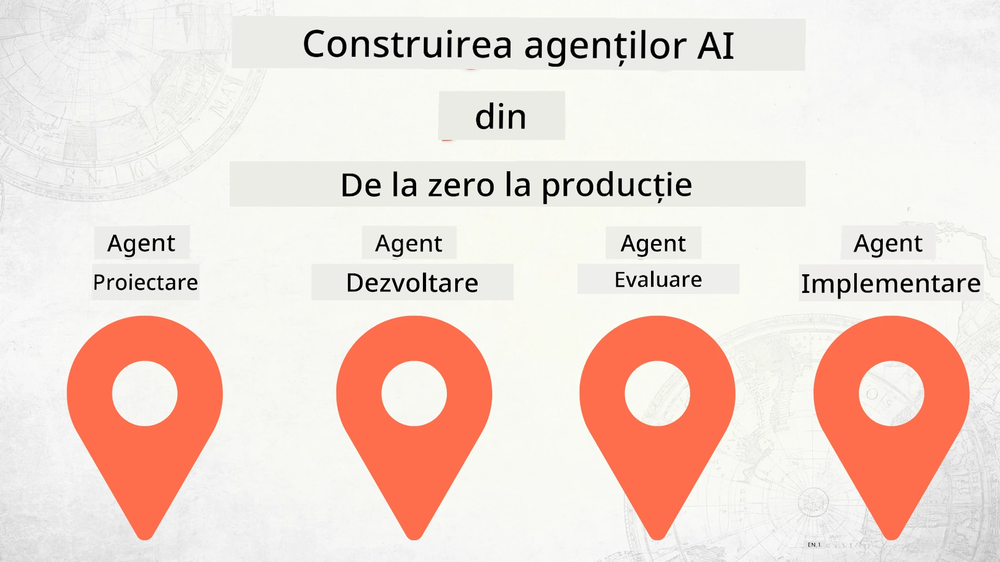

# Construirea agenților AI de la zero până la producție



### 🌐 Suport multi-limbaj

#### Suportat prin GitHub Action (automatizat și întotdeauna actualizat)

<!-- CO-OP TRANSLATOR LANGUAGES TABLE START -->
[Arabic](../ar/README.md) | [Bengali](../bn/README.md) | [Bulgarian](../bg/README.md) | [Burmese (Myanmar)](../my/README.md) | [Chinese (Simplified)](../zh-CN/README.md) | [Chinese (Traditional, Hong Kong)](../zh-HK/README.md) | [Chinese (Traditional, Macau)](../zh-MO/README.md) | [Chinese (Traditional, Taiwan)](../zh-TW/README.md) | [Croatian](../hr/README.md) | [Czech](../cs/README.md) | [Danish](../da/README.md) | [Dutch](../nl/README.md) | [Estonian](../et/README.md) | [Finnish](../fi/README.md) | [French](../fr/README.md) | [German](../de/README.md) | [Greek](../el/README.md) | [Hebrew](../he/README.md) | [Hindi](../hi/README.md) | [Hungarian](../hu/README.md) | [Indonesian](../id/README.md) | [Italian](../it/README.md) | [Japanese](../ja/README.md) | [Kannada](../kn/README.md) | [Korean](../ko/README.md) | [Lithuanian](../lt/README.md) | [Malay](../ms/README.md) | [Malayalam](../ml/README.md) | [Marathi](../mr/README.md) | [Nepali](../ne/README.md) | [Nigerian Pidgin](../pcm/README.md) | [Norwegian](../no/README.md) | [Persian (Farsi)](../fa/README.md) | [Polish](../pl/README.md) | [Portuguese (Brazil)](../pt-BR/README.md) | [Portuguese (Portugal)](../pt-PT/README.md) | [Punjabi (Gurmukhi)](../pa/README.md) | [Romanian](./README.md) | [Russian](../ru/README.md) | [Serbian (Cyrillic)](../sr/README.md) | [Slovak](../sk/README.md) | [Slovenian](../sl/README.md) | [Spanish](../es/README.md) | [Swahili](../sw/README.md) | [Swedish](../sv/README.md) | [Tagalog (Filipino)](../tl/README.md) | [Tamil](../ta/README.md) | [Telugu](../te/README.md) | [Thai](../th/README.md) | [Turkish](../tr/README.md) | [Ukrainian](../uk/README.md) | [Urdu](../ur/README.md) | [Vietnamese](../vi/README.md)

> **Preferi să clonezi local?**

> Acest depozit include traduceri în peste 50 de limbi, ceea ce crește semnificativ dimensiunea descărcării. Pentru a clona fără traduceri, folosește sparse checkout:
> ```bash
> git clone --filter=blob:none --sparse https://github.com/microsoft/Building-AI-Agents-From-Zero-To-Production.git
> cd Building-AI-Agents-From-Zero-To-Production
> git sparse-checkout set --no-cone '/*' '!translations' '!translated_images'
> ```
> Aceasta îți oferă tot ce ai nevoie pentru a finaliza cursul cu o descărcare mult mai rapidă.
<!-- CO-OP TRANSLATOR LANGUAGES TABLE END -->

## Un curs care te învață fundamentele ciclului de viață al dezvoltării agenților AI

[](https://github.com/microsoft/Building-AI-Agents-From-Zero-To-Production/blob/master/LICENSE?WT.mc_id=academic-105485-koreyst)
[](https://GitHub.com/microsoft/Building-AI-Agents-From-Zero-To-Production/graphs/contributors/?WT.mc_id=academic-105485-koreyst)
[](https://GitHub.com/microsoft/Building-AI-Agents-From-Zero-To-Production/issues/?WT.mc_id=academic-105485-koreyst)
[](https://GitHub.com/microsoft/Building-AI-Agents-From-Zero-To-Production/pulls/?WT.mc_id=academic-105485-koreyst)
[](http://makeapullrequest.com?WT.mc_id=academic-105485-koreyst)

[](https://discord.gg/Kuaw3ktsu6)

## 🌱 Începe

Acest curs conține lecții care acoperă fundamentele construirii și implementării agenților AI.

Fiecare lecție se bazează pe cea anterioară, așa că recomandăm să începi de la început și să parcurgi toate până la final.

Dacă vrei să explorezi mai mult despre subiectele legate de Agenți AI, poți consulta [Cursul AI Agents For Beginners](https://aka.ms/ai-agents-beginners).

### Întâlnește alți cursanți, primește răspunsuri la întrebările tale

Dacă întâmpini dificultăți sau ai întrebări despre construirea agenților AI, alătură-te canalului nostru dedicat de Discord în [Microsoft Foundry Discord](https://discord.gg/Kuaw3ktsu6).

### Ce ai nevoie

Fiecare lecție are propriul exemplu de cod pe care îl poți rula local. Poți [face fork la acest repo](https://github.com/microsoft/Building-AI-Agents-From-Zero-To-Production/fork) pentru a-ți crea o copie.

Acest curs folosește în prezent următoarele:

- [Microsoft Agent Framework (MAF)](https://aka.ms/ai-agents-beginners/agent-framework)
- [Microsoft Foundry](https://azure.microsoft.com/products/ai-foundry)
- [Azure OpenAI Service](https://azure.microsoft.com/products/ai-foundry/models/openai)
- [Azure CLI](https://learn.microsoft.com/cli/azure/authenticate-azure-cli?view=azure-cli-latest)

Asigură-te că ai acces la aceste servicii înainte de a începe.

Mai multe opțiuni privind găzduirea modelelor și alte servicii vor fi disponibile în curând.

## 🗃️ Lecții

| **Lecție**         | **Descriere**                                                                                  |
|--------------------|--------------------------------------------------------------------------------------------------|
| [Agent Design](./lesson-1-agent-design/README.md)       | O introducere în cazul de utilizare „Developer Onboarding” și cum să proiectezi agenți eficienți  |
| [Agent Development](./lesson-2-agent-development/README.md)  | Folosind Microsoft Agent Framework (MAF), creează 3 agenți care ajută noii dezvoltatori să se onboardeze.       |
| [Agent Evaluations](./lesson-3-agent-evals/README.md)  | Folosind Microsoft Foundry, află cât de bine performează agenții AI și cum să îi îmbunătățești. |
| [Agent Deployment](./lesson-4-agent-deployment/README.md)   | Folosind Hosted Agents și OpenAI Chatkit, vezi cum să implementezi un agent AI în producție.       |


## 🎒 Alte cursuri

Echipa noastră produce și alte cursuri! Vezi:

<!-- CO-OP TRANSLATOR OTHER COURSES START -->
### LangChain
[](https://aka.ms/langchain4j-for-beginners)
[](https://aka.ms/langchainjs-for-beginners?WT.mc_id=m365-94501-dwahlin)
[](https://github.com/microsoft/langchain-for-beginners?WT.mc_id=m365-94501-dwahlin)
---

### Azure / Edge / MCP / Agents
[](https://github.com/microsoft/AZD-for-beginners?WT.mc_id=academic-105485-koreyst)
[](https://github.com/microsoft/edgeai-for-beginners?WT.mc_id=academic-105485-koreyst)
[](https://github.com/microsoft/mcp-for-beginners?WT.mc_id=academic-105485-koreyst)
[](https://github.com/microsoft/ai-agents-for-beginners?WT.mc_id=academic-105485-koreyst)

---
 
### Generative AI Series
[](https://github.com/microsoft/generative-ai-for-beginners?WT.mc_id=academic-105485-koreyst)
[-9333EA?style=for-the-badge&labelColor=E5E7EB&color=9333EA)](https://github.com/microsoft/Generative-AI-for-beginners-dotnet?WT.mc_id=academic-105485-koreyst)
[-C084FC?style=for-the-badge&labelColor=E5E7EB&color=C084FC)](https://github.com/microsoft/generative-ai-for-beginners-java?WT.mc_id=academic-105485-koreyst)
[-E879F9?style=for-the-badge&labelColor=E5E7EB&color=E879F9)](https://github.com/microsoft/generative-ai-with-javascript?WT.mc_id=academic-105485-koreyst)

---
 
### Învățare de bază
[](https://aka.ms/ml-beginners?WT.mc_id=academic-105485-koreyst)
[](https://aka.ms/datascience-beginners?WT.mc_id=academic-105485-koreyst)
[](https://aka.ms/ai-beginners?WT.mc_id=academic-105485-koreyst)
[](https://github.com/microsoft/Security-101?WT.mc_id=academic-96948-sayoung)
[](https://aka.ms/webdev-beginners?WT.mc_id=academic-105485-koreyst)
[](https://aka.ms/iot-beginners?WT.mc_id=academic-105485-koreyst)
[](https://github.com/microsoft/xr-development-for-beginners?WT.mc_id=academic-105485-koreyst)

---

### Seria Copilot
[](https://aka.ms/GitHubCopilotAI?WT.mc_id=academic-105485-koreyst)
[](https://github.com/microsoft/mastering-github-copilot-for-dotnet-csharp-developers?WT.mc_id=academic-105485-koreyst)
[](https://github.com/microsoft/CopilotAdventures?WT.mc_id=academic-105485-koreyst)
<!-- CO-OP TRANSLATOR OTHER COURSES END -->

## Contribuții

Acest proiect primește cu plăcere contribuții și sugestii. Majoritatea contribuțiilor necesită să fi de acord cu un
Acord de Licență a Contribuitorului (CLA) prin care declarați că aveți dreptul și efectiv ne acordați
drepturile de a folosi contribuția dumneavoastră. Pentru detalii, vizitați <https://cla.opensource.microsoft.com>.

Când trimiteți o cerere de extragere (pull request), un bot CLA va determina automat dacă trebuie să furnizați
un CLA și va decora cererea în mod corespunzător (de exemplu, verificare status, comentariu). Urmați pur și simplu instrucțiunile
oferite de bot. Veți avea nevoie să faceți acest lucru o singură dată pentru toate repo-urile care folosesc CLA-ul nostru.

Acest proiect a adoptat [Codul de Conduită pentru Cod Deschis Microsoft](https://opensource.microsoft.com/codeofconduct/).
Pentru mai multe informații, consultați [Întrebări frecvente despre Codul de Conduită](https://opensource.microsoft.com/codeofconduct/faq/) sau
contactați [opencode@microsoft.com](mailto:opencode@microsoft.com) pentru orice alte întrebări sau comentarii.

## Mărci Comerciale

Acest proiect poate conține mărci comerciale sau sigle pentru proiecte, produse sau servicii. Utilizarea autorizată a mărcilor
sau siglelor Microsoft este supusă și trebuie să urmeze
[Ghidurile privind Mărcile Comerciale și Brandul Microsoft](https://www.microsoft.com/legal/intellectualproperty/trademarks/usage/general).
Utilizarea mărcilor sau siglelor Microsoft în versiunile modificate ale acestui proiect nu trebuie să creeze confuzie sau să sugereze sponsorizare Microsoft.
Orice utilizare a mărcilor sau siglelor terților este supusă politicilor acelora terți.

## Obținerea Ajutorului

Dacă întâmpinați dificultăți sau aveți întrebări despre construirea aplicațiilor AI, alăturați-vă:

[](https://discord.gg/Kuaw3ktsu6)

Dacă aveți feedback despre produs sau erori în timpul construirii, vizitați:

[](https://aka.ms/foundry/forum)

---

<!-- CO-OP TRANSLATOR DISCLAIMER START -->
**Declinarea responsabilității**:  
Acest document a fost tradus folosind serviciul de traducere automată AI [Co-op Translator](https://github.com/Azure/co-op-translator). Deși ne străduim să asigurăm acuratețea, vă rugăm să rețineți că traducerile automate pot conține erori sau inexactități. Documentul original în limba sa nativă trebuie considerat sursa autorizată. Pentru informații critice, se recomandă traducerea profesională realizată de un specialist uman. Nu ne asumăm responsabilitatea pentru orice neînțelegeri sau interpretări greșite rezultate din utilizarea acestei traduceri.
<!-- CO-OP TRANSLATOR DISCLAIMER END -->