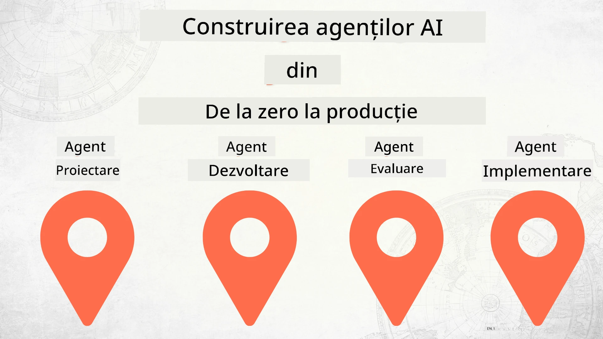

# Construirea agenților AI de la zero până la producție



### 🌐 Suport multilingv

#### Suportat prin GitHub Action (automatizat și întotdeauna actualizat)

<!-- CO-OP TRANSLATOR LANGUAGES TABLE START -->
[Arabic](../ar/README.md) | [Bengali](../bn/README.md) | [Bulgarian](../bg/README.md) | [Burmese (Myanmar)](../my/README.md) | [Chinese (Simplified)](../zh-CN/README.md) | [Chinese (Traditional, Hong Kong)](../zh-HK/README.md) | [Chinese (Traditional, Macau)](../zh-MO/README.md) | [Chinese (Traditional, Taiwan)](../zh-TW/README.md) | [Croatian](../hr/README.md) | [Czech](../cs/README.md) | [Danish](../da/README.md) | [Dutch](../nl/README.md) | [Estonian](../et/README.md) | [Finnish](../fi/README.md) | [French](../fr/README.md) | [German](../de/README.md) | [Greek](../el/README.md) | [Hebrew](../he/README.md) | [Hindi](../hi/README.md) | [Hungarian](../hu/README.md) | [Indonesian](../id/README.md) | [Italian](../it/README.md) | [Japanese](../ja/README.md) | [Kannada](../kn/README.md) | [Khmer](../km/README.md) | [Korean](../ko/README.md) | [Lithuanian](../lt/README.md) | [Malay](../ms/README.md) | [Malayalam](../ml/README.md) | [Marathi](../mr/README.md) | [Nepali](../ne/README.md) | [Nigerian Pidgin](../pcm/README.md) | [Norwegian](../no/README.md) | [Persian (Farsi)](../fa/README.md) | [Polish](../pl/README.md) | [Portuguese (Brazil)](../pt-BR/README.md) | [Portuguese (Portugal)](../pt-PT/README.md) | [Punjabi (Gurmukhi)](../pa/README.md) | [Romanian](./README.md) | [Russian](../ru/README.md) | [Serbian (Cyrillic)](../sr/README.md) | [Slovak](../sk/README.md) | [Slovenian](../sl/README.md) | [Spanish](../es/README.md) | [Swahili](../sw/README.md) | [Swedish](../sv/README.md) | [Tagalog (Filipino)](../tl/README.md) | [Tamil](../ta/README.md) | [Telugu](../te/README.md) | [Thai](../th/README.md) | [Turkish](../tr/README.md) | [Ukrainian](../uk/README.md) | [Urdu](../ur/README.md) | [Vietnamese](../vi/README.md)

> **Preferi să clonezi local?**
>
> Acest depozit include traduceri în peste 50 de limbi, ceea ce mărește semnificativ dimensiunea descărcării. Pentru a clona fără traduceri, folosește sparse checkout:
>
> **Bash / macOS / Linux:**
> ```bash
> git clone --filter=blob:none --sparse https://github.com/microsoft/Building-AI-Agents-From-Zero-To-Production.git
> cd Building-AI-Agents-From-Zero-To-Production
> git sparse-checkout set --no-cone '/*' '!translations' '!translated_images'
> ```
>
> **CMD (Windows):**
> ```cmd
> git clone --filter=blob:none --sparse https://github.com/microsoft/Building-AI-Agents-From-Zero-To-Production.git
> cd Building-AI-Agents-From-Zero-To-Production
> git sparse-checkout set --no-cone "/*" "!translations" "!translated_images"
> ```
>
> Aceasta îți oferă tot ce ai nevoie pentru a parcurge cursul cu o descărcare mult mai rapidă.
<!-- CO-OP TRANSLATOR LANGUAGES TABLE END -->

## Un curs care te învață bazele ciclului de dezvoltare a agenților AI

[](https://github.com/microsoft/Building-AI-Agents-From-Zero-To-Production/blob/master/LICENSE?WT.mc_id=academic-105485-koreyst)
[](https://GitHub.com/microsoft/Building-AI-Agents-From-Zero-To-Production/graphs/contributors/?WT.mc_id=academic-105485-koreyst)
[](https://GitHub.com/microsoft/Building-AI-Agents-From-Zero-To-Production/issues/?WT.mc_id=academic-105485-koreyst)
[](https://GitHub.com/microsoft/Building-AI-Agents-From-Zero-To-Production/pulls/?WT.mc_id=academic-105485-koreyst)
[](http://makeapullrequest.com?WT.mc_id=academic-105485-koreyst)

[](https://discord.gg/Kuaw3ktsu6)

## 🌱 Începutul

Acest curs are lecții care acoperă bazele construirii și implementării agenților AI.

Fiecare lecție se bazează pe cea anterioară, așa că recomandăm să începi de la început și să parcurgi tot cursul până la final.

Dacă vrei să explorezi mai mult despre subiectele agenților AI, poți verifica [Cursul pentru Începători în Agenții AI](https://aka.ms/ai-agents-beginners).

### Întâlnește alți cursanți, primește răspunsuri la întrebările tale

Dacă întâmpini dificultăți sau ai întrebări despre construirea agenților AI, alătură-te canalului nostru dedicat pe Discord în [Microsoft Foundry Discord](https://discord.gg/Kuaw3ktsu6).

### Ce ai nevoie


Fiecare lecție are propriul său exemplu de cod pe care îl puteți rula local. Puteți [clona acest repo](https://github.com/microsoft/Building-AI-Agents-From-Zero-To-Production/fork) pentru a crea propria copie.

Acest curs folosește în prezent următoarele:

- [Microsoft Agent Framework (MAF)](https://aka.ms/ai-agents-beginners/agent-framework)
- [Microsoft Foundry](https://azure.microsoft.com/products/ai-foundry) — un proiect cu un model **seria GPT-5** implementat (de exemplu `gpt-5.1`). Nu utilizați modelele retrase GPT-4o / GPT-4.1.
- [Azure OpenAI Service](https://azure.microsoft.com/products/ai-foundry/models/openai)
- [Azure CLI](https://learn.microsoft.com/cli/azure/authenticate-azure-cli?view=azure-cli-latest) — conectați-vă cu `az login` înainte de a rula orice exemplu
- **Python 3.12 sau mai recent**

Asigurați-vă că aveți acces la aceste servicii înainte de a începe.

> **💰 Cost și curățare.** Lecțiile practice creează resurse reale Azure — un proiect Microsoft Foundry,
> o implementare de model, un magazin vectorial, și (în Lecțiile 4–6) agenți și cutii de unelte găzduite.
> Acestea pot genera costuri cât timp există. Când terminați o lecție — sau cursul — ștergeți
> resursele care nu mai sunt necesare. Cea mai simplă abordare este să puneți totul într-un grup de resurse dedicat
> și să ștergeți grupul întreg când ați terminat:
>
> ```bash
> az group delete --name <your-resource-group> --yes --no-wait
> ```
>
> De asemenea, puteți șterge agenți individuali, magazine vectoriale și cutii de unelte din portalul Foundry.

> **Notă despre modele.** Acest curs oferă toate modelele prin **Microsoft Foundry**. Nu folosește
> *GitHub Models*, care este retras pe **30 iulie 2026** — Microsoft Foundry este
> calea oficială de migrare. Dacă aveți cod vechi ce apelează GitHub Models, redirecționați-l către o implementare
> de model Foundry.

Mai multe opțiuni pentru găzduirea modelelor și servicii vor veni în curând.

## 🗃️ Lecții

| **Lecție**         | **Descriere**                                                                                  |
|--------------------|--------------------------------------------------------------------------------------------------|
| [Proiectarea Agentului](./lesson-1-agent-design/README.md)       | O introducere în cazul de utilizare „Onboarding Developer” și cum să proiectați agenți eficienți  |
| [Dezvoltarea Agentului](./lesson-2-agent-development/README.md)  | Folosind Microsoft Agent Framework (MAF), construiți un set de agenți specializați pentru a ajuta noii dezvoltatori să se integreze.       |
| [Evaluarea Agenților](./lesson-3-agent-evals/README.md)  | Folosind Microsoft Foundry, aflați cât de bine performează agenții noștri AI și cum să-i îmbunătățiți. |
| [Implementarea Agentului](./lesson-4-agentdeployment/README.md)   | Folosind agenți găzduiți Microsoft Foundry și OpenAI ChatKit, vedeți cum să implementați un agent AI în producție.       |
| [Agenți găzduiți în producție](./lesson-5-hosted-agents-production/README.md)   | Duceți un agent găzduit la producția enterprise: Agenți găzduiți vs gazde de capabilități, aduceți-vă propriul stocare, memorie și guvernanță.       |
| [Cutia de unelte Microsoft](./lesson-6-toolbox/README.md)   | Definiți uneltele o dată și guvernați-le centralizat: construiți o cutie de unelte, consumați-o dintr-un agent printr-un singur endpoint MCP și versiuneați uneltele în siguranță.       |
| [Multi-Agent & A2A](./lesson-7-multi-agent-a2a/README.md)   | Compuneți agenții ca servicii în rețea: expuneți un agent prin protocolul deschis Agent-to-Agent (A2A) și consumați un agent de la distanță ca peer.       |


## 🎒 Alte cursuri

Echipa noastră produce și alte cursuri! Verificați:

<!-- CO-OP TRANSLATOR OTHER COURSES START -->
### LangChain
[](https://aka.ms/langchain4j-for-beginners)
[](https://aka.ms/langchainjs-for-beginners?WT.mc_id=m365-94501-dwahlin)
[](https://github.com/microsoft/langchain-for-beginners?WT.mc_id=m365-94501-dwahlin)
---

### Azure / Edge / MCP / Agenți
[](https://github.com/microsoft/AZD-for-beginners?WT.mc_id=academic-105485-koreyst)
[](https://github.com/microsoft/edgeai-for-beginners?WT.mc_id=academic-105485-koreyst)
[](https://github.com/microsoft/mcp-for-beginners?WT.mc_id=academic-105485-koreyst)
[](https://github.com/microsoft/ai-agents-for-beginners?WT.mc_id=academic-105485-koreyst)

---
 
### Seria Generative AI

[](https://github.com/microsoft/generative-ai-for-beginners?WT.mc_id=academic-105485-koreyst)
[-9333EA?style=for-the-badge&labelColor=E5E7EB&color=9333EA)](https://github.com/microsoft/Generative-AI-for-beginners-dotnet?WT.mc_id=academic-105485-koreyst)
[-C084FC?style=for-the-badge&labelColor=E5E7EB&color=C084FC)](https://github.com/microsoft/generative-ai-for-beginners-java?WT.mc_id=academic-105485-koreyst)
[-E879F9?style=for-the-badge&labelColor=E5E7EB&color=E879F9)](https://github.com/microsoft/generative-ai-with-javascript?WT.mc_id=academic-105485-koreyst)

---
 
### Învățare de bază
[](https://aka.ms/ml-beginners?WT.mc_id=academic-105485-koreyst)
[](https://aka.ms/datascience-beginners?WT.mc_id=academic-105485-koreyst)
[](https://aka.ms/ai-beginners?WT.mc_id=academic-105485-koreyst)
[](https://github.com/microsoft/Security-101?WT.mc_id=academic-96948-sayoung)
[](https://aka.ms/webdev-beginners?WT.mc_id=academic-105485-koreyst)
[](https://aka.ms/iot-beginners?WT.mc_id=academic-105485-koreyst)
[](https://github.com/microsoft/xr-development-for-beginners?WT.mc_id=academic-105485-koreyst)

---
 
### Seria Copilot
[](https://aka.ms/GitHubCopilotAI?WT.mc_id=academic-105485-koreyst)
[](https://github.com/microsoft/mastering-github-copilot-for-dotnet-csharp-developers?WT.mc_id=academic-105485-koreyst)
[](https://github.com/microsoft/CopilotAdventures?WT.mc_id=academic-105485-koreyst)
<!-- CO-OP TRANSLATOR OTHER COURSES END -->

## Contribuții

Acest proiect acceptă contribuții și sugestii. Majoritatea contribuțiilor necesită să fii de acord cu un
Acord pentru Licența Contribuitorului (CLA) prin care declari că ai dreptul și efectiv ne acorzi
drepturile de a folosi contribuția ta. Pentru detalii, vizitează <https://cla.opensource.microsoft.com>.

Când trimiți un pull request, un bot CLA va determina automat dacă trebuie să furnizezi
un CLA și va decora PR-ul corespunzător (de ex., verificare de stare, comentariu). Urmează pur și simplu instrucțiunile
oferite de bot. Vei avea nevoie să faci acest lucru o singură dată în toate depozitele care folosesc CLA-ul nostru.

Acest proiect a adoptat [Codul de conduită pentru Open Source Microsoft](https://opensource.microsoft.com/codeofconduct/).
Pentru mai multe informații vezi [Întrebări frecvente despre Codul de conduită](https://opensource.microsoft.com/codeofconduct/faq/) sau
contactează [opencode@microsoft.com](mailto:opencode@microsoft.com) pentru orice întrebări sau comentarii suplimentare.

## Mărci comerciale

Acest proiect poate conține mărci comerciale sau logo-uri pentru proiecte, produse sau servicii. Utilizarea autorizată a
mărcilor comerciale sau logo-urilor Microsoft este supusă și trebuie să urmeze
[Ghidurile de utilizare a mărcilor și brandurilor Microsoft](https://www.microsoft.com/legal/intellectualproperty/trademarks/usage/general).
Utilizarea mărcilor comerciale sau logo-urilor Microsoft în versiuni modificate ale acestui proiect nu trebuie să creeze confuzie sau să
implice sponsorizarea Microsoft. Orice utilizare a mărcilor comerciale sau logo-urilor terților este supusă politicilor acelor terți.

## Obținerea de ajutor

Dacă întâmpini dificultăți sau ai întrebări despre construirea aplicațiilor AI, alătură-te:

[](https://discord.gg/Kuaw3ktsu6)

Dacă ai feedback despre produse sau erori în timpul dezvoltării, vizitează:

[](https://aka.ms/foundry/forum)

---

<!-- CO-OP TRANSLATOR DISCLAIMER START -->
**Declinare a responsabilității**:
Acest document a fost tradus folosind serviciul de traducere AI [Co-op Translator](https://github.com/Azure/co-op-translator). În timp ce ne străduim pentru acuratețe, vă rugăm să rețineți că traducerile automate pot conține erori sau inexactități. Documentul original în limba sa nativă trebuie considerat sursa autorizată. Pentru informații critice, se recomandă traducerea profesională realizată de un om. Nu ne asumăm responsabilitatea pentru eventualele neînțelegeri sau interpretări greșite care decurg din utilizarea acestei traduceri.
<!-- CO-OP TRANSLATOR DISCLAIMER END -->