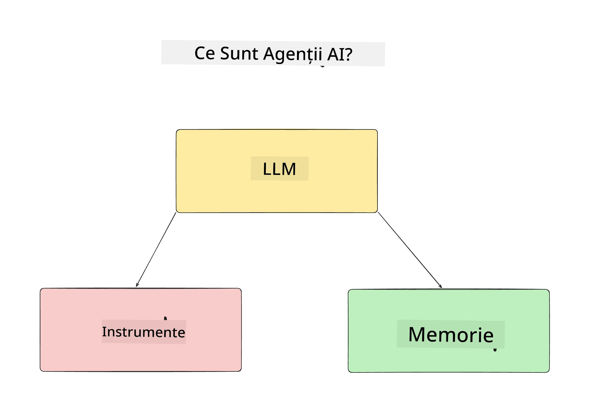
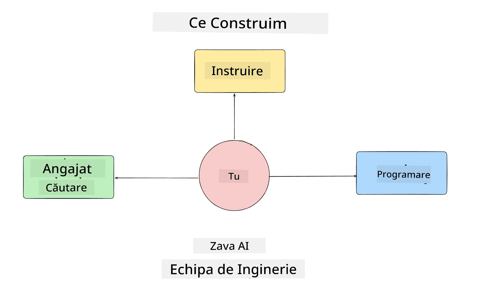
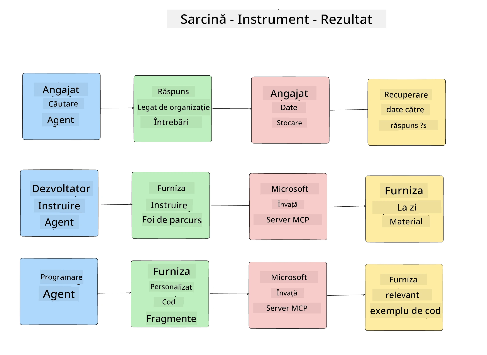
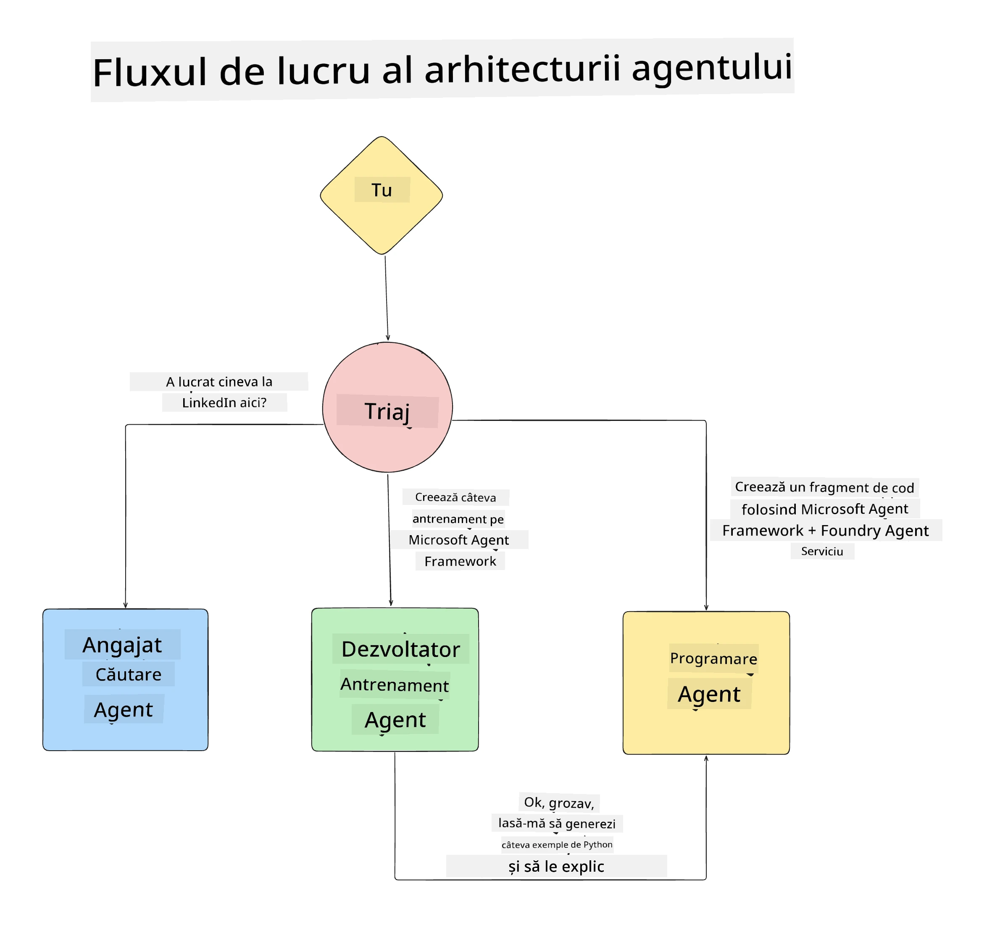

# Lecția 1: Proiectarea Agentului AI

Bine ați venit la prima lecție a cursului "Construirea Agentului AI de la Zero până la Producție"!

În această lecție vom acoperi:

- Definirea a ceea ce sunt Agenții AI
  
- Discutarea aplicației Agent AI pe care o construim  

- Identificarea uneltelor și serviciilor necesare pentru fiecare agent
  
- Arhitectura aplicației noastre Agent
  
Să începem prin definirea a ce este un agent și de ce l-am folosi într-o aplicație.

> **Înainte de a începe cursul.** Această prima lecție este conceptuală — nu există cod de rulat.
> Din [Lecția 2](../lesson-2-agent-development/README.md) înainte, vei avea nevoie de: un **abonament Azure**
> cu acces la **Microsoft Foundry**, un **model GPT-5 din seria** implementat (de exemplu `gpt-5.1` — evită modelele retrase GPT-4o / GPT-4.1), **Python 3.12+**, și **Azure CLI**
> (`az login`). Vezi [Ce Ai Nevoie](../README.md#what-you-need) în README-ul cursului pentru lista completă și linkuri.
> 

## Ce sunt Agenții AI?

Dacă este pentru prima dată când explorezi cum să construiești un Agent AI, este posibil să ai întrebări despre cum se definește exact un Agent AI.

O definiție simplă a ceea ce este un Agent AI bazată pe componentele sale:

**Model de Limbaj Mare** - LLM-ul va alimenta atât capacitatea de a procesa limbaj natural din partea utilizatorului pentru a interpreta sarcina pe care o doresc îndeplinită, cât și pentru a interpreta descrierile uneltelor disponibile pentru a finaliza acele sarcini.

**Unelte** - Acestea vor fi funcții, API-uri, depozite de date și alte servicii pe care LLM-ul le poate alege să le folosească pentru a îndeplini sarcinile cerute de utilizator.

**Memorie** - Acesta este modul în care stocăm interacțiunile atât pe termen scurt, cât și pe termen lung între Agentul AI și utilizator. Stocarea și recuperarea acestei informații este importantă pentru a face îmbunătățiri și pentru a salva preferințele utilizatorului în timp.

## Cazul nostru de utilizare al Agentului AI

Pentru acest curs, vom construi o aplicație Agent AI care ajută dezvoltatorii noi să se integreze în echipa noastră de Dezvoltare Agent AI!

Înainte de a face orice lucru de dezvoltare, primul pas pentru a crea o aplicație Agent AI de succes este definirea unor scenarii clare despre cum ne așteptăm ca utilizatorii noștri să lucreze cu Agenții AI.

Pentru această aplicație, vom lucra cu aceste scenarii:

**Scenariul 1**: Un angajat nou se alătură organizației noastre și dorește să afle mai multe despre echipa la care s-a alăturat și cum să intre în legătură cu ei.

**Scenariul 2:** Un angajat nou dorește să știe care ar fi cea mai bună primă sarcină la care să înceapă să lucreze.

**Scenariul 3:** Un angajat nou dorește să adune resurse de învățare și exemple de cod pentru a-i ajuta să înceapă să îndeplinească această sarcină.

## Identificarea uneltelor și serviciilor

Acum că avem aceste scenarii create, următorul pas este să le mapăm la uneltele și serviciile de care agenții noștri AI vor avea nevoie pentru a finaliza aceste sarcini.

Acest proces intră în categoria Ingineriei Contextului, deoarece ne vom concentra pe asigurarea că Agenții AI au contextul potrivit la momentul potrivit pentru a finaliza sarcinile.

Haideți să facem acest lucru scenariu cu scenariu și să realizăm un design agentic bun listând sarcina, uneltele și rezultatele dorite pentru fiecare agent.

### Scenariul 1 - Agent de Căutare Angajați

**Sarcină** - Răspunde la întrebări despre angajații din organizație, cum ar fi data aderării, echipa curentă, locația și ultima poziție.

**Unelte** - Bază de date cu lista actuală a angajaților și organigrama organizației

**Rezultate** - Capacitatea de a obține informații din baza de date pentru a răspunde la întrebări generale despre organizație și întrebări specifice despre angajați.

### Scenariul 2 - Agent de Recomandare Sarcini

**Sarcină** - Pe baza experienței de dezvoltator a angajatului nou, să găsească 1-3 probleme pe care angajatul nou le poate aborda.

**Unelte** - Serverul GitHub MCP pentru a obține probleme deschise și a construi un profil de dezvoltator

**Rezultate** - Capacitatea de a citi ultimele 5 commit-uri ale unui profil GitHub și problemele deschise pe un proiect GitHub și de a face recomandări bazate pe potrivire

### Scenariul 3 - Agent Asistent de Cod

**Sarcină** - Pe baza problemelor deschise recomandate de Agentul "Recomandare Sarcini", să cerceteze și să ofere resurse și să genereze fragmente de cod pentru a ajuta angajatul.

**Unelte** - Microsoft Learn MCP pentru a găsi resurse și Interpreterul de Cod pentru a genera fragmente de cod personalizate.

**Rezultate** - Dacă utilizatorul cere ajutor suplimentar, fluxul de lucru trebuie să folosească serverul Learn MCP pentru a oferi linkuri și fragmente către resurse, apoi să predea agentului Interpreter de Cod generarea de fragmente mici de cod cu explicații.

## Arhitectura aplicației noastre Agent

Acum că am definit fiecare dintre Agenții noștri, să creăm o diagramă de arhitectură care să ne ajute să înțelegem cum va funcționa fiecare agent împreună și separat, în funcție de sarcină:

## Pașii următori

Acum că am proiectat fiecare agent și sistemul nostru agentic, să trecem la următoarea lecție în care vom dezvolta fiecare dintre acești agenți!

---

<!-- CO-OP TRANSLATOR DISCLAIMER START -->
**Declinare a responsabilității**:
Acest document a fost tradus folosind serviciul de traducere AI [Co-op Translator](https://github.com/Azure/co-op-translator). În timp ce ne străduim pentru acuratețe, vă rugăm să rețineți că traducerile automate pot conține erori sau inexactități. Documentul original în limba sa nativă trebuie considerat sursa autorizată. Pentru informații critice, se recomandă traducerea profesională realizată de un om. Nu ne asumăm responsabilitatea pentru eventualele neînțelegeri sau interpretări greșite care decurg din utilizarea acestei traduceri.
<!-- CO-OP TRANSLATOR DISCLAIMER END -->