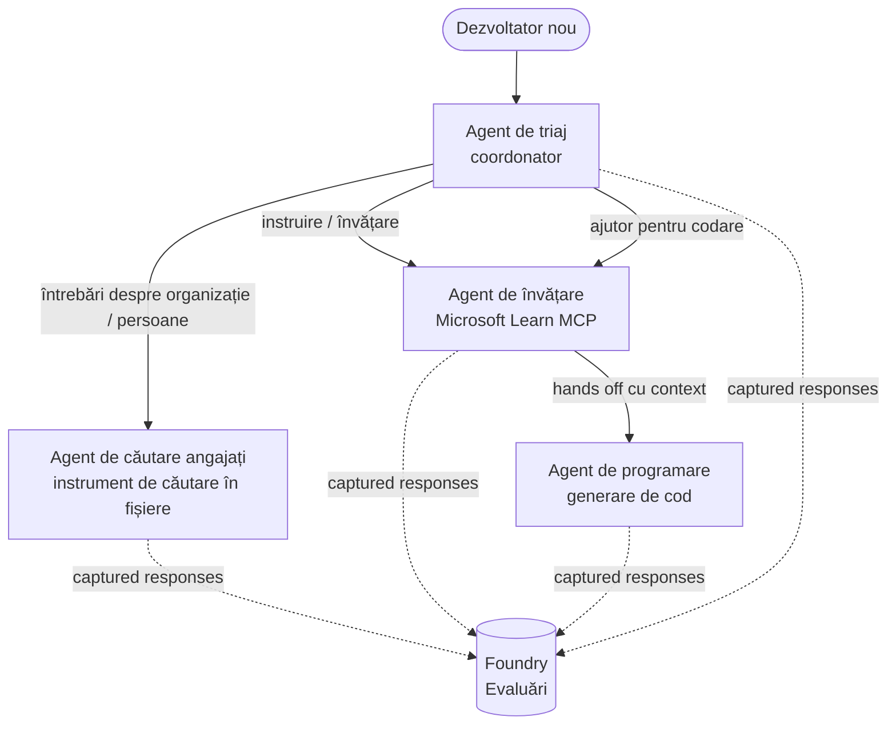

# Lecția 3: Evaluarea Agenților cu Microsoft Foundry

Bun venit la lecția a treia din cursul **„Construirea Agenților AI de la Zero până la Producție”**!

În [Lecția 2](../lesson-2-agent-development/README.md) ai construit agenți. În această lecție vei
învăța cum să răspunzi la o întrebare mult mai dificilă: **sunt ei buni?** Livrarea unui agent care
funcționează este ușoară; a ști dacă direcționează corect, rămâne ancorat în datele tale și folosește
corect uneltele este ceea ce separă un demo de un sistem de producție.

În această lecție vom acoperi:

- De ce contează evaluarea agenților și cum diferă de testarea tradițională
- Diferența dintre **observabilitate**, **teste de fum** și **evaluări**
- Fluxul de lucru multi-agent pe care îl vom măsura
- Evaluatorii încorporați ai **Microsoft Foundry** (relevanță, ancorare, acuratețea apelului de unelte, utilizarea ieșirii din unelte)
- Un ghid pas cu pas al pipeline-ului de evaluare din [`agent-evals.py`](../../../lesson-3-agent-evals/agent-evals.py)
- Cum să rulezi și să citești rezultatele

---

## De ce să evaluăm agenții?

Un test unitar tradițional afirmă că `add(2, 2) == 4`. Agenții nu funcționează așa — același
prompt poate produce o formulare diferită de fiecare dată, uneltele pot fi apelate în ordine diferită, iar
„corect” este adesea o chestiune de grad și nu un boolean. Nu poți afirma pe baza unor șiruri exacte.

În schimb, evaluezi agenții pe diferite **dimensiuni de calitate** folosind *evaluatori* bazați pe modele (numiți și
"LLM-ca-judecător") plus verificări deterministe privind utilizarea uneltelor. Aceasta îți spune lucruri precum:

- Răspunsul a adresat efectiv întrebarea? (**relevanță**)
- Răspunsul este susținut de datele accesate sau agentul a avut halucinații? (**ancorare**)
- Agentul a apelat unealta corectă cu argumentele corecte? (**acuratețea apelului de unelte**)
- Agentul a folosit efectiv ce a returnat unealta? (**utilizarea ieșirii uneltei**)

### Trei straturi complementare de calitate

Acestea nu sunt tehnici concurente — un agent de producție folosește toate trei:

| Strat | Întrebarea la care răspunde | Cost | Când rulează | Acoperit în |
|-------|----------------------------|------|--------------|------------|
| **Observabilitate / trasabilitate** | *Ce a făcut agentul, pas cu pas?* | Gratuit (mereu activ) | Continuu în producție | Această lecție |
| **Teste de fum** | *Agentul este accesibil și urmează promptul de bază?* | Ieftin, câteva secunde | La fiecare implementare | [Lecția 4](../lesson-4-agentdeployment/README.md#smoke-testing-the-hosted-agent-ci-gate) |
| **Evaluări** | *Cât de **bune** sunt răspunsurile?* | Mai lent, consumă model | La cerere / noaptea / înainte de lansare | Această lecție |

Testele de fum răspund „a funcționat?”, evaluările răspund „este bun?”. Ai nevoie de ambele.

---

## Precondiții

1. Ai terminat [Lecția 2](../lesson-2-agent-development/README.md) (agenți + magazin vectorial).
2. Un proiect **Microsoft Foundry**.
3. **Azure CLI** autentificat: `az login`.
4. **Python 3.12+** și dependențele cursului instalate:

   ```bash
   pip install -r ../requirements.txt
   ```

5. Variabile de mediu (creează un fișier `.env` în acest folder sau exportă-le):

   | Variabilă | Scop |
   |----------|---------|
   | `FOUNDRY_PROJECT_ENDPOINT` | Endpoint-ul proiectului Foundry (`https://<account>.services.ai.azure.com/api/projects/<project>`). Citit de `FoundryChatClient` al agenților **și** de helper-ul de evaluare. |
   | `FOUNDRY_MODEL` | Implementarea modelului pe care rulează **agenții** (ex. `gpt-5.1`). |
   | `VECTOR_STORE_ID` | Magazinul vectorial pentru directorul angajaților creat în Lecția 2 |
   | `AZURE_AI_MODEL_DEPLOYMENT_NAME` | Implementarea modelului folosită **de evaluatori** (implicit `FOUNDRY_MODEL`, apoi `gpt-5.1`) |

> Agenții folosesc `FoundryChatClient`, care citește configurația din variabilele prefixate cu `FOUNDRY_`
> (`FOUNDRY_PROJECT_ENDPOINT`, `FOUNDRY_MODEL`). Helper-ul de evaluare cloud
> folosește SDK-ul `azure-ai-projects` și va folosi `FOUNDRY_PROJECT_ENDPOINT` dacă
> `AZURE_AI_PROJECT_ENDPOINT` nu este setat — deci cele două variabile `FOUNDRY_` sunt suficiente pentru
> a rula toată lecția.
>
> Evaluatorii sunt ei înșiși alimentați de un model, așa că `AZURE_AI_MODEL_DEPLOYMENT_NAME`
> controlează ce implementare face judecata — nu trebuie să fie același model pe care îl
> folosesc agenții tăi.

---

## Fluxul de lucru pe care îl evaluăm

Pentru a evalua ceva, mai întâi trebuie să îl rulezi. Această lecție reutilizează fluxul multi-agent **Developer Onboarding**:
un coordonator de **triere** pasează apoi către trei specialiști.



Fluxul este construit cu orchestrarea **handoff** din Microsoft Agent Framework. Ideea principală
pentru evaluare este că **fiecare pas al agentului este salvat pe server** și identificat printr-un
`response_id`. Aceste ID-uri sunt trimise serviciului de evaluare.

---

## Pipeline-ul de evaluare, pas cu pas

[`agent-evals.py`](../../../lesson-3-agent-evals/agent-evals.py) implementează un pipeline în șase pași. Iată ce face fiecare pas
și de ce.

### Pasul 1 — Rularea fluxului și urmărirea ID-urilor de răspuns

Fluxul rulează cu `run_stream(...)`, iar pe măsură ce evenimentele revin codul înregistrează
`response_id` și `conversation_id` produse de fiecare agent. Răspunsurile salvate sunt materialul brut
pentru evaluare — evaluezi răspunsuri *reale* în formă de producție, nu re-generate.


### Pasul 2 — Rezumarea a ceea ce a fost capturat

Un sumar rapid afișează câte răspunsuri a produs fiecare agent, așa poți confirma că fluxul de lucru
a folosit agenții pe care intenționezi să îi evaluezi.

### Pasul 3 — Preluarea ultimelor răspunsuri

Pentru fiecare agent, ultimul `response_id` este preluat prin clientul compatibil OpenAI al proiectului
(`project_client.get_openai_client().responses.retrieve(...)`) ca să poți previzualiza
textul care va fi judecat.

### Pasul 4 — Crearea evaluării

Se creează o evaluare cu patru **evaluatori încorporați Foundry**:

| Evaluator | `evaluator_name` | Ce măsoară |
|-----------|------------------|-------------|
| Relevanță | `builtin.relevance` | Răspunsul adresează cererea utilizatorului? |

| Soliditate | `builtin.groundedness` | Răspunsul este susținut de date preluate/unelte (nu este halucinat)? |
| Acuratețea apelurilor uneltei | `builtin.tool_call_accuracy` | Au fost apelate uneltele corecte cu argumentele corecte? |
| Utilizarea rezultatelor uneltei | `builtin.tool_output_utilization` | Agentul a folosit efectiv rezultatele uneltei în răspunsul său? |

Fiecare evaluator este inițializat cu implementarea numită prin `AZURE_AI_MODEL_DEPLOYMENT_NAME`.

> **De ce aceste patru?** Relevanța și soliditatea măsoară *calitatea răspunsului*; cei doi evaluatori de unelte
> măsoară *comportamentul agentic* — partea pe care metricile NLP tradiționale o ratează complet. Pentru un
> sistem multi-agent care folosește unelte, metricile uneltelor sunt adesea locul unde se ascund regresiile reale.

### Pasul 5 — Rulează evaluarea

ID-urile `response_id` capturate sunt transmise la `evals.runs.create(...)` ca sursă de date. Serviciul
redă fiecare răspuns stocat prin fiecare evaluator.

### Pasul 6 — Monitorizează și citește rezultatele

Codul interoghează rularea până când este `completed` sau `failed`, apoi afișează numărul de rezultate și un
**`report_url`** — un link detaliat în portalul Foundry unde poți inspecta scorurile per metrică,
numărul de treceri/eșecuri și răspunsurile individuale judecate.

---

## Rulează-l

```bash
cd lesson-3-agent-evals
python agent-evals.py
```

Implicit evaluează primul exemplu de interogare
(`"Sunt nou aici! A lucrat cineva aici la Microsoft?"`). Alte două exemple de interogări multi-intenție
sunt incluse în `run_evaluation_workflow()` — schimbă variabila `query` pentru a încerca scenarii de rutare
care antrenează mai mulți agenți într-o singură rulare.

Fluxul așteptat în consolă:

```
Step 1: Running Developer Onboarding Workflow
Step 2: Response Data Summary
Step 3: Fetching Agent Responses
Step 4: Creating Evaluation
Step 5: Running Evaluation
Step 6: Monitoring Evaluation
  Status: running ...
  Evaluation completed successfully
  Report URL: https://...   <-- open this in the Foundry portal
```

---

## Observabilitate și trasare

Evaluările îți spun *cât de bune* au fost răspunsurile; **observabilitatea** îți spune *ce s-a întâmplat*
pentru a le produce — fiecare salt al agentului, apelul uneltei, numărul de tokeni și latența. În Microsoft Foundry,
rulările agentului emit urmăririle OpenTelemetry pe care le poți vizualiza în portal, iar cadrul Agent poate
să le exporte către Azure Monitor / Application Insights cu un singur apel:

```python
from agent_framework.foundry import FoundryChatClient

client = FoundryChatClient()
client.configure_azure_monitor()   # exportă urme + metrici către Application Insights
```

Folosește trasarea pentru a **depana** un scor slab la evaluare: când scade soliditatea, trasarea îți arată
dacă unealta de căutare fișier a returnat nimic sau a returnat date pe care agentul le-a ignorat (exact ce
e evaluat de utilizarea rezultatelor uneltei).

---

## De la "rulează" la "bun": cum să folosești asta în practică

- **Poarta pre-lansare.** Rulează evaluări pe un set fix de interogări reprezentative înainte să
  promovezi un nou prompt sau model. Compară scorurile cu versiunea precedentă — consideră o scădere ca o
  regresie.
- **Semnal de calitate nocturnă.** Programează evaluarea pentru a detecta derapaje cauzate de modificări
  ale datelor sau dependențelor.
- **Combină cu teste rapide.** [Testul rapid din Lecția 4](../lesson-4-agentdeployment/README.md#smoke-testing-the-hosted-agent-ci-gate) 
  este poarta ta rapidă per implementare; evaluările sunt poarta mai lentă, mai profundă de calitate. Rulează
  testul ieftin la fiecare fuziune și pe cel scump programat sau înainte de lansare.

---

## Notă de modernizare

Acest exemplu este migrat către suprafața API curentă Microsoft Agent Framework Foundry
(`agent_framework.foundry`). Dacă actualizezi codul, vezi rădăcina depozitului

[`MIGRATION-GUIDE.md`](../MIGRATION-GUIDE.md) pentru importul verificat înainte/după și clientul
mapări (de exemplu `AzureAIClient` -> `FoundryChatClient`, și construcția uneltei gazduite prin
`client.get_file_search_tool(...)` / `client.get_mcp_tool(...)`). Conceptele de evaluare și
fluxul în șase pași de mai sus rămân neschimbate prin această migrare.

---

## Resurse

- [Evaluarea modelelor și aplicațiilor AI generative (Microsoft Learn)](https://learn.microsoft.com/en-us/azure/ai-foundry/concepts/evaluation-approach-gen-ai)
- [Evaluatorii încorporați pentru AI generativă](https://learn.microsoft.com/en-us/azure/ai-foundry/concepts/evaluation-evaluators/agent-evaluators)
- [Observabilitate în Microsoft Foundry](https://learn.microsoft.com/en-us/azure/ai-foundry/concepts/observability)
- [Microsoft Agent Framework](https://github.com/microsoft/agent-framework)
- [Orchestrarea predării agentului](https://learn.microsoft.com/en-us/agent-framework/workflows/orchestrations/handoff)

---

<!-- CO-OP TRANSLATOR DISCLAIMER START -->
**Declinare a responsabilității**:
Acest document a fost tradus folosind serviciul de traducere AI [Co-op Translator](https://github.com/Azure/co-op-translator). În timp ce ne străduim pentru acuratețe, vă rugăm să rețineți că traducerile automate pot conține erori sau inexactități. Documentul original în limba sa nativă trebuie considerat sursa autorizată. Pentru informații critice, se recomandă traducerea profesională realizată de un om. Nu ne asumăm responsabilitatea pentru eventualele neînțelegeri sau interpretări greșite care decurg din utilizarea acestei traduceri.
<!-- CO-OP TRANSLATOR DISCLAIMER END -->